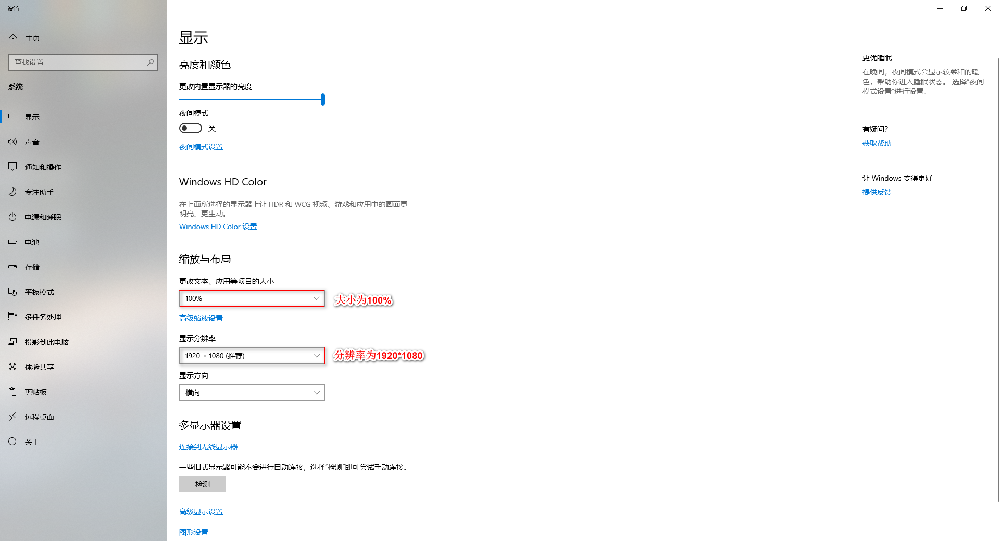
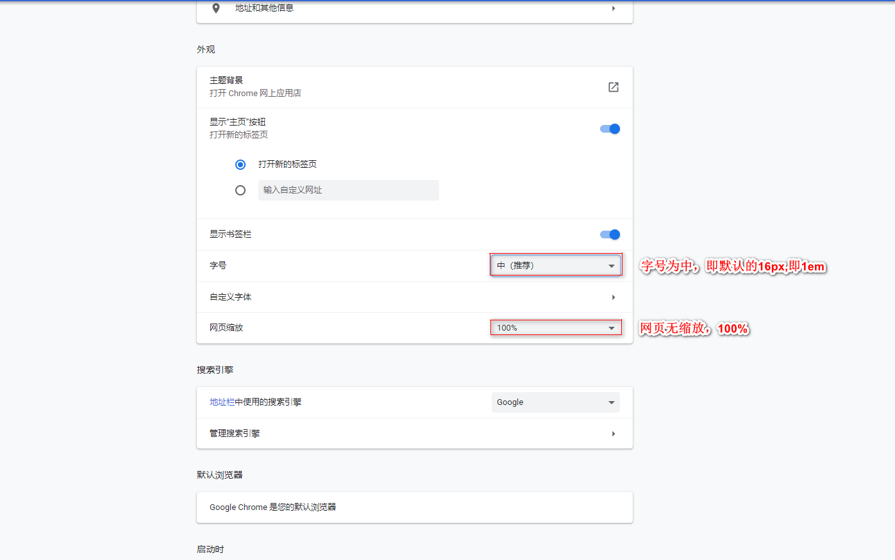
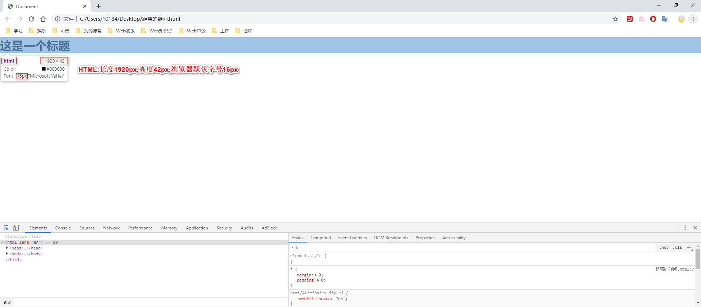
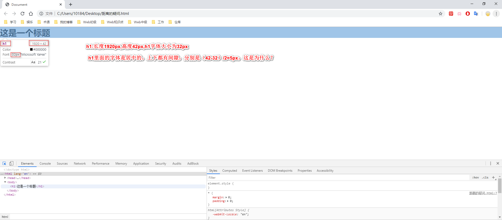

(注1：这是我写的第一篇博文，现在是2020年8月8月，已经过去了10个月了，今天写面试题博客的时候看到了介绍line-height的比较好的文章，特此添上。)

[CSS深入理解之line-height](https://www.cnblogs.com/yerenyuan/p/5350948.html)

# 初始条件

* 自己用的是Win10系统
* 为了测试，右击显示设置，将大小改为100%，分辨率为1920*1080



* Google浏览器将默认字体改为16px并且无缩放：

  

h1-h6的默认字号为：

| 标题 | 默认字号          |
| ---- | ----------------- |
| h1   | 32px（2em）       |
| h2   | 24px（1.5em）     |
| h3   | 18.72px（1.17em） |
| h4   | 16px（1em）       |
| h5   | 13.28px（0.83em） |
| h6   | 10.72px（0.67em） |

# 初始检测

``` html
<!DOCTYPE html>
<html lang="en">
<head>
	<meta charset="UTF-8">
	<title>Document</title>
	<style>
		*{
			margin: 0;
			padding: 0;
           /*内外边距全部设置为0，以取消边距的干扰*/
		}
	</style>
</head>
<body>
	<h1>这是一个标题</h1>
</body>
</html>
```





> 这个代码只是设置了一下内外边距都是0，其他的什么都没有往里加。就出现了10像素的差异，这个我还不知道是为什么。

``` 
接下来要往里加的有：
1.h1的高度height
2.line-height
3.font-size的大小调整
```

---未完待续 2019.12.23暂停。