（注：现在都2020年2月中旬了，CSS已经有2个月没有看了，现在开始查漏补缺，汇总一下看视频时讲到的小案例，通过案例来进行知识的巩固）

# 案例1：表格初始

## 最终效果

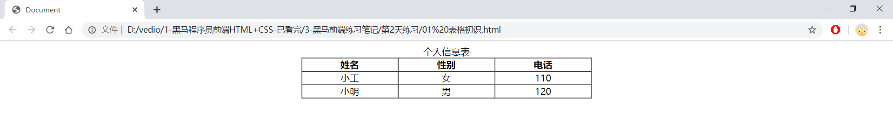

## 独立手写

~~~html
<!DOCTYPE html>
<html lang="en">
<head>
	<meta charset="UTF-8">
	<title>个人信息表</title>
	<style>
		table{
			text-align: center;

			align: center;
			/*显示未知的属性，用不了*/

			border:1px solid black;
			/*不知道怎么让表格居中，查了资料后发现用margin: 0 auto*/

			cellspacing: 0;
			/*显示未知的属性，用不了*/
			cellpadding: 0;
			/*显示未知的属性，用不了*/
		}
		
		td{
			text-align: center;
			width: 200px;
			height: 100px;
		}
	</style>
</head>
<body>
	<table>
		<caption>个人信息表</caption>
		<th>
			<td>姓名</td>
			<td>性别</td>
			<td>电话</td>
		</th>

		<tr>
			<td>小王</td>
			<td>女</td>
			<td>110</td>
		</tr>

		<tr>
			<td>小明</td>
			<td>女男</td>
			<td>120</td>
		</tr>
	</table>
</body>
</html>
~~~

不知道为什么会显示成这样：

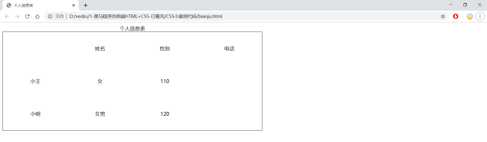

## 答案

~~~html
<!DOCTYPE html>
<html lang="en">
<head>
	<meta charset="UTF-8">
	<title>Document</title>
</head>
<body>
	<!-- cellspacing 单元格和单元格之间的距离 -->
	<!-- cellpadding 单元格内容和单元格边框之间的距离 -->
	<!-- 一般是三参为0    border  cellpadding  cellspacing  为  0 -->
	<table width="500" border="1" align="center" cellspacing="0" cellpadding="0">
		<caption>个人信息表</caption>   <!-- 表格的标题 -->
		<tr>
			<th align="center">姓名</th>   
            <!-- 加上align="center"可以让文字居中对齐 还是用CSS好，这样很重复-->
			<th align="center">性别</th>
			<th align="center">电话</th>
		</tr>

		<tr>
			<td align="center">小王</td>
			<td align="center">女</td>
			<td align="center">110</td>
		</tr>

		<tr>
			<td align="center">小明</td>
			<td align="center">男</td>
			<td align="center">120</td>
		</tr>
		
	</table>
</body>
</html>
~~~


# 案例2：青春不常在，抓紧谈恋爱

## 最终效果

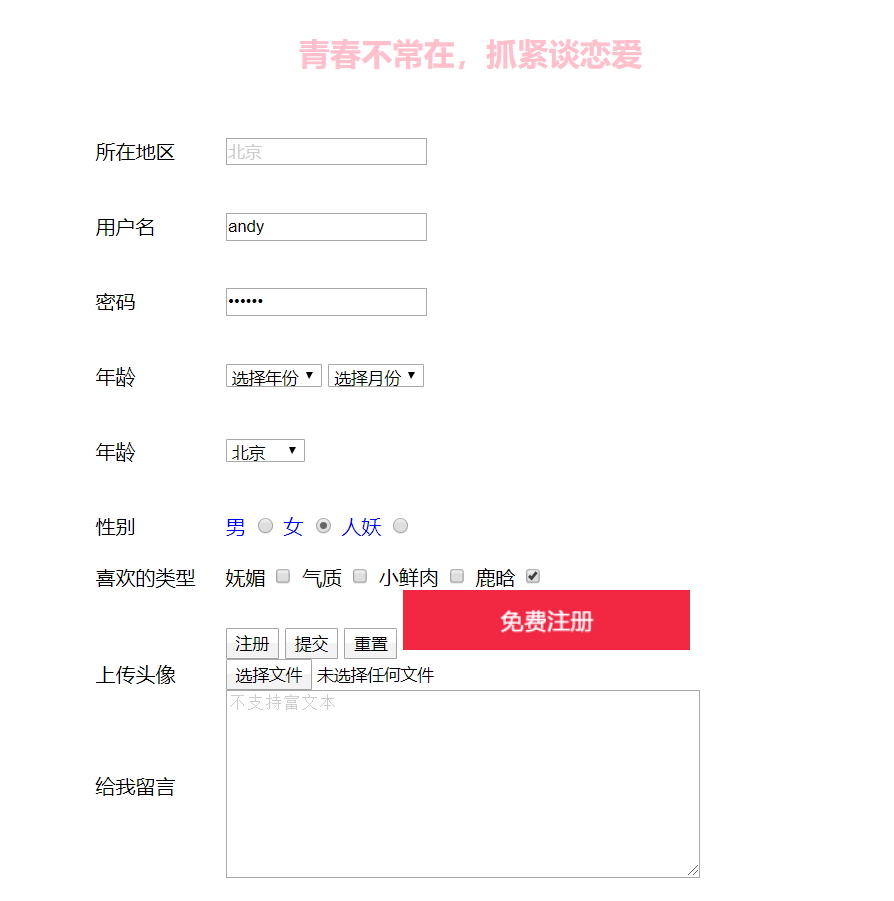

## 独立手写1.0（失败）

~~~javascript
<!DOCTYPE html>
<html lang="en">

<head>
  <meta charset="UTF-8">
  <title>世纪佳缘</title>
  <style>
    #title {
      text-align: center;
      font-size: 25px;
      color: pink;
      margin-top: 60px;
      font-family: yaHei;
      font-weight: 700;
    }

    span {
      display: inline-block;
      text-align: center;
      /* 不知道怎么居中显示，就硬把它和左边产生距离了 */
      margin-left: 500px;
      margin-top: 50px;
    }
  </style>
</head>

<body>
  <div id="title">青春不常在，抓紧谈恋爱</div>
  <div id="body">

    <span>所在地区：<input type="text" value="北京" color:grey></span>
    <span>用户名：<input type="text" value="andy"></span>

  </div>
</body>

</html>
~~~

## 遇到的问题及不足

~~~
1.无法将所在地区，用户名等居中，text-align:center使用无效
2.text-align:center的使用前提及使用范围是什么？对这个属性不熟
3.没有想起来用tr td,就硬写，写不出来
~~~

## 独立手写2.0（失败）

大体看了一下答案是怎么写的，现在自己开始复原。

~~~javascript
<!DOCTYPE html>
<html lang="en">

<head>
  <meta charset="UTF-8">
  <title>Document</title>
  <style>
    td {
      margin-left: 200px;
    }
  </style>
</head>

<body>
  <table style="width: 1500px; text-align: center; ">
    <caption style="font-size: 25px; color:pink; font-weight:700; margin-top: 50px;">青春不常在，抓紧谈恋爱</caption>
    <tbody>
      <tr style="margin-left: 250px;">
        <td>所在地区</td>
        <td><input type="text" value="北京"></td>
      </tr>
      <tr>
        <td>用户名</td>
        <td><input type="text" value="andy"></td>
      </tr>
      <tr>
        <td>密码</td>
        <td><input type="password" value="******"></td>
      </tr>
      <tr>
        <td>年龄</td>
        <td>
          <select name="" id="">
            <option value="">选择年份</option>
            <option value="">1995</option>
            <option value="">1994</option>
          </select>
          <select name="" id="">
            <option value="">选择月份</option>
            <option value="">1月</option>
            <option value="">2月</option>
          </select>
        </td>
      </tr>

      <tr>
        <td>籍贯</td>
        <td>
          <select name="" id="">
            <option value="">安徽</option>
            <option value="">湖北</option>
          </select>
        </td>
      </tr>

      <tr>
        <td>性别</td>
        <td>男<input type="radio"></td>
        <td>女<input type="radio"></td>
      </tr>

      <tr>
        <td>喜欢的类型</td>
        <td>活泼<input type="checkbox"></td>
        <td>贤惠<input type="checkbox"></td>
      </tr>

      <tr>
        <td>上传头像</td>
        <td><button>注册</button></td>
        <td><button>提交</button></td>
        <td><button>重置</button></td>
        <td><input type="image" src="btn.png"></td>
        <td>选择文件</td>
        <td><input type="file"></td>
      </tr>

      <tr>
        <td>给我留言</td>
        <td><input type="textarea" value="不支持富文本" maxlength="140"></td>
      </tr>
    </tbody>

  </table>
</body>

</html>
~~~

最后显示出来的是这个鬼：（格式什么的完全不知道怎么调。。。。。。）

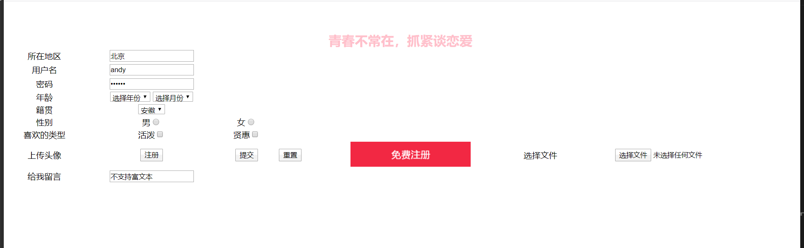

## 答案

~~~css
<!DOCTYPE html>
<html lang="en">

<head>
	<meta charset="UTF-8">
	<title>世纪佳缘</title>
	<style>
		/*table {
			width: 1000px;
			 表格宽1000，不用设置高
			border: 0;
			 表格无边框 
			cellspacing: 0;
			 单元格与单元格边框距离为0（默认为2px） 
			cellpadding: 0;
			 单元格内容与单元格边框距离为0（默认为1px） 
			align: center;
			 表格在网页中居中对齐(内部样式失败，不居中，之能写行内式)
		}*/
		h3{
			color:pink;
			font-size: 25px;
		}
		tr{	
			height: 60px;
			/*tr没有给宽，td宽和高都没给*/
		}
	</style>
</head>

<body>
	<table width="1000" border="0" cellspacing="0" cellpadding="0" align="center">
		<!-- 首先来个table，定个总基调 -->
		<caption><h3>青春不常在，抓紧谈恋爱</h3></caption>
		<tr>
			<td>所在地区</td>
			<td><input type="text" value="北京" style="color:#ccc"></td>
		</tr>
		<tr>
			<td>用户名</td>
			<td><input type="text" value="andy"></td>
		</tr>

		<tr>
			<td>
				<!-- label 标签为 input 元素定义标注（标签）。 -->
				<label for="mima">密码</label>
			</td>
			<td>
				<input type="password" value="123456" maxlength="6" id="mima">
			</td>
		</tr>

		<!-- 以下是年龄 -->
		<tr>
			<td>年龄</td>
			<td>
				<select name="" id="">
					<option value="">选择年份</option>
					<option value="">1990</option>
					<option value="">1991</option>
					<option value="">1992</option>
					<option value="">1993</option>
					<option value="">1994</option>
					<option value="">1995</option>
					<option value="">1996</option>
					<option value="">1997</option>
					<option value="">1998</option>
					<option value="">1999</option>
				</select>

				<select name="" id="">
					<option value="">选择月份</option>
					<option value="">1月</option>
					<option value="">2月</option>
					<option value="">3月</option>
					<option value="">4月</option>
					<option value="">5月</option>
					<option value="">6月</option>
					<option value="">7月</option>
					<option value="">8月</option>
					<option value="">9月</option>
					<option value="">10月</option>
					<option value="">11月</option>
					<option value="">12月</option>
				</select>
			</td>
		</tr>

		<!-- 以下是籍贯 -->
		<tr>
			<td>籍贯</td>
			<td>
				<select name="" id="">
					<option value="">安徽</option>
					<option value="">湖南</option>
					<option value="">河北</option>
					<option value="">陕西</option>
					<option value="">山东</option>
				</select>
			</td>
		</tr>

		<!-- 以下是性别 -->
		<tr>
			<td>性别</td>
			<td style="color:blue;">
				男<input type="radio">
				女<input type="radio">
			</td>
		</tr>

		<!-- 以下是登陆、注册按钮 -->
		<tr>
			<td></td>
			<td>
				<input type="button" value="注册">
				<input type="submit" value="提交">
				<input type="reset" value="重置">
				<input type="image" src="images/btn.png">
			</td>
		</tr>

		<!-- 以下是上传图像 -->
		<tr>
			<td>上传图像</td>
			<td><input type="file"></td>
		</tr>

		<!-- 以下是给我留言 -->
		<tr>
			<td>给我留言</td>
			<td>
				<textarea name="" id="" cols="50" rows="10" style="color:#ccc">
					不支持富文本
				</textarea>
			</td>
		</tr>
	</table>
</body>

</html>
~~~

## 事后总结

~~~javascript
19年8月份学的CSS,基础知识已经学完了，感觉还行，讲的大体上能听懂，可是还是代码写的太少了。以前视频里的案例，完全不看答案，纯手写，发现基本的结构居然写不出来，还是眼高手低了，CSS还要多练啊，起码基础知识要掌握纯熟了，要达到基本的结构闭眼就能写的地步啊。
~~~

## 进阶：世纪佳缘原版网页

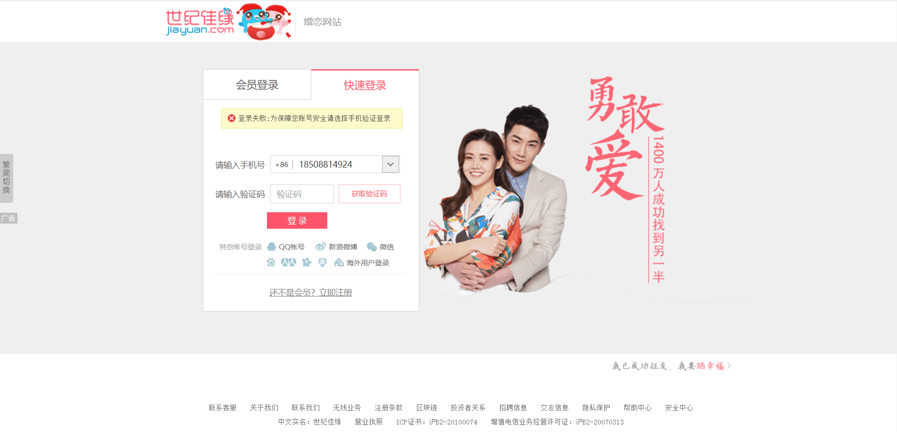


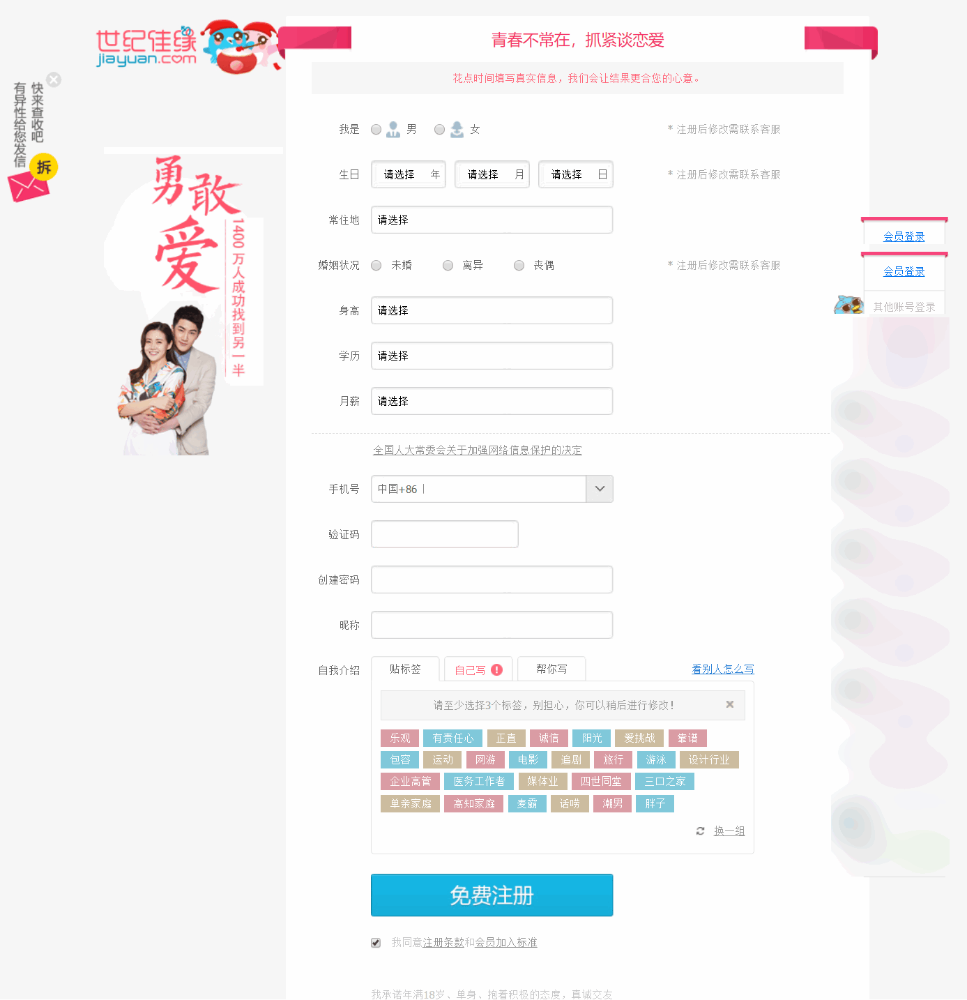

# 案例3：谷歌图标

## 最终效果

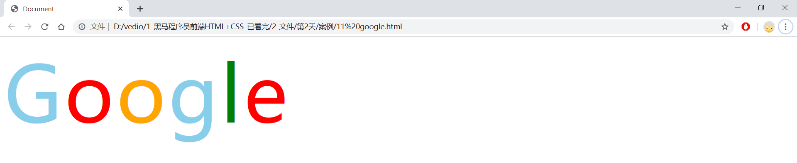

## 答案

~~~javascript
<!DOCTYPE html>
<html lang="en">
<head>
	<meta charset="UTF-8">
	<title>Document</title>
	<style> /*千万别忘了它*/
		span {  /*标签选择器 让所有的span 都变成 150 */
			font-size: 150px;
		}
		.g { 
			color: skyblue;
		}
		.o {
			color: red;
		}
		.oo {
			color: orange;
		}
		.l {
			color: green;
		}
	/* 类选择器  可以选择 一个 或者 多个 标签*/
	</style>
</head>
<body>
	<span class="g">G</span>
	<span class="o">o</span>
	<span class="oo">o</span>
	<span class="g">g</span>
	<span class="l">l</span>
	<span class="o">e</span>
</body>
</html>
~~~

# 案例4：微博新闻

## 最终效果

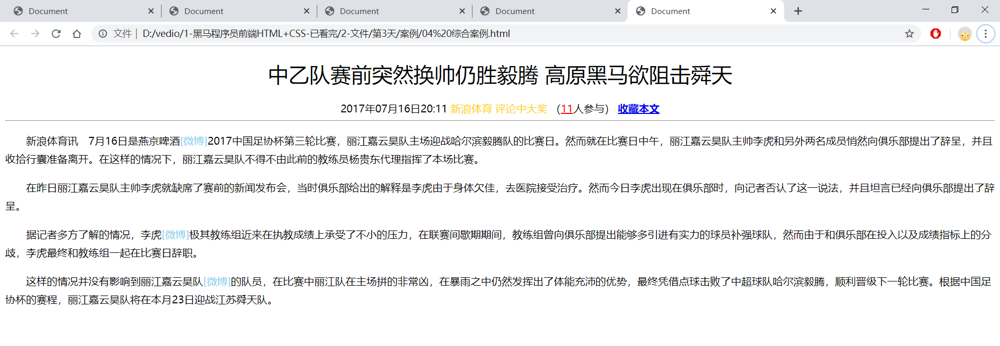

## 答案

~~~css
<!DOCTYPE html>
<html lang="en">
<head>
	<meta charset="UTF-8">
	<title>Document</title>
	<style>
	* {
		/*font-family: "微软雅黑";*/
		font-family: "microsoft yahei",  Arial;
		/*font-family: Arial;*/
	}
	p {
		font-size: 16px;  /*千万别忘了带px 单位*/
		line-height: 28px;  /*  行高  行与行之间的距离*/  
		text-indent: 2em;  /*段落首行缩进2个字  em  也是一个单位  1em 就是一个字的距离 */
	}
	a {
		/*font-weight: bold;    字体加粗*/
		font-weight: 700;  /* 700 没有单位  ==  bold  */  
	}
	h1 {
		/*font-weight: normal;  让粗体不加粗思密达*/
		font-weight: 400;  /*让粗体不加粗思密达  400 == normal 建议用数值*/
		text-align: center; /*让h1 里面的文字水平居中*/
	}
	em {
		color: skyblue;
		font-style: normal;  /*让斜体不倾斜*/
	}
	span {
		/*color: #ff0000;*/
		color: #FDD000;
	}
	div {
		text-align: center;
	}
	.nub {
		color: #f00;
		font-weight: 400;  /*不加粗*/
	}
	</style>
</head>
<body>
	<h1>中乙队赛前突然换帅仍胜毅腾 高原黑马欲阻击舜天</h1>

<div>2017年07月16日20:11 <span>新浪体育 评论中大奖</span> （<a href="#" class="nub">11</a>人参与） <a href="#">收藏本文</a></div>
<hr />
<p>新浪体育讯　7月16日是燕京啤酒<em>[微博]</em>2017中国足协杯第三轮比赛，丽江嘉云昊队主场迎战哈尔滨毅腾队的比赛日。然而就在比赛日中午，丽江嘉云昊队主帅李虎和另外两名成员悄然向俱乐部提出了辞呈，并且收拾行囊准备离开。在这样的情况下，丽江嘉云昊队不得不由此前的教练员杨贵东代理指挥了本场比赛。</p>
<p>
在昨日丽江嘉云昊队主帅李虎就缺席了赛前的新闻发布会，当时俱乐部给出的解释是李虎由于身体欠佳，去医院接受治疗。然而今日李虎出现在俱乐部时，向记者否认了这一说法，并且坦言已经向俱乐部提出了辞呈。</p>

<p>据记者多方了解的情况，李虎<em>[微博]</em>极其教练组近来在执教成绩上承受了不小的压力，在联赛间歇期期间，教练组曾向俱乐部提出能够多引进有实力的球员补强球队，然而由于和俱乐部在投入以及成绩指标上的分歧，李虎最终和教练组一起在比赛日辞职。</p>

<p>这样的情况并没有影响到丽江嘉云昊队<em>[微博]</em>的队员，在比赛中丽江队在主场拼的非常凶，在暴雨之中仍然发挥出了体能充沛的优势，最终凭借点球击败了中超球队哈尔滨毅腾，顺利晋级下一轮比赛。根据中国足协杯的赛程，丽江嘉云昊队将在本月23日迎战江苏舜天队。</p>
</body>
</html>
~~~

# 案例5：字体连写(知识点)

~~~css
<!DOCTYPE html>
<html lang="en">
<head>
	<meta charset="UTF-8">
	<title>Document</title>
	<style>
	h1 {
		/*font-size: 25px;
		font-family: "宋体";
		font-weight: 400;*/
		

	}
	/*选择器{font: font-style  font-weight  font-size/line-height  font-family;}*/
	h1 {
		/*font: 400 25px "宋体";*/
		font: italic 700 100px "微软雅黑";   /*斜粗大体，前两个可以没有，后面两个（大体）必须有*/
	}
	</style>
</head>
<body>
	<h1>字体连写是有顺序的</h1>
</body>
</html>

<!-- font:综合设置字体样式 (重点)
font属性用于对字体样式进行综合设置，其基本语法格式如下：
选择器{font: font-style(字体风格-斜体)  font-weight（加粗）  font-size/line-height（大小，行高）  font-family（字体-宋体）;}  斜粗大体
使用font属性时，必须按上面语法格式中的顺序书写，不能更换顺序，各个属性以空格隔开。
注意：其中不需要设置的属性可以省略（取默认值），但必须保留font-size和font-family属性(必须保证"大体！！！")，否则font属性将不起作用。 -->
~~~

# 案例6：文本修饰

~~~css
<!DOCTYPE html>
<html lang="en">
<head>
	<meta charset="UTF-8">
	<title>Document</title>
	<style>
	div {
		 font-size: 40px;
		  /*text-decoration: none;  取消装饰*/
		  /*text-decoration: underline; 下划线*/
		  /*text-decoration: overline; 上划线*/
		  /*text-decoration: line-through;  删除线*/
		  font-style: italic;
	}

	s {
		text-decoration: none; /* 取消删除线*/
	}

     em {
     	font-style: normal;  
     }
     strong {
     	font-weight: 400;
     }
     ins {
     	text-decoration: none;
     }
	</style>
</head>
<body>
	<div>装饰自己</div>

	<s>现价：188</s>
	<del>现价：188</del>	<!-- 删除线：s del -->
	<br/>

	<em>倾斜</em>  
	<i>倾斜</i>         <!-- 倾斜：em i -->
	<br/>

	<strong>加粗</strong> 
	<b>加粗</b>			<!-- 加粗： strong b -->
	<br/>

	<ins>下划线</ins>	
	<u>下划线</u>		<!-- 下划线：ins u -->
</body>
</html>
~~~

# 案例7：选择器应用

```html
<div class="nav">    <!-- 主导航栏 -->
  <ul>
   		<li><a href="#">公司首页</a></li>
		<li><a href="#">公司简介</a></li>
		<li><a href="#">公司产品</a></li>
		<li>
         	<a href="#">联系我们</a>
  		 	<ul>
		    	<li><a href="#">公司邮箱</a></li>
		    	<li><a href="#">公司电话</a></li>
		 	</ul>
		</li>
  </ul>
</div>

<div class="sitenav">    <!-- 侧导航栏 -->
<div class="site-l">左侧侧导航栏</div>
<div class="site-r"><a href="#">登录</a></div>
</div>
```

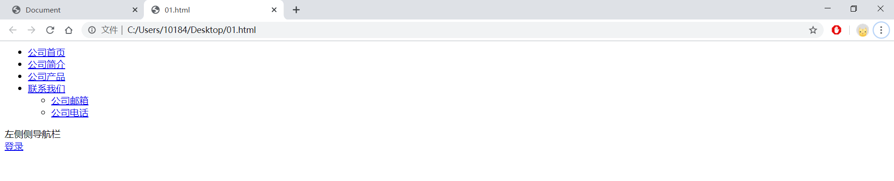

在不修改以上代码的前提下，完成以下任务：

1. 链接 登录 的颜色为红色,同时主导航栏里面的所有的链接改为橙色     (简单)

2. 主导航栏和侧导航栏里面文字都是14像素并且是微软雅黑。（中等)

3. 主导航栏里面的一级菜单链接文字颜色为绿色。（难)

## 最终效果

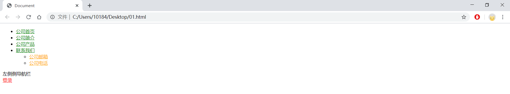

## 答案

~~~css
<!DOCTYPE html>
<html lang="en">
<head>
	<meta charset="UTF-8">
	<title>Document</title>
	<style>
		.site-r > a{
			color:red;
		}

		.nav  a{
			color:orange;
		}

		.nav,.sitenav{
			font-size:14px;
			font-family: Microsoft YaHei;
		}

		.nav > ul > li > a{
			color:green;
		}
	</style>
</head>
<body>
	<div class="nav">    <!-- 主导航栏 -->
  		<ul>
    		<li><a href="#">公司首页</a></li>
			<li><a href="#">公司简介</a></li>
			<li><a href="#">公司产品</a></li>
			<li>
         		<a href="#">联系我们</a>
		 		<ul>
		    		<li><a href="#">公司邮箱</a></li>
		    		<li><a href="#">公司电话</a></li>
		 		</ul>
			</li>
  		</ul>
	</div>

	<div class="sitenav">    <!-- 侧导航栏 -->
		<div class="site-l">左侧侧导航栏</div>
		<div class="site-r"><a href="#">登录</a></div>
	</div>
</body>
</html>
~~~

# 案例8：伪类链接

~~~css
<!DOCTYPE html>
<html lang="en">
<head>
	<meta charset="UTF-8">
	<title>Document</title>
	<style>
	a:link {  /* 未访问过的连接状态*/
		color: #3c3c3c;
		font-size: 25px;
		text-decoration: none;  /*取消下划线*/
		font-weight: 700;
	}

	a:visited {  /*这个链接我们已经点过的样子  已访问过链接*/
		color: orange;
	}

	a:hover {  /*鼠标经过连接时候的样子*/
		color: #f10215;
	}

	a:active {  /*鼠标按下时候的样子*/
		color: green;
	}

	</style>
</head>
<body>
	<a href="http://www.asdf12312312312312.com">秒杀</a>
</body>
</html>
~~~

# 案例9：元素的显示模式

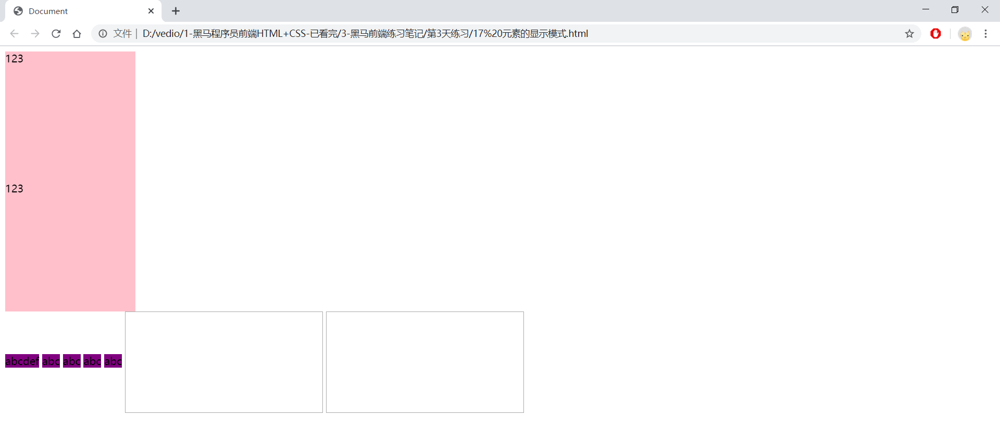

~~~css
<!DOCTYPE html>
<html lang="en">
<head>
	<meta charset="UTF-8">
	<title>Document</title>
	<style>
		div{
			width:  200px;
			height: 200px;
			background-color: pink;
		}
		span{
			width: 100px;   /*设置无效*/
			height: 100px;  /*设置无效*/
			background-color: purple;
		}
		input{
			width: 300px;   /*行内块元素,设置有效*/
			height: 150px;
		}
	</style>
</head>
<body>
	<div>123</div>
	<div>123</div>
	<span>abcdef</span>
	<span>abc</span>
	<span>abc</span>
	<span>abc</span>
	<span>abc</span>
	<input type="text">
	<input type="text">
</body>
</html>
~~~

# 案例10：元素显示模式转换

~~~
要求：
1.写 三个 div  给定 80 * 80 的红色盒子   
2.三个 span   也要求  100 * 100 绿色盒子 
3.三个  a 链接   80 * 20  蓝色 盒子  要求 必须一行显示 这三个盒子
4.鼠标经过3个a链接的时候， 背景颜色变为  橙色   
~~~

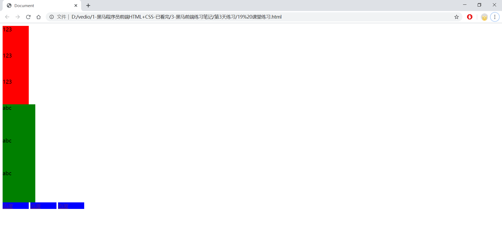

~~~html
<!DOCTYPE html>
<html lang="en">
<head>
	<meta charset="UTF-8">
	<title>Document</title>
	<style>
		div{
			width: 80px;
			height: 80px;
			background-color: red;
		}

		span{
			width: 100px;
			height: 100px;
			background-color: green;
			display: block;
		}

		a{
			width: 80px;
			height:20px;
			background-color: blue;
			display: inline-block;
		}
		a:hover{
			background-color: orange;
		}
	</style>
</head>
<body>
	<div>123</div>
	<div>123</div>
	<div>123</div>
	<span>abc</span>
	<span>abc</span>
	<span>abc</span>
	<a href="#">百度</a>
	<a href="#">百度</a>
	<a href="#">百度</a>
</body>
</html>
~~~

# 案例11：尖角导航栏

## 最终效果

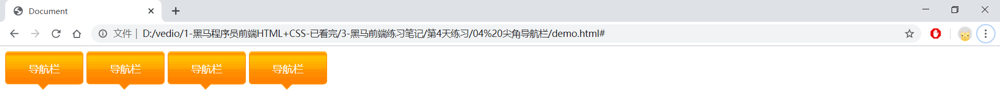

## 独立手写

~~~css
<!DOCTYPE html>
<html lang="en">
<head>
	<meta charset="UTF-8">
	<title>Document</title>
	<style>
		body{
			background-color: #fff;
		}
		div{
			display: inline-block;
			background-image: url(images/bg1.png);
			width: 120px;
			height: 58px;
			line-height: 54px;
			text-align: center;
		}
		div a{
			text-decoration: none;
			color: #fff;
		}
	</style>
</head>
<body>
	<div><a href="#">导航栏</a></div>
	<div><a href="#">导航栏</a></div>
	<div><a href="#">导航栏</a></div>
	<div><a href="#">导航栏</a></div>
</body>
</html>
~~~

## 答案

~~~css
<!DOCTYPE html>
<html lang="en">
<head>
	<meta charset="UTF-8">
	<title>Document</title>
	<style>
	 a {
	 	width: 120px;
	 	height: 58px;
	 	background-color: pink;
	 	display: inline-block;
	 	background-image: url(images/bg1.png);
	 	text-align: center; /*水平居中*/
	 	line-height: 50px;  /*行高小于 高度 文字偏上*/
	 	color: #fff;
	 	text-decoration: none;
	 }
	</style>
</head>
<body>
	<a href="#">导航栏</a>
	<a href="#">导航栏</a>
	<a href="#">导航栏</a>
	<a href="#">导航栏</a>
</body>
</html>
~~~

# 案例12：猜颜色-6道题

~~~css
<!DOCTYPE HTML PUBLIC "-//W3C//DTD HTML 4.01 Transitional//EN" "
http://www.w3.org/TR/html4/loose.dtd">
<html>
	<head>
		<meta http-equiv="content-type" content="text/html;charset=utf-8" />
		<meta name="keywords" content="关键词1,关键词2,关键词3" />
		<meta name="description" content="对网站的描述" />
		<title>第1题</title>
		<style type="text/css">
			#father #son{  
				color:blue;
			}
			#father p.c2{
				color:black;
			}
			div.c1 p.c2{
				color:red;
			}
			#father{
				color:green !important;  /* 继承的权重为0 */
			}
		</style>
	</head>
	<body>
		<div id="father" class="c1">
			<p id="son" class="c2">
				试问这行字体是什么颜色的？
			</p>
		</div>
	</body>
</html>
~~~

~~~css
<!DOCTYPE HTML PUBLIC "-//W3C//DTD HTML 4.01 Transitional//EN" "
http://www.w3.org/TR/html4/loose.dtd">
<html>
	<head>
		<meta http-equiv="content-type" content="text/html;charset=utf-8" />
		<meta name="keywords" content="关键词1,关键词2,关键词3" />
		<meta name="description" content="对网站的描述" />
		<title>第2题</title>
		<style type="text/css">
			#father{
				color:red;/* 继承的权重为0 */
			}
			p{
				color:blue;  
			}
		</style>
	</head>
	<body>
		<div id="father">
			<p>试问这行字体是什么颜色的？</p>
		</div>
	</body>
</html>
~~~

~~~css
<!DOCTYPE HTML PUBLIC "-//W3C//DTD HTML 4.01 Transitional//EN" "
http://www.w3.org/TR/html4/loose.dtd">
<html>
	<head>
		<meta http-equiv="content-type" content="text/html;charset=utf-8" />
		<meta name="keywords" content="关键词1,关键词2,关键词3" />
		<meta name="description" content="对网站的描述" />
		<title>第3题</title>
		<style type="text/css">
			div p{   
				color:red;
			}
			#father{
				color:red;
			}
			p.c2{    
				color:blue;
			}
		</style>
	</head>
	<body>
		<div id="father" class="c1">
			<p class="c2">
				试问这行字体是什么颜色的？
			</p>
		</div>
	</body>
</html>
~~~

~~~css
<!DOCTYPE HTML PUBLIC "-//W3C//DTD HTML 4.01 Transitional//EN" "
http://www.w3.org/TR/html4/loose.dtd">
<html>
	<head>
		<meta http-equiv="content-type" content="text/html;charset=utf-8" />
		<meta name="keywords" content="关键词1,关键词2,关键词3" />
		<meta name="description" content="对网站的描述" />
		<title>第4题</title>
		<style type="text/css">
			div div{ 
				color:blue;
			}
			div{
				color:red;
			}
		</style>
	</head>
	<body>
		<div>
			<div>
				<div>
					试问这行字体是什么颜色的？
				</div>
			</div>
		</div>
	</body>
</html>
~~~

~~~css
<!DOCTYPE html PUBLIC "-//W3C//DTD XHTML 1.0 Transitional//EN" "http://www.w3.org/TR/xhtml1/DTD/xhtml1-transitional.dtd">
<html xmlns="http://www.w3.org/1999/xhtml" xml:lang="en">
<head>
	<meta http-equiv="Content-Type" content="text/html;charset=UTF-8">
	<title>Document</title>
	<style type="text/css">
		div div div div div div div div div div div div{  
			color:red;
		}
		.me{ 
			color:blue;
		}
	</style>
</head>
<body>
	<div>
		<div>
			<div>
				<div>
					<div>
						<div>
							<div>
								<div>
									<div>
										<div>
											<div>
												<div class="me">试问这行文字是什么颜色的</div>
											</div>
										</div>
									</div>
								</div>
							</div>
						</div>
					</div>
				</div>
			</div>
		</div>
	</div>
</body>
</html>
~~~

~~~css
<!DOCTYPE html PUBLIC "-//W3C//DTD XHTML 1.0 Transitional//EN" "http://www.w3.org/TR/xhtml1/DTD/xhtml1-transitional.dtd">
<html xmlns="http://www.w3.org/1999/xhtml" xml:lang="en">
<head>
	<meta http-equiv="Content-Type" content="text/html;charset=UTF-8">
	<title>Document</title>
	<style type="text/css">
		.c1 .c2 div{  
			color: blue;
		}
		div #box3{
			color:green;
		}
		#box1 div{
			color:yellow;
		}

		/*优先级相同则使用就近原则，所以使用yellow*/
	</style>
</head>
<body>
	<div id="box1" class="c1">
		<div id="box2" class="c2">
			<div id="box3" class="c3">
				文字
			</div>
		</div>
	</div>
</body>
</html>
~~~

> 最终答案：前5题全是蓝色，最后一题是黄色

# 案例13：新浪导航栏

## 最终效果


## 独立手写

~~~css
<!DOCTYPE html>
<html lang="en">

<head>
	<meta charset="UTF-8">
	<title>Document</title>
	<style>
		.xian{
		/*	height: 10px;*/
			/*padding-top: -1px;*/
			/*color:orange;*/
			/*width: 1536px;*/
			border-bottom: 4px solid orange;
		}

		.nav{
			background-color: #fff;
		}

		a{
			/*list-style: none;*/
			/*list-style和text-decoration我现在都区分不了用哪个*/
			text-decoration: none;
			display: inline-block;
			/*不转换为行内块的话无法对a设置高度*/
			/*height: 50px;*/
			line-height: 50px;
			background-color: #fff;
			padding-right: 28px;
			/*padding-right放在.nav里不行*/
			color: #4c4c4c;
			/*text-align: center; 不行*/
			/*不知道怎么把文字居中*/
		}

		a:hover{
			color:orange;
			background-color: #edeef0;
		}
	</style>
</head>

<body>
	<div class="xian"></div>
	<div class="nav">
		<a href="#">设为首页</a>
		<a href="#">手机新浪网</a>
		<a href="#">移动客户端</a>
		<a href="#">博客</a>
		<a href="#">微博</a>
		<a href="#">关注我</a>
	</div>
</body>

</html>
~~~

## 答案

~~~css
<!DOCTYPE html>
<html lang="en">
<head>
	<meta charset="UTF-8">
	<title>Document</title>
	<style>
	.nav {
		height: 50px;/* 高度是 50*/
		border-top: 3px solid #FF8500;  /*上边框是 3像素*/  
		border-bottom: 1px solid #EDEEF0; /*下边框是 1像素*/
		background-color: #FCFCFC; /*背景颜色*/
	}
	.nav a {   /*鼠标正常时候的样子*/
		height: 50px;
		line-height: 50px;
		/*background-color: pink;*/
		display: inline-block; /*转换*/
		color: #4c4c4c;
		text-decoration: none;
		/*padding-left: 18px;
		padding-right: 18px;*/
		padding: 0 18px;
		font-size: 14px;

	}

	.nav a:hover {
		background-color: #edeef0;
		color: #ff8400;
	
	}


	</style>
</head>
<body>
	<div class="nav">
		<a href="#">设为首页</a>
		<a href="#">手机新浪网</a>
		<a href="#">移动客户端</a>
		<a href="#">博客</a>
		<a href="#">微博</a>
		<a href="#">关注我</a>
	</div>
</body>
</html>
~~~

# 案例14：内边距问题

~~~html
<!DOCTYPE html>
<html lang="en">
<head>
	<meta charset="UTF-8">
	<title>Document</title>
	<style>
		*{
			margin: 0;
			padding: 0;
		}
	div {
		width: 100px;
		height: 100px;
		border: 1px solid red;
		padding: 20px; /*上下左右都是 20px*/
		/*padding: 10px 20px;*/ /*上下 10  左右 20*/
		/*padding: 10px 20px 30px;*//* 上 10  左右 20  下 是 30 */
		/*padding: 10px 10px 10px 10px;*/  /* 上 10  右20  下 30 左 40*/
	}
	</style>
</head>
<body>
	<div>my name is andy</div>
</body>
</html>
~~~

> 非常严重的问题， padding 会撑开 带有 widht 和height盒子

# 案例15：大小盒子

~~~css
<!DOCTYPE html>
<html lang="en">
<head>
	<meta charset="UTF-8">
	<title>Document</title>
	<style>
	.father {
		width: 180px;
		height: 180px;
		background-color: pink;
		padding-left: 100px;
		padding-top: 100px;
		border: 10px solid red;
	}
	.son {
		width: 100px;
		height: 100px;
		background-color: purple;
	}
	</style>
</head>
<body>
	<div class="father">
		<div class="son"></div>
	</div>
</body>
</html>
~~~

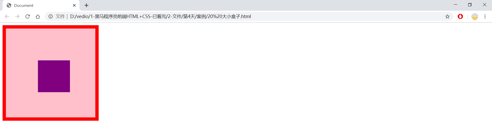

# 案例16：新闻列表

## 最终效果

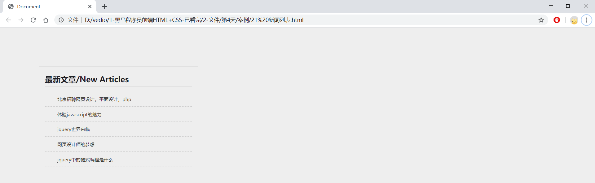

## 独立手写

~~~css
<!DOCTYPE html>
<html lang="en">
<head>
	<meta charset="UTF-8">
	<title>Document</title>
	<style>
		body{
			background-color: #EEEEEE;
		}

		.nav{
			border: 1px solid #ccc;
			width: 410px;
			height: 285px;
			margin-left:100px;
			margin-top:100px;
			/*不是paddding而是margin*/
		}

		.nav h4{
			font-size: 22px;
			margin-left: 15px;
			
			margin-top: 20px;
			margin-bottom: 5px;
		}

		.nav ul li{
			list-style: none;
			border-bottom: 1px dashed #ccc;
		}

		.nav ul li a{
			text-decoration: none;
			color: #333;
			font-size: 12px;
		}

		.nav ul li a:hover{
			text-decoration: underline;
		}
	
	</style>
</head>
<body>
	<div class="nav">
		<h4>最新文章/New Articles</h4>
			<ul>
				<li><a href="#">北京招聘网页设计，平面设计，php</a></li>
			</ul>
	
			<ul>
				<li><a href="#">体验javascript的魅力</a></li>
			</ul>
	
			<ul>
				<li><a href="#">jquery世界来临</a></li>
			</ul>
	
			<ul>
				<li><a href="#">网页设计师的梦想</a></li>
			</ul>
	
			<ul>
				<li><a href="#">jquery中的链式编程是什么</a></li>
			</ul>
	</div>
</body>
</html>
~~~

> 不会字体和横线之间调节间隔

## 答案

~~~css
<!DOCTYPE html>
<html lang="en">
<head>
	<meta charset="UTF-8">
	<title>Document</title>
	<style>
	/*div {
		width: 100px;
		height: 100px;
		border: 2px solid red;
		padding: 20px;
		margin: 30px;
	}*/
	* {
		margin: 0;
		padding: 0;  /*清除内外边距*/
	}
	body {
		background-color: #eee;
	}
	.article {
		width: 380px;
		height: 263px;
		border: 1px solid #ccc;
		margin: 100px;
		padding: 20px 15px 0;  /*上 20  左右  15  下  0*/
	}
	.article h4 {
		color: #202026;
		font-size: 20px;
		border-bottom: 1px solid #ccc;
		padding-bottom: 5px;
		/*margin-bottom: 12px;*/
	}
	li {
		list-style: none;   /*取消li 前面的小点*/
	}
	.article ul li {
		height: 38px;
		line-height: 38px;
		border-bottom: 1px dashed #ccc; /* 1像素的虚线边框*/
		text-indent: 2em;
	}
	.article  a  {
		font-size: 12px;
		color: #333;
		text-decoration: none;
	}
	.article a:hover {
		text-decoration: underline;  /*添加下划线*/
	}
	.article ul {
		margin-top: 12px;
	}
	</style>
</head>
<body>
  <div class="article">
  		<h4>最新文章/New Articles</h4>
  		<ul>
  			<li><a href="#">北京招聘网页设计，平面设计，php</a></li>
  			<li><a href="#">体验javascript的魅力</a></li>
  			<li><a href="#">jquery世界来临</a></li>
  			<li><a href="#">网页设计师的梦想</a></li>
  			<li><a href="#">jquery中的链式编程是什么</a></li>
  		</ul>
  </div>
</body>
</html>
~~~

> 这个让我单独写我现在还真写有点困难，基础不牢固啊

# 案例17：表单边框

## 效果

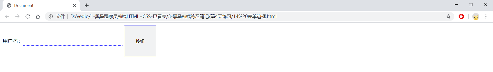

## 答案

~~~css
<!DOCTYPE html>
<html lang="en">
<head>
	<meta charset="UTF-8">
	<title>Document</title>
	<style>
		input {
			border: 0;   /*去掉所有边框*/
			border-bottom: 1px dashed blue;
			font-size: 25px;
		}

		button {
			width: 100px;
			height: 100px;
			border :1px solid blue;
		}

	</style>
</head>
<body>
	用户名：<input type="text">
	<button>按钮</button>
</body>
</html>
~~~

# 案例18：表格细线边框

## 效果

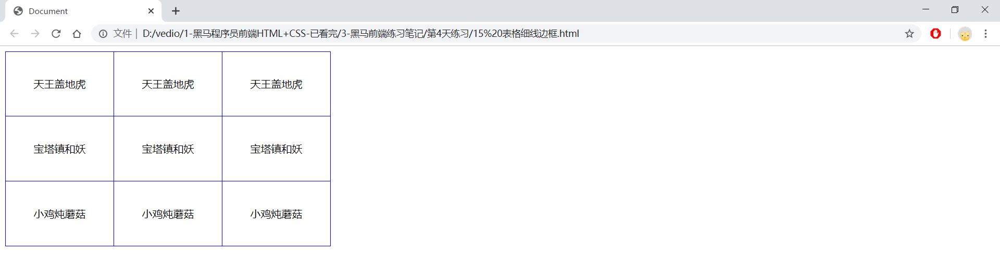

## 答案

~~~css
<!DOCTYPE html>
<html lang="en">
<head>
	<meta charset="UTF-8">
	<title>Document</title>
	<style>
		table {
			width: 500px;
			height: 300px;
			border: 1px solid blue;
		}

		td {
			border: 1px solid blue;
			text-align: center;
		}

		table,td {
			border-collapse: collapse;
		}
	</style>
</head>
<body>
	<table cellpadding="0" cellspacing="0">
		<tr>
			<td>天王盖地虎</td>
			<td>天王盖地虎</td>
			<td>天王盖地虎</td>
		</tr>
		<tr>
			<td>宝塔镇和妖</td>
			<td>宝塔镇和妖</td>
			<td>宝塔镇和妖</td>
		</tr>
		<tr>
			<td>小鸡炖蘑菇</td>
			<td>小鸡炖蘑菇</td>
			<td>小鸡炖蘑菇</td>
		</tr>
	</table>
</body>
</html>
~~~

# 案例19：内边距

## 效果

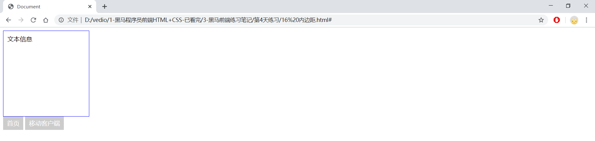

## 答案

~~~css
<!DOCTYPE html>
<html lang="en">
<head>
	<meta charset="UTF-8">
	<title>Document</title>
	<style>
		div {
			width: 200px;
			height: 200px;
			border: 1px solid blue;
      /*有一个上下左右10像素的边框*/
			padding: 10px; 
		}

		a {
      /*a不要给宽，给宽就固定死了，就是居中对齐了也很丑*/
      /*字不一样多，给宽的话字少的会很长*/
			height: 35px;
			background-color: #ccc;
			display: inline-block;
			line-height: 35px;
			text-decoration: none;
			color: #fff;
			/*padding: 10px;*/
			padding-left: 10px;
			padding-right: 10px;
		}
	</style>
</head>
<body>
	<div>文本信息</div>
	<a href="#">首页</a>
	<a href="#">移动客户端</a>
</body>
</html>
~~~

# 案例20：盒子水平居中

~~~javascript
<!DOCTYPE html>
<html lang="en">
<head>
	<meta charset="UTF-8">
	<title>Document</title>
	<style>
		div {
			text-align: center;  /*可以让盒子内容（文字、行内元素、行内块元素）居中对齐*/
			width: 300px;
			height: 100px;
			background-color: pink;
			/*margin: 0 auto;*/  /*通俗写法  0 auto 上下是0，左右是auto 自动*/
			/*margin-left: auto;*/
			/*margin-right: auto;*/
			/*margin: auto;  上下左右都是auto*/
			margin: 100px auto;
		}
	</style>
</head>
<body>
	<div>认识一周了</div>
</body>
</html>
~~~

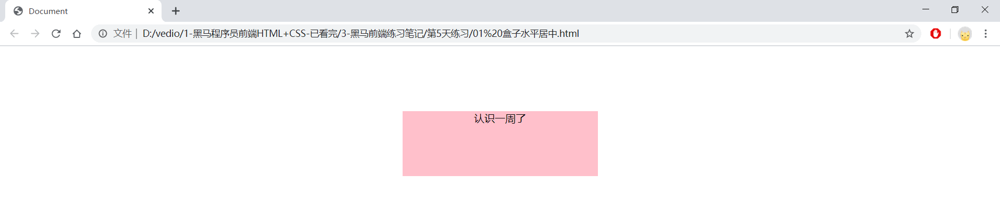

# 案例21：外边距合并

~~~javascript
<!DOCTYPE html>
<html lang="en">
<head>
	<meta charset="UTF-8">
	<title>Document</title>
	<style>
		div {
			width: 300px;
			height: 200px;
			background-color: purple;
		}

		.xionger {
			background-color: pink;
		}

		.xiongda {
			margin-bottom: 100px;
		}

		.xionger {
			margin-top: 50px; /*  最后两者距离不是150，而是100，以最大的那个为准*/
		}
	</style>
</head>
<body>
	<div class="xiongda">1</div>
	<div class="xionger">2 </div>
</body>
</html>
~~~

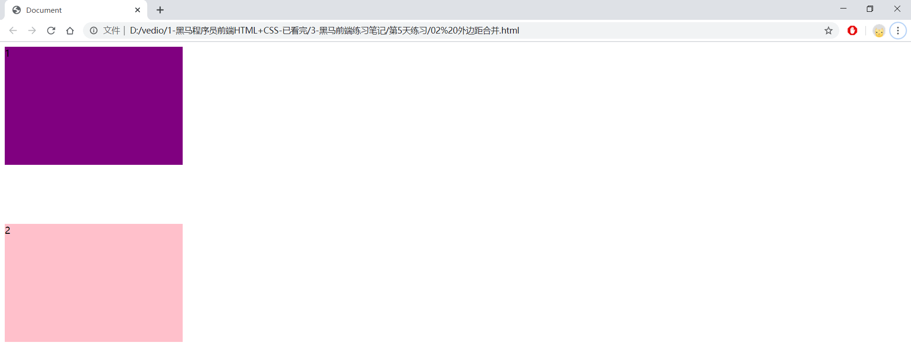

# 案例22：外边距塌陷

~~~javascript
<!DOCTYPE html>
<html lang="en">
<head>
	<meta charset="UTF-8">
	<title>Document</title>
	<style>
		.father {
			width: 500px;
			height: 500px;
			background-color: pink;
			/*解决方法1 用border 缺点：增大了盒子：*/
			/*border-top: 1px solid pink;*/  

			/*解决方法2 用padding  缺点：撑大了盒子*/
			/*padding-top: 50px;*/

			/*解决方法3 ：溢出隐藏*/
			overflow: hidden;
		}

		.son {
			width: 200px;
			height: 200px;
			background-color: purple;

			margin-top: 50px;  
			/*会将父亲往下带*/

			/*margin-left: 50px;  */
			/*水平方向没有问题*/
		}
	</style>
</head>
<body>
	<div class="father">
		<div class="son"></div>
	</div>
</body>
</html>
~~~

# 案例23：盒子默认宽度

~~~javascript
<!DOCTYPE html>
<html lang="en">
<head>
	<meta charset="UTF-8">
	<title>Document</title>
	<style>
		.father {
			height: 200px;
			background-color: pink;
			width: 300px;
			padding-left: 30px;   
			/*这个时候padding会撑开盒子大小*/
			/* 因为父盒子有宽度，给定值了，则padding会撑开盒子*/
		}

		.son {
			padding-left: 30px;  
			/*这个时候padding没有撑开盒子大小*/
			/*儿子盒子没有给定宽度，用的是默认的，所以padding不会撑开盒子*/
		}
	</style>
</head>
<body>
	<div class="father">
		<div class="son">123</div>
	</div>
</body>
</html>
~~~

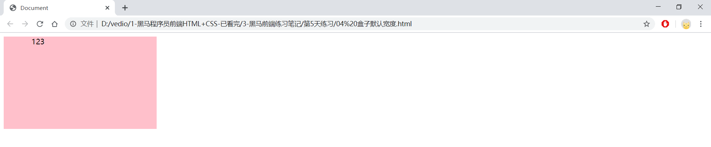

# 案例24：圆角边框

~~~javascript
<!DOCTYPE html>
<html lang="en">
<head>
	<meta charset="UTF-8">
	<title>Document</title>
	<style>
		div {
			width: 300px;
			height: 300px;
			background-color: green;
			margin: 100px auto;
			/*border-radius: 150px;*/ /* 是300的一半*/
			/*border-radius: 50%;	*/
			border: 10px solid red;
			border-radius: 15px 0 ;  /*上下10 左右0*/
		}
	</style>
</head>
<body>
	<div></div>
</body>
</html>
~~~

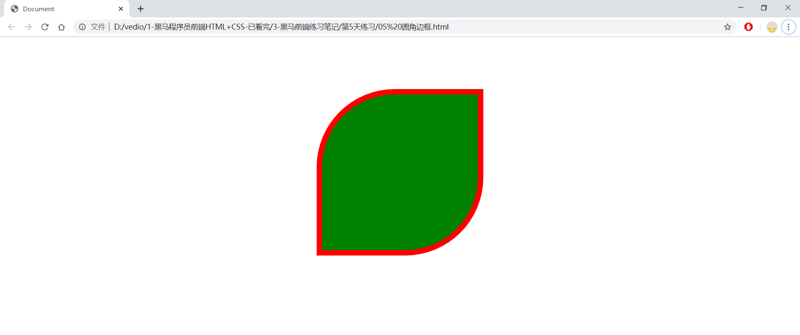

# 案例25：圆角练习

## 效果

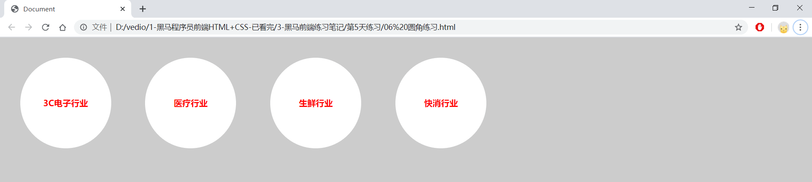

## 答案

~~~html
<!DOCTYPE html>
<html lang="en">
<head>
	<meta charset="UTF-8">
	<title>Document</title>
	<style>
		body {
			background-color: #ccc;
		}
	 	.radius a {
			width: 172px;
			height: 172px;
			background-color: #fff;
			color: red;
			font-weight: 700;
			display: inline-block;
			margin: 30px;
			text-decoration: none;
			border-radius: 50%;
			line-height: 172px;	  /*内容垂直居中*/
			text-align: center;   /*内容水平居中*/
		}

		.radius a:hover {
			background-color: red;
			color: #fff;
		}
	</style>
</head>
<body>
	<div class="radius">
		<a href="#">3C电子行业</a>   <!--  圆角是a,不是div -->
		<a href="#">医疗行业</a>
		<a href="#">生鲜行业</a>
		<a href="#">快消行业</a>
	</div>
</body>
</html>
~~~

# 案例26：盒子阴影

## 效果

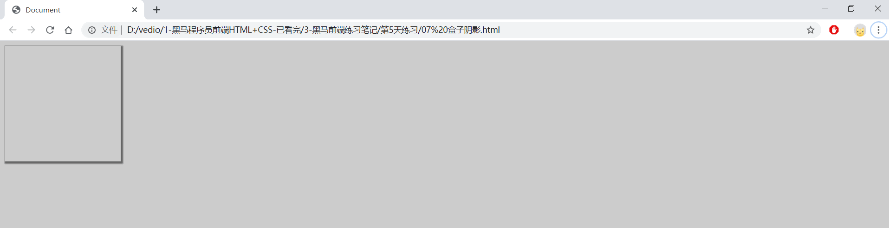

## 答案

~~~html
<!DOCTYPE html>
<html lang="en">
<head>
	<meta charset="UTF-8">
	<title>Document</title>
	<style>
		body {
			background-color: #ccc;
		}
		div {
			width: 200px;
			height: 200px;
			/*box-shadow: 2px 2px 2px  2px rgba(0,0,0,0.5);*/
			transition: all 1s;
		}

		div:hover { /*鼠标经过div时候的样子*/
			box-shadow: 0 15px 30px rgba(0,0,0,1)

		}
	</style>
</head>
<body>
	<div></div>
</body>
</html>
~~~

[CSS3 transition 属性](<https://www.w3school.com.cn/cssref/pr_transition.asp>)

# 案例27：体会浮动

## 效果

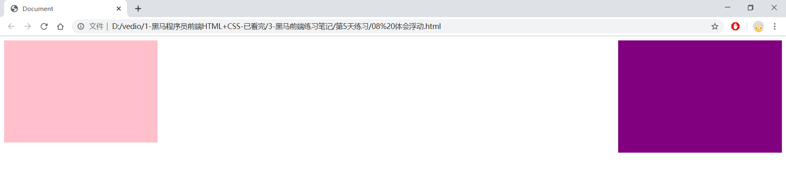

## 答案

~~~html
<!DOCTYPE html>
<html lang="en">
<head>
	<meta charset="UTF-8">
	<title>Document</title>
	<style>
		div {
			float: left;
		}
		.up {
			width: 300px;
			height: 200px;
			background-color: pink;
			/*float: right;  */
		}

		.down {
			width: 320px;
			height: 220px;
			background-color: purple;
			float: right;
		}
	</style>
</head>
<body>
	<div class="up"></div>
	<div class="down"></div>
</body>
</html>
~~~


# 案例28：父盒子

~~~html
<!DOCTYPE html>
<html lang="en">

<head>
	<meta charset="UTF-8">
	<title>Document</title>
	<style>
		.father {
			width: 600px;
			height: 600px;
			background-color: pink;
			padding: 50px;
			/*浮动的盒子不能越过padding值，浮动也算里面的内容，跨越不了内边距*/
      		/*padding是指边框与内容之间的距离,父盒子与123之间的距离*/
		}

		.son {
			width: 200px;
			height: 200px;
			background-color: purple;
			float: right;
		}
	</style>
</head>

<body>
	<div class="father">123
		<div class="son">456</div>
	</div>
</body>

</html>
~~~

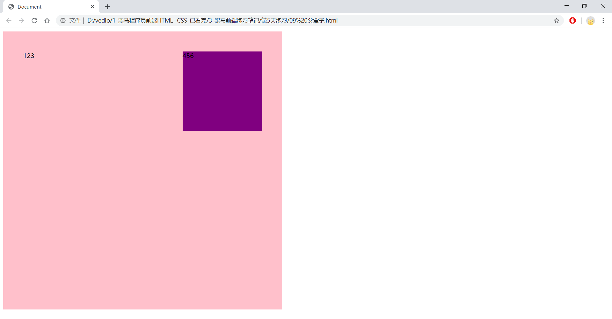

# 案例29：浮动特性之对齐

~~~html
<!DOCTYPE html>
<html lang="en">
<head>
	<meta charset="UTF-8">
	<title>Document</title>
	<style>
		div {
			width: 100px;
			height: 100px;
			/*float: left;*/
		}
		.one {
			background-color: pink;
		}

		.two {
			background-color: purple;
			float: left;   
      /*浮动只对下面的元素有影响，上面的.one  是标准流，无论你怎么浮动，都不会挤掉它的位置*/
		}

		.three {
			background-color: skyblue;
		}
	</style>
</head>
<body>
	<div class="one"></div>
	<div class="two"></div>
	<div class="three"></div>
</body>
</html>
~~~

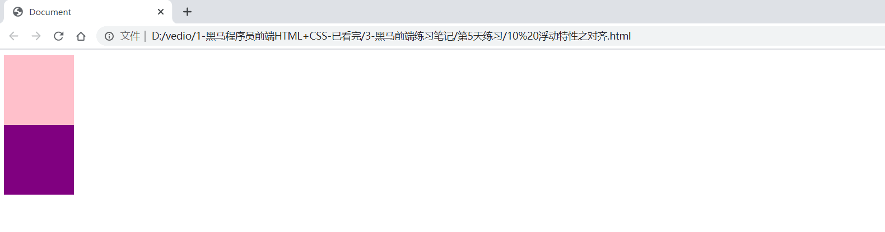

# 案例30：浮动有隐藏模式转换

~~~html
<!DOCTYPE html>
<html lang="en">
<head>
	<meta charset="UTF-8">
	<title>Document</title>
	<style>
		div {
			height: 100px;
			background-color: pink;
			float: left;  /* 浮动可以让元素默认转换为行内块*/
		}

		span {
			width: 100px;
			height: 100px;
			background-color: purple;
			/*display: block;*/
			float: left;  
			 /*妙用，如果已经给行内元素添加了浮动，此时不需要转换了，这个元素也可以有高*/
		}
	</style>
</head>
<body>
	<div>哒哒哒</div>    
	 <!-- 这个div现在已经不算块级了（算行内块了），竟然允许他人在它右边显示了，不独占一行了 -->
	<span>123456789</span>  
</body>
</html>
~~~

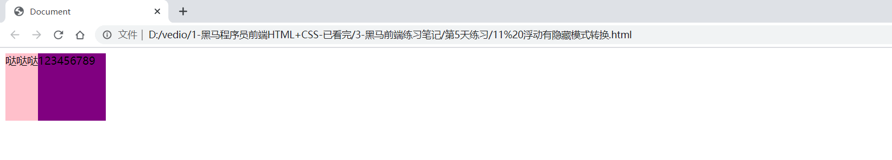

# 案例31：布局之一列固定宽度且居中

~~~html
<!DOCTYPE html>
<html lang="en">
<head>
	<meta charset="UTF-8">
	<title>Document</title>
	<style>
		.top,
		.banner,
		.main,
		.footer {
			width: 900px;
			background-color: #eee;
			border: 1px dashed #ccc;
			margin: 0 auto;
		}
		.top {
			/*width: 900px;*/
			height: 80px;
			/*background-color: #eee;
			border: 1px dashed #ccc;*/
			margin: 0 auto;
		}

		.banner {
			/*width: 900px;*/
			height: 120px;
			/*background-color: #eee;
			border: 1px dashed #ccc;*/
			/*margin: 0 auto;*/
			margin: 5px auto;
		}

		.main {
			/*width: 900px;*/
			height: 500px;
			/*background-color: #eee;
			border: 1px dashed #ccc;*/
			/*margin: 0 auto;*/
		}

		.footer {
			/*width: 900px;*/
			height: 100px;
			/*background-color: #eee;
			border: 1px dashed #ccc;*/
			/*margin: 0 auto;
			margin-top: 5px; */ /*将上层叠掉了，但是对于左右没有影响*/
			margin: 5px auto 0;  /*上5 左右居中 下0*/
		}
	</style>
</head>
<body>
	<div class="top">top</div>
	<div class="banner">banner</div>
	<div class="main">main</div>
	<div class="footer">footer</div>
</body>
</html>
~~~

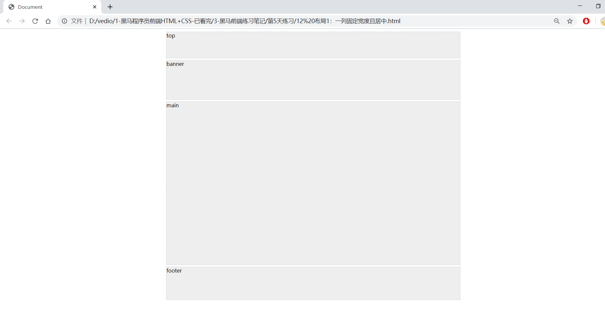

# 案例32：布局之左右型结构

~~~html
<!DOCTYPE html>
<html lang="en">
<head>
	<meta charset="UTF-8">
	<title>Document</title>
	<style>
		.top {
			width: 900px;
			height: 80px;
			background-color: pink;
			margin:0 auto;
		}

		.banner {
			width: 900px;
			height: 150px;
			background-color: purple;
			margin:0 auto;
		}

		.main {
			width: 900px;
			height: 500px;
			background-color: skyblue;
			margin:0 auto;
		}
		
		.left {
			width: 298px;
			height: 500px;  /*盒子高度不继承，所以必须要给高度*/
			background-color: yellow;
			border: 1px solid red;
			float: left;
		} 

		.right {
			width: 590px;
			height: 500px;
			background-color: deeppink;
			float: right;
			/*margin-left: 10px;*/
		}
		.footer {
			width: 900px;
			height: 80px;
			background-color: black;
			margin:0 auto;
		}
	</style>
</head>
<body>
	<div class="top"></div>
	<div class="banner"></div>
	<div class="main">
		<div class="left">left</div>
		<div class="right">right</div>
	</div>
	<div class="footer"></div>
</body>
</html>
~~~

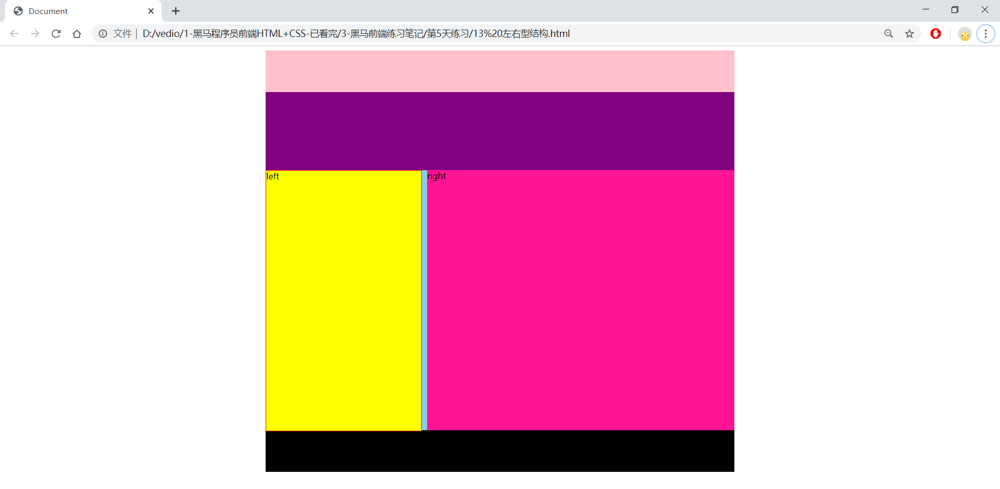

# 案例33：布局之通栏结构

~~~html
<!DOCTYPE html>
<html lang="en">
<head>
	<meta charset="UTF-8">
	<title>Document</title>
	<style>
		* {
			margin: 0;
			padding: 0;
		}
		.top {
			height: 80px;
			background-color: pink;
		}
		
		.top-inner {
			width: 900px;
			height: 80px;
			/*background-color: #ccc;*/
			margin:0 auto;
		}
		.banner {
			width: 900px;
			height: 150px;
			/*background-color: purple;*/
			margin:0 auto;
		}
		.banner li {
			list-style: none;
			float: left;
			width: 217px;
			height: 150px;
			margin-right: 10px;
		}

		.one {
			background-color: purple;
		}

		.two {
			background-color: blue;
		}
		
		.three {
			background-color: pink;
		}

		.banner .four{  /*有优先级的问题*/
			background-color: green;			
			margin-right: 0;
			float: right;  /*有一些误差，用这个可以直接靠在右边*/
		}
		.main {
			width: 900px;
			height: 500px;
			background-color: skyblue;
			margin:0 auto;
		}
		
		.left {
			width: 298px;
			height: 500px;  /*盒子高度不继承，所以必须要给高度*/
			background-color: yellow;
			border: 1px solid red;
			float: left;
		} 

		.right {
			width: 590px;
			height: 500px;
			background-color: deeppink;
			float: right;
			/*margin-left: 10px;*/
		}
		.footer {
			width: 900px;
			height: 80px;
			background-color: black;
			margin:0 auto;
		}
	</style>
</head>
<body>
	<div class="top">
		<div class="top-inner">123</div>  
		<!--  盒子继承父亲的宽，不继承父亲的高。默认和父亲一样宽 -->
	</div>

	<div class="banner">
		<ul>
			<li class="one">1</li>
			<li class="two">2</li>
			<li class="three">3</li>
			<li class="four">4</li>
		</ul>
	</div>

	<div class="main">
		<div class="left">left</div>
		<div class="right">right</div>
	</div>

	<div class="footer"></div>
</body>
</html>
~~~

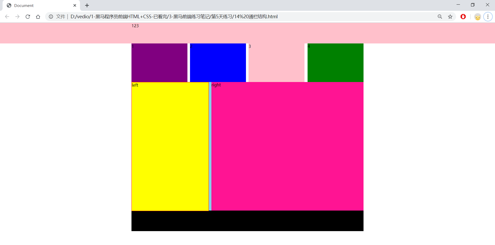

# 案例34：利用浮动让4个div在一行

~~~html
<!DOCTYPE html>
<html lang="en">
<head>
	<meta charset="UTF-8">
	<title>Document</title>
	<style>
		.fudong01 {
			width: 100px;
			height: 100px;
			background-color: green;
			float: left;
		}

		.fudong02 {
			width: 100px;
			height: 100px;
			background-color: blue;
			float: left
		}

		.fudong03 {
			width: 100px;
			height: 100px;
			background-color: yellow;
			float: left
		}

		.fudong04 {
			width: 100px;
			height: 100px;
			background-color: pink;
			float: right
		}
	</style>
</head>
<body>
	<div class="fudong01">第1个盒子</div>
	<div class="fudong02">第2个盒子</div>
	<div class="fudong03">第3个盒子</div>
	<div class="fudong04">第4个盒子</div>
</body>
</html>
~~~

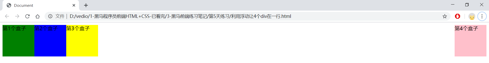

# 案例35：测试浮动

~~~html
<!DOCTYPE html>
<html lang="en">
<head>
	<meta charset="UTF-8">
	<title>Document</title>
	<style>
		.xiongda {
			width: 300px;
			height: 300px;
			background-color: pink;
			/*float:left;*/
		}

		.xionger {
			width: 300px;
			height: 300px;
			background-color: blue;
			float: left;   /*熊大不浮动，熊二浮动，没有用。浮了也白浮*/
		}

		.xiongsan {
			width: 300px;
			height: 300px;
			background-color: yellow;
			float: left;   
			/*熊大浮动，熊二不浮动，熊三浮动，则熊三会盖住熊二*/
			/*熊大浮动，熊二不浮动，熊三不浮动，则熊二熊三会移上去*/

		}
	</style>

</head>
<body>
	<div class="xiongda"></div>
	<div class="xionger"></div>
	<div class="xiongsan"></div>
</body>
</html>
~~~

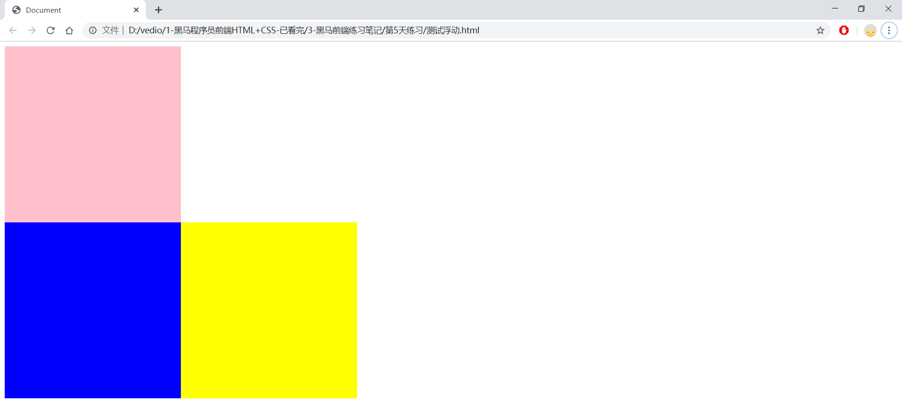

# 案例36：为什么清除浮动

~~~html
<!DOCTYPE html>
<html lang="en">
<head>
	<meta charset="UTF-8">
	<title>Document</title>
	<style>
		.father {
			border: 1px solid green;  
			width: 300px;
			/*很多情况下father不方便给宽度和高度，比如father里面全是新闻文字*/
		}

		.big {
			width: 100px;
			height: 100px;
			background-color: purple;
			float: left;
		}

		.small {
			width: 80px;
			height: 80px;
			background-color: blue;
			float: left;
		}
		.footer {
			width: 400px;
			height: 100px;
			background-color: pink;
		}
	</style>
</head>
<body>
	<div class="father">
		<div class="big"></div>
		<div class="small"></div>
	</div>

	<div class="footer"></div>
</body>
</html>
~~~

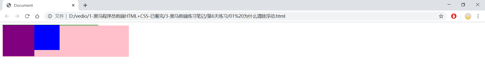

> 因为没有给father一个高度，所以它的两个子盒子添加浮动后，就不是标准流了，不占位置了，恰巧父亲又没有高度，所以footer盒子就跑上来了。

# 案例37：额外标签法

~~~html
<!DOCTYPE html>
<html lang="en">
<head>
	<meta charset="UTF-8">
	<title>Document</title>
	<style>
		.father {
			border: 1px solid #f00;  
			width: 300px;
			/*很多情况下father不方便给宽度和高度，比如father里面全是新闻文字*/
		}

		.big {
			width: 100px;
			height: 200px;
			background-color: purple;
			float: left;
		}

		.small {
			width: 80px;
			height: 80px;
			background-color: blue;
			float: left;
		}
		.footer {
			width: 400px;
			height: 100px;
			background-color: pink;
		}

		.clear {
			clear: both;
			/*如果清除了浮动，父亲自动检测孩子的高度，以最高的为准*/
		}
	</style>
</head>
<body>
	<div class="father">
		<div class="big"></div>
		<div class="small"></div>
        <!--  在最后一个浮动后面新添加一个div -->
		<div class="clear"></div> 
	</div>
	<div class="footer"></div>
</body>
</html>

<!-- 优点： 通俗易懂，书写方便

缺点： 添加许多无意义的标签，结构化较差。  我只能说，w3c你推荐的方法我不接受，你不值得拥有。。。 -->
~~~

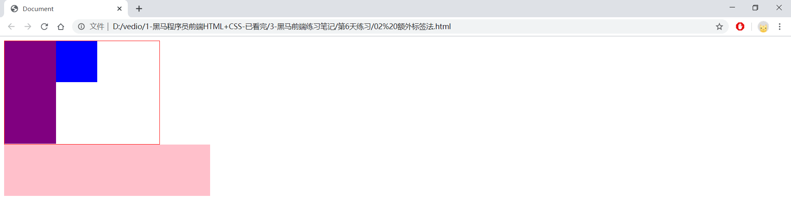

# 案例38：overflow清除浮动

~~~html
<!DOCTYPE html>
<html lang="en">
<head>
	<meta charset="UTF-8">
	<title>Document</title>
	<style>
		.father {
			border: 1px solid #f00;  
			width: 300px;
			overflow: hidden;  
       /*给父级加，别加错位置了*/
			/*很多情况下father不方便给宽度和高度，比如father里面全是新闻文字*/
			/*不是所有的浮动我们都需要清除，只有影响布局的我们才清除*/
		}

		.big {
			width: 100px;
			height: 100px;
			background-color: purple;
			float: left;
		}

		.small {
			width: 80px;
			height: 180px;
			background-color: blue;
			float: left;
		}
		.footer {
			width: 400px;
			height: 100px;
			background-color: pink;
		}
	</style>
</head>
<body>
	<div class="father">
		<div class="big"></div>
		<div class="small"></div>
	</div>
	<div class="footer"></div>
</body>
</html>
~~~

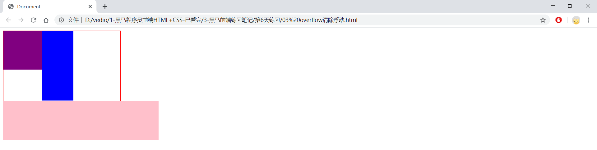

> 孩子在里面乱捣乱，子不教父之过，所以给父亲说overflow:hidden即可。
>
> 注意是给**父级**添加！！！！！！

# 案例39：after伪元素清除浮动

~~~html
<!DOCTYPE html>
<html lang="en">
<head>
	<meta charset="UTF-8">
	<title>Document</title>
	<style>
	.clearfix:after {  /*正常浏览器 清除浮动*/
		content:"";
		display: block;
		height: 0;
		clear: both;
		visibility: hidden;
	}
		.clearfix {
			*zoom: 1;   /*zoom是缩放的意思，缩放一倍。专门用于ie6  *代表ie7以下的版本所识别*/
		}
		.father {
			border: 1px solid #f00;  
			width: 300px;
			/*很多情况下father不方便给宽度和高度，比如father里面全是新闻文字*/
		}

		.big {
			width: 100px;
			height: 100px;
			background-color: purple;
			float: left;
		}

		.small {
			width: 80px;
			height: 80px;
			background-color: blue;
			float: left;
		}
		.footer {
			width: 400px;
			height: 100px;
			background-color: pink;
		}
	</style>
</head>
<body>
	<div class="father clearfix">  <!-- 多类名选择器 -->
		<div class="big"></div>
		<div class="small"></div>
	</div>
	<div class="footer"></div>
</body>
</html>
~~~

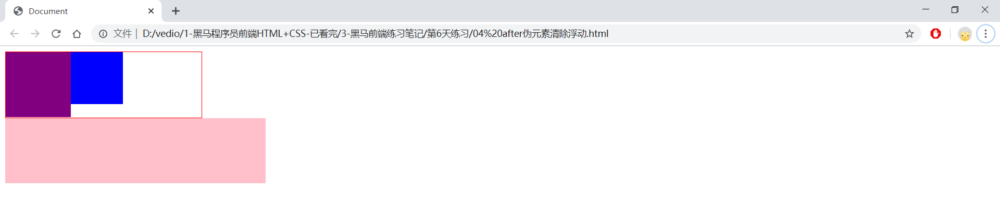

# 案例40：双伪元素清除浮动

~~~html
<!DOCTYPE html>
<html lang="en">
<head>
	<meta charset="UTF-8">
	<title>Document</title>
	<style>
		.clearfix:before, .clearfix:after {
			content: "";
			display: table; 
		}
		.clearfix:after {
			clear: both;
		}

		.clearfix {
			*zoom: 1;
		}
		.father {
			border: 1px solid #f00;  
			width: 300px;
			/*很多情况下father不方便给宽度和高度，比如father里面全是新闻文字*/
		}

		.big {
			width: 100px;
			height: 100px;
			background-color: purple;
			float: left;
		}

		.small {
			width: 80px;
			height: 80px;
			background-color: blue;
			float: left;
		}
		.footer {
			width: 400px;
			height: 100px;
			background-color: pink;
		}
	</style>
</head>
<body>
	<div class="father clearfix">
		<div class="big"></div>
		<div class="small"></div>
	</div>
	<div class="footer"></div>
</body>
</html>
~~~

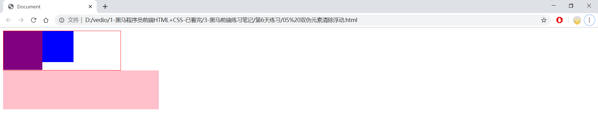

# 案例41：相对定位

~~~html
<!DOCTYPE html>
<html lang="en">
<head>
	<meta charset="UTF-8">
	<title>Document</title>
	<style>
		div {
			width: 200px;
			height: 200px;
			background-color: pink;		
            /*margin: 100px;*/
            /*position:relative;*/  /*相对定位*/
            /*在margin的基础上再往下移动了100px*/
            /*top: 100px;*/
            /*left: 100px;*/
		}

		.top {
            /*top开始自恋，以自己左上角为起点，往下移动100px,忘右移动100px*/
            /*top开始自恋，开始移动，但是下面的bottom不为所动，一动不动，不改变位置*/
            /*说明一个问题：定位的盒子走了，但是它原来的位置还是有的，没有被别人霸占*/
			position: relative;   
			top: 100px;
			left: 100px;
		}
		.bottom {
			background-color: purple;
		}
	</style>
</head>
<body>
	<div class="top"></div>
	<div class="bottom"></div>
</body>
</html>
~~~

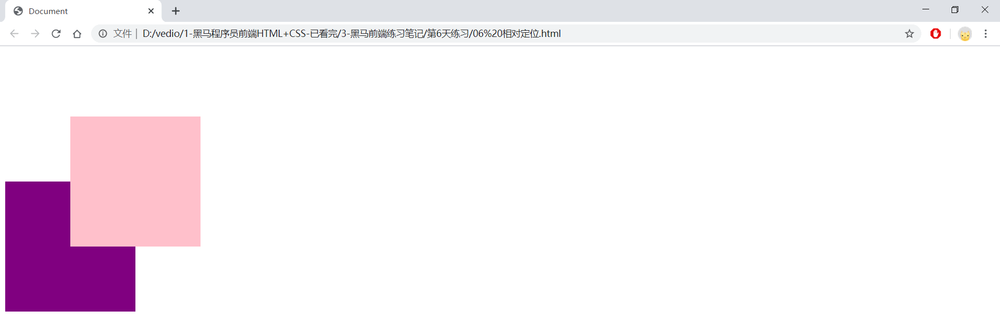

# 案例42：绝对定位

~~~html
<!DOCTYPE html>
<html lang="en">
<head>
	<meta charset="UTF-8">
	<title>	</title>
	<style>
	body {
		height: 1000px;
	}
	div {
		width: 100px;
		height: 100px;
		background-color: pink;
		/*position: absolute;
		top: 10px;
		left: 10px;*/
		}

	.top {
    /*绝对定位不占位置，跟浮动一样*/
		position: absolute; 
    /*靠右边对齐*/
		right: 0;   
    /*靠下边对齐*/
		bottom: 0;  
		}

	.bottom {
		background-color: purple;
		width: 120px;
	}
	</style>
</head>
<body>
	<div class="top"></div>
	<div class="bottom"></div>
</body>
</html>
~~~

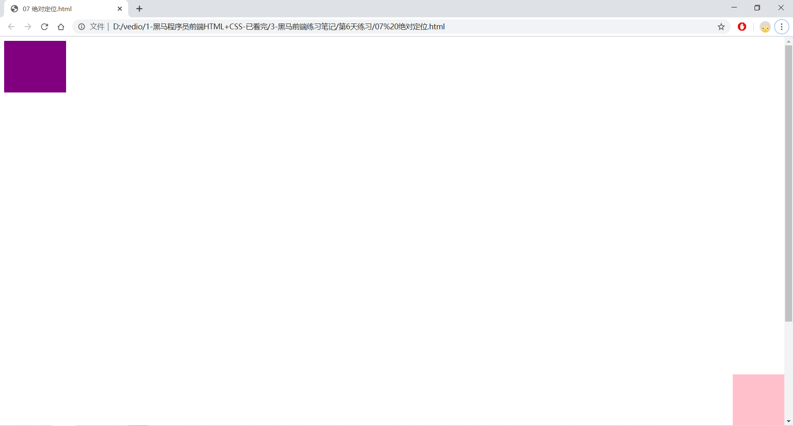

> 绝对定位和浮动一样，不占位置。
>
> right: 0;   bottom: 0;  不太懂什么意思-----是靠右，靠下对齐的意思，跑到页面的右下角了。
>
> 绝对定位是以**浏览器当前屏幕**为基准点对齐的，而不是以body为基准点对齐的。(设置body高度为1000px,往下拉，粉色盒子也会随之向上移动。)

# 案例43：父亲没定位

~~~html
<!DOCTYPE html>
<html lang="en">
<head>
	<meta charset="UTF-8">
	<title>Document</title>
	<style>
		.father {
			width: 500px;
			height: 500px;
			background-color: pink;
			margin: 100px;
		}

		.son {
			width: 200px;
			height: 200px;
			background-color: purple;
      /*给儿子绝对定位*/
			position: absolute;
			top: 50px;
			left: 50px;
			/*若所有父元素都没有定位，以浏览器当前屏幕为准对齐(document文档)。*/
		}
	</style>
</head>
<body>
	<div class="father">
			<div class="son"></div>
	</div>
</body>
</html>
~~~

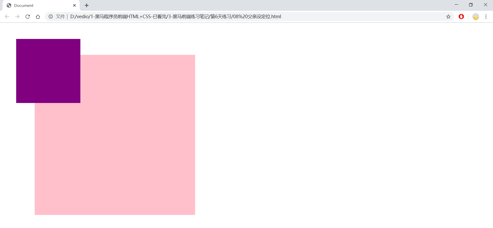

> 决定定位和浮动不一样的地方：浮动一定是在盒子内部，不会出来。而绝对定位是会出来的。
>
> 若父亲没有定位(或者没有父亲)，儿子则会以当前屏幕左上角为基准点对齐。

# 案例44：父亲有定位

~~~html
<!DOCTYPE html>
<html lang="en">
<head>
	<meta charset="UTF-8">
	<title>Document</title>
	<style>
		.grandfather {
			width: 700px;
			height: 700px;
			background-color: skyblue;
			position: absolute;
		}
		.father {
			width: 500px;
			height: 500px;
			background-color: pink;
			margin: 100px;
			/*position: absolute;*/
		}

		.son {
			width: 200px;
			height: 200px;
			background-color: purple;
			position: absolute;
			top: 50px;
			left: 50px;
			/*父级有定位
			绝对定位是将元素依据最近的已经定位（绝对、固定或相对定位）的父元素（祖先）进行定位。*/
		}
	</style>
</head>
<body>
	<div class="grandfather">
		<div class="father">
			<div class="son"></div>
		</div>
	</div>
	
</body>
</html>
~~~

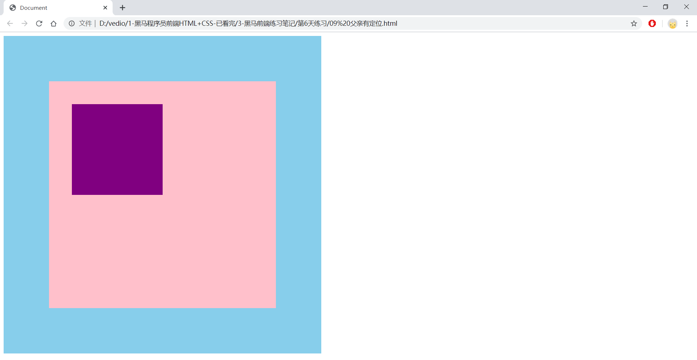

> 如果父亲有了定位，则根据**最近的**已经定位的（绝对、固定或相对定位）的父元素（祖先）进行定位。
>
> 例如：如果父亲，爷爷和祖宗都没有定位，那么会以浏览器屏幕左上角为基准点对齐；如果父亲有定位，则以父亲为基准点对齐(爷爷有没有定位都没关系)；如果父亲没有定位，爷爷有定位，则以爷爷为基准点对齐。(和父亲就没关系了);总之就是一层一层的往上找。

# 案例45：哈根达斯

~~~html
<!DOCTYPE html>
<html lang="en">
<head>
	<meta charset="UTF-8">
	<title>Document</title>
	<style>
		div {
      /*图片大小为310*190像素的*/
			width: 310px;
			height: 190px;
			border: 1px solid #ccc;
      /*盒子居中且距离浏览器上面100px*/
			margin: 100px auto;
      /*来一个内边距，自然而然撑开盒子*/
			padding: 10px;
      /*父亲只要有个定位就行，不用写边偏移top，right之类的了*/
			position: relative;
		}

		.top {
			/*float: left;*/  
      /*浮动过不了内边距，不能加浮动*/
			position: absolute;
      /*图片沿着左上方对齐*/
			top: 0;
			left: 0;		
		}

		.bottom {
			position: absolute;
      /*图片沿着右下方对齐*/
			right: 0;
			bottom: 0;
		}
	</style>
</head>
<body>
	<div>
		
		
		
	</div>
</body>
</html>
~~~

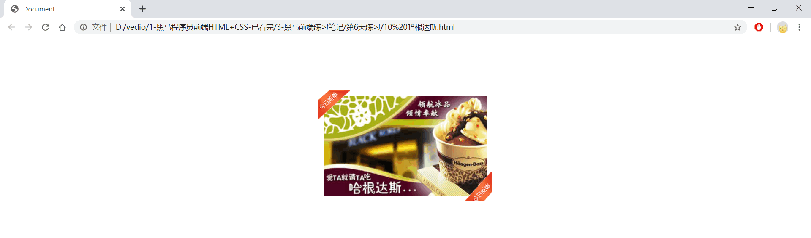

> 浮动过不了内边距！！！！！！！！！！

# 案例46：两个小问题

~~~:2nd_place_medal:
<!DOCTYPE html>
<html lang="en">
<head>
	<meta charset="UTF-8">
	<title>Document</title>
	<style>
		div {
			width: 200px;
			height: 200px;
			background-color: pink;
		}

		.top {
			/*float: left;*/
			position: absolute; /* 绝对定位是完整意义上的脱标，浮动不能让文字脱标*/
			top: 0;
			left: 0;
		}

		.bottom {
			width: 200px;
			height: 200px;
			background-color: purple;
		}
	</style>
</head>
<body>
	<div class="top">123123123</div>
	<div class="bottom">abcabcabc</div>
</body>
</html>
~~~

# 案例47：定位的盒子居中问题

~~~html
<!DOCTYPE html>
<html lang="en">
<head>
	<meta charset="UTF-8">
	<title>Document</title>
	<style>
		div {
			width: 200px;
			height: 200px;
			background-color: pink;
			/*margin: 100px auto;*/
      		/*这个盒子加了浮动，margin:auto立马失效了*/
			/*float: left; */ 
      
      /*这个盒子加了定位，margin:auto也立马失效了*/
			position: absolute;  
			left: 50%;
      /*再往左走100px（盒子的一半距离）*/
			margin-left: -100px; 
      
			top: 50%;
      /*再往上走100px*/
			margin-top: -100px;
		}
	</style>
</head>
<body>
	<div></div>
</body>
</html>
~~~

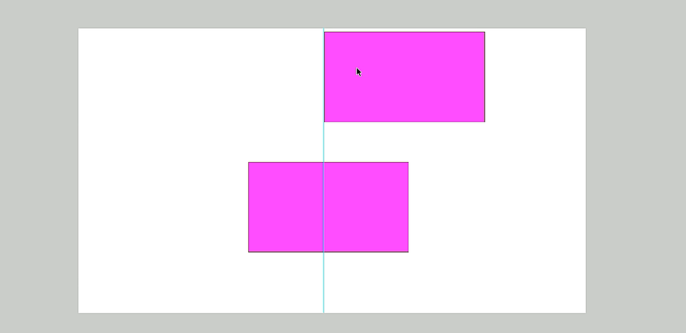

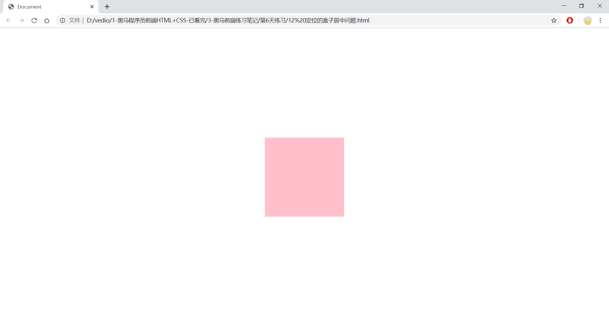

> 因为浮动是贴着左边对齐的，你再加一个margin:0 auto，它没办法就左对齐又居中对齐的。
>
> 定位也是一样，定位是以某个点作为基准点对齐的，你加margin:0 auto，那么它的基准点就发生变化了。 
>
> 有些盒子既需要加定位，也需要居中对齐。

# 案例48：顺丰定位居中对齐

~~~html
<!DOCTYPE html>
<html lang="en">
<head>
	<meta charset="UTF-8">
	<title>Document</title>
	<style>
		* {
			margin: 0;
			padding: 0;
		}
		.sf {
            /*让父盒子的长宽和图片相同*/
			width: 1259px;
			height: 472px;
            /*父盒子距上面100px,居中对齐*/
			margin: 100px auto;
            /*父盒子相对定位-自恋型-占位置*/
			position: relative;
		}

		.nav {
            /*子盒子960*80规格*/
			width: 960px;
			height: 80px;
			background-color: #000;
            /*子盒子绝对定位-拼爹性-不占位置*/
			position: absolute;
            /*子盒子靠底部对齐*/
			bottom: 0;
            /*子盒子居中对齐*/
			left: 50%;
			margin-left: -480px;

		}

		.nav li {
			list-style: none;
            /*子盒子里面的li要左浮动*/
			float: left;
            /*每个小li是160px,6个刚好960px*/
			width: 160px;
            /*让小li的高和nav的高相等*/
			height: 80px;
		}

		.nav li a {
            /*必须要给大小-我试了不给也行，只要转换成块级元素就行了*/
			width: 160px;   
			height: 80px;
			display: block;
			text-decoration: none;
			text-align: center;
			line-height: 80px;
			color: #fff;
		}

		.nav li a:hover {
			background-color: #fff;
			color: #000;
		}
	</style>
</head>
<body>
	<div class="sf">
		<a href="#"></a>
		<div class="nav">
			<ul>
				<li><a href="#">快递查询</a></li>
				<li><a href="#">快递查询</a></li>
				<li><a href="#">快递查询</a></li>
				<li><a href="#">快递查询</a></li>
				<li><a href="#">快递查询</a></li>
				<li><a href="#">快递查询</a></li>
			</ul>
		</div>
	</div>
</body>
</html>
~~~

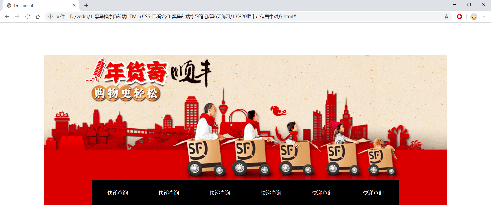

# 案例48：淘宝轮播图

~~~html
<!DOCTYPE html>
<html lang="en">
<head>
	<meta charset="UTF-8">
	<title>Document</title>
	<style>
		* {
			margin: 0;
			padding: 0;
		}
		
		li {
			list-style: none;
		}
		.tb {
			width: 520px;
			height: 280px;
			background-color: pink;
			margin:100px auto;
            /*如果是绝对定位，margin:100px auto就不起作用了*/
            /*相对定位只要没有边偏移就没有事情*/
			position: relative;   

		}

		.tb a {
            /*左右箭头是24*36规格的*/
			width: 24px;
			height: 36px;
			/*background-color: pink;*/
            /*把超链接转换成块级元素*/
			display: block;
			position: absolute;
            /*让左右箭头居中显示*/
			top: 50%;
			margin-top:-18px;
		}

		.left {
			left: 0;
			background: url(images/left.png) no-repeat;
		}

		.right {
			right: 0;
			background: url(images/right.png) no-repeat;
		}

		.tb ul {
		width: 70px;
		height: 13px;
		background: rgba(255, 255, 255, 0.3);
		position: absolute; /* 加定位*/
		bottom: 18px;
		left: 50%; /*水平走父容器的一半*/
		margin-left: -35px; /*左走自己的一半*/
		border-radius: 8px;
 	}

 	.tb ul li {
 		width: 8px;
 		height: 8px;
 		background-color: #fff;
 		float: left;
 		/*display: inline-block;*/
 		margin: 3px;
 		border-radius: 50%;
 	}

 	.tb .current {  /*前面要加tb,不然优先级不够*/
 		background-color: #f40;
 	}
	</style>
</head>
<body>
	<div class="tb">
		
		<a href="#" class="left"></a>
		<a href="#" class="right"></a>
		<ul>
			<li class="current"></li>          
			<!--5个小点是切换效果，没有链接效果 这是第4个兄弟，并列关系 -->
			<li></li>
			<li></li>
			<li></li>
			<li></li>
		</ul>
	</div>
</body>
</html>
~~~

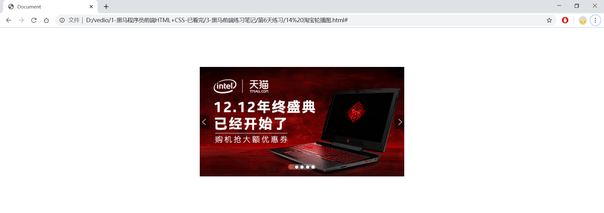

> 唉，这个你让我写我现在还写不出来。这可怎么办，这还要多久才能达到找工作的水平呢？

# 案例49：固定定位

~~~html
<!DOCTYPE html>
<html lang="en">
<head>
	<meta charset="UTF-8">
	<title>Document</title>
	<style>
		.father {
			width: 500px;
			height: 500px;
			background-color: purple;
			margin: 100px;
			position: relative;
		}
		.ad {
			width: 200px;
			height: 200px;
			background-color: pink;
            /*固定定位*/
			position: fixed;   
			left: 0;
			top: 100px;
		}
	</style>
</head>
<body>
	<div class="father">
		<div class="ad">ad</div>
	</div>
	<p>我是文字</p>
	<p>我是文字</p>
	<p>我是文字</p>
	<p>我是文字</p>
	<p>我是文字</p>
	<p>我是文字</p>
	<p>我是文字</p>
	<p>我是文字</p>
	<p>我是文字</p>
	<p>我是文字</p>
	<p>我是文字</p>
	<p>我是文字</p>
	<p>我是文字</p>
	<p>我是文字</p>
	<p>我是文字</p>
	<p>我是文字</p>
	<p>我是文字</p>
</body>
</html>
~~~

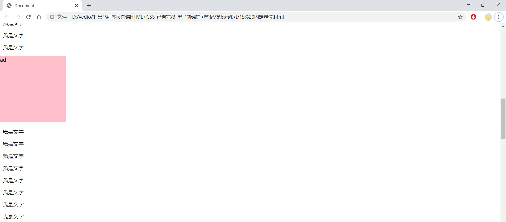

# 案例50：固定广告案例

~~~html
<!DOCTYPE html>
<html lang="en">
<head>
	<meta charset="UTF-8">
	<title>Document</title>
	<style>
	   * {
				margin: 0;
				padding: 0;
			 }
	
	.top {
		height: 44px;
    /*这个是背景图片，不会撑开盒子；插入图片才能撑开盒子*/
		background:url(images/top.png) no-repeat top center;
    /*顶部也要固定*/
		position: fixed;
    /*手动给个宽*/
		width: 100%;
    /*靠上对齐，靠左对齐*/
		top: 0;
		left: 0;
	}

	.box {
    /*如果没有宽度的话margin:44px auto o无效！！！！*/
		margin:44px auto 0;
    /*必须要加宽度，宽度就是图片的宽度*/
		width: 1002px;  
	}

	.ad-l,.ad-r {
		position: fixed;
		top: 100px;
	}

	.ad-r {
		right: 0;
	}
	
	</style>
</head>
<body>
  /*左右广告就单独放在上面就好了，反正认死理加不加父亲也没影响*/
	
	
	<div class="top"></div>
	<div class="box">
		
	</div>
</body>
</html>
~~~

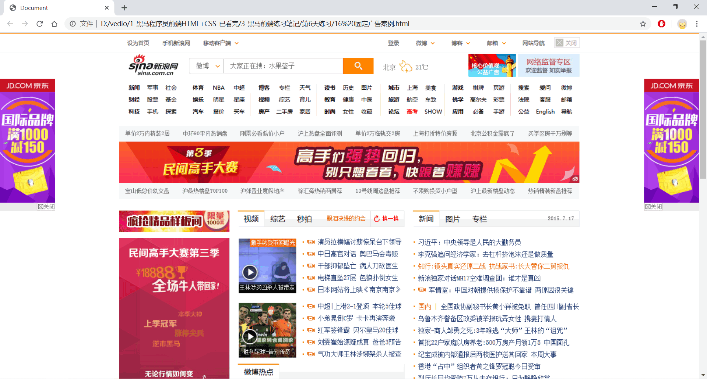

# 案例51：定位模式转换

~~~html
<!DOCTYPE html>
<html lang="en">
<head>
	<meta charset="UTF-8">
	<title>Document</title>
	<style>
		div {
			height: 100px;
			background-color: pink; 
			/* 不给宽，这个div是通览显示的，和浏览器一样宽*/
			/*float: left;  */
			/*没有宽，一浮动就转换成了行内块，而行内块跟内容有关系，你写多少字它就显示多少宽，
			你又没有内容，所以这个盒子就没了，不见了*/
      
			/*width: 100px;*/
      /*相对定位不存在转换的问题*/
			/*position: relative;  */
      
      /*绝对定位存在模式转换的问题*/
			/*position: absolute;*/
      
      /*固定定位是特殊的绝对定位，所以存在模式转换的问题*/
      /*绝对定位和固定定位都会有模式转换*/
			position: fixed;   
			
      /*你不知道它有多宽就给个100%宽*/
			width: 100%;
			top: 0;
			left: 0;
		}
	</style>
</head>
<body>
	<div></div>
</body>
</html>
~~~

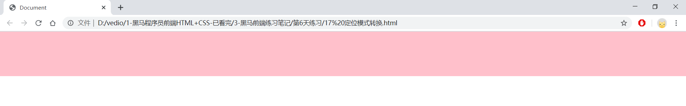

# 案例52：z-index叠放次序

~~~html
<!DOCTYPE html>
<html lang="en">
<head>
	<meta charset="UTF-8">
	<title>Document</title>
	<style>
		div {
			width: 200px;
			height: 200px;
			background-color: red;
      /*绝对定位不占有次序*/
			position: absolute; 
			/*加了绝对定位以后就全部叠到一起了*/
			/*z-index: 0;*/  
			/* 隐含着的，不会被写出来  而且只有定位的盒子才有*/
		}

		.red {
			z-index: 1;
		}		
		.blue {
			background-color: blue;
			left: 50px;
			top:50px;
			z-index: 2;
		}

		.green {
			background-color: green;
			left: 100px;
			top: 100px;
			z-index: 3;
		}
	</style>
</head>
<body>
	<div class="red"></div>
	<div class="green"></div>
	<div class="blue"></div>  
	<!-- 如果盒子都有定位，则后来者居上。最后显示是蓝色 -->
  <!--和浮动不一样，浮动是后面的跑下面去了-->
</body>
</html>
~~~

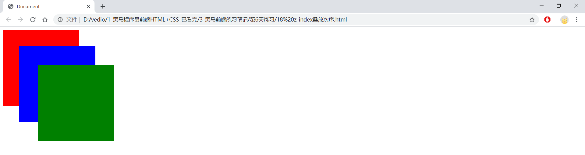

# 案例53：一个有意思的案例:压线

~~~html
<!DOCTYPE html>
<html lang="en">
<head>
	<meta charset="UTF-8">
	<title>Document</title>
	<style>
		div {
			width: 250px;
			height: 400px;
			border: 1px solid #ccc;
			float: left;
			/*background-color: pink;*/
      /*所有盒子都向左移动一个像素，但是因为是浮动的(浮动会让盒子挨在一起)，
      所以它们会先挨在一起，然后再向左移动一个像素*/
			margin-left:-1px;
			position: relative;
			/*z-index: 0;  默认是0*/

	/*如果是标准流，可以加相对定位把层级提上来；如果都是相对定位，可以添加z-index提高层级*/
		}  

		div:hover {
			border: 1px solid #f40;
			/*不写这个的话前三个格子只有三边会变成红色  相对定位脱标，只不过占有位置而已*/
			/*相对定位比标准流高一级，更加靠上，浮在上面*/
      /*鼠标放在谁上面，就让谁的z-index为1，就浮在上面*/
			z-index: 1;
		}
	</style>	
</head>
<body>
	<div></div>
	<div></div>
	<div></div>
	<div></div>
	<div></div>
</body>
</html>
~~~

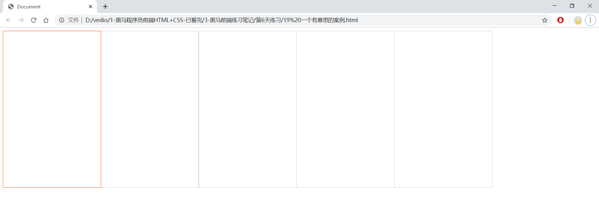

# 案例54：显示与隐藏

~~~html
<!DOCTYPE html>
<html lang="en">
<head>
	<meta charset="UTF-8">
	<title>Document</title>
	<style>
	div {
		width: 200px;
		height: 200px;
		background-color: pink;
		/*display: 显示*/
		/*display: none; 隐藏某个元素   ===  display: block 显示某个元素 不保留位置*/
		/*visibility: visible;  显示某个元素*/
		visibility: hidden;  /*隐藏某个元素  保留位置的  */
	}
	p {
		width: 200px;
		height: 400px;
		background-color: purple;
	}
	</style>
</head>
<body>
	<div></div>
	<p>放个屁</p>
</body>
</html>
~~~

> ## display 显示
>
> display 设置或检索对象是否及如何显示。
>
> display : none 隐藏对象 与它相反的是 display:block 除了转换为块级元素之外，同时还有显示元素的意思。
>
> 特点： 隐藏之后，**不再保留位置**。
>
> ## visibility 可见性
>
> 设置或检索是否显示对象。
>
> visible : 　对象可视
>
> hidden : 　对象隐藏
>
> 特点： 隐藏之后，**继续保留原有位置**。（停职留薪）
>
> ## overflow 溢出
>
> 检索或设置当对象的内容超过其指定高度及宽度时如何管理内容。
>
> visible : 　不剪切内容也不添加滚动条。
>
> auto : 　 超出自动显示滚动条，不超出不显示滚动条
>
> hidden : 　不显示超过对象尺寸的内容，超出的部分隐藏掉
>
> scroll : 　不管超出内容否，总是显示滚动条

# 案例55：仿土豆显示透明盒子

~~~html
<!DOCTYPE html>
<html lang="en">
<head>
	<meta charset="UTF-8">
	<title>Document</title>
	<style>
	a {
		display: block;
		width: 448px;
		height: 252px;
		margin: 100px;
		position: relative;
	}
	.mask {
		width: 100%;
		height: 100%;
		background:rgba(0, 0, 0, 0.4) url(images/arr.png) no-repeat center;
		position: absolute;
		/*设置边偏移，左上方*/
		top: 0;
		left: 0;
		display: none; /* 首先正常情况下 是隐藏的*/
	}

    /*什么时候出来？  鼠标放到 a 身上    是a 里面的 mask 出来*/
    a:hover .mask { /*：hover  鼠标经过a 然后 a 里面的 mask 就显示出来 所以这里用 后代选择器*/ 
    	display: block; /*显示出来*/
    }


	</style>
</head>
<body>
	<a href="#">
		
		<div class="mask"></div>
	</a>
	<a href="#">
		
		<div class="mask"></div>
	</a>
	<a href="#">
		
		<div class="mask"></div>
	</a>
</body>
</html>
~~~

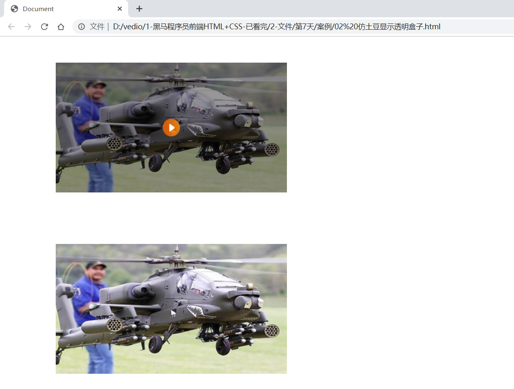

# 案例56：溢出隐藏

~~~html
<!DOCTYPE html>
<html lang="en">
<head>
	<meta charset="UTF-8">
	<title>Document</title>
	<style>
		div {
			width: 200px;
			height: 200px;
			border: 1px solid red;
			overflow: hidden;  /*溢出隐藏*/
			/*overflow: scroll;  scroll 滚动条 */
			/*overflow: auto;  auto 自动  */
		}
	</style>
</head>
<body>
	<div>
		文字文字文字文字文字文字文字文字文字文字文字文字文字
		文字文字文字文字文字文字文字文字文字文字文字文字文字
		文字文字文字文字文字文字文字文字文字文字文字文字文字
		文字文字文字文字文字文字文字文字文字文字文字文字文字
		文字文字文字文字文字文字文字文字文字文字文字文字文字
		文字文字文字文字文字文字文字文字文字文字文字文字文字
		文字文字文字文字文字文字文字文字文字文字文字文字文字
		文字文字文字文字文字文字文字文字文字文字文字文字文字
	</div>
</body>
</html>
~~~

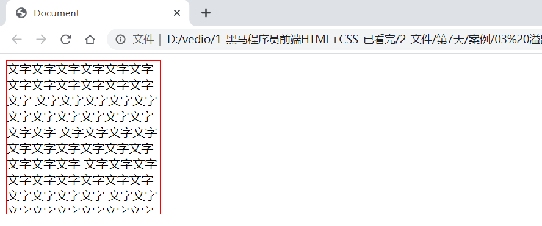

# 案例57：鼠标样式

~~~html
<!DOCTYPE html>
<html lang="en">
<head>
	<meta charset="UTF-8">
	<title>Document</title>
	<style>
	li {
		 cursor: pointer; /*让我们的鼠标样式变成小手*/
		/*cursor: text; */   /*让我们的鼠标样式变成选择*/
		/*cursor: default;*/ /* 让我们的鼠标样式小白*/
	}
	p {
		width: 100px;
		height: 100px;
		background-color: pink;
		cursor: move;  /*鼠标变成十字架样子*/
	}
	</style>
</head>
<body>
	<ul>
		<li>文字效果</li>
		<li>文字效果</li>
		<li>文字效果</li>
		<li>文字效果</li>
		<li>文字效果</li>
		<li>文字效果</li>
	</ul>

	<p></p>

	<ul>
  		<li style="cursor:default">我是小白</li>
  		<li style="cursor:pointer">我是小手</li>
  		<li style="cursor:move">我是移动</li>
  		<li style="cursor:text">我是文本</li>
	</ul>
</body>
</html>
~~~

# 案例58：轮廓线

~~~html
<!DOCTYPE html>
<html lang="en">
<head>
	<meta charset="UTF-8">
	<title>Document</title>
	<style>
	input {
		outline: none;  /*取消轮廓线的做法*/
		border: 1px solid #ccc;
		width: 200px;
		height: 25px;
		background: url(images/s.png) no-repeat 180px center;
	}
	textarea {
		resize: none;  /*防止拖拽*/
		outline: none;  /*取消蓝色边框*/
	}
	</style>
</head>
<body>
	<input type="text">
	<textarea name="" id="" cols="30" rows="10"></textarea>
</body>
</html>
~~~

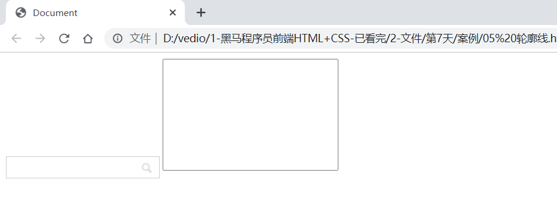

# 案例59：vertical-align 垂直对齐

~~~html
<!DOCTYPE html>
<html lang="en">
<head>
	<meta charset="UTF-8">
	<title>Document</title>
	<style>
	img {
		/*vertical-align: middle;*/
		display: block;
	}
	div {
		border: 2px solid red;
	}
	</style>
</head>
<body>
	<div>
		 
	</div>
</body>
</html>
~~~

> 以前我们讲过让**带有宽度**的**块级元素**居中对齐，是margin: 0 auto;
>
> 以前我们还讲过让文字居中对齐，是 text-align: center;
>
> 但是我们从来没有讲过有垂直居中的属性， 我们的妈妈一直很担心我们的垂直居中怎么做。
>
> vertical-align 垂直对齐， 这个看上去很美好的一个属性， 实际有着不可捉摸的脾气，否则我们也不会这么晚来讲解。
>
> vertical-align 不影响块级元素中的内容对齐，它只针对**行内元素或者行内块元素**，特别是行内块元素， **通常用来控制图片/表单与文字的对齐**。


> ### 图片、表单和文字对齐
>
> 所以我们知道，我们可以通过vertical-align 控制图片和文字的垂直关系了。 **默认的图片会和文字基线对齐**。
>
> ### 去除图片底侧空白缝隙
>
> 有个很重要特性你要记住： 图片或者表单等**行内块元素**，**他的底线会和父级盒子的基线对齐**。这样会造成一个问题，就是**图片底侧会有一个空白缝隙**。
>
> 解决的方法就是：  
>
> 1. 给img vertical-align:middle | top等等。  让图片不要和基线对齐。
> 2. 给img 添加 display：block; **转换为块级元素**就不会存在问题了。

# 案例60：溢出文字省略号

~~~html
<!DOCTYPE html>
<html lang="en">
<head>
	<meta charset="UTF-8">
	<title>Document</title>
	<style>
	* {
		margin: 0;
		padding: 0;
	}
	body {
		padding: 30px;
	}
	li {
		list-style: none;
		width: 200px;
		height: 30px;
		border: 1px solid pink;
		white-space: nowrap;
		/*1.强制在同一行内显示所有文本，直到文本结束或者遭遇br标签对象才换行*/
		overflow: hidden;  /*2.超出的部分 隐藏*/
		text-overflow: ellipsis;  /* 3. 溢出的部分用省略号替代*/
		line-height: 30px;
	}
	</style>
</head>
<body>
	<ul>
		<li>文字内容文字内容文字内容文字内容文字内容</li>
		<li>文字内容文字内容文字内容文字内容文字内容</li>
		<li>文字内容文字内容文字内容文字内容文字内容</li>
		<li>文字内容文字内容文字内容文字内容文字内容</li>
		<li>文字内容文字内容文字内容文字内容文字内容</li>
	</ul>
</body>
</html>
~~~

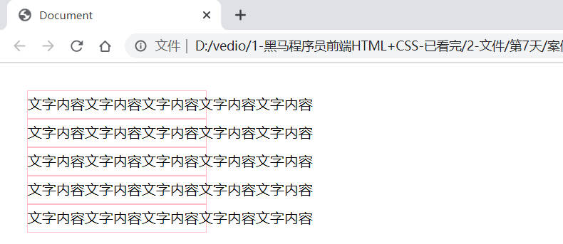

> ## word-break:自动换行
>
> normal   使用浏览器默认的换行规则。
>
> break-all   允许在单词内换行。
>
> keep-all    只能在半角空格或连字符处换行。
>
> 主要处理英文单词
>
> ## white-space
>
> white-space设置或检索对象内文本显示方式。通常我们使用于**强制一行显示内容** 
>
> normal : 默认处理方式
>
> nowrap : 强制在同一行内显示所有文本，直到文本结束或者遭遇br标签对象才换行。
>
> 可以处理中文
>
> ## text-overflow 文字溢出
>
> text-overflow : clip | ellipsis
>
> 设置或检索是否使用一个省略标记（...）标示对象内文本的溢出
>
> clip : 　不显示省略标记（...），而是简单的裁切 
>
> ellipsis : 　当对象内文本溢出时显示省略标记（...）
>
> 注意一定要首先强制一行内显示，再次和overflow属性  搭配使用

# 案例61：精灵图使用

~~~html
<!DOCTYPE html>
<html lang="en">
<head>
	<meta charset="UTF-8">
	<title>Document</title>
	<style>
	h3 {
    /*这个小旗子的大小为26*26*/
		width: 26px;
		height: 26px;
    /*26*26小方块不动，背景图片移动！！往上走(负数)184px*/
    background: url(images/index.png) no-repeat -2px -184px;
	}
	div {
		width: 236px;
		height: 106px;
    /*236*106大方块不动，背景图片移动！向上走350px*/
		background: url(images/index.png) no-repeat 0 -350px;
	}
	</style>
</head>
<body>
	<h3></h3>
	<div></div>
</body>
</html>
~~~

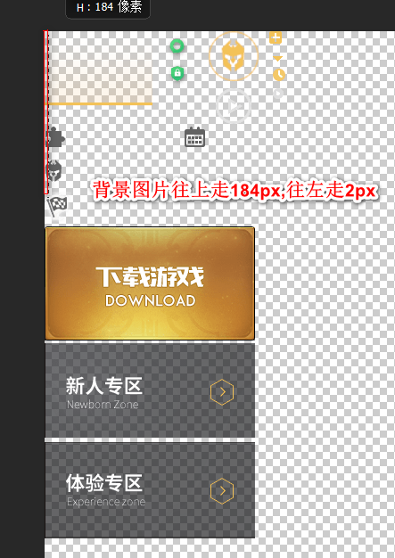

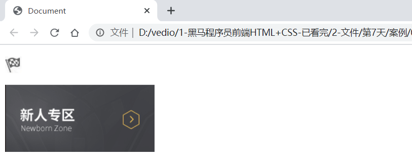

> 精灵图就是通过有一张大图，通过调整不同的坐标从而得到不同的局部图片

# 案例62：拼出自己的名字(andy)

~~~html
<!DOCTYPE html>
<html lang="en">
<head>
	<meta charset="UTF-8">
	<title>Document</title>
	<style>
	span {
		display: inline-block;
		background: url(images/abcd.jpg) no-repeat;
	}
	.aa {
		width: 108px;
		height: 110px;
		background-position: 0 -9px;

	}
	.n {
		width: 112px;
		height: 110px;
		background-position: -255px -276px;
	}
	.d {
		width: 97px;
		height: 107px;
		background-position: -363px -8px;
	}
	.y {
		width: 110px;
		height: 110px;
		background-position: -367px -556px;
	}
	</style>
</head>
<body>
	<span class="aa"></span>
	<span class="n"></span>
	<span class="d"></span>
	<span class="y"></span>
</body>
</html>
~~~


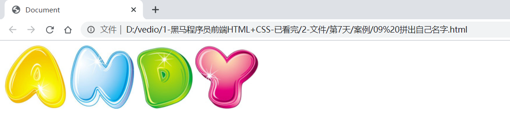

# 案例63：行高不带单位

~~~html
<!DOCTYPE html>
<html lang="en">
<head>
	<meta charset="UTF-8">
	<title>Document</title>
	<style>
		body {
			line-height: 1.5;
		}
		div {
			/*line-height: 26px;*/
			font-size: 16px;
			/*行高会继承  line-height: 1.5  1.5 * 16 字体大小 跟高度没关系  = 24   */
		}
	</style>
</head>
<body>
	<div>行高不带单位</div>
</body>
</html>
~~~

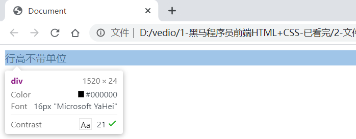

> 行高是可以继承的！！！继承的是父元素的行高。

# 案例64：字体图标引用

~~~html
<!DOCTYPE html>
<html lang="en">
<head>
	<meta charset="UTF-8">
	<title>Document</title>
	<style>
    /*这么一大段直接复制即可，不用背*/
	@font-face {  /*声明字体  引用字体*/
	  font-family: "icomoon";  /*我们自己起名字可以*/
      /*这些路径不用管，只要确保有fonts文件夹就可以了*/
	  src:  url('fonts/icomoon.eot?7kkyc2');
	  src:  url('fonts/icomoon.eot?7kkyc2#iefix') format('embedded-opentype'),
	    url('fonts/icomoon.ttf?7kkyc2') format('truetype'),
	    url('fonts/icomoon.woff?7kkyc2') format('woff'),
	    url('fonts/icomoon.svg?7kkyc2#icomoon') format('svg');
      font-weight: normal;	/*不加粗*/
	  font-style: normal;  /*倾斜字体正常--我们很多字体图标喜欢用i,用em标签包上，所以要取消倾斜*/
}	
    /*要告诉span,em里面的用的什么字体,不是宋体，也不是微软雅黑，二十icomoon*/
    span, em {
        /*这个font-family的icomoon必须和上面的@font-face的font-family名字icomoon保持一致*/
    	font-family: "icomoon"; 
        /*图标字体是字，可以改大小*/
    	font-size: 100px;
        /*图标字体是字，还可以改颜色*/
    	color: pink;
         /*图标字体是字，还可以改成不倾斜*/
    	font-style: normal;
    }
    .car {
    	font-family: "icomoon";
    }
    /*京东 CSSRESET css 初始化*/
   /* *{margin:0;padding:0}
    em,i{font-style:normal}
    li{list-style:none}
    img{border:0;vertical-align:middle}
    button{cursor:pointer}
    a{color:#666;text-decoration:none}
    a:hover{color:#c81623}
    button,input{font-family:Microsoft YaHei,tahoma,arial,Hiragino Sans GB,\\5b8b\4f53,sans-serif}

    body{
    	 background-color:#fff;font:12px/1.5 Microsoft YaHei,tahoma,
         arial,Hiragino Sans GB,\\5b8b\4f53,sans-serif;color:#666}
    	 .hide,.none{display:none}

    	 .clearfix:after{visibility:hidden;clear:both;display:block;content:".";height:0}.clearfix{*zoom:1}*/


	</style>
</head>
<body> 
	<div>行高不带单位</div>
    /*这个是icomoon文件夹中demo.html文件里的*/
	<span></span>
	<em></em>
	<div class="car"></div>
	<button>123</button>
</body>
</html>
~~~


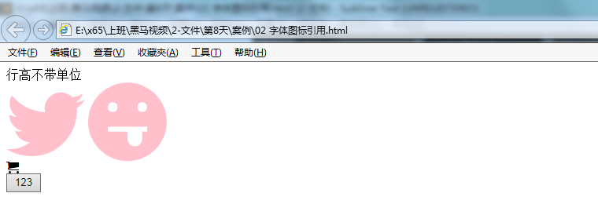

# 案例65：ul和li的关系

~~~html
<!DOCTYPE html>
<html lang="en">
<head>
	<meta charset="UTF-8">
	<title>Document</title>
	<style>
		/*ul和li都是块级元素，都是独自占一行*/
		ul{
			width: 400px;
			height: 100px;
			background-color: pink;
		}

		li{
			list-style: none;
			width: 120px;
			height: 20px;
			background-color: blue;
		}
	</style>
</head>
<body>
	<ul>
		<li>李白</li>
		<li>杜甫</li>
		<li>白居易</li>
	</ul>

	<ul>
		<li>李白</li>
		<li>杜甫</li>
		<li>白居易</li>
	</ul>
</body>
</html>
~~~

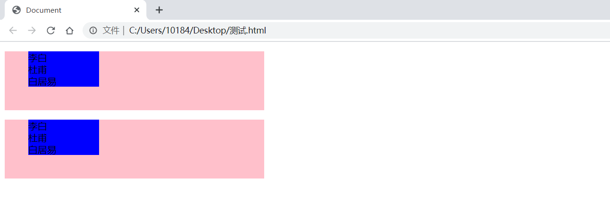

# 案例66：图片缩放

~~~html
<!DOCTYPE html>
<html lang="en">
<head>
	<meta charset="UTF-8">
	<title>Document</title>
	<style>
	 div {
	 	border: 1px solid #000;
    /*浮动转换为行内块元素*/
	 	float: left;
	 	height: 130px;
    width: 390px;
	 }
	 img {
	 	width: 100%; /*图片的宽度和父亲一样宽*/
	 	height: 100%;
	 }
	</style>
</head>
<body>
	<div>
		
	</div>
</body>
</html>
~~~

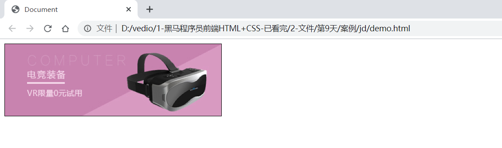

> 父亲才130px高，390px宽，它的儿子（里面的图片是260px高，780px宽，是它的两倍）
>
> 给儿子设定宽100%,高100%就能和父亲一样宽高了，这样就具有了缩放的属性了


