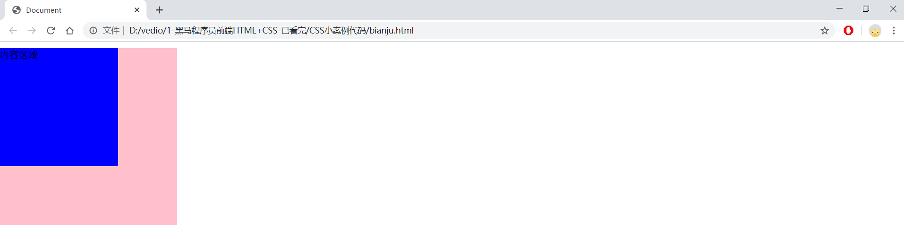
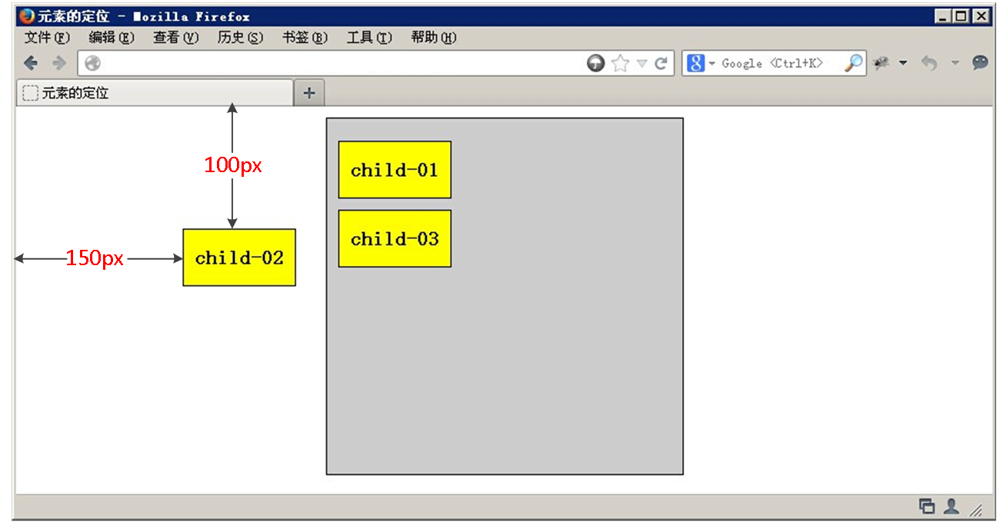
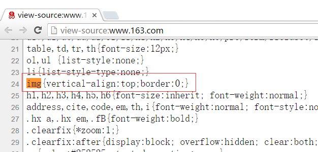
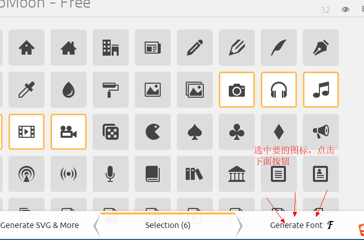
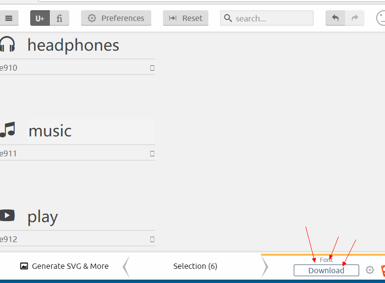

(注1：2个多月没看CSS了，开始从头复习一遍，查漏补缺。笔记是传智播客刘晓强的，后面我在此基础上也添加了一些东西。)

(注2：把《读书笔记：CSS权威指南》里的视频讲义放在这里来，这样比较好。)

(注3：现在是2020年6月17日，间隔了2个多月学了其他的东西，开始做静态页面，顺便又重新看了后面浮动、定位有关的视频，现在的印象是更加深刻了。唉，还是要温故而知新啊，不然记不住。)

(注4：现在是2021年1月12日，开始复习。)

# HTML初识

HTML的英文全称是 **Hyper Text Markup Language**，即超文本标记语言。HTML是由Web的发明者 Tim Berners-Lee和同事 Daniel W. Connolly于1990年创立的一种标记语言，它是标准通用化标记语言SGML的应用。用HTML编写的超文本文档称为HTML文档，它能独立于各种操作系统平台(如UNIX， Windows等)。使用HTML，将所需要表达的信息按某种规则写成HTML文件，通过专用的浏览器来识别，并将这些HTML文件“翻译”成可以识别的信息，即现在所见到的网页。

# 浏览器

**浏览器是网页运行的平台**，常用的浏览器有**IE、火狐(Firefox)、谷歌(Chrome)、Safari(苹果)和Opera**等。我们平时称为五大浏览器。

浏览器**内核**又可以分成两部分：**渲染引擎(layout engineer 或者 Rendering Engine)和 JS 引擎**。

渲染引擎它**负责取得网页的内容**(HTML、XML、图像等等)、**整理讯息**(例如加入 CSS 等)，以及计算网页的显示方式，然后会**输出**至显示器或打印机。浏览器的内核的不同对于网页的语法解释会有不同，所以渲染的效果也不相同。
JS 引擎 则是**解析 Javascript 语言**，执行 javascript语言来实现网页的动态效果。

最开始渲染引擎和 JS 引擎并没有区分的很明确，**后来 JS 引擎越来越独立，内核就倾向于只指渲染引擎。**有一个网页标准计划小组制作了一个 ACID 来测试引擎的兼容性和性能。内核的种类很多，如加上没什么人使用的非商业的免费内核，可能会有10多种，但是常见的浏览器内核可以分这五种：

* Chrome浏览器内核： 统称为Chromium内核或Chrome内核，以前是Webkit内核，现在是**Blink内核**。
* IE浏览器内核：**Trident内核**，也是俗称的IE内核；
* Edge浏览器内核：Edge 内核，但是打算放弃，使用谷歌浏览器的**Blink内核**;
* Opera浏览器内核：最初是自己的Presto内核，后来加入谷歌大军，从Webkit又到了**Blink内核**；

* Firefox浏览器内核：**Gecko内核**，俗称Firefox内核;
* Safari浏览器内核：**Webkit内核**；

# 标签

* 水平线标签: `<hr/>` ，英文叫horizontal。
* 换行标签： `<br />`，英文叫 break 。
* HTML提供了6个等级的标题,分别为`<h1>`到`<h6>`。

* div和span是**没有语义**的，是我们网页布局主要的2个盒子 。
* **一个div独占一行**，div就是division的缩写,分割,分区的意思。
* **多个span共享一行**，span就是跨度，跨距，范围的意思 。

> **语义化**的HTML代码，符合W3C规范：**语义化代码让搜索引擎容易理解网页**。

## 文本格式化标签

在网页中，有时需要为文字设置粗体、斜体或下划线效果，这时就需要用到HTML中的文本格式化标签，使文字以特殊的方式显示。


## 图像标签(img)


> src为标签的**必需属性**，title为鼠标悬停时显示的内容，**alt为图像不能显示时的替换文本。**
>
> **面试题：img中alt属性的作用是什么。**

## 链接标签a

单词缩写：  anchor 的缩写  [ˈæŋkə(r)] 。基本解释 锚, 铁锚 的。

在HTML中创建**超链接**非常简单，只需用标签环绕需要被链接的对象即可，其基本语法格式如下：

~~~css
<a href="跳转目标" target="目标窗口的弹出方式">文本或图像</a>
~~~

* `href`：用于指定链接目标的url地址，当为标签应用href属性时，它就具有了**超链接的功能**。  Hypertext Reference的缩写。意思是超文本引用。

* `target`：用于指定**链接页面的打开方式**，其取值有**_ self和_ blank**两种，其中_ self为默认值，_blank为在新窗口中打开方式。

注意：

* 外部链接 需要添加 http://www.baidu.com。

* 内部链接 直接链接内部页面名称即可 比如` < a href="index.HTML"> 首页 </a >`

* 如果当时没有确定链接目标时，通常**将链接标签的href属性值定义为“#”(即href="#")**，表示该链接**暂时为一个空链接**。

* 不仅可以创建**文本超链接**，在网页中**各种网页元素**，如图像、表格、音频、视频等**都可以添加超链接**。

## 锚点定位 

通过创建锚点链接，用户能够快速定位到目标内容。
创建锚点链接分为两步：

~~~css
<!--1.使用“a href=”#id名>“链接文本"</a>创建链接文本(被点击的)-->
<a href="#two">   

<!--2.使用相应的id名标注跳转目标的位置。-->
<h3 id="two">第2集</h3> 
~~~

## base标签(不熟)

[html中`<base>`标签的详细介绍](https://www.cnblogs.com/sharpest/p/7806381.html)

`< base>`标签可以**设置整体链接的打开状态**   。

通常情况下，**浏览器会从当前文档的 URL 中提取相应的元素来填写相对 URL 中的空白**。

使用 `< base> `标签可以改变这一点。**浏览器随后将不再使用当前文档的 URL，而使用指定的基本 URL 来解析所有的相对 URL**。这其中包括 < a>、< img>、< link>、< form> 标签中的 URL。

> `< base> `标签必须位于 head 元素内部。
>
> **base标签是HTML语言中的基准网址标记**，它是一个单标签，位于网页头部文件的head标签内，一个页面最多只能使用一个base元素，用来提供一个指定的默认目标，也算是一种表达路径和连接网址的标记。
>
> 常见的url路径形式分别有相对路径与绝对路径，如果base标签指定了目标，浏览器将通过这个目标来解析当前文档中的所有相对路径，包括的标签有(a、img、link、form)，也就是说，浏览器解析时会在路径前加上base给的目标，而页面中的相对路径也都转换成了绝对路径。使用了base标签就应带上href属性和target属性。

## 特殊字符标签


## 标签属性

~~~css
<标签名 属性1="属性值1" 属性2="属性值2" …> 内容 </标签名>
~~~

在上面的语法中，

* 标签可以拥有多个属性，必须写在开始标签中，位于标签名后面。

* **属性之间不分先后顺序**，标签名与属性、属性与属性之间均**以空格分开**。

* **任何标签的属性都有默认值**，省略该属性则取默认值。

* 采取键值对的格式，`key="value" `的格式  

> 提倡： 尽量不使用 样式属性。

## 路径

实际工作中，通常**新建一个文件夹专门用于存放图像文件**，这时再插入图像，就需要采用“路径”的方式来指定图像文件的位置。

路径可以分为： **相对路径和绝对路径**。

## 相对路径

以引用文件之网页所在位置为参考基础，而建立出的目录路径。因此，当保存于不同目录的网页引用同一个文件时，所使用的路径将不相同，故称之为相对路径。

* 图像文件和HTML文件位于**同一文件夹**：只需输入图像文件的名称即可，如``;。

* 图像文件位于HTML文件的**下一级文件夹**：输入文件夹名和文件名，之间用“/”隔开，如``。

* 图像文件位于HTML文件的**上一级文件夹**：在文件名之前加入`“../”` ，如果是上两级，则需要使用` “../ ../”`，以此类推，如``。

## 绝对路径

**绝对路径以Web站点根目录为参考基础的目录路径**。之所以称为绝对，意指当所有网页引用同一个文件时，所使用的路径都是一样的。如：`“D:\web\img\logo.gif”`，或完整的网络地址，例如“http://www.itcast.cn/images/logo.gif”。

## 列表标签

什么是列表？**容器里面装载着文字或图表的一种形式，叫列表。**

列表最大的特点就是  整齐 、整洁、 有序。

### 无序列表(ul)

无序列表的各个列表项之间没有顺序级别之分，是并列的。其基本语法格式如下：

~~~css
<ul>
  <li>列表项1</li>
  <li>列表项2</li>
  <li>列表项3</li>
  ......
</ul>
~~~

> 把li前面的小点点给去掉写成这样`list-style:none;`

~~~html
<!DOCTYPE HTML>
<HTML lang="en">
<head>
    <meta charset="UTF-8">
    <title>Document</title>
    <style>
        *{
            margin: 0;
            padding: 0;
        }
    
        ul{
            width: 200px;
            height: 200px;
            margin: 100px auto;
            background-color: pink;
        }
        
        li{
            width: 100px;
            height: 50px;
            background-color: blue;
            list-style-type: none;
        }
    </style>
</head>
<body>
    <ul>
        <li>无可奈何花落去</li>
        <li>似曾相识燕归来</li>
    </ul>
</body>
</HTML>
~~~


### 有序列表(ol)

有序列表即为有排列顺序的列表，其各个列表项按照一定的顺序排列定义，有序列表的基本语法格式如下：

~~~css
<ol>
  <li>列表项1</li>
  <li>列表项2</li>
  <li>列表项3</li>
  ......
</ol>
~~~

  所有特性基本与ul 一致。  

### 自定义列表

定义列表常用于对术语或名词进行解释和描述，定义列表的列表项前没有任何项目符号。其基本语法如下：

~~~css
<dl>
  <dt>名词1</dt>
  <dd>名词1解释1</dd>
  <dd>名词1解释2</dd>
  ...
  <dt>名词2</dt>
  <dd>名词2解释1</dd>
  <dd>名词2解释2</dd>
  ...
</dl>
~~~

# 表格(table)

存在即是合理的，**表格的现在还是较为常用的一种标签，但不是用来布局，常见处理、显示表格数据。**

## 创建表格

在HTML网页中，要想创建表格，就需要使用表格相关的标签。创建表格的基本语法格式如下：

~~~css
<table>
  <tr>
    <td>单元格内的文字</td>
    ...
  </tr>
</table>
~~~

在上面的语法中包含三对HTML标签，分别为` <table></table>`、`<tr</tr>`、`<td</td>`;，他们是创建表格的基本标签，缺一不可，下面对他们进行具体地解释：

* table：用于定义一个表格。
* tr：用于定义表格中的一行，必须嵌套在 table标签中，在 table中包含几对 tr，就有几行表格。
* td ：用于定义表格中的单元格，必须嵌套在`<tr></tr>`标签中，一对 `<tr> </tr>`中包含几对`<td></td>`，就表示该行中有多少列(或多少个单元格)。

注意：

* `<tr></tr>`中只能嵌套`<td></td>`。
2. `<td></td>`标签，他就像一个容器，可以容纳所有的元素。

## 表格属性


> cell：小房间，细胞，单元
>
> `cellspacing`是格子与格子之间的空隙，而`cellpadding`是格子内的空隙。


margin、padding、cellspacing、cellpadding的区别:

* margin：CSS样式，指在页面上**位置相邻的两个元素之间的距离关系**，如`margin-top`是**目标元素和目标上方的元素**之间的距离，`margin-left`目标元素和其左侧的元素之间的距离。

* padding：CSS样式，指**元素内部的空白占据的空间。**
* `cellspacing`：table元素的属性，指其中的td之间的距离，类似于margin，已不推荐使用。
* `cellpadding`：table元素的属性，指其中的td的内部的空白占据的空间，类似与padding，已不推荐使用。

> `cellspacing`、`cellpadding`都是废弃的属性了，早已不推荐使用，最新的HTML5里已经彻底去掉了这些表现型的属性。
>
> 正确的做法是，**合并表格边框**，然后用th，td的padding设置内容和边框之间的空隙。

## 表头标签

表头一般位于表格的**第一行或第一列**，其文本加粗居中，如下图所示，即为设置了表头的表格。设置表头非常简单，只需用表头标签<**th></th**>替代相应的单元格标签<td></td>即可。


## 表格结构

在使用表格进行布局时，可以将表格划分为**头部**、**主体**和**页脚**(页脚因为有兼容性问题，我们不在赘述)，具体 如下所示：

* `<thead></thead>`：用于定义表格的头部。必须位于`<table></table> `标签中，一般包含网页的logo和导航等头部信息。

* `<tbody></tbody>`：用于定义表格的主体。位于`<table></table>`标签中，一般包含网页中除头部和底部之外的其他内容。

## 表格标题(caption)

caption 元素定义表格标题。

~~~javascript
<table>
   <caption>我是表格标题</caption>
</table>
~~~

**caption 标签必须紧随 table 标签之后**。您只能对每个表格定义一个标题。通常这个标题会被居中于表格之上。

## 合并单元格(难点)

* 跨行合并：rowspan    

* 跨列合并：colspan

合并单元格的思想：将多个内容合并的时候，就会有多余的东西，把它删除。例如：**把3个td合并成一个，那就多余了2个，需要删除**。

~~~
公式：  删除的个数  =  合并的个数  - 1   
~~~

 合并的顺序 :**先上后下，先左后右。**

~~~javascript
<!DOCTYPE HTML>
<HTML lang="en">
<head>
	<meta charset="UTF-8">
	<title>Document</title>
</head>
<body>
	<table width="400" height="100" border="1">
		<tr>
			<td>123</td>
			<td>abc</td>
			<td>abc</td>
		</tr>
		<tr>
			<td colspan="2">123</td>
			<td>测试</td>
		</tr>
		<tr>
			<td>123</td>
			<td>abc</td>
			<td>abc</td>
		</tr>

	</table>
	1. 先确认跨列合并 colspan
	2. 先上后下，先左后右
	3. 删除的个数
	
	<table width="400" height="100" border="1">
		<tr>
			<td>123</td>
			<td>abc</td>
			<td rowspan="abc">abc</td>
		</tr>
		<tr>
			<td>123</td>
			<td>123</td>		
		</tr>
		<tr>
			<td>123</td>
			<td>abc</td>	
		</tr>
	</table>
	1. 先确认跨行合并 rowspan
	2. 先上后下  先左右后
	3. 删除的个数 
</body>
</HTML>
~~~

效果如下：


## 总结表格

* 表格提供了HTML 中定义表格式数据的方法。

* **表格是由行中的单元格组成**。

* **表格中没有列元素，列的个数取决于行的单元格个数**。

* 表格不要纠结于外观，那是CSS 的作用。

# 表单标签

现实中的表单，类似我们去银行办理信用卡填写的单子。 如下图：


表单的主要目的是为了**收集用户信息**。

在我们网页中， 我们也**需要跟用户进行交互，收集用户资料，此时也需要表单**。

在HTML中，一个完整的表单通常由**表单控件(也称为表单元素)、提示信息和表单域3个部分构成**。


* **表单控件**：包含了具体的表单功能项，如单行文本输入框、密码输入框、复选框、提交按钮、重置按钮等。

* **提示信息**：一个表单中通常还需要包含一些说明性的文字，提示用户进行填写和操作。

* **表单域**：他相当于一个**容器**，用来容纳所有的表单控件和提示信息，可以通过他定义处理表单数据所用程序的url地址，以及数据提交到服务器的方法。**如果不定义表单域，表单中的数据就无法传送到后台服务器**。

## input 控件(重点)

在上面的语法中，`<input/>`标签为单标签，type属性为其最基本的属性，其取值有多种，用于指定不同的控件类型。除了type属性之外，`<input/>`标签还可以定义很多其他的属性，其常用属性如下表所示。


[<input type = 'button'和< button>的区别](https://www.cnblogs.com/purediy/archive/2012/06/10/2544184.HTML)

~~~css
<input type="text" placeholder="请输入您的快递单号" class="jd">
<input type="text" value="请输入您的快递单号" class="jd">
/*placeholder和value是不一样的*/
~~~

> placeholder顾名思义是一个占位符。
>  在你的value为空的时候他才会显示出来，但是他本身并不是value，也不会被表单提交。先显示value,作为表单数据；如果没有value则显示placeholder，一个占位符。

[value和placeholder的区别](https://www.jianshu.com/p/ce9e4b148d46)

## label标签(理解)

**label 标签为input元素定义标注(标记)**。

作用：用于**绑定一个表单元素**, 当**点击label标签**的时候, 被**绑定**的表单元素就会获得**输入焦点**。

那么如何绑定元素呢？

**for属性**规定 label与哪个表单元素绑定。

~~~css
<label for="male">Male</label>
<input type="radio" name="sex" id="male" value="male">
~~~

* `< label>`标签为 input 元素定义标注(标记)。

* label 元素不会向用户呈现任何特殊效果。不过，它为鼠标用户改进了可用性。如果您在 label 元素内点击文本，就会触发此控件。就是说，当用户选择该标签时，浏览器就会自动将**焦点**转到和标签相关的表单控件上。

* `< label>`标签的 **for 属性**应当与相关元素的 **id 属性相同**。

## textarea控件(文本域)

如果需要输入大量的信息，就需要用到`<textarea></textarea>`标签。通过textarea控件可以轻松地**创建多行文本输入框**，其基本语法格式如下：

~~~javascript
<textarea cols="每行中的字符数" rows="显示的行数">
  文本内容
</textarea>
~~~


## 下拉菜单

使用**select控件**定义下拉菜单的基本语法格式如下:

~~~css
<select>
  <option>选项1</option>
  <option>选项2</option>
  <option>选项3</option>
  ...
</select>
~~~

注意：

* `<select></select>`;中至少应包含一对`option></option`。

* 在option 中定义`selected =" selected "`时，当前项即为默认选中项。

## 表单域

在HTML中，**form标签被用于定义表单域，即创建一个表单，以实现用户信息的收集和传递，form中的所有内容都会被提交给服务器**。创建表单的基本语法格式如下：

~~~javascript
<form action="url地址" method="提交方式" name="表单名称">
  各种表单控件
</form>
~~~

常用属性：

* action：在表单收集到信息后，需要将信息传递给服务器进行处理，action属性用于**指定接收并处理表单数据的服务器程序的url地址**。

* method：用于设置表单数据的提交方式，**其取值为get或post**。 

* name：用于指定**表单的名称**，以**区分同一个页面中的多个表单**。

注意：**每个表单都应该有自己表单域**。

# CSS初识

CSS通常称为CSS样式表或**层叠样式表**(级联样式表)，英文名称为Cascading Style Sheets，主要用于设置HTML页面中的文本内容(字体、大小、对齐方式等)、图片的外形(宽高、边框样式、边距等)以及版面的布局等**外观显示样式**。

CSS以HTML为基础，提供了丰富的功能，如字体、颜色、背景的控制及整体排版等，而且还可以**针对不同的浏览器设置不同的样式**。

# 引入CSS样式表(书写位置)

CSS可以写到那个位置？是不是一定写到HTML文件里面呢？

## 内嵌样式表(style属性)

内嵌样式，又有人称行内样式、行间样式。是通过标签的style属性来设置元素的样式，其基本语法格式如下：

```html
<标签名 style="属性1:属性值1; 属性2:属性值2; 属性3:属性值3;">内容</标签名>
```

语法中**style是标签的属性**，实际上任何HTML标签都拥有style属性，用来设置行内式。其中属性和值的书写规范与CSS样式规则相同，**行内式只对其所在的标签及嵌套在其中的子标签起作用**。

## 内联样式表(style标签)

内联样式是将CSS代码集中写在HTML文档的**head头部标签**中，并且用**style标签**定义，其基本语法格式如下：

```html
<head>
<style type="text/CSS">
    选择器 {属性1:属性值1; 属性2:属性值2; 属性3:属性值3;}
</style>
</head>
```

语法中，style标签**一般位于head标签中title标签之后**，**也可以把它放在HTML文档的任何地方**。

type="text/css"  在HTML5中可以**省略**， 写上也比较符合规范， 所以这个地方可以写也可以省略。

## 外链样式表(link)

外链样式是将所有的样式放在一个或多个以`.CSS`为扩展名的外部样式表文件中，通过**link标签**将外部样式表文件链接到HTML文档中，其基本语法格式如下：

```html
<head>
  <link href="CSS文件的路径"  rel="stylesheet" />
</head>
```

注意：link 是个单标签哦!!!

该语法中，link标签需要放在head**头部标签**中，并且必须指定link标签的三个属性，具体如下：

* **href**：定义所链接外部样式表文件的URL，可以是相对路径，也可以是绝对路径。
* **type**：定义所链接文档的类型，在这里需要指定为“text/css”，表示链接的外部文件为CSS样式表，**可以省略不写**。
* **rel**：定义当前文档与被链接文档之间的关系，在这里需要指定为“stylesheet”，表示被链接的文档是一个样式表文件。

## 导入样式表(@import)

导入样式使用`@import url()`进行导入CSS。

## 三种样式表总结(位置)

| 样式表     | 优点                     | 缺点                     | 使用情况       | 控制范围           |
| ---------- | ------------------------ | ------------------------ | -------------- | ------------------ |
| 内嵌样式表 | 书写方便，权重高         | 没有实现样式和结构相分离 | 较少           | 控制一个标签（少） |
| 内联样式表 | 部分结构和样式相分离     | 没有彻底分离             | 较多           | 控制一个页面（中） |
| 外链样式表 | 完全实现结构和样式相分离 | 需要引入                 | 最多，强烈推荐 | 控制整个站点（多） |

# CSS样式规则

使用HTML时，需要遵从一定的规范。CSS亦如此，要想熟练地使用CSS对网页进行修饰，首先需要了解CSS样式规则，具体格式如下：            


# 选择器(重点)

要想将CSS样式应用于特定的HTML元素，首先需要**找到该目标元素**。在CSS中，执行这一任务的样式规则部分被称为**选择器(选择符)**。


如上图所以，要把里面的小黄人分为2组，最快的方法怎办？  很多办法， 比如 一只眼睛的一组，剩下的一组 。

选择器干啥的？选择标签用的。这就用到基础选择器组：

# CSS基础选择器

[HTML中的标签和元素的区别详解](https://www.jb51.net/web/79245.html)

## 标签选择器(元素选择器)

标签选择器是指用**HTML标签名称作为选择器**，按标签名称分类，为页面中某一类标签指定统一的CSS样式。其基本语法格式如下：

```CSS
标签名{属性1:属性值1; 属性2:属性值2; 属性3:属性值3; } 
或者
元素名{属性1:属性值1; 属性2:属性值2; 属性3:属性值3; }
```

标签选择器**最大的优点**是**能快速为页面中同类型的标签统一样式**，**同时这也是他的缺点**，**不能设计差异化样式**。

标签选择器可以把某一类标签全部选择出来，例如div、span等。

## 类选择器

类选择器使用`.`(**英文点号**)进行标识，后面紧跟类名，其基本语法格式如下：

```javascript
.类名{属性1:属性值1; 属性2:属性值2; 属性3:属性值3; }
```

标签调用的时候用`class=“类名”`即可。

类选择器最大的优势是**可以为元素对象定义单独或相同的样式**。 可以选择一个或者多个标签。

小技巧：

* 长名称或词组可以使用**中横线**来为选择器命名(我也比较喜欢中横线)。
* **不建议使用`“_”`下划线来命名CSS选择器**。
* 不要纯数字、中文等命名， 尽量使用英文字母来表示。

> 现在是2021年1月12日，截止到这里复习完。

## 多类名选择器

我们可以**给标签指定多个类名，从而达到更多的选择目的**。


注意：

* 样式显示效果跟HTML元素中的**类名先后顺序没有关系**,受**CSS样式书写的上下顺序有关**。
2. 各个类名中间用**空格**!!!!!!隔开。(不是逗号，也不是分号隔开)

```html
<!DOCTYPE HTML>
<HTML lang="en">
<head>
	<meta charset="UTF-8">
	<title>Document</title>
	<style>
        .num1{
        	color: red;   
            /*在上面，该样式不会执行*/
        }

        .yihao{
        	color: blue;
            /*后来者居上，会执行*/
        }
	</style>
</head>
<body>
	<h1 class="num1 yihao">我是一号标题</h1>
    /*num1在yihao的前面，但是没用，不看这个*/
</body>
</HTML>
```

> h1有两个名字，一个叫num1,一个叫yihao,虽然类名num1在yihao的前面，但是不看这个，看style中哪个在最下面(**最下面的会覆盖最上面的效果**)因此h1最终的颜色是蓝色，而不是红色。

## id选择器

id选择器使用`“#”`进行标识，**后面紧跟id名**，其基本语法格式如下：

```
#id名{属性1:属性值1; 属性2:属性值2; 属性3:属性值3;}
```

该语法中，id名即为HTML元素的id属性值，**大多数HTML元素都可以定义id属性，元素的id值是唯一的，只能对应于文档中某一个具体的元素。**

用法基本和类选择器相同。

## id选择器和类选择器区别

W3C标准规定，**在同一个页面内，不允许有相同名字的id对象出现，但是允许相同名字的class**。

类选择器(class) 好比人的名字，  是可以多次重复使用的， 比如张伟、王伟、李伟、李娜。

id选择器     好比人的身份证号码，  全中国是唯一的， 不得重复。 只能使用一次。


* 类选择器名开头是"."(英文状态下的点)，而id选择器名开头是"#"(井号！！！！)
* id选择器和类选择器最大的不同在于使用次数上。(**类选择器用的多**)
* **类选择器和ID选择器可能是区分大小写的**，这取决于文档语言。(试了一下确实区分大小写)

## 通配符选择器

通配符   选择器用`“*”`号表示，他是所有选择器中**作用范围最广**的，能匹配页面中所有的元素。其基本语法格式如下：

```
* { 属性1:属性值1; 属性2:属性值2; 属性3:属性值3; }
```

例如下面的代码，使用通配符选择器定义CSS样式，清除所有HTML标记的默认边距。

```css
* {
  margin: 0;                    /* 定义外边距*/
  padding: 0;                   /* 定义内边距*/
}
```

注意：这个通配符选择器，就像我们的电影明星中的梦中情人， 想想它就好了，但是它不会和你过日子， 用的不多。

# CSS复合选择器

复合选择器是由两个或多个基础选择器，通过不同的方式组合而成的,目的是为了可以选择更准确更精细的目标元素标签。

## 交集选择器

交集选择器**由两个选择器构成**，**其中第一个为标签选择器，第二个为class选择器**，两个选择器之间不能有空格，如`h3.special`。


**记忆技巧：**

交集选择器 是 <strong style="color:#f00">并且</strong>的意思，即...又...的意思

```
比如： p.one  选择的是： 类名为 .one  的 段落标签。  
```

用的相对来说比较少，不太建议使用。

## 并集选择器

并集选择器(CSS选择器分组)是各个选择器通过<strong style="color:#f00">逗号</strong>连接而成的，**任何形式的选择器(包括标签选择器、class类选择器id选择器等)，都可以作为并集选择器的一部分。**如果某些选择器定义的样式完全相同，或部分相同，就可以利用并集选择器为它们定义相同的CSS样式。


记忆技巧：

并集选择器 <strong style="color:#f00">和</strong> 的意思，  就是说，只要逗号隔开的，所有选择器都会执行后面样式。

```
比如  .one, p , #test {color: #F00;}  表示.one和p和 #test这三个选择器都会执行颜色为红色。通常用于集体声明。
```

## 后代选择器(儿子，孙子，重孙子)

后代选择器又称为包含选择器，用来选择元素或元素组的后代，其写法就是**把外层标签写在前面，内层标签写在后面，中间用<strong style="color:#f00">空格</strong>分隔**。**当标签发生嵌套时，内层标签就成为外层标签的后代。**

**子孙后代都可以这么选择**。 或者说，它能选择任何包含在内的标签。 

## 子元素选择器(只包括亲儿子)

子元素选择器只能选择作为某元素子元素的元素。其写法就是把父级标签写在前面，子级标签写在后面，中间跟一个 <strong style="color:#f00">></strong>进行连接，注意，**符号左右两侧各保留一个空格。**


白话：  这里的子 指的是亲儿子，不包含孙子、重孙子之类。

~~~css
 比如： .demo > h3 {color: red;}   说明  h3 一定是demo 亲儿子。  demo 元素包含着h3。
~~~

## 伪类选择器	

 **伪类选择器用于向某些选择器添加特殊的效果**。比如给链接添加特殊效果，比如可以选择 第1个，第n个元素。

为了和我们刚才学的类选择器相区别，  类选择器是一个点，比如` .demo{} `。而**我们的伪类用2个点，就是冒号**。比如  `:link{}`

### 链接伪类选择器

~~~css
:link      /* 未访问的链接 */
:visited   /* 已访问的链接 */
:hover     /* 鼠标移动到链接上 */
:active    /* 选定的链接 */
~~~

>    注意写的时候，**他们的顺序尽量不要颠倒**  按照  lvha 的顺序。`love   hate由爱生恨`记忆法 ，或者`lv包包非常 hao `记忆法。

~~~css
a {   
    /* a是标签选择器  所有的链接 */
	font-weight: 700;
	font-size: 16px;
	color: gray;
}

a:hover {   
    /* :hover 是链接伪类选择器 鼠标经过 */
    /*鼠标经过的时候，由原来的 灰色 变成了红色 */
    color: red; 
}
~~~

# CSS字体样式属性

## font-size:字号大小

`font-size`属性用于设置字号，**该属性的值可以使用相对长度单位，也可以使用绝对长度单位**。其中，相对长度单位比较常用，**推荐使用像素单位px**，绝对长度单位使用较少。具体如下：


## font-family:字体

`font-family`属性用于设置字体。网页中常用的字体有宋体、微软雅黑、黑体等，例如将网页中所有段落文本的字体设置为微软雅黑，可以使用如下CSS样式代码：

~~~css
p{ font-family:"微软雅黑";}
~~~

**可以同时指定多个字体，中间以逗号隔开，表示如果浏览器不支持第一个字体，则会尝试下一个，直到找到合适的字体。**

常用技巧：

* 现在网页中普遍使用14px+。
* **尽量使用偶数的数字字号**。IE6等老式浏览器支持奇数会有bug。

* 各种字体之间必须使用**英文状态下的逗号隔开**。

* **中文字体需要加英文状态下的引号**，英文字体一般不需要加引号。当需要设置英文字体时，**英文字体名必须位于中文字体名之前**。

* 如果字体名中包含**空格**、#、$等符号，则**该字体必须加英文状态下的单引号或双引号**，例如`font-family: "Times New Roman";`。

* **尽量使用系统默认字体**，保证在任何用户的浏览器中都能正确显示。

## CSS Unicode字体

在 CSS 中设置字体名称，**直接写中文是可以的**。但是在文件编码(GB2312、UTF-8 等)不匹配时会产生乱码的错误。XP系统不支持类似微软雅黑的中文。

* 方案一： 你可以使用英文来替代。 比如`font-family:"Microsoft Yahei"`。

* 方案二： **在 CSS 直接使用 Unicode 编码来写字体名称可以避免这些错误**。使用 Unicode 写中文字体名称，浏览器是可以正确的解析的。`font-family: "\5FAE\8F6F\96C5\9ED1"`，表示设置字体为“微软雅黑”。


可以通过`escape()`来测试属于什么字体。

| 字体名称    | 英文名称        | Unicode 编码         |
| ----------- | --------------- | -------------------- |
| 宋体        | SimSun          | \5B8B\4F53           |
| 新宋体      | NSimSun         | \65B0\5B8B\4F53      |
| 黑体        | SimHei          | \9ED1\4F53           |
| 微软雅黑    | Microsoft YaHei | \5FAE\8F6F\96C5\9ED1 |
| 楷体_GB2312 | KaiTi_GB2312    | \6977\4F53_GB2312    |
| 隶书        | LiSu            | \96B6\4E66           |
| 幼园        | YouYuan         | \5E7C\5706           |
| 华文细黑    | STXihei         | \534E\6587\7EC6\9ED1 |
| 细明体      | MingLiU         | \7EC6\660E\4F53      |
| 新细明体    | PMingLiU        | \65B0\7EC6\660E\4F53 |

为了照顾不同电脑的字体安装问题，我们尽量只使用**宋体**和**微软雅黑**中文字体。

## font-weight:字体粗细

字体加粗除了用 b 和strong标签之外，可以使用CSS来实现，但是CSS是没有语义的。

font-weight属性用于定义字体的粗细，其可用属性值：normal、bold、bolder、lighter、100~900(**100的整数倍**)。

小技巧： **数字 400 等价于 normal，而 700 等价于 bold**。  但是我们更喜欢用数字来表示。  

## font-style:字体风格(斜不斜)

字体倾斜除了用 i 和em标签之外，可以使用CSS 来实现，但是CSS 是没有语义的。

font-style属性用于定义字体风格，如**设置斜体、倾斜或正常字体**，其可用属性值如下：

* `normal`：默认值，浏览器会显示标准的字体样式。

* `italic`：浏览器会显示斜体的字体样式。

* `oblique`：浏览器会显示倾斜的字体样式。

小技巧： **平时我们很少给文字加斜体，反而喜欢给斜体标签(em，i)改为普通模式**。

## font:综合设置字体样式 (斜粗大体,必须大体)

**font属性用于对字体样式进行综合设置**，其基本语法格式如下：

```css
选择器{font: font-style  font-weight  font-size/line-height  font-family;}
```

* **使用font属性时，必须按上面语法格式中的顺序书写，不能更换顺序，各个属性以空格隔开**。
* 注意：其中不需要设置的属性可以省略(取默认值)，但**必须保留`font-size`和`font-family`属性，否则font属性将不起作用**。(**必须要保证有"大体！！！！"**)

# CSS外观属性

## color:文本颜色

color属性用于定义**文本的颜色**，其取值方式有如下3种：

* **预定义的颜色值**，如red，green，blue等。

* **十六进制**，如`#FF0000，#FF6600，#29D794`等。实际工作中，**十六进制是最常用的定义颜色的方式**。

* **RGB代码**，如红色可以表示为`rgb(255,0,0)`或`rgb(100%,0%,0%)`。

需要注意的是，**如果使用RGB代码的百分比颜色值，取值为0时也不能省略百分号，必须写为0%**。

## line-height:行间距(不熟)

> `line-height`属于我不太熟悉的概念，需要进行额外学习。

`line-height`属性用于设置行间距，就是**行与行之间的距离**，即字符的垂直间距，一般称为行高。`line-height`常用的属性值单位有三种，分别为**像素px，相对值em和百分比%**，实际工作中使用最多的是**像素px**

一般情况下，**行距比字号大7.8像素左右就可以了**。

 [CSS行高](https://www.cnblogs.com/dolphinX/p/3236686.HTML)

[深入理解CSS行高](https://www.cnblogs.com/rainman/archive/2011/08/05/2128068.html)

### 行高的测量


行高我们利用最多的一个地方是： 可以让一行文本在盒子中**垂直居中对齐**。

做法就是： **文字的行高等于盒子的高度。**

这里情况些许复杂，开始学习，我们可以先从简单地方入手学会。


上距离和下距离总是相等的，因此文字看上去是垂直居中的。

* 如果行高等于height 高度，文字会垂直居中。

* 如果行高大于高度，文字会偏下。

* 如果行高小于高度 ，文字会 偏上 。

## text-align:水平对齐方式

`text-align`属性用于设置文本内容的水平对齐，**相当于HTML中的align对齐属性**。其可用属性值如下：

* left：左对齐(默认值)

* right：右对齐

* center：居中对齐

是让盒子里面的<strong style="color:#f00">内容</strong>水平居中， 而不是让盒子居中对齐。

`text-align` 是CSS属性，定义**行内内容**(例如文字)如何相对它的块父元素对齐。

`text-align`**并不控制块级元素自己的对齐，只控制它的行内内容的对齐**。

### text-align与align的区别

`text-align`是CSS的属性，比如下代码：

```css
<p style=" text-align:center">居中对齐</p>
```

`align`作为标签属性使用，一般表格中应用较多，如下代码：

```css
<td align="center"></td>
```

> align 属性规定 div 元素中的内容的水平对齐方式,但无法让盒子居中(盒子居中用margin)

> 一个是元素自带的属性,一个是CSS的。最好用CSS的。

因为**`text-align`只应用于块级元素(如段落)**，所以无法将行内的一个锚居中而不影响行中的其余部分(你可能也不想这么做，因为这很可能导致文本重叠)

## text-indent:首行缩进

`text-indent`属性用于设置首行文本的缩进，其属性值可为不同单位的数值、em字符宽度的倍数、或相对于浏览器窗口宽度的百分比%，允许使用负值, 建议使用em作为设置单位。

**1em就是一个字的宽度**   如果是汉字的段落， 1em就是一个汉字的宽度。

## text-decoration 文本的装饰

`text-decoration`通常我们用于给链接修改装饰效果。

| 值           | 描述                                          |
| ------------ | --------------------------------------------- |
| none         | 默认。定义标准的文本。                        |
| underline    | 定义文本下的一条线。下划线 也是我们链接自带的 |
| overline     | 定义文本上的一条线。                          |
| line-through | 定义穿过文本下的一条线。                      |

# 标签显示模式(display)

我们网页的标签非常多，再不同地方会用到不同类型的标签，以便更好的完成我们的网页。

HTML标签一般分为**块标签**和**行内标签**两种类型，它们也称**块元素**和**行内元素**。具体如下：

## 块级元素(block-level)

每个块元素通常都会**独自占据一整行或多整行**，可以对其设置宽度、高度、对齐等属性，常用于网页布局和网页结构的搭建。 

常见的块元素有`<h1>~<h6>、<p>、<div>、<ul>、<ol>、<dl>、<li>`等，其中`<div>`标签是最典型的块元素。

  

块级元素的特点：

* 总是从新行开始

* 高度，行高、外边距以及内边距都可以控制。

* 宽度默认是容器的100%

* 可以容纳内联元素和其他块元素。

## 行内元素(inline-level)

行内元素(内联元素)不占有独立的区域，**仅仅靠自身的字体大小和图像尺寸来支撑结构**，一般**不可以设置宽度、高度、对齐**等属性，常用于控制页面中文本的样式。

常见的行内元素有`<a>、<strong>、<b>、<em>、<i>、<del>、<s>、<ins>、<u>、<span>`等，其中`<span>`标签最典型的行内元素。

    

行内元素的特点：

* 和相邻行内元素**在一行上**。

* **高、宽**无效，但**水平方向的padding和margin可以设置，垂直方向的无效**。

* **默认宽度就是它本身内容的宽度。**

* **行内元素只能容纳文本或则其他行内元素**。(a特殊，a里面可以放块级元素 )

​     注意：

* 只有文字才能组成段落，因此**p里面不能放块级元素**，同理还有这些标签`h1-h6`，`dt`，**他们都是文字类块级标签，里面不能放其他块级元素**。
2. 链接里面不能再放链接。
3. a里面可以放块级元素。

## 行内块元素(inline-block)

在行内元素中有几个特殊的标签——``、`<input/>`、`<dt>`，**可以对它们设置宽高和对齐属性**，有些资料可能会称它们为行内块元素。

行内块元素的特点：

* 和相邻行内元素(行内块)在一行上,但是**之间会有空白缝隙**。
* **默认宽度就是它本身内容的宽度**。
* 高度，行高、外边距以及内边距都可以控制。
* 行内块元素一行可以放多个，**行内块的宽度和高度与内容有关系**。


## 标签显示模式转换 display

* 块转行内：`display:inline;`

* 行内转块：`display:block;`

* 块、行内元素转换为行内块： `display: inline-block;`

此阶段，我们只需关心这三个，其他的是我们后面的工作。

# CSS书写规范

开始就形成良好的书写规范，是你专业化的开始。

## 空格规范

* **选择器 与 { 之间必须包含空格**。示例： `.selector { }`

* **属性名与之后的 `: `之间不允许包含空格，` : `与 属性值之间必须包含空格**。示例：`font-size: 12px;`

## 选择器规范

* 当一个 rule 包含多个 selector 时，**每个选择器声明必须独占一行**。

示例：

```css
/* good */
.post,
.page,
.comment {
    line-height: 1.5;
}


/* bad */
.post, .page, .comment {
    line-height: 1.5;
}
```

* 选择器的**嵌套层级应不大于 3 级**，位置靠后的限定条件应尽可能精确。

示例：

```css
/* good */
#username input {}
.comment .avatar {}

/* bad */
.page .header .login #username input {}
.comment div * {}
```

## 属性规范

* **属性定义必须另起一行**。

示例：

```css
/* good */
.selector {
    margin: 0;
    padding: 0;
}

/* bad */
.selector { margin: 0; padding: 0; }

```

* 属性定义后必须以分号结尾。

示例：

```css
/* good */
.selector {
    margin: 0;
}

/* bad */
.selector {
    margin: 0
}
```

> 现在是2021年1月13日，截止到这里复习完。

# CSS 三大特性

**层叠、继承、优先级，是我们学习CSS 必须掌握的三个特性。**

## CSS层叠性

所谓层叠性是指**多种CSS样式的叠加**。

是浏览器处理冲突的一个能力,**如果一个属性通过两个相同选择器设置到同一个元素上，那么这个时候一个属性就会将另一个属性层叠掉**。

比如先给某个标签指定了内部文字颜色为红色，接着又指定了颜色为蓝色，此时出现一个标签指定了相同样式不同值的情况，这就是**样式冲突**。  

**就近原则：**

一般情况下，如果出现样式冲突，则会按照CSS书写的顺序，以**最后的样式为准**。

* 样式冲突，遵循的原则是就近原则。 那个样式离着结构近，就执行那个样式。

* 样式不冲突，不会层叠

CSS最后的执行口诀：  **长江后浪推前浪，前浪死在沙滩上**。


## CSS继承性

所谓继承性是指书写CSS样式表时，**子标签会继承父标签的某些样式**，如文本颜色和字号。**想要设置一个可继承的属性，只需将它应用于父元素即可(子元素自动继承)**。

简单的理解就是：**子承父业**。

CSS最后的执行口诀：  **龙生龙，凤生凤，老鼠生的孩子会打洞**。


**注意：**

恰当地使用继承可以**简化代码，降低CSS样式的复杂性**。子元素可以继承父元素的样式(`text-`，`font-`，`line-`这些元素开头的都可以继承，以及`color属性`。但是注意：不是所有的属性都能继承，比如**高继承不了**)

~~~css
<!DOCTYPE HTML>
<HTML lang="en">
<head>
	<meta charset="UTF-8">
	<title>Document</title>
	<style>
		p {  /*权重：0001*/
			color: red !important;   
            /*即使你有个再厉害的爹，最后还是要靠自己*/
		}
		.father {  /*权重：0010*/
			color: yellow;
		}
		div{
			color:pink;
		}
	</style>
</head>
<body>
	<div class="father"> div里面的内容
		<p>继承的问题</p>   
		<!-- 只要p里面给了颜色，就优先执行自己的，不执行父亲的 -->
	</div>
</body>
</HTML>
~~~

* **继承的权重为0**。
* `div里面的内容`颜色为**黄色**，`继承的问题`颜色为**红色**。

## CSS优先级

定义CSS样式时，**经常出现两个或更多规则应用在同一元素上**，这时就会出现优先级的问题。

在考虑权重时，初学者还需要注意一些特殊的情况，具体如下：

* **继承样式的权重为0**。即在嵌套结构中，不管父元素样式的权重多大，被子元素继承时，他的权重都为0，也就是说子元素定义的样式会覆盖继承来的样式。
* **行内样式优先**。应用style属性的元素，其行内样式的权重非常高，可以理解为远大于100。总之，他拥有比上面提高的选择器都大的优先级。
* **权重相同时，CSS遵循就近原则**。也就是说靠近元素的样式具有最大的优先级，或者说**排在最后的样式优先级最大**。
* **CSS定义了一个`!important`命令，该命令被赋予最大的优先级**。也就是说不管权重如何以及样式位置的远近，`!important`都具有最大优先级。(不建议用这个，威力太大)

~~~html
<!DOCTYPE HTML>
<HTML lang="en">
<head>
	<meta charset="UTF-8">
	<title>Document</title>
	<style>
		#ya {
			color: blue;  /*id选择器权重高于类选择器*/   /*权重 0,1,0,0*/
		}
		
		.yase {  /*类选择器权重高于标签选择器*/    		 /*权重 0,0,1,0*/
			color: green;
		}
        
		div {  /*!important权重：无穷大*/			/*权重 0,0,0,1*/
			color: red!important;   
		}
		
		 * {  /*和继承的权重最低 0,0,0,0*/
			color: pink;
			
		  }
        
        /*行内权重orange为 1,0,0,0*/
	</style>
</head>
<body>
	<div class="yase" id="ya" style="color: orange;">亚瑟</div>
</body>
</HTML>
~~~

> 最后显示为红色

### CSS特殊性(Specificity)

关于CSS权重，我们需要一套计算公式来去计算，这个就是 CSS Specificity，我们称为CSS特性或称非凡性，它是一个衡量CSS值优先级的一个标准 具体规范入如下：

specificity用一个四位的数 字串(CSS2是三位)来表示，更像四个级别，值从左到右，左面的最大，一级大于一级，数位之间没有进制，级别之间不可超越。 

| 继承或者* 的贡献值           | 0,0,0,0  |
| ---------------------------- | -------- |
| 每个元素（标签）贡献值为     | 0,0,0,1  |
| 每个类，伪类贡献值为         | 0,0,1,0  |
| 每个ID贡献值为               | 0,1,0,0  |
| 每个行内样式贡献值           | 1,0,0,0  |
| 每个!important贡献值  重要的 | ∞ 无穷大 |

权重是可以叠加的

 比如的例子：

* `div ul li`   -------->      0,0,0,3
* `.nav ul li` -------->      0,0,1,2
* `a:hover`     -----—-->      0,0,1,1
* `.nav a`       ---------->      0,0,1,1   
* `#nav p`       ---------->      0,1,0,1

  注意： 

**数位之间没有进制** 比如说：` 0,0,0,5 + 0,0,0,5 =0,0,0,10`而不是 0,0, 1, 0， 所以**不会存在10个div能赶上一个类选择器的情况**。

总结优先级：

* 使用了 !important声明的规则。

* **内嵌**在 HTML 元素的 style属性里面的声明。

* 使用了 ID 选择器的规则。

* 使用了类选择器、属性选择器、伪元素和伪类选择器的规则。

* 使用了元素选择器的规则。

* 只包含一个通用选择器的规则。

* 同一类选择器则遵循就近原则。

* 继承的权重是0

总结：**权重是优先级的算法，层叠是优先级的表现**。

> 现在是2021年1月14日，截止到这里复习完。

# CSS 背景(background)

CSS 可以**添加背景颜色和背景图片**，以及来进行图片设置。

| background-color                                            | 背景颜色             |
| ----------------------------------------------------------- | -------------------- |
| background-image                                            | 背景图片地址         |
| background-repeat                                           | 是否平铺             |
| background-position                                         | 背景位置             |
| background-attachment                                       | 背景固定还是滚动     |
| background:背景颜色 背景图片地址 背景平铺 背景滚动 背景位置 | 背景的合写(复合属性) |

## 背景图片(background-image)

**语法：** 

```css
background-image : none | url (url) 
```

**参数：** 

* `none` : 无背景图(默认的)
* `url` : 使用绝对或相对地址指定背景图像 

`background-image`属性允许指定一个图片展示在背景中(只有CSS3才可以多背景)可以和`background-color `连用。 **如果图片不重复地话，图片覆盖不到地地方都会被背景色填充**。 如果有背景图片平铺，则会覆盖背景颜色。

小技巧：  我们提倡背景图片后面的地址，**url不要加引号**。

## 背景平铺(repeat)

**语法：** 

```css
background-repeat : repeat | no-repeat | repeat-x | repeat-y 
```

**参数：** 

* `repeat` : 背景图像在纵向和横向上平铺(默认的)

* `no-repeat` : 背景图像不平铺

* `repeat-x `: 背景图像在横向上平铺

* `repeat-y `: 背景图像在纵向平铺 

设置背景图片时，**默认把图片在水平和垂直方向平铺以铺满整个元素。**


设置背景图片时，默认把图片在水平和垂直方向平铺以铺满整个元素。


## 背景位置(position)

**语法：** 

```css
background-position : length || length

background-position : position || position 
```

**参数：** 

* length : 百分数 | 由浮点数字和单位标识符组成的长度值。请参阅长度单位 
* position : `top | center | bottom | left | center | right `

**说明：** 

设置或检索对象的背景图像位置。必须先指定background-image属性。默认值为：(0% 0%)。
**如果只指定了一个值，该值将用于横坐标。**纵坐标将默认为50%。第二个值将用于纵坐标。

注意：

* **position 后面是x坐标和y坐标。 可以使用方位名词或者 精确单位**。

* 如果和精确单位和方位名字混合使用，则**必须是x坐标在前，y坐标后面**。比如`background-position: 15px top;  ` 则 15px 一定是 x坐标 ，top是 y坐标。

实际工作用的最多的，就是**背景图片居中对齐**了。

> 写京东页面的时候，2对大翅膀的广告就要加`top center`来居中对齐

## 背景附着(attachment)

**语法：** 

```css
background-attachment : scroll | fixed 
```

**参数：** 

* scroll : 　背景图像是随对象内容滚动
* fixed : 　背景图像固定 

**说明：** 设置或检索背景图像是随对象内容滚动还是固定的。

## 背景简写(不强制)

background属性的值的**书写顺序官方并没有强制标准的**。为了可读性，建议大家如下写：

`background:背景颜色 背景图片地址 背景平铺 背景滚动 背景位置`

```css
background: transparent url(image.jpg) repeat-y  scroll 50% 0 ;
background: #fff url(images/ms.jpg) no-repeat fixed center top;
```

## 背景透明(CSS3)

CSS3支持背景半透明的写法语法格式是:

```css
background: rgba(0,0,0,0.3);
```

 **最后一个参数是alpha 透明度** ，取值范围**0~1之间**(1是完全不透明，0是完全透明)。

 注意：背景半透明是指**盒子背景半透明， 盒子里面的内容不收影响。**

# CSS3一些属性

## transform属性

> CSS transform 属性允许你修改CSS视觉格式模型的坐标空间。使用它，元素可以被转换(translate)、旋转(rotate)、缩放(scale)、倾斜(skew)。

~~~css
transform:translate(-50%,-50%)
/*在不知道自身宽高的情况下，可以利用它来进行水平垂直居中*/
~~~

[transform:translate(-50%,-50%)实现水平垂直居中](<https://www.cnblogs.com/knuzy/p/9993181.HTML>)

> translate()函数是CSS3的新特性.在不知道自身宽高的情况下，可以利用它来进行水平垂直居中。
>
> 当使用`top: 50%;left: 50%;`， 是以左上角为原点，故不处于中心位置
>
>  `translate(-50%,-50%) `作用是，往上(x轴),左(y轴)移动自身长宽的 50%，以使其居于中心位置。

> 与负margin-left和margin-top实现居中不同的是，`margin-left`必须知道自身的宽高，而translate可以在不知道宽高的情况下进行居中，`tranlate()`函数中的百分比是相对于自身宽高的百分比，所以能进行居中。

> 现在是2021年1月15日，截止到这里复习完。

# 盒子模型(CSS重点)

其实，CSS就三个大模块：  **盒子模型 、浮动 、定位**，其余的都是细节。要求这三部分，无论如何也要学的非常精通。  

所谓盒子模型就是**把HTML页面中的元素看作是一个矩形的盒子，也就是一个盛装内容的容器**。每个矩形都由**元素的内容**、**内边距(padding)**、**边框(border)**和**外边距(margin)**组成。

## 看透网页布局的本质

网页布局中，我们是如何把里面的文字，图片，**按照美工给我们的效果图**排列的整齐有序呢？


牛奶是怎样运输，让消费者购买的呢？


我们说过，**行内元素比如文字类似牛奶，也需要一个盒子把他们装起来**，**我们前面学过的双标签都是一个盒子**。有了盒子，我们就可以随意的，自由的，摆放位置了。

**看透网页布局的本质：  把网页元素比如文字图片等等，放入盒子里面，然后利用CSS摆放盒子的过程，就是网页布局。**


**CSS 其实没有太多逻辑可言 ， 类似我们小时候玩的积木,我们可以自由的，随意的摆放出我们想要的效果。**


## 盒子模型(Box Model)

这里略过 老旧的IE盒子模型(IE6以下)，对不起，我都没见过IE5的浏览器。 

首先，我们来看一张图，来体会下什么是盒子模型。


**所有的文档元素(标签)都会生成一个矩形框，我们成为元素框(element box)**，它描述了一个文档元素在网页布局中所占的位置大小。因此，<strong style="color: #f00;">每个盒子除了有自己大小和位置外，还影响着其他盒子的大小和位置。</strong>


## 盒子边框(border)

边框就是那层皮。  橘子皮。。柚子皮。。橙子皮。。。

语法： 

```css
border: border-width || border-style || border-color 
```

边框属性—设置边框样式(border-style)

边框样式用于定义页面中边框的风格，常用属性值如下：

* `none`：没有边框即忽略所有边框的宽度(默认值)
* `solid`：边框为单实线(最为常用的)
* `dashed`：边框为虚线  
* `dotted`：边框为点线
* `double`：边框为双实线

### 盒子边框写法总结表

| 设置内容     | 样式属性                                                     | 常用属性值                                                   |
| ------------ | ------------------------------------------------------------ | ------------------------------------------------------------ |
| 上边框       | border-top-style:样式; border-top-width:宽度;border-top-color:颜色;border-top:宽度 样式 颜色; |                                                              |
| 下边框       | border-bottom-style:样式;border- bottom-width:宽度;border- bottom-color:颜色;border-bottom:宽度 样式 颜色; |                                                              |
| 左边框       | border-left-style:样式; border-left-width:宽度;border-left-color:颜色;border-left:宽度 样式 颜色; |                                                              |
| 右边框       | border-right-style:样式;border-right-width:宽度;border-right-color:颜色;border-right:宽度 样式 颜色; |                                                              |
| 样式综合设置 | border-style:上边 [右边 下边 左边];                          | none无(默认)、solid单实线、dashed虚线、dotted点线、double双实线 |
| 宽度综合设置 | border-width:上边 [右边 下边 左边];                          | 像素值                                                       |
| 颜色综合设置 | border-color:上边 [右边 下边 左边];                          | 颜色值、#十六进制、rgb(r,g,b)、rgb(r%,g%,b%)                 |
| 边框综合设置 | border:四边宽度 四边样式 四边颜色;                           |                                                              |

```css
border-top: 1px solid red; /*上边框*/
border-bottom: 2px solid green; /*下边框*/
border-left: 1px solid blue;
border-right: 5px solid pink;
	
border: 1px solid red;
```

### 表格的细线边框(重要)

以前学过的HTML表格边框很粗，这里只需要CSS一句话就可以美观起来。 让我们真的相信，CSS就是我们的白马王子(白雪公主)。

**`border-collapse:collapse; `表示相邻边框合并在一起。其中，collapse 单词是合并的意思**

## 内边距(padding)

padding属性用于设置内边距。  是指**边框与内容之间的距离**。

* `padding-top`:上内边距

* `padding-right`:右内边距

* `padding-bottom`:下内边距

* `padding-left`:左内边距

注意：  后面跟几个数值表示的意思是不一样的。(**顺时针！！！上右下左**)

| 值的个数 | 表达意思                                                     |
| -------- | ------------------------------------------------------------ |
| 1个值    | padding：**上下左右边距** 比如`padding: 3px`; 表示上下左右都是3像素 |
| 2个值    | padding: **上下边距 左右边距** 比如`padding: 3px 5px; `表示 上下3像素 左右 5像素 |
| 3个值    | padding：**上边距 左右边距 下边距** 比如`padding: 3px 5px 10px;`表示 上是3像素 左右是5像素 下是10像素 |
| 4个值    | padding:**上内边距 右内边距 下内边距 左内边距** 比如`padding: 3px 5px 10px 15px;`表示 上3px 右是5px 下 10px 左15px |

## 外边距(margin)

margin属性用于设置外边距。  设置外边距会在**元素之间**创建**“空白”**， 这段空白通常不能放置其他内容。

* `margin-top`:上外边距

* `margin-right`:右外边距

* `margin-bottom`:下外边距

* `margin-left`:上外边距

margin:**上外边距 右外边距  下外边距  左外边距**。取值顺序跟内边距相同。

### 外边距实现盒子居中(重要)

可以让一个盒子实现水平居中，需要满足一下两个条件：

* **必须是块级元素。**     

* **盒子必须指定了宽度(width)**(如果没给宽则默认和屏幕一样宽，就没法居中了。)

然后就给**左右的外边距都设置为auto**，就可使**块级元素水平居中。**

实际工作中常用这种方式进行网页布局，示例代码如下：

```css
.header{ width:960px; margin:0 auto;}
```

### 文字水平居中和盒子水平居中区别

* 文字水平居中是`text-align: center`

  > ` `元素是一个内联元素（inline-block 的显示值）。通过给包含它的父元素的 CSS 属性添加`text-align: center;` 可以很容易地将其居中。不过要使用 `text-align: center;` 居中**图片**，你必须将 `` 放在块级元素（例如 `div`）内。由于 `text-align` 属性仅适用于块级元素，因此需要把 `text-align: center;` 放在块级元素中，以实现水平居中 ``。

* 盒子水平居中  左右margin 改为 auto 

```css
text-align: center; /*  文字水平居中 */
margin: 10px auto;  /* 盒子水平居中  左右margin 改为 auto 就阔以了 */
```

* 插入图片 我们用的最多 比如产品展示类

* 背景图片我们一般用于小图标背景 或者 超大背景图片

```css
section img {  
		width: 200px;/* 插入图片更改大小 width 和 height */
		height: 210px;
		margin-top: 30px;  /* 插入图片更改位置 可以用margin或padding或盒模型 */
		margin-left: 50px; /* 插入，当图片也是一个盒子 */
	}

aside {
		width: 400px;
		height: 400px;
		border: 1px solid purple;
		background: #fff url(images/sun.jpg) no-repeat;
	
		background-size: 200px 210px; 	/* 背景图片更改大小只能用 background-size */
		background-position: 30px 50px; /* 背景图片更该位置 我用 background-position */
	}
```

### 清除元素的默认内外边距

为了更方便地控制网页中的元素，制作网页时，可使用如下代码**清除元素的默认内外边距**： 

```css
* {
   padding:0;         /* 清除内边距 */
   margin:0;          /* 清除外边距 */
}
```

注意：  **行内元素是只有左右外边距的，是没有上下外边距的**。内边距，在IE6等低版本浏览器也会有问题。

**我们尽量不要给行内元素指定上下的内外边距就好了**。

## 外边距合并

使用**margin**定义块元素的**垂直外边距**时，可能会出现**外边距的合并**。

### 相邻块级元素垂直外边距的合并

当上下相邻的两个**块级元素**相遇时，如果上面的元素有下外边距`margin-bottom`，下面的元素有上外边距`margin-top`，则他们之间的垂直间距不是`margin-bottom`与`margin-top`**之和**，**而是两者中的较大者**。这种现象被称为**相邻块元素垂直外边距的合并**(也称**外边距塌陷**)。


~~~css
<!DOCTYPE HTML>
<HTML lang="en">
<head>
	<meta charset="UTF-8">
	<title>Document</title>
	<style>
		.nav1{
			width: 300px;
			height: 300px;
			background-color: pink;
			margin-bottom: 20px;
		}

		.nav2{
			width: 200px;
			height: 200px;
			background-color: blue;
			margin-top: 10px;  /*写了跟没写一样*/ 
		}
	</style>
</head>
<body>
	<div class="nav1">内容区域1</div>
	<div class="nav2">内容区域2</div>
</body>
</HTML>
~~~


### 嵌套块元素垂直外边距的合并

[关于overflow:hidden的作用（溢出隐藏、清除浮动、解决外边距塌陷等等）](https://blog.csdn.net/qq_41638795/article/details/83304388)

对于两个嵌套关系的块元素，**如果父元素没有上内边距及边框**，则**父元素的上外边距会与子元素的上外边距发生合并**，合并后的外边距为两者中的较大者，**即使父元素的上外边距为0，也会发生合并**。


解决方案：

* **可以为父元素定义1像素的上边框或上内边距。**

* **可以为父元素添加`overflow:hidden`。**

~~~css
   <!DOCTYPE HTML>
   <HTML lang="en">
   <head>
   	<meta charset="UTF-8">
   	<title>Document</title>
   	<style>
   		*{
   			margin: 0;
   			padding: 0;
   		}
   		.nav1{
   			width: 300px;
   			height: 300px;
   			background-color: pink;
   			margin-top: 0px;
       		/* border: 1px solid red;*/
       		/* overflow: hidden*/
   		}
   
   		.nav2{
   			width: 200px;
   			height: 200px;
   			background-color: blue;
   			margin-top: 10px; 
   		}
   	</style>
   </head>
   <body>
   	<div class="nav1">
   		<div class="nav2">内容区域</div>
   	</div>
   	
   </body>
   </HTML>
~~~



> 即使nav1的`margin-top`为0像素,但是盒子还是往下走了10像素。

如果在nav1的样式后加上`border: 1px solid red;`或者`overflow: hidden`，则大盒子就不会往下走了(小盒子继续在大盒子里面走10像素)


## content宽度和高度

**使用宽度属性width和高度属性height可以对盒子的大小进行控制**。

width和height的属性值可以为不同单位的数值或相对于父元素的百分比%，实际工作中最常用的是像素值。

大多数浏览器，如Firefox、IE6及以上版本都采用了W3C规范，符合CSS规范的盒子模型的总宽度和总高度的计算原则是：

```CSS
/*外盒尺寸计算(元素空间尺寸)*/
Element空间高度 = content height + padding + border + margin
Element空间宽度 = content width +  padding + border + margin

/*内盒尺寸计算(元素实际大小)*/
Element Height = content height + padding + border (Height为内容高度)
Element Width =  content width +  padding + border (Width为内容宽度)
```

注意：

* 宽度属性width和高度属性height仅适用于块级元素，对行内元素无效( **img 标签和 input除外**)。

* 计算盒子模型的总高度时，还应考虑上下两个盒子垂直外边距合并的情况。

* **如果一个盒子没有给定宽度/高度或者继承父亲的宽度/高度，则padding 不会影响本盒子大小**。

## 盒子模型布局稳定性

开始学习盒子模型，同学们最大的困惑就是， **分不清内外边距的使用**，**什么情况下使用内边距，什么情况下使用外边距**？

答案是：  其实他们大部分情况下是可以混用的。  就是说，你用内边距也可以，用外边距也可以。 你觉得哪个方便，就用哪个。

但是，总有一个最好用的吧，我们根据稳定性来分，建议如下：

**优先使用宽度 (width) ，其次使用内边距(padding)，再次外边距(margin)。**   

```CSS
width >  padding  >  margin   
```

原因：

* **margin 会有外边距合并问题** 还有 IE6下面margin 加倍的bug(讨厌)所以最后使用。

* padding会影响盒子大小， 需要进行加减计算(麻烦) 其次使用。

* width没有问题(嗨皮)我们经常使用**宽度剩余法，高度剩余法**来做。

## 圆角边框(CSS3)

从此以后，我们的世界不只有矩形。radius 半径(距离)

语法格式：

~~~css
border-radius: 50%;
~~~

## 盒子阴影

   语法格式：

~~~css
box-shadow:水平阴影 垂直阴影 模糊距离 阴影尺寸 阴影颜色  内/外阴影；
~~~


* 前两个属性是必须写的。其余的可以省略。

~~~css
div {
	width: 200px;
	height: 200px;
	border: 10px solid red;
	/* box-shadow:    5px   5px    3px       4px           rgba(0, 0, 0, .4);  */
	/* box-shadow:水平位置 垂直位置 模糊距离 阴影尺寸(影子大小) 阴影颜色  内/外阴影； */
	box-shadow: 0 15px 30px  rgba(0, 0, 0, .4);	
}
~~~


> 现在是2021年1月18日，截止到这里复习完。

# 浮动(float)

[什么是浮动](<https://developer.mozilla.org/zh-CN/docs/CSS/float>)

## 标准流(normal flow)

这个单词很多人翻译为**文档流** ，字面翻译为普通流或者标准流都可以。

前面我们说过，**网页布局的核心，就是用CSS来摆放盒子位置**。**如何把盒子摆放到合适的位置**？  

CSS的**定位机制**有3种：**普通流(标准流)、浮动和定位**。

HTML语言当中另外一个相当重要的概念——标准流！(或者普通流)。**标准流实际上就是一个网页内标签元素正常从上到下，从左到右排列顺序的意思**，比如**块级元素会独占一行，行内元素会按顺序依次前后排列**；按照这种大前提的布局排列之下绝对不会出现例外的情况叫做标准流布局。


## 浮动(float)

浮动最早是用来**控制图片**，以便达到其他元素(特别是文字)实现**“环绕”图片**的效果。


后来，我们发现**浮动有个很有意思的事情**：就是**让任何盒子可以一行排列,因此我们就慢慢的偏离主题，用浮动的特性来布局了。**(**CSS3已经实现了我们真正意义上的网页布局**，具体CSS3我们会详细解释)


## 什么是浮动？

元素的浮动是指**设置了浮动属性的元素会脱离标准普通流的控制，移动到其父元素中指定位置的过程。**

在CSS中，通过float属性来定义浮动，其基本语法格式如下：

```css
选择器{float:属性值;}
```

| 属性值 | 描述                 |
| ------ | -------------------- |
| left   | 元素向左浮动         |
| right  | 元素向右浮动         |
| none   | 元素不浮动（默认值） |

> 浮动只有向左浮动和向右浮动两种

## 浮动详细内幕特性

**浮动脱离标准流，不占位置，会影响标准流**。浮动只有**左右浮动**。

> 浮动首先**创建包含块的概念(包裹)**。就是说， 浮动的元素总是**找离它最近的父级元素对齐**。但是**不会超出内边距的范围。 **

   

> 浮动的元素排列位置，跟**上一个元素(块级)**有关系。
>
> 如果上一个元素有**浮动**，则A元素顶部会和上一个元素的**顶部**对齐；
>
> 如果上一个元素是**标准流**，则A元素的顶部会和上一个元素的**底部**对齐。


由2可以推断出，一个父盒子里面的子盒子，如果其中一个子级有浮动的，则其他子级都需要浮动。这样才能一行对齐显示。

**元素添加浮动后，元素会具有行内块元素的特性**。元素的大小完全取决于定义的大小或者默认的内容多少。浮动根据元素书写的位置来显示相应的浮动。

总结：  

浮动的目的就是为了让多个**块级元素**同一行上显示。

float：浮、漏、特   

* 浮：加了浮动的元素盒子是浮起来的，**漂浮在其他的标准流盒子上面**。

* 漏：加了浮动的盒子，**不占位置**的，它浮起来了，它原来的位置漏 给了标准流的盒子。

* 特：特别注意，首先**浮动的盒子需要和标准流的父级搭配使用**， 其次 特别的注意浮动可以使元素显示模式体现为**行内块**特性。

# 版心和布局流程

阅读报纸时容易发现，**虽然报纸中的内容很多，但是经过合理地排版，版面依然清晰、易读**。同样，在制作网页时，要想使页面结构清晰、有条理，也需要**对网页进行“排版”**。

**“版心”(可视区) 是指网页中主体内容所在的区域**。一般在浏览器窗口中水平居中显示，常见的宽度值为960px、980px、1000px、1200px等。

## 布局流程

为了提高网页制作的效率，布局时通常需要遵守一定的布局流程，具体如下：

* 确定页面的版心(可视区)。

* 分析页面中的**行模块**，以及**每个行模块中的列模块**。

* **制作HTML结构** 。

* **CSS初始化**，然后开始运用**盒子模型**的原理，通过DIV+CSS布局来控制网页的各个模块。

## 一列固定宽度且居中


这是最普通的，最为常用的结构。

## 两列左窄右宽型


比如小米 <a href="http://www.mi.com" target="_blank"> 小米官网 </a>

## 通栏平均分布型


比如锤子    <a href="http://www.smartisan.com/" target="_blank"> 锤子官网 </a>

# 清除浮动

人生就像乘坐北京地铁一号线：

途经国贸，羡慕繁华；

途经天安门，幻想权力；

途经金融街，梦想发财；

经过公主坟，遥想华丽家族；

经过玉泉路，依然雄心勃勃…

这时，有个声音飘然入耳:乘客你好,八宝山马上就要到了！

顿时醒悟：人生苦短，有始有终。 

好比**我们的浮动，有浮动开始，则就应该有浮动结束。**

## 为什么要清除浮动

我们前面说过，**浮动本质是用来做一些文字混排效果的，但是被我们拿来做布局用，则会有很多的问题出现**， 但是，你不能说浮动不好。

由于**浮动元素不再占用原文档流的位置**，所以它会对后面的元素排版产生影响，为了解决这些问题，此时就需要在该元素中清除浮动。

准确地说，**并不是清除浮动**，而是**清除浮动后造成的影响。**

如果浮动一开始就是一个美丽的错误，那么请用正确的方法挽救它。

## 清除浮动本质

**清除浮动主要为了解决父级元素因为子级元素浮动引起内部高度为0的问题。**


## 清除浮动的方法

其实本质叫做**闭合浮动**更好一些, 记住，**清除浮动就是把浮动的盒子圈到里面，让父盒子闭合出口和入口不让他们出来影响其他元素**。

在CSS中，`clear`属性用于清除浮动，其基本语法格式如下：

```
选择器{clear:属性值;}
```

| 属性值 | 描述                                       |
| ------ | ------------------------------------------ |
| left   | 不允许左侧有浮动元素（清除左侧浮动的影响） |
| right  | 不允许右侧有浮动元素（清除右侧浮动的影响） |
| both   | 同时清除左右两侧浮动的影响                 |

### 额外标签法

W3C推荐的做法，是通过在**浮动元素末尾**添加一个**空的标签**例如`< div style="clear:both">< /div>`，或则其他标签br等亦可。

* 优点： 通俗易懂，书写方便

* 缺点： **添加许多无意义的标签，结构化较差**。  我只能说，W3C你推荐的方法我不接受，你不值得拥有。。。

### 父级添加overflow属性方法

可以通过**触发BFC**的方式，可以实现清除浮动效果。(BFC后面讲解)

可以给父级添加： `overflow为 hidden|auto|scroll`都可以实现。

* 优点：代码简洁

* 缺点：**内容增多时候**容易造成不会自动换行导致内容被隐藏掉，**无法显示需要溢出的元素**。

### 使用after伪元素清除浮动

**:after 方式为空元素的升级版，好处是不用单独加标签了。** 

使用方法：

```css
.clearfix:after{
    content: "."; 
    display: block; 
    height: 0; 
    clear: both; 
    visibility: hidden;}   

.clearfix {*zoom: 1;}   /* IE6、7 专有 */
```

* 优点： 符合闭合浮动思想，结构语义化正确。

* 缺点： 由于IE6-7不支持`:after`，使用 `zoom:1`触发 hasLayout。

代表网站： 百度、淘宝网、网易等。


注意： `content:"." `里面尽量跟一个小点，或者其他，**尽量不要为空**，否则再firefox 7.0前的版本会有生成空格。

### 使用before和after双伪元素清除浮动

使用方法：

```css
.clearfix:before,.clearfix:after { 
  content:"";
  display:table;  /* 这句话可以触发BFC BFC可以清除浮动,BFC我们后面讲 */
}
.clearfix:after {
 clear:both;
}
.clearfix {
  *zoom:1;
}
```

* 优点： 代码更简洁。

* 缺点： 由于IE6-7不支持`:after`，使用`zoom:1`触发hasLayout。

代表网站： 小米、腾讯等。

# overflow:hidden的几种使用方法

## 文档溢出

当**div设置了宽高**，div里的内容如果超出了宽高就会被隐藏。

~~~html
<!DOCTYPE HTML>
<HTML lang="en">
<head>
	<meta charset="UTF-8">
	<title>Document</title>
	<style>
		div{
			background-color: pink;
			width: 200px;
			height: 200px;
			border: 1px solid #ccc;
			overflow: hidden;
		}
		
	</style>
</head>
<body>
	<div>
		在很长一段时期里，我都是早早就躺下了。有时候，蜡烛才灭，我的眼皮儿随即合上，都来不及咕哝一句：“我要睡着了。”半小时之后，我才想到应该睡觉；这一想，我反倒清醒过来。我打算把自以为还捏在手里的书放好，吹灭灯火。睡着的那会儿，我一直在思考刚才读的那本书，只是思路有点特别；我总觉得书里说的事儿，什么教堂呀，四重奏呀，弗朗索瓦一世和查理五世争强斗胜呀，全都同我直接有关。
	</div>
</body>
</HTML>
~~~


## 清除浮动

当**div(爸爸)不设置高度**，而**内部的元素(儿子)**又设置了浮动float，此时**内部的元素会脱离div的那一层**，div因为内部元素脱离，高度就会变成0，div后面的元素就会顶上来。**(父亲生了儿子，儿子不争气(浮动了，虚无缥缈)，父亲就没有尊严(高度为0)，此时父亲的兄弟(其他元素)J就会霸占父亲的房子(后面的元素顶上来))**

> 高度塌陷解决方法二：在浮动元素下方添加空div，并给该元素添加声明：`clear:both;`

~~~html
<!DOCTYPE HTML>
<HTML lang="en">
<head>
	<meta charset="UTF-8">
	<title>Document</title>
	<style>
		.father {
			border: 1px solid #f00;  
			/*只有宽，没有高*/
			width: 300px;
			overflow: hidden;  
       		/*给父级加，别加错位置了*/
			/*很多情况下father不方便给宽度和高度，比如father里面全是新闻文字*/
			/*不是所有的浮动我们都需要清除，只有影响布局的我们才清除*/
		}

		.big {
			width: 100px;
			height: 100px;
			background-color: purple;
			float: left;
		}

		.small {
			width: 80px;
			height: 180px;
			background-color: blue;
			float: left;
		}
		.footer {
			width: 400px;
			height: 400px;
			background-color: pink;
		}
	</style>
</head>
<body>
	<div class="father">
		<div class="big"></div>
		<div class="small"></div>
	</div>
	<div class="footer"></div>
</body>
</HTML>
~~~


## 解决外边距塌陷

**父级元素内部有子元素，如果给子元素添加`margin-top`样式，那么父级元素也会跟着下来，造成外边距塌陷**。因此，给父级元素添加`overflow:hidden`，就可以解决这个问题了。

~~~html
<!DOCTYPE HTML>
<HTML lang="en">
<head>
	<meta charset="UTF-8">
	<title>Document</title>
	<style>
		.father{
			background-color: pink;
			overflow: hidden;
		}

		.son{
			width: 100px;
			height: 100px;
			background-color: skyblue;
			margin-top: 20px;
		}
	</style>
</head>
<body>
	<div class="father">
		<div class="son">子元素</div>
	</div>
</body>
</HTML>
~~~


# 定位(position)

如果，说浮动， 关键在一个 **“浮”** 字上面， 那么 我们的定位，关键在于一个 **“位”** 上。

PS: 定位是我们CSS算是数一数二难点的了，但是，你务必要学好它，我们CSS离不开定位，特别是后面的JS特效，天天和定位打交道。**不要抵触它，反而要爱上它**，它可以让我们工作更加轻松哦！

> 定位的主要目的也就是用来移动位置的。

## 为什么要用定位？

那么定位，最长运用的场景再那里呢？   来看几幅图片，你一定会有感悟！

* 第一幅图， 小黄色块可以在图片上移动：


* 第二幅图， 左右箭头压住图片：


* 第三幅图,  hot 在**盒子外面多出一块**，更加突出：


以上三个小地方，如果用标准流或者浮动，实现会比较复杂或者难以实现，此时我们用定位来做，just soso！

## 元素的定位属性

元素的定位属性主要包括**边偏移**和**定位模式**两部分。

> 一个完整的定位由**2部分**组成。

* **边偏移**

| 边偏移属性 | 描述                                           |
| ---------- | ---------------------------------------------- |
| top        | 顶端偏移量，定义元素相对于其父元素上边线的距离 |
| bottom     | 底部偏移量，定义元素相对于其父元素下边线的距离 |
| left       | 左侧偏移量，定义元素相对于其父元素左边线的距离 |
| right      | 右侧偏移量，定义元素相对于其父元素右边线的距离 |

也就说，以后**定位要和边偏移搭配使用**了， 比如`top: 100px;left: 30px;`等等

* **定位模式(定位的分类)**

在CSS中，**position属性**用于定义元素的定位模式，其基本语法格式如下：

~~~css
选择器{position:属性值;}
~~~

position属性的常用值

| 值       | 描述                                             |
| -------- | ------------------------------------------------ |
| static   | 自动定位（默认定位方式）                         |
| relative | 相对定位，相对于其原文档流的位置进行定位         |
| absolute | 绝对定位，相对于其上一个已经定位的父元素进行定位 |
| fixed    | 固定定位，相对于浏览器窗口进行定位               |

## 静态定位(static)

静态定位是所有元素的**默认定位方式**，当position属性的取值为static时，可以将元素定位于静态位置。 **所谓静态位置就是各个元素在HTML文档流中默认的位置。**

上面的话翻译成白话：  就是网页中所有元素都默认的是静态定位哦！ 其实就是标准流的特性。

**在静态定位状态下，无法通过边偏移属性(top、bottom、left或right)来改变元素的位置。**

PS： 静态定位其实没啥可说的。

静态定位唯一的用处：就是**取消定位**。(我们没有`position:none`取消定位)

## 相对定位relative(自恋型-停职留薪-占有位置-不脱标)

> **相对定位仍然是标准流——好像不对，不是标准流了**！！！！！！！它飘到别的地方，它以前的地方(此时已经空了)还是保留着的！！！！！！！！

相对定位是将元素相对于**它自己(左上角)**在**标准流中的位置**进行定位，当position属性的取值为relative时，可以将元素定位于相对位置。

对元素设置相对定位后，可以**通过边偏移属性改变元素的位置**，但是**它在文档流中的位置仍然保留**。如下图所示，即是一个相对定位的效果展示： 

* 相对定位是**脱标(成了鬼魂，但是人们还是纪念他，给他留了位置)**的，只不过它占有位置而已！！！！！

* 相对定位占着茅坑不拉屎。
* 相对定位像是一个叛逆的而且自恋的少年，他不受世俗约束(但还是标准流，以他还是人时的位置为**基准点**(**以自己以前的位置为基准提现了他的自恋**)随意飘)。


注意：   

* 相对定位最重要的一点是，它可以**通过边偏移移动位置**，但是**原来的所占的位置，继续占有**。

* 其次，每次移动的位置，是以**自己的左上角为基点移动**(相对于自己为基准点来移动位置)

就是说，**相对定位的盒子仍在标准流中**，**它后面的盒子仍以标准流方式对待它**。(**相对定位不脱标**)

如果说**浮动的主要目的是让多个块级元素一行显示，那么定位的主要价值就是移动位置， 让盒子到我们想要的位置上去。**

> 第二个盒子开始自恋，以自己左上角为起点开始移动，不过随便你怎么移动，第一和第三个盒子仍旧坚守岗位，一动不动。

## 绝对定位absolute (拼爹型-不占位置-脱标)

> 绝对定位就脱离标准流了，成为了真正的孤魂野鬼。

当position属性的取值为absolute时，可以将元素的定位模式设置为绝对定位。

如果文档**可滚动**，绝对定位元素会**随着它滚动**，因为元素最终会**相对于正常流的某一部分定位**。

注意：绝对定位最重要的一点是，**它可以通过边偏移移动位置，但是它完全脱标，完全不占位置。**(和浮动一样，但它比浮动还浮动，跟个鬼狐一样，飘在任何人(标准流，浮动)的上方)

> 我们的盒子分了3个等级，最低级是标准流，在最底层，第二级是浮动，压着标准流的，在它上面。
>  第3级是定位，定位永远飘在任何人(标准流和浮动)的上方。

### 父级没有定位 

若**所有父元素**都没有定位，以**浏览器当前屏幕为准**对齐(document文档)。



### 父级有定位

绝对定位是将元素依据**最近的已经定位(绝对、固定或相对定位都行)的父元素(祖先)**进行定位。


### 子绝父相

这个“子绝父相”太重要了，是我们学习定位的口诀，时时刻刻记住的。

这句话的意思是 **子级是绝对定位的话， 父级要用相对定位**。

首先， 我们说下， **绝对定位是将元素依据最近的已经定位绝对、固定或相对定位)的父元素(祖先)进行定位**。

就是说， **子级是绝对定位，父亲只要是定位即可(不管父亲是绝对定位还是相对定位，甚至是固定定位都可以)，就是说， 子绝父绝，子绝父相都是正确的。**

但是，在我们网页布局的时候， 最常说的 子绝父相是怎么来的呢？ 请看如下图：


所以，我们可以得出如下结论：

因为**子级是绝对定位，不会占有位置**， 可以放到父盒子里面的任何一个地方。

**父盒子布局时，需要占有位置(不能脱标)**，因此父亲只能是相对定位. 

这就是子绝父相的由来。

> 2020年6月17日，又看了一遍视频，之前记忆模糊，现在又重新强化理解了一遍了。
>
> 定位定位，**首先：你把它定在哪个地方**；**其次：为不为它保留位置**。这是最核心的2个地方了！

## 绝对定位的盒子水平/垂直居中

**普通的盒子**是**左右margin**改为 auto就可， 但是对于绝对定位(不占位置)就无效了

定位的盒子也可以水平或者垂直居中，有一个算法。

* **首先left 50%   父盒子的一半大小**(先走父亲的一半)

* 然后走**自己外边距负的一半值**就可以了 margin-left。 (再走自己的一半)

## 固定定位fixed(认死理型-不占位置-完全脱标)

> 固定定位必须要有宽度才行。

固定定位是绝对定位的一种**特殊形式**，类似于正方形是一个特殊的矩形。**它以浏览器窗口作为参照物来定义网页元素**。当position属性的取值为fixed时，即可将元素的定位模式设置为固定定位。

> 固定定位是特殊的绝对定位，**完全脱标不占位置**。
>
> 因为不占位置，所以写代码的时候你把它写在哪里都没问题，有没有父亲也没问题。 

当对元素设置固定定位后，它将**脱离标准文档流的控制**，始终**依据浏览器窗口来定义自己的显示位置**。不管浏览器滚动条如何滚动也不管浏览器窗口的大小如何变化，该元素都会始终显示在浏览器窗口的固定位置。

固定定位有两点：

* 固定定位的元素**跟父亲没有任何关系**，只认浏览器。

* 固定定位完全脱标，不占有位置，不随着滚动条滚动。

>  记忆法：  就类似于孙猴子， 无父无母，好不容易找到一个可靠的师傅(浏览器)，就听的师傅的，别的都不听。

**IE6等低版本浏览器不支持固定定位。**

## 叠放次序(z-index)

当对多个元素同时设置**定位**时，**定位**元素之间有可能会发生**重叠**。

> 只有定位才有z-index！！！！！！！！！！z-index是美女，美女只配强者(定位)拥有。


在CSS中，要想调整重叠定位元素的堆叠顺序，可以对定位元素应用z-index层叠等级属性，其取值可为**正整数、负整数和0**。

比如：`z-index: 2;`

注意：

* z-index的**默认属性值是0**，取值越**大**，定位元素在层叠元素中越居**上**。

* 如果取值相同，则根据书写顺序，**后来居上**。

* **后面数字一定不能加单位**。

* **只有相对定位，绝对定位，固定定位有此属性**，其余标准流，**浮动**，静态定位都无此属性，亦不可指定此属性。

# 四种定位总结

| 定位模式         | 是否脱标占有位置     | 是否可以使用边偏移 |               移动位置基准                |
| :--------------- | -------------------- | ------------------ | :---------------------------------------: |
| 静态static       | 不脱标，正常模式     | 不可以             |                 正常模式                  |
| 相对定位relative | 不脱标，占有位置     | 可以               |    相对自身位置移动（自恋型-占有位置）    |
| 绝对定位absolute | 完全脱标，不占有位置 | 可以               | 相对于定位父级移动位置（拼爹型-不占位置） |
| 固定定位fixed    | 完全脱标，不占有位置 | 可以               |     相对于浏览器移动位置（认死理型）      |

   # 定位模式转换

跟浮动一样， 元素添加了绝对定位和固定定位之后， 元素模式也会发生转换， 都转换为**行内块**模式，

> 行内块元素是根据内容来定宽度的，**如果没有宽的话就会看不见**。

行内块的宽度和高度**跟内容有关系**。

因此，比如**行内元素如果添加了绝对定位或者固定定位后，可以不用转换模式，直接给高度和宽度就可以了。**

# 元素的显示与隐藏

在CSS中有三个显示和隐藏的单词比较常见，我们要区分开，他们分别是 **display visibility 和 overflow**。

他们的主要目的是**让一个元素在页面中消失，但是不在文档源码中删除**。 最常见的是**网站广告**，当我们点击类似关闭不见了，但是我们重新刷新页面，它们又会出现和你玩躲猫猫！！

## display 显示

display设置或检索对象是否及如何显示。

* `none`：隐藏对象 

* `block`**：除了转换为块级元素之外，同时还有显示元素的意思**。

特点： 隐藏之后，**不再保留位置**。普通人，死了之后没人记得。

## visibility 可见性

设置或检索是否显示对象。

* `hidden` : 对象隐藏

* `visible` : 对象可见

特点： 隐藏之后，**继续保留原有位置**。伟人，死了之后世人瞻仰。

## overflow 溢出

检索或设置**当对象的内容超过其指定高度及宽度时如何管理内容**。

* `visible`：不剪切内容也不添加滚动条。

* `auto` : 超出自动显示滚动条，不超出不显示滚动条。

* `hidden` : **不显示超过对象尺寸的内容，超出的部分隐藏掉**。

* `scroll` : 不管超出内容否，总是显示滚动条。

> 现在是2021年1月19日，截止到这里复习完。

# CSS高级技巧

## CSS用户界面样式

所谓的**界面样式**， 就是更改一些用户操作样式， 比如更改用户的鼠标样式， 表单轮廓等。但是比如滚动条的样式改动受到了很多浏览器的抵制，因此我们就放弃了。 防止表单域拖拽。

### 鼠标样式cursor

 设置或检索在对象上移动的鼠标指针采用何种系统预定义的**光标形状**。 

```html
cursor :  default小白 | pointer小手  | move移动  |  text文本
```

 鼠标放我身上查看效果哦：

```html
<ul>
  <li style="cursor:default">我是小白</li>
  <li style="cursor:pointer">我是小手</li>
  <li style="cursor:move">我是移动</li>
  <li style="cursor:text">我是文本</li>
</ul>
```

 尽量不要用hand，因为 火狐不支持。pointer属性IE6以上都支持的尽量用。

### 轮廓 outline

 是绘制于元素周围的一条线，位于边框边缘的外围，可起到**突出元素**的作用。

```css
 outline : outline-color ||outline-style || outline-width 
```

 但是我们都不关心可以设置多少，**我们平时都是去掉的**。

最直接的写法是：`outline: 0;` 或者`outline: none;`

```html
 <input  type="text"  style="outline: 0;"/>
```

### 防止拖拽文本域resize

`resize：none`这个属性可以防止火狐、谷歌等浏览器随意的拖动 文本域。

右下角可以拖拽： 

<textarea></textarea>
右下角不可以拖拽： 

```html
<textarea  style="resize: none;"></textarea>
```

## vertical-align垂直对齐

以前我们讲过让**带有宽度**的**块级元素**居中对齐，是`margin: 0 auto;`

以前我们还讲过让**文字**居中对齐，是`text-align: center;`

但是我们从来没有讲过有**垂直居中**的属性，我们的妈妈一直很担心我们的垂直居中怎么做。

`vertical-align`垂直对齐， 这个看上去很美好的一个属性， 实际有着不可捉摸的脾气，否则我们也不会这么晚来讲解。


```css
vertical-align : baseline |top |middle |bottom 
```

设置或检索对象内容的垂直对其方式。 

`vertical-align`**不影响块级元素**中的内容对齐，它只针对**行内元素或者行内块元素**，特别是**行内块元素**， **通常用来控制图片/表单与文字的对齐**。


### 图片、表单和文字对齐

所以我们知道，我们可以通过`vertical-align`控制图片和文字的垂直关系了。 **默认的图片会和文字基线对齐**。

### 去除图片底侧空白缝隙

[CSS - 去除图片img底侧空白缝隙](https://www.cnblogs.com/allen2333/p/9026526.html)

有个很重要特性你要记住： 图片或者表单等**行内块元素**，**他的底线会和父级盒子的基线对齐**。这样会造成一个问题，就是**图片底侧会有一个空白缝隙**。


解决的方法有2个：  

* 给img`vertical-align:middle | top`等等。 **让图片不要和基线对齐**。



* 给img 添加`display：block; `**转换为块级元素**就不会存在问题了。


> vertical-align不影响块级元素中的内容对齐，它只针对于行内元素或者行内块元素，特别是行内块元素， 通常用来控制图片/表单与文字的对齐。

# 溢出的文字隐藏

## word-break:自动换行

* `normal`：使用浏览器默认的换行规则。

* `break-all`：允许在单词内换行。

* `keep-all`：只能在半角空格或连字符处换行。

主要用于处理英文单词。

## white-space

white-space设置或检索对象内文本显示方式。通常我们使用于**强制一行显示内容** 

* `normal`: 默认处理方式

* `nowrap`: **强制在同一行内显示所有文本**，直到文本结束或者遭遇br标签对象才换行。

可以处理中文。

## text-overflow 文字溢出

~~~css
text-overflow : clip | ellipsis
~~~

设置或检索是否使用一个省略标记`(...)`标示对象内文本的溢出。

* `clip`: 不显示省略标记(...)，而是简单的裁切。

* `ellipsis` : 当对象内文本溢出时显示省略标记(...)。

注意一定要**首先强制一行内显示，再次和overflow属性搭配使用**。

# CSS精灵图技术(sprite) 

[简述 CSS 精灵图原理，及优缺点？](https://www.cnblogs.com/-candy/p/14213051.html)

> 这个技术随着网络带宽的升级而开始逐渐过气了。

## 精灵图技术产生的背景


图所示为网页的请求原理图，当用户访问一个网站时，需要向服务器发送请求，**网页上的每张图像都要经过一次请求才能展现给用户**。

然而，一个网页中往往会应用很多小的背景图像作为修饰，当网页中的**图像过多**时，服务器就会频繁地接受和发送请求，这将大大降低页面的加载速度。为了有效地减少服务器接受和发送请求的次数，提高页面的加载速度，出现了CSS精灵技术(也称CSS Sprites、CSS雪碧图)。

## 精灵图技术本质

简单地说，**CSS精灵是一种处理网页背景图像的方式**。它将一个页面涉及到的所有**零星背景图像都集中到一张大图中去**，然后将大图应用于网页，这样，当用户访问该页面时，**只需向服务发送一次请求**，网页中的背景图像即可全部展示出来。通常情况下，**这个由很多小的背景图像合成的大图被称为精灵图(雪碧图)**，如下图所示为京东网站中的一个精灵图。


## 精灵图技术的使用

CSS 精灵其实是将网页中的一些背景图像整合到一张大图中(精灵图)，然而，各个网页元素通常只需要精灵图中不同位置的某个小图，要想精确定位到精灵图中的某个小图，就需要使用CSS的background-image、background-repeat和background-position属性进行背景定位，其中最关键的是使用background-position属性精确地定位。

## 制作精灵图

CSS 精灵其实是将网页中的一些背景图像整合到一张大图中(精灵图)，那我们要做的，就是把小图拼合成一张大图。

大部分情况下，**精灵图都是网页美工做**。

* 我们精灵图上放的都是小的装饰性质的背景图片。 插入图片不能往上放。
* 我们精灵图的宽度取决于最宽的那个背景。 
* 我们可以横向摆放也可以纵向摆放，但是每个图片之间，间隔至少隔开**偶数像素**合适。
* 在我们精灵图的最低端，**留一片空隙**，**方便我们以后添加其他精灵图**。

结束语：小公司，背景图片很少的情况，没有必要使用精灵技术，**维护成本太高**。 如果是**背景图片比较多**，可以建议使用精灵图技术。

# 滑动门技术

先来体会下现实中的滑动门,或者你可以叫做推拉门：


## 滑动门出现的背景

制作网页时，为了美观，常常需要为网页元素设置特殊形状的背景，比如微信导航栏，有凸起和凹下去的感觉，最大的问题是**里面的字数不一样多**，咋办？


为了使各种特殊形状的背景能够**自适应**元素中文本内容的多少，出现了CSS滑动门技术。它从新的角度构建页面，**使各种特殊形状的背景能够自由拉伸滑动**，以适应元素内部的文本内容，可用性更强。 **最常见于各种导航栏的滑动门**。

## 核心技术

**核心技术就是利用CSS精灵(主要是背景位置)和盒子padding撑开宽度, 以便能适应不同字数的导航栏。**

一般的经典布局都是这样的：

```html
<li>
  <a href="#">
    <span>导航栏内容</span>
  </a>
</li>
```

总结： 

* a设置背景左侧，**padding撑开合适宽度**。    

* span设置背景右侧，padding撑开合适宽度 剩下由文字继续撑开宽度。

* 之所以a包含span就是因为，整个导航都是可以点击的。

# web字体

## 字体格式

不同浏览器所支持的字体格式是不一样的，我们有必要了解一下有关字体格式的知识。

* `TureType(.ttf)`格式

**.ttf字体是Windows和Mac的最常见的字体**，是一种RAW格式，支持这种字体的浏览器有IE9+、Firefox3.5+、Chrome4+、Safari3+、Opera10+、iOS Mobile、Safari4.2+；

* `OpenType(.otf)`格式

.otf字体被认为是一种**原始**的字体格式，其内置在TureType的基础上，支持这种字体的浏览器有Firefox3.5+、Chrome4.0+、Safari3.1+、Opera10.0+、iOS Mobile、Safari4.2+；

* `Web Open Font Format(.woff)`格式

woff字体是Web字体中最佳格式，他是一个开放的TrueType/OpenType的压缩版本，同时也支持元数据包的分离，支持这种字体的浏览器有IE9+、Firefox3.5+、Chrome6+、Safari3.6+、Opera11.1+；

* `Embedded Open Type(.eot)`格式

.eot字体是**IE专用字体**，可以从TrueType创建此格式字体，支持这种字体的浏览器有IE4+；

* `SVG(.svg)`格式

.svg字体是基于SVG字体渲染的一种格式，支持这种字体的浏览器有Chrome4+、Safari3.1+、Opera10.0+、iOS Mobile Safari3.2+；

了解了上面的知识后，我们就需要**为不同的浏览器准备不同格式的字体**，通常我们会通过**字体生成工具**帮我们生成各种格式的字体，因此无需过于在意字体格式间的区别差异。

# 字体图标

图片是有诸多优点的，但是缺点很明显，比如图片不但**增加了总文件的大小**，还**增加了很多额外的"http请求"**，这都会大大降低网页的性能的。更重要的是图片不能很好的进行**“缩放”**，因为**图片放大和缩小会失真**。 我们后面会学习**移动端响应式**，很多情况下希望我们的图标是可以缩放的。此时，一个非常重要的技术出现了，额不是出现了，是以前就有，是被从新"宠幸"啦， 这就是**字体图标(iconfont)。**

* 它是图标，但是**本质上是文字**，可以放大缩小，改变颜色等。

* **图片要进行"http请求"，文字不用请求**，直接在页面中显示了。

## 字体图标优点

* **可以做出跟图片一样可以做的事情**,改变透明度、旋转度，等..
* 但是**本质上其实是文字**，可以很随意的改变颜色、产生阴影、透明效果等等...
* 本身**体积更小**，但携带的信息并没有削减。
* **几乎支持所有的浏览器**
* **移动端设备必备良药**......

## 字体图标使用流程

总体来说，字体图标按照如下流程：


### 设计字体图标

假如图标是我们公司单独设计，那就需要第一步了，这个属于UI设计人员的工作， 他们在illustrator或Sketch这类**矢量图形软件**里创建 icon图标， 比如下图：


之后保存为svg格式，然后给我们前端人员就好了。 

  其实第一步，我们不需要关心，只需要给我们这些图标就可以了，如果图标是大众的，网上本来就有的，可以直接跳过第一步，进入第三步。

### 上传生成字体包

 **当UI设计人员给我们svg文件的时候**，我们需要**转换**成我们页面能使用的字体文件， 而且需要生成的是兼容性的适合各个浏览器的。

* **icomoon字库**

 http://icomoon.io

IcoMoon成立于2011年，推出的第一个自定义图标字体生成器，它允许用户选择他们所需要的图标，使它们成一字型。 内容种类繁多，非常全面，唯一的遗憾是国外服务器，打开网速较慢。

* **阿里icon font字库**

http://www.iconfont.cn/

这个是阿里妈妈M2UX的一个icon font字体图标字库，包含了淘宝图标库和阿里妈妈图标库。可以使用AI制作图标上传生成。 一个字，免费，免费！！

* **fontello**

[http://fontello.com/](http://fontello.com/)

在线定制你自己的icon font字体图标字库，也可以直接从GitHub下载整个图标集，该项目也是开源的。

* **Font-Awesome**

[http://fortawesome.github.io/Font-Awesome/](http://fortawesome.github.io/Font-Awesome/)

这是我最喜欢的字库之一了，更新比较快。目前已经有369个图标了。

* **Glyphicon Halflings**

[http://glyphicons.com/](http://glyphicons.com/)

这个字体图标可以在Bootstrap下免费使用。自带了200多个图标。

* **Icons8**

[https://icons8.com/](https://icons8.com/)

提供PNG免费下载，像素大能到500px。

### 下载兼容字体包

刚才上传完毕， **网站会给我们把UI做的svg图片转换为我们的字体格式， 然后下载下来就好了。**

当然，我们不需要自己专门的图标，是想**网上找几个图标使用**，以上2步可以直接省略了， 直接到刚才的网站上找喜欢的下载使用吧。





### 字体引入到HTML

得到压缩包之后，最后一步，是最重要的一步了， 就是字体文件已经有了，**我们需要引入到我们页面中**。

> 字体图标是一种字，电脑上安装了这个字体，就能看，你电脑上没装就不能看。所以要先把下载到icomoon文件夹里面的fonts(字体)文件**下载到项目中去**就可以了，这样网站上就会调用这个字体，就不存在你的电脑上没装这个电脑的问题了。


首先把以下4个文件放入到 fonts文件夹里面。 通俗的做法


> fonts文件夹里面有这4种字体格式，就足够了。

##### 第一步：**在样式里面声明字体**： 告诉别人我们自己定义的字体

```css
@font-face {
  font-family: 'icomoon';
  src:url('fonts/icomoon.eot?7kkyc2');
  src:url('fonts/icomoon.eot?7kkyc2#iefix') format('embedded-opentype'),
      url('fonts/icomoon.ttf?7kkyc2') format('truetype'),
      url('fonts/icomoon.woff?7kkyc2') format('woff'),
      url('fonts/icomoon.svg?7kkyc2#icomoon') format('svg');
  font-weight: normal;
  font-style: normal;
}
```

> 这个整段无脑复制就好了。
>
> 不对！不能无脑复制，要看路径的。像京东商城的项目根据路径fonts前面要加上`../`才可以！！！！

##### 第二步：给盒子使用字体

```css
span {
    /*这个span的字体要用我们自己定义的字体，否则里面的不会变成字体图标*/
	font-family: "icomoon";
}
```

##### 第三步：盒子里面添加结构

```css
/* 像这种有标识性的东西都放在伪元素里面 */
span::before {
	content: "\e900";
}
或者  
<span></span>  
```

### 追加新图标到原来库里面

如果工作中，**原来的字体图标不够用了**，我们需要**添加新的字体图标**，但是**原来的不能删除**，继续使用，此时我们需要这样做：

把压缩包里面的`selection.json`从新上传，然后，选中自己想要新的图标，**重新下载压缩包，替换原来文件即可**。


> 现在是2021年1月20日，截止到这里复习完。

# BFC(块级格式化上下文)

BFC(Block formatting context)，直译为"**块级格式化上下文**"。

## 元素的显示模式

我们前面讲过，元素的显示模式 display。它分为**块级元素**、**行内元素**和**行内块元素** ，其实，它还有很多其他显示模式。


## 哪些元素会具有BFC的条件

**不是所有的元素模式都能产生BFC**，W3C规范： 

display 属性为`block`, `list-item`, `table`的元素，会产生BFC。

大家有没有发现这个三个都是用来布局最为合理的元素，因为他们就是用来可视化布局。

注意其他的，display属性，比如 line 等等，他们创建的是**IFC** ，我们暂且不研究。

这个BFC 有着具体的布局特性： 


**有宽度和高度 ，有外边距margin、有内边距padding、有边框 border。**

就好比，你有了练习武术的体格了。 有潜力，有资质。


## 什么情况下可以让元素产生BFC

以上盒子具有BFC条件了，就是说**有资质了**，但是怎样触发才会产生BFC，从而创造这个封闭的环境呢？ 

在好比，**你光有资质还不行，你需要一定额外效果才能出发的武学潜力**，要么你掉到悬崖下面，捡到了一本九阴真经，要么你学习葵花宝典，欲练此功必先....


同样，要给这些元素**添加如下属性**就可以触发BFC。

* `float`属性不为none。

* `position`为absolute或fixed。

* `display`为`inline-block`, `table-cell`, `table-caption`, `flex`, `inline-flex`

* `overflow`不为visible。

## BFC元素所具有的特性

BFC布局规则特性：

* 在BFC中，盒子**从顶端开始垂直地一个接一个地排列**。

* 盒子**垂直方向的距离由margin决定**。属于同一个BFC的两个相邻盒子的margin会发生重叠

* 在BFC中，每一个盒子的左外边缘(margin-left)会触碰到容器的左边缘(border-left)(对于从右到左的格式来说，则触碰到右边缘)。
  * BFC的区域不会与浮动盒子产生交集，而是紧贴浮动边缘。
  * 计算BFC的高度时，自然也会检测浮动或者定位的盒子高度。

它是一个独立的渲染区域，只有`Block-level Box`参与， 它规定了内部的`Block-level Box`如何布局，并且与这个区域外部毫不相干。

**白话文： 孩子在家里愿意怎么折腾都行，但是出了家门口，你就的乖乖的，不能影响外面的任何人。**

## BFC的主要用途

BFC能用来做什么？

* 清除元素内部浮动

只要**把父元素设为BFC就可以清理子元素的浮动了**，最常见的用法就是在父元素上设置`overflow: hidden`样式，对于IE6加`上zoom:1`就可以了。

主要用到：计算BFC的高度时，自然也会检测浮动或者定位的盒子高度。


* 解决外边距合并问题

主要用到 ：盒子垂直方向的距离由margin决定。属于同一个BFC的两个相邻盒子的margin会发生重叠

属于同一个BFC的两个相邻盒子的margin会发生重叠，那么我们创建不属于同一个BFC，就不会发生margin重叠了。


* 制作右侧自适应的盒子问题

主要用到：普通流体元素BFC后，为了和浮动元素不产生任何交集，顺着浮动边缘形成自己的封闭上下文


## BFC 总结

**BFC就是页面上的一个隔离的独立容器，容器里面的子元素不会影响到外面的元素**。反之也如此。包括浮动，和外边距合并等等，因此，有了这个特性，我们布局的时候就不会出现意外情况了。

# 渐进增强和优雅降级

什么是渐进增强(progressive enhancement)、什么是优雅降级(graceful degradation)呢？

## 渐进增强 

**先**针对低版本浏览器进行构建页面，保证**最基本的功能**，然后**再**针对高级浏览器进行效果、交互等改进和追加功能达到更好的用户体验。

 类似 爬山，由低出往高处爬。


##  优雅降级 

**一开始就构建完整的功能**，然后**再**针对低版本浏览器进行兼容。

类似蹦极，由高处往低处下落


区别：渐进增强是**向上兼容**，优雅降级是**向下兼容**。

个人建议： 现在互联网发展很快， 连微软公司都抛弃了IE浏览器，转而支持 edge这样的高版本浏览器，我们很多情况下没有必要再时刻想着低版本浏览器了，而是**一开始就构建完整的效果，根据实际情况，修补低版本浏览器问题。**

# 浏览器前缀

| 浏览器前缀 | 浏览器                                 |
| ---------- | -------------------------------------- |
| -webkit-   | Google Chrome, Safari, Android Browser |
| -moz-      | Firefox                                |
| -o-        | Opera                                  |
| -ms-       | Internet Explorer, Edge                |
| -khtml-    | Konqueror                              |

后面我们会有 常用的解决H5和C3 的兼容解决文件， 我们这里暂且不涉及。

> 现在是2021年1月21日，这篇博文全部复习完。准备接下来再重新把以前学过写的静态页面再写一遍把。