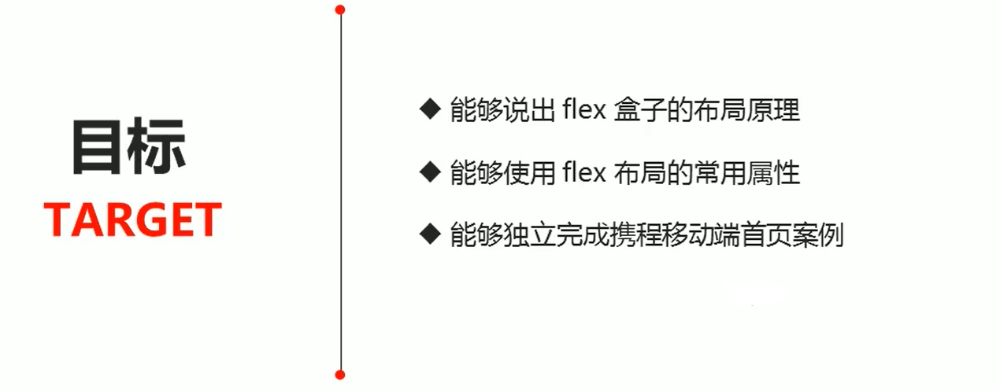
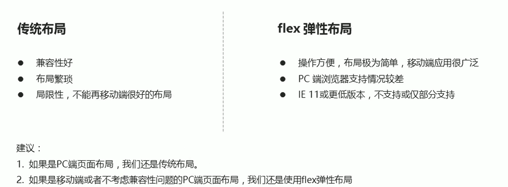
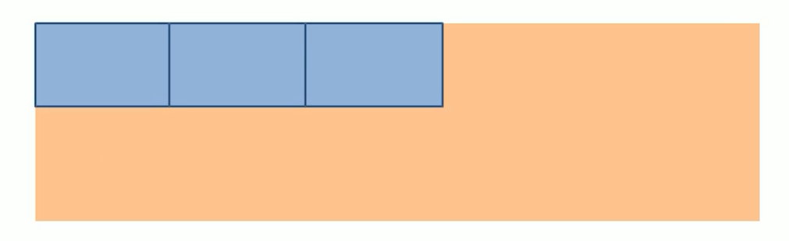
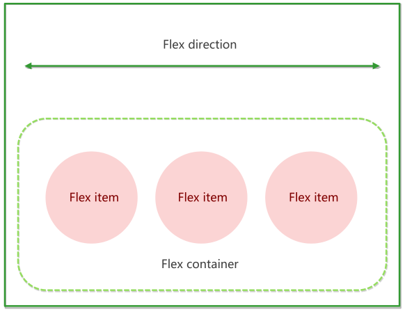
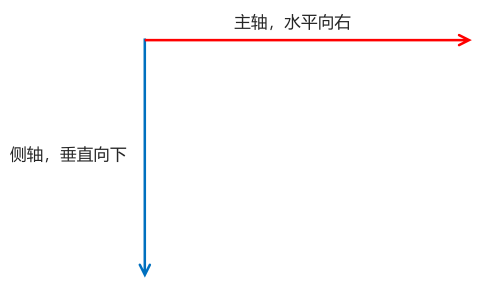
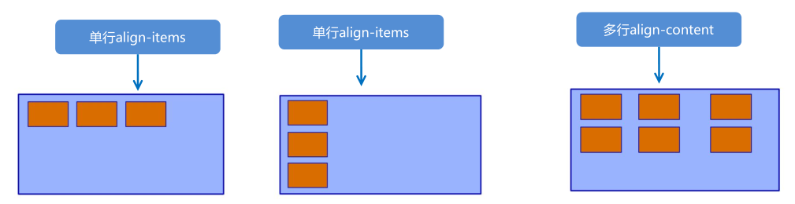

(现在是2020年10月10日，一直在学Vue，这个就一直没看了，其实也就26集，还拖了这么久。现在抓紧时间把它看完吧。)

(现在是2020年12月12日，基础知识早就看完了，赶紧把后面的实战项目-携程旅游看完吧，别磨磨蹭蹭的了。因为这个项目打算放到GitHub上，所以就另起一篇博文吧。)

(视频地址：[黑马Flex布局](https://www.bilibili.com/video/BV1N54y1i7dG?p=1))

# Flex布局概览

[Flex 布局教程：语法篇](http://www.ruanyifeng.com/blog/2015/07/flex-grammar.html)

## 目标

## 目录

# Flex布局体验

## 传统布局与Flex布局

## 初体验

### 搭建HTML结构

~~~html

  1
  2
  3

~~~

> 里面的3个span是行内结构

### CSS样式

* span直接给宽度和高度，背景颜色，还有蓝色边框
* 给div只需要添加`display：flex`即可

### 具体示例

~~~html
<!DOCTYPE html>
<html lang="en">

<head>
    <meta charset="UTF-8">
    <title>Document</title>
    
</head>

<body>
    

        1
        2
        3
    

</body>

</html>
~~~

# Flex布局原理

## 布局原理

Flex是`flexible Box`的缩写，意为"弹性布局"，用来为**盒状模型**提供最大的灵活性，任何一个**容器**都可以指定为Flex布局。

* 当我们为**父盒子**设为flex布局以后，**子元素**的`float、clear和vertical-align`属性将失效

  > Flex布局不需要浮动了，所以不用`float`和`clear`(清除浮动)，而且Flex盒子可以让div垂直居中，所以`vertical-align`也失效了

* 伸缩布局 = 弹性布局 = 伸缩盒布局 = 弹性盒布局 = Flex布局

采用Flex布局的**元素**，称为**Flex容器**（flex container），简称"**容器**"。它的**所有子元素**自动成为**容器成员**，称为Flex项目（flex item），简称"**项目**"。

> 爸爸叫**容器**，儿子叫**项目**。

* 初体验中**div就是Flex父容器**。
* 初体验中**span就是子容器Flex项目**。
* **子容器**可以横向排列也可以纵向排列

## 总结Flex布局原理

就是**通过给父盒子添加Flex属性**，来**控制子盒子的位置和排列方式**。

> 给父亲添加Flex属性，控制的是孩子。

# Flex布局父项常见属性

## 常见父项属性

以下由6个属性是对**父元素**设置的

* `flex-direction`：设置主轴的方向
* `justify-content`：设置主轴上的子元素排列方式
* `flex-wrap`：设置子元素是否换行
* `align-items`：设置侧轴上的子元素排列方式（单行）
* `align-content`：设置侧轴上的子元素的排列方式（多行）
* `flex-flow`：复合属性，相当于同时设置了`flex-direction`和`flex-wrap`

## flex-direction 设置主轴的方向

### 主轴与侧轴

在 flex 布局中，是**分为主轴和侧轴两个方向**，同样的叫法有 ： 行和列、x 轴和y 轴

* **默认**主轴方向就是 x 轴方向，水平向右
* **默认**侧轴方向就是 y 轴方向，水平向下

### 属性值

`flex-direction`属性决定**主轴的方向**（即项目的排列方向）。
注意： **主轴和侧轴是会变化的**，就看`flex-direction`设置谁为主轴，**剩下的就是侧轴**。而我们的**子元素是跟着主轴来排列的**。

> 儿子只听主轴的，主轴是亲妈，侧轴是后妈。

| 属性值         | 说明               |
| -------------- | ------------------ |
| row            | 从左到右（默认值） |
| row-reverse    | 从右到左           |
| column         | 从上到下（默认值） |
| column-reverse | 从下到上           |

### 具体示例

~~~html
<!DOCTYPE html>
<html lang="en">

<head>
    <meta charset="UTF-8">
    <title>Document</title>
    
</head>

<body>
    

        1
        2
        3
    

</body>

</html>
~~~

## justify-content 设置主轴上的子元素排列方式

> 它**只跟着主轴走**，跟侧轴没有任何关系。

justify-content 属性定义了**项目**(子元素)在主轴上的对齐方式。

**注意： 使用这个属性之前一定要确定好主轴是哪个**

| 属性值        | 说明                                         |
| ------------- | -------------------------------------------- |
| flex-start    | 从头部开始 如果主轴是x轴，则从左到右(默认值) |
| flex-end      | 从尾部开始排列                               |
| center        | 在主轴居中对齐（如果主轴是x轴则水平居中）    |
| space-around  | 平分剩余空间                                 |
| space-between | 先两边贴边 再平分剩余空间（重要）            |

### 主轴是x轴示例

~~~html
<!DOCTYPE html>
<html lang="en">

<head>
    <meta charset="UTF-8">
    <title>Document</title>
    
</head>

<body>
    

        1
        2
        3
        4
    

</body>

</html>
~~~

### 主轴是y轴示例

~~~javascript
<!DOCTYPE html>
<html lang="en">

<head>
    <meta charset="UTF-8">
    <title>Document</title>
    
</head>

<body>
    

        1
        2
        3
    

</body>

</html>
~~~

## flex-wrap 设置子元素是否换行

默认情况下，项目都排在一条线（又称”轴线”）上。`flex-wrap`属性定义，flex布局中**默认是不换行的**。(当一行放不下时Flex会**自动缩小**子元素的大小，让它们都能在一行显示。但是如果子元素多到了一定的程度以后，子元素会跑到父元素外边去，但是还是在一行显示。)

| 属性值 | 说明             |
| ------ | ---------------- |
| nowrap | 不换行（默认值） |
| wrap   | 换行             |

### 具体示例

~~~html
<!DOCTYPE html>
<html lang="en">

<head>
    <meta charset="UTF-8">
    <title>Document</title>
    
</head>

<body>
    

        1
        2
        3
        4
        5
        <!-- flex会让所有子元素在一行内显示，如果显示不开，会自动缩小子元素的大小 -->
    

</body>
</html>
~~~

## align-items 设置侧轴上的子元素排列方式（单行 ）

该属性是控制子项在侧轴（**默认是y轴**）上的排列方式 在子项为单项（单行）的时候使用。

| 属性值     | 说明                     |
| ---------- | ------------------------ |
| flex-start | 从上到下（默认值）       |
| flex-end   | 从下到上                 |
| center     | 挤在一起居中（垂直居中） |
| stretch    | 拉伸 （默认值 ）         |

### 具体示例

~~~html
<!DOCTYPE html>
<html lang="en">

<head>
    <meta charset="UTF-8">
    <title>Document</title>
    
</head>

<body>
    

        1
        2
        3
        4
        5
        6
    

</body>
</html>
~~~

## align-content 设置侧轴上的子元素的排列方式（多行）

设置子项在侧轴上的排列方式 并且只能用于子项出现 **换行**的情况（多行），在单行下是没有效果的。

| 属性值        | 说明                                   |
| ------------- | -------------------------------------- |
| flex-start    | 在侧轴的头部开始排列（默认值）         |
| flex-end      | 在侧轴的尾部开始排列                   |
| center        | 在侧轴中间显示                         |
| space-around  | 子项在侧轴平分剩余空间                 |
| space-between | 子项在侧轴先分布在两头，再平分剩余空间 |
| stretch       | 子项元素高度平分父元素高度             |

### align-items 和align-content区别

* align-items适用于单行情况下，只有上对齐、下对齐、居中和拉伸
* align-content适应于**换行**（多行）的情况下（单行情况下无效），可以设置上对齐、下对齐、居中、拉伸以及平均分配剩余空间等属性值。
* 总结就是单行找align-items多行找align-content

### 具体示例

~~~html
<!DOCTYPE html>
<html lang="en">

<head>
    <meta charset="UTF-8">
    <title>Document</title>
    
</head>

<body>
    

        1
        2
        3
        4
        5
        6
    

</body>
</html>
~~~

## flex-flow

flex-flow 属性是 flex-direction 和 flex-wrap 属性的**复合属性**

~~~javascript
flex-flow:row wrap;
~~~

### 具体示例

~~~html
<!DOCTYPE html>
<html lang="en">

<head>
    <meta charset="UTF-8">
    <title>Document</title>
    
</head>

<body>
    

        1
        2
        3
        4
        5
    

</body>
</html>
~~~

# Flex布局子项常见属性

* flex子项目占的份数
* `align-self`控制子项自己在侧轴的排列方式
* order属性定义子项的排列顺序（前后顺序）

## flex属性

flex 属性定义**子项目**分配**剩余空间**，用flex来表示**占多少份数**。

~~~javascript
.item { 
	 flex: <number>; 	 /* 默认是0，意味着不占份数 */
}
~~~

### 具体示例

~~~html
<!DOCTYPE html>
<html lang="en">

<head>
    <meta charset="UTF-8">
    <title>Document</title>
    
</head>

<body>
    <section>
        <!-- 希望3个盒子，左侧盒子固定在左边，右侧盒子固定在右边，中间盒子自适应 -->
        

        

        

    </section>

    

        <!-- p有宽度和高度，让里面的span各自占一份 -->
        1
        2
        3
    

</body>
</html>
~~~

## align-self 控制子项自己在侧轴上的排列方式

> align表示对齐，self表示我自己。脱离了组织。

align-self 属性允许单个项目有与其他项目不一样的对齐方式，可覆盖 align-items 属性。
默认值为 auto，表示继承父元素的 align-items 属性，如果没有父元素，则等同于 stretch。

~~~javascript
span:nth-child(2) {
		/*设置自己在侧轴上的排列方式*/
		align-self: flex-end;
}
~~~

## order 属性定义项目的排列顺序

数值越小，排列越靠前，默认为0。

注意：和 z-index 不一样。

~~~javascript
.item {
	  order: <number>;
}
~~~

### 具体示例

~~~html
<!DOCTYPE html>
<html lang="en">

<head>
    <meta charset="UTF-8">
    <title>Document</title>
    
</head>

<body>
    

        1
        2
        3
    

</body>
</html>
~~~

 

 