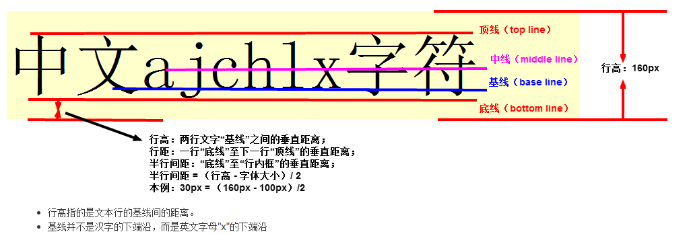

# 概念1：`line-height`

[CSS行高——line-height](https://www.cnblogs.com/dolphinX/p/3236686.html)

[css行高line-height的一些深入理解及应用](https://www.zhangxinxu.com/wordpress/2009/11/css%e8%a1%8c%e9%ab%98line-height%e7%9a%84%e4%b8%80%e4%ba%9b%e6%b7%b1%e5%85%a5%e7%90%86%e8%a7%a3%e5%8f%8a%e5%ba%94%e7%94%a8/)

[深入理解CSS中的行高](https://www.cnblogs.com/rainman/archive/2011/08/05/2128068.html)

## 基线、底线、顶线

##  行距、行高

## 内容区

## 行内框

## 行框

## 元素对行高的影响

