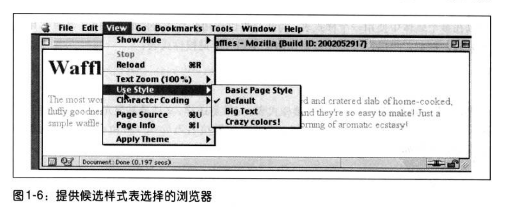

（注1：本书第四版已经出来了，还分成了上下两册，找了一下好像没找到中文版的，就暂时先看第三版了）

（注2：根据看过的视频的一些讲义补充了一些知识，讲义是传智播客刘晓强老师的(后面就是全部抄他的讲义了，就算复习了)。还从网上找了一些资料）

（注3：看了几章怎么感觉这本书不怎么通俗啊，感觉有些生硬，再继续看几章吧）

（注4：很多章节里面的内容对于我来说有点难以理解或者目前我应该不太会用到，我就不会将其添加到我的笔记中，我记录的内容都是自己已经掌握的和重要的的基础知识点）

  (注5：后面的就很难看懂了，看不懂的就没有记笔记了，所以严格来说本博文不能算是《CSS权威指南读书笔记了》)

(注6：现在是2020年2月22日，试着重新从头到尾再看一遍，看能不能看懂，也许之前是因为太浮躁了)

(注7：现在是2020年3月24日，好久没看这个了，今天跳着看一下浮动有关章节)

(注8：这本书先放一放了。)

# 第1章：CSS和文档

层叠样式表（Cascading Style Sheets，CSS）的功能非常强大，可以影响一个或一组文档的表现。显然，如果不存在某种文档，CSS基本上毫无用处，因为这样一来它将没有要表现的内容。当然，“文档”的定义相当宽泛。例如，Mozilla和相关的浏览器就使用CSs来影响浏览器Chrome本身的表现。不过，如果没有Chrome的内容——按钮、地址栏输入、对话框、窗口等等一一也就没有使用CSS（或其他任何表现信息）的必要。

## Web的衰落

也许你还能大致记得，在Web早期（1990~1993），HTML是一个很有限的语言。它几乎完全由用于描述段落、超链接、列表和标题的结构化元素组成。我们可能认为表、框架或复杂标记等等内容是创建Web页面必不可少的，可是那时在HTML中连与之稍有些相似的东西都没有。HTML原本是要作为一种结构化标记语言，用于描述文档的各个部分；而对于这些部分应当如何显示则很少谈及。这种语言并不关心外观，它只是一种简洁的小型标记机制。

接下来Mosaic出现了。

仿佛突然之间，在网上流连时间超过10分钟的人几乎都认识到了万维网的强大。从一个文档跳到另一个文档很容易，无非是把光标指向有特殊颜色的部分文本，甚至指向一个图像，再点击鼠标。更妙的是，文本和图像可以同时显示，只需要一个纯文本编辑器就能创建页面。这是免费而且开放的，确实很酷。

网站开始到处涌现。期刊网站、大学网站、公司网站等等应运而生。随着网站数目的增加，人们越来越需要新的HTML元素，希望这些元素各自完成一个特定的功能。创作人员开始要求能够将文本变为粗体或斜体。

而此时HTML却不足以处理这样一些需求。利用HTML可以声明强调部分文本，但不一定是将其置为斜体，这取决于用户的浏览器和首选项，可能只是改为粗体，或者仍然是正常文本，只不过有不同的颜色而已。这就无法保证读者看到的正是创作人员所创建的文档。

迫于这些压力，开始出现诸如< FONT>和< BIG>之类的标记元素。突然之间，原来描述结构的语言开始描述外在表现了。

### 一片混乱

几年之后，这种随便的做法所存在的问题开始暴露出来。例如，HTML3.2和HTML4.0的很大一部分都是关于表现问题。此时能够通过font元素对文本设置颜色和大小，对文档和表格应用背景色和图像，使用table属性（如ce11spacing），并且还能让文本闪烁，这些都是原先要求“有更多控制”的后果。

下面举例说明这种混乱的具体情况，简单地看一下几乎所有公司网站都用到的标记。这些网站中往往标记相当多，而真正有用的信息并不多，二者的差距大得惊人。更糟糕的是，在大多数网站中，标记几乎完全由表和font元素组成，它们对于所要表现的内容不能传达任何实际含义。**从结构化的角度看，这些网页比随机的字母串强不了多少。**

例如，来看页面标题，如果创作人员使用了font元素而不是h1之类的标题元素：

~~~css
<font size="+3" face="Helvetica" color="red">Page Title</font>
~~~

从结构上来讲，font标记没有任何含义。这会使文档的可用性降低。例如，对于一个语音合成浏览器，font标记有什么意义呢？不过，如果创作人员使用标题元素而不是font元素，语音浏览器就可以使用某种语音样式来读相关文本。倘若使用font标记，这种语音浏览器就无法知道这个文本与其他文本有什么区别。

为什么创作人员这么不看重结构和含义呢？因为他们希望读者看到的页面正如他们设计的那样。使用结构化HTML标记意味着要放弃对页面外观的很多控制，而结构化HTML标记显然不支持多年来已经深入人心的那些流行的页面设计。不过还需要考虑上述方法存在的如下一些问题：

* 非结构化页面使得建立内容索引极为困难。真正强大的搜索引擎允许用户只搜索页面标题，或者搜索页面内的小节标题，或者只搜索段落文本，也可能只搜索那些标记为重要的段落。不过，要完成这样一个任务，页面内容必须包含在某种结构化标记中，而这正是大多数页面所缺少的。例如，Google在索引页面时就会注意标记结构，所以如果你的页面是一个结构化页面，被Google搜中的机会就会增加。

* 缺乏结构性会降低可访问性。假设你是一个盲人，要依赖一个语音合成浏览器上网搜索。下面的两种页面你会选择哪一个呢？是一个结构化页面，使得你的浏览器可以只读出小节标题，让你选择想听哪一小节；还是一个无结构性的页面，浏览器必须读出所有内容，因为没有提示来指出哪些是标题、哪些是段落、哪些是重要的内容。再来看Google，实际上这个搜索引擎就是世界上最活跃的盲人用户，有数百万的朋友在接受它的建议，了解在哪里网上冲浪和购物。

* 高级页面表现只能应用于某种文档结构。假设有这样一个页面，其中只显示了小节标题，各标题旁分别有一个箭头。用户可以决定哪些小节标题对他来说需要深入了解，点击相应的箭头就能显示出这一节的文本。

* 结构化标记更易于维护。你可能曾经花很长时间在别人（甚至你自己）的HTML中查找一个小错误，由于这个错误，让你的页面在某个浏览器中显示得一片混乱，这种情况是不是屡屡出现？你是不是曾经花很长时间来编写嵌套表和font元素，而这只是为了得到一个包含白色超链接的边栏？为了正确地分隔一个标题和它后面的文本，你插入过多少换行元素？通过使用结构化标记，就能清理你的代码，更容易地找到所要寻找的东西。

必须承认，完全结构化的文档有些太古板、太平常了。“一白遮百丑”，就因为这么一个原因，尽管有几百个理由要求使用结构化标记，但仍然不能阻挡HTML的使用，直到20世纪末它还如此流行，甚至到今天它还依然盛行。我们需要一种合适的方法，将结构化标记与丰富多彩的页面表现结合起来。

## CSS作救星

当然，HTML中充斥着的表现标记的问题并没有被W3C（World Wide Web Consortiam，万维网联盟）忽视，他们开始寻找一种速效的解决方法。1995年，W3C开始发布一种正在进行的计划（work-in-progress）,称为CSS。到了1996年，这已经成为一个成熟的推荐草案（Recommendation），其地位与HTML同样举足轻重。下面来说明这是为什么。

### 丰富的样式

首先，与HTML相比，CSS支持更丰富的文档外观，其表现程度也远非HTML力所能及。CSS可以为任何元素的文本和背景设置颜色；允许在任何元素外围创建边框，同时能增大或减少元素外的空间；允许改变文本的大小写、装饰方式（如下划线）、间隔，甚至可以确定是否显示文本；还允许完成许多其他的效果。

以页面上的第一个标题（即主标题）为例，这通常就是页面本身的标题。以下是一个正确的标记：

> <hl>Leaping Above The Water</h1>

现在，假设你希望这个标题是暗红色，使用某种字体，采用斜体，而且有下划线，还有一个黄色的背景。如果用HTML来达到上述目的，就必须把h1放在表中，而且还要有数十个其他的元素，如font和U。如果使用CSS，所需的则只是简单的一条规则：

~~~css
h1{color:maroon;font:italic 2em Times,serif;text-decoration:underline; background:yellow;}
~~~

完整版：

~~~css
<!DOCTYPE html>
<html lang="en">
<head>
	<meta charset="UTF-8">
	<title>Document</title>
	<style>
		h1{
			color:maroon;
			font:italic 2em Times,serif;
            /*字体是标准字体大小的2倍，即32px，字体为serif*/
			text-decoration:underline;
            /*有下划线*/
		    background:yellow;
			}
	</style>
</head>
<body>
	<h1>你好，世界</h1>
</body>
</html>
~~~

效果：


text-decoration属性：


如此而已。可以看到，用HTML能够做到的，用CSS也能做到。不过，还不仅限于此：

~~~css
hl { color: maroon; font: italic 2em Times, serif; text-decoration: underline; background: yellow url(titlebg. png) repeat-x; border:1px solid red; margin-bottom:0; padding:5px;}
~~~

现在h1的背景上有一个只能水平重复的图像，而且它有一个边框，与文本之间至少间隔5个像素。还去除了元素底端的外边距（空白）。这些工作是HTML做不到的，甚至连类似的事情都办不到，而这还只是CSS的冰山一角。

### 易于使用

如果以上所述还不能说服你，下面的理由可能会让你改变想法：样式表能大大减少Web创作人员的工作量。

首先，样式表将实现某些视觉效果的命令集中在一个方便的位置，而不是在文档中分散得到处都是。举例来说，假设你希望一个文档中的所有h2标题都是紫色。若使用HTML，则要在每个标题中增加一个font标记，如下所示：

~~~css
<h2><font color="purple">This is purple!</font></h2>
~~~

所有二级标题都要增加这个标记。如果文档中有40个这样的标题，就必须总共插入40个font元素，每个标题插入一个font！为了达到这样小的一个效果，就要做这么多的工作。

假设你早有打算，已经插入了所有这些font元素。大功告成，你很满意一—不过，可能接下来你认为这些h2标题实际上应该是暗绿色而不是紫色（或者你的老板决定让你这么做）。这样一来，就必须再回过头来逐个地调整这些font元素。当然，只要你的文档中只是标题有紫色文本，就可以利用“查找一替换”来完成调整。但是如果文档中还有其他元素也有紫色font，就不能使用“查找一替换”，因为这将影响那些元素（将把那些元素也改成暗绿色）。

更好的办法是使用一条规则：

~~~css
h2(color:purple;}
~~~

这样做不仅输入起来更快，修改起来也更容易。如果确实要从紫色改为暗绿色，所要做的只是修改这一条规则。
再来看上一节谈到的有丰富样式的h1元素：

~~~css
hl {color:maroon;font:italic 2em Times,serif;text-decoration:underline; background:yellow;}
~~~

这看上去比写HTML还要糟糕，不过请考虑这样的情况：一个页面上有12个看上去和h1一样的h2元素。这12个h2元素需要多少标记呢？如果使用HTML，就需要非常多的标记。另一方面，如果用CSS，所要做的只是：

~~~css
hl,h2{color:maroon;font:italic 2em Times,serif;text-decoration:underline; background:yellow;}
~~~

现在这些样式会同时应用到h1和h2元素，这里只多敲了3次键而已。

如果你想改变h1和h2元素的外观，CSS的优势则更为突出。考虑一下，与对前面的样式作如下修改相比，需要花多少时间才能修改h1和12个h2元素的HTML标记：

~~~css
h1,h2{color:navy;font:bold 2em Helvetica,sans-serif; text-decoration:underline overline;background:silver;)
~~~

如果用秒表来记录上述两种方法所花的时间，我打赌使用CSS的创作人员肯定会让使用HTML的人输得哑口无言。

此外，大多数CSS规则都集中在文档中的某一个位置。也可以将其分组为相关的样式或单个元素分散到文档中，但是把所有样式都放在一个样式表中的做法往往高效得多。这样，在一个位置上就能创建（或修改）整个文档的外观。

### 在多个页面上使用样式

不过请等等，还不只如此！不仅能把一个页面的所有样式信息集中到一个位置，还可以创建一个样式表，然后把这个样式表应用到多个页面。这是通过以下过程实现的：将样式表单独保存为一个文档，然后由要使用该文档的页面导入。通过使用这个功能，可以很快地为整个网站创建一致的外观。为此只需将这个样式表链接到网站上的所有文档。在此之后，如果你想改变网站页面的外观，只编辑一个文件就够了，所做的修改便会自动地传播到整个服务器！

考虑这样一个网站，它的所有标题都是灰色，背景为白色。这种颜色设置是由一个样式表得到的，其中指出：

~~~css
h1,h2,h3,h4,h5,h6 {color:gray; background:white;)
~~~

现在假设这个网站有700个页面，每个页面都使用了这个要求标题为灰色的样式表。在某个时刻，网站管理员决定标题应当是白色，而背景才是灰色。所以将样式表编辑如下：

~~~css
h1,h2,h3,h4,h5,h6 {color:white; background:gray;}
~~~

然后将样式表保存到磁盘，修改就完成了。如果使用HTML，则要编辑700个页面，每个标题都要包含在一个表中，还要有一个font标记，这与使用CSS的方法绝对无法相比，不是吗？

### 层叠

还有呢！CSS还规定了冲突规则；这些规则统称为层叠（cascade）。例如，还是考虑前面的情况，将一个样式表导入到多个Web页面。现在增加一组页面，其中有些样式是相同的，不过还包含一些专用于这些页面的特定规则。可以另外创建一个样式表，将这个样式表与先前的样式表一起导入到这些页面中，或者可以在需要特殊样式的页面中直接放入那些样式。

例如，在700个原有页面之外的某个页面上，可能希望标题是黄色，背景是深蓝色，而不是灰色背景上的白色标题。在该文档中，可以插入以下规则：

~~~css
h1,h2,h3,h4,h5,h6 {color:yellow;background:blue;)
~~~

由于层叠，这个规则会覆盖先前导入的灰底白字标题规则。如果理解了层叠规则，并充分利用了这些规则，就能创建相当复杂的样式表，这样不仅很容易地修改，还会使你的页面看上去很专业。

层叠并不仅限于创作人员使用。在网上冲浪的人（或读者）还可以利用某些浏览器创建自己的样式表（这称为读者样式表，原因显而易见），这些样式表可以与创作人员创建的样式表以及浏览器使用的样式层叠。因此，如果读者是一个色盲，就可以创建这样一个样式，使超链接突出显示：

~~~css
a:link,a:visited {color:white;background:black;)
~~~

读者样式表可以包含几乎所有内容：可以是一个指令，如果用户视力不好，这个指令可以让文字足够大以便用户阅读；也可以是一些规则，能够删除图像以便更快地阅读和浏览；甚至可以是一些样式，将用户最喜欢的图片放在每个文档的背景上（当然，不推荐这种做法，不过这种做法确实是可能的）。这样就能让读者自己定制网上体验，而且不必去掉创作人员的所有样式。

由于提供了导入、层叠和丰富的效果，CSS对所有创作人员或读者来说都是一个绝佳的工具。

### 缩减文件大小

除了视觉上的功能以及对创作人员和读者都很有用之外，CSS还有一些很让读者喜欢的特性。它有助于尽可能地缩减文档大小，以便加快下载。这是怎么做到的呢？前面已经提到，很多页面都使用了表和font元素来得到漂亮的视觉效果。遗憾的是，这些方法都会创建额外的HTML标记，以至于增加文件大小。通过将视觉样式信息分组放到集中的区域中，并使用一种相当简洁的语法表示这些规则，就可以去除font元素和其他一些常用的标记。因此，CSS一方面可以大大减少下载时间，另一方面又能大大提升读者的满意度。

### 为将来做准备

前面提到过，HTML是一种结构化语言，而CSS是它的补充：这是一种样式语言。认识到这一点，W3C（也就是讨论并批准Web标准的组织）开始从HTML去除样式元素。之所以这么做，是因为可以用样式表提供某些HTML元素目前提供的效果，既然如此，还有谁需要使用这些HTML元素呢？

因此，XHTML规范中有很多已经不鼓励使用的元素，也就是说，这些元素正逐步从语言中消失。最终，这些元素会被标志为废弃，这说明不要求也不鼓励浏览器支持这些元素。不鼓励使用的元素包括< font>、< basefont>、< u>、< strike>、< s>和< center>。
样式表的出现使得已经不再需要这些元素。随着时间的推移，还会有更多元素步入这个不鼓励使用的行列。

不仅如此，HTML还有可能逐步被可扩展标记语言（Extensible Markup Language，XML）所取代。XML是一种比HTML更复杂的语言，不过它也更强大、更灵活。尽管如此，XML没有任何提供声明样式元素（如< i>或< center>）的方法。相反，XML文档很可能要依赖于样式表来确定其外观。尽管XML使用的样式表可以不是CSS，不过它很可能遵循CSS而且与之非常相似。因此，现在学习CSS对创作人员是很有好处的，等到HTML被XML取代时这种好处就会更显著。

所以，重要的是首先要理解CSS和文档结构之间有何关联。使用CSS可能对文档表现有深远的影响，但是到底能做些什么，对此还是有一些限制。先来学习一些基本术语。

## 元素

元素（element）是文档结构的基础。在HTML中，最常用的元素很容易识别，如p、table、span、a和div。文档中的每个元素都对文档的表现起一定作用。在CSS中，至少在CSS2.1中，这意味着每个元素生成一个框（box，也称为盒），其中包含元素的内容。

### 替换元素和非替换元素

尽管CSS依赖于元素，但并非所有元素都以同样的方式创建。例如，图像和段落就不是同类元素，span和div也不相同。在CSS中，元素通常有两种形式：**替换和非替换**。
这两种类型将在第7章详细讨论，其中将介绍框模型（也称盒模型）的具体内容，但是这里还是先做一个简要介绍。

### 替换元素

替换元素（replaced element）是指用来替换元素内容的部分并非由文档内容直接表示。
在XHTML中，我们最熟悉的替换元素例子就是img元素，它由文档本身之外的一个图像文件来替换。实际上，img没有具体的内容，通过以下的简单例子可以了解这一点：

~~~css

~~~

这个标记片段不包含任何具体内容，只有一个元素名和一个属性。除非将其指向一个外部内容（在这里，就是由src属性指定的一个图像），否则这个元素没有任何意义。
input元素与之类似，取决于input元素的类型，要由一个单选钮、复选框或文本输入框替换。替换元素显示时也生成框。

### 非替换元素

大多数HTML和XHTML元素都是非替换元素（nonreplaced element）。这意味着，其内容由用户代理（通常是一个浏览器）在元素本身生成的框中显示。例如，< span>hi there< /span>就是一个非替换元素，文本“hi there”将由用户代理显示。**段落、标题、表单元格、列表和XHTML中的几乎所有元素都是非替换元素。**

### 元素显示角色

除了替换和非替换元素，CSS2.1还使用另外两种基本元素类型：块级（block-level）元素和行内（inline-level）元素。如果创作人员以前用过HTML或XHTML标记，并了解它们在Web浏览器中的显示，就不会对这些类型感到陌生；这些元素如图1-1所示。


### 块级元素

块级元素生成一个元素框，（默认地）它会填充其父元素的内容区，旁边不能有其他元素。换句话说，它在元素框之前和之后生成了“分隔符”。我们最熟悉的HTML块元素是p和div。替换元素可以是块级元素，不过通常都不是。

列表项是块级元素的一个特例。除了表现方式与其他块元素一致，列表项还会生成一个标记符——无序列表中这通常是一个圆点，有序列表中则是一个数字——这个标记符会“关联”到元素框。除了这个标记符外，列表项在所有其他方面都与其他块元素相同。

### 行内元素

行内元素在一个文本行内生成元素框，而不会打断这行文本（译注1）。行内元素最好的例子就是XHTML中的a元素。strong和em也属于行内元素。这些元素不会在它本身之前或之后生成“分隔符”，所以可以出现在另一个元素的内容中，而不会破坏其显示。

注意，尽管“块”和“行内”这两个词与XHTML中的块级和行内元素有很多共同点，但也存在一个重要的差别。在HTML和XHTML中，块级元素不能继承自行内元素（即不能嵌套在行内元素中）。但是在CSS中，对于显示角色如何嵌套不存在任何限制。

要了解这是如何工作的，下面来考虑一个CSS属性：display。

你可能已经注意到，display有很多值，其中只有3个值在前面提到过：block、inline和1ist-item。我们并不打算现在就讨论其他的值，因为它们将在第2章和第7章中更详细地介绍。

目前，我们只关心block和inline。考虑以下标记：

~~~css
<body>
	<p>This is a paragraph with <em>an inline element</em> within it.</p>
</body>
~~~

> 译注1：从概念上讲，这里inline的准确含义就是“行内”，而不是一般认为的“内联”。


这里有两个块元素（body和p）和一个行内元素（em）。按照XHTML规范，em可以继承p，但是反过来不行。一般地，XHTML层次结构要求：行内元素可以继承块元素，而反之不允许。

与此不同，CSS没有这种限制。仍然是上述标记，不过可以改变两个元素的显示角色，如下：

~~~css
p{display:inline;}
em {display:block;}
~~~

这会使得元素在一个行内框中生成一个块框。这是完全合法的，不违反任何规范。唯一的问题是，如果试图如下反转元素的嵌套关系：

~~~css
<em><p>This is a paragraph improperly enclosed by an inline element.</p></em>
~~~

对于XHTML文档来说，尽管改变元素的显示角色可能很有用，不过对XML文档的意义则更为重大。XML文档不太可能有固有显示角色，所以要由创作人员来定义。例如，你可能想知道如何摆放以下XML片段：

~~~xml
<book>
<maintitle>Cascading style Sheets: The Definitive Guide</maintitle>
<subtitle>Second Edition</subtitle>
<author>Eric A. Meyer</author>
<publisher>o' Reilly and Associates</publisher>
<pubdate>2004</pubdate>
<isbn>blahblahblah</isbn>
</book>

<book>
<maintitle>CSS2 Pocket Reference</maintitle>
<author>Eric A. Meyer</author>
<publisher>O' Reilly and Associates</publisher>
<pubdate>2004</pubdate>
<isbn>blahblahblah</isbn>
</book>
~~~

由于display的默认值是inline，默认地其内容会显示为行内文本，如图1-2所示。
这种显示用处不大。


可以用display来定义基本布局：

~~~css
book,maintitle,subtitle,author,isbn {display:block;)
publisher,pubdate {display:inline;}
~~~

现在将7个元素中的5个设置为块元素，另外两个设置为行内元素。这意味着，每个块元素都会像XHTML中的div元素一样处理，而两个行内元素的处理方式将类似于span。

由于CSS具有这种影响显示角色的基本功能，使得CSS在很多情况下都非常有用。可以将以上规则作为起点，再增加另外一些样式，得到图1-3所示的结果。


在本书余下部分中，我们将讨论各种属性和值来支持诸如此类的表现。不过，首先需要了解如何将CSS与文档关联。毕竟，如果不将二者结合，CSS就没有办法影响文档。我们将通过一个XHTML设置进行讨论，因为这是我们最熟悉的情况。


display示例：


## 结合CSS和HTML

我已经提到过，HTML和XHTML文档有一个固有结构，这里需要重申这一点。事实上，正是这一点导致了以前网页所存在的部分问题：我们之中太多的人已经忘记文档要有一个内部结构，而且这与其视觉结构完全是两码事。我们可能急于创建最酷的页面，可能会以各种方式摆放页面的内容，而通常忽略了一点：页面应当包含有某种结构含义的信息。

这种结构正是XHTML和CSS之间关系中的一个固有部分；如果没有这种结构，就根本不会有任何关系。为了更好地理解这一点，下面来看一个XHTML文档的例子，后面将逐一介绍这个文档中的各个部分：

~~~css
<html><head>
<title>Eric's World of Waffles</title>
<link rel="stylesheet"type="text/css"href="sheet1. css"media="all"/>
<style type="text/css">@ import url(sheet2. css); h1{ color: maroon;}
body { background: yellow;}
/* These are my styles! Yay!*/
</style>
</head>
<body>
<hl>waffles!</h1>
<p style="color: gray;">The most wonderful of all breakfast foods is the waffle--a ridged and cratered slab of home-cooked, fluffy goodness that makes every child's heart soar with joy. And they' re so easy to make!
Just a simple waffle-maker and some batter, and you' re ready for a morning of aromatic ecstasy!
</p>
</body></html>
~~~

这个标记如图1-4所示。


下面来分析可以将这个文档与CSS关联的多种方式。

### link标记

首先考虑link标记的使用：

~~~css
<link rel="stylesheet"type="text/css"href="sheet1.css"media="all"/>
~~~

1ink标记是一个很少用但完全合法的标记，它在HTML规范中已经存在多年，一直等待着“施展才华”。其基本目的是允许HTML创作人员将包含1ink标记的文档与其他文档相关联。CSS使用这个标记来链接样式表和文档；在图1-5中，一个名为sheet1.css的样式表链接到这个文档。


这些样式表并不是HTML文档的一部分，但是仍会由HTML文档使用，这称为外部样式表（external style sheet），因为它们是HTML文档外部的样式表（如图1-5所示）。

为了成功地加载一个外部样式表，1ink必须放在head元素中，但不能放在其他元素内部（如tit1e）。这样一来，Web浏览器就能找到并加载样式表，然后使用其中包含的样式来显示HTML文档，如图1-5中所示。

外部样式表有什么格式呢？这只是一个规则列表，就像上一节和示例XHTML文档中见到的一样，不过在这种情况下，规则会保存到其自己的文件中。只是要记住，样式表中不能包含XHTML或任何其他标记语言，只能有样式规则。以下是一个外部样式表的内容：

~~~css
h1{color:red;}
h2{color:maroon;background:white;}
h3{color:white;background:black;
font:medium Helvetica;}
~~~

仅此而已一—完全没有HTML标记或注释，只有简单的无格式样式声明。这些会保存到一个纯文本文件中，通常有.css扩展名，如sheetl.css。

> 警告：外部样式表不能包含任何文档标记，只能有CSS规则和CSS注释，本章后面将解释CSS规则和CSS注释。如果一个外部样式表中出现了标记，会导致其中一部分或全部被忽略。

不一定非得有这个文件扩展名，但是一些较老的浏览器无法识别包含样式表的文件，即使在1ink元素中确实包含了正确的text/css类型也无济于事，除非它有.css扩展名。
实际上，除非文件名以.css结尾，有些Web服务器甚至不会将文件作为text/css传递，不过这个问题通常可以通过改变服务器的配置文件来修正。

### 属性

对于1ink标记的余下部分，其属性和值都很直接明了。re1代表“关系”（relation），在这里，关系为stylesheet。type总是设置为text/css。这个值描述了使用1ink标记加载的数据的类型。这样一来，Web浏览器就知道了样式表是CSS样式表，这将确定浏览器如何处理其导入的数据。毕竟，将来可能会使用其他的样式语言，所以声明使用何种语言很重要。

接下来可以看到href属性。这个属性的值是样式表的URL。可以是绝对URL，也可以是相对URL，具体取决于要做的工作。当然，在我们的例子中，该URL是相对URL。
它可以很简单，如http://www.meyerweb.com/sheet1.css。

最后还有一个media属性。这里使用的值是a11，说明这个样式表要应用于所有表现媒体。CSS2为这个属性定义了很多可取值。


以上大部分媒体类型在当前的Web浏览器中并不支持。其中3个得到最广泛支持的类型是a11、screen和print。写这本书时，Opera还支持projection，允许文档作为幻灯片显示。

可以在多个媒体中使用一个样式表，为此要提供应用此样式表的媒体列表，各媒体用逗号分隔。例如，可以在屏幕和投影媒体中使用一个链接样式表：

~~~css
<link rel="stylesheet"type="text/css"href="visual-sheet. css"
media="screen, projection"/>
~~~

注意，一个文档可能关联有多个链接样式表。如果是这样，文档最初显示时只会使用re1为stylesheet的1ink标记。因此，如果希望链接名为basic.css和splash.css的两个样式表，可以如下设置：

~~~css
<link rel="stylesheet"type="text/css"href="basic.css"/>
<link rel="stylesheet"type="text/css"href="splash.css"/>
~~~

这将会让浏览器加载这两个样式表，合并它们的规则，并将其全部应用于文档（第3章中将清楚地看到这些样式表如何合并，不过现在只要了解它们会合并就足够了）。例如：

~~~css
<link rel="stylesheet"type="text/css"href="basic. css"/>
<link rel="stylesheet"type="text/css"href="splash. css"/>

<p class="al">This paragraph will be gray only if styles from the stylesheet ' basic. css' are applied.</p>
<p class="b1">This paragraph will be gray only if styles from the stylesheet ' splash. css' are applied.</p>
~~~

上述示例标记中没有tit1e属性，不过title确实是link的一个属性。这个属性不经常使用，但将来可能会很重要，而且如果使用不当，可能会有意想不到的后果。为什么呢？
这个问题将在下一节讨论。

### 候选样式表

还可以定义候选样式表（alternate style sheet）。将re1属性的值置为alternate stylesheet，就可以定义候选样式表，只有在用户选择这个样式表时才会用于文档表现。

如果浏览器能使用候选样式表，它会使用1ink元素的tit1e属性值生成一个候选样式列表。可以设置以下元素：

~~~css
<link rel="stylesheet"type="text/css"
href="sheet1. css"title="Default"/>

<link rel="alternate stylesheet"type="text/css"
href="bigtext. css"title="Big Text"/>

<link rel="alternate stylesheet"type="text/css"
href="zany. css"title="Crazy colors!"/>
~~~

然后用户就能选择他们想用的样式，浏览器会从第一个样式（在这里，也就是标记为
“Default”的样式）切换为用户选择的任何样式。图1-6显示了完成这种选择的一种办法。



> 注意：候选样式表在大多数基于Gecko的浏览器中都得到了支持，如Mozilla、Netscape6+以及Opera7。通过使用JavaScript，Internet Explorer也能支持候选样式表，不过Internet Explorer本身对此并不提供支持。

还可以为候选样式表指定同样的tit1e值，把它们分组在一起。这样一来，用户就可以在屏幕和打印媒体中为网站选择不同的表现。例如：

~~~css
<link rel="stylesheet"type="text/css"
href="sheet1.css"title="Default"media="screen"/>

<link rel="stylesheet"type="text/css"
href="print-sheet1.css"title="Default"media="print"/>

<link rel="alternate stylesheet"type="text/css"
href="bigtext.css"title="Big Text"media="screen"/>

<link rel="alternate stylesheet"type="text/css"
href="print-bigtext.css"title="Big Text"media="print"/>
~~~

如果用户在一个兼容用户代理中使用候选样式表选择机制选择了“Big Text”，就会在屏幕媒体中使用bigtext.css创建文档的样式，而在打印媒体中使用print-bigtext.css。在任何媒体中都不会使用sheetl.css或print-sheetl.css。

为什么呢？原因在于，如果为一个re1为stylesheet的1ink指定了标题（title），也就指定了该样式表要作为首选样式表（preferred style sheet）。这意味着，这个样式表要优先于候选样式表使用，而且第一次显示文档时会使用这个首选样式表。不过，一旦选择了候选样式表，就不会再使用首选样式表了。

此外，如果将一组样式表指定为首选样式表，那么只会使用其中的某一个，除此以外，其他的都会被忽略。请考虑以下元素：

~~~css
<link rel="stylesheet"type="text/css"
href="sheetl.css"title="Default layout"/>

<link rel="stylesheet"type="text/css"
href="sheet2.css"title="Default text sizes"/>

<link rel="stylesheet"type="text/css"
href="sheet3.css"title="Default colors"/>
~~~

所有这三个1ink元素现在都指示首选样式表，因为所有这3个元素中都出现了一个tit1e属性，但是只有其中的一个会真正作为首选样式表。另外两个会被完全忽略。会是哪两个呢？这是无法确定的，因为HTML和XHTML都没有提供任何方法来确定哪些首选样式表会被忽略，或者应当使用哪个样式表。

如果没有为样式表指定title，那么它将作为一个永久样式表（persistent style sheet），始终用于文档的显示。通常，这正是创作人员所希望的。

### style元素

可以用sty1e元素包含样式表，它在文档中单独出现：

~~~css
<style type="text/css">
~~~

style一定要使用type属性；对于CSS文档，正确的type属性值是“text/css"，这与1ink元素类似。

sty1e元素始终要以<style type="text/css“>开头，如上例所示。其后可以有一个或多个样式，最后以一个结束< /sty1e>标记结尾。还可以为sty1e元素指定一个media属性，其可取值与先前讨论链接样式表时介绍的media属性值相同。

开始和结束sty1e标记之间的样式称为文档样式表（document style sheet），或嵌套样式表（embedded style sheet），因为这个样式表嵌套在文档中。其中可能包含应用到文档的多个样式，还可以使用eimport指令包含多个外部样式表链接。

### @import指令

下面我们来讨论sty1e标记中的内容。首先来看与1ink非常类似的eimport指令：

~~~css
@ import url(sheet2. css);
~~~

与1ink类似，@import用于指示Web浏览器加载一个外部样式表，并在表现HTML文档时使用其样式。唯一的区别在于命令的具体语法和位置。可以看到，eimport出现在sty1e容器中。它必须放在这里，也就是要放在其他CSS规则之前，否则将根本不起作用。考虑下面的例子：

~~~css
<style type="text/css">eimport url(styles. css);/*@ import comes first*/
h1{ color: gray;}
</style>
~~~

类似于1ink，一个文档中可以有不只一个@import语句。但不同于link，每个@import指令的样式表都会加载并使用；用@import无法指定候选样式表。因此，给定以下标记：

~~~css
@ import url(sheet2. css);
@ import url(blueworld. css); 
@ import url(zany. css);
~~~

这3个外部样式表都会加载，而且其中的所有样式规则都会在文档的显示中使用。

> 警告：许多较老的浏览器无法处理不同形式的@import指令。可以适当利用这一点，对这些浏览器“隐藏”样式。

与1ink一样，可以限制所导入的样式表应用于一种或多种媒体，可以在样式表的URL之后列出要应用此样式的媒体：

~~~css
@ import url(sheet2. css) all;
@ import url(blueworld. css) screen; 
@ import url(zany. css) projection, print;
~~~

如果有一个外部样式表，它需要使用其他外部样式表中的样式，此时eimport就非常有用。由于外部样式表不能包含任何文档标记，所以不能使用1ink元素，但能用
@import。因此，可以有一个包含以下内容的外部样式表：

~~~css
@ import ur1(http://example. org/1ibrary/layout. css);
@ import url(basic-text. css);
@ import url(printer. css) print; 
body { color: red;}
h1{ color: blue;}
~~~

不错，尽管具体的样式可能并非如此，不过从中你应该能了解到我的意思。注意，前例中不仅使用了绝对URL，还使用了相对URL。这两种URL形式都可用，这一点与link元素一样。

还要注意，@import 指令出现在样式表的开头，如示例文档所示。CSs要求@import指令出现在样式表中的其他规则之前。如果一个@import出现在其他规则（如body
{color:red；}）之后，兼容用户代理会将其忽略。

> 警告：Windows平台的Internet Explorer不会忽略任何eimport指令，甚至出现在其他规则之后的eimport也不会忽略。由于其他浏览器确实会忽略放置不当的eimport指令，所以很容易错误地将eimport指令放在不合适的位置，以至于改变了其他浏览器中的显示。

### 具体的样式规则

本例中，eimport语句之后就是一些正常的样式规则。这些规则对于这里的讨论意义不大，不过你可能会猜出它们将h1元素设置为紫红色，并设置body元素有一个黄色背景。

~~~css
h1   {color:maroon;}
body {background:yellow;}
~~~

所有嵌套样式表都主要由这种样式构成，可以简单也可以复杂，可以很短也可以很长。
如果一个文档中style元素不包含任何规则，这倒是很少见。

### 向后可访问性

如果你想知道如何让较老的浏览器也能访问你的文档，需要注意一个很重要的问题。你可能知道浏览器会忽略其无法识别的标记。例如，如果Web页面中包含一个blooper标记，浏览器会完全忽略这个标记，因为浏览器无法识别这个标记。

对于样式表也同样如此。如果一个浏览器无法识别< style>和< /sty1e>，就会将其统统忽略。不过，这些标记中的声明不一定会被忽略，因为对浏览器而言，它们看上去就像是正常的文本。所以，样式声明会出现在页面的最上面！（当然，浏览器应当忽略这些文本，因为这不是body元素的一部分，但是事实总是相反。）

为了解决这个问题，建议将声明包含在一个注释标记中。在此给出的示例中，注释标记的开始标记（<--）紧接着出现在sty1e开始标记之后，注释结束标记（-->）出现在sty1e结束标记之前：

~~~css
<style type="text/css"><!--
eimport url(sheet2. css); h1{ color: maroon;}
body{ background: yellow;)
--></style>
~~~

这样一来，较老的浏览器不仅会将sty1e标记完全忽略，还会忽略声明，因为HTML注释不会显示出来。与此同时，能理解CSS的浏览器仍能正常地读取样式表。

### CSS注释

CSS还支持注释。与C/C++注释非常相似，CSS注释也用*/ *和* */包围：

~~~css
/* This is a CSS1 comment */
~~~

类似于C++，注释可以跨多行：

~~~css
/* This is a CSS1 comment, and it 
can be several lines long without 
any problem whatsoever.*/
~~~

要记住重要的一点，CSS注释不能嵌套。所以，举例来说，以下注释是不正确的：

~~~css
/*This is a comment,in which we find 
another comment,which is WRONG
/*Another comment */
and back to the first comment */
~~~

不过，一般不太需要嵌套注释，所以这个限制不算什么问题。

> 警告：可能偶尔会创建这种“嵌套”注释，比如说暂时将已经包含注释的一个样式表块注释掉。
> 由于CSS不允许嵌套的注释，“外部”注释会在“内部”注释结束处结束。

如果希望将注释放在标记的同一行上，要谨慎处理注释的放置。例如，以下是正确的做法：

~~~css
h1 {color: gray;]		/* This CSs comment is several lines */
h2{color: silver;}		/* long, but since it is alongside */
p{color: white;}		/* actual styles, each line needs to */
pre {color: gray;}		/* be wrapped in comment markers.*/
~~~

对于这个例子，如果没有对每一行分别增加注释符号，那么样式表中的大部分都会成为注释，以至于无法正常工作：

~~~css
h1 { color: gray;}		/* This CSs comment is several lines
h2{ color: silver;) 	long, but since it is not wrapped 
p{ color: white;}		in comment markers, the last three
pre { color: gray;} 	styles are part of the comment.*/
~~~

在这个例子中，只有第一个规则（hl{color:gray；}）会应用到文档。余下的规则都会作为注释的一部分，将被浏览器的表现引擎忽略。

继续看这个例子，会看到XHTML标记中还有更多CSS信息！

### 内联样式

如果你只是想为单个元素指定一些样式，而不需要嵌套或外部样式表，就可以使用HTML的sty1e属性来设置一个内联样式（inline style）（译注2）：

~~~css
<p style="color: gray;">The most wonderful of all breakfast foods is the waffle--a ridged and cratered slab of home-cooked, fluffy goodness...
</p>
~~~

除了在body外部出现的标记（例如，head或tit1e），sty1e属性可以与任何其他HTML标记关联。

> 译注2：此处“inline”不能理解为“行内”，而应当是“内联”，有“内部自带”的意思。

sty1e属性的语法很普通。实际上，看上去它与sty1e容器中的声明非常相似，只不过这里大括号要换成双引号。所以< p style="color:maroon；background:yellow；“>只会把段落的文本颜色设置为紫红色，背景设置为黄色。文档的其他部分不受此声明影响。

注意，一个内联style属性中只能放一个声明块，而不能放整个样式表。因此，不能在style属性中放eimport，也不能包含完整的规则。sty1e属性的值中只能是规则中出现在大括号之间的部分。

通常并不推荐使用style属性。实际上，XHTML1.1已经将其标注为不建议使用，而且除了XHTML外，XML语言中不太可能出现这个属性。如果把样式放在sty1e属性中，会抵消CSS的一些重要优点，如原本CSS可以组织管理能控制整个文档外观（或者一个Web服务器上所有文档的外观）的集中式样式，而内联样式会削弱这个功能。从很多方面来讲，内联样式并不比font标记强多少，不过内联样式确实提供了更大的灵活性。

## 补充知识

HTML,XHTML,HTML5,XML,的关系：

* **HTML**:（HyperTextMark-up Language）超文本标记语言，是一种制作万维网页面的标准语言。

* **XHTML**:（EXtensible HyperText Markup Language）可扩展超文本标记语言，表现方式与超文本标记语言（HTML）类似，不过语法上更加严格。XHTML是HTML和XML近亲结婚的结晶，它是具备XML严格语法的HTML网页。XML1.0是以XML重构的HTML4.01。XHTML被设计于取代HTML，但它在更新到XHTML1.1版本之后就夭折了。

* **XML**:（ExtensibleMarkup Language）可扩展标记语言,它可以用来标记数据、定义数据类型，是一种允许用户对自己的标记语言进行定义的源语言。它非常适合万维网传输，提供统一的方法来描述和交换独立于应用程序或供应商的结构化数据。

* **HTML5**:HTML5是下一代HTML,它被设计用来替代HTML/XHTML，目前仍处于完善之中。它是对HTML4.01的补充，可以被看做HTML4.01的超进化。

  总结：

  ​    ①：HTML是被设计用来显示数据的，重点:显示数据以及如何显示数据更好。

  ​    ②：XML是被设计用来描述数据的，重点:什么是数据，如何存放数据。

  ​    ③：XHTML是为了更好的适应XML而规则化的HTML。

  ​    ④：HTML5没有XHTML语法那么严格变态，所以它打败XHTML存活下来了

   

 [参考资料:](<https://www.jianshu.com/p/5f5ebefd0cbe>)

元素（element）是文档结构的基础，每个元素都对文档的表现起一定作用。这意味着每个元素生成一个盒子（box）,其中包含元素的内容。

元素的分类 

​        一、元素按是否可替换分类

​               ①替换元素：用来替换元素内容部分并非由文档内容直接显示。例如img元素，它由文档本身之外的一个     图 像文件来替换。替换元素显示时也会生成盒子。

​               ②非替换元素：HTML绝大多数元素都是非替换元素。

​       二、元素按如何显示分类（★★★★★极其重要）

​               ①块级元素（block-level)---谢霆锋 

​               每个块元素通常都会独自占据一整行或多整行，可以对其设置宽度、高度、对齐等属性，常用于网页布局和网页结构的搭建。

​	              ②行内元素（inline-level)---王菲

​              行内元素（内联元素）不占有独立的区域，仅仅靠自身的字体大小和图像尺寸来支撑结构，一般不可以设置宽度、高度、对齐等属性，常用于控制页面中文本的样式。

​	            ③行内块元素（inline-block)--李宇春

​              有个很大的缺点，中间有缝隙
​	在行内元素中有几个特殊的标签——	<		img />（图片一行可以放好几个，图片也可以改大小）、< input />、< td>，可以对它们设置宽高和对齐属性，有些资料可能会称它们为行内块元素。

​	

> ①：常见的块元素有< h1>~< h6>、< p>、< div>、< ul>、< ol>、< li>等，其中<div>标签是最典型的块元素。
>
> ②：常见的行内元素有< a>、< strong >、< b>、< em>、< i>、< del>、< s>、< ins>、< u>、< span>等，其中< span>标签最典型的行内元素。
>
>
> 1. 只有 文字才 能组成段落  因此 p 里面不能放块级元素，同理还有这些标签h1,h2,h3,h4,h5,h6,dt，他们都是文字类块级标签，里面不能放其他块级元素。
> 2. 链接里面不能再放链接。
>
> ③：行内块元素的特点：
> （1）和相邻行内元素（行内块）在一行上,但是之间会有空白缝隙。
> （2）默认宽度就是它本身内容的宽度。
> （3）高度，行高、外边距以及内边距都可以控制。
> （4）只能存放文本和其他行内元素
>
> 标签显示模式转换:display
>
> 块转行内：display:inline;
>
> 行内转块：display:block;
>
> 块、行内元素转换为行内块： display: inline-block;
>
> 此阶段，我们只需关心这三个，其他的是我们后面的工作。

## 小结

利用CSS，可能会完全改变用户代理表现元素的方式。可以使用display 属性采用基本方式来显示，也可以将样式表与文档关联，以另一种不同的方式表现。用户不会知道这是通过外部样式表还是嵌套样式表完成的（甚至有可能是利用一个内联样式做到的）。外部样式表真正的意义在于，它允许创作人员将网站的所有表现信息都放在一个位置，将所有文档指向这个位置。这不仅使网络的更新和维护相当容易，还有助于节省带宽，因为文档中去除了所有表现信息。

为了充分利用CSS的强大功能，创作人员需要了解如何将一组样式与文档中的元素相关联。要全面地理解CSS如何做到这些，创作人员则需要深入地掌握CSS以何种方式选择文档中要应用样式的部分，这正是下一章要讨论的主题。

# 第2章：选择器

CSS的主要优点之一（特别是对于设计人员来说），就是它能很容易地向所有同类型的元素应用一组样式。是不是听上去还不够震撼？那么请这样想想看：只需编辑一行CSS，就能改变所有标题的颜色！是不是不喜欢现在用的蓝色？那就改变那行代码，标题将会全部变成紫色、黄色、紫红色，或者是你想要的任何其他颜色。这就能让作为设计人员的你更多地关注设计而不是那些琐事。下一次开会讨论时，如果有人希望标题还要有绿色阴影，只需编辑样式，再单击Reload按钮就行了。很酷吧？只需区区几秒就大功告成。

当然，CSS并不能解决你的所有问题，比如说你不能用它来改变GIF的颜色，但是利用CSS确实能更容易地完成一些全局性的修改。所以下面先来介绍选择器和结构。

## 基本规则

前面已经提到，css的一个核心特性就是能向文档中的一组元素类型应用某些规则。例如，假设你想让所有h2元素的文本都显示为灰色。如果使用传统的HTML，就必须在所有h2元素中插入<FONT COLOR="gray"...< /FONT>标记：

~~~javascript
<h2><font color="gray">This is h2 text</font></h2>
~~~

显然，如果你的文档中包含了大量h2元素，这将是一个很繁琐的过程。更糟糕的是，如果你后来又决定要让所有h2元素都是绿色而不是灰色，就必须再重来一次，手动地为所有h2元素设置相应的标记。

利用CSS，可以创建易于修改和编辑的规则，并且能很容易地将其应用到你定义的所有文本元素（下一节将解释这些规则如何工作），例如，只需将以下规则写一次，就能让所有h2元素变成灰色：

~~~css
h2 (color: gray;}
~~~

如果希望将所有h2文本都改为其他颜色，如银色，只需把这个规则修改如下：

~~~css
h2 (color: silver;}
~~~

### 规则结构

(未完。。。。)

要想将CSS样式应用于特定的HTML元素，首先需要找到该目标元素。在CSS中，执行这一任务的样式规则部分被称为选择器（选择符）。

文档的元素就是最基本的选择器，甚至html标签本身也可以成为一个选择器，例如：

``` html
<!DOCTYPE html>
<html lang="en" style="background-color: yellow">
<head>
	<meta charset="UTF-8">
	<title>Document</title>
	<style>
        h2{
            color: blue;
        }
	</style>
</head>
<body>
	<h1 style="color: red; text-align: center;">我是一号标题</h1>
    <!-- text-align: center表示文字居中对齐 -->
    <h2>我是二号标题</h2>
</body>
</html>

注：语法中style是标签的属性，实际上任何HTML标签都拥有style属性，用来设置行内式。其中属性和值的书写规范与CSS样式规则相同，行内式只对其所在的标签及嵌套在其中的子标签起作用。
```


## CSS基础选择器


4. CSS之所以强大，主要就在于元素之间存在父子关系。HTML文档以元素的一种层次结构为基础（实际上，大多数结构化文档都是如此），可以从文档的"树"视图了解这种层次结构。在这个层次结构中，每个元素在整个文档结构中都有自己的一个位置。文档中的每个元素要么是另一个元素的父元素，要么是另一个元素的子元素，而且通常 兼而有之（即同时作为一个元素的父元素，又作为另一个元素的子元素）

   

------


# 第3章：结构和层叠

CSS三大特性：层叠 继承  优先级 是我们学习CSS 必须掌握的三个特性。

##   CSS层叠性

所谓层叠性是指多种CSS样式的叠加。

是浏览器处理冲突的一个能力,如果一个属性通过两个相同选择器设置到同一个元素上，那么这个时候一个属性就会将另一个属性层叠掉

比如先给某个标签指定了内部文字颜色为红色，接着又指定了颜色为蓝色，此时出现一个标签指定了相同样式不同值的情况，这就是样式冲突。  就近原则

一般情况下，如果出现样式冲突，则会按照CSS书写的顺序，以最后的样式为准。

①样式冲突，遵循的原则是就近原则。 那个样式离着结构近，就执行那个样式。

②样式不冲突，不会层叠

``` 
CSS最后的执行口诀：  长江后浪推前浪，前浪死在沙滩上。
```


##   CSS继承性

所谓继承性是指书写CSS样式表时，子标签会继承父标签的某些样式，如文本颜色和字号。想要设置一个可继承的属性，只需将它应用于父元素即可。

简单的理解就是：  子承父业。

``` 
CSS最后的执行口诀：  龙生龙，凤生凤，老鼠生的孩子会打洞。
```

注意：

``` 
恰当地使用继承可以简化代码，降低CSS样式的复杂性。子元素可以继承父元素的样式（text-，font-，line-这些元素开头的都可以继承，以及color属性）

有些属性不能继承，这往往归因于一个简单的常识。例如，属性border(用于设置元素的边框)就不会被继承，如果边框能继承，文档会变得更混乱，除非创作人员另外花功夫去掉继承的边框。

一般的，大多数框模型属性（包括外边框、内边距、背景和边框）都不能继承，其原因是一样的。毕竟，你肯定不希望一个段落中的所有链接都从其父元素继承30像素的左外边距!
```


# 第4章：值和单位

## color:文本颜色

color属性用于定义文本的颜色，其取值方式有如下3种：

1.预定义的颜色值，如red，green，blue等。

2.十六进制，如#FF0000，#FF6600，#29D794等。实际工作中，十六进制是最常用的定义颜色的方式。

3.RGB代码，如红色可以表示为rgb(255,0,0)或rgb(100%,0%,0%)。

需要注意的是，如果使用RGB代码的百分比颜色值，取值为0时也不能省略百分号，必须写为0%。


## 长度单位

长度单位可分为两类，绝对长度单位和相对长度单位

### 绝对长度单位

* 英寸 （in）

  ``` 
  1英寸 = 2.54厘米
  ```

* 厘米（cm）


### 相对长度单位

* 像素（px）

[（全解析）屏幕尺寸，分辨率，像素，PPI之间到底什么关系？](<https://www.jianshu.com/p/c3387bcc4f6e>)

我的一个疑问：为什么设定的屏幕分辨率为1920*1080，屏幕长度为1920px,而div的长度为1536px,两者相差1.25倍？


到底什么是像素？

> 像素（pixel,缩写px），是画面中最小的点（单位色块）。像素的大小是<strong style="color:red">没有固定长度值</strong>的(所以是相对长度单位)，不同设备上1个单位像素色块的大小是不一样的。像素px是相对于<strong style="color:red">显示器屏幕分辨率</strong>而言的。
>
> 像素是指由图像的小方格组成的，这些小方块都有一个明确的位置和被分配的色彩数值，小方格颜色和位置就决定该图像所呈现出来的样子。
>
> 可以将像素视为整个图像中不可分割的单位或者是元素。不可分割的意思是它不能够再切割成更小单位抑或是元素，它是以一个单一颜色的小格存在。
>
> 每一个点阵图像包含了一定量的像素，这些像素决定图像在屏幕上所呈现的大小。


``` 
设备像素(device pixel):
设备像素设是物理概念，指的是设备中使用的物理像素。
比如iPhone 5的分辨率640 x 1136px。

CSS像素(css pixel):
CSS像素是Web编程的概念，指的是CSS样式代码中使用的逻辑像素。

px是一个相对单位，相对的是设备像素(device pixel)。

设备像素与CSS像素之间的换算是如何产生的呢？
这就需要要谈到每英寸像素(pixel per inch)和设备像素比(device pixel ratio)。

设计师和前端工程师之间如何协同：

一般由设计师按照设备像素(device pixel)为单位制作设计稿。

前端工程师，参照相关的设备像素比(device pixel ratio)，进行换算以及编码。
```

[前端工程师需要明白的「像素」](<https://www.jianshu.com/p/af6dad66e49a>)

像素和分辨率的关系是什么？

> 像素是分辨率的单位。
>
> 分辨率（像素/英寸）：意思是每英寸像素的个数（1英寸=2.54厘米）。
>
> 当图片尺寸以像素为单位时，我们需要指定其固定的分辨率，才能将图片尺寸与现实中的实际尺寸相互转换。例如大多数网页制作常用图片分辨率为72，即每英寸像素为72，1英寸等于2.54厘米，那么通过换算可以得出每厘米等于28像素；又如15x15厘米长度的图片，等于420*420像素的长度。


* em

  em是相对于当前对象内文本的字体尺寸。如当前对行内文本的字体尺寸未被人为设置，则相对于浏览器的默认字体尺寸。（比如谷歌浏览器的默认字体尺寸是16px,则1em = 16px）

  > em属性有如下特点:
  >
  > em的值并不是固定的；
  >
  > em会继承父级元素的字体大小。
  >
  >
  >
  > 所以我们在写CSS的时候，需要注意
  >
  >
  > 1.body选择器中声明Font-size=62.5%；
  >
  >
  > 2.将你的原来的px数值除以10，然后换上em作为单位；
  >
  > 3.重新计算那些被放大的字体的em数值。避免字体大小的重复声明。
  >
  >
  > 也就是避免1.2*1.2=1.44的现象。比如说你在#content中声明了字体大小为1.2em，那么在声明p的字体大小时就只能是1em，而不是1.2em,因为此em非彼em，它因继承#content的字体高而变为了1em=12px。
  >
  >

* ex

  相对于字符“x”的高度。此高度通常为字体尺寸的一半。如当前对行内文本的字体尺寸未被人为设置，则相对于浏览器的默认字体尺寸。

  1ex = 0.5em

* %

  相对于浏览器窗口的大小。

------

# 第5章：字体

## font-family:字体

font-family属性用于设置字体。网页中常用的字体有宋体、微软雅黑、黑体等，例如将网页中所有段落文本的字体设置为微软雅黑，可以使用如下CSS样式代码：

p{ font-family:"微软雅黑";}

可以同时指定多个字体，中间以逗号隔开，表示如果浏览器不支持第一个字体，则会尝试下一个，直到找到合适的字体。

> 常用技巧：

``` 
1. 现在网页中普遍使用14px+。
2. 尽量使用偶数的数字字号。ie6等老式浏览器支持奇数会有bug。
3. 各种字体之间必须使用英文状态下的逗号隔开。
4. 中文字体需要加英文状态下的引号，英文字体一般不需要加引号。当需要设置英文字体时，英文字体名必须位于中文字体名之前。
5. 如果字体名中包含空格、#、$等符号，则该字体必须加英文状态下的单引号或双引号，例如font-family: "Times New Roman";。
6. 尽量使用系统默认字体，保证在任何用户的浏览器中都能正确显示。
```

## 

| 字体名称    | 英文名称        | Unicode 编码         |
| ----------- | --------------- | -------------------- |
| 宋体        | SimSun          | \5B8B\4F53           |
| 新宋体      | NSimSun         | \65B0\5B8B\4F53      |
| 黑体        | SimHei          | \9ED1\4F53           |
| 微软雅黑    | Microsoft YaHei | \5FAE\8F6F\96C5\9ED1 |
| 楷体_GB2312 | KaiTi_GB2312    | \6977\4F53_GB2312    |
| 隶书        | LiSu            | \96B6\4E66           |
| 幼园        | YouYuan         | \5E7C\5706           |
| 华文细黑    | STXihei         | \534E\6587\7EC6\9ED1 |
| 细明体      | MingLiU         | \7EC6\660E\4F53      |
| 新细明体    | PMingLiU        | \65B0\7EC6\660E\4F53 |
为了照顾不同电脑的字体安装问题，我们尽量只使用宋体和微软雅黑中文字体


## font-weight:字体粗细

字体加粗除了用 b  和 strong 标签之外，可以使用CSS 来实现，但是CSS 是没有语义的。

``` 
font-weight属性用于定义字体的粗细，其可用属性值：normal、bold、bolder、lighter、100~900（100的整数倍）。
```

小技巧：

```
数字 400 等价于 normal，而 700 等价于 bold。  但是我们更喜欢用数字来表示。  
```

## font-size:字号大小

font-size属性用于设置字号，该属性的值可以使用相对长度单位，也可以使用绝对长度单位。其中，相对长度单位比较常用，推荐使用像素单位px，绝对长度单位使用较少。具体如下：


(注：本图并不全，只是列举了常见的长度单位。)

### em和px

浏览器的默认字体大小都是16px,则1em=16px。下面我们来看一下h1-h6默认的字号都是多少：

​	

``` 
<!DOCTYPE html>
<html lang="en">
<head>
	<meta charset="UTF-8">
	<title>Document</title>
</head>
<body>
	<h1>这是一级标题</h1>   
	<h2>这是二级标题</h2>
	<h3>这是三级标题</h3>
	<h4>这是四级标题</h4>
	<h5>这是五级标题</h5>
	<h6>这是六级标题</h6>
</body>
</html>
```

结果显示：

通过F12查看，得知h1-h6的默认字号分别为：

| 标题 | 默认字号          |
| ---- | ----------------- |
| h1   | 32px（2em）       |
| h2   | 24px（1.5em）     |
| h3   | 18.72px（1.17em） |
| h4   | 16px（1em）       |
| h5   | 13.28px（0.83em） |
| h6   | 10.72px（0.67em） |

### h1-h6使用范围建议

* h1 用来修饰网页的主标题，一般是网页的标题，文章标题。
* h2 表示一个段落的标题，或者说副标题。
* h3 表示段落的小节标题。
* h4 到 h6 表示一些不重要的内容，用来做结构区分。

在CSS中font-size是可以继承的，不过继承的是计算值而不是百分数。

## font-style:字体风格

字体倾斜除了用 i  和 em 标签之外，可以使用CSS 来实现，但是CSS 是没有语义的。

font-style属性用于定义字体风格，如设置斜体、倾斜或正常字体，其可用属性值如下：

normal：默认值，浏览器会显示标准的字体样式。

italic：浏览器会显示斜体的字体样式。

oblique：浏览器会显示倾斜的字体样式。

(基本来说，斜体[italic]是一种单独的字体风格，对每个字母的结构有一些小改动，来反应变化的外观。与此不同，倾斜[oblique]文本则是正常竖直文本的一个倾斜版本。通常，italic和oblique字体在Web浏览器中看上去完全一样。)

小技巧：

``` 
平时我们很少给文字加斜体，反而喜欢给斜体标签（em，i）改为普通模式。
```

## font:综合设置字体样式 (重点)

font属性用于对字体样式进行综合设置，其基本语法格式如下：

``` css
选择器{font: font-style  font-weight  font-size/line-height  font-family;}
```

```
使用font属性时，必须按上面语法格式中的顺序书写，不能更换顺序，各个属性以空格隔开。

注意：其中不需要设置的属性可以省略（取默认值），但必须保留font-size和font-family属性，否则font属性将不起作用。
```

# 第6章：文本属性

文本和字体之间有什么不同呢？简单地讲，文本是内容，而字体用于显示这个内容。使用文本属性，可以控制文本相对于该行余下内容的位置、使其作为上标、加下划线、以及改变大小写等。甚至还可以有限地模拟打字机的Tab键的使用。

## CSS中的文字样式涉及什么？

正如你已经在你使用 HTML 和 CSS 完成工作时所经历的一样，元素中的文本是布置在元素的内容框中。以内容区域的左上角作为起点 (或者是右上角，是在 RTL 语言的情况下)，一直延续到行的结束部分。一旦达到行的尽头，它就会进到下一行，然后继续，再接着下一行，直到所有内容都放入了盒子中。文本内容表现地像一些内联元素，被布置到相邻的行上，除非到达了行的尽头，否则不会换行，或者你想强制地，手动地造成换行的话，你可以使用 < br>元素。

用于样式文本的 CSS 属性通常可以分为两类:

* **字体样式**: 作用于字体的属性，会直接应用到文本中，比如使用哪种字体，字体的大小是怎样的，字体是粗体还是斜体，等等。

* **文本布局风格**: 作用于文本的间距以及其他布局功能的属性，比如，允许操纵行与字之间的空间，以及在内容框中，文本如何对齐。

  > 注意: 请记住，包含在元素中的文本是作为一个单一的实体。你不能将文字其中一部分选中或添加样式，如果你要这么做，那么你必须要用适合的元素来包装它们，比如 ( < span> 或者 < strong>)。

## text-indent:首行缩进

text-indent属性用于设置首行文本的缩进，其属性值可为不同单位的数值、em字符宽度的倍数、或相对于浏览器窗口宽度的百分比%，允许使用负值, 建议使用em作为设置单位。

1em 就是一个字的宽度   如果是汉字的段落， 1em 就是一个汉字的宽度

> 一般地，可以为所有块级元素应用text-indent,但无法将这个属性应用到行内元素，图像之类的替换元素上也无法应用text-indent属性。不过，如果一个块级元素（如段落）的首行中有一个图像，它会随着该行的其余文本移动。
>
> 注意：如果想把一个行内元素的第一行“缩进”，可以用左内边距或外边距创造这种效果。

## text-align:水平对齐

``` 
text-align属性用于设置CSS中文本内容的水平对齐，相当于HTML中的align对齐属性。其可用属性值如下：
```

left：左对齐（默认值）

right：右对齐

center：居中对齐

是让盒子里面的<strong style="color:#f00">内容</strong>水平居中， 而不是让盒子居中对齐。

> text-align CSS属性定义行内内容（例如文字）如何相对它的块父元素对齐。text-align 并并不控制块元素自己的对齐，只控制它的行内内容的对齐。

### text-align与align的区别

text-align 是 css 种的属性，比如下代码：

``` 
<p style=" text-align:center">居中对齐</p>
```

align 作为标签属性使用，一般表格中应用较多，如下代码：

``` 
<td align="center"></td>
```

一个是元素自带的属性,一个是css的.最好用css的。

因为text-align只应用于块级元素（如段落），所以无法将行内的一个锚居中而不影响行中的其余部分（你可能也不想这么做，因为这很可能导致文本重叠）

西方语言都是从左向右读，所以text-align的默认值是left。文本在左边界对齐，右边界 呈锯齿状（称为"从左到右"文本）。对于希伯来语和阿拉伯语之类的语言，text-align则默认为right,因为这些语言从右向左读。不出所料，center会使每个文本行在元素中居中。

> 将块级元素或表元素居中，这要通过在这些元素上适当地设置左右外边距来实现。详细内容见第7章。

## line-height:行高(垂直对齐)

line-height属性是指文本行基线之间的距离，而不是字体的大小，它确定了将各个元素框的高度增加或减少多少。在最基本的情况下，指定line-height可以用来增加（或减少）文本行之间的垂直间距，人们认为这是一种了解line-height如何工作的简单方法，但其实并不简单。line-height控制了行间距，这是文本行之间超出字体大小的额外空间。换句话说，line-height值和字体大小之差就是行间距。

> ine-height属性用于设置行间距，就是行与行之间的距离，即字符的垂直间距，一般称为行高。line-height常用的属性值单位有三种，分别为像素px，相对值em和百分比%，实际工作中使用最多的是像素px
>
> 一般情况下，行距比字号大7.8像素左右就可以了。

 [参考链接](https://www.cnblogs.com/dolphinX/p/3236686.html)

### 构造文本行

文本行中的每个元素都会生成一个内容区，这由字体的大小确定。这些内容区则会生成一个行内框（inline box）,如果不存在其他因素，这个行内框就完全等于该元素的内容区。由line-height产生的行间距就是增加或减少各行内框高度的因素之一。

要确定一个给定元素的行间距，只需将line-height的计算值减去font-size的计算值，这个值是总的行间距。而且要记住，这可能是一个负值。然后行间距再除以2，将行间距的一半分别应用到内容区的顶部和底部。其结果就是该元素的行内框。

### 常见用法

行高我们利用最多的一个地方是： 可以让一行文本在盒子中垂直居中对齐。

做法就是： 文字的行高等于盒子的高度。

这里情况些许复杂，开始学习，我们可以先从简单地方入手学会。


上距离和下距离总是相等的，因此文字看上去是垂直居中的。

如果 行高 等 height 高度  文字会 垂直居中

如果行高 大于 高度   文字会 偏下 

如果行高小于高度   文字会  偏上 

## text-decoration 文本的装饰

text-decoration   通常我们用于给链接修改装饰效果

| 值           | 描述                                          |
| ------------ | --------------------------------------------- |
| none         | 默认。定义标准的文本。                        |
| underline    | 定义文本下的一条线。下划线 也是我们链接自带的 |
| overline     | 定义文本上的一条线。                          |
| line-through | 定义穿过文本下的一条线。                      |

------

# 第7章：基本视觉格式化

（看不懂、看不下去）

# 第8章：内边距、边框和外边距

## 盒子模型（CSS重点）

其实，CSS就三个大模块：  盒子模型 、 浮动 、 定位，其余的都是细节。要求这三部分，无论如何也要学的非常精通。  

所谓盒子模型就是把HTML页面中的元素看作是一个矩形的盒子，也就是一个盛装内容的容器。每个矩形都由元素的内容、内边距（padding）、边框（border）和外边距（margin）组成。

CSS假定每个元素都会生成一个或多个矩形框，这称为元素框（规范的将来版本可能允许非矩形的框，不过就现在来说，框都是矩形的）。各元素框中心有一个内容区，这个内容区周围有可选的内边距、边框和外边距。这些项之所以被认为是可选的，原因是它们的宽度可以设置为0，实际上这就从元素框去除了这些项。


(多弄点图加深印象)

所有的文档元素（标签）都会生成一个矩形框，我们成为元素框（element box），它描述了一个文档元素再网页布局汇总所占的位置大小。因此，<strong style="color: #f00;">每个盒子除了有自己大小和位置外，还影响着其他盒子的大小和位置。</strong>


## 盒子边框（border）

边框就是那层皮。  橘子皮。。柚子皮。。橙子皮。。。

语法： 

​		

```css
border : border-width || border-style || border-color 
```

边框属性—设置边框样式（border-style）

边框样式用于定义页面中边框的风格，常用属性值如下：

```css
none：没有边框即忽略所有边框的宽度（默认值）

solid：边框为单实线(最为常用的)

dashed：边框为虚线  

dotted：边框为点线

double：边框为双实线
```

### 盒子边框写法总结表

| 设置内容     | 样式属性                                                     | 常用属性值                                                   |
| ------------ | ------------------------------------------------------------ | ------------------------------------------------------------ |
| 上边框       | border-top-style:样式; border-top-width:宽度;border-top-color:颜色;border-top:宽度 样式 颜色; |                                                              |
| 下边框       | border-bottom-style:样式;border- bottom-width:宽度;border- bottom-color:颜色;border-bottom:宽度 样式 颜色; |                                                              |
| 左边框       | border-left-style:样式; border-left-width:宽度;border-left-color:颜色;border-left:宽度 样式 颜色; |                                                              |
| 右边框       | border-right-style:样式;border-right-width:宽度;border-right-color:颜色;border-right:宽度 样式 颜色; |                                                              |
| 样式综合设置 | border-style:上边 [右边 下边 左边];                          | none无（默认）、solid单实线、dashed虚线、dotted点线、double双实线 |
| 宽度综合设置 | border-width:上边 [右边 下边 左边];                          | 像素值                                                       |
| 颜色综合设置 | border-color:上边 [右边 下边 左边];                          | 颜色值、#十六进制、rgb(r,g,b)、rgb(r%,g%,b%)                 |
| 边框综合设置 | border:四边宽度 四边样式 四边颜色;                           |                                                              |

```css
	border-top: 1px solid red; /*上边框*/
	border-bottom: 2px solid green; /*下边框*/
	border-left: 1px solid blue;
	border-right: 5px solid pink;
	
	border: 1px solid red;
```

### 表格的细线边框

以前学过的html表格边框很粗，这里只需要CSS一句话就可以美观起来。 让我们真的相信，CSS就是我们的白马王子（白雪公主）。

table{ border-collapse:collapse; }  collapse 单词是合并的意思

border-collapse:collapse; 表示相邻边框合并在一起。

### 圆角边框(CSS3)

从此以后，我们的世界不只有矩形。radius 半径（距离）

语法格式：

```css
border-radius: 50%;
```

## 内边距（padding）

padding属性用于设置内边距。  是指 边框与内容之间的距离。

padding-top:上内边距

padding-right:右内边距

padding-bottom:下内边距

padding-left:左内边距

> 注意：  后面跟几个数值表示的意思是不一样的。

| 值的个数 | 表达意思                                                     |
| -------- | ------------------------------------------------------------ |
| 1个值    | padding：上下左右边距 比如padding: 3px; 表示上下左右都是3像素 |
| 2个值    | padding: 上下边距 左右边距 比如 padding: 3px 5px; 表示 上下3像素 左右 5像素 |
| 3个值    | padding：上边距 左右边距 下边距 比如 padding: 3px 5px 10px; 表示 上是3像素 左右是5像素 下是10像素 |
| 4个值    | padding:上内边距 右内边距 下内边距 左内边距 比如: padding: 3px 5px 10px 15px; 表示 上3px 右是5px 下 10px 左15px 顺时针 |

> 非常严重的问题：padding会撑开带有width和height的盒子（border也可以撑开盒子）

## 外边距（margin）

margin属性用于设置外边距。  设置外边距会在元素之间创建“空白”， 这段空白通常不能放置其他内容。

margin-top:上外边距

margin-right:右外边距

margin-bottom:下外边距

margin-left:上外边距

margin:上外边距 右外边距  下外边距  左外边

取值顺序跟内边距相同。

> 外边距可以实现盒子与盒子之间的距离

### 外边距实现盒子居中

可以让一个盒子实现水平居中，需要满足一下两个条件：

1. 必须是**块级**元素。     

2. 盒子必须指定了**宽度**（width）

然后就给**左右的外边距都设置为auto**，就可使块级元素水平居中。

实际工作中常用这种方式进行网页布局，示例代码如下：

```css
.header{ width:960px; margin:0 auto;}
```

### 文字盒子居中图片和背景区别

1. 文字水平居中是  text-align: center

2. 盒子水平居中  左右margin 改为 auto 
~~~css
text-align: center; /*  文字居中水平 */
margin: 10px auto;  /* 盒子水平居中  左右margin 改为 auto 就阔以了 */
~~~

3. 插入图片 我们用的最多 比如产品展示类

4. 背景图片我们一般用于小图标背景 或者 超大背景图片

   ~~~css
   section img {  
   		width: 200px;/* 插入图片更改大小 width 和 height */
   		height: 210px;
   		margin-top: 30px;  /* 插入图片更改位置 可以用margin 或padding  盒模型 */
   		margin-left: 50px; /* 插入当图片也是一个盒子 */
   	}
   
   aside {
   		width: 400px;
   		height: 400px;
   		border: 1px solid purple;
   		background: #fff url(images/sun.jpg) no-repeat;
   	
   		background-size: 200px 210px; /*  背景图片更改大小只能用 background-size */
   		background-position: 30px 50px; /* 背景图片更该位置 我用 background-position */
   	}
   ~~~

### 清除元素的默认内外边距

为了更方便地控制网页中的元素，制作网页时，可使用如下代码清除元素的默认内外边距： 

~~~css
* {
   padding:0;         /* 清除内边距 */
   margin:0;          /* 清除外边距 */
}
~~~

注意：  行内元素是只有左右外边距的，是没有上下外边距的。 内边距，在ie6等低版本浏览器也会有问题。

我们尽量不要给行内元素指定上下的内外边距就好了。


## content宽度和高度

使用宽度属性width和高度属性height可以对盒子的大小进行控制。

width和height的属性值可以为不同单位的数值或相对于父元素的百分比%，实际工作中最常用的是像素值。

大多数浏览器，如Firefox、IE6及以上版本都采用了W3C规范，符合CSS规范的盒子模型的总宽度和总高度的计算原则是：

~~~
 /*外盒尺寸计算（元素空间尺寸）*/
  Element空间高度 = content height + padding + border + margin
  Element 空间宽度 = content width + padding + border + margin
  
  /*内盒尺寸计算（元素实际大小）*/
  Element Height = content height + padding + border （Height为内容高度）
  Element Width = content width + padding + border （Width为内容宽度）
~~~

注意：

1、宽度属性width和高度属性height仅适用于块级元素，对行内元素无效（ img 标签和 input除外）。

2、计算盒子模型的总高度时，还应考虑上下两个盒子垂直外边距合并的情况。

3、**如果一个盒子没有给定宽度/高度或者继承父亲的宽度/高度，则padding 不会影响本盒子大小**。

## 盒子模型布局稳定性

开始学习盒子模型，同学们最大的困惑就是， 分不清内外边距的使用，什么情况下使用内边距，什么情况下使用外边距？

答案是：  其实他们大部分情况下是可以混用的。  就是说，你用内边距也可以，用外边距也可以。 你觉得哪个方便，就用哪个。

但是，总有一个最好用的吧，我们根据稳定性来分，建议如下：

按照 优先使用  宽度 （width）  其次 使用内边距（padding）    再次  外边距（margin）。   

~~~
  width >  padding  >   margin   
~~~

原因：

1. margin 会有外边距合并 还有 ie6下面margin 加倍的bug（讨厌）所以最后使用。

2. padding  会影响盒子大小， 需要进行加减计算（麻烦） 其次使用。

3. width   没有问题（嗨皮）我们经常使用宽度剩余法 高度剩余法来做。

1. 


# 第9章：颜色和背景


# 第10章：浮动和定位

当然，通过字体改变、背景和所有其他属性，Css能让内容看上去不错，不过CsS在完成基本布局任务方面怎么样呢？下面来看浮动和定位。Css对此提供了一些工具，利用这些工具，可以建立列式布局，将布局的一部分与另一部分重叠，还可以完成多年来通常需要使用多个表才能完成的任务。

定位的基本思想很简单，它允许你定义元素框相对于其正常位置应该出现在哪里，或者相对于父元素、另一个元素甚至浏览器窗口本身的位置。显然这个特性功能很强大，也很让人惊叹。要知道，用户代理对CSS2中定位的支持远胜于对其他方面的支持，对此不应感到奇怪。

另一方面，CSS1中首次提出了浮动，它以Netscape在Web发展初期增加的一个功能为基础。浮动不完全是定位，不过，它当然也不是正常流布局。本章后面将明确浮动的含义。

## 浮动

你可能对浮动元素的概念已经有所认识。从Netscape 1以来，就可以通过声明让图像浮动，如声明< img src="b5.gif" align="right">。这会导致一个图像浮动到右边，而允许其他内容（如文本）“围绕”该图像。实际上，“浮动”一词源自文档"HTML 2.0的扩展"，其中指出：

> ALIGN选项有所增补，对此需要做一些解释。首先来看值"left"和"right"
> 可以把这些对齐方式看作是全新的浮动图像类型。

过去，只可能浮动**图像**（某些浏览器可能还支持表的浮动）。但**CSS允许浮动任何元素**，从图像到段落再到列表，所有元素都可以浮动。在CsS中，这种行为使用属性float实现。


例如，要把一个图像浮动到左边，可以使用以下标记：

~~~html

~~~

图10-1清楚地指出，图像“浮动”到浏览器窗口的左边，文本则围绕着该图像。这正是你所期望的。


不过，用css浮动元素时会出现一些有意思的问题。


