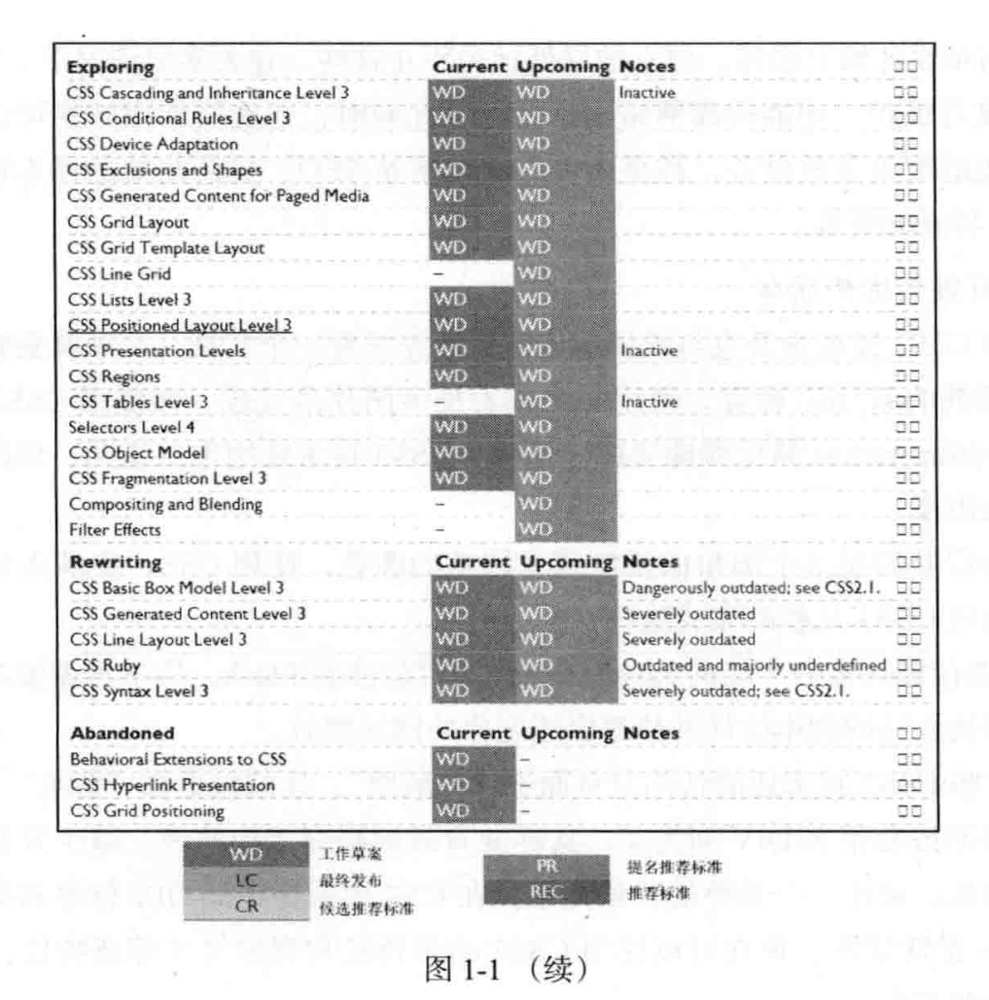
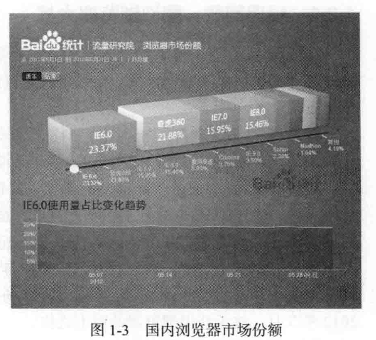
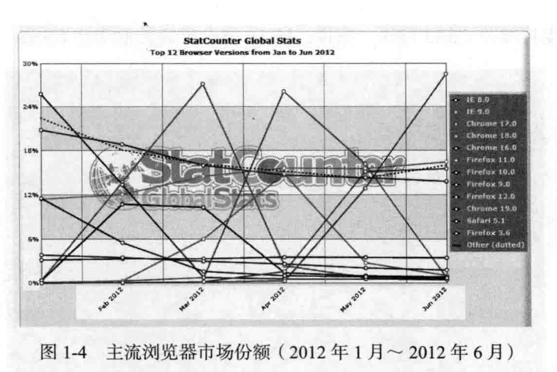
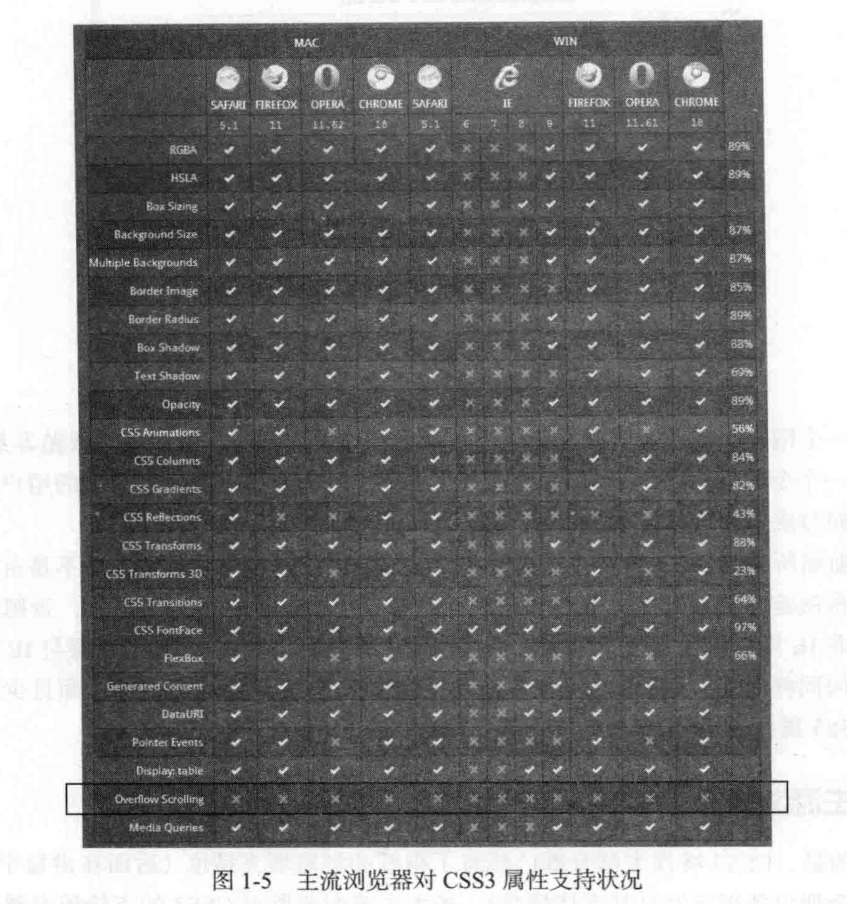
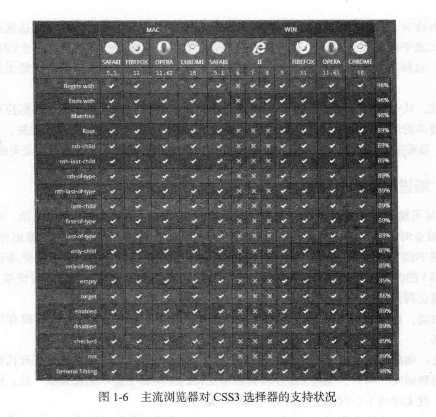
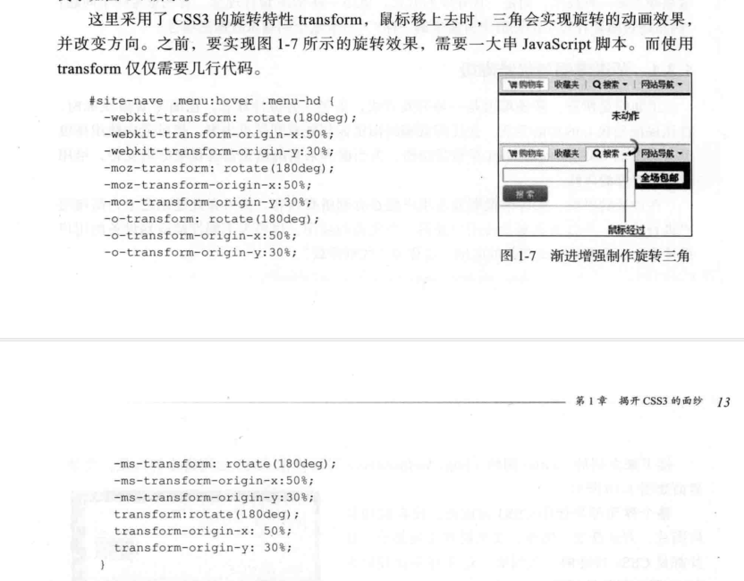

# 第1章：揭开CSS3的面纱

如果关注前端方面的技术，那么对CSS一定不会陌生，你肯定听说过CSS3。在使用CSS3之前，应该对这个新一代样式表语言的来龙去脉有个基本了解。
在本章中，你将知道CSS3与CSS2.1的区别，以及当前市面上主流浏览器、移动端浏览器对CSS3支持的情况。对于尚不完全支持CSS3的浏览器，将会为大家引入一个渐进增强的概念，用一些CSS方法来模拟CSS3的实现方法。最后给大家简单介绍一些CSS3引入的新特性及其未来的前景。

## 什么是CSS3

CSS3并不是一门新的语言。如果接触过CSS就知道，CSS是创建网页的另一个独立但并非不重要的一部分。CSS是种层叠样式表，是一种样式语言，用来告诉浏览器如何渲染你的Web页面。

CSS3是CSS规范的最新版本，在CSS2.1的基础上增加了很多强大的新功能，以帮助开发人员解决一些问题，并且不再需要非语义标签、复杂的JavaScript脚本以及图片，例如圆角功能、多背景、透明度、阴影等功能等。CSS2.1是单一的规范，而**CSS3被划分成几个模块组，每个模块组都有自己的规范**。这样的好处是整个CSS3的规范发布不会因为部分难缠的部分而影响其他模块的推进。

现在先来看看CSS3激动人心的新特性。

### CSS3的新特性

CSS3规范并不是独立的，它重复了CSS的部分内容，但在其基础上进行了很多的增补与修改。CSS3与之前的几个版本相比，其变化是革命性的，虽然它的部分属性还不能够被浏览器完美的支持，但却让我们看到网页样式发展的前景，让我们更具有方向感、使命感。
CSS3新特性非常多，这里挑选一些被浏览器支持较为完美、更具实用性的新特性。

1. 强大的CSS3选择器

   使用过jQuery的人都知道，jQuery的选择器功能强大，使用方便，CSS3选择器和jQuery选择器非常类似。允许设计师通过选择器直接指定需要的HTML元素，而不需要在HTML中添加不必要的类名、ID等。使用CSS3选择器，能在Web的制作中更完美地做到结构与表现分离，设计师能轻松地设计出简洁、轻量级的Web页面，并且能更好地维护和修改样式。

2. 抛弃图片的视觉效果

   Web中最常见的效果包括圆角、阴影、渐变背景、半透明、图片边框等。而这样的视觉效果在CSS中都是依赖于设计师制作图片或者JavaScript脚本来实现的。CSS3的一些新特性可以用来创建一些特殊的视觉效果，后面的章节将为大家展现这些新特性是如何实现这些视觉效果。

3. 背景的变革

   如果说CSS中的背景给你带来太多的限制，那么CSS3将带来革命性的变化。CSS3不再局限于背景色、背景图像的运用，新特性中添加了多个新的属性值，例如background-
   origin、background-clip、background-size，此外，还可以在一个元素上设置多个背景图片。
   这样，如果要设计比较复杂的Web页面效果，就不再需要使用一些多余标签来辅助实现了。举个例子，要实现CSS中的滑动门效果，在CSS中基本上要添加2~3个额外的标签来辅助实现，那么CSS3中的这些新特性能够在一个标签中完成同等的效果。

4. 盒模型变化

   盒模型在CSS中是重中之重，CSS中的盒模型只能实现一些基本的功能，对于一些特殊的功能需要基于JavaScript来实现。而在CSS3中这一点得到了很大的改善，设计师可以直接通过CSS3来实现。例如，CSS3中的弹性盒子，这个属性将给大家引入一种全新的布局概念，能轻而易举实现各种布局，特别是在移动端的布局，它的功能更是强大。大家将在第7章、第8章见识它的神功。

5. 阴影效果

   阴影主要为分两种：文本阴影（text-shadow）和盒子阴影（box-shadow）。文本阴影在CSS中已经存在，但没有得到广泛的运用。CSS3延续了这个特性，并进行了新的定义，该属性提供了一种新的跨浏览器方案，使文本看起来更醒目。盒子阴影的实现在CSS中就有点苦不堪言，为了实现这样的效果，需要新增标签、图片，而且效果还不一定完美。CSS3的box-shadow将打破这种局面，可以轻易地为任何元素添加盒子阴影。

6. 多列布局与弹性盒模型布局

   CSS3引入了几个新的模块用于更方便地创建多列布局。

   “多列布局”（Multi-column Layout）模块描述了如何像报纸、杂志那样，把一个简单的区块拆分成多列，第9章为大家介绍这个模块的运用。“弹性盒模型布局”（Flexible Box Layout）模块能让区块在水平、垂直方向对齐，能让区块自适应屏幕大小，相对于CSS的浮动布局、inline-block布局、绝对定位布局来说，它显得更加方便与灵活。缺点是，这两个模块在一些浏览器中还不被支持，但随着技术的发展革新，这一刻终将到来。

7. Web 字体和Web Font图标

   浏览器对Web字体有诸多限制，Web Font图标对于设计师来说更奢侈。CSS3重新引入@font-face，对于设计师来说无疑是件好事。@font-face是链接服务器上字体的一种方式，这些嵌入的字体能变成浏览器的安全字体，不再担心用户没有这些字体而无法正常显示的问题，从此告别用图片代替特殊字体的设计时代。

8. 颜色与透明度

   CSS3颜色模块的引入，实现了制作Web效果时不再局限于RGB和十六进制两种模式。CSS3增加了HSL、HSLA、RGBA几种新的颜色模式。在Web设计中，能轻松实现某个颜色变得再亮一点或者再暗一点。其中HSLA和RGBA还增加了透明通道，能轻松地改变任何一个元素的透明度。另外，还可以使用opacity属性来制作元素的透明度。从此制作透明度不再依赖图片或者JavaScript脚本了。

9. 圆角与边框的新法

   圆角是CSS3中使用最多的一个属性，原因很简单：圆角比直线性更美观，而且不会与设计产生任何冲突。与CSS制作圆角不同之处是，CSS3无须添加任何标签元素与图片，也不需借用任何JavaScript脚本，一个属性就能搞定。对于边框，在CSS中仅局限与边框的线型、粗细、颜色的设置，如果需要特殊的边框效果，只能使用背景图片来模仿。
   CSS3的border-image属性使元素边框的样式变得丰富起来，还可以使用该属性实现类似background的效果，对边框进行扭曲、拉伸和平铺等。

10. 盒容器的变形

    在CSS时代，让某个元素变形是一个可望而不可及的想法，为了实现这样的效果，需要写大量的JavaScript代码。CSS3引进了一个变形属性，可以在2D或者3D空间里操作盒容器的位置和形状，例如旋转、扭曲、缩放或者移位。我们把这些效果称为“变形”，大家将在第11章体验这些新特性。

11. CSS3过渡与动画交互效果

    CSS3的“过渡”（transition）特性能在Web制作中实现一些简单的动画效果，让某些效果变得更具流线性、平滑性。而CSS3“动画”（animation）特性能够实现更复杂的样式变化，以及一些交互效果，而不需要使用任何Flash或JavaScript脚本代码。

12. 媒体特性与Responsive布局

    CSS3的媒体特性可以实现一种响应式（Responsive）布局，使布局可以根据用户的显示终端或设备特征选择对应的样式文件，从而在不同的显示分辨率或设备下具有不同的布局渲染效果，特别是在移动端上的实现更是一种理想的做法。

### CSS3的发展状况

通过对CSS3新特性的简单介绍，大家可能要问，这些超炫的特性什么时候才能成为标准并最终发布呢？其实CSS3的每一个模块都有它自己的更新（进度表）时间，如图1-1所示，大家可以从这个图上看到CSS3的当前发展的详细进度。

Web开发者希望在CSS3标准规范发布之前就能使用这些新特性，而它们的使用还受限于不同的浏览器，只有浏览器完全支持了，才能完全使用这些新特性。

目前，CSS3还不是最终的标准，有很多浏览器支持不够完美，那么现在可以使用CSS3吗？

### 现在能使用CSS3吗

从图1-1中可以看出，CSS3还在不断完善中，很多功能还处于草稿阶段，但部分模块进入了“候选推荐”状态，这说明在Web设计中完全可以使用这些模块。即使有一些模块还处于“工作草案状态”，也可以尝试着使用，只有不断将新的CSS技术运用到实际工作中，才能发现应用这些新技术所面临的真正挑战，以便W3C更好地完善它们，从而更好地、有效地促使它们成为真正的标准。

你应该了解哪些可用，哪些还不能使用。换句话说，在实际工作开发中可以先运用相对稳定的CSS3特性，并确保不会对尚不支持这些特性的浏览器造成影响。做到明智的使用，而不是盲目地滥用CSS3新特性。

### 使用CSS3有什么好处

与CSS相比，使用CSS3有什么好处呢？最明显的就是CSS3能让页面看起来非常炫、非常酷，使网站设计锦上添花，但它的好处远远不让这些。在大多数情况下，使用CSS3不仅有利于开发与维护，还能提高网站的性能。与此同时，还能增加网站的可访问性、可用性，使网站能适配更多的设备，甚至还可以优化网站SEO，提高网站的搜索排名结果。下面介绍CSS3特有的好处。

1. 减少开发与维护成本

   为什么说CSS3能减少开发与维护的成本呢？？先来看一个实例。一个圆角效果，在CSS中需要添加额外的HTML标签，使用一个或者更多图片来完成，而使用CSS3只需要一个标签、一个border-radius属性就能完成。这样，CSS3技术能把你从绘图、切图和优化图片的工作中解救出来。

   如果后续需要调整这个圆角的弧度或者圆角的颜色，使用CSS，要从头绘图、切图才能完成，而使用CSS3几秒就完成这些工作。

   CSS3还能使你远离一大堆的JavaScript脚本代码或者Flash，你不再需要花大把时间去写脚本或者寻找合适的脚本插件并修改以适配你的网站特效。

   最后，有些CSS3技术还能帮你对页面进行“减肥”，让结构更加“苗条”。你不用为了达到一个效果而嵌套很多DIV和类名，这样能有效地提高工作效率、减少开发时间、降低开发成本。例如，制作一个重叠的背景效果，在CSS中需要添加DIV标签和类名，在不同的DIV中放一张背景图，现在可以使用CSS3的多背景和背景尺寸等新特性，在一个DIV标签中完成这些工作。

2. 提高页面性能

   很多CSS3技术通过提供相同的视觉效果而成为图片的“替代品”，换句话说，在进行Web开发时，减少多余的标签嵌套，以及图片的使用数量，意味着用户要下载的内容将会更少，页面加载也会更快。另外，更少的图片、脚本和Flash文件让Web站点减少HTTP请求数，这是提升页面加载速度的最佳方法之一。而使用CSS3制作图形化网站无需任何图片，极大地减少HTTP的请求数量，并且提升页面的加载速度。当然，这取决于采用CSS3特性来代替什么技术，同样还要看如何使用CSS3特性。例如CSS3的动画效果，能够减少对JavaScript和Flash文件的HTTP请求，但可能要求浏览器执行很多的工作来完成这个动画效果的渲染，这有可能导致浏览器响应缓慢，致使用户流失。因此，在使用一些复杂的特效时，大家需要考虑清楚。不过这样的现象毕竞为数不多。其实很多CSS3技术能够在任何情况下都大幅提高页面的性能。就这一条足以让我们使用CSS3。

## 浏览器对CSS3的支持情况

CSS3给我们带来众多全新的设计体验，但有一个问题值得考虑——浏览器对CSS3特性的支持情况如何？因为页面最终离不开浏览器来渲染，并不是所有浏览器都完全支持CSS3的特性。有时候花时间写的效果只能在特定的浏览器下有效，意味着只有部分用户能欣赏到，这样的工作变得没有什么意义。例如，使用CSS3制作背景仅在WebKit内核的浏览器下有效果。
想知道用户能够体验到哪些CSS3的新特性，必须了解当前浏览器对CSS3特性的支持程度如何。

### 经典回顾：图说浏览器大战

“浏览器大战”一词在20世纪末产生，网景（Netscape）与微软展开了第一次互联网大战，结果是网景以失败告终，微软荣登冠军宝座。

2004年11月Firefox1.0诞生，浏览器开始了历史上的第二次大战，IE的地位受到了以Firefox为首的其他浏览器的挑战。2008年12月Google Chrome的诞生，向市场投放了一颗重磅炸弹。此时的IE也开始了版本的升级，虽然IE将版本更新到了IE8，但面对Firefox和Google Chrome两个强劲的对手，其更新的步伐依然显得太慢，在2010年IE的市场份额跌至50%。而后，Chrome不断更新，其市场份额快速上升。
2012年5月，终于夺得浏览器的霸主之位。

这不是浏览器大战的结束，仅仅是IE时代在落幕而已。随着移动设备的风靡，移动版本Safari的市场份额在一年的时间里迅速增长。也许，第三次浏览器大战的战场并不在桌面领域，而是在移动领域。

市面上浏览器品种繁多，从而引发浏览器的市场大战，这场战争持续了近二十年，但从未有结束战争的趋势。浏览器之争提示了Web浏览器的影响，比如Chrome和Firefox对浏览器霸主I正发起的挑战，随着移动终端的出现，另一个强有力的竞争者——移动Safari网络浏览器也加入这场无休止的浏览器之战。

### 浏览器的市场份额

图1-2所示只是主流浏览器的市场之争，国内还有许多国产的浏览器，例如QQ浏览器、奇虎360浏览器、移动端的UC浏览器等。用户在使用什么样的浏览器，这个使用率始终无法准确地掌握，因为这个概率始终都在变化，下面详细看看国内和全球浏览器的市场份额。

1. 浏览器国内市场份额

   首先关注国内浏览器的市场份额，一起来看百度统计的浏览器市场份额图，如图1-3所示。

   国内浏览器市场位列三甲的分别是IE
   6.0、奇虎360和IE7.0，三个版本的浏览器流量份额占据总市场份额的61.1%左右，但IE6~8在国内依然处于绝对领先态势，但相比两年前，IE浏览器在国内也步入下滑的态势，这给前端开发人员带来一丝的希望。更值得庆幸的是，360浏览器在5月发起了狙击IE6浏览器的活动，并开始在最新版本的360安全浏览器中内置了IE
   8内核，这无疑给国内的前端工程师带来了一丝清凉。

   

2. 浏览器全球市场份额

   2012年5月可以说是浏览器厂商激烈竞争的一个月，一度报出Google Chrome浏览器全球份额首次超越IE浏览器，夺得浏览器全球霸主之位。全球浏览器市场份额发生了哪些变化呢？首先看StatCounter的统计数据，如图1-4所示。

   图1-4中数据显示，在2012年5月，IE浏览器已失去了浏览器的霸主之位，被Chrome取代，Firefox也在市场上位居第三。如果将其他版本的Firefox、Chrome、Safari和Opera加在一起计算，IE所占的市场份额确实已少于这些符合标准的现代浏览器。通常，我在自己站点上发布一个新的CSS3技巧时，很多朋友会问：“它在I正浏览器上能运行吗？效果又是什么样？”根据图1-4的显示结构，是不是应该换一种思维，是不是询问“这个效果在Firefox上看起来怎么样”更有意义呢？

   那么是不是可以忽略IE呢？其实不然，E虽然在全球市场份额不再是霸主，但在国内它依然是主流，特别是IE6依然占有半壁江山，这也致使我们不能不考虑使用IE的用户群。

   

   制作一个网站，其内容应该在任何浏览器上都是可用的，不应该忽略或抛弃某些用户。
   虽然制作一个令人满意的Web页面不是一件难事，但是为了一个渐渐消失的用户群体花费大量的时间与成本确实不是一个明智之举。

   正如前面所讲，CSS3对网站意义何在，应该是由用户群体来确定，而不是由浏览器的市场份额所决定。换而言之，除非网站统计结果与这个结果有很大的出入，否则就不应该继续认为非IE用户仅仅是个不需要特别关注的边缘化群体。在非IE浏览器与IE浏览器上花费的时间同样重要。而CSS3能很容易地让网站在非I正浏览器下更棒，而且少数情况之下这些CSS3属性也适合IE浏览器。

### 主流浏览器对CSS3的支持状况

幸运的是，Css3特性大部分都已经有了很好的浏览器支持度（后面在讲每个css3特性之时，会列出各浏览器对其支持情况）。各大主流浏览器对Css3的支持越来越完善，曾经让多少前端开发人员心碎的IE也开始挺进CSS3标准行列。当然，即使Css3标准制定完成，现代浏览器要普及到大部分用户也是一个相当漫长的过程。如果现在就要使用Css3来美化你的站点，有必要对各大主流浏览器对其新技术的支持情况有一个全面的了解。
本节分别在Mac和Windows两个平台介绍Chrome、Firefox，Safari，Opera和IE五大主流浏览器对Css3新特性和Css3选择器的支持情况。

1. 主流浏览器对CSS3属性的支持状况

   图1-5所示是findmebylP为五大主流浏览器对CSS3属性支持状况的统计图。
   从图中可以看出，Css3中的Overflow Scrolling属性还没有浏览器支持，其他属性在Mac系统下，Chrome，Safari都支持，其次支持较好的是Firefox和Opera。而在Windows系统下，Webkit内核浏览器表现的非常优秀，其次是Firefox和Opera。同时IE也迎头追赶，在IE9中支持部分Css3特性。据说，IE 10将会更完美地支持CSS3。

   

2. 主流浏览器对CSS3选择器的支持状况

   图1-6所示是findmebylP为五大主流浏览器对Css3选择器的支持状况统计图。值得高兴的是，图中除了1E6~8有“×"之外，其他浏览器都是"V"，全部支持CSS3选择器。

   从图1-5和图1-6中可以清楚地知道，无论是在Mac系统下还是在Windows系统下，Google Chrome和Safari对Css3特性的支持度是最好的，而IE系列是最差的，特别是IE
   6 ~ 8，原因很简单，IE6~8发布于CSS3完善之前。

   差别各异的浏览器致使页面在不同的浏览器之中渲染并不一致。特别是在当今这个信息发达的时代，设备、屏幕、浏览器的形态越来越丰富，人们的习惯设置也不尽相同，因此想再创造一个在任何地方都表现一致的页面就更加的不可能。只要你关注如何提供实用、易用、好用的页面，这点表面上的差异就显得不重要。而这种想法就是接下来要介绍的“渐进增强"。

   

## 渐进增强

第一次听到“渐进增强”（Progressive Enhancement）一词是在前端重构交流会上。渐进增强并不是一种技术，而是一种开发的方式，更是一种Web设计理念。首先思考一个问题：
“网站是否需要在每个浏览器中看起来都一样？”带着这个问题来看渐进增强。

### 渐进增强与优雅降级

正如前面所言，渐进增强是一种开发方式，更是一种设计理念。在编写Web页面时，首先保证最核心的功能实现，让任何低端的浏览器都能看到站点内容，然后考虑使用高级但非必要的CsS和JavaScript等增强功能，为当前和未来的浏览器提供更好的支持，给用户带来更好的体验。

在设计的时候，先考虑低端设备用户能否看到所有内容，然后在此基础之上为高端用户进行设计。不仅为高端设备用户提供一个完美的应用，也要为不同性能级别设备的用户设计不同级别的不那么完美的应用。这称为“优雅降级”。

目前而言，虽对“渐进增强”有所了解的人很多，但是要说普及或深入还远远没到时候。在大家平时的设计思维中有一种极强的固定思维，也就是想让网站在各个浏览器下表现一致。这种出发点本身并没有什么问题，但是这样会让领先的浏览器的优势无法充分显示出来。

因此，从今天开始要改变制作Web站点的思维，让网站能优雅降级，目标应该是-
向尽可能多的用户提供尽可能优质的用户体验。这跟用户访问网站使用方式无关，无论通过iPhone、高端的桌面系统、Kindle，还是阅读器，用户都能得到尽可能独特且完美的体验。

### 渐进增强的优点

“向尽可能多的用户提供尽可能优质的用户体验”这一目标听起来相当不错。有的人制作Web站点时报怨，IE怎样才具有CSS3的效果。诚然，我们不使用渐进增强也可以实现，如为一些旧浏览器提供一套兼容方案，确保页面与现代浏览器保持一致。简单来说就是在支持CSS3的浏览器中使用CsS3特性，在不支持的浏览器中另写一套样式来模拟Css3效果，实现让网站在所有浏览器都一样。

可以说，通过这种方法只是让低版本的浏览器渲染页面更好看一点，并没有得到实质性的提高。

因此，如果网站始终无法做到一模一样，为什么不使用CSS3技术使它在现代浏览器上看起来更靓丽呢？当然，某些Css3特性在不支持的浏览器中是“无法模拟”的，但使用渐进增强，就无须为了让网站适合所有人而放弃这些技术。

CSS的渐进增强有别于CSS的hack，hack是浏览器厂商的一种手法，用来增强自己的竞争，而渐进增强起到锦上添花之效。所以前者应该尽量避免使用，而后者应该适当使用。

就样式而言，渐进增强的对象是一些现代浏览器，渐进增强的一些属性主要是Css3的一些特性，或是IE低级版本不支持的一些属性，或是其他一些特殊情况。淘宝网上的一个例子如图1-7所示。

采用渐进增强能给现代浏览器用户一个更好的体验，在不支持CSS3的IE浏览器也能正常使用，只不过体验会大打折扣。

以上只是一个简单的例子，本书后面还会介绍Css3渐进增强的案例，例如text-shadow文字阴影、border-radius圆角属性、box-shadow盒阴影属性、CSS3渐变背景和CSS3选择器等。

## CSS3的现状及未来

