(注1：本视频链接为[HTML5+CSS3版本新特性进阶-黑马程序员](https://www.bilibili.com/video/BV1xb411x7Gs?from=search&seid=3542573497401242539))

(注2：课程一共有106集，视频里老师一共上6天课。我打算一天看10集，大概10天左右看完它。)

(注3：这门课程一个不好的地方在于没有找到老师的笔记，我只好在网上找了其他人的笔记作为参考，其他的自己只能手写尽量复原老师的笔记了。)

(注4：现在是2020年8月29日，5天过去了，我才看到第16集，那原来的计划1天看10集就显得有点搞笑了，按照这个进度我估计这个看到9月20号看完就已经是谢天谢地了。实在是没有太多时间了，我总不能拖拖拉拉的看一个月吧！！！)

(注5：这个视频有些不全，比如伪类选择器就没有，我就看了黑马的视频作为补充。)

(注6：我发现这个视频不是不全，是顺序有点不对)

(注7：现在是2020年9月4日，我今天刚刚看完第40集。不过我现在的想法开始变化了，计划有变，JS高级还是要每天看10集，把它给看完的，这个因为每一个视频都比较短，所以完成起来没有太大压力，之后的计划是ES6和Flex布局。然后现在自己不可遏制的想要开始学习Vue和Node.js了，当然，主要还是先把JS高级和ES6还有Flex布局先学完，不过现在要开始接触Vue和Node.js了，至于H5C3，就慢慢的来吧，2个月内看完就可以了)

(注8：现在是2020年10月10日，我已经快一个月没有学这个了，这一个月主要时间都放在Vue上面了，这个也要抓紧时间学一下了。明天是周日，明天一定要重新花点时间学一点。)

(注9：现在是2021年4月7日，我觉得有必要再学习一下HTML5、CSS3了，尤其是transform这块。现在上班了，以后放假的时候不要懒了，要开始学习了啊，不然真的是越来越多东西还没学了。)

# 内容分布

第1-2天：HTML5新增标签和属性

第3-5天：CSS3新增的样式

第6天：案例回顾——H5+C3知识点比较零散独立,要进行一个总结

# 什么是HTML5

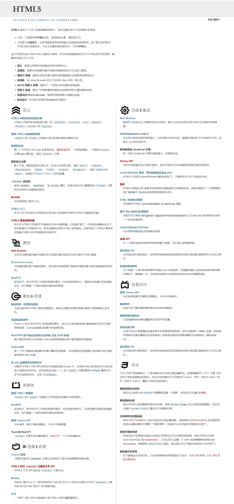

1.H5 并不是新的语言，而是 HTML 语言的第五次重大版本修改。

2.支持：所有的主流浏览器都支持 H5（Chrome，FireFox，Safari，IE9 及以上版本，IE9 为有选择的支持非全部支持）。

3.改变了用户与文档的交互方式：多媒体：video,audio,canvas等。

4.增加了其他的新特性：语义特性，本地存储，网页多媒体，二维三维变换，特效(过渡，动画)。

5.相对于 HTML4：

* 进步：抛弃了一些不合理不常用的标记和属性
* 新增了一些标记和属性--表单
* 从代码角度而言，H5网页结构代码更加简洁

6.HTML4.01

* 语义标签
  * p标签：段落
  * img标签：图片等
* 语义性不强的：
  * div：作为容器存在
    * 在网站布局中使用广泛
    * 搜索引擎友好，但是搜索引擎更友好的依旧是内容

~~~html
<!-- HTML5文档模板 -->
<!-- 输入html:5+tab键 或!+tab键 -->
<!DOCTYPE html>
<html lang="en">
<head>
    <meta charset="UTF-8">
    <meta name="viewport" content="width=device-width, initial-scale=1.0">
    <meta http-equiv="X-UA-Compatible" content="ie=edge">
    <title>Document</title>
</head>
<body>
    
</body>
</html>

<!-- html4模板 -->
<!-- html:xt + tab VSC不生效 xhtml过渡型文档类型 -->
<!-- 网址规范的解析的规则，transitional:过渡 -->
<!DOCTYPE PUBLIC "-//W3C//DTD SHTML 1.0 Transitional//EN" "http://ww.w3.org/TR/xhtml1/DTD/xhtml1-transitional.dtd">
<html xmlns="http://www.w3.org/1999/xhtml" xml:lang="en">
<head>
    <meta http-equiv="Content-Type" content="text/html;charset=UTF-8">
    <title>Document</title>
</head>
<body>

</body>
</html>

<!-- 严格的html4模板 -->
<!-- strict：严格的，完全按照h4的请求进行解析 -->
<!DOCTYPE PUBLIC "-//W3C//DTD SHTML 1.0 Transitional//EN" "http://ww.w3.org/TR/html4/strict.dtd">
<html xmlns="http://www.w3.org/1999/xhtml" xml:lang="en">
<head>
    <meta http-equiv="Content-Type" content="text/html;charset=UTF-8">
    <title>Document</title>
</head>
<body>

</body>
</html>
~~~

## HTML5部分新语义标签

> HTML5中有部分语义标签，在使用时十分简单，但是由于语义性更强，更利于开发者以及搜索引擎对于网页的理解。

语义标签：[HTML 标签参考](<https://developer.mozilla.org/zh-CN/docs/Web/Guide/HTML/HTML5/HTML5_element_list#%E6%A0%B9%E5%85%83%E7%B4%A0>)

| 标签名  | 作用             |
| ------- | ---------------- |
| nav     | 表示导航         |
| header  | 表示页眉         |
| footer  | 表示页脚         |
| main    | 表示主要内容     |
| article | 文章             |
| aside   | 主题内容之外     |
| footer  | 文档或者页的页脚 |

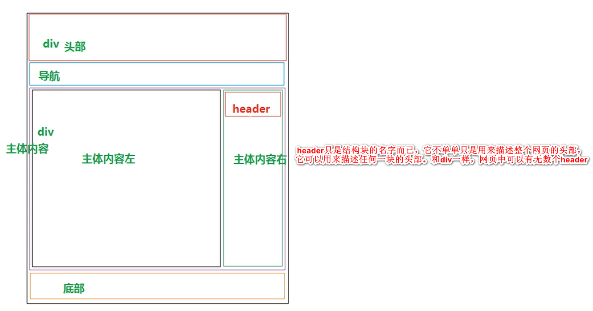

~~~html
<!DOCTYPE html>
<html lang="en">

<head>
  <meta charset="UTF-8">
  <meta name="viewport" content="width=device-width, initial-scale=1.0">
  <title>Document</title>
  <style>
    * {
      margin: 0;
      padding: 0;
    }

    header {
      width: 100%;
      height: 100px;
      background-color: red;
    }

    nav {
      width: 100%;
      height: 36px;
      background-color: green;
    }

    main {
      width: 100%;
      height: 500px;
      background-color: #ccc;
    }

    main>article {
      width: 80%;
      height: 100%;
      background-color: purple;
      float: left;
    }

    main>aside {
      width: 20%;
      height: 100%;
      background-color: pink;
      float: right;
    }

    footer {
      width: 100%;
      height: 80px;
      background-color: skyblue;
    }
  </style>
</head>

<body>
  <!-- 以前写页面结构的写法 -->
  <!-- <div class="header"></div>
  <div class="nav"></div>
  <div class="mainContent">
    <div class="left"></div>
    <div class="right"></div>
  </div>
  <div class="footer"></div> -->

  <!-- 当前用HTML5语义化标签写页面的写法 -->
  <header>头部</header>
  <nav>导航</nav>
  <main>
    <article>左边</article>
    <aside>右边</aside>
  </main>
  <footer>底部</footer>
</body>

</html>
~~~

## HTML5所有标签列表

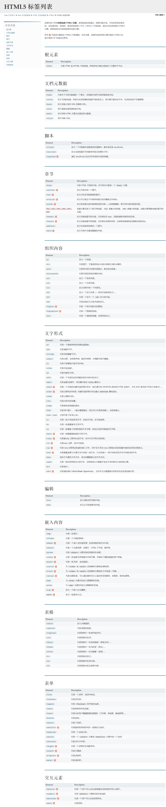

## 语义化标签的兼容性(IE9及以下)

IE9**有选择的**支持HTML5，会将新标签认为是行内元素，到时候在新标签里添加`display:block`就可以正常显示了。

IE8及以下则是完全不支持HTML5,完全不认识这些标签，此时有2个方法可以解决兼容性问题：

* 使用` document.createElement()`手动创建标签，再分别加`display:block`;
* 使用第三方插件[html5shiv](<https://github.com/aFarkas/html5shiv>)

~~~html
<!DOCTYPE html>
<html lang="en">

<head>
  <meta charset="UTF-8">
  <meta name="viewport" content="width=device-width, initial-scale=1.0">
  <title>Document</title>
  <style>
    * {
      margin: 0;
      padding: 0;
    }

    header {
      width: 100%;
      height: 100px;
      background-color: red;
    }

    nav {
      width: 100%;
      height: 36px;
      background-color: green;
    }

    /* IE9:将新标签认为是行内元素，行内元素在设置宽高的时候是失效的——可以用display:block补救*/
    /* IE8及以下:不支持HTML5,所以完全不认识这些新标签，根本无法进行解析，也就意味着所写样式无效*/
    /* IE8及以下解决方式：手动创建这些标签——见下面script */
    main {
      /* 将行内元素转换为块级元素,此时IE9版本正常显示了*/
      display: block;
      width: 100%;
      height: 500px;
      background-color: #ccc;
    }

    main>article {
      display: block;
      width: 80%;
      height: 100%;
      background-color: purple;
      float: left;
    }

    main>aside {
      display: block;
      width: 20%;
      height: 100%;
      background-color: pink;
      float: right;
    }

    footer {
      display: block;
      width: 100%;
      height: 80px;
      background-color: skyblue;
    }
  </style>
</head>

<body>
  <!-- 以前写页面结构的写法 -->
  <!-- <div class="header"></div>
  <div class="nav"></div>
  <div class="mainContent">
    <div class="left"></div>
    <div class="right"></div>
  </div>
  <div class="footer"></div> -->

  <!--解决IE9兼容性方式：加display:block -->
  <!-- 解决IE8及以下兼容性第一种方式：手动创建标签，再分别加display:block-->
  <!-- <script>
    // 解决IE8及以下不支持HTML5方法：手动创建标签(但默认的标签类型都是行内元素)
    // 然后再手动的把它们设置为块级元素
    document.createElement("header");
    document.createElement("nav");
    document.createElement("main");
    document.createElement("article");
    document.createElement("aside");
    document.createElement("footer");
  </script> -->

  <!-- 解决IE8及以下兼容性第二种方式：引入第三方插件 html5shiv -->
  <script src="html5shiv.js"></script>
  <!-- 当前用HTML5语义化标签写页面的写法 -->
  <header>头部</header>
  <nav>导航</nav>
  <main>
    <article>左边</article>
    <aside>右边</aside>
  </main>
  <footer>底部</footer>
</body>
</html>
~~~

## input表单新增的type属性

input标签里面新增了`<email>`、`<tel>`、`<url>`、`<number>`、`<search>`、`<range>`、`<color>`、`time`、`date`、`<datetime>`、`<datetime-local>`、`<month>`、`<week>`这些属性。

| type                    | 效果                                       |
| ----------------------- | ------------------------------------------ |
| text                    | 输入普通文本信息                           |
| password                | 密码输入，显示为*                          |
| email                   | 邮箱输入，校验邮箱格式                     |
| tel                     | 电话号码输入，主要针对移动端调用数字键盘入 |
| url                     | 网址输入                                   |
| search                  | 带有清空按钮的文本输入                     |
| range                   | 范围滑条                                   |
| color                   | 颜色拾取                                   |
| time                    | 时间选择，时分                             |
| date                    | 日期选择，年月日                           |
| datetime/datetime-local | 日期时间选择，年月时分                     |
| month                   | 月份选择                                   |
| week                    | 周选择                                     |

~~~html
<!DOCTYPE html>
<html lang="en">

<head>
  <meta charset="UTF-8">
  <meta name="viewport" content="width=device-width, initial-scale=1.0">
  <title>Document</title>
</head>

<body>
  <form action="">
    用户名: <input type="text" name="userName"><br>
    密码： <input type="password" name="userPwd"><br>

    <!-- email提供了默认的电子邮箱的完整验证(不用你自己通过正则表达式写JS脚本验证了)-->
    <!-- 如果不能满足验证，则会阻止当前的数据提交 -->
    邮箱: <input type="email"><br>

    <!-- tel并不是来实现验证(全世界电话号码不一样)它的本质目的是为了能够在移动端打开数字键盘 -->
    <!-- 意味着数字键盘限制了用户只能输入数字 -->
    电话：<input type="tel"><br>

    <!--验证只能输入合法的网址，必须包含http://-->
    网址：<input type="url"><br>
    <!-- number:只能输入数字(包含小数点)，不能输入其他的字符 -->
    <!-- 
      max:最大值
      min:最小值
      value:默认值
     -->
    数量：<input type="number" value="60" min="0" max="100"><br>
    <!-- search:可以提供更人性化的输入体验 -->
    请输入商品名称：<input type="search"><br>
    <!-- range:范围 -->
    范围：<input type="range" value="60" min="0" max="100"><br>
    <!-- color:颜色 -->
    颜色：<input type="color"><br>
    <!-- 时间相关：时分秒 -->
    时间：<input type="time"><br>
    <!-- 日期相关：年月日 -->
    日期：<input type="date"><br>
    <!-- datetime:现在大多数浏览器都不支持datetime(只有苹果下面的safari支持) -->
    日期时间1：<input type="datetime"><br>
    <!-- datetime-local:可以同时得到时间和日期，而且浏览器都支持 -->
    日期时间2：<input type="datetime-local"><br>
    <!-- month:月份 -->
    月份：<input type="month"><br>
    <!-- week:星期 -->
    星期: <input type="week"><br>
    <!-- 提交 -->
    <button type="submit">提交</button>
  </form>
</body>
</html>
~~~

## HTML5表单中新增的其他属性

| 属性名       | 效果                                                         |
| ------------ | ------------------------------------------------------------ |
| placeholder  | 输入框提示信息，提示占位                                     |
| autofocus    | 自动获取焦点                                                 |
| autocomplete | 自动完成，on/off，需指定name性并成功提交一次                 |
| require      | 必须输入，不输入无法提交                                     |
| pattern      | 正则匹配，如自定义手机号验证                                 |
| multiple     | 文件拾取多选，多个邮箱输入等                                 |
| form         | 为 form 标签之外的表单元素指定隶属的表单，从而跟随表单一同提交数据 |

~~~html
<!DOCTYPE html>
<html lang="en">

<head>
  <meta charset="UTF-8">
  <meta name="viewport" content="width=device-width, initial-scale=1.0">
  <title>Document</title>
</head>

<body>
  <form action="" id="myForm">
    <!-- 以前提示写法：不好，在里面输入还要手动删除提示文本，并且删除后不会再显示-->
    <!-- 用户名: <input type="text" value="请输入用户名"><br> -->

    <!-- placeholder:提示文本，又叫提示占位 -->
    <!-- autofocus:自动获取焦点 -->
    <!-- autocomplete:自动完成  on:打开  off:关闭 -->
    <!-- autocomplete前提1：必须成功提交过,提交过才会有记录-->
    <!-- autocomplete前提2：当前添加了autocomplete的元素必须有name属性，没有则不行-->
    用户名：<input type="text" placeholder="请输入用户名" autofocus autocomplete="on" name="userName"><br>

    <!-- tel并不会实现验证，仅仅是在移动端能够弹出数字键盘 -->
    <!-- required:必须输入，如果没有则会阻止当前数据提交 -->
    <!-- pattern:正则表达式验证 -->
    <!-- 回顾正则：
      *：代表任意个
      ?:代表0个或1个
      +：代表1个或多个 -->
    手机号：<input type="tel" name="phone" required pattern="^(\+86)?1\d{10}$"><br>
    <!-- multiple:可以选择多个文件(默认只能选择一个文件) -->
    文件： <input type="file" name="photo" multiple><br>
    <!-- email:有默认的验证,在email中，multiple允许输入多个邮箱地址，但是必须要以逗号分割-->
    邮箱： <input type="email" name="email" multiple><br>
    <!-- 提交 -->
    <input type="submit"><br>
  </form>

  <!-- 这个address没有包含在form里面，但是我还是想让它也提交 -->
  <!-- 下面这个表单元素并没有包含在form中：默认情况下面表单元素的数据不会进行提交 -->
  <!-- 方法1：把这个address也加到form表单中去(现实中有些原因不能把它放到form表单中去)-->
  <!-- 方法2：使用form:指定表单id,那么在将来指定id号的表单进行数据提交的时候，也会将当前表单元素中的数据一起提交 -->
  地址：<input type="text" name="address" form="myForm">
</body>

</html>
~~~

## HTML5新增的表单元素1：datalist

> 该元素规定了输入区域的选项列表，可以让用户有一些选项。其中option标签作为单标签，双标签都可以使用。

~~~html
<!DOCTYPE html>
<html lang="en">

<head>
  <meta charset="UTF-8">
  <meta name="viewport" content="width=device-width, initial-scale=1.0">
  <title>Document</title>
</head>

<body>
  <form action="">
    <!-- 专业：<select name="" id="">
      <option value="1">语文</option>
      <option value="2">数学</option>
      <option value="3">英语</option>
      <option value="4">物理</option>
      <option value="5">化学</option>
      <option value="6">生物</option>
      <option value="7">政治</option>
      <option value="8">历史</option>
      <option value="9">地理</option>
    </select> -->
    
    <!-- 需求：不仅可以选择，还应该可以输入 -->
    <!-- 建立输入框和datalist的关联  list="datalist的id号" -->
    <!-- 火狐浏览器支持不好，所以不常用 -->
    专业：<input type="text" list="subjects">
    <!-- 通过datalist创建选择列表 -->
    <datalist id="subjects">
      <!-- 创建选项值：value:具体的值 label:提示信息，辅助值 -->
      <!-- option可以是双标签，也可以是单标签 -->
      <option value="体育" label="锻炼身体">
      <option value="语文" label="都要好好学"></option>
      <option value="数学" label="都要好好学"></option>
      <option value="英语" label="都要好好学"></option>
      <option value="物理" label="都要好好学"></option>
      <option value="化学" label="都要好好学"></option>
      <option value="生物" label="都要好好学"></option>
      <option value="政治" label="都要好好学"></option>
      <option value="历史" label="都要好好学"></option>
      <option value="地理" label="都要好好学"></option>
    </datalist>

    网址：<input type="url" list="urls">
    <datalist id="urls">
      <!-- 如果input的输入框type类型为url，则value值则必须添加http:// -->
      <option value="http://www.baidu.com" label="百度"></option>
      <option value="http://www.sohu.com"></option>
      <option value="http://www.xinlang.com"></option>
    </datalist>
  </form>
</body>

</html>
~~~

## HTML5新增的表单元素2

### keygen

keygen元素是密钥对生成器（key-pair generator）。当提交表单时，会生成两个键，一个是私钥，一个公钥。私钥（private key）存储于客户端，公钥（public key）则被发送到服务器。公钥可用于之后验证用户的客户端证书（client certificate），即实现非对称加密目前，**浏览器支持率极低**。

> 该特性已经从 Web 标准中删除，虽然一些浏览器目前仍然支持它，但也许会在未来的某个时间停止支持，请尽量不要使用该特性。

* 使用频率：低

~~~html
<!DOCTYPE html>
<html lang="en">

<head>
  <meta charset="UTF-8">
  <meta name="viewport" content="width=device-width, initial-scale=1.0">
  <title>Document</title>
</head>

<body>
  <form action="">
    用户名：<input type="text" name="userName"><br>
    密码：<input type="password" name="userPwd"><br>
    <!-- keygen:生成公钥，私钥，提交数据的时候：信息+私钥->二次加密 -->
    <!-- 服务器使用公钥和二次加密之后的数据,进行解密 -->
    <!-- 很多浏览器不支持，所以不常用 -->
    加密：<keygen></keygen>
    <input type="submit">
  </form>
</body>
</html>
~~~

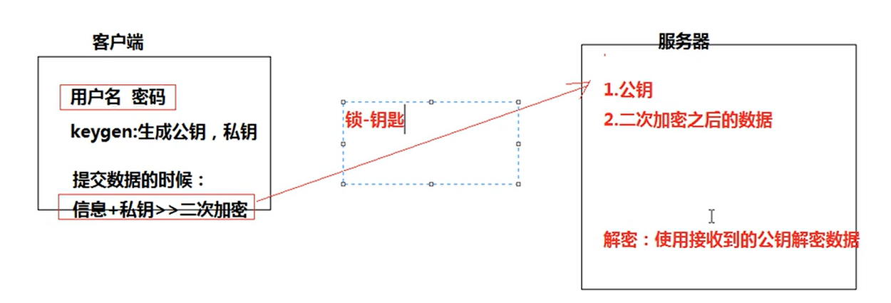

### output

属于新的语义标签：用来**放置输出的内容**，但是不能自动的计算结果，依旧需要通过JS的方式来动态修改结果，只是相比于其他的标签，语义性更强

* 使用频率：低

~~~html
<!DOCTYPE html>
<html lang="en">

<head>
  <meta charset="UTF-8">
  <meta name="viewport" content="width=device-width, initial-scale=1.0">
  <title>Document</title>
</head>

<body>
  <!-- 显示输出信息：只能显示不能修改-->
  <!--
      1.语义性更强
      2.值需要你设置，不能自动计算 -->
  <output>总金额：￥100.00</output>
</body>

</html>
~~~

## HTML5新增的事件(oninput,oninvalid)

~~~html
<!DOCTYPE html>
<html lang="en">

<head>
  <meta charset="UTF-8">
  <meta name="viewport" content="width=device-width, initial-scale=1.0">
  <title>Document</title>
</head>

<body>
  <form action="">
    用户名：<input type="text" name="userName" id="userName"><br>
    电话： <input type="tel" name="userPhone" id="userPhone" pattern="^(\+86)?1\d{10}$"><br>
    <input type="submit">
  </form>
  <script>
    // 1.oninput:监听当前指定元素内容的改变：只要内容改变(添加内容、删除内容)，就会触发这个事件
    //如果你用鼠标进行复制粘贴操作仍会触发事件
    document.getElementById('userName').oninput = function () {
      console.log("oninput：" + this.value);
    }
    //2.onkeyup:键盘弹起的时候触发：每一个键的弹起都会触发一次事件
    //如果你用鼠标进行复制粘贴操作则不会触发事件
    document.getElementById('userName').onkeyup = function () {
      console.log("onkeyup：" + this.value);
    }

    //3.oninvalid:当验证不通过时触发
    document.getElementById("userPhone").oninvalid = function () {
      // console.log("请输入合法的11位手机号");
      // 设置默认的提示信息
      this.setCustomValidity("请输入合法的11位手机号");
    }
  </script>
</body>

</html>
~~~

> 后面老师还说了一个onchange事件。

## HTML5进度条(progress)

~~~html
<!DOCTYPE html>
<html lang="en">

<head>
  <meta charset="UTF-8">
  <meta name="viewport" content="width=device-width, initial-scale=1.0">
  <title>Document</title>
</head>

<body>
  <!-- progress:进度条-->
  <!-- 属性1.max:最大值 -->
  <!-- 属性2.value:当前进度值  -->
  <progress max="100" value="60"></progress>

  <!-- 度量器：衡量当前进度值-->
  <!-- 属性1.high:规定的较高的值 -->
  <!-- 属性2.low:规定的较低的值 -->
  <!-- 属性3.max:规定的最大的值 -->
  <!-- 属性4.min:规定的最小的值 -->
  <!-- 属性5.value:当前度量值 -->
  <meter max="100" min="0" high="80" low="40" value="30"></meter>
  <meter max="100" min="0" high="80" low="40" value="60"></meter>
  <meter max="100" min="0" high="80" low="40" value="90"></meter>
</body>
</html>
~~~

## HTML5表单总结案例

[HTML < fieldset> 标签](<https://www.runoob.com/tags/tag-fieldset.html>)

[border-sizing属性详解和应用](https://www.cnblogs.com/sunshq/p/9505504.html)

~~~html
<!DOCTYPE html>
<html lang="en">

<head>
  <meta charset="UTF-8">
  <meta name="viewport" content="width=device-width, initial-scale=1.0">
  <title>Document</title>
  <link rel="stylesheet" href="css/formCSS.css">
</head>

<body>
  <form action="">
    <fieldset>
      <legend>学生档案</legend>
      <label for="userName">姓名：</label>
      <input type="text" name="userName" id="userName" placeholder="请输入用户名">
      
      <label for="userPhone">手机号码：</label>
      <input type="tel" name="userPhone" id="userPhone" pattern="^1\d{10}$">
      
      <label for="email">邮箱地址</label>
      <input type="email" required name="email" id="email">
      
      <label for="college">所属学院：</label>
      <input type="text" name="college" id="college" list="cList" placeholder="请选择">
      
      <datalist id="cList">
        <option value="哲学院"></option>
        <option value="数学院"></option>
        <option value="工商学院"></option>
        <option value="金融学院"></option>
        <option value="计算机学院"></option>
      </datalist>
      
      <label for="score">入学成绩：</label>
      <!-- 但是这个可以手动输入比100大的数字，有bug -->
      <input type="number" max="100" min="0" value="0" id="score">
      
      <label for="">基础水平</label>
      <meter id="level" max="100" min="0" low="59" high="90"></meter>
      
      <label for="inTime">入学日期：</label>
      <input type="date" id="inTime">
      
      <label for="leaveTime">毕业日期：</label>
      <input type="date" id="leaveTime">
      
      <input type="submit">
    </fieldset>
  </form>
  <script>
    document.getElementById("score").oninput = function () {
      document.getElementById("level").value = this.value;
    }
  </script>
</body>

</html>
~~~

~~~css
* {
  margin: 0;
  padding: 0;
}

form {
  width: 600px;
  margin: 20px auto;
}

form > fieldset {
  padding: 10px;
}
form > fieldset > meter,
form > fieldset > input {
  width: 100%;
  height: 40px;
  line-height: 40px;
  margin: 10px 0;
  /* 现将边框样式全部取消 */
  border: none;
  border: 1px solid #ccc;
  border-radius: 4px;
  font-size: 16px;
  padding-left: 5px;
  /* width = 内容 + padding + border */
  box-sizing: border-box;
}

form > fieldset > meter {
  padding-left: 0px;
}
~~~

## HTML5新增的多媒体标签(audio,video)

~~~html
<!DOCTYPE html>
<html lang="en">

<head>
  <meta charset="UTF-8">
  <meta name="viewport" content="width=device-width, initial-scale=1.0">
  <title>Document</title>
</head>

<body>
  <!-- embed：直接插入视频文件：它的本质是调用本机上已经安装的软件，且有兼容性 -->
  <!-- flash插件：安装flash  缺点1：要学习flash,增加使用成本 缺点2：苹果设备不支持flash-->
  <!-- audio：播放音频-->
  <!-- src:播放的音频文件的路径 -->
  <!-- controls:音频播放器的控制面板 -->
  <!-- autoplay:自动播放(不知道为什么自动播放不了) -->
  <!-- loop：循环播放 -->
  <audio src="snow.mp3" controls autoplay loop></audio>

  <!-- video：播放视频 -->
  <!-- src:播放的音频文件的路径 -->
  <!-- controls:音频播放器的控制面板 -->
  <!-- autoplay:自动播放(不知道为什么自动播放不了)-->
  <!-- loop：循环播放 -->
  <!-- width:宽度 -->
  <!-- height:高度 -->
  <!-- poster:当视频还没有完全下载，或者用户还没有点击播放前的默认显示的封面，默认是显示当前视频文件的第一帧-->
  <!-- 注意事项：当你设置宽高的时候，一般情况下只需设置宽度或者高度，让其自动的等比缩放，
    如果同时设置宽度和高度，那么视频并不会真正的调整到设置的宽高，除非设置的值刚好是等比例的-->
  <video src="video.mp4" poster="美女.jpeg" controls width="300px" autoplay></video>

  <!-- source的使用：因为不同浏览器支持的视频文件格式不一样，所以我们在进行视频添加的时候，需要考虑到浏览器是否支持。我们可以准备多个格式的视频文件，让浏览器自动的选择。 -->
  <video controls width="300px">
     <!-- 视频源，可以有多个源 -->
    <source src="video.flv" type="video/flv">
    <source src="video.mp4" type="video/mp4">
    您的浏览器不支持当前的视频播放
  </video>
</body>

</html>
~~~

## HTML5的DOM操作

~~~html
<!DOCTYPE html>
<html lang="en">

<head>
  <meta charset="UTF-8">
  <meta name="viewport" content="width=device-width, initial-scale=1.0">
  <title>Document</title>
  <style>
    .red {
      color: red;
    }

    .green {
      color: green;
    }

    .blue {
      color: blue;
    }
  </style>
</head>

<body>
  <ul>
    <li class="red">前端</li>
    <li class="green">Java</li>
    <li class="blue">JavaScript</li>
    <li id="c">C++</li>
  </ul>
  <script>
    // 获取第一个li标签
    window.onload = function () {
      //getElementsByTagName获取的是数组
      // 索引：不直观 以后的数据都是从后台动态获取，前台动态生成添加
      // var cli = document.getElementsByTagName("li")[0];
      // console.log(cli);

      // query:查询  Selector:选择器
      //querySelector(选择器的名称 .类名称 #id名称)
      //querySelector:获取单个元素，如果获取的元素不止一个，那么只会返回满足条件的第一个元素
      //参数要求：如果是类选择器，必须添加. 如果是id选择器，必须添加# 否则会当成标签处理
      var javaLi = document.querySelector("li");
      // var c = document.querySelector("#c");
      console.log(javaLi);

      // querySelectorAll:获取满足条件的所有元素
      var allLi = document.querySelectorAll("li");
      var allLi1 = document.querySelectorAll("li")[0];
      console.log(allLi);
      console.log(allLi1);
    }
  </script>
</body>

</html>
~~~

## HTML5类样式操作

~~~html
<!DOCTYPE html>
<html lang="en">
<head>
    <meta charset="UTF-8">
    <meta name="viewport" content="width=device-width, initial-scale=1.0">
    <meta http-equiv="X-UA-Compatible" content="ie=edge">
    <title>Document</title>
    <style>
        .red{
            color: red;
        }
        .green{
            color: green;
        }
        .blue{
            color: blue;
        }
        .underline{
            text-decoration: underline;
        }
    </style>
</head>
<body>
    <ul>
        <li>JavaScript</li>
        <li class="blue">Java</li>
        <li>C++</li>
        <li>Python</li>
    </ul>

    <input type="button" value="为第一个li元素添加样式" id="add">
    <input type="button" value="为第二个li元素移除样式" id="remove">
    <input type="button" value="为第三个li元素切换样式" id="toggle">
    <input type="button" value="判断第一个li元素是否包含某个样式" id="contain">

    <script>
        window.onload = function(){
            // add:为元素添加指定名称的样式，一次只能添加一个样式
            document.querySelector("#add").onclick= function(){
                // classList：当前元素的所有的样式列表-数组
                // querySelector("li")选中第一个li标签
                document.querySelector("li").classList.add("red");
                document.querySelector("li").classList.add("underline");

                // 旧方式，此方法会顶替掉之前的所有样式
                //document.querySelector("li").className = "red";
                // 获取样式
                console.log(document.querySelector("li").classList.item(3));
            }
            // remove:为元素移除指定名称的样式（是移除样式不是移除class属性），一次只能移除一个
            document.querySelector("#remove").onclick = function(){
                document.querySelector(".blue").classList.remove("blue");
            }
            // toggle:切换元素的样式，如果元素之前没有指定名称的样式，如果有则移除
            document.querySelector("#toggle").onclick = function(){
                document.querySelectorAll("li")[2].classList.toggle("green");
            }
            // contain:判断元素是否包含指定名称的样式，返回true,false
            document.querySelector("#contain").onclick = function(){
                console.log(document.querySelectorAll("li")[3].classList.contains("green"));
            }
        }
    </script>
</body>
</html>
~~~

# HTML5提供的新的接口

> 注：HTML5侧重于移动端，所以在PC端使用的时候可能会有兼容性的问题。

| 掌握程度 | 接口内容                         |
| :------- | -------------------------------- |
| 了解     | 网络状态改变事件                 |
| 使用     | 全屏API实现元素全屏效果          |
| 使用     | 文件读取接口实现文件读取预览效果 |
| 使用     | 拖拽接口实现常见拖拽效果         |
| 使用     | 地理定位接口获取户位置信息       |
| 使用     | web存储接口实现数据的读写        |
| 了解     | 应用缓存接口                     |
| 使用     | 多媒体接口实现自定义播放器       |

## 网络接口

~~~javascript
<!DOCTYPE html>
<html lang="en">
<head>
    <meta charset="UTF-8">
    <meta name="viewport" content="width=device-width, initial-scale=1.0">
    <meta http-equiv="X-UA-Compatible" content="ie=edge">
    <title>Document</title>
</head>
<body>
    <script>
        // 1.ononline:当网络联通的时候触发
      	//网络是否联通和元素没有关系，和当前页面有关系，所以用window
        window.addEventListener("online", function(){
            alert("网络联通了！");
        });
        // 2.onoffline:当网络断开时触发
        windows.addEventListener("offline", function(){
            alert("网络断开了！");
        })
    </script>
</body>
</html>
~~~

> 这个我试了一下好像没用啊。

## 全屏接口

~~~javascript
<!DOCTYPE html>
<html lang="en">
<head>
    <meta charset="UTF-8">
    <meta name="viewport" content="width= , initial-scale=1.0">
    <meta http-equiv="X-UA-Compatible" content="ie=edge">
    <title>Document</title>
</head>
<body>
    <div>
        
        <input type="button" id="full" value="全屏">
        <input type="button" id="cancelFull" value="退出全屏">
        <input type="button" id="isFull" value="是否全屏">
    </div>
    <script>
        // 全屏操作的主要方法和属性
        // 1.requestFullScreen():开启全屏显示
        // 不同浏览器需要添加不同的前缀
        // chrome:webkit | firefox:moz | ie:ms | opera:o
        // 2.cancelFullScreen():退出全屏状态，退出全屏只能使用document来实现
        // 3.fullScreenElement:是否全屏状态，只能使用document来判断
        //因为不是某一个元素退出全屏显示，而是整个文档退出全屏显示，所以用document
        window.onload = function(){
            var div = document.querySelector("div");
            // 添加三个按钮的点击事件
            // 全屏操作
            document.querySelector("#full").onclick = function(){
                // div.requestFullscreen();
                // div.webkitRequestFullScreen();
                // div.mozRequestFullScreen();
                // 使用能力测试添加不同浏览器下的前缀
                if(div.requestFullScreen){
                    div.requestFullScreen();
                }else if(div.webkitRequestFullScreen){
                    div.webkitRequestFullScreen();
                } else if(div.msRequestFullScreen){
                    div.msRequestFullScreen();
                }
            };
            
            // 退出全屏
            document.querySelector("#cancelFull").onclick = function () { 
                if(document.cancelFullScreen){
                    document.cancelFullScreen();
                }else if(document.webkitCancelFullscreen){
                    document.webkitCancelFullScreen();
                } else if(document.msCancelFullScreen){
                    document.msCancelFullScreen();
                }
            }

            // 判断是否是全屏状态
            document.querySelector("#isFull").onclick = function () { 
                // 使用document来判断，能力测试
                if(document.fullscreenElement || document.webkitFullscreenElement ||
                 document.mozFullScreenElement || document.msFullscreenElement){
                    alert(true);
                }else{
                    alert(false);
                }
            }
        };
    </script>
</body>
</html>
~~~

## 文件读取接口(重要)

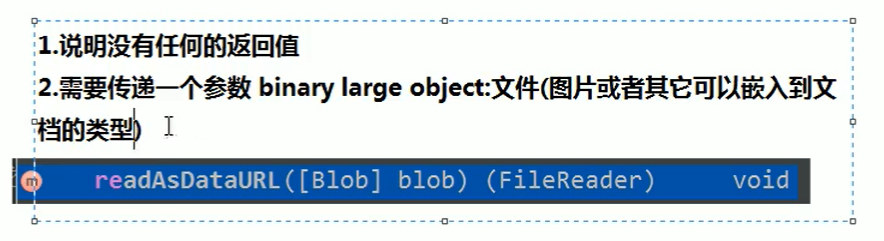

[HTML onchange 事件属性](<https://www.runoob.com/tags/ev-onchange.html>)

> 当元素改变时运行脚本。

~~~javascript
<!DOCTYPE html>
<html lang="en">
<head>
    <meta charset="UTF-8">
    <meta name="viewport" content="width=device-width, initial-scale=1.0">
    <meta http-equiv="X-UA-Compatible" content="ie=edge">
    <title>Document</title>
</head>
<body>
    <!-- 展示图片 -->
    <!-- src:指定路径(资源定位--url):src请求的是外部文件，一般来说是服务器的资源，意味着它需要
    向服务器发送请求，它占用服务器资源 -->
    <!--  -->

    <!-- 需求：即时预览
     即时：当用户选择完图片之后立刻进行预览处理
     预览：通过文件读取对象的readAsDataURL() -->
    <form action="">
        <input type="file" name="myFile" id="myFile" multiple onchange="getFileContent();"><br>

        <p>读取txt文件</p>
        <input type="file" name="myFile" id="myTxtFile" multiple onchange="getTxtFileContent();"><br>

        <p>读取任意类型文件</p>
        <input type="file" name="myFile" id="myAnyFile" multiple onchange="getAnyFileContent();"><br>
        <input type="submit">
    </form>
    
    <script>
    /* FileReader:读取文件内容
     1.readAsText()：读取文本文件(可以使用txt打开的文件)，返回文本字符串值，默认编码是UTF-8；
     2.resadAsBinaryString()：读取任意类型的文件(因为任何文件的本质都是二进制)，返回二进制字符串，这个方法不是用来读取文件展示给用户看，
     而是存储文件；例如读取文件的内容，获取二进制数据，传递给后台，后台接受了数据之后，再将数据存储；
     3.readAsDataURL()：读取文件获取一段以data开头的字符串，这段字符串的本质就是DataURL。DataURL是一种将文件嵌入到文档的方案，(这个文件一般是指图像或其他能够嵌入到文档的文件格式)
DataURL是将资源转换为base64编码的字符串形式，并且将这些内容直接存储在url中，来优化网站的加载速度和执行效率
     4.abort():中断读取  abort：流产
     
     */

     function getFileContent(){
         //console.log('222');
         // 创建文件读取对象
         var reader = new FileReader();
        // 读取文件，获取DataURL
       // 细节：没有返回值void，但是（读取完文件之后）他会将读取的结果存储在文件读取对象的result中；
         // 需要传递一个参数binary large object：文件（图片或者其他可以嵌入到文档中的类型）；
         // 文件存储在file表单元素的files属性中，他是一个数组
         var file = document.querySelector("#myFile").files[0];
         //console.log(file);
         reader.readAsDataURL(file);
         // 获取数据
         /* FileReader提供了一个完整的事件模型，用来捕获读取文件时的状态
          onabort:读取文件断开时触发
          onerror:读取错误时触发
          onload:文件读取成功完成时触发
          onloadend:读取完成时触发，无论成功还失败
          onloadstart:开始读取时触发
          onprogress:读取文件过程中持续触发 */
         reader.onload = function(){
            //console.log(reader.result);
            document.querySelector("img").src = reader.result;
         }
         
     }

     function getTxtFileContent(){
         var reader = new FileReader();

        var txtFile = document.querySelector("#myTxtFile").files[0];
        reader.readAsText(txtFile);
        reader.onload = function(){
            console.log(reader.result);
        }
     }

     function getAnyFileContent(){
         var reader = new FileReader();

        var anyFile = document.querySelector("#myAnyFile").files[0];
        reader.readAsText(anyFile);
        reader.onload = function(){
            console.log(reader.result);
        }
     }
    </script>
</body>
</html>
~~~

## 拖拽接口

HTML5 提供的元素拖拽接口，主要是通过元素拖拽事件来完成，分为两类：

* 应用于**被拖拽元素**的事件

| 事件名      | 调用时刻                         |
| ----------- | -------------------------------- |
| ondrag      | 整个拖拽过程都会调用             |
| ondragstart | 当拖拽动作开始时调用             |
| ondragleave | 当鼠标离开拖拽元素原始位置时调用 |
| ondragend   | 当拖拽结束时调用                 |

* 应用于**目标元素**的事件：

| 事件名      | 调用时刻                                   |
| ----------- | ------------------------------------------ |
| ondragenter | 当拖拽元素进入时调用                       |
| ondragover  | 当停留在目标元素上时调用                   |
| ondrop      | 当在目标元素上松开鼠标时调用(浏览器默阻止) |
| ondragleave | 当鼠标离开目标元素时调用                   |

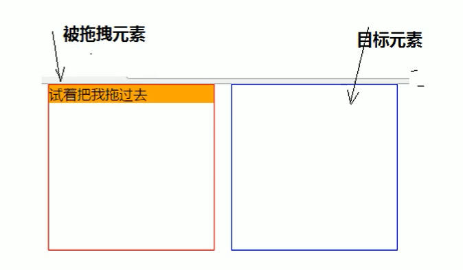

> 把元素从左边拖到右边

### 拖拽接口1.0版本——有bug版

~~~html
<!DOCTYPE html>
<html lang="en">
<head>
    <meta charset="UTF-8">
    <meta name="viewport" content="width=device-width, initial-scale=1.0">
    <meta http-equiv="X-UA-Compatible" content="ie=edge">
    <title>Document</title>
</head>

<style>
    .div1, .div2, .div3{
        width: 200px;
        height: 200px;
    }
    .div1{
        position: relative;
        border: 1px solid red;
        float: left;
    }
    .div2{
        position: relative;
        margin-left: 20px;
        float: left;
        border: 1px solid green;
    }
    .div3{
        position: relative;
        margin-left: 20px;
        float: left;
        border: 1px solid blue;
    }
    p{
        margin-top: 5px;
        background-color: orange;
        text-align: center;
    }
</style>

<body>
    <div class="div1" id="div1">
        <!-- 在html5中如果想拖拽元素，就必须为元素添加draggable="true"；图片和超链接无需添加该属性，自身支持拖拽。 -->
        <p id="pe" draggable="true">试着也把我拖过去</p>
        <p id="pe1" draggable="true">试着把我拖过去</p>
    </div>

    <div class="div2" id="div2">

    </div>

    <div class="div3" id="div3">

    </div>

    <script>
        /* 学习拖拽，主要就是学习拖拽事件
        两类事件：
        1、应用于被拖拽元素的事件：
        ondrag：真个拖拽过程都会调用 -- 持续触发
        ondragstart：当拖拽开始时调用
        ondragleave：当鼠标离开拖拽元素时调用
        ondragend：当拖拽结束时调用
        */

        var p = document.querySelector("#pe");

        p.ondragstart = function(){
            console.log("ondragstart");
        }
        p.ondrag = function(){
            console.log("ondrag");
        }
        p.ondragleave = function(){
            console.log("被拖拽元素：ondragleave");
        }
        p.ondragend = function(){
            console.log("ondragend");
        }

        /* 
        2、应用于目标元素的事件：
        ondragenter：当拖拽元素进入时调用
        ondragover：当停留在目标元素上时调用
        ondrop：当在目标元素上松开鼠标时调用(浏览器默认阻止 )
        ondragleave：当鼠标离开目标元素时调用
        */
        var div2 = document.querySelector("#div2");

        div2.ondragenter = function(){
            console.log("ondragenter");
        }
        div2.ondragover = function(e){
            console.log("ondragover");
            // 如果想要触发ondrap事件，那么必须在ondragover中阻止浏览器的默认行为
            e.preventDefault();
        }
        // 浏览器默认会组织ondrap事件：我们必须在ondragover中阻止浏览器的默认行为
        div2.ondrop = function(){
            console.log("ondrop");
            // 将被拖拽的元素添加到目标元素中
            div2.appendChild(p);
        }
        div2.ondragleave = function(){
            console.log("目标元素：ondragleave");
        }
    </script>
</body>
</html>
~~~

### 拖拽接口2.0版本——通用版

~~~html
<!DOCTYPE html>
<html lang="en">
<head>
    <meta charset="UTF-8">
    <meta name="viewport" content="width=device-width, initial-scale=1.0">
    <meta http-equiv="X-UA-Compatible" content="ie=edge">
    <title>Document</title>
</head>

<style>
    .div1, .div2, .div3{
        width: 200px;
        height: 200px;
    }
    .div1{
        position: relative;
        border: 1px solid red;
        float: left;
    }
    .div2{
        position: relative;
        margin-left: 20px;
        float: left;
        border: 1px solid green;
    }
    .div3{
        position: relative;
        margin-left: 20px;
        float: left;
        border: 1px solid blue;
    }
    p{
        margin-top: 5px;
        background-color: orange;
        text-align: center;
    }
</style>

<body>
    <div class="div1" id="div1">
        <!-- 在html5中如果想拖拽元素，就必须为元素添加draggable="true"；图片和超链接无需添加该属性，自身支持拖拽。 -->
        <p id="pe1" draggable="true">试着也把我拖过去</p>
        <p id="pe" draggable="true">试着把我拖过去</p>
    </div>

    <div class="div2" id="div2">

    </div>

    <div class="div3" id="div3">

    </div>

    <script>
        // 学习拖拽，主要就是学习拖拽事件

        //var obj = null; // 被拖拽的对象

        // 被拖拽元素

        document.ondragstart = function(e){
            // 通过事件捕获来获取当前被拖拽的子元素
            //console.log(e.target);
            // 修改透明度
            e.target.style.opacity = 0.5;
            // 修改父元素div边框粗细
            //e.target.parentNode.style.borderWidth = "5px";
						
          	// 通过全局变量保存被拖拽的，添加到目标元素中
          	//但是用全局变量有一个缺点，比较的危险
            //obj = e.target; 
          	
            // 通过事件源参数dataTransfer来实现数据的存储和获取
          	// 优点：不需要再创建全局变量了，而且存储多个值都无所谓 
            /*
            setData(format, data):
            format: 数据的类型: text/html text/url-list
            data: 数据: 一般来说是字符串值
            */
            e.dataTransfer.setData("text/html", e.target.id);
        }
        document.ondrag = function(e){
            
        }
        document.ondragleave = function(e){
            
        }
        document.ondragend = function(e){
            // 还原透明度
            e.target.style.opacity = 1;
            // 还原父元素边框
            //e.target.parentNode.style.borderWidth = "1px";
        }

        // 目标元素

        document.ondragenter = function(e){
            
        }
        document.ondragover = function(e){
            // 如果想要触发ondrap事件，那么必须在ondragover中阻止浏览器的默认行为
            e.preventDefault();
        }
        // 浏览器默认会组织ondrap事件：我们必须在ondragover中阻止浏览器的默认行为
        document.ondrop = function(e){
            // 添加元素
            //e.target.appendChild(obj); // 通过全局变量保存被拖拽的，添加到目标元素中

            // 通过dataTransfer.setData()存储的数据，只能在drop事件中获取
            var id = e.dataTransfer.getData("text/html");
            //console.log(id);
            e.target.appendChild(document.getElementById(id));
        }
        document.ondragleave = function(e){
            
        }
    </script>
</body>
</html>
~~~

## 地理定位接口

在HTML规范中，增加了获取用户地理信息的API，这样使得我们可以基于用户位置开发互联网应用，即基于位置服务（LocationBase Service）

### 获取位置的方式

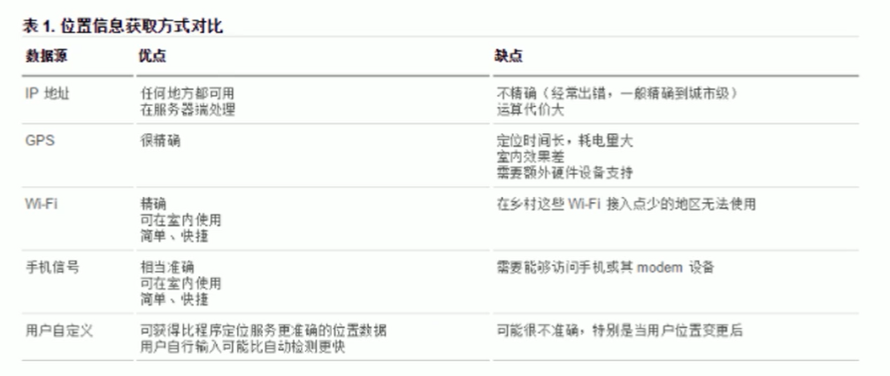

### 安全性

语义地理位置属于私密信息，所以浏览器会弹出提示框，在征得用户允许的情况下再获取位置。

### 语法

~~~html
获取当前地理信息：
navigator.geolocation.getCurrentPosition（successCallback，errorCallback，options）
~~~

~~~html
重复获取当前地理信息：
navigator.watchPosition（successCallback，errorCallback，options）
~~~

当成功获取地理信息后，会调用succssCallback，并返回一个包含位置信息的对象position。

~~~javascript
navigator.geolocation.getcurrentPosition（function（position）{
//定位成功会调用该方法
//position.coords.latitude 纬度
//position.coords.longitude 经度
//position.coords.accuracy 精度
//position.coords.altitude 海拔高度
},function(error){
//定位失败会调用该方法
//error 是错误信息
},)
~~~

### 基本用法示例

~~~html
<!DOCTYPE html>
<html lang="en">
<head>
    <meta charset="UTF-8">
    <meta name="viewport" content="width=device-width, initial-scale=1.0">
    <meta http-equiv="X-UA-Compatible" content="ie=edge">
    <title>Document</title>
    <style>
        .de{
            width: 200px;
            height: 200px;
            border: 1px solid silver;
        }
    </style>
</head>
<body>
    <div id="demo" class="de"></div>

    <script>
        var x = document.getElementById("#demo");

        function getLocation(){
            // 能力测试
            if(navigator.geolocation){
                // 1.获取地理信息成功之后的回调，2.获取地理信息失败之后得回调，3.调整获取当前地理信息得方式
                // option为一个对象，可以设置获取数据的方式，
                    // enableHighAccuracy:true/false:是否使用高精度
                    // timeout：设置超时事件，单位ms
                    // maximumAge：可以设置浏览器重新获取地理信息得事件间隔，单位是ms
                //navigator.geolocation.getCurrentPosition(success, error, option);
                navigator.geolocation.getCurrentPosition(showPosition, showError, {});
            } else {
                x.innerHTML = "Geolocation is not supported by this browser.";
            }
        }

        // 成功获取定位之后的回调
        // 弱国获取地理信息成功，会将获取到的地理信息传递给
        function showPosition(position){
            x.innerHTML = `Latitude: ${position.coords.latitude}<br />Longitude:${position.coords.longitude}`;
        }

        // 获取定位失败之后的回调
        function showError(error){
            switch(error.code){
                case error.PERMISSION_DENIED:
                    x.innerHTML = "User denied the request for Geolocation.";
                    break;
                case error.POSITION_UNAVAILABLE:
                    x.innerHTML = "Location information is unavailable.";
                    break;
                case error.TIMEOUT:
                    x.innerHTML = "The request to get user location timed out.";
                    break;
                case error.UNKNOWN_ERROR:
                    x.innerHTML = "An unknown error occurred.";
                    break;
            }
        }
        getLocation();
    </script>
</body>
</html>
~~~

### 百度地图案例

我们个人是无法获取地理信息的，我们只能通过第三方的地理位置接口（谷歌地图，高德地图，百度地图）来获取

地理位置信息。

举例：打开百度地图—>选择下面的地图开放平台—>申请称为开发者—>申请密钥—>

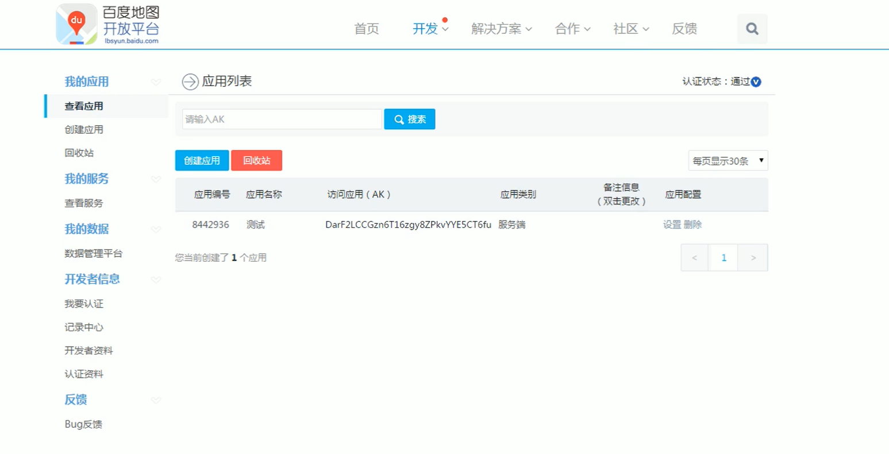

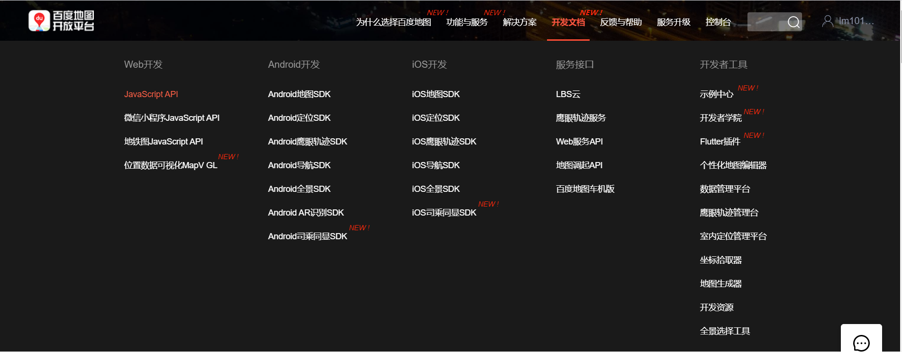

这段代码不用自己写，完全从网上摘抄得来。

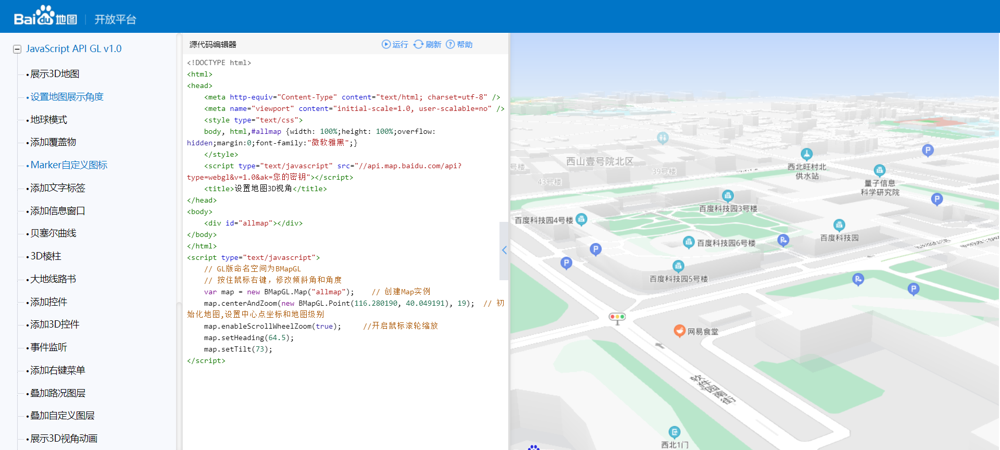

~~~html
<!DOCTYPE html>
<html>

<head>
    <meta http-equiv="Content-Type" content="text/html; charset=utf-8" />
    <meta name="viewport" content="initial-scale=1.0, user-scalable=no" />
    <style type="text/css">
        body,
        html,
        #allmap {
            width: 100%;
            height: 100%;
            overflow: hidden;
            margin: 0;
            font-family: "微软雅黑";
        }
    </style>
    <script type="text/javascript"
        src="//api.map.baidu.com/api?type=webgl&v=1.0&ak=DarF2LCCGzn6T16zgy8ZPkvYYE5CT6fu"></script>
    <title>设置地图3D视角</title>
</head>

<body>
    <div id="allmap"></div>
</body>

</html>
<script type="text/javascript">
    // GL版命名空间为BMapGL
    // 按住鼠标右键，修改倾斜角和角度
    var map = new BMapGL.Map("allmap");    // 创建Map实例
    map.centerAndZoom(new BMapGL.Point(116.280190, 40.049191), 19);  // 初始化地图,设置中心点坐标和地图级别
    map.enableScrollWheelZoom(true);     //开启鼠标滚轮缩放
    map.setHeading(64.5);
    map.setTilt(73);
</script>
~~~

> 密钥：DarF2LCCGzn6T16zgy8ZPkvYYE5CT6fu

## Web存储接口

之前用cookie存储数据，但是cookie只能存储4K大小的数据，存储量不够大。

### sessionStorage(5M且短命)

~~~javascript
<!DOCTYPE html>
<html lang="en">
  <head>
    <meta charset="UTF-8" />
    <meta name="viewport" content="width=device-width, initial-scale=1.0" />
    <meta http-equiv="X-UA-Compatible" content="ie=edge" />
    <title>Document</title>
  </head>
  <body>
    
    <p>sessionStorage的使用：存储数据到本地。存储的容量5MB左右，
        1.这个数据本质是存储在当前页面当中
        2.它的生命周期为关闭当前页面，关闭页面，数据会自动清除
        setItem(key, value):存储数据，以键值对的方式存储
        getItem(key):获取数据，通过指定名称的key获取对应的value值
        removeItem(key):删除数据，通过指定名称key删除对应的值
        clear():清空所有存储的内容</p>
    <input type="text" id="userName" /><br />
    <input type="button" value="设置数据" id="setData" />
    <input type="button" value="获取数据" id="getData" />
    <input type="button" value="删除数据" id="removeData" />

    <script>
        //存储数据
        document.querySelector("#setData").onclick = function(){
            // 获取用户名
            let name = document.querySelector("#userName").value;
            // 存储值
            window.sessionStorage.setItem("userName", name);
        }
        // 获取数据
        document.querySelector("#getData").onclick = function(){
            // 如果找不到对应名称(key)的值，那么就会返回null
            let name = window.sessionStorage.getItem("userName");
            console.log(name);
        }
        // 删除数据
        document.querySelector("#removeData").onclick = function(){
            // 在删除的时候如果key值不存在，不会报错，但是也不会删除数据
            window.sessionStorage.removeItem("userName");
        }
    </script>
  </body>
</html>
~~~

### localStorage(5M且长寿)

~~~html
<!DOCTYPE html>
<html lang="en">
<head>
    <meta charset="UTF-8">
    <meta name="viewport" content="width=device-width, initial-scale=1.0">
    <meta http-equiv="X-UA-Compatible" content="ie=edge">
    <title>Document</title>
</head>
<body>
    <p>localStorage的使用：存储数据到本地。存储的容量20MB左右，
        1.不同浏览器不能共享数据，但是在同一个浏览器的不同窗口中可以共享数据
        2.永久生效，他的数据是存储在硬盘上，并不会随着页面或浏览器的关闭而清除，想要删除必须手动删除
        setItem(key, value):存储数据，以键值对的方式存储
        getItem(key):获取数据，通过指定名称的key获取对应的value值
        removeItem(key):删除数据，通过指定名称key删除对应的值
        clear():清空所有存储的内容</p>
    <input type="text" id="userName" /><br />
    <input type="button" value="设置数据" id="setData" />
    <input type="button" value="获取数据" id="getData" />
    <input type="button" value="删除数据" id="removeData" />

    <script>
        document.querySelector("#setData").onclick= function(){
            let name = document.querySelector("#userName").value;
            // 使用localStorage存储数据
            window.localStorage.setItem("userName", name);
        }
        document.querySelector("#getData").onclick = function(){
            // 获取数据
            let name = window.localStorage.getItem("userName");
            console.log(name);
        }
        document.querySelector("#removeData").onclick = function(){
            window.localStorage.removeItem("userName");
        }
    </script>
</body>
</html>
~~~

## 页面缓存接口(不推荐使用)

[傻傻分不清的Manifest](https://segmentfault.com/a/1190000019395237)

[关于前端缓存优化，为什么没人用manifest？](<https://www.zhihu.com/question/35130316?sort=created>)

### 概念

使用HTML5，通过创建`cache manifest`文件，可以轻松地创建web应用的离线版本

### 优势

* 可配置需要缓存的资源

  > 浏览器其实有默认缓存，但是它有一个问题：我们无法选择我们想要缓存的资源，因为它要么都缓存，要么都不缓存。

* 网络无连接应用仍可用
* 本地读取缓存资源，提升访问速度，增强用户体验
* 减少请求，缓解服务器负担

### Cache Manifest基础

* 如需启用应用程序缓存，请在文档的`<html>`标签中包含manifest属性：

~~~html
<!DOCTYPE html>
<!-- manifest="应用程序缓存清单文件的路径，建议文件的扩展名为appacche,这个文件的本质就是一个文本文件" -->
<html lang="en" manifest="demo.appache">
...
</html>
~~~

* 每个指定了manifest的页面在用户对其访问时都会被缓存。如果未指定manifest属性，则页面不会被缓存（除非在manifest文件中直接指定了该页面）。
* manifest文件的建议的文件扩展名是：".appcache"。
* 注意，manifest文件需要配置正确的`MIME-type`，即`"text/cache-manifest"`。必须在web服务器上进行配置

[MIME 类型](<https://developer.mozilla.org/zh-CN/docs/Web/HTTP/Basics_of_HTTP/MIME_types>)

### Manifest文件

* 概念：manifest文件是简单的文本文件，它告知浏览器被缓存的内容（以及不缓存的内容）
* manifest文件可分为三个部分
  * CACHE MANIFEST——开始
  * CACHE在此标题下列出的文件将在首次下载后进行缓存——第一部分
  * NETWORK——在此标题下列出的文件需要与服务器的连接，且不会被缓存——第二部分
  * FALLBACK-在此标题下列出的文件规定当页面无法访问时的回退页面（比如404页面）——第三部分

* CACHE MANIFEST说明：
  * CACHE MANIFEST，放置在第一行，是必需的：

~~~html
<!DOCTYPE html>
<!-- manifest="应用程序缓存清单文件的路径，建议文件的扩展名为appacche,这个文件的本质就是一个文本文件" -->
<html lang="en" manifest="demo.appache">
<head>
    <meta charset="UTF-8">
    <meta name="viewport" content="width=device-width, initial-scale=1.0">
    <meta http-equiv="X-UA-Compatible" content="ie=edge">
    <title>Document</title>

    <style>
        img{
            width: 300px;
            display: block;
        }
    </style>
</head>
<body>
    
    
    
    
</body>
</html>
~~~
**demo.php**

~~~php
CACHE MANIFEST
# 上面一句代码必须是当前文档的第一句
# 注释写在第一行也不行
# 井号后面写注释

# 需要缓存的文件清单列表
CACHE:
# 下面就是需要缓存的清单列表
./images/1.jpg
./images/2.jpg
# 如果想要缓存所有文件可以写一个星号 *: 代表所有文件都缓存

# 配置每一次都需要重新从服务器获取的文件清单列表
NETWORK:
./images/3.jpg

# 配置如果文件无法获取则使用指定的文件进行替代
FALLBACK:
./images/4.jpg ./images/5.jpg
# 如果4.jpg找不到就用5.jpg来代替
# /: 代表所有文件都用后者替换
~~~

### Manifest的优缺点

优点

* 可以离线运行
* 可以减少资源请求
* 可以更新资源

缺点

* 更新的资源，需要二次刷新才会被页面采用
* 不支持增量更新，只有manifest发生变化，所有资源全部重新下载一次
* 缺乏足够容错机制，当清单中任意资源文件出现加载异常，都会导致整个manifest策略运行异常

全量加载和二次刷新这两个缺点就已经够严重了。
我们再来看看其优点是不是真的那么好用。

1.离线运行
对于普通页面来说，离线运行没什么用；
对于webapp来说，这个特性还不错；
对于hybird app来说，也没什么用。

2.减少资源请求
HTTP协议的Cache-Control和Expires就也能在缓存有效期内，不再发送资源请求

3.可以更新资源
manifest是文件被更新后，全量更新缓存。
而改用HTTP协议的缓存方案，只需要对资源文件引用的URL做少许变动即可刷新缓存，例如补个时间戳参数

## 多媒体接口

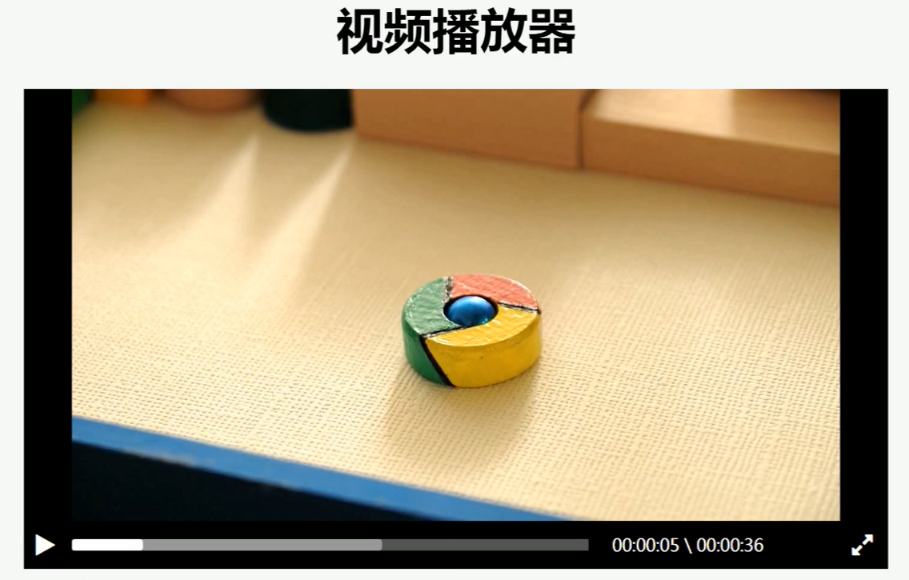

我们要做一个视频播放器窗口，要做到：

* 播放器在不同的浏览器里面效果都是一样的
  * 全屏
  * 控制播放按钮
  * 进度条(包括总时间和当前已加载的进度)
  * 播放完毕后会恢复到原始状态

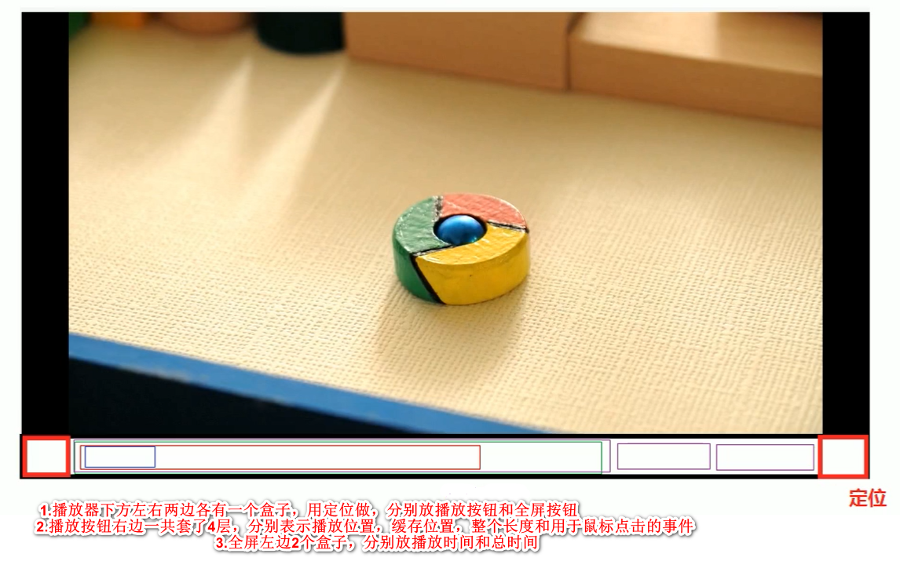


**常用方法**：load()加载、play()播放、pause()暂停

> jQuery没有提供对视频播放控件的方式，也就意味着如果要操作视频播放，必须使用原生的JS方法

**常用属性**

* currentTime视频播放的当前进度
* duration：频总时间100000/60
* paused：视频播放的状态

**常用事件**

* oncanplay：事件在用户可以开始播放视频/音频（audio/video）时触发
* ontimeupdate：通过该事件来报告当前的播放进度

~~~html
<!DOCTYPE html>
<html lang="en">

<head>
    <meta charset="UTF-8">
    <meta name="viewport" content="width=device-width, initial-scale=1.0">
    <meta http-equiv="X-UA-Compatible" content="ie=edge">
    <title>Document</title>
    <link rel="stylesheet" href="./css/css.css">
    <link rel="stylesheet" href="./css/font-awesome.css">
    <script src="./js/jquery.min.js"></script>
</head>

<body>
    <h3 class="playerTitle">视频播放器</h3>
    <div class="player">
        <video src="./mp4/chrome.mp4"></video>
        <div class="controls">
            <!-- switch是播放和暂停的切换按钮 -->
          	<!-- fa和fa-play都是字体图标 -->
            <a href="javascript:;" class="switch fa fa-play"></a>
            <!-- expand表示最大化 -->
            <a href="javascript:;" class="expand fa fa-expand"></a>
            <!-- progress表示进度条总长 -->
            <div class="progress">
                <!-- bar用来响应事件，在屏幕上是看不到的，是透明的-->
                <div class="bar"></div>
                <!-- loaded表示已加载 -->
                <div class="loaded"></div>
                <!--elapse表示已播放-->
                <div class="elapse"></div>
            </div>
            <div class="time">
                <span class="currentTime">00:00:00</span>
                /
                <span class="totalTime">00:00:00</span>
            </div>
        </div>
    </div>

    <script>
        /*
        1.常用方法：load()加载，play()播放，pause()暂停
        JQ没有提操作视频播放控件的方式，也就是一位置如果要操作视频播放，必须使用原生的js方法-dom元素
        2.常用属性：currentTime:视频播放的当前进度，duration:视频的总时间100000/60，paused：视频播放的状态
        3.常用的事件：oncanplay:事件在用户可以开始播放视频/音频时触发，ontimeupdate：通过该事件来报告当前的播放进度，onended：播放完时触发-重置
        */

        // 播放器的接口方法必须使用原生js来操作，使用jq的话获取到的jq对象需要转换为DOM对象
        // 通过jQuery来实现功能
        $(function () {
            // 1.获取播放器
            let video = $("video")[0];

            // 2.添加播放暂停(字体图标)
            $(".switch").click(function () {
                // 视频播放暂停切换，播放暂停按钮图标之前的切换
                if (video.paused) {
                    video.play(); // 播放
                    // 移除暂停样式，添加播放样式
                    // fa-play:播放，fa-pause：暂停
                } else {
                    video.pause(); // 暂停
                    // 移除播放样式，添加暂停样式
                }
                // 设置标签样式，通过jq的toggleClass在样式之间进行切换
                $(this).toggleClass("fa-play fa-pause");
            });

            // 3.实现全屏操作(字体图标)
            $(".expand").click(function () {
                // 全屏，不同的浏览器需要添加不同的前缀>能力测试
                if (video.requestFullscreen) {
                    video.requestFullscreen();
                } else if (video.webkitRequestFullScreen) {
                    video.webkitRequestFullScreen();
                } else if (video.mozRequestFullScreen) {
                    video.mozRequestFullScreen();
                } else if (video.msRequestFullScreen) {
                    video.msRequestFullScreen();
                }
            });

            // 通过中时长，计算出时分秒
            function getRealTime(time) {
                // Math.floor()地板函数求除法结果的整数部分
                let hour = Math.floor(time / 3600);
                hour = hour < 10 ? "0" + hour : hour; // 补零

                let minute = Math.floor(time % 3600 / 60);
                minute = minute < 10 ? "0" + minute : minute;

                let second = Math.floor(time % 60);
                second = second < 10 ? "0" + second : second;

                return `${hour}:${minute}:${second}`;
            }

            // 4.实现播放的业务逻辑，当视频文件可以播放时触发下面的事件
            video.oncanplay = function () {
                // 通过setTimeout模拟网络请求延迟
                setTimeout(function () {
                    // 4.1.将视频文件设置为显示
                    video.style.display = "block";

                    // 4.2.获取当前视频文件总时长(以秒作为单位，同时获取了小数值)，计算出时分秒
                    let total = video.duration;
                    // console.log(total);
                    // 4.3.计算时分秒 
                    // let hour = Math.floor(total / 3600);
                    // hour = hour < 10 ? "0" + hour : hour; // 补零

                    // let minute = Math.floor(total % 3600 / 60);
                    // minute = minute < 10 ? "0" + minute : minute;

                    // let second = Math.floor(total % 60);
                    // second = second < 10 ? "0" + second : second;

                    //console.log(hour+":"+minute+":"+second);

                    // 4.4.将时间结果展示在指定的dom元素中
                    $(".totalTime").html(getRealTime(total));
                }, 2000);
            };

            // 5.实现播放过程中的业务逻辑，当视频播放时会触发ontimeupdate事件,如果修改currentTime值，也会触发该事件，
            // 只要currentTime值变换就会触发此事件
            video.ontimeupdate = function () {
                // 5.1.获取当前的播放时间
                let current = video.currentTime;
                //console.log(current);

                // 5.2.计算时分秒
                // 5.3 将时间显示在指定的dom元素中
                $(".currentTime").html(getRealTime(current));

                // 5.4 设置当前播放进度条样式
                let percent = current / video.duration * 100 + "%";
                $(".elapse").css("width", percent);
            }

            // 6.实现视频跳播
            $(".bar").click(function (e) {
                // 6.1.获取当前鼠标相对于父元素的left值--偏移值
                let offset = e.offsetX;
                // 6.2.计算偏移值相对父元素总宽度的比例
                let percent = offset / $(this).width();
                //console.log(percent);
                // 6.3.计算此位置对应的视频进度值
                let current = percent * video.duration;
                // console.log(current);
                // 6.4.设置当前视频的currentTime
                video.currentTime = current;
            });

            // 7.播放完毕之后重置播放器状态
            video.onended = function () {
                video.currentTime = 0;
                $(".switch").removeClass("fa-pause").addClass("fa-play");
            }
        });
    </script>
</body>

</html>
~~~

**css.css**

>font-awesome.css相关信息：Font Awesome 4.4.0 by @davegandy - http://fontawesome.io - @fontawesome，我就不抄了。

# CSS3简介

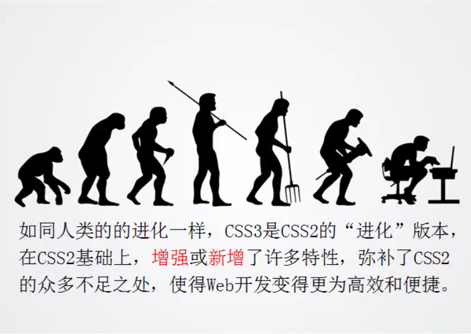

## CSS3现状

* 浏览器支持程度差，需要添加**私有前缀**
* **移动端**支持优于PC端
* 不断改进中：CSS >> JS
* 应用相对广泛

## 如何对待

* 坚持**渐进增强**原则
* 考虑用户群体
* 遵照产品的方案
* 听**BOSS**的

## 准备工作

**统一环境**

* Chrome ver 46+
* Firefox ver 42+
* PhotoShop CS6（建议）
* 其它浏览器暂不考虑

## 如何使用手册

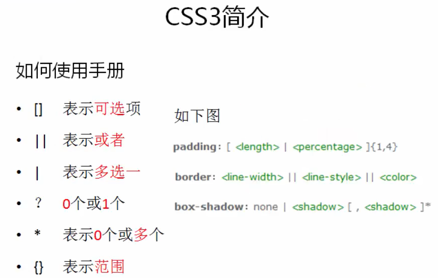

# 选择器

CSS3新增了许多**灵活**查找元素的方法，极大的提高了查找元素的效率和**精准度**。

CSS3选择器与jQuery中所提供的**绝大部分**选择器兼容。

* 属性选择器
* 伪类选择器
* 伪元素选择器

## 属性选择器

* `E[attr]`：查找指定的**拥有attr属性**的E标签

  ```css
  li[style] {
        text-decoration: underline;
   }
  ```

* `E[attr = val]`：查找拥有指定的attr属性并且属性值为value的E标签；`"="`为严格匹配

  ```css
  li[class="red"] {
        font-size: 30px;
  }
  ```

* `E[attr *= val]`：查找拥有指定的attr属性，并且属性值中包含(可以是任意位置)value的E标签

  ```css
  li[class*="red"] {
        background-color: #ccc;
   }
  ```

* `E[attr \^= value]`：查找拥有指定的attr属性，并且属性值**以value开头**的E标签

  ```css
  li[class^="red"]{
        font-size: 30px;
  }
  ```

* `E[attr$=value]`：查找拥有指定的attr属性，并且属性值**以value结束**的E标签

  ```css
  li[class$="blue"]{
        font-size: 30px;
  }
  ```

  > 上面5个是类似于正则的写法：^表示以什么开头，$表示以什么结尾。
  >
  > 类选择器、属性选择器、伪类选择器，权重为10

  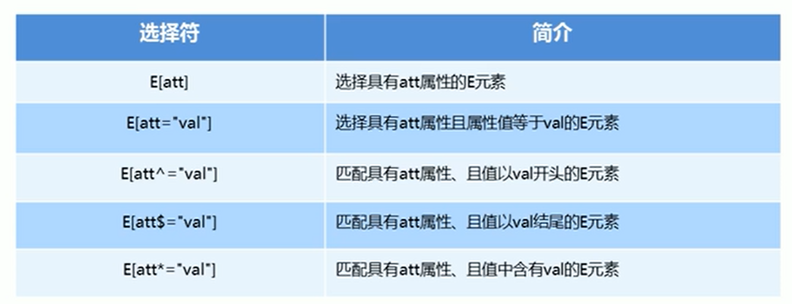

```html
<!DOCTYPE html>
<html lang="en">
<head>
    <meta charset="UTF-8">
    <meta name="viewport" content="width=device-width, initial-scale=1.0">
    <meta http-equiv="X-UA-Compatible" content="ie=edge">
    <title>Document</title>
    <style>
        .red{
            color: red;
        }
        .blue{
            color: blue;
        }
        .darkred{
            color: darkred;
        }
        .blueviolet{
            color: blueviolet;
        }

        /* 属性选择器，属性是相对于标签而言的；所谓的属性选择器就是根据指定名称的属性的值来查找元素 */
        /* 1.E[attr]：查找指定的拥有attr属性的E标签 */
        /* 查找拥有style属性的li标签 */
        li[style]{
            text-decoration: underline;
        }

        /* 2.E[attr=value]：查找拥有指定的attr属性并且属性值为value的E标签；"="为严格匹配 */
        /* 查找拥有class属性，并且class值为red的li标签 */
        li[class="red"]{
            /* font-size: 30px; */
        }

        /* 3.E[attr*=value]：查找拥有指定的attr属性，并且属性值中包含(可以时任意位置)value的E标签 */
        /* 查找拥有class标签，且class值中含有red的li标签 */
        li[class*="red"]{
            /* font-size: 30px; */
        }

        /* 4.E[attr^=value]：查找拥有指定的attr属性，并且属性值以value开头的E标签 */
        li[class^="red"]{
            font-size: 30px;
        }

        /* 4.E[attr$=value]：查找拥有指定的attr属性，并且属性值以value结束的E标签 */
        li[class$="blue"]{
            font-size: 30px;
        }
    </style>
</head>
<body>
    <p style="">看看能不能也添加样式</p>
    <ol>
        <li class="red" style="">河南再次发生矿难，死伤人数超过100人</li>
        <li class="blue">禽流感再次发生蔓延，温家宝指示</li>
        <li class="darkred" style="">南方农作物减产，绝收面积上亩</li>
        <li class="blue">猪流感害惨农民</li>
        <li class="red">跟党走，听党指挥</li>
        <li class="blueviolet">哈哈哈哈哈哈哈！</li>
    </ol>
</body>
</html>
```

## 结构伪类选择器

* 之前学习的伪类选择器： `a:link;  a:visited; a:hover; a:active;`
* 以某元素**相对于其父元素**或**兄弟元素**的位置来获取无素的**结构伪类**

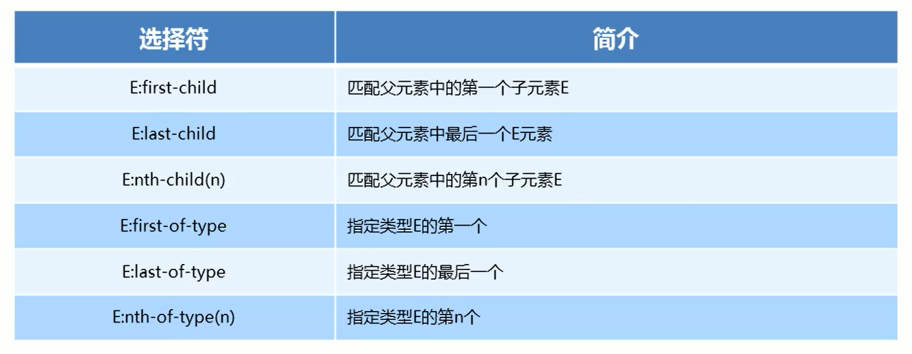

### 相对于父元素的结构伪类

**案例1：**

~~~html
<!DOCTYPE html>
<html lang="en">

<head>
    <meta charset="UTF-8">
    <meta name="viewport" content="width=device-width, initial-scale=1.0">
    <meta http-equiv="X-UA-Compatible" content="ie=edge">
    <title>Document</title>
    <style>
        ul li:first-child {
            background-color: pink;
        }
        
        ul li:last-child {
            background-color: deeppink;
        }
        /* nth-child(n)  我们要第几个，n就是几  比如我们选第8个， 我们直接写 8就可以了 */
        
        ul li:nth-child(8) {
            background-color: lightpink;
        }
    </style>
</head>

<body>
    <ul>
        <li>1</li>
        <li>2</li>
        <li>3</li>
        <li>4</li>
        <li>5</li>
        <li>6</li>
        <li>7</li>
        <li>8</li>
        <li>9</li>
        <li>10</li>
    </ul>
</body>

</html>
~~~

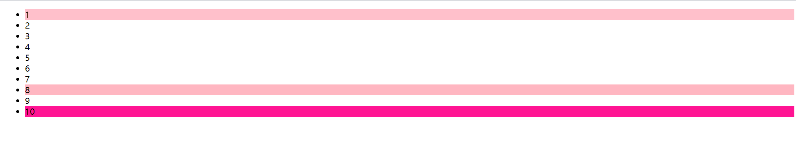

> 里面有10个li ,我选择其中第几个li,跟结构顺序有关系，所以叫**结构**伪类选择器。

#### nth-child(n)

* n可以是**数字、关键字和公式**
* n如果是数字，就是选择第几个
* 常见的关键词有even偶数，odd奇数
* 常见的公式如下（如果n是公式，则**从0开始**计算）
* 但是第0个元素或者超出了元素的个数会被忽略
* nth-child(n)在选择的时候，**只选择里面的第几个孩子**，它并不管里面的孩子是否属于同一种类型

~~~html
<!DOCTYPE html>
<html lang="en">

<head>
    <meta charset="UTF-8">
    <meta name="viewport" content="width=device-width, initial-scale=1.0">
    <meta http-equiv="X-UA-Compatible" content="ie=edge">
    <title>Document</title>
    <style>
        /* n 可是关键词  even 是偶数  odd 是奇数 */
        /* ul li:nth-child(even) {
            background-color: pink;
        }
        
        ul li:nth-child(odd) {
            background-color: hotpink;
        } */
        /* n 是公式  但是 n 从0开始计算 */
        /* ul li:nth-child(n) {
            background-color: pink;
        } */
        /* 2n 偶数  类似于 even */
        /* ul li:nth-child(2n) {
            background-color: pink;
        } */
        /* 2n + 1  类似于 odd */
        /* ul li:nth-child(2n+1) {
            background-color: skyblue;
        } */
        /* 5n  选择第  0  5  10  15 ... */
        /* ul li:nth-child(5n) {
            background-color: pink;
        } */
        /* n+5 就是从第5个开始往后面选择 包含第5个 */
        /* ul li:nth-child(n+5) {
            background-color: pink;
        } */
        /* -n + 5 就是选择前面5个  */
        
        ul li:nth-child(-n+5) {
            background-color: pink;
        }
    </style>
</head>

<body>
    <ul>
        <li>1</li>
        <li>2</li>
        <li>3</li>
        <li>4</li>
        <li>5</li>
        <li>6</li>
        <li>7</li>
        <li>8</li>
        <li>9</li>
        <li>10</li>
    </ul>
</body>
~~~

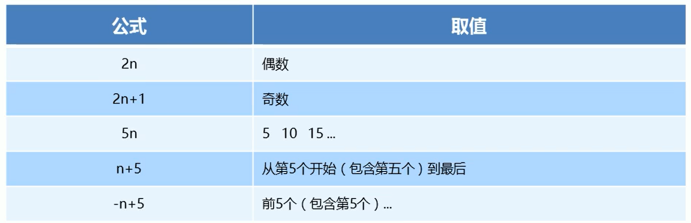

#### nth-of-type

~~~html
<!DOCTYPE html>
<html lang="en">

<head>
    <meta charset="UTF-8">
    <meta name="viewport" content="width=device-width, initial-scale=1.0">
    <meta http-equiv="X-UA-Compatible" content="ie=edge">
    <title>Document</title>
    <style>
        /* div:nth-child(1) {
             background-color: pink;
        }
        
        	div:nth-child(2) {
             background-color: purple;
        } */
      
        /* div span:nth-child(1) {
      			// 这个选不到，这个意思是既要选第一个孩子(是p标签，还要是span,没有满足的)
            background-color: pink;
        } */
        
        div span:nth-child(2) {
          	/*只有这样写才能拿到*/
            background-color: pink;
        }
      	div:nth-child(2) {
            background-color: yellow;
        }
      
        /* 总结：E:nth-child(n)  选择 父元素E里面的第n个孩子,它不管里面的孩子是否同一种类型 */
      
        /* of-type 选择指定类型的元素 */
       div :first-of-type {
            background-color: green;
        }
        
        div span:first-of-type {
          	/*选择div里面指定的第一个span元素*/
            background-color: purple;
        }
        
        div span:last-of-type {
            background-color: skyblue;
        }
        
        div span:nth-of-type(2) {
            background-color: red;
        }
    </style>
</head>

<body>
    <div>
        <p>我是一个屁</p>
        <span>我是span</span>
        <span>我是span</span>
        <span>我是span</span>
    </div>
    <!-- ul 里面我们只允许放li  所以 nth-child 和 nth-of-type 就一样了 -->
    <ul>
        <li></li>
        <li></li>
        <li></li>
        <li></li>
        <li></li>
        <li></li>
        <li></li>
        <li></li>
        <li></li>
        <li></li>
    </ul>
</body>
</html>
~~~

**案例2：**

~~~html
<!DOCTYPE html>
<html lang="en">

<head>
    <meta charset="UTF-8">
    <meta name="viewport" content="width=device-width, initial-scale=1.0">
    <meta http-equiv="X-UA-Compatible" content="ie=edge">
    <title>Document</title>
    <style>
        * {
            padding: 0;
            margin: 0;
        }

        ul {
            width: 700px;
            height: 500px;
            margin: 0 auto;
            margin-top: 100px;
            list-style: none;
            border-left: 1px solid #ccc;
            border-top: 1px solid #ccc;
        }

        ul>li {
            float: left;
            width: 100px;
            height: 100px;
            box-sizing: border-box;
            line-height: 100px;
            text-align: center;
            background-color: #fff;
            border-right: 1px solid #ccc;
            border-bottom: 1px solid #ccc;
        }

        /* 相对于父元素的结构伪类 */
        /* E:first-child：查找E元素的父级元素中的第一个E元素 */
        /* 有一个重大缺陷：在查找的时候并不会限制查找的元素的类型，
        只是从第一个开始找，如果不是要找的类型，则此方法无效*/
        /* 下面是查找li的父元素(ul)中的第一个子元素(ul中的第一个li，其他元素则不行，失效)
        1.相对于当前指定元素的父元素
        2.查找的类型必须是指定的类型
         */
        li:first-child {
            background-color: yellow;
        }

        /* E:last-child:查找E元素的父元素的最后一个指定的元素 */
        /* 有一个重大缺陷：在查找的时候并不会限制查找的元素的类型，
        只是从第一个开始找，如果不是要找的类型，则此方法无效*/
        li:last-child {
            background-color: skyblue;
        }

        /* 查找的时候限制类型 first-of-type*/
        /* 1.也是相对于父元素 */
        /* 在查找的时候只会查找满足类型条件的元素，会过滤掉其他类型的元素，更加的实用 */
        li:first-of-type {
            color: red;
        }

        li:last-of-type {
            color: orange;
        }

        /* 指定索引位置 nth:child(从1开始的索引||关键字||表达式)*/
        li:nth-child(4) {
            background-color: lightblue;
        }

        /* 偶数个元素添加背景 */
        li:nth-child(even) {
            /* 缺陷：无法过滤元素 */
            /* background-color: orange; */
        }

        /* 奇数个元素添加背景 */
        li:nth-child(odd) {
            /* 缺陷：无法过滤元素 */
            /* background-color: pink; */
        }

        /* 升级版 */
        li:nth-of-type(even) {
            /* 优点：可以过滤元素 */
            background-color: blue;
        }

        /* 升级版 */
        li:nth-of-type(odd) {
            /* 优点：可以过滤元素 */
            background-color: green;
        }

        /* 想为前面5个元素添加样式 */
        li:nth-of-type(-n+5) {
            background-color: black;
        }

        li:nth-last-of-type(-n+5) {
            background-color: grey;
        }

        /* 空值：没有任何的内容，连空格都没有*/
        li:empty {
            background-color: yellow;
        }
    </style>
</head>

<body>
    <ul>
        <!-- <span>是红色吗</span> -->
        <div></div>
        <li>1</li>
        <li>2</li>
        <li>3</li>
        <li>4</li>
        <li>5</li>
        <li>6</li>
        <li>7</li>
        <li>8</li>
        <li>9</li>
        <li>10</li>
        <li>11</li>
        <li>12</li>
        <li>13</li>
        <li>14</li>
        <li></li>
        <li>16</li>
        <li>17</li>
        <li>18</li>
        <li>19</li>
        <li>20</li>
        <li>21</li>
        <li>22</li>
        <li>23</li>
        <li>24</li>
        <li>25</li>
        <li>26</li>
        <li>27</li>
        <li>28</li>
        <li>29</li>
        <li>30</li>
        <li>31</li>
        <li>32</li>
        <li>33</li>
        <li>34</li>
        <li>35</li>
        <!-- <div></div> -->
    </ul>
</body>

</html>
~~~

### 兄弟元素的结构伪类

```html
<!DOCTYPE html>
<html lang="en">
<head>
    <meta charset="UTF-8">
    <meta name="viewport" content="width=device-width, initial-scale=1.0">
    <meta http-equiv="X-UA-Compatible" content="ie=edge">
    <title>Document</title>

    <style>
        .first{
            color: red;
        }

        /* 兄弟伪类
        +：获取当前元素的相邻的满足条件的元素(2个条件：相邻且同类)
        ~：获取当前元素的满足条件的兄弟元素(1个条件：只要是兄弟就行)
         */

     	/* 查找添加了.first样式的标签的相邻的li元素；*/
      /* 两个条件：一是必须相邻，二是必须是指定类型的元素 */
        .first + li{
            color: blue;
        }

        /* 查找添加了.first样式的所有的元素的所有兄弟li元素 */
        .first ~ li{
            color: green;
        }
    </style>
</head>
<body>
    <ul>
        <li class="first">前端与移动开发</li>
      	/*span和li不是同一个类型，所以不会变成蓝色*/
        <span>能不能变成蓝色？</span>
        <li>HTML5</li>
        <li>CSS</li>
        <li>JavaScript</li>
    </ul>
</body>
</html>
```

### 知识点：伪类target的使用

~~~html
<!DOCTYPE html>
<html lang="en">
<head>
    <meta charset="UTF-8">
    <meta name="viewport" content="width=device-width, initial-scale=1.0">
    <meta http-equiv="X-UA-Compatible" content="ie=edge">
	<title>Document</title>
	<style>
		body {
			margin: 0;
			padding: 0;
			background-color: #F7F7F7;
		}

		.content {
			width: 960px;
			margin: 0 auto;
			padding: 30px;
		}

		p {
			font-size: 18px;
			line-height: 1.75;
		}

		ul {
			position: fixed;
			top: 100px;
			left: 30px;
			margin: 0;
			padding: 0;
		}

		/* E:target 为描点目标元素添加样式，放目标元素被触发为当前锚点元素时触发此伪类样式 */
		h2:target{
			color: red;
		}
	</style>

</head>
<body>
    <ul class="nav">
		<!-- href添加锚点 -->
		<li><a href="#title1">CSS (层叠样式表)</a></li>
		<li><a href="#title2">实例</a></li>
		<li><a href="#title3">发展历史</a></li>
		<li><a href="#title4">使用方法</a></li>
		<li><a href="#title5">布局特点</a></li>
		<li><a href="#title6">创建编辑</a></li>
	</ul>
	<div class="content">
		<h2 id="title1">CSS (层叠样式表)</h2>
		<p>层叠样式表是一种用来表现HTML（标准通用标记语言的一个应用）或XML（标准通用标记语言的一个子集）等文件样式的计算机语言。</p>
		<p>CSS目前最新版本为CSS3，是能够真正做到网页表现与内容分离的一种样式设计语言。相对于传统HTML的表现而言，CSS能够对网页中的对象的位置排版进行像素级的精确控制，支持几乎所有的字体字号样式，拥有对网页对象和模型样式编辑的能力，并能够进行初步交互设计，是目前基于文本展示最优秀的表现设计语言。CSS能够根据不同使用者的理解能力，简化或者优化写法，针对各类人群，有较强的易读性。</p>
		<h2 id="title2">实例</h2>
		<p>如果你要在HTML元素中设置CSS样式，你需要在元素中设置"id" 和 "class"选择器。[1] d 选择器可以为标有特定 id 的 HTML 元素指定特定的样式。HTML元素以id属性来设置id选择器,CSS 中 id 选择器以 "#" 来定义。以下的样式规则应用于元素属性 id="para1":</p>
		<p>class 选择器用于描述一组元素的样式，class选择器有别于id选择器，class可以在多个元素中使用。class 选择器在HTML中以class属性表示, 在 CSS 中，类选择器以一个点"."号显示：在以下的例子中，所有拥有 center 类的 HTML 元素均为居中。</p>
		<h2 id="title3">发展历史</h2>
		<p>作为一项W3C推荐，CSS1发布于 1996年12月17 日。1999 年1月11日，此推荐被重新修订。</p>
		<p>作为一项 W3C 推荐，CSS2发布于 1999年1月11日。CSS2添加了对媒介（打印机和听觉设备）和可下载字体的支持。</p>
		<h2 id="title4">使用方法</h2>
		<p>有三种方法可以在站点网页上使用样式表：外联式Linking（也叫外部样式）：将网页链接到外部样式表。嵌入式Embedding（也叫内页样式）：在网页上创建嵌入的样式表。内联式Inline（也叫行内样式）：应用内嵌样式到各个网页元素。其中，优先级：内联式 > 嵌入式 > 外联式</p>
		<p>当样式需要被应用到很多页面的时候，外部样式表将是理想的选择。使用外部样式表，你就可以通过更改一个文件来改变整个站点的外观。</p>
		<p>当特殊的样式需要应用到个别元素时，就可以使用内联样式。 使用内联样式的方法是在相关的标签中使用样式属性。样式属性可以包含任何 CSS 属性。以下实例显示出如何改变段落的颜色和左外边距。</p>
		<h2 id="title5">布局特点</h2>
		<p>对于蜘蛛在爬行一个网站的页面时，若是有太多的垃圾代码，会使搜索蜘蛛对其产生不友好、不信任感，同时蜘蛛的爬行速度也会因此而减缓，对于网站SEO而言，可谓一大忌。就如传统的用table页面，对此我们就需要对网站进行代码优化，而这便需要动用CSS+div了，下面便来谈谈使用CSS+div进行代码优化的一些益处。</p>
		<p>网站使用DIV+CSS布局使代码很是精简，相信大多朋友也都略有所闻，css文件可以在网站的任意一个页面进行调用，而若是使用table表格修改部分页面却是显得很麻烦。要是一个门户网站的话，需手动改很多页面，而且看着那些表格也会感觉很乱也很浪费时间，但是使用css+div布局只需修改css文件中的一个代码即可。</p>
		<p>采用div-css布局的网站对于搜索引擎很是友好，因此其避免了Table嵌套层次过多而无法被搜索引擎抓取的问题，而且简洁、结构化的代码更加有利于突出重点和适合搜索引擎抓取。</p>
		<h2 id="title6">创建编辑</h2>
		<p>创建和编辑css更加常用的是AdobeDreamweaver系列软件，可视化编辑更利于web工程师快速的创建和编辑css，新版本CS5.0、CS5.5、CS6.0、CC，包含Adobe BrowserLab，用于针对多种浏览器测试css的兼容性。Adobe Dreamweaver是一个css创建和编辑必不可少的利器！</p>
		<p>FrontPage2000 包含有能用来为站点创建外部样式表的模板。可以用空白模板或已包含样式的模板来创建（例如 Arcs）。当保存样式表时， FrontPage 会以 . css 作为文件扩展名。要编辑样式表，请双击文件夹列表中的样式表。</p>
	</div>
</body>
</html>
~~~

## 伪元素选择器

### before/after伪元素选择器

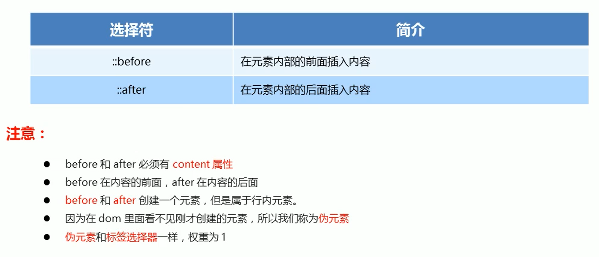

> 注意1：哪怕不设置内容，也必须要有"content"属性。
>
> 注意2：E:after，E:before在旧版本里是伪类，在新版本里是伪元素，新版本下E:after，E:before会被自动识别为E:after.E:before，按伪元素来对待，这样做的目的是用来做兼容处理。
>
> 注意3：IE6，IE7与IE8（怪异模式Quirks mode）不支持此伪元素(`::before`和`::after`)。
>
> 注意4：**伪元素不会在DOM树中生成**，但是**它的功能完全等价于一个DOM元素**。

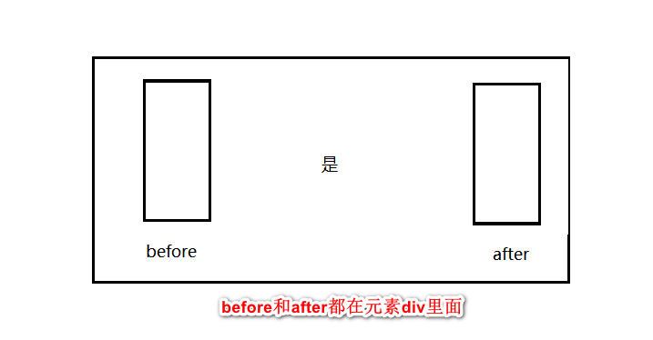

~~~html
<!DOCTYPE html>
<html lang="en">

<head>
    <meta charset="UTF-8">
    <meta name="viewport" content="width=device-width, initial-scale=1.0">
    <meta http-equiv="X-UA-Compatible" content="ie=edge">
    <title>Document</title>
    <style>
        div {
            width: 300px;
            height: 300px;
            border: 1px solid #000;
        }
        
        div::before {
            content: "我";
            display: inline-block;
            width: 100px;
            height: 100px;
            background-color: pink;
        }
        
        div::after {
            content: "小猪佩奇";
            display: inline-block;
            width: 100px;
            height: 100px;
            background-color: pink;
        }
    </style>
</head>

<body>
    <div>是</div>
</body>

</html>
~~~

> **伪元素不是真正意义上的元素**，但是确实具有一些元素的特性：有大小，背景色等等。

~~~html
<!DOCTYPE html>
<html lang="en">
<head>
    <meta charset="UTF-8">
    <meta name="viewport" content="width=device-width, initial-scale=1.0">
    <meta http-equiv="X-UA-Compatible" content="ie=edge">
    <title>Document</title>
    <style>
        html{
            margin: 0;
        }
        body{
            padding: 200px;
        }
        div:nth-of-type(1){
            width: 300px;
            height: 200px;
            background-color: red;
            float: left;
        }
        div:nth-of-type(2){
            width: 100px;
            height: 200px;
            background-color: blue;
            float: left;
            position: relative;
        }
        div:nth-of-type(2)::before{
            /* 必须添加content属性，否则后期不可见 */
            content: "";
            /* 默认为行级元素，如果像设置宽高，就必须转换为块级元素 */
            position: absolute;
            width: 20px;
            height: 20px;
            background-color: white;
            border-radius: 10px;
            left: -10px;
            top: -10px;
        }
        div:nth-of-type(2)::after{
            /* 必须添加content属性，否则后期不可见 */
            content: "";
            /* 默认为行级元素，如果像设置宽高，就必须转换为块级元素 */
            position: absolute;
            width: 20px;
            height: 20px;
            background-color: white;
            border-radius: 10px;
            left: -10px;
            bottom: -10px;
        }
    </style>
</head>
<body>
    <div></div>
    <div></div>
</body>
</html>
~~~

### 其他伪元素选择器

> `first-letter、first-line、selection`

~~~html
<!DOCTYPE html>
<html lang="en">
<head>
    <meta charset="UTF-8">
    <meta name="viewport" content="width=device-width, initial-scale=1.0">
    <meta http-equiv="X-UA-Compatible" content="ie=edge">
    <title>Document</title>
    <style>
        /* 通过EE::first-letter实现首字下沉 */
        p::first-letter{
            color: red;
            font-size: 30px;
            float: left; /* 文本环绕 */
        }
        /* 获取第一行内容，如果设置了first-letter，那么无法同时设置它的样式 */
        p::first-line{
            text-decoration: underline;
        }
        /* 设置当前选中内容的样式 */
        p::selection{
            background-color: pink;
            /* 只能设置显示的样式，而不能设置内容大小 */
            /* font-size: 30px; */
            color: green;
        }
    </style>
</head>
<body>
    <p>
        外媒报道称，今年iPhone 11系列全球的首批订单量预计在800万台左右，相比去年2018款iPhone至少减少了10%。其中，iPhone 11占订单总数的60%，iPhone 11 Pro占10%，iPhone 11 Pro Max占30%。
        <br>
        据报道，目前来看，富士康承接了全部的iPhone 11 Pro和iPhone 11 Pro Max的订单。而iPhone 11则由和硕、纬创、富士康三家共同代工。值得一提的是，iPhone 11的备货比例也达到了65%。
    </p>
</body>
</html>
~~~

# 颜色模式

[CSS学习笔记：RGBA与HSLA](https://blog.csdn.net/crystal6918/article/details/53889557)

[opacity、transparent以及rgba的区别](https://blog.csdn.net/qq_39207948/article/details/83098253)

在CSS3中可以使用**RGBA和HSLA两种色彩模式**，二者均可以用来在设置颜色的同时也指定其透明度。

## 颜色模式之RGBA

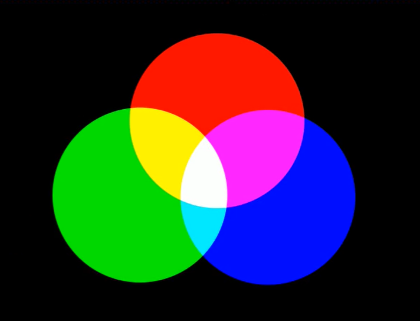

三原色光模式（RGB color model），又称RGB颜色模型或红绿蓝颜色模型，是一种加色模型，将红（Red）、绿（Green）、蓝（Blue）三原色的色光以不同的比例相加，以合成产生各种色彩光。

RGBA指的是“红色、绿色、蓝色、Alpha透明度（Red-Green-Blue-Alpha）

* 前三个值取值范围从0-255或0%~100%

* A 取值范围为 0-1（0代表完全透明，1代表完全不透明）

RGBA无法直观看出是什么颜色。并且如果想要对颜色进行调整也无法简单做到。

## 颜色模式之HSLA

[一张图让开发人员理解色相、亮度、饱和度](https://hanks.pub/2016/03/26/color-board/)

[色调](https://baike.baidu.com/item/%E8%89%B2%E8%B0%83)

HSLA指的是“**色调、饱和度、亮度、Alpha透明度**”。

此色彩模式与HSL相同，只是在HSL模式上新增了Alpha透明度。

**色调(色相)** ：就是颜色的主色调，比如红、绿、蓝。

**饱和度** ：就是颜色的鲜艳程度，饱和度越大，看起来越鲜艳。

**亮度** ：就是颜色的明暗，就好比你再明亮的光线下看一个红色的纸板很昏暗的光线下看红色纸板那种感觉。

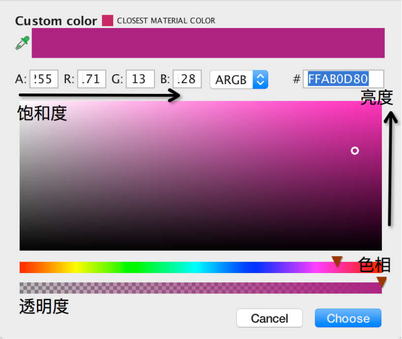

* H：Hue（色调，色相），取值为：0-360，过渡为：（红橙黄绿青蓝紫红）。0（或360）表示红色，120表示绿色，240表示蓝色，也可取其他数值来指定颜色。
* S：Saturation（饱和度），取值为：0.0%-100.0%
* Lightness（亮度），取值为：0.0%-100.0%，50%是平衡值
* A：Alpha透明度。取值范围0~1（0代表完全透明，1代表完全不透明）

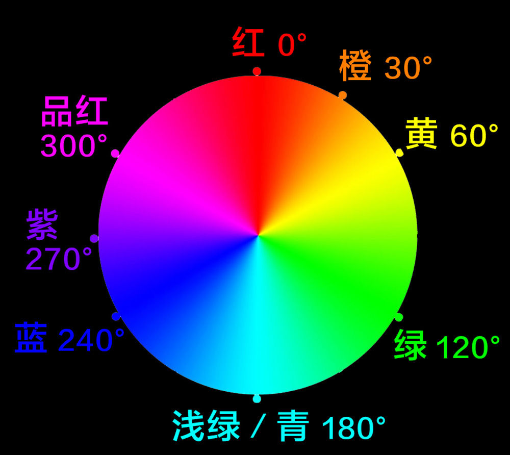

> 按顺时针，红绿蓝(RGB)，过渡为红橙黄绿青蓝紫红，360度形成了一个色环。

### 具体示例

~~~html
<!DOCTYPE html>
<html lang="en">
<head>
    <meta charset="UTF-8">
    <meta name="viewport" content="width=device-width, initial-scale=1.0">
    <meta http-equiv="X-UA-Compatible" content="ie=edge">
    <title>Document</title>
    <style>
        *{
            padding: 0;
            margin: 0;
        }
        div{
            width: 200px;
            height: 200px;
            border: 1px solid #ccc;
            /* 1.通过使用预设了值的颜色 */
            /* background-color: red; */
          
            /* 2.通过颜色拾取器 */
            /* background-color: #c9ffa6; */
          
            /* 3.通过RGB */
            /* background-color: rgb(255, 0, 0); */
          
            /* 4.通过HSL
            h(0-360) 饱和度(0%-100%) 明度(0%-100%)明度默认是50%,一般建议保留50的值
             */
            background-color: hsl(60, 100%, 50%);
        }
    </style>
</head>
<body>
    <div>这是内容</div>
</body>
</html>
~~~

## 透明度(opacity)的使用

> 透明通道α的作用：可以在设置父元素透明度的同时不影响子元素的透明度。

~~~html
<!DOCTYPE html>
<html lang="en">
<head>
    <meta charset="UTF-8">
    <meta name="viewport" content="width=device-width, initial-scale=1.0">
    <meta http-equiv="X-UA-Compatible" content="ie=edge">
    <title>Document</title>
    <style>
        *{
            padding: 0;
            margin: 0;
        }
        div{
            width: 200px;
            height: 200px;
            /* background-color: blue; */
            /* color: white; */
            margin: 100px auto;
            /* 通过opacity设置透明度 */
            /* 如果设置父容器，那么子元素也会透明 */
            /* opacity: 0.5; */
          	/* 怎么样才能背景色透明，内容不透明呢？就只能用RGBA或HSLA中的A了 */
          	/* 因为这个A不会影响到子元素*/

            /* 通过H5提供的hsla、rgba设置颜色的同时设置透明度 */
            /* background-color: rgba(255, 0, 0, 0.5); */
            background-color: hsla(170, 100%, 50%, 0.5);
        }
        span{
            position: absolute;
            left: 870px;
            top: 100px;
        }
    </style>
</head>
<body>
    <div></div>
    <span>这是内容</span>
</body>
</html>
~~~

关于透明度的补充说明：

* opacity只能针对整个盒子设置透明度，子盒子及内容会继承父盒子的透明度
* transparent不可调节透明度，始终完全透明
* 使用rgba来控制颜色，相对opacity，不具有继承性

# 文本阴影(text-shadow)

[text-shadow](https://developer.mozilla.org/zh-CN/docs/Web/CSS/text-shadow)

`text-shadow`还没有出现时，大家在网页设计中阴影一般都是用photoshop做成图片，现在有了CSS3可以直接使用`text-shadow`属性来指定阴影。这个属性可以有两个作用，产生阴影和模糊主体。这样在不使用图片时能给文字增加质感。

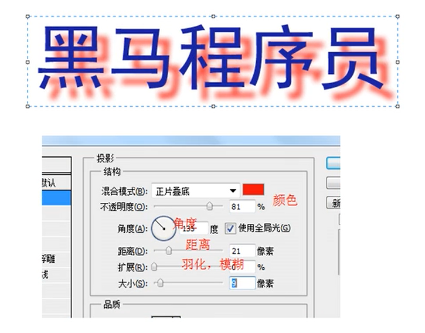

## 语法

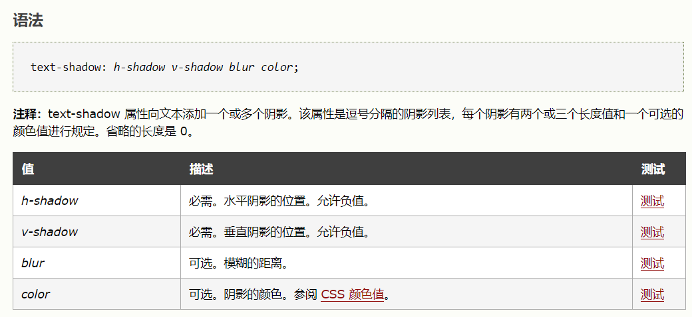

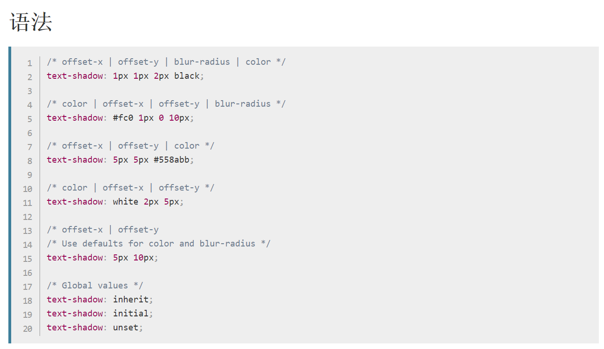

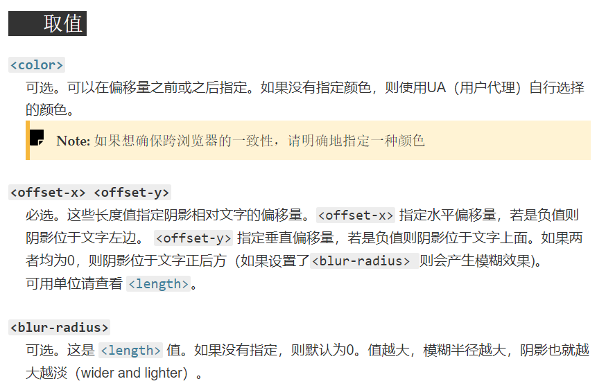

> blur不能是负值！！！

## 具体示例

~~~html
<!DOCTYPE html>
<html lang="en">
<head>
    <meta charset="UTF-8">
    <meta name="viewport" content="width=device-width, initial-scale=1.0">
    <meta http-equiv="X-UA-Compatible" content="ie=edge">
    <title>Document</title>
    <style>
        *{
            padding: 0;
            margin: 0;
        }
        .demo{
            width: 600px;
            padding: 30px;
            background-color: #666;
            margin: 20px auto;
            text-align: center;
            font: bold 80px/100% "微软雅黑";
            color: #fff;
        }
        /* 添加阴影 text-show: offsetX offsetY blur color */
        .demo1{
            text-shadow: -2px -2px 5px red;
        }
        .demo2{
            text-shadow: 0px 0px 30px white; 
        }
        /* 多层阴影 */
      	/* 阴影和阴影之间用逗号分隔*/
        .demo3{
            text-shadow: 0px 0px 30px white, 0px 0px 50px red, 0px 0px 70px white;
        }
        .demo4{
          	/* 黑色字体，白光阴影*/
            text-shadow: 0px 1px 0px white;
            color: black;
        }
        /* 浮雕立体效果 */
      	/* 使用多层阴影，一层比一层暗，就会产生立体感，会有浮雕效果了*/
        .demo5{
            text-shadow: -1px -1px 0px #eee, -2px -2px 0px #ddd, -3px -3px 0px #ccc;
            color: #fff;
        }
        .demo6{
            text-shadow: 0px -1px 0px #eee, 0px -2px 0px #ddd, 0px -3px 0px #ccc;
            color: #fff;
        }
        /* 模糊 */
        .demo7{
            color: transparent;
            text-shadow: 0px 0px 8px hsla(30, 100%, 50%, 1);
        }
    </style>
</head>
<body>
    <div class="demo demo1">中华人民共和国</div>
    <div class="demo demo2">中华人民共和国</div>
    <div class="demo demo3">中华人民共和国</div>
    <div class="demo demo4">中华人民共和国</div>
    <div class="demo demo5">中华人民共和国</div>
    <div class="demo demo6">中华人民共和国</div>
    <div class="demo demo7">中华人民共和国</div>
</body>
</html>
~~~

> 阴影不仅仅可以加一个，可以加多个！！

# CSS3盒模型

> 在我们文档中，每个元素都被描绘为一个矩形盒子。在我们去做渲染的时候，就会去判定这个盒子的大小，盒子的大小是通过宽高来设置的。

1.在默认情况下，CSS设置的盒子宽度仅仅是**内容区的宽度**，而非盒子的宽度。同样，高度类似。真正盒子的宽度（在页面呈现出来的宽度）和高度，需要加上一些其它的属性。例如：

* 盒子的宽度 = padding + border + width
* 盒子的高度 = padding + border + height

默认计算盒子的宽高有一些问题，首先它不直观，还要自己算。其次，盒子的宽高还可能会根据自己添加paddding,border后进行变化，可能会导致网页中其他元素的错位。

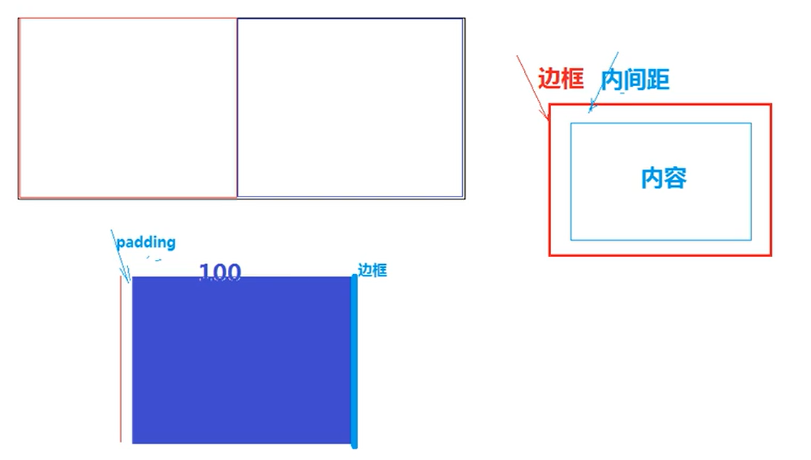

2.CSS3中可以通过`box-sizing`来指定盒模型，即可指定为`content-box`，`border-box`，这样我们计算盒子大小的方式就发生了改变。

* content-box：对象的实际宽度等于设置的width值和border，padding之和（这个用的少）
* border-box：对象的实际宽度就等于设置的width值，即使定义有border和padding也不会改变对象的实际宽度（我们主要加这个属性）

## 具体示例

~~~css
<!DOCTYPE html>
<html lang="en">
<head>
    <meta charset="UTF-8">
    <meta name="viewport" content="width=device-width, initial-scale=1.0">
    <meta http-equiv="X-UA-Compatible" content="ie=edge">
    <title>Document</title>
    <style>
        .box{
            width: 400px;
            height: 200px;
            background-color: #ccc;
            margin: 100px auto;
        }
        .left{
            /* 默认情况下，width设置的宽度仅仅是内容的宽度 */
          	/* 你加了一个padding-left值，那么盒子宽度就变成202px了*/
          	/* 你再加上一个border-right值，那么盒子宽度就变成205px了*/
            width: 200px;
          	/*添加了border-box以后，这个宽度200px就自动包含了padding和border了*/
          	/*如果你加了padding和border,则会压缩内容的宽度*/
            height: 100%;
            background-color: red;
            float: left;
            /* 添加内间距 */
         		/* 设置内边距后里面的字就不会紧挨着盒子了*/ 
            padding-left: 2px;
            /* 添加右边框 */
            border-right: 3px solid green;
            
            /* 设置盒模型 */
            /* content-box:设置的width属性值，仅仅是内容的宽度，盒子的最终宽高值需要在w/h的基础上							 加上border和padding
          
            		border-box:设置的width属性值，是盒子最终的宽度，包含了border和padding和内容。
            		如果添加了padding和border，那么真正放置内容的区域会减小但是稳固了页面结构
             */
            box-sizing: border-box;
        }
        .right{
            width: 200px;
            height: 100%;
            background-color: blue;
            float: left;
        }

        .items{
            width: 100%;
            text-align: center;
            margin-top: 100px;
        }
        .item{
            width: 316px;
            height: 170px;
            display: inline-block;
            margin: 0 10px;
            overflow: hidden;
            /* 添加盒模型 */
            box-sizing: border-box;
        }
        .b1{
            background-image: url("./images/1.jpg");
        }
        .b2{
            background-image: url("./images/2.jpg");
        }
        .b3{
            background-image: url("./images/3.jpg");
        }
        .item:hover{
            border: 2px solid red;
          	/*网页中元素不是单独的存在，它周围还有其他的元素*/
          	/*你不能因为你加了边框，把别的元素往后挤，造成抖动的效果*/
        }
    </style>
</head>
<body>
    <div class="box">
        <div class="left">
            在默认情况下，CSS设置的盒子宽度仅仅是内容去的宽度，而非盒子的宽度。同样，高度类似。真整的						盒子的宽度(在页面呈现出来的宽度)和高度，
            需要加上一些其他的属性。
        </div>
        <div class="right"></div>
    </div>

    <div class="items">
        <div class="item b1"></div>
        <div class="item b2"></div>
        <div class="item b3"></div>
    </div>
</body>
</html>
~~~

# 边框圆角

## 添加边框圆角原始方式

通过在PS上手动画一个边框圆角，然后再通过切图的方式，将画的边框圆角切成三部分：左，中，右，然后再进行引入。

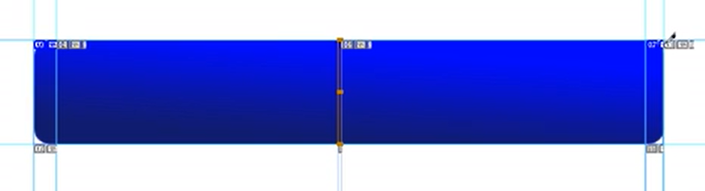

> 这样做的话，如果后面我要改颜色，圆角角度，那还要重新画图进行替换，很麻烦。

### 具体示例

~~~html
<!DOCTYPE html>
<html lang="en">

<head>
    <meta charset="UTF-8">
    <title>Document</title>
    <style>
        * {
            margin: 0;
            padding: 0;
            margin: 100px auto;
        }

        .nav {
            height: 65px;
        }

        .left {
            width: 14px;
            height: 100%;
            background: url(images/left.gif) no-repeat;
            float: left;
        }

        .center {
            width: 800px;
            height: 100%;
            background: url(images/center.gif);
            /* center是要做平铺的 */
            float: left;
        }

        .right {
            width: 11px;
            height: 100%;
            background: url(images/right.gif) no-repeat;
            float: left;
        }
    </style>
</head>

<body>
   <div class="nav">
       <div class="left"></div>
       <div class="center"></div>
       <div class="right"></div>
   </div>
</body>
</html>
~~~

## 使用`border-radius`添加边框圆角

[border-radius](https://developer.mozilla.org/zh-CN/docs/Web/CSS/border-radius)

[CSS3 border-radius 属性](https://blog.csdn.net/qq_38436939/article/details/83830427)

[秋月何时了，CSS3 border-radius知多少？](https://www.zhangxinxu.com/wordpress/2015/11/css3-border-radius-tips/)

[【CSS世界】01 border-radius深入了解](https://segmentfault.com/a/1190000021927287)

[【CSS】圆角（border-radius）](https://www.jianshu.com/p/ac2629d45713)

`border-radius`属性允许你设置元素的外边框圆角。当使用一个半径时确定一个圆形，当使用两个半径时确定一个椭圆。这个(椭)圆与边框的交集形成圆角效果。

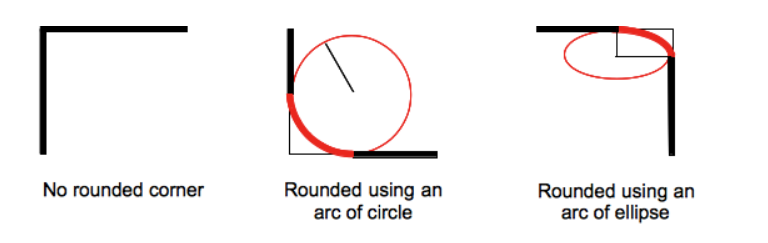

该属性是一个 **简写属性**，是为了将这四个属性 `border-top-left-radius`、`border-top-right-radius`、`border-bottom-right-radius`，和 `border-bottom-left-radius `简写为一个属性。

> 通用形式是`border-上下-左右-radius:`

即使元素没有边框，圆角也可以用到 background 上面，具体效果受 `background-clip `影响。

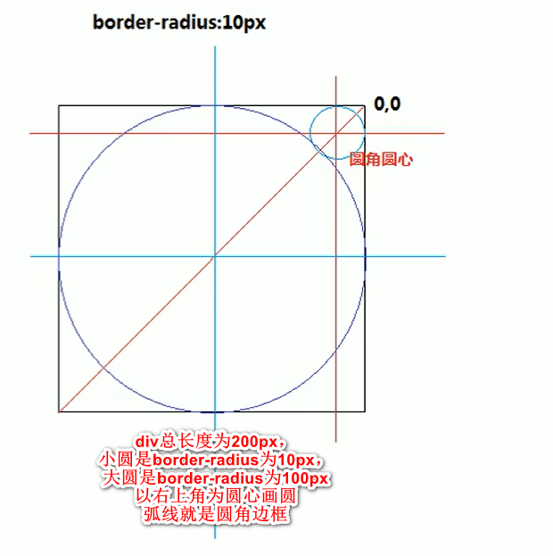

> 图形为正方形时

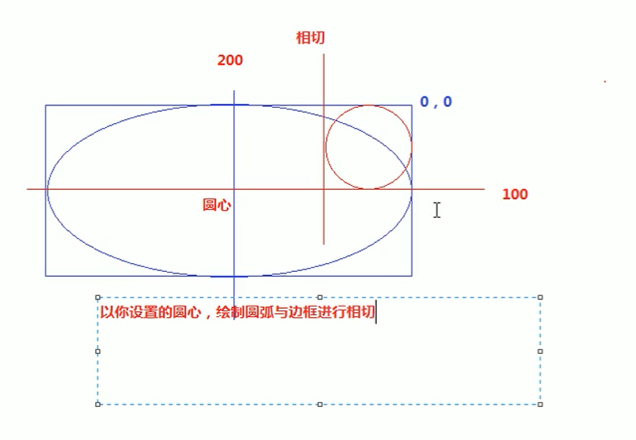

> 图形为长方形时如果画椭圆：至少2个参数

### 具体示例

~~~html
<!DOCTYPE html>
<html lang="en">

<head>
    <meta charset="UTF-8">
    <title>Document</title>
    <style>
        * {
            margin: 0;
            padding: 0;
        }

        div {
            width: 200px;
            /* height: 200px; */
            height: 100px;
            /* 宽高一样是正方形，不一样则是长方形了 */
            background-color: pink;
            margin: 100px auto;
            /* 添加边框圆角 */
            /* 可以加值 */
            /* 1.设置总的一个值：四个角的圆角值都是一样 */
            /* border-radius: 50px; */

            /* 也可以给4个圆角分别单独添加边框 */
            /* 2.设置单独一个值 */
            /* border-top-right-radius: 100px; */

            /* 3.设置单独两个值  第一个值控制左上/右下,第二个值控制右上/左下*/
            /* border-radius: 10px 30px; */

            /* 4.设置单独三个值 第一个值控制左上，第二个值控制右上/左下，第三个值控制右下*/
            /* border-radius: 80px 40px 60px; */

            /* 5.设置单独四个值 顺时针方向：左上，右上，右下，左下*/
            /* border-radius: 10px 30px 60px 100px; */

            /*长方形时，要想画一个椭圆，起码给2个参数 */
            /* 添加斜杠是用来设置当前个不同方向的半径值  水平x方向/垂直y方向*/
            /* border-radius: 100px/50px; */

            /* 添加某个角点的圆角 */
            /* 这样做很繁琐 */
            /* border-radius: 0px 50px 0px 0px; */
            /* border-上下-左右-radius: */
            /* border-top-right-radius: 50px; */

            /* 设置某个角点的2个方向上的不同圆角 */
            /* 设置右上角这个圆角，水平方向偏移100px,垂直方向偏移50px */
            /* border-top-right-radius: 100px 50px; */
            /* border-top-left-radius: 100px 50px;
            border-top-right-radius: 100px 40px;
            border-bottom-right-radius: 100px 30px;
            border-bottom-left-radius: 100px 20px; */
            /* 但是这样写很繁琐，可以进行简写 */
            /* 分别是水平方向的：左上,右上,右下,左下/垂直方向的左上,右上,右下,左下 */
            border-radius: 100px 80px 60px 40px/20px 40px 60px 80px;
        }
    </style>
</head>

<body>
    <div></div>
</body>
</html>
~~~

# 安卓机器人案例

> 此案例主要为了复习前面的伪元素和圆角的添加。

~~~html
<!DOCTYPE html>
<html lang="en">

<head>
    <meta charset="UTF-8">
    <title>Document</title>
    <style>
        * {
            padding: 0;
            margin: 0;
        }

        body {
            background-color: #ccc;
        }

        .content {
            width: 500px;
            height: 500px;
            border: 1px solid red;
            margin: 50px auto;
        }

        .an_header {
            width: 250px;
            height: 125px;
            /* 为了让头部是个半圆，设置高度是宽度的一半 */
            background-color: darkgreen;
            margin: 10px auto;
            /* 添加圆角 */
            border-radius: 125px 125px 0px 0px;
            position: relative;
        }

        /* 使用伪元素来添加眼睛 */
        .an_header::before,
        .an_header::after {
            /* 1.一定要设置content属性 */
            content: "";
            /* 2.如果需要设置宽度，就应该转换其为块级元素，因为它默认是行内元素 */
            /* 转成块级元素的三种方式：float display position */
            /* 我们在这里选position,因为要把眼睛放在特定的位置 */
            position: absolute;
            /* 把眼睛放到正确的位置 */
            bottom: 40px;
            width: 20px;
            height: 20px;
            border-radius: 10px;
            background-color: #fff;
        }

        .an_header::before {
            left: 70px;
        }

        .an_header::after {
            right: 70px;
        }

        /*.an_header::before和.an_header::after 里面代码很多一样的，冗余，于是可以代码提取处理*/

        .an_body {
            width: 250px;
            height: 250px;
            background-color: darkgreen;
            margin: 0 auto;
            /* 圆角只有左下和右下才有 */
            border-radius: 0px 0px 20px 20px;
            position: relative;
        }

        .an_body::before,
        .an_body::after {
            content: "";
            position: absolute;
            background-color: darkgreen;
            width: 30px;
            height: 180px;
            border-radius: 10px;
            top: 20px;
        }

        .an_body::before {
            left: -40px;
        }

        .an_body::after {
            right: -40px;
        }

        .an_footer {
            width: 250px;
            height: 100px;
            position: relative;
            margin: 0 auto;
            /* background-color: pink; */
        }

        .an_footer::before,
        .an_footer::after {
            content: "";
            position: absolute;
            background-color: darkgreen;
            width: 30px;
            height: 90px;
            border-radius: 0px 0px 10px 10px;
        }

        .an_footer::before {
            left: 50px;
        }

        .an_footer::after {
            right: 50px;
        }
    </style>
</head>

<body>
    <div class="content">
        <div class="an_header"></div>
        <div class="an_body"></div>
        <div class="an_footer"></div>
    </div>
</body>
</html>
~~~

# 渐变样式

[使用 CSS 渐变](https://developer.mozilla.org/zh-CN/docs/Web/Guide/CSS/Using_CSS_gradients)

[CSS3渐变](https://www.w3cschool.cn/css_series/css_series-bsi124qn.html)

> 渐变指的就是颜色渐渐的变化。一般背景颜色不用单一色，用渐变色比较多。

渐变是CSS3当中比较丰富多彩的一个特性，通过渐变我们可以实现许多炫丽的效果，有效的减少图片的使用数量，并且具有很强的适应性和可扩展性。可分为线性渐变、径向渐变、重复渐变等。

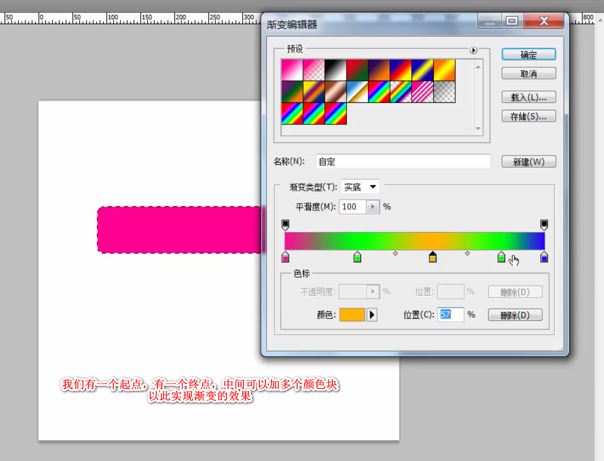

## 线性渐变

[linear-gradient](https://developer.mozilla.org/zh-CN/docs/Web/CSS/linear-gradient)

线性渐变(`inear-gradient`)：指**沿着某条直线**，**朝一个方向产生渐变效果**。这条直线可以从左侧到右侧、从右侧到左右、从顶部到底部、从底部到顶部、从左上角到右下角等等，简单来说**渐变方向是一条直线，此直线可以沿着任意轴**。

CSS `linear-gradient()` 函数用于创建一个表示两种或多种颜色线性渐变的图片。其结果属于`<gradient>`数据类型，是一种特别的`<image>`数据类型。

### 语法

~~~css
background-image: linear-gradient(direction, color-start, ..., color-end);
~~~

即，`linear-gradient`包含如下几个基本参数，

* 第一个参数为**渐变方向**
* 第二个参数为**渐变起点的颜色**
* 第三个参数为**渐变终点的颜色**

同时，你还可以在渐变起点和渐变终点中间插入任意多个色标来达到多重颜色渐变的目的。

#### 渐变方向

关于**渐变方向**，我们可以设置为一些常用关键词，比如top、right、bottom、left，以及这四个基本关键词的任意相邻方向的**两两组合**，比如`top left`、`top right`等等。

渐变方向除了可以设置为常用关键词之外，我们还可以设置一个角度值，即`0deg`～`360deg`。这个角度值也可以为负值。正负值的区别在于渐变方向相对于默认值的方向是不同的。

**⚠️注意**，此参数可以省略。当渐变方向省略时，W3C规定的渐变方向默认值为**top**，即渐变方向**从上到下**。

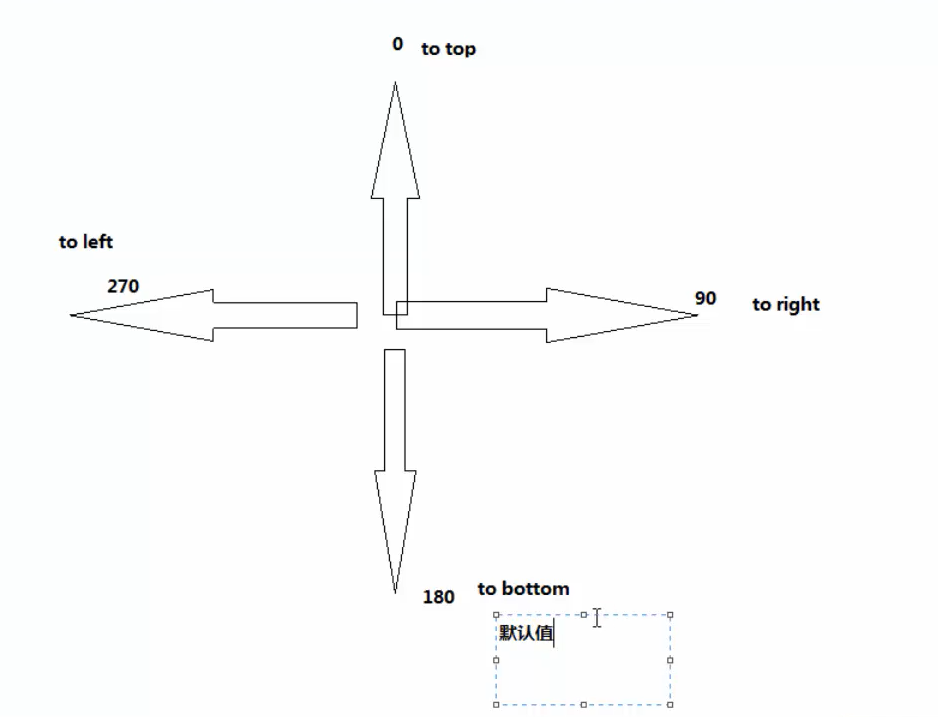

### 具体示例

~~~html
<!DOCTYPE html>
<html lang="en">

<head>
    <meta charset="UTF-8">
    <title>Document</title>
    <style>
        div {
            width: 300px;
            height: 300px;
            /* 添加渐变：既然是渐变，那就不是一个单一色了。 */
            /* 产生的是图像，所以需要使用background来添加，而不是background-color来添加 */
            /*linear-gradient(方向，开始颜色 位置,颜色2，位置，颜色3，位置...);*/
            /* 方向：
             * to top 0deg
             * to right :90deg
             * to bottom：180deg(默认值)
             * to left:270deg
             */
            /* background: linear-gradient(red, blue); */
            /* background: linear-gradient(to right, red, blue); */
            background: linear-gradient(to right, red 0%, red 50%, blue 50%, blue 100%);
            /* div宽度是300px,我让红色从0到50%(300px*0.5),我让蓝色从50%到100%，这样的过渡效果就很清晰了 */
        }
    </style>
</head>

<body>
    <div></div>
</body>
</html>
~~~

## 径向渐变

[10个demo示例学会CSS3 radial-gradient径向渐变](https://www.zhangxinxu.com/wordpress/2017/11/css3-radial-gradient-syntax-example/)

[radial-gradient()](https://developer.mozilla.org/zh-CN/docs/Web/CSS/radial-gradient)

径向渐变(`radial-gradient`)：指从一个中心点开始沿着四周产生渐变效果。

#### 语法

~~~css
radial-gradient([[<shape>||<size>])[at <position>]?,|at <position>,]?<color-stop>[,<color-stop>]+)
~~~

> `||`表示或者，`|`表示多选一,`?`表示0个或1个

#### 取值

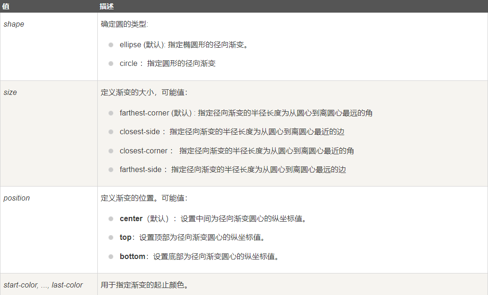

* `<position>`确定圆心的位置。如果提供2个参数，第一个表示横坐标，第二个表示纵坐标；如果只提供一个，第二值默认为50%，即center

*  shape：渐变的形状，ellipse表示椭圆形，circle表示圆形。默认为ellipse，如果元素形状为正方形的元素，则ellipse和circle显示一样

* size：渐变的大小，即渐变到哪里停止，它有四个值。

  * closest-side：最近边
  * farthest-side：最远边
  * closest-corner：最近角
  * farthest-corner：最远角

  > 默认是最远的角farthest-corner

* `<color>`：指定颜色。Rgba hsla

#### 径向渐变组成

径向渐变(Radial gradients)由其**中心点**、**边缘形状轮廓及位置**、**色值结束点**（color stops）定义而成。  

径向渐变的中心点至边缘形状以及其延伸的部分，由连续缩放的若干同心轮廓组成，这个轮廓由设定的边缘形状决定。

色值结束点用于设定**虚拟渐变射线**（virtual gradient ray）的变化方式，由中心点水平变化至右侧（如图）。色值结束点由百分比设定时，则是相对于终点为渐变射线与边缘形状相交点的渐变半径，渐变半径的终点位置即为100%。每个轮廓均为纯色，颜色由渐变射线上相应横切点所定义的颜色决定。

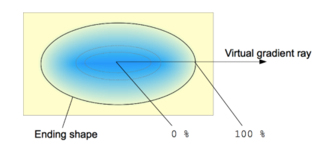

#### 具体示例

~~~html
<!DOCTYPE html>
<html lang="en">

<head>
    <meta charset="UTF-8">
    <meta name="viewport" content="width=device-width, initial-scale=1.0">
    <meta http-equiv="X-UA-Compatible" content="ie=edge">
    <title>Document</title>
    <style>
        div {
            width: 300px;
            /* height: 300px; */
            height: 200px;
            /* 如果宽高值不一样，会默认适配ellipse */
            /* 添加径向渐变，产生的也是图像，所以也是用background来做 */
            /* background: radial-gradient(red, blue); */
            /* 最里面是红色，最外面是蓝色，中间部分是渐变色 */
            /* 语法：radial-gradient(形状 大小 坐标)：
             * 形状shape:circle(产生正方形的渐变色，不会适配) ellipse(适配当前的形状)
             * 如果是正方形的容器，circle和ellipse效果一样
             * 如果宽高不一样，默认效果切换到ellipse
             * at position:坐标，默认在正中心。可以赋值坐标，也可以赋值关键字(left,center,right,top,bottom等)
             * 
             * 大小size:* closest-side：最近边,farthest-side：最远边,
             * closest-corner：最近角,farthest-corner：最远角
             * 
             * 
             */

            /* background: radial-gradient(ellipse, red, blue); */
            /* background: radial-gradient(circle, red, blue); */
            /* background: radial-gradient(at 50px 50px, red, blue); */
            /* background: radial-gradient(at left top, red, blue); */
            /* background: radial-gradient(circle at 50px 50px, red, blue);s */
            /* background: radial-gradient(circle at 50px 50px, red, blue); */
            /* background: radial-gradient(circle closest-side at 50px 50px, red, blue); */
            /* 这个是最近的边 */
            /* background: radial-gradient(circle closest-corner at 50px 50px, red, blue); */
            /* 这个是最近的角 */
            /* background: radial-gradient(circle farthest-side at 50px 50px, red, blue); */
            /* 这个是最远的边 */
            /* 这个坐标参照元素的左上角 */

            /* 设置颜色的位置 */
            background: radial-gradient(red, red 50%, blue 50%, blue);

        }
    </style>
</head>

<body>
    <div></div>
</body>
</html>
~~~

## 重复渐变

### 具体示例

~~~html
<!DOCTYPE html>
<html lang="en">

<head>
    <meta charset="UTF-8">
    <meta name="viewport" content="width=device-width, initial-scale=1.0">
    <meta http-equiv="X-UA-Compatible" content="ie=edge">
    <title>Document</title>
    <style>
        body {
            background-color: #ccc;
        }


        .one {
            width: 300px;
            height: 300px;
            background: radial-gradient(#fff 0%, #fff 10%,
                    #000 10%, #000 20%,
                    #fff 20%, #fff 30%,
                    #000 30%, #000 40%,
                    #fff 40%, #fff 50%,
                    #000 50%, #000 60%);
            /* 这样写可以，但是很麻烦 */

        }

        .two {
            width: 300px;
            height: 300px;
            margin-top: 10px;
            background: repeating-radial-gradient(circle closest-side at center center, #fff 0%, #fff 10%, #000 10%, #000 20%);
        }

        .three {
            width: 300px;
            height: 800px;
            margin-top: 10px;
            background: repeating-linear-gradient(45deg, #fff 0%, #fff 10%, #000 10%, #000 20%);
        }
    </style>
</head>

<body>
    <div class="one"></div>
    <div class="two"></div>
    <div class="three"></div>
</body>
</html>
~~~

(50-58集先略过)

# Transform

## Transform2D转换(translate)

通过CSS3 transform转换，我们能够对元素进行**移动**、**缩放**、**旋转**、**斜切**等操作。

`2D 移动：translate()`：使用translate可以把元素从原来的位置移动，移动**参照元素左上角原点**。

* ~~~css
  transform: translate(tx) | translate(tx, ty)
  ~~~

* tx是一个代表X轴(横坐标)移动的向量长度，当其值为正值时，元素向X轴右方向移动，反之既反；
* ty是一个代表Y轴(纵坐标)移动的向量长度，当其值为正值时，元素向Y轴下方向移动，反之既反；
* 也可以单独设置`translateX(tx)`,`translateY(ty)`;
* **若参数是百分比，则参照元素本身**;

~~~html
<!DOCTYPE html>
<html lang="en">

<head>
    <meta charset="UTF-8">
    <meta name="viewport" content="width=device-width, initial-scale=1.0">
    <title>Document</title>
    <style>
        * {
            margin: 0;
            padding: 0;
        }

        div {
            width: 100px;
            height: 100px;
            background-color: pink;
            /* 再添加一个过渡效果:CSS样式名称 耗时*/
            /* 过渡效果做完之后是会还原的 */
            /* 但是即使没有过渡效果，还是会还原 */
            transition: transform 2s;
            margin-left: 200px;
        }

        div:active {
            /* 使用transform来实现元素的移动 */
            /* a.移动是参照元素的左上角 */
            /* b.执行完毕之后会恢复到原始状态 */
            /* 如果只有一个参数，则代表x方向 */
            /* 如果有2个参数，则代表x和y方向 */
            /* transform: translate(100px); */
            /* transform: translate(0px，200px); */
            /* transform: translateX(300px); */
            transform: translateY(400px);
        }
    </style>
</head>

<body>
    <div></div>
</body>

</html>
~~~


