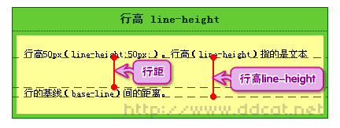
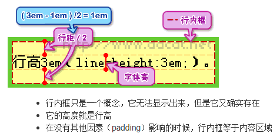
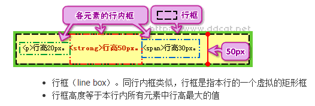
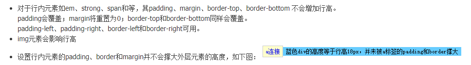

> 现在是2024年1月9日10:49:22，时间过得可真快啊，三年时间如过门之风，转瞬即逝。我继续在此基础上添加些东西吧，我总觉得我的CSS学的不得劲啊。

# 概念1：`line-height`

[CSS行高——line-height](https://www.cnblogs.com/dolphinX/p/3236686.html)

[css行高line-height的一些深入理解及应用](https://www.zhangxinxu.com/wordpress/2009/11/css%e8%a1%8c%e9%ab%98line-height%e7%9a%84%e4%b8%80%e4%ba%9b%e6%b7%b1%e5%85%a5%e7%90%86%e8%a7%a3%e5%8f%8a%e5%ba%94%e7%94%a8/)

[深入理解CSS中的行高](https://www.cnblogs.com/rainman/archive/2011/08/05/2128068.html)

## 基线、底线、顶线

##  行距、行高

## 内容区

## 行内框

## 行框

## 元素对行高的影响

# 概念2：background

### background-size: cover;作用

"background-size: cover;" 是一个CSS属性值，用于控制背景图片的大小。具体来说，这个属性值的作用是将背景图片放大或缩小，以完全覆盖其容器的背景区域，同时保持图片的长宽比不变。

当使用 "background-size: cover;" 时，**背景图片会被等比例缩放**，以填满容器的整个背景区域。如果图片的某些部分超出了容器，那么这些部分会被裁剪掉。这种效果可以用于创建全屏背景图像，或者将图片作为卡片或其他元素的背景。

值得注意的是，"background-size: cover;" 可以在设计网页时提供更好的视觉效果，同时避免图像失真或变形。此外，适当调整图片大小和位置可以更好地利用网页加载速度，使得网页加载更快，用户体验更好。

请注意，不同的浏览器可能需要使用不同的前缀来支持这个属性。例如，Firefox可能需要使用"-moz-background-size"，而Safari和Chrome可能需要使用"-webkit-background-size"。因此，在使用"background-size: cover;"时，建议检查浏览器的兼容性。

