(注1：这本书挺不错的，毕竟人间张鑫旭学习研究了10年CSS,值得一看。)

(注2：但是这本书看着看着感觉有点乱，感觉有点吃力，我去豆瓣上搜了一下书评，有说好的，有说不行的。唉，我不知道我接下来CSS要怎么学才能达到比较好的应用自如的地步呢。)

(注3：我感觉自己的CSS学习遇到了瓶颈，卡住了。用也用不好，还是CSS代码敲少了。)

(注4：现在是2020年12月31日，2020的最后一天了，现在再看几页这本书吧。)

(注5：现在是2021年1月6日，突然对HTML、CSS和JS有了新的领悟。一个巨大的人，主要分为眼睛(title)、头(head)、身体(body)三个部分，刚开始巨人身体里是空的，我们使用HTML给巨人做骨架，用CSS给他进行装饰，用JS赋予他生命，让他动起来，可以唱歌跳舞说话。)

# 第1章：概述

要深入理解一个事物之前，最好先对其整体有个大概了解，这样才不至于蠡测管窥。如果把CSS比作一座大山，则我们对整体的认知就好比知道这座山的位置、山势、道路状况等，这样，当我们深入其中的时候，就不容易迷路，不会做出错误的决策。

例如，对CSS这门语言特性的描述就有助于对CSS的整体认知。具体表现为：擅长C++或者Java之类的程序员学习CSS往往没有如鱼得水的感觉，其背后的原因是，典型的计算机开发语言看重逻辑思维和抽象能力，但是CSS这门语言本身并无逻辑可言，看重的是特性间的相互联系和具象能力。

具象往往以情感为纽带，无意识不自觉产生，是非常感性的一种能力，这往往是偏理性的程序员所不擅长的。在某些程序员眼中，CSS属性就是干巴巴的属性，无法建立类似“人与人关系”这种很情感化的联系，于是学习CSS总是只得其形、不得其髓。

当然，认知可以从多个角度进行。例如，接下来要介绍的CSS“世界观”以及CSS的历史故事，可以让我们多种角度同时进行认知，对CSS这门语言的理解更为准确和丰满。

## CSS世界的"世界观"

对于 CSS 这门语言，我学习和研究已经有 10 年之久，在点点滴滴的积累中，逐渐形成了一套完整的体系。在 CSS 这个世界中，CSS 并不是一个机械枯燥的语言，所有属性都是有血有肉、有着不同个性和身世的个体。不同的个体可以碰撞出不同的火花，激荡出异彩纷呈的故事。

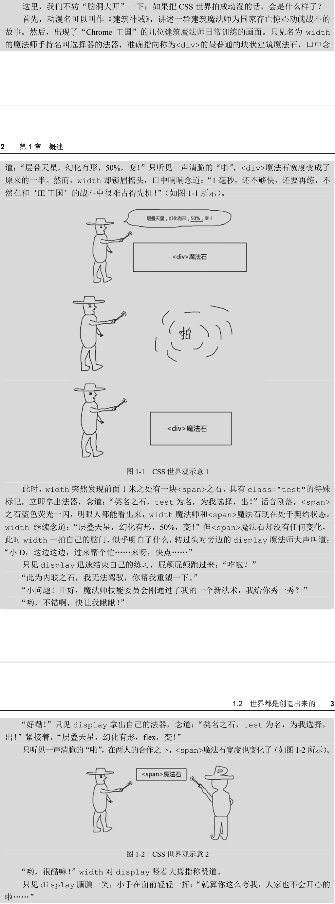

从上面的描述可以看出，在CSS 世界中，HTML 是魔法石，选择器就是选择法器，CSS 属性就是魔法师，CSS 各种属性值就是魔法师的魔法技能，浏览器就是他们所在的“王国”，“王国”会不断更新法律法规（版本升级），决定是否允许使用新的魔法石（HTML5 新标签新属性），是否允许新的魔法师入“国籍”（CSS3 新属性），或者允许魔法师使用某些新技能（CSS 新的属性值），以及是否舍弃某些魔法技能（如 display:run-in）；操作系统就是他们所在的世界，不同的操作系统代表不同的平行世界，所以，CSS世界有这么几个比较大的平行世界，即Windows 世界、OS X 世界以及移动端的iOS世界和Android 世界。不同世界的浏览器王国的命运不一样，例如，在OS X 世界中，IE王国是不存在的，而Safari王国却异常强大，但在Windows 世界中，Safari 王国却异常落寞。

以上这一切就构成了完整的 CSS 世界的“世界观”。

下面回答一个很重要的问题：为何要这样认识 CSS 世界呢？

首先，将抽象的 CSS 直接和具体的现实世界相对应，更加易于理解。试想一下，对于普通人，理解魔法师和魔法石是不是要比理解 CSS 代码容易得多？其次，以完整的体系来学习 CSS要比单纯关注属性值理解得更加深刻，可以培养从宏观层面认识与理解 CSS 的习惯。再次，这也方便我们记忆，枯燥的代码总是过目就忘，鲜活的角色总是印象深刻。最后，这样也可以让本书散发出与众不同的气质。

## 世界都是创造出来的

世界都是创造出来的。很自然，CSS 世界也是一点一点创造出来的。这世间上的事情只要发生了，都是有原因的。CSS 世界的出现也不例外。

下面我们就来看一下 CSS 世界出现的历史。虽然我知道，有些人对这些历史可能不感兴趣，但是要想深入理解CSS属性的一些设计原因、表现原理还真离不开当时的历史环境。

大家可能都听说过马云1995年去美国，第一次接触了互联网，在这个时间点，HTML才是第一版且诞生没几年，w3C才刚刚成立，CSS还没出现。那时候的互联网几乎都是文字信息，显示一张图片都是要上天的感觉。

大家可能没意识到，那个时候前端的发展和现在一样快，设计师要求越来越多，HTML也越来越庞杂。急需要其他专门负责样式的语言，据说当时有几个样式表语言，最后是CSS胜出了，为什么呢？它的胜出靠的是“层叠”特性。

CSS全称是Cascading Style Sheets，翻译成中文就是“**层叠样式表**”。所谓“层叠”，顾名思义，就是样式可以层层累加，比方说页面元素都继承了12像素的大小，某标题就可以设置成14像素进行叠加。发现没？这种层叠策略对于样式的显示是相当的灵活。

于是，从1996年12月17日CSSI诞生后，CSS在样式呈现领域可谓所向披靡，没有遇到任何竞争对手。1998年5月12日CSS2发布，推行内容和表现分离，表格（table）布局开始落寞。

1998年腾讯、新浪和网易成立，当时搜狐则成立1年不到。那个时候是门户的时代，人们更关注的是信息的获取，所以网站的功能主要就是信息展示，信息是什么？在那个时代，在互联网领域，信息就是图片和文字。换句话说，那时候的网站前端技术关心的是图片和文字的呈现，而CSS2（包括9年之后，也就是2007年才出现的CSS2.1）都是为图文展示服务的。

我再重复一遍：**CSS世界的诞生就是为图文信息展示服务的**。这句话在本书中会非常频繁地出现，知道这一点你就会明白很多事情。

好，下面让我们回到本节开头的那句话-“世界都是创造出来的"！为何我要反复强调这句话呢？如果站在造物主的角度去思考CSS世界的种种表现，很多问题就会迎刃而解。

现在给你机会当一回造物主，让你自己重新构建一个CSS世界，唯一的要求就是，这个世界要非常便于图片和文字的呈现，你会去如何构建呢？

## CSS 完胜 SVG 的武器 ——流

在 2003 年 1 月，SVG 1.1 被确立为 W3C 标准。你没看错，是 2003 年。要知道，CSS 2.1是 2007 年才发布的。考虑到 SVG 开始火起来是最近几年，也就是差不多 10 年的时间，SVG都默默无闻，鲜有人问津，到底是怎么回事呢？

很多人认为 SVG 的竞争对手是 Flash。对，是竞争对手。但是，现在看来，SVG 显然要比Flash 优秀很多，SVG 开放、标准，和 CSS 和 JavaScript 都能很方便地进行交互，如果单纯 SVG和 Flash 比，难说谁胜谁负。在我看来，造成 SVG 被冷落 10 年的原因不是别的，正是看似毫不相关的 CSS，SVG 是被 CSS 给打败的。

正如上面提到的，在很长一段时间里，网站的主要功能都是图片和文字信息的展示，但是，SVG 的强项是图形，其文字内容的呈现实在不敢恭维。举个例子，在 CSS 中写上一段文字，这段文字会自然换行、多行显示，于是，可以像书本一样阅读；但是，在 SVG 中，文字要自动折行，感觉有点儿赶鸭子上架 — 强人所难。人家一看，SVG 连基本的文字排版都做不好，要 SVG何用？于是，SVG 被“打入冷宫”，CSS 一如既往被重用。

但是，如今技术得到了发展，Web 呈现更加复杂和丰富多彩，图文显示仅仅是网页功能的一部分，于是，矢量且图形领域颇有造诣的 SVG 开始迎来了自己的第一春。

不知大家有没有思考过这样的问题：为什么 CSS 世界的图文显示能力那么强？为什么它可以抑制 SVG 这么多年？
答案就是：流！

### 何为"流"

和 CSS 有过亲密接触的人一定听过“文档流”这个概念，我个人总是习惯把“文档”二字去掉，直接称为“流”（纯粹个人爱好，因为够简洁）。听过它的人很多，但是，深入思考过“何为流？”这个问题的人怕是就没这么多了。

那究竟 CSS 世界中的“流”指的是什么呢？“流”实际上是 CSS 世界中的一种基本的定位和布局机制，可以理解为现实世界的一套物理规则，“流”跟现实世界的“水流”有异曲同工的表现。

现实世界中，如果我们让水流入一个容器，水面一定是平整的；我们在水里面放入物体，如普通的木头，此时水位就会上升，木头多半浮在水面上，但只露出一点点头，如图 1-3 所示。

这些现象我们都会认为是理所当然的，因为这就是我们从小接触的一套物理规则。我们知道这套规则，就可以理解现象，并且预知现象。例如，水量超过容器的容积很多，我们就可以预测到水会溢出来。

感谢物理学，它让我们理解 CSS 世界的“流”就轻松多了。CSS 世界的“流”似乎就是按照物理世界的“水流”创造的。

CSS世界构建的基石是HTML，而HTML最具代表的两个基石`
`和``正好是CSS世界中块级元素和内联级元素的代表，它们对应的正是图 1-3 所示的盛水容器中的水和木头，其特性表现也正如现实世界的水和木头，如图 1-4 所示。

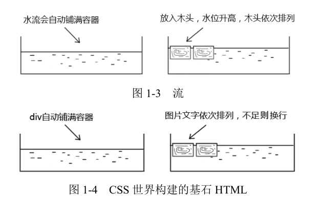

所以，所谓“流”，就是 CSS 世界中引导元素排列和定位的一条看不见的“水流”。

### 流是如何影响整个 CSS 世界的

在CSS2.1时代，我们直接称CSS为“流的世界”真是一点儿也不为过，整个CSS世界八乎就是围绕“流”来建立的，那么流是如何影响整个CSS世界的呢？

（1）擒贼先擒王。因为CSS世界的基石是HTML，所以只要让HTML默认的表现符合“流”，那么整个CSS世界就可以被“流”统治，而事实就是如此！

（2）特殊布局与流的破坏。如果全部都是以默认的“流”来渲染，我们只能实现类似w3c那样的文档网页，但是，实际的网页是有很多复杂的布局的，怎么办？可以通过破坏“流”来实现特殊布局。实际上，还是和“流”打交道。

（3）流向的改变。默认的流向是“一江春水向东流”，以及“飞流直下三千尺”。然而，这种流向我们是可以改变的，可以让CSS的展现更为丰富。因此，“文档流从左往右自上而下”，这种说法是不严谨的，大家一定要纠正过来。

好了，下面我想反问大家：如果你是造物主，你会想到设计“流”这套机制来实现强大的图文排列功能吗？

好好想一想…是不是觉得目前CSS的设计还是很有智慧的？如果你来重新设计CSS，实现图文排列，你是否还有其他的设计思路，比方说“亲缘机制”之类？

适当地反问这些问题，通过逆向思维，会让我们对CSS世界有另外一个角度的认识。

### 什么是流体布局

所谓“流体布局”，指的是利用元素“流”的特性实现的各类布局效果。因为“流”本身具有自适应特性，所以“流体布局”往往都是具有自适应性的。但是，“流体布局”并不等同于“自适应布局”。“自适应布局”是对凡是具有自适应特性的一类布局的统称，“流体布局”要狭窄得多。例如，表格布局也可以设置为 100%自适应，但表格和“流”不是一路的，并不属于“流体布局”。

CSS 中最常用的魔法石，也就是最常使用的 HTML 标签，是`
`，而`
`是典型的具有“流”特性的元素，因此，曾经风靡的“div+CSS 布局”，实际上指的就是这里的“流体布局”。

## CSS 世界的开启从 IE8 开始

本书书名为《CSS 世界》，这里的“世界”特指的是 CSS2.1 的世界，并不包括 CSS3，CSS3的世界更为庞杂和宏大，但 CSS2.1 的世界已经足够我们畅游很多年了。现在前端技术发展迅猛，加上氛围略显浮躁，有必要让广大前端开发人员静下心来认识 CSS2.1 的世界，否则面对 CSS3的真正到来，只能是浅水游弋、搬砖打杂。

对 CSS2.1 的全面支持是从微软公司的 IE8 开始的，因此，本书中几乎所有特性、行为表现都是针对 IE8 以上浏览器的。

## table 自己的世界

如果我没记错的话，`<table>`比 CSS 还要老，也就是 CSS 正式诞生之前，`<table>`就已经出现了。前面提到了“流影响了整个 CSS 世界”，其中并不包括`<table>`。`<table>`有着自己的世界，“流”的特性对`<table>`并不适用，一些 CSS 属性的表现，如单元格的`vertical-align`，也和普通的元素不一样。

虽然 CSS2.1 加强了和`<table>`的联系，如对 table 类别的 display 属性值的支持等，但是本书并不会对`<table>`进行专门的介绍，因为毕竟不是同一个世界的。

## CSS 新世界 ——CSS3

时代在变迁，科技在发展，人们对互联网的需求也在变化，以前的以图文展示为主的门户网站已经无法满足用户的需求。技术总是随着需求发展的，正如10年前的图文展示需求缔造了CSS世界一样，如今的移动互联网以及硬件发展也带动CSS进入了新的世界。

（1）布局更为丰富。

* 移动端的崛起，催生了CSS3媒介查询以及许多响应式布局特性的出现，如图片元素的`srcset`属性、CSS的`object-fit`属性。
* 弹性盒子布局（flexible box layout）终于熬出了头。
* 格栅布局（grid layout）姗姗来迟

（2）视觉表现长足进步

* 圆角、阴影和渐变让元素更有质感。
* transform变换让元素有更多可能。
* filter滤镜和混合模式让Web轻松变成在线的Photoshop：
* animation让动画变得非常简单。

上面提到的全部都是CSS3的新属性。因为CSS3的设计初衷是为了实现更丰富、更复杂的网页，所以基本上和“流”的关系并不大。可以说，和CSS2相比CSS3就是一个全新的世界，更加丰富，更加规范，更加体系化，也更加复杂。考虑到CSS3尚未完全成型，且自己尚未有足够深入的研究，无法同时驾驭太复杂的内容，因此，本书不会深入CSS3的知识点。

# 第2章：需提前了解的术语和概念

## 务必了解的CSS世界的专业术语

尽管本书内容会用很轻松的方式表达，但还是避免不了会出现一些CsS领域的专业术语。因此，在学习技术内容之前，我们需要先了解一下Css世界里的一些专业术语。

首先，假设我们现在有如下一段常见的CSS代码：

~~~css
.vocabulary{
	height: 99px;
	color: transparent;
}
~~~

下面就针对这段代码，逐一引出其涉及的专业术语。

### 属性

属性对应的是平常我们书面或交谈时对CsS的中文称谓。例如，上面示意Css代码中的height和color就是属性。当我们聊天或者分享时说起CSS的时候，嘴里冒出来的都是“这个元素高度99像素”，或者“这个文字颜色透明”，对吧？这里提到的“高度”和“颜色”就是Css世界的属性，感觉有点儿像现实世界里人的姓氏。

### 值

“值”大多与数字挂钩。例如，上面的99px就是典型的值。在CSS世界中，值的分类非常广泛，下面是一些常用的类型。

* 整数值，如`z-index:1`中的1，属于`<integer>`，同时也属于`<number>`。
* 数值，如`line-height：1.5`中的1.5，属于`<number>`。
* 百分比值，如`padding：50%`中的50%，属于`<percent>`。
* 长度值，如`99px`。
* 颜色值，如`#999`

此外，还有字符串值、位置值等类型。在CSS3新世界中，还有角度值、频率值、时间值等类型，这里就不全部展示了。

### 关键字

顾名思义，关键字指的是CSS里面很关键的单词，这里的单词特指英文单词，abc是单词吗？不是，因此，如果CSS中出现它，一定不是关键字。上面示例Css代码中的transparent就是典型的关键字，还有常见的solid，inherit等都是关键字，其中inherit也称作“泛关键字”，所谓泛关键字，可以理解为“公交车关键字”，就是“所有CSS属性都可以使用的关键字”的意思。

### 变量

CSS 中目前可以称为变量的比较有限，CSS3 中的 currentColor 就是变量，非常有用。不过，这属于《CSS 新世界》的内容，本书不会详细阐述，有兴趣的读者可以访问 http://www.zhangxinxu.com/wordpress/?p=4385
，做简单的了解。

### 长度单位

[CSS中的px与屏幕实际的分辨率的关系](https://blog.csdn.net/qq_23947467/article/details/86658490)

CSS中的单位有时间单位（如s、ms），还有角度单位（如deg、rad等），但最常见的自然还是长度单位（如px，em等），需要注意的是，**诸如2%后面的百分号%不是长度单位**。再说一遍，**%不是长度单位**！因为2%就是一个完整的值，就是一个整体，我想你一定认为0.02是值，没错，2%也同样是值。

有人可能会有疑问，我就认为8是单位，有什么关系，页面还是长那样，有必要这么较真吗？

问的很在理，如果大家平时没有看原始文档的习惯，没必要较真，知道怎么使用就好了。

但是，如果经常去MDN或w3C看一些Css技术文档，搞清楚概念，看文档的时候就不容易犯迷糊，就不会看不懂具体说些什么，尤其都是英文的时候。

可能有人会有疑问，“值”那里提到的`<length>`，貌似和这里的“长度单位”比较暖昧啊？

好眼力！没错，确实暧昧，但暧昧是不好的，我们必须把它们之间的关系搞清楚。一句话：

~~~css
<number> +长度单位= <length>
~~~

如果继续细分，长度单位又可以分为**相对长度单位和绝对长度单位**。

（1）**相对长度单位**。相对长度单位又分为**相对字体长度单位**和**相对视区长度单位**。

* 相对字体长度单位，如`em`和`ex`，还有CSS3新世界的`rem`和`ch`（字符0的宽度）。
* 相对视区长度单位，如`vh、vw、vmin和vmax。`

（2）**绝对长度单位**：最常见的就是px，还有`pt、cm、mm、pc`等了解一下就可以，在我看来，它们实用性近乎零，至少我这么多年一次都没用过。

### 功能符号

值以**函数的形式**指定（就是被括号括起来的那种），主要用来表示颜色（rgba和hsla）、背景图片地址（url）、元素属性值、计算（calc）和过渡效果等，如`rgba(0,0,0,.5)`、`url('css-world.png')`、`attr('href')`和`scale(-1)`。

### 属性值

属性冒号后面的所有内容统一称为属性值。例如，`1px solid rgb(0,0,0)`就可以称为属性值，它是由“**值+关键字+功能符**”构成的。属性值**也可以由单一内容构成**。例如，`z-index:1`的1也是属性值。

### 声明

[透明颜色transparent的使用](https://www.cnblogs.com/ypppt/p/13229542.html)

属性名加上属性值就是声明，例如：`color: transparent;`

### 声明块

声明块是花括号（{ }）包裹的一系列声明，例如：

~~~css
{
    height: 99px;
    color: transparent;
}
~~~

### 规则或规则集

出现了选择器，而且后面还跟着声明块，比如本小节一开始的那个例子，就是一个规则集：

~~~css
.vocabulary{
	height: 99px;
	color: transparent;
}
~~~

### 选择器

选择器是用来瞄准目标元素的东西，例如，上面的`.vocabulary`就是一个选择器。

* 类选择器：指以`“.”`这个点号开头的选择器。很多元素可以应用同一个类选择器。**“类”，天生就是被公用的命**。
* ID选择器：`“#"`，打头，权重相当高。ID一般指向**唯一元素**。但是，在CSS中，ID样式出现在多个不同的元素上并不会只渲染第一个，而是雨露均沾。但显然不推荐这么做。
* 属性选择器：指含有`[ ]`的选择器，形如`[title]（}`、`[title="css-world"]{}`、
  `[title~="css-world"]{}`、`[title^="css-world"]{}`和`[title$="css-world"]{}`等。
* 伪类选择器：一般指**前面有个英文冒号(:)**的选择器，如`:first-child`或`:last-child`等。
* 伪元素选择器：就是**有连续两个冒号**的选择器，如`::first-line`、`::first-
  letter`、`::before`和`::after`。

### 关系选择器

关系选择器是指根据与其他元素的关系选择元素的选择器，常见的符号有空格、`>`、`~`，还有`+`等，这些都是非常常用的选择器。

* 后代选择器：选择所有合乎规则的后代元素。空格连接。
* 相邻后代选择器：仅仅选择合乎规则的儿子元素，孙子、重孙元素忽略，因此又称“子选择器”。`>`连接。适用于IE7以上版本。
* 兄弟选择器：选择当前元素后面的所有合乎规则的兄弟元素。`~`连接。适用于1E7以上版本。
* 相邻兄弟选择器：仅仅选择当前元素相邻的那个合乎规则的兄弟元素。`+`连接。适用于IE7以上版本。

### @规则

@规则指的是以@字符开始的一些规则，像`@media`，`@font-face`，`@page`或者`@support`，诸如此类。

## 了解 CSS 世界中的“未定义行为”

当某个浏览器中出现与其他浏览器不一样的行为或样式表现的时候，我们总会习惯把这种不一样的表现认为是浏览器的bug。但在CSS世界，这种认识是狭隘的。

在现实世界中，有法律来约束我们的行为，如果越界，就称为违法；同样地，在CSs世界里，有Web标准来约束元素的行为，如果越界，就称为bug。但是，法律总是人制定的，世间万象是不可能面面俱到的，会存在法律空白；同样地，Web应用场景千变万化，Web标准也是不可能面面俱到的，也会存在规范描述以外的场景，此时，各大浏览器厂家只能根据自己的理解与喜好去实现，一旦个性化就会出现差异，就会遇到“火狐火狐，你怎么啦？平时表现挺好的，今天怎么被IE带坏了？”的情景。实际上，此时遇到的表现差异并不是浏览器的bug，用计算机领域的专业术语描述应该是“未定义行为”（undefined behavior）。

下面我们来看一个“未定义行为”的例子。

CSS世界中有很多伪类，其中一个比较常用的就是：active，在IE8及以上版本的浏览器行为表现非常统一，支持"**非焦点元素**"，鼠标按下，执行：active伪类对应的CSS样式，鼠标抬起还原。

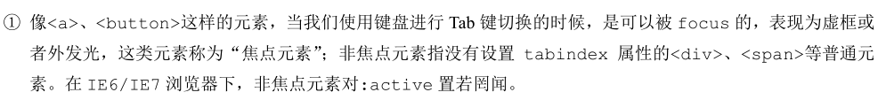

通用情况下，`:active`的表现都是符合预期的，但是，当遭遇其他一些处理的时候，事情就会变得不一样，具体指什么处理呢？

假设我们现在有一个`<a>`标签模拟的按钮，CSS如下：

~~~css
a:active { background-color: red; }
~~~

假设此按钮的DOM对象变量名为button，JavaScript代码如下：

~~~javascript
button.addEventListener（"mousedown"，function（event）{
	//此处省略N行
    event.preventDefault();
}
~~~

也就是鼠标按下的时候，阻止按钮的默认行为，这样设置可以让拖动效果更流畅。

看似平淡无奇的一段代码，最后却发生了意想不到的情况：Firefox浏览器的：active阵亡了，鼠标按下去没有UI变化，按钮背景没有变红！其他所有浏览器，如IE和Chrome浏览器，`:active`正常变红，符合预期。

眼见为实，手动输入http://demo.cssworld.cn/2/2-1.php或者扫下面的二维码。图2-1左图所示为目标效果，右图所示是Firefox浏览器中的效果。

这里，Firefox和1E/Chrome浏览器表现不一样，这是Firefox浏览器的bug吗？这可不是bug，而是因为规范上并没有对这种场景的具体描述，所以Firefox认为`:active`发生在mousedown事件之后，你也不能说它什么，对吧？

像这种规范顾及不到的细枝末节的实现，就称为"未定义行为"。

# 第3章：流、元素与基本尺寸

第1章提过了，“流”之所以影响了整个Css世界，就是因为影响了Css世界的基石HTML。那具体是如何影响的呢？

HTML常见的标签有`
、
、<1i>`和`<table>`以及`、、<strong>`和`<em>`等。虽然标签种类繁多，但通常我们就把它们分为两类：**块级元素**（`block-level element`）和**内联元素**（`inline element`）。

注意，如果按照w3C的CSS规范区分，这里应该分为“块级元素”和“内联级元素”（inline-level element）。但是，在W3C的HTML4规范中，已经明确把HTML元素分成了“块级元素”和“内联元素”，没错，是“内联元素”而不是“内联级元素”。两个规范貌似有微小的冲突。本书中所采用的是“内联元素”这种称谓，原因有两点：**第一**，这种称谓更亲切、更自然，因为大家平时都是这么叫的；**第二**，使用“内联元素”这个称谓对我们深入理解与内联相关的概念并没有什么影响。考虑到本书的目的不是为CSS规范做科普，而是以通俗易懂方式展示CSS的精彩世界，所以，采用了更老一点的HTML规范中的叫法。

## 块级元素

“块级元素”对应的英文是block-level element，常见的块级元素有`
`、`<1i>`和`<table>`等。需要注意是，**“块级元素”和"display为block的元素”不是一个概念**。例如，`<1i>`元素默认的display值是`list-item`，`<table>`元素默认的display值是table，但是它们均是“块级元素”，因为它们都符合块级元素的基本特征，也就是一个水平流上只能单独显示一个元素，多个块级元素则换行显示。

正是由于“块级元素”具有换行特性，因此理论上它都可以配合clear属性来清除浮动带来的影响。例如：

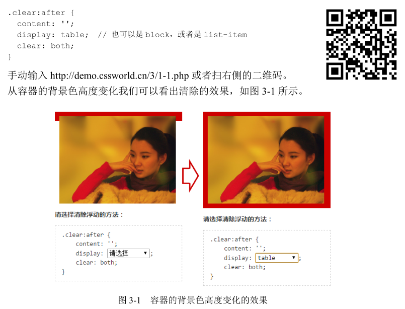

实际开发时，我们要么使用 block，要么使用table，并不会使用 `list-item`，主要有 3 个原因。

* 1 个字符的比较多，其他都是 5 个字符。

* 会出现不需要的项目符号，如图 3-2 箭头所示。这其实并不是什么大问题，再加一行` list-style:
  none `声明就可以了。

* IE 浏览器不支持伪元素的 display 值为` list-item`。这是不使用 display:list-item 清除浮动的
  主因，兼容性不好。对于 IE 浏览器（包括 IE11），普通元素设置 `display:list-item `有 效 ， 但 是 `:before`/`:after `伪元素就不行。

  下面是提问环节了。请问，为什么 IE 浏览器不支持伪元素的 display 值为 list-item 呢？

  其实这个问题的答案可以从下面这个问题中找到线索：请问，为什么设置 display:list-item，元素会出现项目符号？

### 为什么 list-item 元素会出现项目符号

在 CSS 世界中，很多看似“理所当然”的现象的背后，实际上可能有一整套的体系支撑。挖掘简单现象背后的原因，会让你学到很多别人很难学到的 CSS 技能和知识。

回到这个问题。此问题本身并不难，但是，问题所能延伸出来的东西就要吓到诸位了。此问题牵扯到 CSS 世界中各种盒子。

由于牵扯名词甚多，所以我尽量以通俗易懂的方式给大家解释。

创造 CSS 的造物主原本的想法很简单：我要创造一个世界，就像只有男性和女性一样，这个世界只有**块级盒子**（block-level box）和**内联盒子**（inline box）。**块级盒子就负责结构，内联盒子就负责内容**。事非经过不知难，造物主后来才发现，这世界不止有男性和女性，还有特殊的性别，CSS 世界的盒子也是这样。

原本以为块级盒子一套就够用了，也就是所有“块级元素”就只有一个“块级盒子”，但是，半路杀出个` list-item`，其默认要显示项目符号的，一个盒子解释不了，怎么办？

就跟我们写 JavaScript 组件遇到新功能增加 API 一样，天神灵机一动：我给 `list-item`再重新命名一个盒子，就叫“附加盒子”。好了，这下顺了，所有的“块级元素”都有一个“主块级盒子”，`list-item` 除此之外还有一个“附加盒子”。

现在大家知道上面问题的答案了吧！之所以 list-item 元素会出现项目符号是因为生成了一个附加的盒子，学名“标记盒子”（`marker box`），专门用来放圆点、数字这些项目符号。IE浏览器下伪元素不支持` list-item `或许就是无法创建这个“标记盒子”导致的。

但是，我们的故事还没结束。搞定了` list-item`，天神本以为可以安安心心睡个午觉，结果碰到了真正的特殊性别的 `display:inline-block `元素。

穿着 inline 的皮藏着 block 的心，现有的几个盒子根本没法解释啊，怎么办？

造物主再次灵机一动，没错，你猜对了，又新增一个盒子，也就是每个元素都两个盒子，外在盒子 和内在盒子。外在盒子负责元素是可以一行显示，还是只能换行显示；内在盒子负责宽高、内容呈现什么的。但是呢，造物主又想了想，叫“内在盒子”虽然容易理解，但是未免有些俗气，难登大雅之堂，于是，又想了一个更专业的名称，叫作“**容器盒子**”。

> “外在盒子”除了inline-block，还有run-in，但Chrome已经放弃对run-in的支持有一段时间了，因此本书不对其做分析。

于是，按照 display 的属性值不同，值为 block 的元素的盒子实际由外在的“块级盒子”和内在的“块级容器盒子”组成，值为 inline-block 的元素则由外在的“内联盒子”和内在的“块级容器盒子”组成，值为 inline 的元素则内外均是“内联盒子”。

现在，大家应该明白为何display属性值是inline-block的元素既能和图文一行显示，又能直接设置 width/height 了吧！因为有两个盒子，外面的盒子是 inline 级别，里面的盒子是 block 级别。

实际上，如果遵循这种理解，`display:block` 应该脑补成 `display:block-block`，`display:table` 应该脑补成 `display:block-table`，我们平时的写法实际上是一种简写。

好了，说了这么多，出个小题测试一下大家的学习成果。请问`display:inline-table`的盒子是怎样组成的？

### `display:inline-table`的盒子是怎样组成的

这个问题应该无压力：外面是“内联盒子”，里面是“table 盒子”。得到的就是一个可以和文字在一行中显示的表格。

在一行中显示的表格。可以和文字在一行中显示的表格？没错，为了证明我没忽悠大家，我特意做了个演示页
面，演示页面中`
`元素的相关 CSS 代码如下：

~~~css
.inline-table {
	display: inline-table;
	width: 128px;
	margin-left: 10px;
	border: 1px solid #cad5eb;
}
~~~

上面示意的 CSS 代码表面上看起来很简单，但是，我也说过，简单的背后往往是不简单。这里 CSS 中有个 width:128px，从最终的效果来看，宽度设置是起作用了。如果我们使用`display:inline-block `也会是同样的宽度表现。下面问题来了：元素都有内外两个盒子，我们平常设置的 `width/height `属性是作用在哪个盒子上的？

### width/height 作用在哪个盒子上

这个问题也是很简单的，因为在解释内外盒子的时候就已经提到过了：是**内在盒子**，也就是“容器盒子”。

不知大家有没有进一步深入思考过：width 或 height 作用的具体细节是什么呢？

## width/height 作用的具体细节

因为块级元素的流体特性主要体现在水平方向上，所以我们这里先着重讨论 width。

估计很多人的第一次 CSS 属性书写就献给了 width，就像路边的小草，好常见、好平淡、好简单的样子。如果你有这样的想法，此书你就买对了。

### 深藏不露的 width:auto

我们应该都知道，width 的**默认值是 auto**。auto 因为是默认值，所以出镜率不高，但是，它却是个深藏不露的家伙，它至少包含了以下 4 种不同的宽度表现。

**（1）充分利用可用空间**。比方说，`
`、`
`这些元素的宽度默认是 100%于父级容器的。这种充分利用可用空间的行为还有个专有名字，叫作 `fill-available`，大家了解即可。

**（2）收缩与包裹**。典型代表就是浮动、绝对定位、`inline-block`元素或 table 元素，英文称为` shrink-to-fit`，直译为“收缩到合适”，有那么点儿意思，但不够形象，我一直把这种现象称为“包裹性”。CSS3 中的` fit-content` 指的就是这种宽度表现。

**（3）收缩到最小**。这个最容易出现在` table-layout `为 auto 的表格中，想必有经验的人一定见过图 3-4 所示的这样一柱擎天的盛况吧！

眼见为实，有兴趣的读者可以手动输入http://demo.cssworld.cn/3/2-1.php 或者扫下面的二维码。

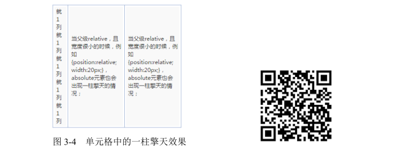

当每一列空间都不够的时候，文字能断就断，但中文是随便断的，英文单词不能断。于是，第一列被无情地每个字都断掉，形成一柱擎天。这种行为在规范中被描述为`“preferred minimum width”`或者`“minimum content width”`。后来还有了一个更加好听的名字` min-content`。

**（4）超出容器限制**。除非有明确的 width 相关设置，否则上面 3 种情况尺寸都**不会主动超过父级容器宽度**的，但是存在一些特殊情况。例如，内容很长的连续的英文和数字，或者内联元素被设置了 white-space:nowrap，则表现为“恰似一江春水向东流，流到断崖也不回头”。

例如，看一下下面的 CSS 代码：

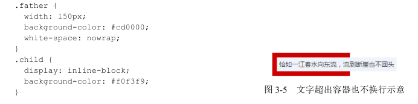

这段代码的结果如图 3-5 所示。

子元素既保持了 inline-block 元素的收缩特性，又同时让内容宽度最大，直接无视父级容器的宽度限制。这种现象后来有了专门的属性值描述，这个属性值叫作 `max-content`，这个属于 CSS3 新世界内容，本书点到为止，不深究。

眼见为实，若有兴趣，可以手动输入 http://demo.cssworld.cn/3/2-2.php亲自感受一下。

上面列举的 4 点就是 width:auto 在不同场景下的宽度表现的简介。

在 CSS 世界中，盒子分“内在盒子”和“外在盒子”，显示也分“内部显示”和“外部显示”，同样地，尺寸也分“内部尺寸”和“外部尺寸”。其中“内部尺寸”英文写作“Intrinsic Sizing”，表示尺寸由内部元素决定；还有一类叫作“外部尺寸”，英文写作“Extrinsic Sizing”，宽度由外部元素决定。

现在，考考大家：上面 4 种尺寸表现，哪个是“外部尺寸”？哪个是“内部尺寸”？

这里就不卖关子了。就第一个，也就是`
`默认宽度 100%显示，是“外部尺寸”，其余全部是“内部尺寸”。而这**唯一的“外部尺寸”，是“流”的精髓所在**。

**1.外部尺寸与流体特性**

* 正常流宽度

当我们在一个容器里倒入足量的水时，水一定会均匀铺满整个容器，如图 3-6 所示。

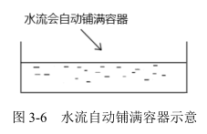

在页面中随便扔一个`
`元素，其尺寸表现就会和这水流一样铺满容器。这就是 block 容器的流特性。这种特性，所有浏览器的表现都是一致的。因此，我就实在想不通，为何那么多网站或同行会有类似下面的 CSS 写法。例如，一个垂直导航：

~~~css
a {
	display: block;
	width: 100%;
}
~~~

`<a>`元素默认 diplay 是 inline，所以，设置 `display:block `使其块状化绝对没有问题，但后面的 width:100%就没有任何出现的必要了。

我很多年前总结过一套“鑫三无准则”，即**“无宽度，无图片，无浮动”**。为何要“无宽度”？原因很简单，表现为“外部尺寸”的块级元素一旦设置了宽度，流动性就丢失了。

所谓流动性，并不是看上去的宽度100%显示这么简单，而是一种`margin/border/padding`和 content 内容区域自动分配水平空间的机制。

我们来看一个简单的例子，手动输入 http://demo.cssworld.cn/3/2-3.php或者扫右侧的二维码。这是一个对比演示（见图 3-7），上下两个导航均有margin 和 padding，前者无 width 设置，完全借助流特性，后者宽度
`width:100%`。结果，后者的尺寸超出了外部的容器，完全就不像“水流”那样完全利用容器空间，即所谓的“流动性丢失”。

当然，实际开发的时候，是不会设置宽度 100%的，毕竟有显示问题。此时，可能有人会突然灵光一现，借助流动性来实现……要是这样就好了，然而其基本上采取的策略是，发挥自己天才般的计算能力，通过`“容器宽度−水平 padding−水平 margin=?”`重新设定具体的宽度。

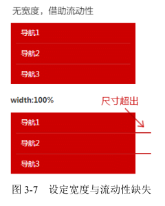

于是，最终的 CSS 代码如下：

~~~css
.nav {
	width: 240px;
}

.nav-a {
	display: block;
	/* 200px = 240px - 10px*2 - 10px*2 */
	width: 200px;
	margin: 0 10px;
	padding: 9px 10px;
	...
}
~~~

典型的“砌砖头”“搭积木”式思维方式！虽然说最后的效果是一样的，但是，如果模块的宽度变化了，哪怕只变了 1 像素， width 也需要重新计算一遍。但是，如果借助流动性无宽度布局，那么就算外面容器尺寸变化，我们的导航也可以自适应，这就是充分利用浏览器原生流特性的好处。

因此，记住“无宽度”这条准则，少了代码，少了计算，少了维护，何乐而不为呢？

你应该还记得前面说过 `display:block `应该脑补成 `display:block-block`，这是我自己想出来的，便于大家理解，CSS 世界其实并没有这样的说法。虽有“臆想”成分在里面，但其实也是有理可循的。本节详细讲了块级元素的流体特性，这种特性就是体现在里面的“容器盒子”上的。所以，在 CSS3 最新的世界中，CSS 规范的撰写者们使用了另外一个名词来表示这个内在盒子，就是“flow”，也就是本书的核心“流”。因此，display:block 更规范的脑补应该是 display:block flow。注意中间是空格。当然，由于规范（草案）2015 年 10月才发布，因此直到 2017 年 6 月为止还没有浏览器支持。好了，这属于比 CSS3 新世界还要新的世界的知识点，了解即可。

* 格式化宽度

格式化宽度仅出现在“绝对定位模型”中，也就是出现在 position属性值为 absolute 或 fixed 的元素中。在默认情况下，绝对定位元素的宽度表现是“包裹性”，宽度由内部尺寸决定，但是，有一种情况其宽度是由外部尺寸决定的，是什么情况呢？

对于非替换元素（见本书第 4 章），当 left/top 或 top/bottom 对立方位的属性值同时存在的时候，元素的宽度表现为“格式化宽度”，其宽度大小相对于最近的具有定位特性（position 属性值不是 static）的祖先元素计算。

> 感觉看不懂了，看不下去了。

例如，下面一段 CSS 代码：

~~~css
div { position: absolute; left: 20px; right: 20px; }
~~~

假设该`
`元素最近的具有定位特性的祖先元素的宽度是 1000 像素，则这个`
`元素的宽
度是 960（即 1000−20−20）像素。

此外，和上面的普通流一样，“格式化宽度”具有完全的流体性，也就是 margin、border、padding 和 content 内容区域同样会自动分配水平（和垂直）空间。

“格式化宽度”水很深，同时也非常实用，这里先简单提及，更多内容可参见本书第 6 章与`position:absolute`相关的内容。

**2.内部尺寸与流体特性**

上一节讲的是“外部尺寸”，本节就讲讲“内部尺寸”。所谓“内部尺寸”，简单来讲就是元素的尺寸由内部的元素决定，而非由外部的容器决定。如何快速判断一个元素使用的是否为“内部尺寸”呢？很简单，**假如这个元素里面没有内容，宽度就是 0，那就是应用的“内部尺寸”**。

据我所知，在 CSS 世界中，“内部尺寸”有下面 3 种表现形式。

**（1）包裹性**

“包裹性”是我自己对“shrink-to-fit”理解后的一种称谓，我个人觉得非常形象好记，一直用了很多年。“包裹性”也是 CSS 世界中很重要的流布局表现形式。

中文就是博大精深，顾名思义，“包裹性”，除了“包裹”，还有“自适应性”。“自适应性”是区分后面两种尺寸表现很重要的一点。那么这个“自适应性”指的是什么呢？

所谓“自适应性”，指的是元素尺寸由内部元素决定，但永远小于“包含块”容器的尺寸（除非容器尺寸小于元素的“首选最小宽度”）。换句话说就是，“包裹性”元素冥冥中有个 max-width:100%罩着的感觉（注意，此说法只是便于大家理解，实际上是有明显区别的）。

因此，对于一个元素，如果其 display 属性值是 inline-block，那么即使其里面内容再多，只要是正常文本，宽度也不会超过容器。于是，图文混排的时候，我们只要关心内容，除非“首选最小宽度”比容器宽度还要大，否则我们完全不需要担心某个元素内容太多而破坏了布局。

凡事发生必有缘由。CSS 世界的造物主为何要设计“包裹性”这个东西呢？是为谁设计的呢？

反问是探究知识的很好的习惯和方式。要回答上面的问题，我们只要请一个嘉宾出来，答案就基本差不多了。下面我们就请出重量级嘉宾 — 著名的“按钮”元素。没错，就是默认长得比较丑，样式定义兼容性又不好的按钮元素。按钮通常以如下两种形式出现在页面代码中：

~~~css
<button>按钮</button>
<input type="button" value="按钮">
~~~

按钮就是 CSS 世界中极具代表性的 inline-block 元素，可谓展示“包裹性”最好的例子，具体表现为：按钮文字越多宽度越宽（内部尺寸特性），但如果文字足够多，则会在容器的宽度处自动换行（自适应特性）。

按钮会自动换行？没错，你之所以没印象，可能是因为：

* 实际项目中，按钮上的文字个数比较有限，没机会换行；
* `<button>`标签按钮才会自动换行，`<input>`标签按钮，默认`white-space:pre`，是不会换行的，需要将 pre 值重置为默认的 normal。

眼见为实，手动输入 http://demo.cssworld.cn/3/2-4.php 或者扫下面的二维码。上面的示例页面的效果如图 3-8 所示。

按钮最大宽度就是容器的 240 像素，1 像素不多 1 像素不少，顿时有了一种内外兼修的感觉。

“包裹性”对实际开发有什么作用呢？

请看这个需求：页面某个模块的文字内容是动态的，可能是几个字，也可能是一句话。然后，希望文字少的时候居中显示，文字超过一行的时候居左显示。该如何实现？

核心 CSS 代码如下：

~~~css
.box {
	text-align: center;
}

.content {
	display: inline-block;
	text-align: left;
}
~~~

这样，文字少的时候，就会如图 3-9 所示。文字多的时候，如图 3-10 所示。

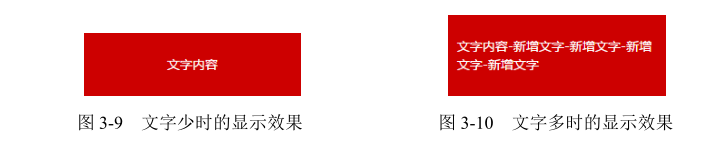

眼见为实，手动输入 http://demo.cssworld.cn/3/2-5.php 或者扫右侧的二维码，进入页面点击“更多文字”按钮体验。

除了 inline-block 元素，浮动元素以及绝对定位元素都具有包裹性，均有类似的智能宽度行为。

**（2）首选最小宽度**

所谓“首选最小宽度”，指的是元素最适合的最小宽度。我们接着上面的例子，在上面例子中，外部容器的宽度是240 像素，假设宽度是0，请问里面的 inline-block 元素的宽度是多少？

是 0 吗？不是。在 CSS 世界中，图片和文字的权重要远大于布局，因此，CSS 的设计者显然是不会让图文在 `width:auto`时宽度变成 0 的，此时所表现的宽度就是“首选最小宽度”。具体表现规则如下。

* 东亚文字（如中文）最小宽度为每个汉字的宽度，如图 3-11 所示的 14。

* 西方文字最小宽度由特定的连续的英文字符单元决定。并不是所有的英文字符都会组成连续单元，一般会终止于空格（普通空格）、短横线、问号以及其他非英文字符等。例如，“display:inline-block”这几个字符以连接符“-”作为分隔符，形成了`“display:inline”`和“block”两个连续单元，由于连接符“-”分隔位置在字符后面，因此，最后的宽度就是`“display:inline-”`的宽度，如图 3-12 所示。

  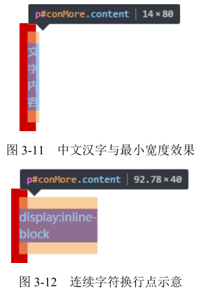

如果想让英文字符和中文一样，每一个字符都用最小宽度单元，可以试试使用 CSS 中的 word-break:break-all。

* 类似图片这样的替换元素的最小宽度就是该元素内容本身的宽度。

  首选最小宽度”对我们实际开发有什么作用呢？

  可以让我们遇到类似现象的时候知道原因是什么，方便迅速对症下药，其他就没什么用了。

  有点失望？那好，我就举个利用“首选最小宽度”构建图形的例子吧。请问，如何使用一层 HTML 标签分别实现图 3-13 所示的“凹”和“凸”效果（注意要兼容 IE8）？

  由于要兼容 IE8，CSS 新世界中图形构建利器的盒阴影和背景渐变全都没有用武之地，怎么办呢？我们可以利用“首选最小宽度”的行为特点把需要的图形勾勒出来。核心 CSS 代码如下（以“凹”效果示意）：

  ~~~css
  .ao {
  	display: inline-block;
  	width: 0;
  }
  .ao:before {
  	content: "love 你 love";
  	outline: 2px solid #cd0000;
  	color: #fff;
  }
  ~~~

  还没看明白？那我把文字颜色放出来（见图 3-14），大家应该就知道实现原理了。

  

  利用连续英文单词不换行的特性，我们就可以控制什么地方“凹”，什么地方“凸”啦！

  想看在线演示，请手动输入 http://demo.cssworld.cn/3/2-6.php 或者扫右侧的二维码。

**（3）最大宽度**

最大宽度就是元素可以有的最大宽度。我自己是这么理解的，“最大宽度”实际等同于“包裹性”元素设置`white-space:nowrap`声明后的宽度。如果内部没有块级元素或者块级元素没有设定宽度值，则“最大宽度”实际上是最大的连续内联盒子的宽度。

什么是连续内联盒子？“内联盒子”的内容会在 3.4 节深入讲解，这里你就简单地将其理解为 display 为 inline、`inline-block`、`inline-table` 等元素。“连续内联盒子”指的全部都是内联级别的一个或一堆元素，中间没有任何的换行标签` `或其他块级元素。

一图胜千言，图 3-15 所示是一段很平常的 HTML 片段的“连续内联盒子”信息标注图。其中，有 3 处连续内联盒子，分别是：

* ` `前面的 4 个内联盒子组合；
* ` `后面“我是下一行”字样所在的匿名内联盒子；
* 最后块状`
`标签内的内联盒子，也就是一段文本。

与标注图“内联”文字对应的标注相一致，此时“最大宽度”就是这 3 个连续内联盒子的宽度的最大值。

如果把标注图的代码在浏览器中运行一下，则在最大宽度模式下，效果如图 3-16 所示。可以发现最后的宽度就是第一个“连续内联盒子”的宽度。

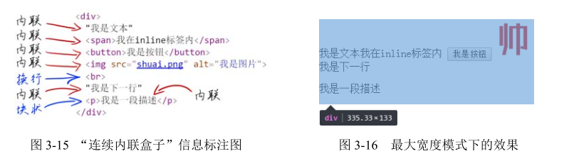

“最大宽度”对我们实际开发有什么作用呢？

根据我这么多年的经验，大部分需要使用“最大宽度”的场景都可以通过设置一个“很大宽度”来实现。注意，这里的“很大宽度”和“最大宽度”是有本质区别的。比方说，有 5 张图片，每张图片宽度 200 像素，假设图片元素紧密排列，则“最大宽度”就是 1000 像素。但是，实际开发的时候，我们懒得计算，可能直接设置容器`width:2000px`，这里 2000px 就是“很大宽度”，宽度足够大，作用是保证图片不会因为容器宽度不足而不在一行内显示。两者都能实现几张图片左右滑来滑去的效果。

那有没有场景只能是“最大宽度”而不是“很大宽度”呢？有！不知大家有没有听过 iScroll，它可以实现非常平滑的滚动效果，在前端界颇有名气。

> 这个我知道，只不过作者已经很多年不维护了。

一般来讲，实现自定义滚动有两种原理：一种借助原生的滚动，`scrollLeft/scrollTop`值变化，它的优点是简单，不足是效果呆板；另一种是根据内部元素的尺寸和容器的关系，通过修改内部元素的位置实现滚动效果，优点是效果可以很绽放。iScroll 就是使用的后者，因此，如果我们希望使用 iScroll 模拟水平滚动，只能是使用“最大宽度”，这样，滚动到底的时候才是真的到底。

眼见为实，手动输入 http://demo.cssworld.cn/3/2-7.php 或者扫下面的二维码。保证在一行显示，同时不浪费一点空白，如图 3-17 所示。

### width 值作用的细节

细心的读者有没有发现，前面那么多页，其实就讲了一个点——`width:auto`，说“深藏不露”不是忽悠你们吧？下面，转换思维，我们来看一下width 属性使用具体数值会有怎样的表现。

比方说，对于一个`
`元素，我们设定其宽度为 100px，如下：

~~~css
div { width: 100px; }
~~~

请问，100px 的宽度是如何作用到这个`
`元素上的？

要回答这个问题，就需要了解 CSS 世界中与尺寸相关的一个重要概念 — “盒尺寸”（box dimension）。

前文多次强调了，width 是作用在“内在盒子”上的，乍一看是一个普通的盒子，实际上，这个“内在盒子”是由很多部分构成的。这个盒子的构成和地球结构的构成惊人地类似，可参考图 3-18 所示的这张我制作的示意图（图中虚线、实线是为了区分不同结构，本身并没有意义）。

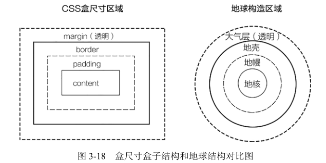

仔细对比会发现，两者不仅结构类似，对应结构的视觉表现和含义也类似。比方说，CSS的 margin 区域和地球的大气层区域都是透明的，又比方说 content 之于 CSS，正如地核之于地球，都是属于核心，因为 CSS 世界的诞生就是为图文信息展示服务的，因此，内容一定是最重要的核心。然后在这个核心的外面包裹了 padding、border 和 margin。

CSS 世界什么最多？盒子！比方前面介绍过的块状盒子、内联盒子以及外在盒子和内在盒子，以及这里即将出现的 4 个盒子，以及 3.4 节介绍的一堆盒子。如果这些盒子纯粹是概念，没什么实际作用，我就不讲或直接一步带过，但是，这里的这 4 个盒子不仅仅是概念，还真的有付诸实践的关键字，所以还是要好好说一说。

我们的这个“内在盒子”又被分成了 4 个盒子，分别是 content box、padding box、border box和 margin box。

原本这几个盒子只存在于规范中，我们写代码的知不知道无所谓的，都能写出很棒的 CSS代码，这就和玩游戏没必要知道游戏怎么制作的道理一样。但是后来，这几个盒子在 CSS 语言层有名字了，一下子变成有身份的人了，事情就变了，如果对这些盒子不了解，有些 CSS 属性就不好理解，也不容易记住。

那么都给它们起了些什么名字呢？content box 写作 content-box，padding box 写作padding-box，border box 写作 border-box，margin box 写作……突然发现，margin box 居然没有名字！为何唯独 margin box 并没有对应的 CSS 关键字名称呢？因为目前没有任何场景需要用到 margin box。

“margin 的背景永远是透明的”，因此不可能作为 backgound-clip 或 background-origin 属性值出现。margin 一旦设定具体宽度和高度值，其本身的尺寸是不会因 margin值变化而变化的，因此作为 box-sizing 的属性值存在也就没有了意义（这会在后面深入阐述）。既然无用武之地，自然就被抛弃了。

现在回到一开始的问题：width:100px 是如何作用到`
`元素上的？在 CSS2.1 的规范中，有一段非常露骨的描述：content box 环绕着 width 和 height 给定的矩形。

说得这么直白，我已经没什么其他可说的了。明摆着，width:100px 作用在了 content box上，由于`
`元素默认的 padding、border 和 margin 都是 0，因此，该`
`所呈现的宽度就是 100 像素。

那么按照这种说法，如果我们在水平方向给定 padding 和 border 大小，则元素的尺寸就不是 100 像素了？我们看一个简单的例子：

~~~css
div { width: 100px; padding: 20px; border: 20px solid; }
~~~

手动输入 http://demo.cssworld.cn/3/2-8.php 或者扫下面的二维码。结果变成了 180 像素宽，如图 3-19 所示。

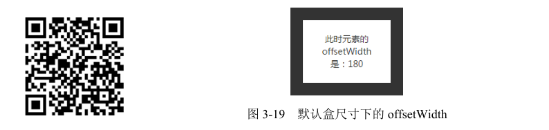

为什么会变宽呢？其实很好理解，因为宽度是作用在 content box 上的，而外面围绕的padding box 和 border box 又不是摆设，自然实际尺寸要比设定的大。这就好比某超模的腰围61 cm，裹了件东北大棉袄，自然此时的腰围要远大于 61 cm。如图 3-20 所示，中间有点蓝的就是 content 区域，宽度100 像素，再加上 padding 和 border 左右各 20 像素，最终宽度就是 180 像素啦！

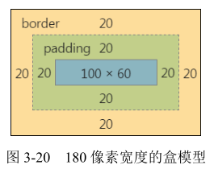

如果单看定义和表现，似乎一切都合情合理，但实际上，多年的实践告诉我，有时候，这种宽度设定和表现并不合理。我总结为以下两点。

（1）流动性丢失。

对于块状元素，如果`width:auto`，则元素会如水流般充满整个容器，而一旦设定了 width具体数值，则元素的流动性就会被阻断，因为元素给定宽度就像河流中间竖了两个大闸一样，就没有了流动性。尤其宽度作用在 content box 上，更是内外流动性全无，如图 3-21 所示。

这世界上任何事物，一旦限死了，就丧失了灵活性，其发展潜力及作用范围就会大大受限。

长江为何生机勃勃数千年，就是因为滔滔江水，奔流不息。CSS 的流动性也是其生机蓬勃之本，如果直接宽度设死，流动性丢失，在我看来，就是江河变死水，手机变板砖。这就是我提出“无宽度准则”的原因 — 布局会更灵活，容错性会更强。

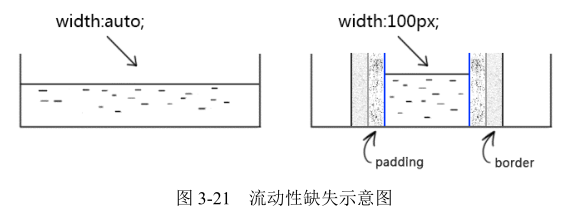

鉴于“流动性丢失”在 3.2.1 节其实已经提过，还有实例，这里就不再过多展开。

（2）与现实世界表现不一致的困扰。

包含 padding 或 border 会让元素宽度变大的这种 CSS 表现往往会让 CSS 使用者困惑：我设置宽度为 100 像素，其实是希望整个最终的宽度是 100 像素，这样才符合现实理解嘛。比方说，我买个 140m^2^ 的房子，肯定是连墙体面积在内的啊，实际使用面积比 140m^2^ 小才是现实，你说现在最终面积比140m^2^ 还大，这种事情显然是不科学不合理的。

或许是因为 CSS 2.1 是面向内容（图文信息）设计的，所以，width 设计成了直接作用在content box 上。

这对一些 CSS 新手的布局造成了一定的障碍，因为**这些 CSS 从业者眼中的 CSS 结构是砖块，而不是水流**。因此，布局讲求尺寸精确计算。这就导致在一些 CSS 属性值发生变化的时候（如 padding 值变大，元素尺寸也变大），空间不足，出现页面布局错位的问题。

那有没有什么办法能避免这种错位问题的出现呢？方法之一就是采用书写方式约束，如使用“宽度分离原则”。

### CSS 流体布局下的宽度分离原则

所谓“宽度分离原则”，就是 CSS 中的 width 属性不与影响宽度的 padding/border（有时候包括 margin）属性共存，也就是不能出现以下的组合：

~~~css
.box { width: 100px; border: 1px solid; }
~~~

或者

~~~css
.box { width: 100px; padding: 20px; }
~~~

有人可能会问：不这么写，该怎么写呢？很简单，分离，width 独立占用一层标签，而padding、border、margin 利用流动性在内部自适应呈现。

~~~javascript
.father {
	width: 180px;
}

.son {
	margin: 0 20px;
	padding: 20px;
	border: 1px solid;
}
~~~

现在关键问题来了：为何要宽度分离？

**1.为何要宽度分离**

在前端领域，一提到分离，作用一定是便于维护。比方说，样式和行为分离、前后端分离或者这里的“宽度分离”。

道理其实很简单，当一件事情的发展可以被多个因素所左右的时候，这个事情最终的结果就会变数很大而不可预期。宽度在这里也是类似，由于盒尺寸中的 4 个盒子都能影响宽度，自然页面元素的最终宽度就很容易发生变化而导致意想不到的布局发生。例如，下面这个简单的 CSS：

~~~css
.box {
	width: 100px;
	border: 1px solid;
}
~~~

此时宽度是 102 像素。然后，设计师希望元素边框内有 20 像素的留白，这时候，我们会增加padding 设置：

~~~css
.box {
	width: 100px;
	padding: 20px;
	border: 1px solid;
}
~~~

结果此时宽度变成了 142 像素，大了 40 像素，跟原来宽度差异明显，显然布局很容易出问题。为了不影响之前的布局，我们还需要通过计算减去 40 像素的 padding 大小才行：

~~~javascript
.box {
	width: 60px;  // 通过计算，减去 40 像素
	padding: 20px;
	border: 1px solid;
}
~~~

但是，如果我们使用了宽度分离，事情就会轻松很多：

~~~css
.father {
	width: 102px;
}
.son {
	border: 1px solid;
}
~~~

嵌套一层标签，父元素定宽，子元素因为 width 使用的是默认值 auto，所以会如水流般自动填满父级容器。因此，子元素的 content box 宽度就是 100 像素，和上面直接设置 width为 100 像素表现一样。

然后，同样的故事，设计师希望元素边框内有 20 像素的留白，这时候，我们会增加 padding设置：

~~~css
.father {
	width: 102px;
}

.son {
	border: 1px solid;
	padding: 20px;
}
~~~

然后……就没有然后了，宽度还是 102 像素，子元素的 content box 自动变成了 60 像素，和上面反例的表现一样。没错，自动变化了，就是这么智能！

虽然表现一样，但是写代码的人的体验却大不一样：width、padding、border 混用的时候，任何修改我们都需要实时去计算现在 width 应该设置多大才能和之前的占用的宽度一样，而后面 width 分离的实现，我们没有任何计算，要 padding 留白，加一下就好，要修改边框宽度，改一下就好，浏览器会自动计算，完全不用担心尺寸的变化。

也就是说，使用“宽度分离”后，咱们不需要烧脑子去计算了，而且页面结构反而更稳固。这么好的事情，完全没有理由拒绝啊！

**2.可能的挑战**

有人可能会提出挑战：你这“宽度分离”多使用了一层标签啊，这 HTML 成本也是成本啊！

没错，问题本身是对的。HTML 的成本也是成本，过深的嵌套是会增加页面渲染和维护成本的。但是，我这里要抛出一句话，实际上，如果不考虑替换元素，这世界上绝大多数的网页，只需要一个 width 设定就可以了，没错，只需要一个 width，就是最外层限制网页主体内容宽度的那个 width，而里面所有元素都没有理由再出现 width 设置。所以，“宽度分离”虽然多了一层标签，但最终也就多了一层标签而已，这个成本跟收益比起来简直就是毛毛雨。

但是，话又说回来，“无宽度”网页布局是需要很深的 CSS 积累才能驾驭自如的，很多同行没好好品鉴本书的内容，要是让他们完全遵循“宽度分离”来实现，怕是 HTML 会变得很啰嗦。

那有没有什么既无须计算，又无须额外嵌套标签的实现呢？有，那就是可以改变 width作用细节的 box-sizing 属性。

### 改变 width/height 作用细节的 box-sizing

box-sizing 虽然是 CSS3 属性，但是，让人受宠若惊的是 IE8 浏览器也是支持它的，不过需要加-ms-私有前缀，但 IE9 浏览器开始就不需要私有前缀了。

本书内容是针对 IE8 及以上版本浏览器的，因此，box-sizing 也加入了 CSS 世界魔法师的队伍。

**1.box-sizing 的作用**

box-sizing 顾名思义就是“盒尺寸”。稍等，前文好像也出现了一个“盒尺寸”（box dimension），咦？两者是一样的吗？我个人觉得是一样的，只是 dimension 这个词太过于官方了，用在规范中很合适，但是，要是作为 CSS 属性，拼写就不那么容易了，所以就使用了更口语化的 box-sizing。

虽然 box-sizing 被直译为“盒尺寸”，实际上，其更准确的叫法应该是“盒尺寸的作用细节”，或者说得更通俗一点，叫“width 作用的细节”，也就是说，box-sizing 属性的作用是改变 width 的作用细节。

那它改变了什么细节呢？一句话，改变了 width 作用的盒子。还记不记得“内在盒子”的 4 个盒子？它们分别是 content box、padding box、border box 和 margin box。默认情况下，width是作用在 content box 上的，box-sizing 的作用就是可以把 width 作用的盒子变成其他几个，因此，理论上，box-sizing 可以有下面这些写法：

~~~css
.box1 { box-sizing: content-box; }
.box2 { box-sizing: padding-box; }
.box3 { box-sizing: border-box; }
.box4 { box-sizing: margin-box; }
~~~

理论美好，现实残酷。实际上，支持情况如下：

~~~css
.box1 { box-sizing: content-box; } /* 默认值 */
.box2 { box-sizing: padding-box; } /* Firefox 曾经支持 */
.box3 { box-sizing: border-box; } /* 全线支持 */
.box4 { box-sizing: margin-box; } /* 从未支持过 */
~~~

所以，我只能拿 border-box 属性值做对比，如图 3-22 所示。

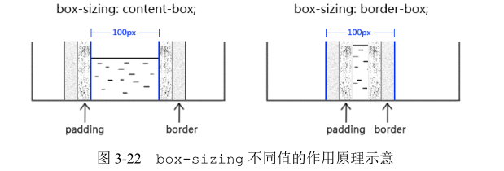

可以看到，所谓 box-sizing:border-box 就是让100 像素的宽度直接作用在 border box上，从默认的 content box 变成 border box。此时，content box 从宽度值中释放，形成了局部的流动性，和 padding 一起自动分配 width 值。于是，

~~~css
.box {
	width: 100px;
	box-sizing: border-box;
}
~~~

宽度是 100 像素，

~~~javascript
.box {
	width: 100px;
	box-sizing: border-box;
	border: 1px solid;
}
~~~

宽度也是 100 像素，

~~~javascript
.box {
	width: 100px;
	box-sizing: border-box;
	padding: 20px;
	border: 1px solid;
}
~~~

宽度还是 100 像素。

我们似乎找到了解决问题的钥匙，自从用了 box-sizing，标签层级少了，错位问题不见了，一口气写 5 张页面，不费劲。

实际上，当遭遇类似图 3-23 所示的布局时，你会发现，box-sizing 也是捉襟见肘，因为边框外的间距只能是 margin，但 box-sizing 并不支持 margin-box，若想用一层标签实现，还是需要计算！

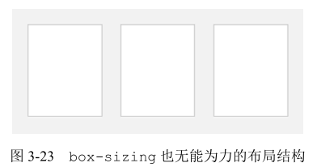

**2.为何box-sizing 不支持margin-box**

遇到这样的场景的时候，想必有人会感叹：“要是 box-sizing 支持 margin-box 就好了。”是啊，要是这样就好了，但是现实就是不支持，为什么呢？

网上有这样的说法，说 margin 在垂直方向有合并重叠特性，如果支持了 margin-box，合并规则就要发生变更，会比较复杂。我对此观点不敢苟同，其实当下很多属性可以灭掉margin 合并，多一个 box-sizing 又何妨，且浏览器厂商实现起来并不难，跟之前的规范也不冲突。

我个人认为，不支持 margin-box 最大的原因是它本身就没有价值！我们不妨好好想想，一个元素，如果我们使用 width 或 height 设定好了尺寸，请问，我们此时设置 margin值，其 offset 尺寸会有变化吗？不会啊，100 像素宽的元素，再怎么设置 margin，它还是 100 像素宽。但是，border 和 padding 就不一样了，100 像素宽的元素，设置个 20 像素大小的 padding 值，offsetWidth 就是 140 像素了，尺寸会变化。你说，一个本身并不会改变元素尺寸的盒子，它有让 box-sizing 支持的道理吗？box-sizing 就是改变尺寸作用规则的！margin 只有在 width 为 auto 的时候可以改变元素的尺寸，但是，此时元素已经处于流动性状态，根本就不需要 box-sizing。所以，说来说去就是 margin-box本身就没有价值。

另外一个原因牵扯到语义。如果box-sizing 开了先河支持了margin-box，margin box 就变成了一个“显式的盒子”，你让background-origin等属性何去何从，支持还是不支持呢？“margin的背景永远是透明的”这几个大字可是在规范写得清清楚楚，难道让背景色在所谓的margin box 中也显示？显然是不可能的，我们可以打自己的脸，但是要想让规范打自己的脸，可能吗？

最后还有一个可能的原因就是使用场景需要。对于 box-sizing 的margin-box 效果，如果是 IE10 及以上版本浏览器，可以试试 flex 布局，如果要兼容 IE8 及以上版本可以使用“宽度分离”，或者特定场景下使用“格式化宽度”来实现，也就是并不是强需求。比方`box-sizing:padding-box`，就是因为使用场景有限，仅 Firefox 浏览器支持，并且是曾经支持，从版本 50 开始也不支持了。其实，个人觉得没必要舍弃，浏览器都应该支持，就像background 属性那样。成为套餐不挺好的？

人们写代码时的思维逻辑，总是不由自主地与现实世界相映射，这是人之常情。因此，大家对`box-sizing:border-box`的好感度普遍要远大于默认的`box-sizing:content-box`，甚至我见到有同行称默认的 content-box 作用机制是反人类的，因此，很多同行开始使用`*{box-sizing:border-box}`进行全局重置，对于这种做法，我是有自己的看法的。

**3.如何评价*{box-sizing:border-box}**

从纯个人角度讲，我是不喜欢这种做法的，我一向推崇的是充分利用元素本身的特性来实现我们想要的效果，足够简单纯粹。因此，全局重置的做法是有悖我的理念的。

即使抛开个人喜好，这种做法也是有些问题的。

**（1）这种做法易产生没必要的消耗。**通配符应该是一个慎用的选择器，因为它会选择所有的标签元素。对于普通内联元素（非图片等替换元素），box-sizing 无论是什么值，对其渲染表现都没有影响，因此，对这些元素而言就是没有必要的消耗；同时有些元素，如 search类型的搜索框，其默认的`box-sizing`就是`border-box`（如果浏览器支持），因此，对search 类型的`<input>`而言也是没有必要的消耗。

**（2）这种做法并不能解决所有问题。**box-sizing 不支持`margin-box`，只有当元素没有水平 margin 时候，box-sizing 才能真正无计算，而“宽度分离”等策略则可以彻底解决所有的宽度计算的问题。因此，我们有必要好好地想一想，`box-sizing`属性发明的初衷到底是什么？是为了让那些对 block 水平元素滥用 width 属性的人少出 bug 吗？我不这么认为！

**4.`box-sizing`发明的初衷**

根据我这么多年的开发经验，在 CSS 世界中，唯一离不开`box-sizing:border-box`的就是原生普通文本框`<input>`和文本域`<textarea>`的 100%自适应父容器宽度。

拿文本域`<textarea>`举例，`<textarea>`为替换元素，替换元素的特性之一就是尺寸由内部元素决定，且无论其 display 属性值是 inline 还是 block。这个特性很有意思，对于非替换元素，如果其 display 属性值为 block，则会具有流动性，宽度由外部尺寸决定，但是替换元素的宽度却不受 display 水平影响，因此，我们通过 CSS 修改`<textarea>`的display 水平是无法让尺寸 100%自适应父容器的：

~~~css
textarea {
	display: block; /* 还是原来的尺寸 */
}
~~~

所以，我们只能通过 width 设定让`<textarea>`尺寸 100%自适应父容器。那么，问题就来了，`<textarea>`是有 border 的，而且需要有一定的 padding 大小，否则输入的时候光标会顶着边框，体验很不好。于是width/border 和 padding 注定要共存，同时还要整体宽度 100%自适应容器。如果不借助其他标签，肯定是无解的。

在浏览器还没支持 box-sizing 的年代，我们的做法有点儿类似于“宽度分离”，外面嵌套`
`标签，模拟 border 和 padding，`<textarea>`作为子元素，border 和 padding全部为 0，然后宽度 100%自适应父级`
`。

手动输入 http://demo.cssworld.cn/3/2-9.php 或者扫右侧的二维码。

然而，这种模拟也有局限性，比如无法使用:focus 高亮父级的边框，因为 CSS 世界中并无父选择器，只能使用更复杂的嵌套加其他 CSS 技巧来模拟。

因此，说来说去，也就`box-sizing:border-box`才是根本解决之道！

~~~css
textarea {
	width: 100%;
	-ms-box-sizing: border-box; /* for IE8 */
	box-sizing: border-box;
}
~~~

在我看来，box-sizing 被发明出来最大的初衷应该是解决替换元素宽度自适应问题。如果真的如我所言，那`*{box-sizing:border-box}`是不是没用在点儿上呢？是不是应该像下面这样 CSS 重置才更合理呢？

~~~css
input, textarea, img, video, object {
	box-sizing: border-box;
}
~~~

### 相对简单而单纯的 height:auto

width 和 height 是 CSS 世界中同一类型魔法师，都是直接限定元素尺寸的。所以，它们共用一套“盒尺寸”模型，`box-sizing`的解释也是类似的。但是，它们在不少地方还是有明显区别的，其中之一就是`height:auto`要比 `width:auto`简单而单纯得多。

原因在于，CSS 的默认流是水平方向的，宽度是稀缺的，高度是无限的。因此，宽度的分配规则就比较复杂，高度就显得比较随意。比方说，小明没钱交房租而去搬砖，一块砖头 5 cm高，请问，10 块砖摞在一起多高？很简单，50 cm。`height:auto`的表现也基本上就是这个套路：有几个元素盒子，每个多高，然后一加，就是最终的高度值了。

当然，涉及具体场景，就会有其他的小故事，比方说元素 float 容器高度没了，或者是margin 直接穿过去，高度比预期的矮了。这个其实不是 height 的问题。关于这一点，我会在对应的属性章节帮大家一探究竟。

此外，height:auto 也有外部尺寸特性。但据我所知，其仅存在于绝对定位模型中，也就是“格式化高度”。“格式化高度”与“格式化宽度”类似，就不展开讲解了。

### 关于 height:100%

height 和 width 还有一个比较明显的区别就是对百分比单位的支持。对于 width 属性，就算父元素 width 为 auto，其百分比值也是支持的；但是，对于 height 属性，如果父元素height 为 auto，只要子元素在文档流中，其百分比值完全就被忽略了。例如，某小白想要在页面插入一个`
`，然后满屏显示背景图，就写了如下 CSS：

~~~css
div {
	width: 100%; /* 这是多余的 */
	height: 100%; /* 这是无效的 */
	background: url(bg.jpg);
}
~~~

然后他发现这个`
`高度永远是 0，哪怕其父级`<body>`塞满了内容也是如此。事实上，他需要如下设置才行：

~~~css
html, body {
	height: 100%;
}
~~~

并且仅仅设置`<body>`也是不行的，因为此时的`<body>`也没有具体的高度值：

~~~css
body {
	/* 子元素 height:100%依旧无效 */
}
~~~

只要经过一定的实践，我们都会发现对于普通文档流中的元素，百分比高度值要想起作用，其父级必须有一个可以生效的高度值！但是，怕是很少有人思考过这样一个问题：为何父级没有具体高度值的时候，height:100%会无效？

**1.为何 height:100%无效**

## CSS min-width/max-width 和 min-height/max-height 二三事

## 内联元素

如果纯粹套 CSS 规范的话，这里标题应该是“内联级元素”（inline-level elements）。但在本书中“内联级元素”全部简称为“内联元素”，原因在第 3 章开头部分已做说明，不再赘述。

在讲元素的内外盒子的时候，前面曾提到过“外在盒子”有 inline、block 和 run-in三种水平。其中 run-in 鲜有人使用，且有淘汰风险，可以忽略；**剩下的 inline 和 block几乎瓜分了剩下的全部江山，是流体布局的本质所在**。从作用上来讲，**块级负责结构，内联负责内容**。CSS 世界是为图文展示而设计的。所谓图文，指图片和文字，是最典型的内联元素。

所以，在 CSS 世界中，内联元素是最为重要的，涉及的 CSS 属性也非常之多，这些 CSS 属性往往具有继承特性，混合在一起会导致 CSS 解析规则非常复杂。这就是**内联元素的解析比块级元素解析更难理解的原因** ——其是多个属性共同作用的结果，需要对内联元素特性，内联盒模型以及当前 CSS 属性都了解，才能明白其中的原因。

不要担心，从这里开始，我们会慢慢揭开内联世界的层层面纱。

### 哪些元素是内联元素

我们先来了解如何辨别内联元素。

**1.从定义看**

首先要明白这一点：“内联元素”的“内联”特指“外在盒子”，和“display 为 inline的元素”不是一个概念！inline-block 和 inline-table 都是“内联元素”，因为它们的“外在盒子”都是内联盒子。自然 display:inline 的元素也是“内联元素”，那么，`<button>`按钮元素是内联元素，因为其 display 默认值是 inline-block；**``图片元素也是内联**
**元素，因为其 display 默认值是 inline 等**。

**2.从表现看**

就行为表现来看，“内联元素”的典型特征就是可以和文字在一行显示。因此，文字是内联元素，图片是内联元素，按钮是内联元素，输入框、下拉框等原生表单控件也是内联元素。

下面有一个疑问：浮动元素貌似也是可以和文字在一个水平上显示的，是不是浮动元素也是内联级别的呢？不是的。实际上，浮动元素和后面的文字并不在一行显示，浮动元素已经在文档流之外了。证据就是，当后面文字足够多的时候，文字并不是在浮动元素的下面，而是继续在后面。这就说明，浮动元素和后面文字不在一行，只是它们恰好站在了一起而已。真相是，浮动元素会生成“块盒子”，这就是后话了。

### 内联世界深入的基础 — 内联盒模型

本节的内容可谓 CSS 进阶标志知识点，是入门 CSS 开发人员和熟练 CSS 开发人员之间的分水岭，是需要反复拿来看拿来体味的。这里介绍的“内联盒模型”是简易版，但是已经足够，如果大家对完整的概念和名词感兴趣，可以阅读规范文档。

下面是一段很普通的 HTML：

~~~html

这是一行普通的文字，这里有个 <em>em</em> 标签。

~~~

看似普通，实际上包含了很多术语和概念，或者换种通俗的说法，包含了很多种盒子。我归结为下面这些盒子。

**（1）内容区域（content area）**

内容区域指一种围绕文字看不见的盒子，其大小仅受字符本身特性控制，本质上是一个字符盒子（character box）；但是有些元素，如图片这样的替换元素，其内容显然不是文字，不存在字符盒子之类的，因此，对于这些元素，内容区域可以看成元素自身。

定义上说内容区域是“看不见的”，这对理解“内容区域”是不利的，好在根据我多年的理解与实践，我们可以把文本选中的背景色区域作为内容区域，例如，如图 3-28 所示。

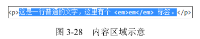

这对于解释各种内联相关的行为都非常可行，文本选中区本质上就等同于基本盒尺寸中的content box，都是 content，语义上也说得通。

实际上，内容区域并没有明确的定义，所以将其理解为em 盒（em-box，可看成是中文字符占据的 1 em 高度区域）也是可以的，但是在本书中，为了方便演示和讲解，将其全部理解为文本选中的区域。

在 IE 和 Firefox 浏览器下，文字的选中背景总能准确反映内容区域范围，但是 Chrome 浏览器下，::selection 范围并不总是准确的，例如，和图片混排或者有垂直 padding 的时候，范围会明显过大，这一点需要注意。后面行高等章节会利用此选中背景帮助我们理解。

> 这个张鑫旭又开始自嗨了。

内容区域在解释内联元素的各种行为表现时，出镜率出奇地高，建议大家这里多多留意。

**（2）内联盒子（inline box）**

“内联盒子”不会让内容成块显示，而是排成一行，这里的“内联盒子”实际指的就是元素的“外在盒子”，用来决定元素是内联还是块级。该盒子又可以细分为“内联盒子”和“匿名内联盒子”两类：

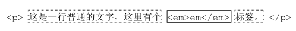

如果外部含内联标签（``、`<a>`和`<em>`等），则属于“内联盒子”（实线框标注）；如果是个光秃秃的文字，则属于“匿名内联盒子”（虚线框标注）。

需要注意的是，并不是所有光秃秃的文字都是“匿名内联盒子”，其还有可能是“匿名块级盒子”，关键要看前后的标签是内联还是块级。

**（3）行框盒子（line box）**

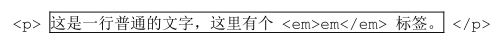

每一行就是一个“行框盒子”（实线框标注），每个“行框盒子”又是由一个一个“内联盒子”组成的。

**（4）包含盒子（containing box）**

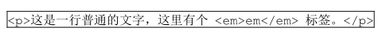

`
`标签就是一个“包含盒子”（实线框标注），此盒子由一行一行的“行框盒子”组成。

需要补充说明一点，在 CSS 规范中，并没有“包含盒子”的说法，更准确的称呼应该是“包含块”（containing block）。这里之所以把它称为盒子，一是为了与其他盒子名称统一，二是称为盒子更形象、更容易理解。

### 幽灵空白节点

“幽灵空白节点”是内联盒模型中非常重要的一个概念，具体指的是：在 HTML5 文档声明中，内联元素的所有解析和渲染表现就如同每个行框盒子的前面有一个“空白节点”一样。这个“空白节点”永远透明，不占据任何宽度，看不见也无法通过脚本获取，就好像幽灵一样，但又确确实实地存在，表现如同文本节点一样，因此，我称之为“幽灵空白节点”。

注意，这里有一个前提，文档声明必须是 HTML5 文档声明（HTML 代码如下），如果还是很多年前的老声明，则不存在“幽灵空白节点”。

~~~html
<!doctype html>
<html>
~~~

我们可以举一个最简单的例子证明“幽灵空白节点”确实存在， CSS 和 HTML 代码如下：

~~~css
div {
	background-color: #cd0000;
}
span {
	display: inline-block;
}

~~~

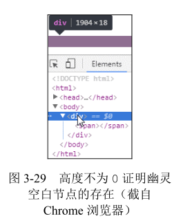

结果，此`
`的高度并不是 0，而是如图 3-29 所示有高度。这着实很奇怪，内部的``元素的宽高明明都是 0，标签之间也没有换行符之类的嫌疑，怎么`
`的高度会是图3-29 中所示的 18 像素呢？

作祟的就是这里的“幽灵空白节点”，如果我们认为在``元素的前面还有一个宽度为 0 的空白字符，是不是一
切就解释得通呢？

当然，为何高度是 18 像素这里三言两语是解释不清的，可以看后面对 line-height 和`vertical-align`的深入讲解，这里只是为了证明“幽灵空白节点”确实是存在的。

虽然说“幽灵空白节点”是我自己根据 CSS 的特性表现起的一个非常形象的名字，但其绝不是空中楼阁、信口胡诌的。规范中实际上对这个“幽灵空白节点”是有提及的，“幽灵空白节点”实际上也是一个盒子，不过是个假想盒，名叫“strut”，中文直译为“支柱”，是一个存在于每个“行框盒子”前面，同时具有该元素的字体和行高属性的 0 宽度的内联盒。规范中的原文如下：

> Each line box starts with a zero-width inline box with the element’s font and line height properties. We call that imaginary box a “strut”.

明白“幽灵空白节点”的存在是理解后续很多内联元素为何会这么表现的基础。

# 第4章：盒尺寸四大家族

盒尺寸中的 4 个盒子 content box、padding box、border box 和 margin box 分别对应 CSS 世界中的content、padding、border 和 margin 属性，我把这 4 个属性称为“盒尺寸四大家族”，下面我们一个一个揭开“四大家族”鲜为人知的一面。

## 深入理解 content

### content 与替换元素

**1.什么是替换元素**

替换元素（replaced element）可以说是 CSS 世界中的另外一个派系。

根据“外在盒子”是内联还是块级我们可以把元素分为内联元素和块级元素，而根据是否具有可替换内容，我们也可以把元素分为替换元素和非替换元素。那什么是替换元素呢？

替换元素，顾名思义，内容可以被替换。举个典型的例子：

~~~css

~~~

如果我们把上面的`1.jpg`换成`2.jpg`，是不是图片就会替换了？

这种通过修改某个属性值呈现的内容就可以被替换的元素就称为“替换元素”。因此，``、`<object>`、`<video>`、`<iframe>`或者表单元素`<textarea>`和`<input>`都是典型的替换元素。

替换元素除了内容可替换这一特性以外，还有以下一些特性。

**（1）内容的外观不受页面上的 CSS 的影响**

用专业的话讲就是在样式表现在 CSS 作用域之外。如何更改替换元素本身的外观？需要类似 appearance 属性，或者浏览器自身暴露的一些样式接口，例如`::-ms-check{}`可以更改高版本 IE 浏览器下单复选框的内间距、背景色等样式，但是直接 `input[type='checkbox']{}`却无法更改内间距、背景色等样式。

**（2）有自己的尺寸**

在 Web 中，很多替换元素在没有明确尺寸设定的情况下，其默认的尺寸（不包括边框）是 300 像素×150 像素，如`<video>`、`<iframe>`或者`<canvas>`等，也有少部分替换元素为 0 像素，如``图片，而表单元素的替换元素的尺寸则和浏览器有关，没有明显的规律。

**（3）在很多 CSS 属性上有自己的一套表现规则**

比较具有代表性的就是`vertical-align`属性，对于替换元素和非替换元素，`vertical-align`属性值的解释是不一样的。比方说`vertical-align`的默认值的 baseline，很简单的属性值，基线之意，被定义为字符 x 的下边缘，在西方语言体系里近乎常识，几乎无人不知，但是到了替换元素那里就不适用了。为什么呢？因为替换元素的内容往往不可能含有字符 x，于是替换元素的基线就被硬生生定义成了元素的下边缘。

下面提个简单问题：下拉框`<select>`是不是替换元素？答案：是的。

我们可以对照一下“替换元素”的一些特点：首先，内容可替换，例如我们设置 multiple属性，下拉直接变成了展开的直选多选模式；其次，基本样式外部 CSS 很难改变；最后，它有自己的尺寸，基线也是下边缘等。

**2.替换元素的默认 display 值**

[block，inline 和 inline-block 的实际应用](https://juejin.cn/post/6844903474702843917)

**所有的替换元素都是内联水平元素**，也就是替换元素和替换元素、替换元素和文字都是可以在一行显示的。但是，替换元素默认的 display 值却是不一样的，见表 4-1。

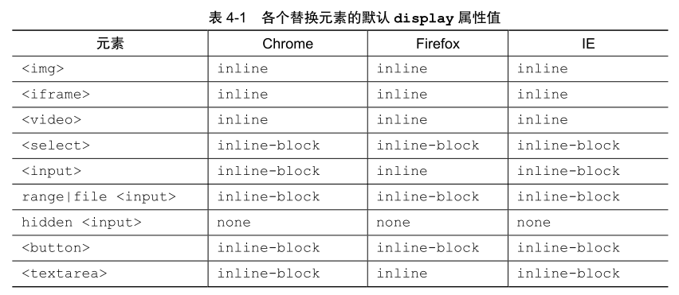

通过对比发现，IE 浏览器和 Chrome 浏览器的返回值都是一样的，但是 Firefox 浏览器在`<textarea>`和绝大多数类型的`<input>`元素上却是返回的inline而不是`inline-block`，这其实是一个很奇怪也很有意思的现象。为什么说奇怪呢？我们都知道下面两种按钮元素的表示方法尺寸长相是一模一样的：

~~~css
<input type="button" value="按钮">
<button type="button">按钮</button>
~~~

但是在 Firefox 下，前者的 display 属性默认值是 inline，后者却是inline-block，很自然会奇怪明明一个模子里出来的，怎么会有这个区别呢？

实际上，如果我们深入探究就会发现，似乎 Firefox 浏览器在替换元素的内联表现这一块还是有些自己的想法的。

首先回答一下这个疑问：`<input>`和`<button>`按钮的区别在什么地方？区别在于两种按钮默认的 white-space 值不一样，前者是 pre，后者是 normal，所表示出来的现象差异就是：当按钮文字足够多的时候，`<input>`按钮不会自动换行，`<button>`按钮则会。

当然，这并不是 Firefox 浏览器下两种按钮默认 display 值不一样的原因，那究竟是什么原因呢？我仔细对比了一下，发现没有规律可言，原因恐怕只有浏览器厂商自己才知道了。当然，抛出此问题的目的不是得出这里略显敷衍的答案，而是为了引出下面的重要内容，也就是：我们没有必要深究为什么一个是 inline 一个是 inline-block，因为对于替换元素而言，这是没有意义的。为什么这么说呢？替换元素有很多表现规则和非替换元素不一样，其中之一是宽度和高度的尺寸计算规则，简单描述一下就是，替换元素的 display 是 inline、block和 inline-block 中的任意一个，其尺寸计算规则都是一样的。

**3.替换元素的尺寸计算规则**

我个人将替换元素的尺寸从内而外分为 3 类：固有尺寸、HTML 尺寸和 CSS 尺寸。

（1）固有尺寸指的是替换内容原本的尺寸。例如，图片、视频作为一个独立文件存在的时候，都是有着自己的宽度和高度的。这个宽度和高度的大小就是这里的“固有尺寸”。对于表单类替换元素，“固有尺寸”可以理解为“不加修饰的默认尺寸”。比方说，你在空白页面写上
`<input>`，此时的尺寸就可以看成是`<input>`元素的“固有尺寸”。这就是输入框、下拉框这些表单元素默认的 font-size/padding/margin 等属性全部使用 px 作为单位的原因，因为这样可以保证这些元素的“固有尺寸”是固定大小，不会受外界 CSS 的影响。

（2）HTML 尺寸这个概念略微抽象，我们不妨将其想象成水煮蛋里面的那一层白色的膜，里面是“固有尺寸”这个蛋黄蛋白，外面是“CSS 尺寸”这个蛋壳。“HTML 尺寸”只能通过HTML 原生属性改变，这些 HTML 原生属性包括``的 width 和 height 属性、`<input>`的 size 属性、`<textarea>`的 cols 和 rows 属性等。

~~~css

<input type="file" size="30">
<textarea cols="20" rows="5></textarea>
~~~

（3）CSS 尺寸特指可以通过 CSS 的 width 和 height 或者`max-width/min-width`和`max-height/min-height`设置的尺寸，对应盒尺寸中的 content box。

可以影响替换元素尺寸的 3 层结构如图 4-1 所示。这 3 层结构的计算规则具体如下。

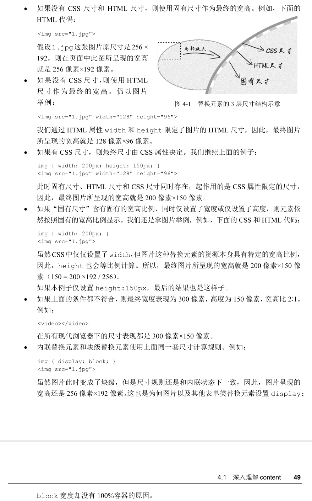

如果单看规则，似乎面面俱到，无懈可击。但是，实际上，意外还是发生了，这个意外就是最常用的``元素。如果任何尺寸都没有，则元素应该是 300 像素×150 像素，这条规则`<video>`、`<canvas>`和`<iframe>`这些元素都符合，唯独图片例外。如下：

~~~css

~~~

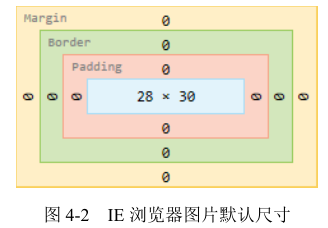

这段 HTML 表示一个没有替换内容也没有尺寸设定的裸露的``元素。按照规范尺寸应该是300 像素×
150 像素，结果不仅不是这个尺寸，而且各个浏览器下的尺寸还不一样。IE 浏览器下是 28×30，如图 4-2 所示。
Chrome 浏览器下是 0×0，如图 4-3 所示。Firefox 浏览器下显示的是 0×22，如图 4-4 所示。

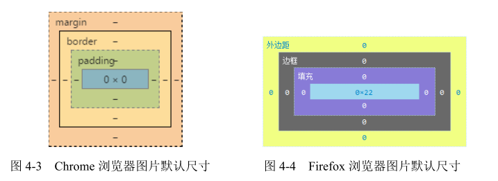

其实尺寸不一样不打紧，因为我们平时使用都会设置尺寸，不可能像这样放任不管，但是，如果表现型也不一样，那就麻烦了。我们从一个常用功能的前端小技巧说起。

Web 开发的时候，为了提高加载性能以及节约带宽费用，首屏以下的图片就会通过滚屏加载的方式异步加载，然后，这个即将被异步加载的图片为了布局稳健、体验良好，往往会使用一张透明的图片占位。例如：

~~~css

~~~

实际上，这个透明的占位图片也是多余的资源，我们直接：

~~~css

~~~

然后配合下面的 CSS 可以实现一样的效果：

~~~css
img { visibility: hidden; }
img[src] { visibility: visible; }
~~~

注意，这里的``直接没有 src 属性，再强调一遍，是直接没有，不是`src=""`，`src=""`在很多浏览器下依然会有请求，而且请求的是当前页面数据。当图片的 src 属性缺省的时候，图片不会有任何请求，是最高效的实现方式。

理论再次无懈可击，然而，正如之前提到的，“似乎 Firefox 浏览器在替换元素的内联表现这一块还是有些自己的想法的”。对于 Firefox 浏览器，src 缺省的``不是替换元素，而是一个普通的内联元素，所以使用的就不是替换元素的尺寸规则，而是类似``的内联元素尺寸规则，宽高会无效。因此：

# 第5章：内联元素与流

## 字母 x — CSS 世界中隐匿的举足轻重的角色

## 内联元素的基石 line-height

本节中 line-height 的内容会涉及很多内联盒模型的知识，因此，务必先要掌握 3.4.2节关于内联盒模型的知识。另外，下文中所有的“行高”指的就是`line-height`。

### 内联元素的高度之本 — line-height

先思考下面这个问题：默认空`
`高度是 0，但是一旦里面写上几个文字，`
`高度就有了，请问这个高度由何而来，或者说是由哪个 CSS 属性决定的？

如果仅仅通过表象来确认，估计不少人会认为`
`高度是由里面的文字撑开的，也就是`font-size`决定的，但本质上是由`line-height`属性全权决定的，尽管某些场景确实与`font-size`大小有关。

我们不妨设计一个简单的例子来看看真相究竟是什么。例如：

~~~css

我的高度是？

.test1 {
	font-size: 16px;
	line-height: 0;
	border: 1px solid #ccc;
	background: #eee;
}
~~~

和

~~~css

我的高度是？

.test1 {
	font-size: 0;
	line-height: 16px;
	border: 1px solid #ccc;
	background: #eee;
}
~~~

这两段代码的区别在于一个 line-height 行高为 0，一个 font-size 字号为 0。结果，第一段代码，最后元素的高度只剩下边框那么丁点儿，而后面一段代码，虽然文字小到都看不见了，但是 16px 的内部高度依然坚挺，如图 5-6 所示。

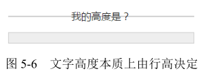

很显然，从上面这个例子可以看出，**`
`高度是由行高决定的，而非文字**。

眼见为实，手动输入 http://demo.cssworld.cn/5/2-1.php 或者扫右侧的二维码。

下面要说一些很有意思的结论，对于非替换元素的纯内联元素，其可视高度完全由 line-height 决定。注意这里的措辞 — “完全”，什么padding、border 属性对可视高度是没有任何影响的，这也是我们平常口中的“盒模型”约定俗成说的是块级元素的原因。

因此，对于文本这样的纯内联元素，line-height 就是高度计算的基石，用专业说法就是指定了用来计算行框盒子高度的基础高度。比方说，line-height 设为16px，则一行文字高度是 16px，两行就是 32px，三行就是 48px，所有浏览器渲染解析都是这个值，1 像素都不差。

那如果是替换元素，又或者是块级元素，line-height 在其中又扮演什么角色呢？

在回答这个问题之前，我们最好先把 line-height 作用于内联元素的细节给搞明白。

通常，line-height 的高度作用细节都是使用“行距”和“半行距”来解释的。那么什么是“行距”，什么又是“半行距”呢？

首先大家需要明确这一点：字体设计以及文字排版是门很深入的学问，英文和中文又有很多不同之处，但是，我们平常构建页面无须如此事无巨细的知识。因此，这里只简单介绍部分知识，方便大家理解某些行为和特性，更多内容会在第 8 章中披露。

我个人是这么认为的：内联元素的高度由固定高度和不固定高度组成，这个不固定的部分就是这里的“行距”。换句话说，line-height 之所以起作用，就是通过改变“行距”来实现的。

中国古代四大发明之一的活字印刷术使用的是雕刻好的胶泥字模，大家可以回忆一下北京奥运会开幕式上活字印刷术表演中那些凸起的方块，它使用的字体是宋体，注意，是宋体。然而，如果这些方块都是密密麻麻无缝隙铺在一
起，印出来的文字就是方方正正的一团，那么我们会无法一眼看出应该横着读还是竖着念。要知道古人的排版是竖排的，但我们去看古人的印刷作品却不会错误地横着看，为什么呢？因为印出来的文字垂直方向确实一个接着一个，但是，水平方向，列与列之间却有着明显的间隙，如图 5-7所示，这个间隙其实就是“行距”。

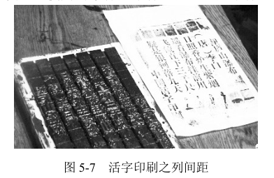

所以，“行距”的作用是可以瞬间明确我们的阅读方向，让我们阅读文字更轻松。在 CSS 世界中，“行距”其实也是类似的东西，但还是有些差别的。以水平阅读流举例，传统印刷的“行距”是上下两行文字之间预留的间隙，是个独立的区域，也就意味着第一行文字的上方是没有“行距”的；但是在 CSS 中，“行距”分散在当前文字的上方和下方，也就是即使是第一行文字，其上方也是有“行距”的，只不过这个“行距”的高度仅仅是完整“行距”高度的一半，因此，也被称为“半行距”。

人总是先入为主，尤其是前端人员，排版知识的获取基本上都是从 CSS 实际工作中来，就会很自然地认为“间距就是应该上下等分啊”，实际上太天真了，且先不说传统印刷的“行距”在中间，著名的排版软件 Adobe InDesign 的“行距”就是加在文字上方的，所以没有什么理所当然。

现在知道了 CSS 的“半行距”，那么哪里到哪里才是“半行距”的高度范围呢？一般业界的共识是：行距 = 行高− em-box。转换成 CSS 语言就是：`行距 = line-height - font-size`。其中 em-box 是 CSS 世界中比较虚的一个概念，说“虚”并不是胡编乱造的意思，而是我们无法有效感知这个盒子具体的位置在哪里，但是有一点可以明确，就是其高度正好就是 1em。em是一个相对 font-size 大小的 CSS 单位，因此 1em 等用于当前一个 font-size 大小，这就是`“行距 = line-height - font-size”`这个公式的由来。有了“行距”，我们一分为二，就有了“半行距”，分别加在 em-box 上面和下面就构成了文字的完整高度了。话虽这么讲，但一旦不弄清楚 em-box 究竟在什么位置，我们就无法在脑中形成关于行高的具象认知，知识很容易遗忘。

人很容易被肉眼所见的东西迷惑，因此，很多人会把文字图形区域看成是 em-box 范围，实际上这是不正确的，比方说，一些带尾巴的英文字符 q 或者 g，其小尾巴是在 em-box 范围之外的，而对于汉字，很多字体图形高度实际上要小于 em-box 高度的。

此时，就轮到内容区域（content area）出马了。在本书中，内容区域可以近似理解为 Firefox/IE浏览器下文本选中带背景色的区域。这么理解的重要原因之一就是可见，这对于我们深入理解内联元素知识非常有帮助。

大多数场景下，内容区域和 em-box 是不一样的，内容区域高度受 font-family 和font-size 双重影响，而 em-box 仅受 font-size 影响，通常内容区域高度要更高一些。除了下面这种情况，也就是“当我们的字体是宋体的时候，内容区域和 em-box 是等同的”，因为宋体是一种正统的印刷字体，方方正正，所以千万不要小看宋体。

于是，利用我们平常不待见的宋体，就能准确揪出“半行距”的藏身之所了，测试代码如下：

~~~css
.test {
	font-family: simsun;
	font-size: 24px;
	line-height: 36px;
	background-color: yellow;
}

.test > span {
	background-color: white;
}

	sphinx

~~~

此时，平常虚无的 em-box 借助内容区域（图 5-8 中字符 sp 的选中区域）暴露出了庐山真面目，“半行距”也准确显现出来了，如图 5-8 右侧标注。

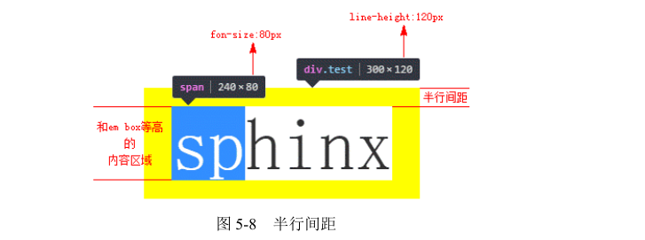

眼见为实，手动输入 http://demo.cssworld.cn/5/2-2.php。

学习基础理论知识的好处之一就是可以更准确地进行技术实践，比方说这里，我们知道“半行距”的位置和范围，就可以更准确地帮助我们还原设计。

可能是由于 CSS 开发人员不够专注细致，外加规范设计本身的原因，设计师往往会对各个元素间的距离间隙标注得很清晰。但是，设计师并不是开发人员，他们并没有把网页中无处不在行间距考虑在内，所有与文字相关的间距都是从文字的上边缘和下边缘开始标注的。除非我们全局行高设置为 line-height:1，否则这些标注的距离和我们使用的 margin 间距都是不一致的。

但是，如果我们理解了半行距，结合我们网页中的设置的 line-height 大小，就能根据标注获取准确的间距值。举个例子，假设 line-height 是 1.5，font-size 大小是 14px，那么我们的半行距大小就是（套用上面的行距公式再除以 2）：(14px * 1.5 - 14px) / 2= 14px * 0.25 = 3.5px。border 以及 line-height 等传统 CSS 属性并没有小数像素
的概念（从 CSS3 动画的细腻程度可以看出），因此，这里的 3.5px 需要取整处理，如果标注的是文字上边距，则向下取整；如果是文字下边距，则向上取整，因为绝大多数的字体在内容区域中都是偏下的。所以，假设设计师标注了文字字形上边缘到图片下边缘间距 20px，则我们实际的 margin-top 值应该是 17px，因为 3.5px 向下取整是 3px。

下面回到最初的问题，line-height如何通过改变行距实现文字排版？当line-height设为 2 的时候，半行距是一半的文字大小，两行文字中间的间隙差不多一个文字尺寸大小；如果 line-height 大小是 1 倍文字大小，则根据计算，半行距是 0，也就是两行文字会紧密依偎在一起；如果 line-height 值是 0.5，则此时的行距就是负值，虽然 line-height 不支持负值，但是行距可以为负值，此时，两行文字就是重叠纠缠在一起。具体表现如图 5-9 所示。
图 5-9 有对应的实例页面，有兴趣的话可以手动输入 http://demo.cssworld.cn/5/2-3.php 或者扫下面的二维码。

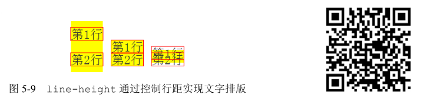

说完了内联元素，下面轮到替换元素和块级元素了。

关于替换元素的高度与 line-height 的关系首先需要弄明白这个问题：line-height可以影响替换元素（如图片的高度）吗？答案是，不可以！

可能有人会反驳了，不会呀，你看下面这个例子：

~~~css
.box {
	line-height: 256px;
}

	

~~~

`
`元素中，就一张图片，其他什么都没有，但此时.box 元素高度却是 256px，难道不是`line-height`把图片占据的高度变高了吗？

