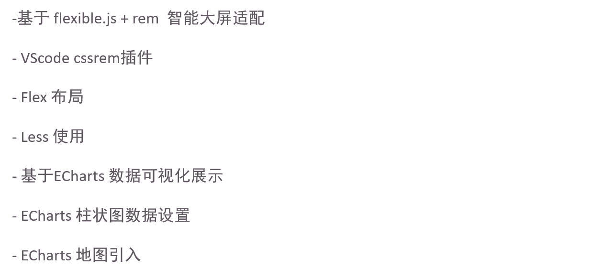
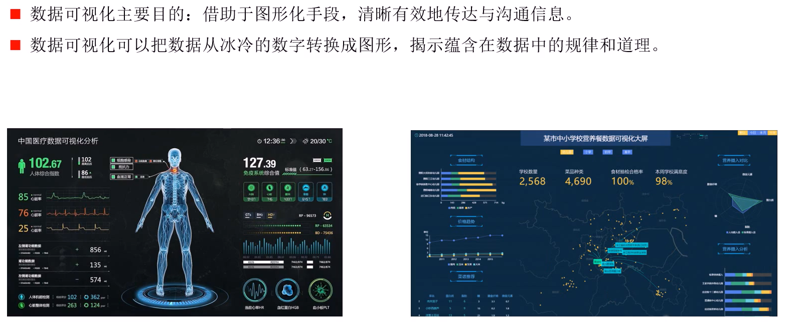
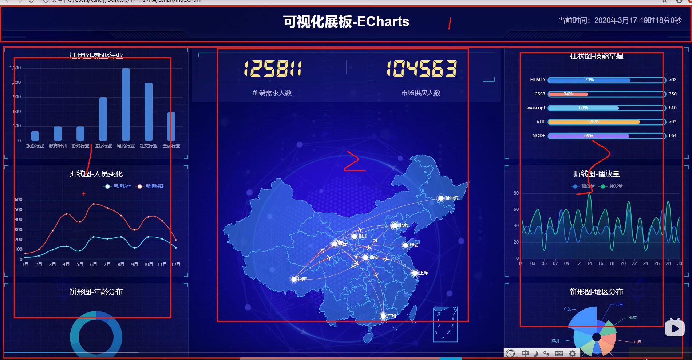

(注1：这个是pink老师讲的大屏数据可视化项目视频，主要技术栈就是ECharts和Flexible.js库。)

(注2：[视频链接](https://www.bilibili.com/video/BV1k64y1T7Tj?from=search&seid=8277476880243536328))

# 课程技术栈

# 数据可视化介绍

 

#  可视化适配方案

* 我们先讲布局，再讲可视化如何应用。

   

# 可视化项目头部制作

* 上面是一个大盒子，肯定有一个高度，里面放一个标题，右边是当前时间，采取定位的方式做。
* 

