(注1：从自己的第一个静态页面开始，就要注意代码规范化。[代码书写习惯推荐](<http://imweb.github.io/rule/>))

(注2：现在是6月13日，这2个月没有看前端，学了一些七七八八的东西，现在开始收收心，重新开始学习吧)

(注3：现在是6月15日，估计是很久没有学CSS了，静态页面自己独立写发现也写不下去了，自己硬写也是十分的浪费时间，不然还是看着视频再重新学习几个静态页面吧。)

(注4：现在是2021年1月25日，我已经很久没有自己独立写过CSS了，准备把以前写过的静态页面再复习一遍，刚开始估计不看"标准答案"肯定是写不出来的，不过没关系，这个主要原因就是自己代码写少了导致的，等自己以后写个二十多个静态页面出来以后，怎么说也是能够熟能生巧的吧！)

(注5：这些都只是一些静态页面，通过写静态页面锻炼一下自己的基本功，巩固一下HTML和CSS有关的知识点。)

(注6：不行，刚开始我必须要完全自己独立写，千万不要去看"参考答案"，否则自己的基本功永远也不可能扎实的！！)

(注7：做这些项目时一定要沉下心来，不要急，慢慢做，遇到不会的或者不熟悉的，就立刻停下来，搜索相关知识点。)

# 概述

云道页面是我19年8月开始学CSS时接触的第一个较大的静态页面，而今5个月过去了，现在到了检验学习成果的时候了。主要原则是：不能边做边翻“参考答案”，要自己独立去做，遇到卡壳的地方记录下来，就假装自己在做项目一样。静态页面是基本功，我希望自己可以独立做20多个静态页面出来，让自己的CSS达到熟练的地步。

# 成品预览

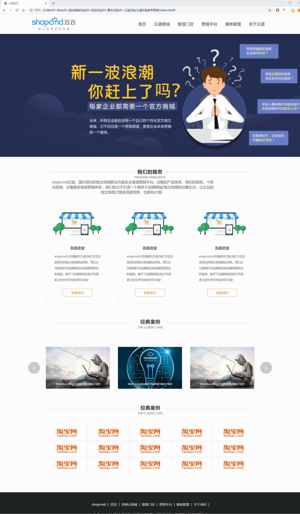

# 文件构成

主要分成3个文件夹

* images文件夹放图片

* `index.html`文件写结构

* `CSS`文件夹写样式

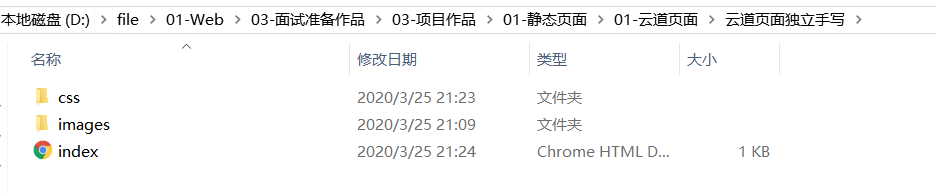

# 前端部分规范概述

~~~
头：header
导航：nav
内容：content/container
侧栏：sidebar
左右中：left right center
页面主体：main
页脚：footer
~~~

# 布局分析

从上往下大概可以分成6个部分：

* 导航栏(高：100px)

* 轮播图大图片(高：620px)

* 我们的服务部分

* 经典案例：轮播图部分

* 经典案例：表格部分

* 尾部部分

# 布局盒子先写出来,确定版心

* 使用PS打开新版首页.psd文件（在公司里由UI传给前端，做成静态页面），获取各种距离、长度等参数

* 首先把6个部分的长度先获取出来，再确定一下版心。
  * 版心大概为1050px

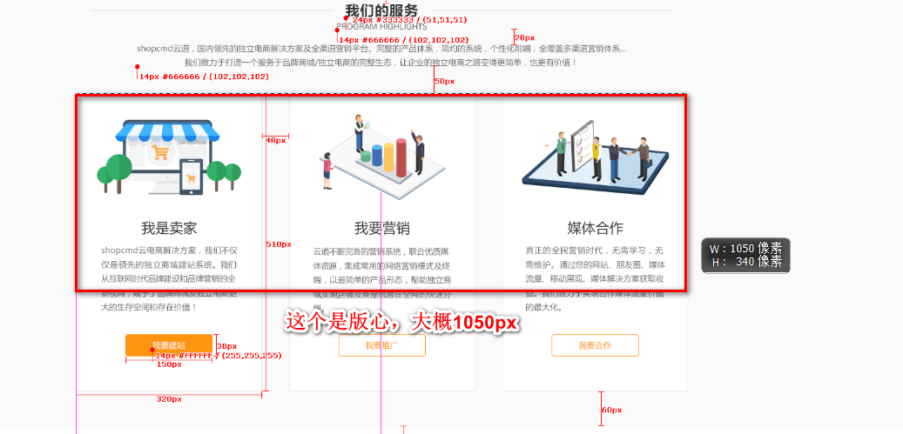

# 导航栏盒子模拟

~~~html
<!DOCTYPE html>
<html lang="en">
<head>
	<meta charset="UTF-8">
	<title>Document</title>
	
</head>
<body>
	

		

		

			
		

	

</body>
</html>
~~~

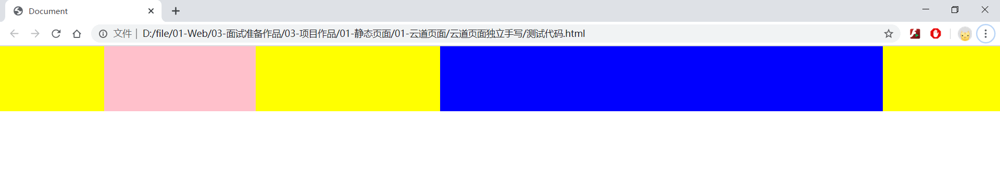

# 步骤1：写导航栏

[如何将ps首选单位从厘米设置为像素?](<https://www.jb51.net/photoshop/476877.html>)

[line-height与vertical-align：简单的属性不简单](https://juejin.cn/post/6844903608081727495)

[用Margin还是用Padding](https://www.cnblogs.com/ilinuxer/p/5814687.html)

> **margin是用来隔开元素与元素的间距；padding是用来隔开元素与内容的间隔。margin用于布局分开元素使元素与元素互不相干；padding用于元素与内容之间的间隔，让内容（文字）与（包裹）元素之间有一段“呼吸距离”**

导航栏高度为100px，宽度为通览。

导航栏分为左右两部分，左边是一张图片，带有链接，点击可以回到首页。右边是6个文字导航。

~~~html
<!DOCTYPE html>
<html lang="en">
<head>
	<meta charset="UTF-8">
	<title>Document</title>
</head>
<body>
	<!--  -->
	<!-- 引入外部CSS文件都忘了，上面的引用是错误的,引JavaScript才用script-->
	<link rel="stylesheet" href="css/index.css">
	<!-- 步骤1：写导航栏 -->
	

		

			
		

		

			<ul>
				<li><a href="#">首页</a></li>
				<li><a href="#">云道商城</a></li>
				<li><a href="#">智慧门店</a></li>
				<li><a href="#">营销平台</a></li>
				<li><a href="#">媒体联盟</a></li>
				<li><a href="#">关于云道</a></li>
			</ul>
		
	
	

</body>
</html>
~~~

~~~css
*{
			margin: 0;
			padding: 0;
		}
		.nav{
			/*width: 400px;*/
			height: 100px;
			/*display: inline-block;*/
			/*position: absolute;*/
			background-color: #FFF;
		}
		.logo{
			background-color: pink;
			width: 223px;
			height: 100px;
			float: left;
			margin-left: 160px;

		}
		.text-nav{
			/*background-color: blue;*/
			width:680px;
			height: 100px;
			height: 100px;
			float:right;
			margin-right: 180px;
		}

		.text-nav ul li{
			list-style: none;
		}

		.text-nav ul li a{
			text-decoration: none;
			float: left;
			text-align: center;
			font-size: 20px;
			font-family: "Microsoft YaHei";
			color:#333;
			line-height: 100px;
			padding: 0 20px;
		}

		.text-nav ul li a:hover{
			color: blue;
		}
~~~

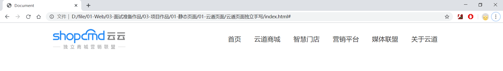

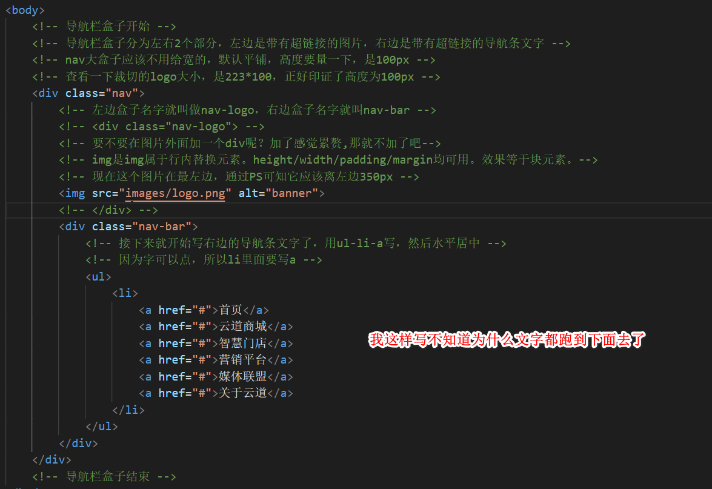

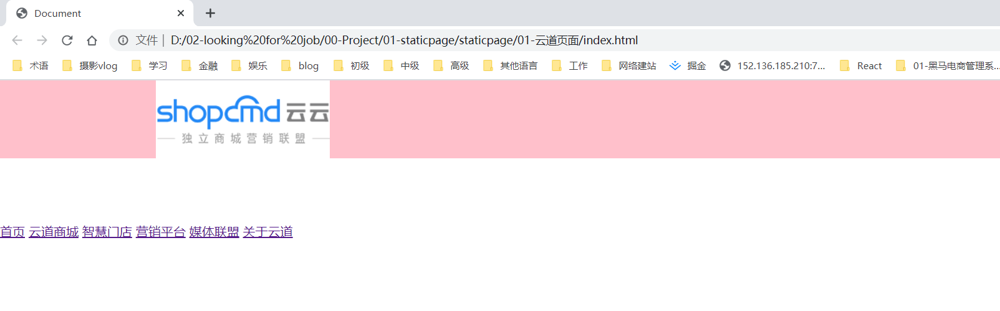

> 原因应该是我没有给ul的爹：`nav-bar`一个大小，宽也没给它造成的。
>
> 不是的，我知道了，因为nav-bar的爹是nav，它也是一个div，里面先有一张图片，然后再有`nav-bar`，而它是div，会单独另起一行，不会和图片并排显示的。

# 步骤2：写大图片

~~~html
<!-- 步骤2：写大图片 -->
	

		<!--  -->
		<!-- 不能这么写-->
	

~~~

~~~css
.banner{
   	height: 620px;
   	background-image: url(../images/banner.jpg)
   }
~~~

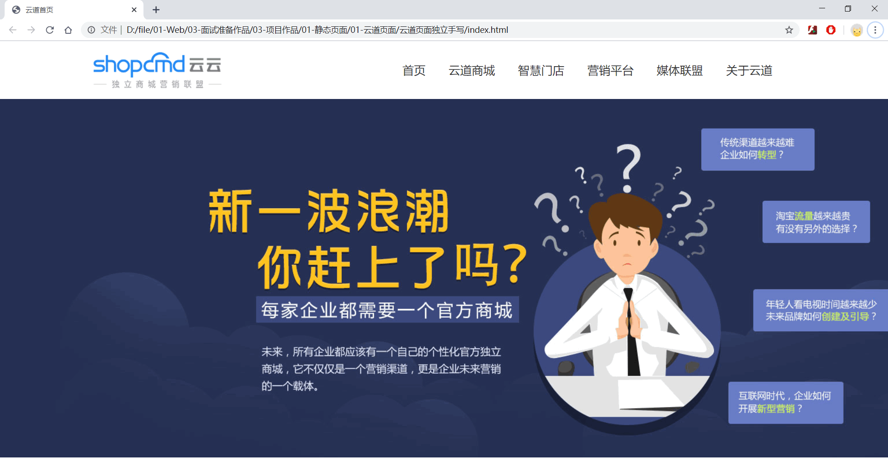

# 步骤3：写我们的任务

## 细节分析

我们的任务是一张图片，并且要放在中间。而且我认为要和下面的内容在一个大盒子里面。

## 遇到的问题

1.怎么让一个盒子居中对齐

> margin:0 auto

2.怎么让块级元素里的图片居中

3.盒子浮动第3个div掉下去，不知道怎么弄成一行

（遇到了一些困难，无法独立手写下去，贴一下自己最终未完成的所有代码吧，然后重新回过头来看视频，照着敲吧。）

## 半成品

~~~html
<!DOCTYPE html>
<html lang="en">
<head>
	<meta charset="UTF-8">
	<title>云道首页-独立手写</title>
</head>
<body>
	<!--  -->
	<!-- 引入外部CSS文件都忘了，上面的引用是错误的,引JavaScript才用script-->
	<link rel="stylesheet" href="css/index.css">
	<!-- 步骤1：写导航栏 -->
	

		

			
		

		

			<ul>
				<li><a href="#">首页</a></li>
				<li><a href="#">云道商城</a></li>
				<li><a href="#">智慧门店</a></li>
				<li><a href="#">营销平台</a></li>
				<li><a href="#">媒体联盟</a></li>
				<li><a href="#">关于云道</a></li>
			</ul>
		
	
	

	<!-- 步骤2：写大图片 -->
	

		<!--  -->
		<!-- 不能这么写-->
	

	<!-- 步骤3： 写我们的任务-->
	

			

					
				
shopcmd云道，国内领先的独立电商解决方案及全渠道营销平台。完整的产品体系，简约的系统，个性 化前端，全覆盖多渠道营销体系...
我们致力于打造一个服务于品牌商城/独立电商的完整生态，让企业的 独立电商之路变得更简单，也更有价值！

			

			

				

					
					<h3>我是卖家</h3>
					
shopcmd云电商解决方案,我们不仅仅是领先的独立商城建站系统。我们从互联网时代品牌建设和品牌营销的全新视角，赋予了品牌商城及独立电商更大的生存空间和存在价值！

					

						<a href="#">我要建站</a>
					

				

				

					
					<h3>我是卖家</h3>
					
shopcmd云电商解决方案,我们不仅仅是领先的独立商城建站系统。我们从互联网时代品牌建设和品牌营销的全新视角，赋予了品牌商城及独立电商更大的生存空间和存在价值！

					

						<a href="#">我要建站</a>
					

				

					
					<h3>我是卖家</h3>
					
shopcmd云电商解决方案,我们不仅仅是领先的独立商城建站系统。我们从互联网时代品牌建设和品牌营销的全新视角，赋予了品牌商城及独立电商更大的生存空间和存在价值！

					

						<a href="#">我要建站</a>
					

				

			

	

</body>
</html>
~~~

> 这个是HTML

~~~css
  *{
		margin: 0;
		padding: 0;
   }

   .nav{
   	/*width: 400px;*/
   	height: 100px;
   	/*display: inline-block;*/
   	/*position: absolute;*/
   	background-color: #FFF;
   }

   .logo{
   	background-color: pink;
   	width: 223px;
   	height: 100px;
   	float: left;
   	margin-left: 160px
   }

   .text-nav{
   	/*background-color: blue;*/
   	width:680px;
   	height: 100px;
   	height: 100px;
   	float:right;
   	margin-right: 180px;
   }

   .text-nav ul li{
   	list-style: none;
   }

   .text-nav ul li a{
   	text-decoration: none;
   	float: left;
   	text-align: center;
   	font-size: 20px;
   	font-family: "Microsoft YaHei";
   	color:#333;
   	line-height: 100px;
   	padding: 0 20px;
   }

   .text-nav ul li a:hover{
   	color: blue;
   }

   .banner{
   	height: 620px;
   	background-image: url(../images/banner.jpg)
   }

   .service{
      border: 1px solid #ccc;
      margin:64px auto;
      width: 1050px;
      height: 600px;
   }

   .pic{
      align:center;
   }
   .body{
      width: 1002px;
      border-top: 1px solid #ccc;
      /*background-color: #ccc;*/
      height: 10000px;
      margin: 60px auto;
      display: block;
      /*float: left;*/
   }
   .body .head img{
      margin-left: 386px;
      margin-top: -20px;
   }

   .body .head p{
      font-size: 18px;
      font-family: "Microsoft YaHei";
      text-align: center;
      color: #666;
   }
   .body .buyer{
      /*height: 1200px;*/
      /*border-top:1px solid #ccc;*/
      margin-top: 50px;
     /* float: left;*/
      width: 1200px;
      /*background-color: red;*/
      /*position: relative;*/

   }

   .body .buyer .buyer01{
      width: 300px;
      height: 425px;
      border: 1px solid #ccc;
      background-color: #fff;
      /*display: inline;*/
      margin-right:35px;
      margin-bottom: 25px;
      float: left;
      /*overflow: hidden;*/
      /*position: absolute;*/
   }

   .body .buyer img{
      margin-top: 20px;
      margin-left: 32px;
   }

   .body .buyer .buyer01 h3,p{
      text-align: center;
      font-family: "Microsoft YaHei";
      padding-bottom: 15px;
   }

   .body .buyer .buyer01 h3{
      font-size: 18px;
      color: #000;
      font-weight: 400;
      margin-top: 20px;
   }

   .body .buyer .buyer01 .jianzhan{
      width: 150px;
      height: 40px;
      border: 1px solid orange;
      /*background-color: blue;*/
      margin: 20px auto;
   }

   .body .buyer .buyer01 .jianzhan a{
     text-decoration: none;
      text-align: center;
      color: orange;
      font-size: 16px;
      display: block;
      line-height: 40px;

   }

   .body .buyer .buyer01 .jianzhan a:hover{
      background-color: orange;
      color:white;
   }
~~~

> 这个是CSS

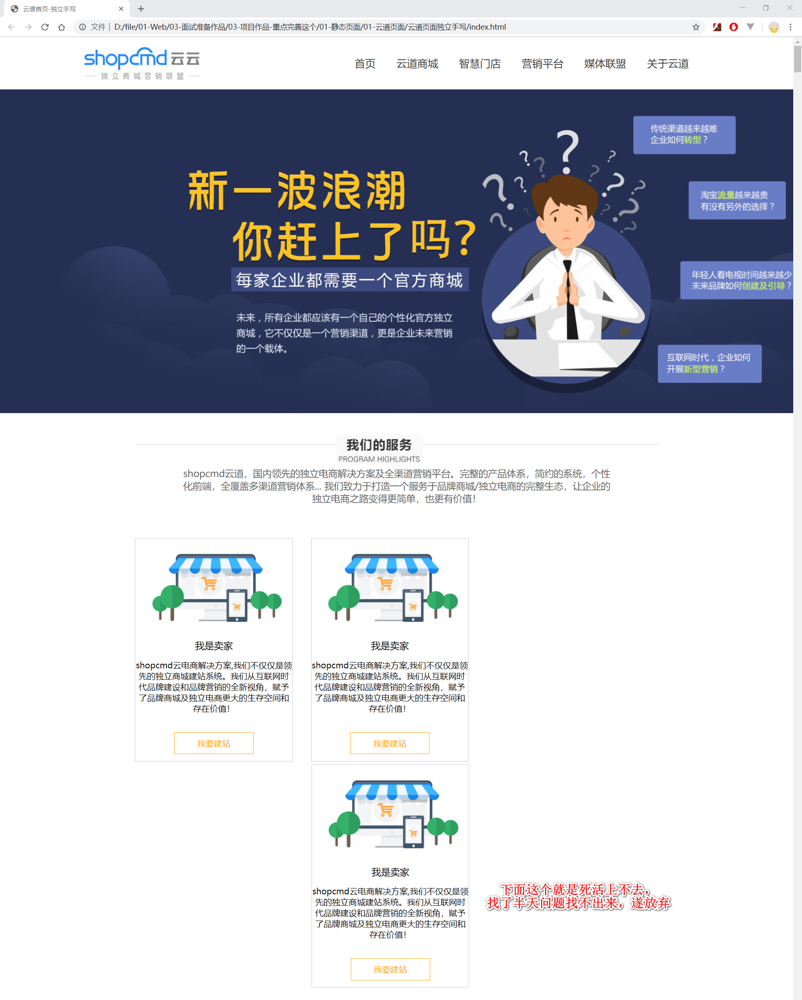

> 这个是最终做的半成品。

------

> 接下来准备重新看视频对着抄一遍，没办法了，还是基础功不扎实。

# 看视频重来一遍

## 初始工作

首先老师用PS打开云道页面psd文件，告诉几个快捷键：

~~~
Ctrl+R:显示或隐藏标尺  （右击标尺，把里面的单位一律改为像素）
~~~

然后带我们看结构：

1.首先，上面是一个通栏的，里面是标题，要居中对齐

2.下面是一个大图片，要居中对齐

3.大图片下面的三个小图标，学了定位以后来补

4.再下面一大块是中间部分

5.最后又是通栏的

我们如何去写：一行一行的去做。

引入外部的CSS文件：(这个我都没有印象了。。。。。。)

~~~css
<!-- 引入外部的CSS文件 -->
<link rel="stylesheet" href="css/index.css">
~~~

CSS文件初始化：

~~~css
/*初始化：先删除默认的内外边距*/
*{
	 margin: 0;
	 padding: 0;
 }
~~~

## 头部开始

1.取类名为header，输入.header再敲Tab可以快速变成这样：(这个我也忘了。。。)

~~~html

~~~

2.确定背景色，用习惯工具吸取，得背景色为#ffffff(可以简写为#fff,这个我还记得)

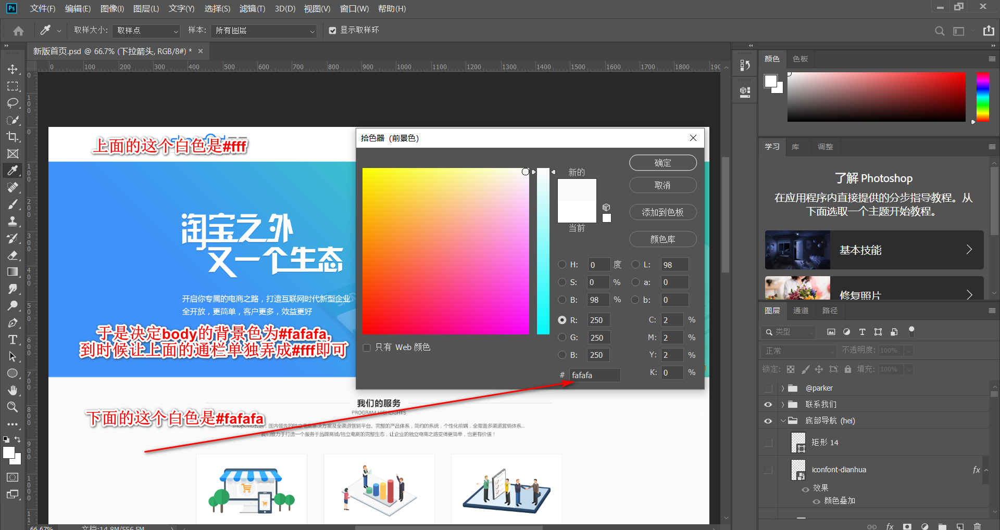

3.用矩形选框工具来量一下通栏的高度（宽度就默认通栏即可）

> 按住空格键，鼠标可以变成一个小手，可以拖拽图片，Ctrl+加号键可以放大图片，量的更加准确。
>
> Ctrl+D可以取消选区。

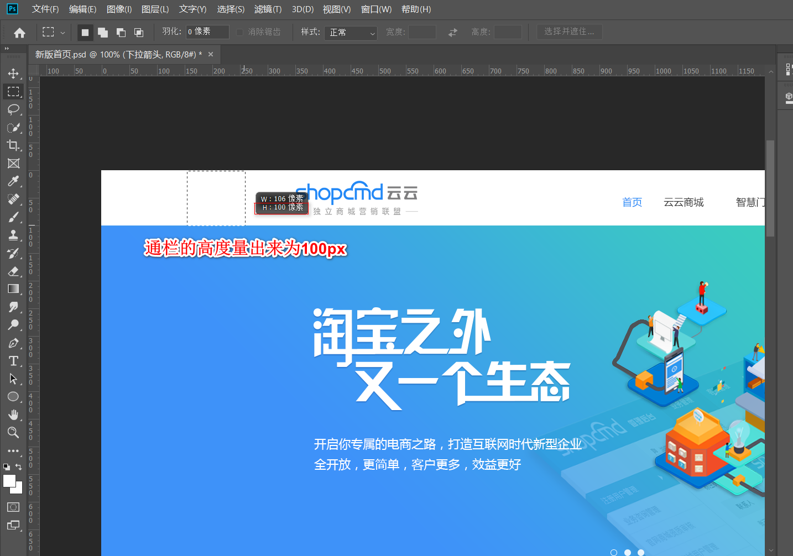

4.一定要养成写注释的好习惯，HTML和CSS里都要有注释，并且注释要有头有尾。

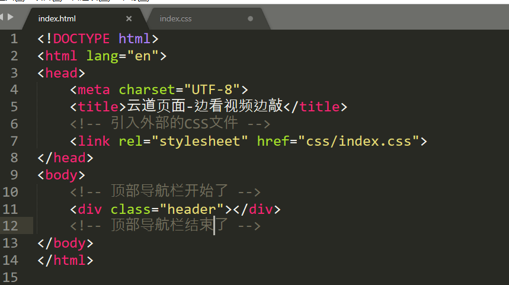

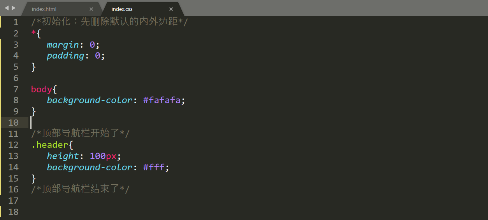

5.通栏有了，下面要有一个版心(要量一下版心的宽度)才行，而且版心要居中对齐。

> 鼠标点击左侧的标尺，往右拉，可以拉出来一条竖线，再拉一次，还能拉出一条竖线，用来测量版心的宽度。

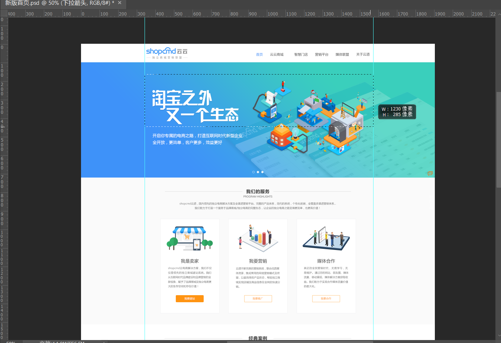

> 这里老师取了个整数，把版心确定为了1200px。

6.版心居中对齐

> ### 外边距实现盒子居中(重要)
>
> 可以让一个盒子实现水平居中，需要满足一下两个条件：
>
> 1. **必须是块级元素。**     
> 2. **盒子必须指定了宽度（width）**（如果没给宽则默认和屏幕一样宽）
>
> 然后就给**左右的外边距都设置为auto**，就可使**块级元素水平居中。**
>
> 实际工作中常用这种方式进行网页布局，示例代码如下：
>
> ~~~
> .header{ width:960px; margin:0 auto;}
> ~~~

### 头部最终代码

~~~html
<!DOCTYPE html>
<html lang="en">
<head>
	<meta charset="UTF-8">
	<title>云道页面-边看视频边敲</title>
	<!-- 引入外部的CSS文件 -->
	<link rel="stylesheet" href="css/index.css">
</head>
<body>
	<!-- 顶部导航栏开始了 -->
	

		
123

	

	<!-- 顶部导航栏结束了 -->
</body>
</html>
~~~

~~~css
/*初始化：先删除默认的内外边距*/
*{
	margin: 0;
	padding: 0;
}

body{
   background-color: #fafafa;
}

/*顶部导航栏开始了*/
.header{
   height: 100px;
   background-color: #fff;
}

.inner{
   width: 1200px;
   /*高100像素，和父亲一样高。高也要写啊，不写高度这个盒子就显示不了了*/
   height: 100px;
   background-color: pink;
   /*子盒子在父盒子里面居中对齐，就用margin:0 auto即可*/
   margin:0 auto;
}  
/*顶部导航栏结束了*/
~~~

### 头部最终效果

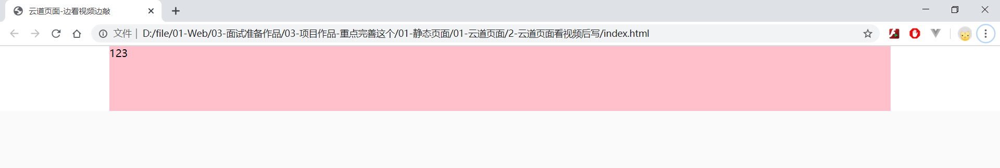

## logo制作

### 结构划分

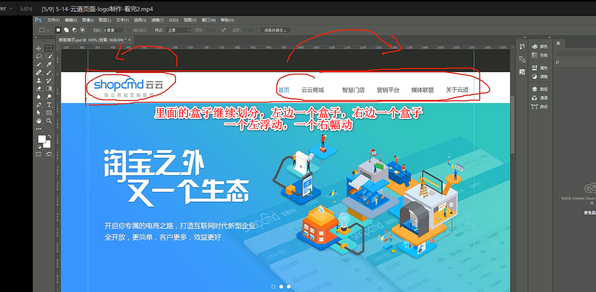

1.首先把版心里面的两个盒子进行浮动，让它们一个在左，一个在右

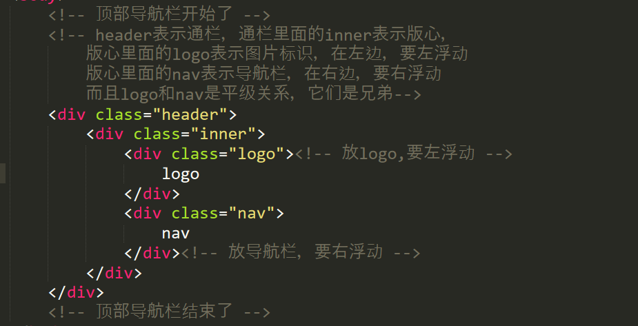

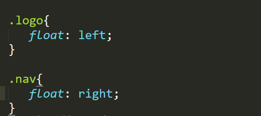

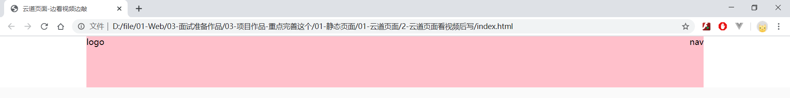

2.使用切片工具把Logo给切出来。

> 选择切片工具进行切片-文件-导出-存储为Web所用格式（旧版）-弹出的对话框选择文件格式为png8-确定-切片选择选中的切片

### logo最终代码

~~~html
<!DOCTYPE html>
<html lang="en">
<head>
	<meta charset="UTF-8">
	<title>云道页面-边看视频边敲</title>
	<!-- 引入外部的CSS文件 -->
	<link rel="stylesheet" href="css/index.css">
</head>
<body>
	<!-- 顶部导航栏开始了 -->
	<!-- header表示通栏，通栏里面的inner表示版心，
		版心里面的logo表示图片标识，在左边，要左浮动 
		版心里面的nav表示导航栏，在右边，要右浮动
		而且logo和nav是平级关系，它们是兄弟-->
	

		

			
<!-- 放logo,要左浮动 -->
				<!-- 切出来的图片高度是100px,宽度是223px -->
				<!-- 因为所有的Logo都是可以点的，所以在img前面再加上个超链接更好 -->
				
			

			

				nav
			
<!-- 放导航栏，要右浮动 -->
		

	

	<!-- 顶部导航栏结束了 -->
</body>
</html>
	
~~~

~~~css
/*初始化：先删除默认的内外边距*/
*{
	margin: 0;
	padding: 0;
}

body{
   background-color: #fafafa;
}

/*顶部导航栏开始了*/
.header{
   height: 100px;
   background-color: #fff;
}

.inner{
   width: 1200px;
   /*高100像素，和父亲一样高。高也要写啊，不写高度这个盒子就显示不了了*/
   height: 100px;
   background-color: pink;
   /*子盒子在父盒子里面居中对齐，就用margin:0 auto即可*/
   margin:0 auto;
}  

.logo{
   float: left;
}

.nav{
   float: right;
}
/*顶部导航栏结束了*/
~~~

### logo最终效果

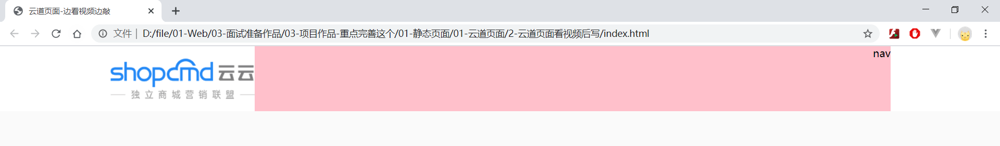

> 写网页布局最难的地方在于结构的嵌套层次关系

## 导航栏制作

1.右边是一串字，鼠标放上去变蓝就行了。

2.可以直接选择6个超链接来做，但是最好是前面包个ul和li来做。

~~~html

				<ul>
					<li><a href="#">首页</a></li>
					<li><a href="#">云道商城</a></li>
					<li><a href="#">智慧门店</a></li>
					<li><a href="#">营销平台</a></li>
					<li><a href="#">媒体联盟</a></li>
					<li><a href="#">关于云道</a></li>
				</ul>

<!-- 放导航栏，要右浮动 -->
~~~

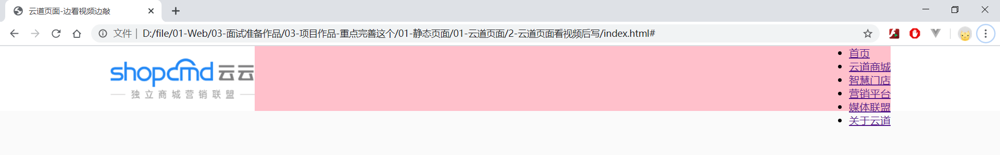

3.反正所有li前面的小点都要去掉，干脆直接在CSS里面写：

~~~css
li{
   list-style: none;
}
~~~

> 这个属于初始化工作

4.把链接（原先是竖着排的）写在一行上,因为a本来就是一行的，所以要横起来就要给< li>放一行上。可以选择display:inline-block;也可以选择浮动。因为浮动没有间隙，所以调整起来会更好。

~~~css
.nav ul{
   float: left;
}  /*这样写不对，不是ul*/

.nav li{
   float: left;
}/*这样写才对，是li,或者写.nav ul li也行*/
~~~

> a永远不会竖着排，这些字是放在< li>里面的，< li>是块级元素，一行里面只能放一个。
>
> 常见的块元素有<h1>~<h6>、
、
、<ul>、<ol>、<li>等，其中
标签是最典型的块元素。
>
> 常见的行内元素有<a>、<strong>、<b>、<em>、<i>、<del>、<s>、<ins>、<u>、等，其中标签最典型的行内元素。

5.为什么是左侧浮动呢？

> 因为大盒子.nav是右浮动，如果.li还是右浮动的话那字就反了。第一个首页会跑到最右边去了，就不对了。

6.让字垂直居中

> 垂直居中只要让行高和高（高就是inner的高，干脆让inner加一个line-height:100px就好了）一样就可以了。或者让.nav li加一个line-height:100px也行。
>
> 这个我记得之前纠结了好一阵子，查了很多原理，现在还是先记住结论再说吧。

7.为什么不直接给a(.nav li a)指定行高，而给它父亲(.inner)指定行高呢？---因为行高会继承,这样会更加方便。

8.接下来修饰里面的文字：大小14px;颜色#333 ;鼠标放上去的颜色为#2288f6;取消下划线

9.最后一步调整间距

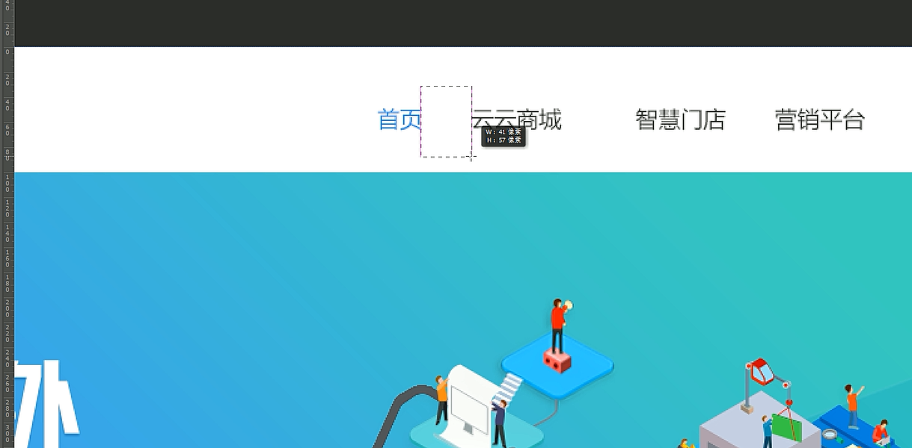

> 宽40px,那么每个li的左右都是20px就可以了。或者直接margin-right:40px也行。

10.最后把pink颜色取消掉，整个头部就搞定了。

### 导航栏最终代码

~~~:four:
<!DOCTYPE html>
<html lang="en">
<head>
	<meta charset="UTF-8">
	<title>云道页面-边看视频边敲</title>
	<!-- 引入外部的CSS文件 -->
	<link rel="stylesheet" href="css/index.css">
</head>
<body>
	<!-- 顶部导航栏开始了 -->
	<!-- header表示通栏，通栏里面的inner表示版心，
		版心里面的logo表示图片标识，在左边，要左浮动 
		版心里面的nav表示导航栏，在右边，要右浮动
		而且logo和nav是平级关系，它们是兄弟-->
	

		

			
<!-- 放logo,要左浮动 -->
				<!-- 切出来的图片高度是100px,宽度是223px -->
				<!-- 因为所有的Logo都是可以点的，所以在img前面再加上个超链接更好 -->
				
			

			

				<ul>
					<li><a href="#">首页</a></li>
					<li><a href="#">云道商城</a></li>
					<li><a href="#">智慧门店</a></li>
					<li><a href="#">营销平台</a></li>
					<li><a href="#">媒体联盟</a></li>
					<li><a href="#">关于云道</a></li>
				</ul>

			
<!-- 放导航栏，要右浮动 -->
		

	

	<!-- 顶部导航栏结束了 -->
</body>
</html>
	
~~~

~~~:four:
/*初始化：先删除默认的内外边距*/
*{
	margin: 0;
	padding: 0;
}

body{
   background-color: #fafafa;
}

/*取消li的小点点*/
li{
   list-style: none;
}

/*顶部导航栏开始了*/
.header{
   height: 100px;
   background-color: #fff;
}

.inner{
   width: 1200px;
   /*高100像素，和父亲一样高。高也要写啊，不写高度这个盒子就显示不了了*/
   height: 100px;
   /*background-color: pink;*/
   /*子盒子在父盒子里面居中对齐，就用margin:0 auto即可*/
   margin:0 auto;
   /*字的高就是inner的高(100px)，行高等于高等于100px就可以让字体垂直居中。*/

   /*为什么不直接给a(.nav li a)指定行高，而给它父亲(.inner)指定行高呢？
   ---因为行高会继承,这样会更加方便。*/
   /*字居中对齐方案1*/
   line-height: 100px;
}  

.logo{
   float: left;
}

.nav{
   float: right;
}

/*如果li选择右浮动的话那么字就会反了，首页就会跑到最右边去了，就不对了*/
.nav li{
   float: left; 
   /*字居中对齐方案2*/
   /*line-height: 100px;*/

   /*调整字体间的间距:每个li上下为0，左右20px*/
   margin:0 20px;
}

.nav li a{
   color: #333;
   /*取消下划线*/
   text-decoration: none;
}

.nav li a:hover{
   color: #2288f6;
}
/*顶部导航栏结束了*/
~~~

### 导航栏最终效果

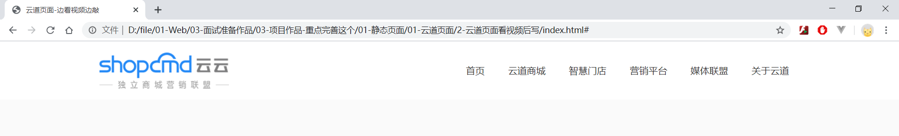

> 唉，还是看视频好，太多细节了，不看视频根本记不住。

## banner制作

1.这个banner给背景图片更加合适，因为我的版心(inner)只有1200px，如果是插入图片的话那么banner就会歪着的，而且左右还有滚动条。

~~~html
<!-- banner开始了 -->
	

		<!-- 如果直接这样写的话图片是歪着的，而且还有左右滚动条,不好 -->
		
	

	<!-- banner结束了 -->
~~~

2.我们切出来的banner是1903*620像素的。

3.header和banner是并行关系的。

### banner最终代码

~~~html
<!DOCTYPE html>
<html lang="en">
<head>
	<meta charset="UTF-8">
	<title>云道页面-边看视频边敲</title>
	<!-- 引入外部的CSS文件 -->
	<link rel="stylesheet" href="css/index.css">
</head>
<body>
	<!-- 顶部导航栏开始了 -->
	<!-- header表示通栏，通栏里面的inner表示版心，
		版心里面的logo表示图片标识，在左边，要左浮动 
		版心里面的nav表示导航栏，在右边，要右浮动
		而且logo和nav是平级关系，它们是兄弟-->
	

		

			
<!-- 放logo,要左浮动 -->
				<!-- 切出来的图片高度是100px,宽度是223px -->
				<!-- 因为所有的Logo都是可以点的，所以在img前面再加上个超链接更好 -->
				
			

			

				<ul>
					<li><a href="#">首页</a></li>
					<li><a href="#">云道商城</a></li>
					<li><a href="#">智慧门店</a></li>
					<li><a href="#">营销平台</a></li>
					<li><a href="#">媒体联盟</a></li>
					<li><a href="#">关于云道</a></li>
				</ul>

			
<!-- 放导航栏，要右浮动 -->
		

	

	<!-- 顶部导航栏结束了 -->

	<!-- banner开始了 -->
	

		<!-- 如果直接这样写的话图片是歪着的，而且还有左右滚动条 -->
		<!--  -->
	

	<!-- banner结束了 -->
</body>
</html>
~~~

~~~css
/*初始化：先删除默认的内外边距*/
*{
	margin: 0;
	padding: 0;
}

body{
   background-color: #fafafa;
}

/*取消li的小点点*/
li{
   list-style: none;
}

/*顶部导航栏开始了*/
.header{
   height: 100px;
   background-color: #fff;
}

.inner{
   width: 1200px;
   /*高100像素，和父亲一样高。高也要写啊，不写高度这个盒子就显示不了了*/
   height: 100px;
   /*background-color: pink;*/
   /*子盒子在父盒子里面居中对齐，就用margin:0 auto即可*/
   margin:0 auto;
   /*字的高就是inner的高(100px)，行高等于高等于100px就可以让字体垂直居中。*/

   /*为什么不直接给a(.nav li a)指定行高，而给它父亲(.inner)指定行高呢？
   ---因为行高会继承,这样会更加方便。*/
   /*字居中对齐方案1*/
   line-height: 100px;
}  

.logo{
   float: left;
}

.nav{
   float: right;
}

/*如果li选择右浮动的话那么字就会反了，首页就会跑到最右边去了，就不对了*/
.nav li{
   float: left; 
   /*字居中对齐方案2*/
   /*line-height: 100px;*/

   /*调整字体间的间距:每个li上下为0，左右20px*/
   margin:0 20px;
}

.nav li a{
   color: #333;
   /*取消下划线*/
   text-decoration: none;
}

.nav li a:hover{
   color: #2288f6;
}
/*顶部导航栏结束了*/

/*banner开始了*/
.banner{
   /*这个banner不用给宽，给个高620就可以了*/
   height: 620px;
   /*这个还是歪着的，但是不会出现水平滚动条了*/
   /*background :url(../images/banner.jpg) no-repeat;*/
   /*这样又不会出现水平滚动条，又不会歪了*/
   background :url(../images/banner.jpg) no-repeat top center;
}
/*banner结束了*/
~~~

### banner最终效果

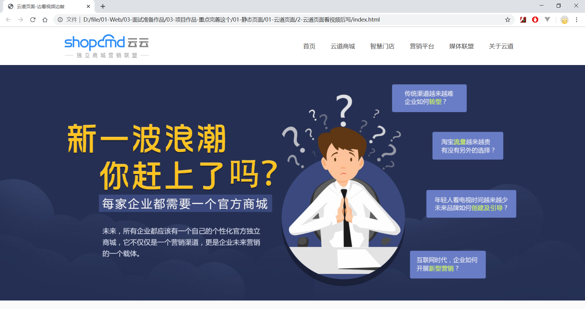

## 服务模块制作

1.接下来要做的这么一大块就有点复杂了。

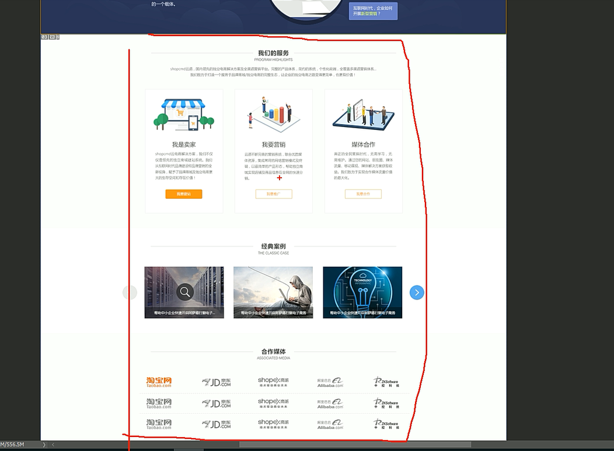

2.首先要确定一下版心，版心大概取个整数是1055px。

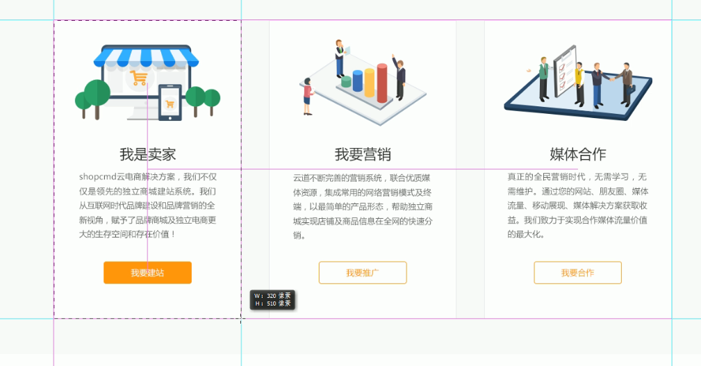

3.你可以建一个超大的盒子把我们的服务，经典案例，合作媒体这3部分都包进去。你要是怕乱，也可以分模块，分别写3个盒子罗列而成。（本视频采用3个盒子罗列的办法）

### 结构划分

1.先是有一个大盒子。

2.这个盒子里面首先有一个我们的服务，然后是一大堆文字，文字是居中对齐的，这个上面的一个盒子。

3.然后下面有3个盒子，从上到下分别是图片，然后是文字，然后是我要合作的超链接。（下面的这3个盒子应该也要用一个大盒子把它包起来）

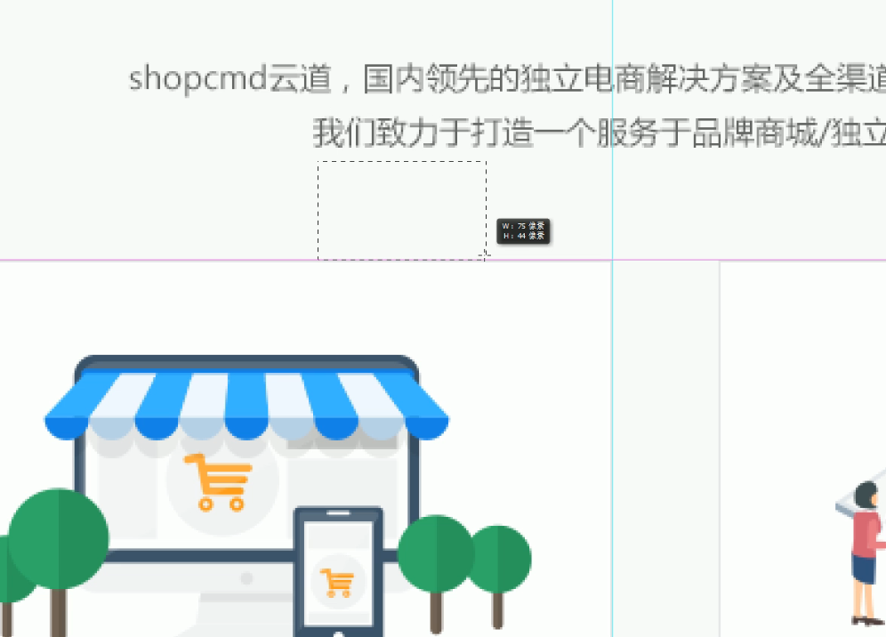

4.我们的服务距离上面有一定的距离，距离为75px。

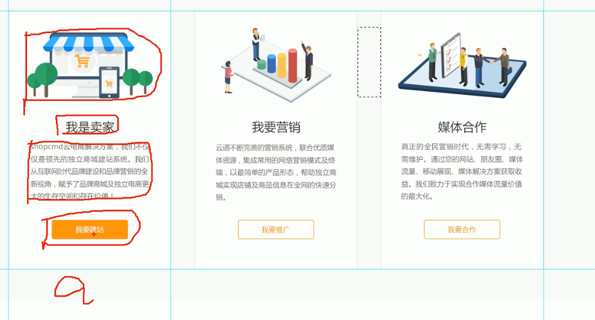

5.刚才宽度我们都量好了，是1055px。

6.我们的服务上面有一条线完全可以做完hd的上边框就行了。(上面的盒子和下面的盒子是不一样宽的，上面的线是短于1055px的，左右都有距离的)

7.上面盒子的宽度低于父盒子宽度如何解决？要用margin不要用padding,左右都空25px。

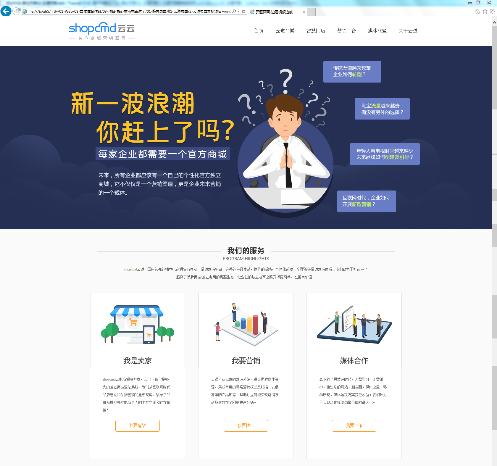

8.父盒子里面有子盒子，如果子盒子不给宽那么就和父盒子一样宽。如果给子盒子加一个margin-left:20px,子盒子右边也不会超出来。

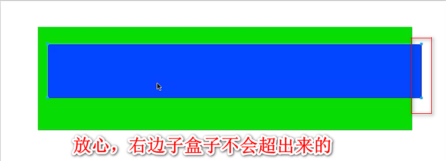

~~~html
<!DOCTYPE html>
<html lang="en">
<head>
	<meta charset="UTF-8">
	<title>Document</title>
</head>
<body>
	
		

			

		

	

</body>
</html>
~~~

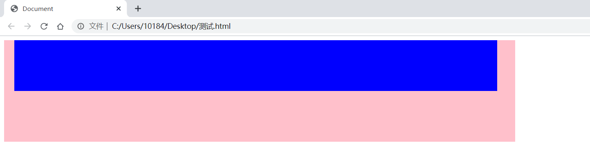

9.有一大段文字的一看就是p标签。 

10.上面的标题我们用代码写很难写，所以我们就先用图片来代替。

11.我们的服务首先肯定要先居中对齐。

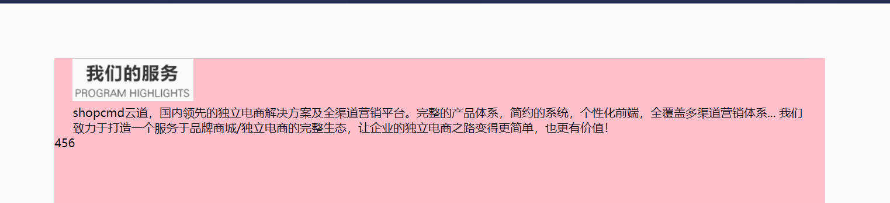

12.h3里面装了一张图，这张图的大小是167*46像素。这个h3要和父亲一样大才能居中对齐。(h3是块级元素)

> ### 外边距实现盒子居中(重要)
>
> 可以让一个盒子实现水平居中，需要满足一下两个条件：
>
> 1. **必须是块级元素。**     
> 2. **盒子必须指定了宽度（width）**（如果没给宽则默认和屏幕一样宽）
>
> 然后就给**左右的外边距都设置为auto**，就可使**块级元素水平居中。**

13.但是我们要的效果是我们的服务图片在横线上面，要盖住线。我们就应该把图片往上面移动一段距离。

> 我尝试着建了父子盒子，子盒子也给了宽度，想让子盒子往上盖住父盒子一点，结果发现不行，父子盒子一起往下面移动，子盒子一直在父盒子里面，估计要用到定位，但是这里为什么可以呢？这个问题需要再考虑考虑。

14.p标签里的文字大小是12px,颜色是#666。

15.p标签离上面还有点近，还要调整一下，设置距离为15px。

16.接下里我们写下面的三个盒子，这3个盒子在一行上肯定就用浮动了。用浮动我们必须要在外面套一个父盒子(而且父盒子一定要给高度才行，但是很多情况下父盒子不方便给高度。。。所以我们就要用清除浮动了)，里面的三个盒子在父盒子的庇护下浮动，这样下面的盒子（经典案例）也就不会飘上来了。

> 浮动本质是用来做一些文字混排效果的，但是被我们拿来做布局用，则会有很多的问题出现。
>
> 清除浮动就是把浮动的盒子圈到里面，让父盒子闭合出口和入口不让他们出来影响其他元素。
>
> (准确地说，并不是清除浮动，而是**清除浮动后造成的影响**)
>
> 清除浮动的本质：主要为了解决父级元素因为子级元素浮动引起内部高度为0的问题。(有时候父级元素不方便给高，比如父级元素装的是一大堆文字，如何子级元素浮动了，不是标准流，不占位置了，又因为父盒子没有高，那么下面的盒子就会跑到子盒子的位置上来)

17.下面的3个盒子我们用3个div也行，用3个ul-li也行。本视频选择是3个ul-li。

18.测量这3个小盒子的长和宽是320*510像素，也就是说bd里面的3个li都要是320 *510像素。

19.下面3个小盒子和上面文字的距离大概是40px。(给父盒子一个margin-top)。

20.3个小盒子中间也有缝隙，大概是45px。直接给中间的小盒子来个左右margin就行了。

21.3个小盒子的布局是：分成4个部分：上面是一张图，中间是标题我是卖家和一串文字，下面是一个矩形超链接。(我直接把我是卖家也截到图片里去了，就这样了吧)

22.我们将图片调整位置，直接将图片进行maring-top,left,right,bottom调整。(因为我自己重新切的图，而且是整块切的，所以我就不调整图片位置了)

23.将图片和下面的文字进行间隔，图片加个margin-bottom即可。

24.下面一长串文字的颜色是#666,大小是12px。这一长串文字不用通览显示，把它的宽给量出来，宽为235px，高不用给，它自然而然撑起来。然后让p(margin: 0 auto)居中对齐。最后再给个行高就可以了，行高26px。

25.下面就是一个超链接了，可以把a放在一个盒子里，也可以直接就写a。我们采用第二种，直接写。

“我要建站”大小为148*38像素。

26.把a(行内元素)改为行内块元素，这样才能赋予它长和宽。

27.超链接距离上面有一个小距离，高度为30px。最后再让文字水平居中，垂直居中，修改字体颜色，大小去掉下划线，长方形圆角，鼠标点击变色就可以了。

### 服务模块最终代码

~~~html
<!DOCTYPE html>
<html lang="en">
<head>
	<meta charset="UTF-8">
	<title>云道页面-边看视频边敲</title>
	<!-- 引入外部的CSS文件 -->
	<link rel="stylesheet" href="css/index.css">
</head>
<body>
	<!-- 顶部导航栏开始了 -->
	<!-- header表示通栏，通栏里面的inner表示版心，
		版心里面的logo表示图片标识，在左边，要左浮动 
		版心里面的nav表示导航栏，在右边，要右浮动
		而且logo和nav是平级关系，它们是兄弟-->
	

		

			
<!-- 放logo,要左浮动 -->
				<!-- 切出来的图片高度是100px,宽度是223px -->
				<!-- 因为所有的Logo都是可以点的，所以在img前面再加上个超链接更好 -->
				
			

			

				<ul>
					<li><a href="#">首页</a></li>
					<li><a href="#">云道商城</a></li>
					<li><a href="#">智慧门店</a></li>
					<li><a href="#">营销平台</a></li>
					<li><a href="#">媒体联盟</a></li>
					<li><a href="#">关于云道</a></li>
				</ul>

			
<!-- 放导航栏，要右浮动 -->
		

	

	<!-- 顶部导航栏结束了 -->

	<!-- banner开始了 -->
	

		<!-- 如果直接这样写的话图片是歪着的，而且还有左右滚动条 -->
		<!--  -->
	

	<!-- banner结束了 -->

	<!-- 我们的服务模块开始了 -->
	

		<!-- service-hd表示head,上面的头，一个盒子，装我们的服务图片和下面的文字-->
		 

		 	<!-- 上面的一看就是标题 -->
		 	<h3></h3>
		 	<!-- 下面的一看就是文字 -->
		 	
shopcmd云道，国内领先的独立电商解决方案及全渠道营销平台。完整的产品体系，简约的系统，个性化前端，全覆盖多渠道营销体系...
我们致力于打造一个服务于品牌商城/独立电商的完整生态，让企业的独立电商之路变得更简单，也更有价值！

		 

		 <!-- service-bd表示body,下面的身子，一个盒子，里面还要包含3个小盒子，
		 	装图片，文字和我要推广的超链接-->
		 

		 	<ul>
		 		<li>
		 			
		 			
shopcmd云电商解决方案，我们不仅仅是领先的独立商城建站系统。我们从互联网时代品牌建设和品牌营销的全新视角，赋予了品牌商城及独立电商更大的生存空间和存在价值！

					<a href="#">我要建站</a>
		 		</li>
		 		<li class="yingxiao">
		 			
		 			
云道不断完善的营销系统，联合优质媒体资源，集成常用的网络营销模式及终端，以最简单的产品形态，帮助独立商城实现店铺及商品信息在全网的快速分销。

					<a href="#">我要推广</a>
		 		</li>
		 		<li>
		 			
		 			
真正的全民营销时代，无需学习，无需维护。通过您的网站、朋友圈、媒体流量、移动展现、媒体解决方案获取收益。我们致力于实现合作媒体流量价值的最大化。

					<a href="#">我要合作</a>
		 		</li>
		 	</ul>
		 

	

	<!-- 我们的服务模块结束了 -->
</body>
</html>
~~~

~~~css
/*初始化：先删除默认的内外边距*/
*{
	margin: 0;
	padding: 0;
}

body{
   background-color: #fafafa;
   /*防止以后里面加的东西越来越多下面的看不见，先给body一个高，让它有上下滑轮，可以上下拉*/
   height: 3000px;
}

/*取消li的小点点*/
li{
   list-style: none;
}

/*顶部导航栏开始了*/
.header{
   height: 100px;
   background-color: #fff;
}

.inner{
   width: 1200px;
   /*高100像素，和父亲一样高。高也要写啊，不写高度这个盒子就显示不了了*/
   height: 100px;
   /*background-color: pink;*/
   /*子盒子在父盒子里面居中对齐，就用margin:0 auto即可*/
   margin:0 auto;
   /*字的高就是inner的高(100px)，行高等于高等于100px就可以让字体垂直居中。*/

   /*为什么不直接给a(.nav li a)指定行高，而给它父亲(.inner)指定行高呢？
   ---因为行高会继承,这样会更加方便。*/
   /*字居中对齐方案1*/
   line-height: 100px;
}  

.logo{
   float: left;
}

.nav{
   float: right;
}

.nav ul{
   /*让ul这个父元素清除浮动，这样更好。虽然这个案例没有太多影响，可以不用写*/
   overflow: hidden;
}

/*如果li选择右浮动的话那么字就会反了，首页就会跑到最右边去了，就不对了*/
.nav li{
   float: left; 
   /*字居中对齐方案2*/
   /*line-height: 100px;*/

   /*调整字体间的间距:每个li上下为0，左右20px*/
   margin:0 20px;
}

.nav li a{
   color: #333;
   /*取消下划线*/
   text-decoration: none;
}

.nav li a:hover{
   color: #2288f6;
}
/*顶部导航栏结束了*/

/*banner开始了*/
.banner{
   /*这个banner不用给宽，给个高620就可以了*/
   height: 620px;
   /*这个还是歪着的，但是不会出现水平滚动条了*/
   /*background :url(../images/banner.jpg) no-repeat;*/
   /*这样又不会出现水平滚动条，又不会歪了*/
   background :url(../images/banner.jpg) no-repeat top center;
}
/*banner结束了*/

/*我们的服务模块开始了*/
.service{
   /*我们的服务这个大盒子距离banner高度为75px*/
   /*margin属性用于设置外边距。  设置外边距会在元素之间创建“空白”，
   这段空白通常不能放置其他内容。*/
   /*margin-top: 75px;*/
   /*经过测量我们的服务版心高为1055px*/
   width: 1055px;
   /*经过测量我们的服务版心高为660px*/
   height: 660px;
   /*background-color: pink;*/
   /*让这个大盒子居中对齐*/
   /*margin:0 auto会与上面的margin-top:75px产生重叠，从而让上面的margin-top:75px失效*/
   /*margin:0 auto;*/
   /*所以要把margin-top: 75px和margin:0 auto都注释掉，改为下面的这个写法*/
   margin:75px auto 0;
}

.service-hd{
   /*添加上面的那条线-上边框，但是它不用这么宽(1055px)*/
   /*上面的盒子要比父亲宽度小，下面的盒子要和父亲一样大，所以不能用padding*/
   /*解决方法：你可以给hd来一个margin左侧多少像素，margin右侧多少像素即可*/

   border-top: 1px solid #ccc;
   /*解决上面的一个盒子上边框小于父盒子宽度(1055px)的方法：使用margin,左右都离父盒子25px的距离*/
   margin:0 25px;
}

.service-hd h3{
   /*h3是块级元素，要让块级元素里面的图片居中对齐，必须要给宽度*/
   /*外边距实现盒子居中(重要)

   可以让一个盒子实现水平居中，需要满足一下两个条件：
   1. 必须是块级元素。     
   2. 盒子必须指定了宽度（width）（如果没给宽则默认和屏幕一样宽）
   然后就给左右的外边距都设置为auto，就可使块级元素水平居中。*/
   /*我们裁剪的图片大小为167*46像素*/
   width: 167px;
   height: 46px;
   /*让图片居中 同时让图片往上走15像素，盖住横线*/
   margin:-15px auto 0;
   /*让图片往上走15像素，盖住横线*/
   /*margin-top: -15px;*/
}

.service-hd p{
   font-size: 12px;
   color: #666;
   /*文字之间太紧了，写个行高。p里面肯定有行高的*/
   line-height: 26px;
   /*让文字居中对齐*/
   text-align: center;
   /*给p弄一个宽度*/
   width: 831px;
   /*p盒子是块级元素，块级元素居中对齐,还要和上面保持一些间隔，所以连在一起写*/
   margin:15px auto 0;
}

.service-bd li{
   width:320px;
   height:560px;
   background-color: #fff;
   /*让3个小盒子左侧浮动*/
   float:left;
   border: 1px solid #e7e8e9;
}

.service-bd {
   /*上面的3个小盒子距离上面的文字距离大概40px*/
   margin-top: 40px;
}

.service-bd img{
   margin-bottom: 20px;
}
.service-bd p{
   font-size: 12px;
   color: #666;
   width: 235px;
   /*这个必须要给个高，不然下面的a就无法对齐了*/
   height: 120px;
   margin: 0 auto;
   line-height: 26px;
}

.service-bd a{
   display: block;
   width: 148px;
   height: 38px;
   border: 1px solid #ff9412;
   /*让这个超链接水平居中,并且离上面有30px距离*/
   margin: 30px auto;
   /*文字水平居中*/
   text-align: center;
   /*文字垂直居中*/
   line-height: 38px;
   color:#ff9412;
   font-size: 14px;
   /*取消下划线*/
   text-decoration: none;
   /*给长方形一个圆角*/
   border-radius: 5px;
}

.service-bd a:hover{
   color: #fff;
   background-color: #ff9412;
}
.yingxiao{
   /*直接给中间的盒子来一个左右margin就可以了*/
   margin:0 44px;
}

/*我们的服务模块结束了*/
~~~

### 服务模块最终效果

> 这3张图片我刻意裁成一样的，这样更方便。实在不一样大就在img里面强制写长和宽多少也行。或者在图片外面再套一个盒子，规定一下盒子的大小也行。

# 经典案例制作

(现在是2020年6月19日，我的服务模块是边看视频边抄代码的，顺便还看了一下以前的知识点。我的服务模块不能偷懒，先自己独立手敲一遍，毕竟和服务模块布局一样的，这个千万别偷懒了。)

(我自己写了一会儿，发现还是不行，还是无法独立完成。)

1.经典案例和上面我们的服务模块是一样宽的，都是1055px。而且写法结构是一样的。

2.下面的3张图片同上，宽1055px不变，量一下高度即可(大概是210px)。(不给高度也行，可以清除浮动)

3.测量图片中间的距离是40px(margin:0 40px)

4.测量图片到上面的距离是80px(margin-top:80px)

5.注意：图片下面有字，并且是半透明效果，这个也要做出来。

6.半透明高度是45px。

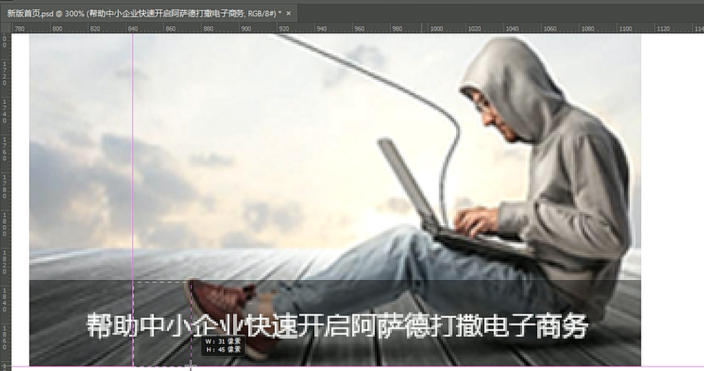

7.因为半透明字要压着图片，所以肯定要用定位来做比较好。

8.鼠标一经过每个图片会出现一个放大镜，并且还会有阴影效果。

9.接下来还有图片左右两边的三角形，这个肯定也是用定位来做的。因为是定位，所以代码放在case-bd的前面也行，后面也行，我们就放在后面吧。这两个左右符号规格为为60*60。

## 经典案例最终代码

~~~html
<!DOCTYPE html>
<html lang="en">
<head>
	<meta charset="UTF-8">
	<title>云道页面-边看视频边敲</title>
	<!-- 引入外部的CSS文件 -->
	<link rel="stylesheet" href="css/index.css">
</head>
<body>
	<!-- 顶部导航栏开始了 -->
	<!-- header表示通栏，通栏里面的inner表示版心，
		版心里面的logo表示图片标识，在左边，要左浮动 
		版心里面的nav表示导航栏，在右边，要右浮动
		而且logo和nav是平级关系，它们是兄弟-->
	

		

			
<!-- 放logo,要左浮动 -->
				<!-- 切出来的图片高度是100px,宽度是223px -->
				<!-- 因为所有的Logo都是可以点的，所以在img前面再加上个超链接更好 -->
				
			

			

				<ul>
					<li><a href="#">首页</a></li>
					<li><a href="#">云道商城</a></li>
					<li><a href="#">智慧门店</a></li>
					<li><a href="#">营销平台</a></li>
					<li><a href="#">媒体联盟</a></li>
					<li><a href="#">关于云道</a></li>
				</ul>

			
<!-- 放导航栏，要右浮动 -->
		

	

	<!-- 顶部导航栏结束了 -->

	<!-- banner开始了 -->
	

		<!-- 如果直接这样写的话图片是歪着的，而且还有左右滚动条 -->
		<!--  -->
	

	<!-- banner结束了 -->

	<!-- 我们的服务模块开始了 -->
	

		<!-- service-hd表示head,上面的头，一个盒子，装我们的服务图片和下面的文字-->
		 

		 	<!-- 上面的一看就是标题 -->
		 	<h3></h3>
		 	<!-- 下面的一看就是文字 -->
		 	
shopcmd云道，国内领先的独立电商解决方案及全渠道营销平台。完整的产品体系，简约的系统，个性化前端，全覆盖多渠道营销体系...
我们致力于打造一个服务于品牌商城/独立电商的完整生态，让企业的独立电商之路变得更简单，也更有价值！

		 

		 <!-- service-bd表示body,下面的身子，一个盒子，里面还要包含3个小盒子，
		 	装图片，文字和我要推广的超链接-->
		 

		 	<ul>
		 		<li>
		 			
		 			
shopcmd云电商解决方案，我们不仅仅是领先的独立商城建站系统。我们从互联网时代品牌建设和品牌营销的全新视角，赋予了品牌商城及独立电商更大的生存空间和存在价值！

					<a href="#">我要建站</a>
		 		</li>
		 		<li class="yingxiao">
		 			
		 			
云道不断完善的营销系统，联合优质媒体资源，集成常用的网络营销模式及终端，以最简单的产品形态，帮助独立商城实现店铺及商品信息在全网的快速分销。

					<a href="#">我要推广</a>
		 		</li>
		 		<li>
		 			
		 			
真正的全民营销时代，无需学习，无需维护。通过您的网站、朋友圈、媒体流量、移动展现、媒体解决方案获取收益。我们致力于实现合作媒体流量价值的最大化。

					<a href="#">我要合作</a>
		 		</li>
		 	</ul>
		 

	

	<!-- 我们的服务模块结束了 -->

	<!-- 经典案例开始了 -->
	

		<!-- 使用的是service-hd的样式 -->
		

			<h3></h3>
		

		

				<ul>
					<li>
						
						
帮助中小企业快速开启阿萨德打撒电子商务

						<!-- 这个是一个面具，点击时罩在上面的-->
						

					</li>

					<li class="case-bd-middle">
						
						
帮助中小企业快速开启阿萨德打撒电子商务

						

					</li>

					<li>
						
						
帮助中小企业快速开启阿萨德打撒电子商务

						

					</li>
				</ul>
				<a href="#" class="left"><</a>
				<a href="#" class="right">></a>
			

	

	<!-- 经典案例结束了 -->
    </body>
</html>
~~~

~~~css
/*初始化：先删除默认的内外边距*/
*{
	margin: 0;
	padding: 0;
}

body{
   background-color: #fafafa;
   /*防止以后里面加的东西越来越多下面的看不见，先给body一个高，让它有上下滑轮，可以上下拉*/
   height: 3000px;
}

/*取消li的小点点*/
li{
   list-style: none;
}

 .clearfix:after {  content: ""; display: block; height: 0; clear: both; visibility: hidden;  }   

 .clearfix {*zoom: 1;}   /* IE6、7 专有 */

/*顶部导航栏开始了*/
.header{
   height: 100px;
   background-color: #fff;
}

.inner{
   width: 1200px;
   /*高100像素，和父亲一样高。高也要写啊，不写高度这个盒子就显示不了了*/
   height: 100px;
   /*background-color: pink;*/
   /*子盒子在父盒子里面居中对齐，就用margin:0 auto即可*/
   margin:0 auto;
   /*字的高就是inner的高(100px)，行高等于高等于100px就可以让字体垂直居中。*/

   /*为什么不直接给a(.nav li a)指定行高，而给它父亲(.inner)指定行高呢？
   ---因为行高会继承,这样会更加方便。*/
   /*字居中对齐方案1*/
   line-height: 100px;
}  

.logo{
   float: left;
}

.nav{
   float: right;
}

.nav ul{
   /*让ul这个父元素清除浮动，这样更好。虽然这个案例没有太多影响，可以不用写*/
   overflow: hidden;
}

/*如果li选择右浮动的话那么字就会反了，首页就会跑到最右边去了，就不对了*/
.nav li{
   float: left; 
   /*字居中对齐方案2*/
   /*line-height: 100px;*/

   /*调整字体间的间距:每个li上下为0，左右20px*/
   margin:0 20px;
}

.nav li a{
   color: #333;
   /*取消下划线*/
   text-decoration: none;
}

.nav li a:hover{
   color: #2288f6;
}
/*顶部导航栏结束了*/

/*banner开始了*/
.banner{
   /*这个banner不用给宽，给个高620就可以了*/
   height: 620px;
   /*这个还是歪着的，但是不会出现水平滚动条了*/
   /*background :url(../images/banner.jpg) no-repeat;*/
   /*这样又不会出现水平滚动条，又不会歪了*/
   background :url(../images/banner.jpg) no-repeat top center;
}
/*banner结束了*/

/*我们的服务模块开始了*/
/*我们的服务，经典案例用的是同一个样式*/
.service{
   /*我们的服务这个大盒子距离banner高度为75px*/
   /*margin属性用于设置外边距。  设置外边距会在元素之间创建“空白”，
   这段空白通常不能放置其他内容。*/
   /*margin-top: 75px;*/
   /*经过测量我们的服务版心高为1055px*/
   width: 1055px;

   /*经过测量我们的服务版心高为660px*/
   /*做到经典案例时，说这个高度可以不用给，注销掉*/
   /*height: 660px;*/

   /*background-color: pink;*/
   /*让这个大盒子居中对齐*/
   /*margin:0 auto会与上面的margin-top:75px产生重叠，从而让上面的margin-top:75px失效*/
   /*margin:0 auto;*/
   /*所以要把margin-top: 75px和margin:0 auto都注释掉，改为下面的这个写法*/
   margin:75px auto 0;
}

.service-hd{
   /*添加上面的那条线-上边框，但是它不用这么宽(1055px)*/
   /*上面的盒子要比父亲宽度小，下面的盒子要和父亲一样大，所以不能用padding*/
   /*解决方法：你可以给hd来一个margin左侧多少像素，margin右侧多少像素即可*/

   border-top: 1px solid #cccc;
   /*解决上面的一个盒子上边框小于父盒子宽度(1055px)的方法：使用margin,左右都离父盒子25px的距离*/
   margin:0 25px;
}

.service-hd h3{
   /*h3是块级元素，要让块级元素里面的图片居中对齐，必须要给宽度*/
   /*外边距实现盒子居中(重要)

   可以让一个盒子实现水平居中，需要满足一下两个条件：
   1. 必须是块级元素。     
   2. 盒子必须指定了宽度（width）（如果没给宽则默认和屏幕一样宽）
   然后就给左右的外边距都设置为auto，就可使块级元素水平居中。*/
   /*我们裁剪的图片大小为167*46像素*/
   width: 167px;
   height: 46px;
   /*让图片居中 同时让图片往上走15像素，盖住横线*/
   margin:-15px auto 0;
   /*让图片往上走15像素，盖住横线*/
   /*margin-top: -15px;*/
}

.service-hd p{
   font-size: 12px;
   color: #666;
   /*文字之间太紧了，写个行高。p里面肯定有行高的*/
   line-height: 26px;
   /*让文字居中对齐*/
   text-align: center;
   /*给p弄一个宽度*/
   width: 831px;
   /*p盒子是块级元素，块级元素居中对齐,还要和上面保持一些间隔，所以连在一起写*/
   margin:15px auto 0;
}

.service-bd li{
   width:320px;
   height:560px;
   background-color: #fff;
   /*让3个小盒子左侧浮动*/
   float:left;
   border: 1px solid #e7e8e9;
}

.service-bd {
   /*上面的3个小盒子距离上面的文字距离大概40px*/
   margin-top: 40px;
      /*bd是父盒子，里面的3个li浮动了，所以脱标不占位置了，
   要想让我们的服务版心高660px注释掉，就要清除浮动
   清除完浮动以后660的高度就可以扔掉了*/
   overflow: hidden;

}

.service-bd img{
   margin-bottom: 20px;
}
.service-bd p{
   font-size: 12px;
   color: #666;
   width: 235px;
   /*这个必须要给个高，不然下面的a就无法对齐了*/
   height: 120px;
   margin: 0 auto;
   line-height: 26px;
}

.service-bd a{
   display: block;
   width: 148px;
   height: 38px;
   border: 1px solid #ff9412;
   /*让这个超链接水平居中,并且离上面有30px距离*/
   margin: 30px auto;
   /*文字水平居中*/
   text-align: center;
   /*文字垂直居中*/
   line-height: 38px;
   color:#ff9412;
   font-size: 14px;
   /*取消下划线*/
   text-decoration: none;
   /*给长方形一个圆角*/
   border-radius: 5px;
}

.service-bd a:hover{
   color: #fff;
   background-color: #ff9412;
}

.yingxiao{
   /*直接给中间的盒子来一个左右margin就可以了*/
   margin:0 44px;
}

/*我们的服务模块结束了*/

/*经典案例开始了*/
.case{
   width: 1055px;
   margin: 105px auto 0;
}

.case-bd li{
   /*每个li里面的图片规格是325*210，准确的是322*211，取个整数*/
   width: 325px;
   height: 210px;
   /*background-color: pink;*/
   /*li是块级元素，要让它横在一起*/
   float: left;
   /*用li做text的父亲比较合适*/
   position: relative;
}

.case-bd img{
   /*实际切出来的三张图片宽度不一致，分别为323px,324px,322px,所以来统一一下*/
   width: 325px;
   height: 210px;
}

.case-bd-middle{
   margin: 0 40px;
}

.case-bd{
   margin-top: 80px;
   /*a是绝对定位，找到它的父亲case-bd来相对定位*/
   position: relative;
   /*3个盒子加了浮动所以bd没有高了，但也不能用overflow:hidden，
   因为左右箭头是要出去的，清除浮动后超出这个盒子就被切掉了，
   就不见了,所以用afer伪元素来清除浮动比较好*/
   /*overflow: hidden;不能用*/
}

.text{
   /*半透明的文字高度为45px*/
   height: 45px;
   /*宽度可以不用给，或者给个100%都行*/
   width: 100%;
   /*border: 1px solid #ccc;*/
   /*字要压着图片，所以肯定用定位做比较好-子绝父相*/
   position: absolute;
   /*给定位设置边偏移，靠左下方对齐*/
   left: 0;
   bottom: 0;
   /*设置阴影*/
   background:rgba(0,0,0,0.3);
   /*设置文字水平居中*/
   line-height: 45px;
   text-align: center;
   /*设置文字颜色*/
   color: #fff;
   /*设置文字大小*/
   font-size: 12px;
}

.mask{
   /*"面具"的宽度和高度都是100%,和li一样*/
   width: 100%;
   height: 100%;

   /*给面具设置阴影,背景(注意这个是CSS,路径要加../)*/
   background: rgba(0,0,0,0.5) url(../images/fdj.png) center no-repeat;

   /*这个肯定是要用定位的*/
   position: absolute;
   /*设置边偏移：左上角对齐*/
   top: 0;
   left: 0;

   /*刚开始不要看见，等鼠标经过li的时候才显示*/
   display: none;
}

/*表示鼠标经过li的时候，它里面的mask会显示出来*/
.case-bd li:hover .mask{
   display: block;
}

.left,.right{
   width: 60px;
   height: 60px;
   background: rgba(0,0,0,0.3);
   /*a是行内元素本来应该要转换的，但是恰巧我用定位，可以自动转换成行内块元素*/
   position: absolute;
   /*接下来垂直居中:先走父亲的一半，再走自己盒子的一半*/
   top: 50%;
   margin-top: -30px;

   /*垂直居中*/
   line-height: 60px;
   text-align: center;
   /*修改颜色*/
   color:#fff;
   /*取消下划线*/
   text-decoration: none;
   /*给箭头一个大小*/
   font-size: 25px;
   /*把箭头形状改为圆形*/
   border-radius: 50%;

}

.left{
   /*left: 0;*/
   left: -90px;
}

.right{
   /*right:0;*/
   right: -90px;
}

/*left和right就是case里面的a*/
.case-bd a:hover{
   background: rgba(0,0,0,0.4);
}
/*经典案例结束了*/
~~~

## 经典案例最终效果

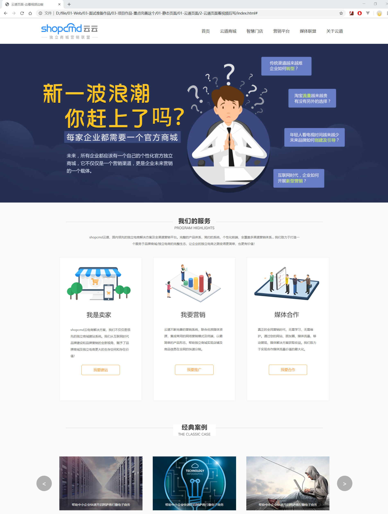

# 合作媒体制作

(还是自己先尝试写一遍，不能偷懒)

1.合作媒体和上面我们的服务模块是一样宽的，都是1055px。而且写法结构是一样的。

2.接下来是照片群，这个我试一下用表格做。(后来看视频，老师说表格不用来做布局，这个应该用列表[ul-li]做)

3.每个方框规格是233*80px。

4.难点是最下面和最右边的虚线如何去掉，老师讲了一个很巧妙的办法，我实在想不到。不行一个一个写样式也是可以的。

## 合作媒体最终代码

~~~html
<!DOCTYPE html>
<html lang="en">
<head>
	<meta charset="UTF-8">
	<title>云道页面-边看视频边敲</title>
	<!-- 引入外部的CSS文件 -->
	<link rel="stylesheet" href="css/index.css">
</head>
<body>
	<!-- 顶部导航栏开始了 -->
	<!-- header表示通栏，通栏里面的inner表示版心，
		版心里面的logo表示图片标识，在左边，要左浮动 
		版心里面的nav表示导航栏，在右边，要右浮动
		而且logo和nav是平级关系，它们是兄弟-->
	

		

			
<!-- 放logo,要左浮动 -->
				<!-- 切出来的图片高度是100px,宽度是223px -->
				<!-- 因为所有的Logo都是可以点的，所以在img前面再加上个超链接更好 -->
				
			

			

				<ul>
					<li><a href="#">首页</a></li>
					<li><a href="#">云道商城</a></li>
					<li><a href="#">智慧门店</a></li>
					<li><a href="#">营销平台</a></li>
					<li><a href="#">媒体联盟</a></li>
					<li><a href="#">关于云道</a></li>
				</ul>

			
<!-- 放导航栏，要右浮动 -->
		

	

	<!-- 顶部导航栏结束了 -->

	<!-- banner开始了 -->
	

		<!-- 如果直接这样写的话图片是歪着的，而且还有左右滚动条 -->
		<!--  -->
	

	<!-- banner结束了 -->

	<!-- 我们的服务模块开始了 -->
	

		<!-- service-hd表示head,上面的头，一个盒子，装我们的服务图片和下面的文字-->
		 

		 	<!-- 上面的一看就是标题 -->
		 	<h3></h3>
		 	<!-- 下面的一看就是文字 -->
		 	
shopcmd云道，国内领先的独立电商解决方案及全渠道营销平台。完整的产品体系，简约的系统，个性化前端，全覆盖多渠道营销体系...
我们致力于打造一个服务于品牌商城/独立电商的完整生态，让企业的独立电商之路变得更简单，也更有价值！

		 

		 <!-- service-bd表示body,下面的身子，一个盒子，里面还要包含3个小盒子，
		 	装图片，文字和我要推广的超链接-->
		 

		 	<ul>
		 		<li>
		 			
		 			
shopcmd云电商解决方案，我们不仅仅是领先的独立商城建站系统。我们从互联网时代品牌建设和品牌营销的全新视角，赋予了品牌商城及独立电商更大的生存空间和存在价值！

					<a href="#">我要建站</a>
		 		</li>
		 		<li class="yingxiao">
		 			
		 			
云道不断完善的营销系统，联合优质媒体资源，集成常用的网络营销模式及终端，以最简单的产品形态，帮助独立商城实现店铺及商品信息在全网的快速分销。

					<a href="#">我要推广</a>
		 		</li>
		 		<li>
		 			
		 			
真正的全民营销时代，无需学习，无需维护。通过您的网站、朋友圈、媒体流量、移动展现、媒体解决方案获取收益。我们致力于实现合作媒体流量价值的最大化。

					<a href="#">我要合作</a>
		 		</li>
		 	</ul>
		 

	

	<!-- 我们的服务模块结束了 -->

	<!-- 经典案例开始了 -->
	

		<!-- 使用的是service-hd的样式 -->
		

			<h3></h3>
		

		

				<ul>
					<li>
						
						
帮助中小企业快速开启阿萨德打撒电子商务

						<!-- 这个是一个面具，点击时罩在上面的-->
						

					</li>

					<li class="case-bd-middle">
						
						
帮助中小企业快速开启阿萨德打撒电子商务

						

					</li>

					<li>
						
						
帮助中小企业快速开启阿萨德打撒电子商务

						

					</li>
				</ul>
				<a href="#" class="left"><</a>
				<a href="#" class="right">></a>
			

	

	<!-- 经典案例结束了 -->

	<!-- 合作媒体开始了 -->
	

		<!-- 使用的是service-hd的样式 -->
		

			<h3></h3>
		

		
		<!-- 里面的li浮动，父盒子再清除浮动，让它有大小 -->
		

			<ul class="clearfix">
				<li></li>
				<li></li>
				<li><a href="#"></li>
				<li><a href="#"></li>
				<li><a href="#"></li>

				<li></li>
				<li></li>
				<li><a href="#"></li>
				<li><a href="#"></li>
				<li><a href="#"></li>

				<li></li>
				<li></li>
				<li><a href="#"></li>
				<li><a href="#"></li>
				<li><a href="#"></li>
			</ul>
		

	<!-- 合作媒体结束了 -->

</body>
</html>
~~~

~~~css
/*初始化：先删除默认的内外边距*/
*{
	margin: 0;
	padding: 0;
}

body{
   background-color: #fafafa;
   /*防止以后里面加的东西越来越多下面的看不见，先给body一个高，让它有上下滑轮，可以上下拉*/
   height: 3000px;
}

/*取消li的小点点*/
li{
   list-style: none;
}

 .clearfix:after {  content: ""; display: block; height: 0; clear: both; visibility: hidden;  }   

 .clearfix {*zoom: 1;}   /* IE6、7 专有 */

/*顶部导航栏开始了*/
.header{
   height: 100px;
   background-color: #fff;
}

.inner{
   width: 1200px;
   /*高100像素，和父亲一样高。高也要写啊，不写高度这个盒子就显示不了了*/
   height: 100px;
   /*background-color: pink;*/
   /*子盒子在父盒子里面居中对齐，就用margin:0 auto即可*/
   margin:0 auto;
   /*字的高就是inner的高(100px)，行高等于高等于100px就可以让字体垂直居中。*/

   /*为什么不直接给a(.nav li a)指定行高，而给它父亲(.inner)指定行高呢？
   ---因为行高会继承,这样会更加方便。*/
   /*字居中对齐方案1*/
   line-height: 100px;
}  

.logo{
   float: left;
}

.nav{
   float: right;
}

.nav ul{
   /*让ul这个父元素清除浮动，这样更好。虽然这个案例没有太多影响，可以不用写*/
   overflow: hidden;
}

/*如果li选择右浮动的话那么字就会反了，首页就会跑到最右边去了，就不对了*/
.nav li{
   float: left; 
   /*字居中对齐方案2*/
   /*line-height: 100px;*/

   /*调整字体间的间距:每个li上下为0，左右20px*/
   margin:0 20px;
}

.nav li a{
   color: #333;
   /*取消下划线*/
   text-decoration: none;
}

.nav li a:hover{
   color: #2288f6;
}
/*顶部导航栏结束了*/

/*banner开始了*/
.banner{
   /*这个banner不用给宽，给个高620就可以了*/
   height: 620px;
   /*这个还是歪着的，但是不会出现水平滚动条了*/
   /*background :url(../images/banner.jpg) no-repeat;*/
   /*这样又不会出现水平滚动条，又不会歪了*/
   background :url(../images/banner.jpg) no-repeat top center;
}
/*banner结束了*/

/*我们的服务模块开始了*/
/*我们的服务，经典案例用的是同一个样式*/
.service{
   /*我们的服务这个大盒子距离banner高度为75px*/
   /*margin属性用于设置外边距。  设置外边距会在元素之间创建“空白”，
   这段空白通常不能放置其他内容。*/
   /*margin-top: 75px;*/
   /*经过测量我们的服务版心高为1055px*/
   width: 1055px;

   /*经过测量我们的服务版心高为660px*/
   /*做到经典案例时，说这个高度可以不用给，注销掉*/
   /*height: 660px;*/

   /*background-color: pink;*/
   /*让这个大盒子居中对齐*/
   /*margin:0 auto会与上面的margin-top:75px产生重叠，从而让上面的margin-top:75px失效*/
   /*margin:0 auto;*/
   /*所以要把margin-top: 75px和margin:0 auto都注释掉，改为下面的这个写法*/
   margin:75px auto 0;
}

.service-hd{
   /*添加上面的那条线-上边框，但是它不用这么宽(1055px)*/
   /*上面的盒子要比父亲宽度小，下面的盒子要和父亲一样大，所以不能用padding*/
   /*解决方法：你可以给hd来一个margin左侧多少像素，margin右侧多少像素即可*/

   border-top: 1px solid #cccc;
   /*解决上面的一个盒子上边框小于父盒子宽度(1055px)的方法：使用margin,左右都离父盒子25px的距离*/
   margin:0 25px;
}

.service-hd h3{
   /*h3是块级元素，要让块级元素里面的图片居中对齐，必须要给宽度*/
   /*外边距实现盒子居中(重要)

   可以让一个盒子实现水平居中，需要满足一下两个条件：
   1. 必须是块级元素。     
   2. 盒子必须指定了宽度（width）（如果没给宽则默认和屏幕一样宽）
   然后就给左右的外边距都设置为auto，就可使块级元素水平居中。*/
   /*我们裁剪的图片大小为167*46像素*/
   width: 167px;
   height: 46px;
   /*让图片居中 同时让图片往上走15像素，盖住横线*/
   margin:-15px auto 0;
   /*让图片往上走15像素，盖住横线*/
   /*margin-top: -15px;*/
}

.service-hd p{
   font-size: 12px;
   color: #666;
   /*文字之间太紧了，写个行高。p里面肯定有行高的*/
   line-height: 26px;
   /*让文字居中对齐*/
   text-align: center;
   /*给p弄一个宽度*/
   width: 831px;
   /*p盒子是块级元素，块级元素居中对齐,还要和上面保持一些间隔，所以连在一起写*/
   margin:15px auto 0;
}

.service-bd li{
   width:320px;
   height:560px;
   background-color: #fff;
   /*让3个小盒子左侧浮动*/
   float:left;
   border: 1px solid #e7e8e9;
}

.service-bd {
   /*上面的3个小盒子距离上面的文字距离大概40px*/
   margin-top: 40px;
      /*bd是父盒子，里面的3个li浮动了，所以脱标不占位置了，
   要想让我们的服务版心高660px注释掉，就要清除浮动
   清除完浮动以后660的高度就可以扔掉了*/
   overflow: hidden;

}

.service-bd img{
   margin-bottom: 20px;
}
.service-bd p{
   font-size: 12px;
   color: #666;
   width: 235px;
   /*这个必须要给个高，不然下面的a就无法对齐了*/
   height: 120px;
   margin: 0 auto;
   line-height: 26px;
}

.service-bd a{
   display: block;
   width: 148px;
   height: 38px;
   border: 1px solid #ff9412;
   /*让这个超链接水平居中,并且离上面有30px距离*/
   margin: 30px auto;
   /*文字水平居中*/
   text-align: center;
   /*文字垂直居中*/
   line-height: 38px;
   color:#ff9412;
   font-size: 14px;
   /*取消下划线*/
   text-decoration: none;
   /*给长方形一个圆角*/
   border-radius: 5px;
}

.service-bd a:hover{
   color: #fff;
   background-color: #ff9412;
}

.yingxiao{
   /*直接给中间的盒子来一个左右margin就可以了*/
   margin:0 44px;
}

/*我们的服务模块结束了*/

/*经典案例开始了*/
.case{
   width: 1055px;
   margin: 105px auto 0;
}

.case-bd li{
   /*每个li里面的图片规格是325*210，准确的是322*211，取个整数*/
   width: 325px;
   height: 210px;
   /*background-color: pink;*/
   /*li是块级元素，要让它横在一起*/
   float: left;
   /*用li做text的父亲比较合适*/
   position: relative;
}

.case-bd img{
   /*实际切出来的三张图片宽度不一致，分别为323px,324px,322px,所以来统一一下*/
   width: 325px;
   height: 210px;
}

.case-bd-middle{
   margin: 0 40px;
}

.case-bd{
   margin-top: 80px;
   /*a是绝对定位，找到它的父亲case-bd来相对定位*/
   position: relative;
   /*3个盒子加了浮动所以bd没有高了，但也不能用overflow:hidden，
   因为左右箭头是要出去的，清除浮动后超出这个盒子就被切掉了，
   就不见了,所以用afer伪元素来清除浮动比较好*/
   /*overflow: hidden;不能用*/
}

.text{
   /*半透明的文字高度为45px*/
   height: 45px;
   /*宽度可以不用给，或者给个100%都行*/
   width: 100%;
   /*border: 1px solid #ccc;*/
   /*字要压着图片，所以肯定用定位做比较好-子绝父相*/
   position: absolute;
   /*给定位设置边偏移，靠左下方对齐*/
   left: 0;
   bottom: 0;
   /*设置阴影*/
   background:rgba(0,0,0,0.3);
   /*设置文字水平居中*/
   line-height: 45px;
   text-align: center;
   /*设置文字颜色*/
   color: #fff;
   /*设置文字大小*/
   font-size: 12px;
}

.mask{
   /*"面具"的宽度和高度都是100%,和li一样*/
   width: 100%;
   height: 100%;

   /*给面具设置阴影,背景(注意这个是CSS,路径要加../)*/
   background: rgba(0,0,0,0.5) url(../images/fdj.png) center no-repeat;

   /*这个肯定是要用定位的*/
   position: absolute;
   /*设置边偏移：左上角对齐*/
   top: 0;
   left: 0;

   /*刚开始不要看见，等鼠标经过li的时候才显示*/
   display: none;
}

/*表示鼠标经过li的时候，它里面的mask会显示出来*/
.case-bd li:hover .mask{
   display: block;
}

.left,.right{
   width: 60px;
   height: 60px;
   background: rgba(0,0,0,0.3);
   /*a是行内元素本来应该要转换的，但是恰巧我用定位，可以自动转换成行内块元素*/
   position: absolute;
   /*接下来垂直居中:先走父亲的一半，再走自己盒子的一半*/
   top: 50%;
   margin-top: -30px;

   /*垂直居中*/
   line-height: 60px;
   text-align: center;
   /*修改颜色*/
   color:#fff;
   /*取消下划线*/
   text-decoration: none;
   /*给箭头一个大小*/
   font-size: 25px;
   /*把箭头形状改为圆形*/
   border-radius: 50%;

}

.left{
   /*left: 0;*/
   left: -90px;
}

.right{
   /*right:0;*/
   right: -90px;
}

/*left和right就是case里面的a*/
.case-bd a:hover{
   background: rgba(0,0,0,0.4);
}
/*经典案例结束了*/

/*合作媒体开始了*/
.media-bd li{
   /*每个小方框宽度为210px，高度为80px,一共要有15个*/
   /*宽度要量好，不然方框会掉下去*/
   width: 210px;
   /*height: 80px;*/
   height: 60px;
   /*background-color: pink;*/
   /*li要浮动*/
   float: left;
   /*加边框*/
   border-right: 1px dashed #ccc;
   border-bottom: 1px dashed #ccc;
   /*如何去掉最右边和最下边的虚线呢?用overflow:hidden
   孩子比父亲大，切一部分就可以了
   先手动给父亲一个宽*/

   /*让li水平居中*/
   text-align: center;
   line-height: 80px;
   /*让li垂直居中,这个写了20px,height原来是80，也减去20，变成60*/
   padding-top: 20px;

}

.media-bd ul{
   /*只要li的宽度210*5=1050<1060,那么浮动就不会掉下来*/
   width: 1060px;
}
.media-bd{
   /*给li的爷爷宽1048px,高240px,用这个来overflow:hidden来切*/
   width: 1048px;
   height: 240px;
   /*border: 1px solid red;*/
   /*这个目前我是怎么也想不到的，不会*/
   /*不会用这个方法也就可以一个一个写*/
   overflow: hidden;

   /*距离上面一个小距离*/
   margin-top: 40px;
}
/*合作媒体结束了*/
~~~

## 合作媒体最终效果

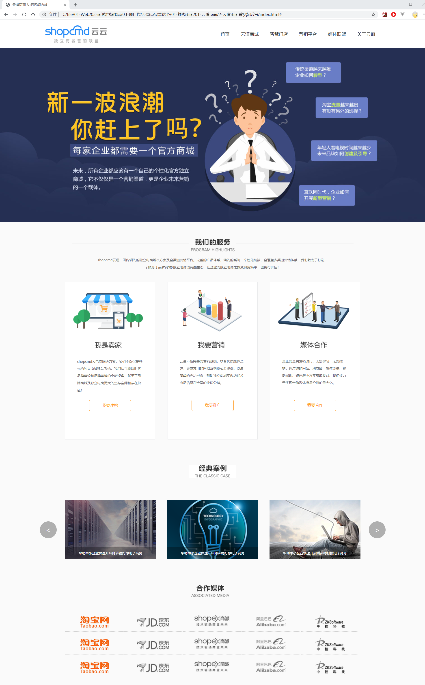

# 页面底部制作

1.页面底部就相对比较简单了，做完之后整个页面也就全部完成了。唉，断断续续的这么一个页面居然写了一个星期才完成。

2.不能偷懒，还是要自己先写一遍。

# 大功告成

## 最终代码

~~~html
<!DOCTYPE html>
<html lang="en">
<head>
	<meta charset="UTF-8">
	<title>云道页面-边看视频边敲</title>
	<!-- 引入外部的CSS文件 -->
	<link rel="stylesheet" href="css/index.css">
</head>
<body>
	<!-- 顶部导航栏开始了 -->
	<!-- header表示通栏，通栏里面的inner表示版心，
		版心里面的logo表示图片标识，在左边，要左浮动 
		版心里面的nav表示导航栏，在右边，要右浮动
		而且logo和nav是平级关系，它们是兄弟-->
	

		

			
<!-- 放logo,要左浮动 -->
				<!-- 切出来的图片高度是100px,宽度是223px -->
				<!-- 因为所有的Logo都是可以点的，所以在img前面再加上个超链接更好 -->
				
			

			

				<ul>
					<li><a href="#">首页</a></li>
					<li><a href="#">云道商城</a></li>
					<li><a href="#">智慧门店</a></li>
					<li><a href="#">营销平台</a></li>
					<li><a href="#">媒体联盟</a></li>
					<li><a href="#">关于云道</a></li>
				</ul>

			
<!-- 放导航栏，要右浮动 -->
		

	

	<!-- 顶部导航栏结束了 -->

	<!-- banner开始了 -->
	

		<!-- 如果直接这样写的话图片是歪着的，而且还有左右滚动条 -->
		<!--  -->
	

	<!-- banner结束了 -->

	<!-- 我们的服务模块开始了 -->
	

		<!-- service-hd表示head,上面的头，一个盒子，装我们的服务图片和下面的文字-->
		 

		 	<!-- 上面的一看就是标题 -->
		 	<h3></h3>
		 	<!-- 下面的一看就是文字 -->
		 	
shopcmd云道，国内领先的独立电商解决方案及全渠道营销平台。完整的产品体系，简约的系统，个性化前端，全覆盖多渠道营销体系...
我们致力于打造一个服务于品牌商城/独立电商的完整生态，让企业的独立电商之路变得更简单，也更有价值！

		 

		 <!-- service-bd表示body,下面的身子，一个盒子，里面还要包含3个小盒子，
		 	装图片，文字和我要推广的超链接-->
		 

		 	<ul>
		 		<li>
		 			
		 			
shopcmd云电商解决方案，我们不仅仅是领先的独立商城建站系统。我们从互联网时代品牌建设和品牌营销的全新视角，赋予了品牌商城及独立电商更大的生存空间和存在价值！

					<a href="#">我要建站</a>
		 		</li>
		 		<li class="yingxiao">
		 			
		 			
云道不断完善的营销系统，联合优质媒体资源，集成常用的网络营销模式及终端，以最简单的产品形态，帮助独立商城实现店铺及商品信息在全网的快速分销。

					<a href="#">我要推广</a>
		 		</li>
		 		<li>
		 			
		 			
真正的全民营销时代，无需学习，无需维护。通过您的网站、朋友圈、媒体流量、移动展现、媒体解决方案获取收益。我们致力于实现合作媒体流量价值的最大化。

					<a href="#">我要合作</a>
		 		</li>
		 	</ul>
		 

	

	<!-- 我们的服务模块结束了 -->

	<!-- 经典案例开始了 -->
	

		<!-- 使用的是service-hd的样式 -->
		

			<h3></h3>
		

		

				<ul>
					<li>
						
						
帮助中小企业快速开启阿萨德打撒电子商务

						<!-- 这个是一个面具，点击时罩在上面的-->
						

					</li>

					<li class="case-bd-middle">
						
						
帮助中小企业快速开启阿萨德打撒电子商务

						

					</li>

					<li>
						
						
帮助中小企业快速开启阿萨德打撒电子商务

						

					</li>
				</ul>
				<a href="#" class="left"><</a>
				<a href="#" class="right">></a>
			

	

	<!-- 经典案例结束了 -->

	<!-- 合作媒体开始了 -->
	

		<!-- 使用的是service-hd的样式 -->
		

			<h3></h3>
		

		
		<!-- 里面的li浮动，父盒子再清除浮动，让它有大小 -->
		

			<ul class="clearfix">
				<li></li>
				<li></li>
				<li><a href="#"></li>
				<li><a href="#"></li>
				<li><a href="#"></li>

				<li></li>
				<li></li>
				<li><a href="#"></li>
				<li><a href="#"></li>
				<li><a href="#"></li>

				<li></li>
				<li></li>
				<li><a href="#"></li>
				<li><a href="#"></li>
				<li><a href="#"></li>
			</ul>
		

	

	<!-- 合作媒体结束了 -->

	<!-- 页面底部开始了 -->
	

		

			<a href="#">shopcmd</a> |
			<a href="#">首页</a> |
			<a href="#">官网云商城</a> |
			<a href="#">智慧门店</a> |
			<a href="#">营销平台</a> |
			<a href="#">媒体联盟</a> |
			<a href="#">关于我们</a> 
		

		
&copy Copyright 2015 苏州海云网络科技有限公司版权所有 | 苏ICP备15038170号-3

	

	<!-- 页面底部结束了 -->
</body>
</html>
	
~~~

~~~css
/*初始化：先删除默认的内外边距*/
*{
	margin: 0;
	padding: 0;
}

body{
   background-color: #fafafa;
   /*防止以后里面加的东西越来越多下面的看不见，先给body一个高，让它有上下滑轮，可以上下拉*/
   /*写到底部的时候就可以去掉了，不用了*/
   /*height: 3000px;*/
}

/*取消li的小点点*/
li{
   list-style: none;
}

 .clearfix:after {  content: ""; display: block; height: 0; clear: both; visibility: hidden;  }   

 .clearfix {*zoom: 1;}   /* IE6、7 专有 */

/*顶部导航栏开始了*/
.header{
   height: 100px;
   background-color: #fff;
}

.inner{
   width: 1200px;
   /*高100像素，和父亲一样高。高也要写啊，不写高度这个盒子就显示不了了*/
   height: 100px;
   /*background-color: pink;*/
   /*子盒子在父盒子里面居中对齐，就用margin:0 auto即可*/
   margin:0 auto;
   /*字的高就是inner的高(100px)，行高等于高等于100px就可以让字体垂直居中。*/

   /*为什么不直接给a(.nav li a)指定行高，而给它父亲(.inner)指定行高呢？
   ---因为行高会继承,这样会更加方便。*/
   /*字居中对齐方案1*/
   line-height: 100px;
}  

.logo{
   float: left;
}

.nav{
   float: right;
}

.nav ul{
   /*让ul这个父元素清除浮动，这样更好。虽然这个案例没有太多影响，可以不用写*/
   overflow: hidden;
}

/*如果li选择右浮动的话那么字就会反了，首页就会跑到最右边去了，就不对了*/
.nav li{
   float: left; 
   /*字居中对齐方案2*/
   /*line-height: 100px;*/

   /*调整字体间的间距:每个li上下为0，左右20px*/
   margin:0 20px;
}

.nav li a{
   color: #333;
   /*取消下划线*/
   text-decoration: none;
}

.nav li a:hover{
   color: #2288f6;
}
/*顶部导航栏结束了*/

/*banner开始了*/
.banner{
   /*这个banner不用给宽，给个高620就可以了*/
   height: 620px;
   /*这个还是歪着的，但是不会出现水平滚动条了*/
   /*background :url(../images/banner.jpg) no-repeat;*/
   /*这样又不会出现水平滚动条，又不会歪了*/
   background :url(../images/banner.jpg) no-repeat top center;
}
/*banner结束了*/

/*我们的服务模块开始了*/
/*我们的服务，经典案例用的是同一个样式*/
.service{
   /*我们的服务这个大盒子距离banner高度为75px*/
   /*margin属性用于设置外边距。  设置外边距会在元素之间创建“空白”，
   这段空白通常不能放置其他内容。*/
   /*margin-top: 75px;*/
   /*经过测量我们的服务版心高为1055px*/
   width: 1055px;

   /*经过测量我们的服务版心高为660px*/
   /*做到经典案例时，说这个高度可以不用给，注销掉*/
   /*height: 660px;*/

   /*background-color: pink;*/
   /*让这个大盒子居中对齐*/
   /*margin:0 auto会与上面的margin-top:75px产生重叠，从而让上面的margin-top:75px失效*/
   /*margin:0 auto;*/
   /*所以要把margin-top: 75px和margin:0 auto都注释掉，改为下面的这个写法*/
   margin:75px auto 0;
}

.service-hd{
   /*添加上面的那条线-上边框，但是它不用这么宽(1055px)*/
   /*上面的盒子要比父亲宽度小，下面的盒子要和父亲一样大，所以不能用padding*/
   /*解决方法：你可以给hd来一个margin左侧多少像素，margin右侧多少像素即可*/

   border-top: 1px solid #cccc;
   /*解决上面的一个盒子上边框小于父盒子宽度(1055px)的方法：使用margin,左右都离父盒子25px的距离*/
   margin:0 25px;
}

.service-hd h3{
   /*h3是块级元素，要让块级元素里面的图片居中对齐，必须要给宽度*/
   /*外边距实现盒子居中(重要)

   可以让一个盒子实现水平居中，需要满足一下两个条件：
   1. 必须是块级元素。     
   2. 盒子必须指定了宽度（width）（如果没给宽则默认和屏幕一样宽）
   然后就给左右的外边距都设置为auto，就可使块级元素水平居中。*/
   /*我们裁剪的图片大小为167*46像素*/
   width: 167px;
   height: 46px;
   /*让图片居中 同时让图片往上走15像素，盖住横线*/
   margin:-15px auto 0;
   /*让图片往上走15像素，盖住横线*/
   /*margin-top: -15px;*/
}

.service-hd p{
   font-size: 12px;
   color: #666;
   /*文字之间太紧了，写个行高。p里面肯定有行高的*/
   line-height: 26px;
   /*让文字居中对齐*/
   text-align: center;
   /*给p弄一个宽度*/
   width: 831px;
   /*p盒子是块级元素，块级元素居中对齐,还要和上面保持一些间隔，所以连在一起写*/
   margin:15px auto 0;
}

.service-bd li{
   width:320px;
   height:560px;
   background-color: #fff;
   /*让3个小盒子左侧浮动*/
   float:left;
   border: 1px solid #e7e8e9;
}

.service-bd {
   /*上面的3个小盒子距离上面的文字距离大概40px*/
   margin-top: 40px;
      /*bd是父盒子，里面的3个li浮动了，所以脱标不占位置了，
   要想让我们的服务版心高660px注释掉，就要清除浮动
   清除完浮动以后660的高度就可以扔掉了*/
   overflow: hidden;

}

.service-bd img{
   margin-bottom: 20px;
}
.service-bd p{
   font-size: 12px;
   color: #666;
   width: 235px;
   /*这个必须要给个高，不然下面的a就无法对齐了*/
   height: 120px;
   margin: 0 auto;
   line-height: 26px;
}

.service-bd a{
   display: block;
   width: 148px;
   height: 38px;
   border: 1px solid #ff9412;
   /*让这个超链接水平居中,并且离上面有30px距离*/
   margin: 30px auto;
   /*文字水平居中*/
   text-align: center;
   /*文字垂直居中*/
   line-height: 38px;
   color:#ff9412;
   font-size: 14px;
   /*取消下划线*/
   text-decoration: none;
   /*给长方形一个圆角*/
   border-radius: 5px;
}

.service-bd a:hover{
   color: #fff;
   background-color: #ff9412;
}

.yingxiao{
   /*直接给中间的盒子来一个左右margin就可以了*/
   margin:0 44px;
}

/*我们的服务模块结束了*/

/*经典案例开始了*/
.case{
   width: 1055px;
   margin: 105px auto 0;
}

.case-bd li{
   /*每个li里面的图片规格是325*210，准确的是322*211，取个整数*/
   width: 325px;
   height: 210px;
   /*background-color: pink;*/
   /*li是块级元素，要让它横在一起*/
   float: left;
   /*用li做text的父亲比较合适*/
   position: relative;
}

.case-bd img{
   /*实际切出来的三张图片宽度不一致，分别为323px,324px,322px,所以来统一一下*/
   width: 325px;
   height: 210px;
}

.case-bd-middle{
   margin: 0 40px;
}

.case-bd{
   margin-top: 80px;
   /*a是绝对定位，找到它的父亲case-bd来相对定位*/
   position: relative;
   /*3个盒子加了浮动所以bd没有高了，但也不能用overflow:hidden，
   因为左右箭头是要出去的，清除浮动后超出这个盒子就被切掉了，
   就不见了,所以用afer伪元素来清除浮动比较好*/
   /*overflow: hidden;不能用*/
}

.text{
   /*半透明的文字高度为45px*/
   height: 45px;
   /*宽度可以不用给，或者给个100%都行*/
   width: 100%;
   /*border: 1px solid #ccc;*/
   /*字要压着图片，所以肯定用定位做比较好-子绝父相*/
   position: absolute;
   /*给定位设置边偏移，靠左下方对齐*/
   left: 0;
   bottom: 0;
   /*设置阴影*/
   background:rgba(0,0,0,0.3);
   /*设置文字水平居中*/
   line-height: 45px;
   text-align: center;
   /*设置文字颜色*/
   color: #fff;
   /*设置文字大小*/
   font-size: 12px;
}

.mask{
   /*"面具"的宽度和高度都是100%,和li一样*/
   width: 100%;
   height: 100%;

   /*给面具设置阴影,背景(注意这个是CSS,路径要加../)*/
   background: rgba(0,0,0,0.5) url(../images/fdj.png) center no-repeat;

   /*这个肯定是要用定位的*/
   position: absolute;
   /*设置边偏移：左上角对齐*/
   top: 0;
   left: 0;

   /*刚开始不要看见，等鼠标经过li的时候才显示*/
   display: none;
}

/*表示鼠标经过li的时候，它里面的mask会显示出来*/
.case-bd li:hover .mask{
   display: block;
}

.left,.right{
   width: 60px;
   height: 60px;
   background: rgba(0,0,0,0.3);
   /*a是行内元素本来应该要转换的，但是恰巧我用定位，可以自动转换成行内块元素*/
   position: absolute;
   /*接下来垂直居中:先走父亲的一半，再走自己盒子的一半*/
   top: 50%;
   margin-top: -30px;

   /*垂直居中*/
   line-height: 60px;
   text-align: center;
   /*修改颜色*/
   color:#fff;
   /*取消下划线*/
   text-decoration: none;
   /*给箭头一个大小*/
   font-size: 25px;
   /*把箭头形状改为圆形*/
   border-radius: 50%;

}

.left{
   /*left: 0;*/
   left: -90px;
}

.right{
   /*right:0;*/
   right: -90px;
}

/*left和right就是case里面的a*/
.case-bd a:hover{
   background: rgba(0,0,0,0.4);
}
/*经典案例结束了*/

/*合作媒体开始了*/
.media-bd li{
   /*每个小方框宽度为210px，高度为80px,一共要有15个*/
   /*宽度要量好，不然方框会掉下去*/
   width: 210px;
   /*height: 80px;*/
   height: 60px;
   /*background-color: pink;*/
   /*li要浮动*/
   float: left;
   /*加边框*/
   border-right: 1px dashed #ccc;
   border-bottom: 1px dashed #ccc;
   /*如何去掉最右边和最下边的虚线呢?用overflow:hidden
   孩子比父亲大，切一部分就可以了
   先手动给父亲一个宽*/

   /*让li水平居中*/
   text-align: center;
   line-height: 80px;
   /*让li垂直居中,这个写了20px,height原来是80，也减去20，变成60*/
   padding-top: 20px;

}

.media-bd ul{
   /*只要li的宽度210*5=1050<1060,那么浮动就不会掉下来*/
   width: 1060px;
}
.media-bd{
   /*给li的爷爷宽1048px,高240px,用这个来overflow:hidden来切*/
   width: 1048px;
   height: 240px;
   /*border: 1px solid red;*/
   /*这个目前我是怎么也想不到的，不会*/
   /*不会用这个方法也就可以一个一个写*/
   overflow: hidden;

   /*距离上面一个小距离*/
   margin-top: 40px;
}
/*合作媒体结束了*/

/*页面底部开始了*/
.footer{
   /*width: 1055px;*/
   height: 165px;
   background-color: #212425;
   margin-top: 100px;
   /*用于解决外边距塌陷*/
   overflow: hidden;
}

.subnav{
   text-align: center;
   /*外边距塌陷的问题，它会带着父亲一块走*/
   /*解决方法：为父盒子加一个overflow:hidden,或者加个边框也行*/
   margin-top: 50px;
   /*竖线|不归a管，但是归subnav管，在这里修改竖线的颜色*/
   color: #f0f1f1;
   /*把竖线也改成14号*/
    font-size: 14px;
}

.subnav a{
   color: #f0f1f1;
   text-decoration: none;
   /*修改边距*/
   padding:0 5px;
   font-size: 14px;
}

.subnav a:hover{
   color: #2288f6;
   text-decoration: underline;
}

.footer p{
   text-align: center;
   color: #888;
   margin-top: 30px;
}
/*页面底部结束了*/
~~~

## 最终效果

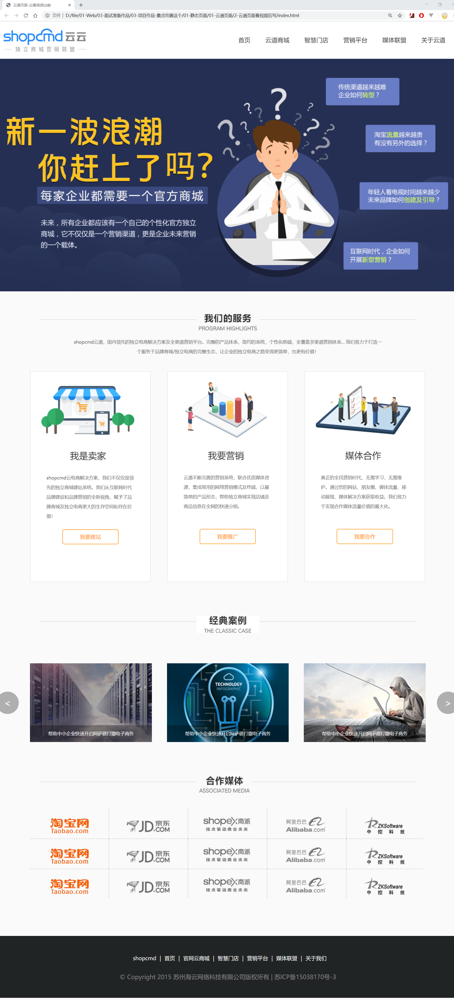

# 后记

唉，搞了一个星期，主要是看视频，边看边敲，终于弄完了。也算是复习了一遍吧。

这个就算我们第一个比较正式的静态页面了吧，唯一不足的是不是自己独立完成的(我尝试过独立完成，但是失败了，想着不能钻牛角尖，不能死磕，所以最终还是选择了看视频。)

自己的HTML,CSS基本功还是不熟练，还需要多做几个静态页面才行啊。

接下来准备继续跟着视频做京东页面，当然也是自己先做一遍，等卡壳了再看视频。

今后也把自己写的代码放在文章里，看和视频里写的到底差在哪里吧。

自学前端已经10个月了，学来学去学成了这个鬼样子，连个静态页面也不能独立完成。

唉，但是也不要像之前那样心急，先打好基础功再说吧。

不能急，稳步推进，自己以后的学习状态也要调整好了啊。

