(注1：现在是2020年6月22日，第一遍我还是再看一遍视频边看边抄吧，这个比云道页面要复杂很多)

(注2：但是看视频之前每个模块还是要自己先手写一遍)

(注3：现在是2020年6月26日，看了视频几天了，发现现在以我的能力单独写我真的是写不出来，基础还是不行啊，还要练啊)

(注4：现在是2020年10月26日，偶然间打开了这篇博文，发现我具体没有把源码贴上来，我都不知道当初是我怎么写这篇博文的，现在补上吧。)

(注5：到时候等自己的Git学的差不多了，把自己这些静态页面作品放到Github上去。)

# 京东项目

## 京东项目介绍

项目名称：京东网
项目描述：京东首页公共部分的头部和尾部制作，京东首页中间部分。


## 项目背景

现阶段电商类网站很流行，很多同学毕业之后会进入电商类企业工作，同时电商类网站需要的技术也是较为复杂的，这里用京东电商网站复习、总结、提高前面所学布局技术。其实，最主要的原因还是，为啥写京东？  因为刘强东，赚了我们的钱，抢了我们的女神， 我们也要学刘强东，赚别人的钱，抢别人..额，自己的女神。。。

## 设计目标

- 保证浏览器 ie7及以上, 火狐, 360, safari，chrome等。谁让我再测ie6，就跟谁急。。
- 熟悉CSS+DIV布局，页面的搭建工作
- 了解常用电商类网站的布局模式
- 为后期京东移动端做铺垫

## 几点思考

(1)开发工具  sublime  、fireworks（ps）、各种浏览器(ie6.7 要测看心情)

(2) CSS Reset 类库,为跨浏览器兼容做准备(也可以直接运用jd网站的初始化)

```
Normalize.css   只是一个很小的CSS文件，但它在默认的HTML元素样式上提供了跨浏览器的高度一致性。相比于传统的CSS reset，Normalize.css是一种现代的、为HTML5准备的优质替代方案。Normalize.css现在已经被用于Twitter Bootstrap、HTML5 Boilerplate、GOV.UK、Rdio、CSS Tricks 以及许许多多其他框架、工具和网站上。 你值得拥有。。 

- 保护有用的浏览器默认样式而不是完全去掉它们
- 一般化的样式：为大部分HTML元素提供
- 修复浏览器自身的bug并保证各浏览器的一致性
- 优化CSS可用性：用一些小技巧
- 解释代码：用注释和详细的文档来
```

> Normalize.css  是某个大神花了几百个小时，专门去研究各种通用的方案和浏览器的兼容性等问题而开发出来的CSS库，用来做CSS初始化的。
>
> Normalize.css和CSS reset的区别：
>
> reset清空重置，格杀勿论，片甲不留
>
> normalize道法自然，去伪存真，阿弥陀佛

(3)技术栈

```
HTML 结构 + CSS  布局 (因为我们就会这些。。。嘻嘻)
```

(4)低版本浏览器 单独制作一个跳转页面 (都是孩子，也舍不得打，舍不得扔)

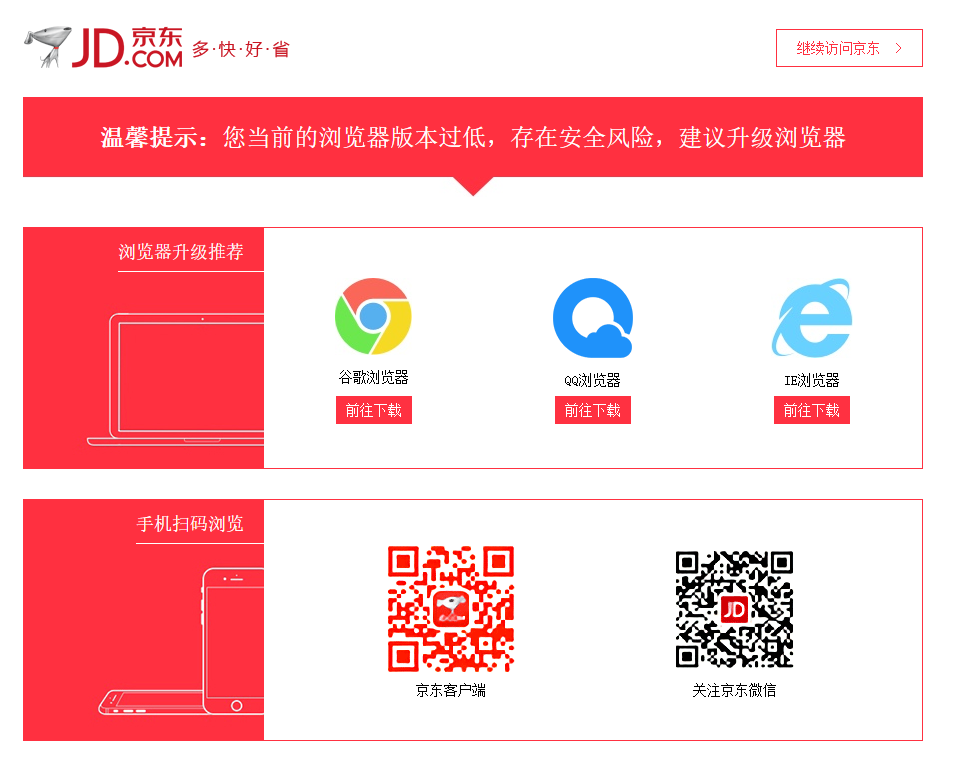

## 目录说明

要实现结构和样式相分离的设计思想。 根目录下有这4个文件（目录）。

| 名称   | 说明                       |
| ------ | -------------------------- |
| css    | 用于存放CSS文件            |
| images | 用于存放图片               |
| index  | 京东首页 HTML              |
| js     | 用于后期存放javascript文件 |

## 运用知识点

### 引入ico图标 


~~~html
代码：  <link rel="shortcut icon" href="favicon.ico"  type="image/x-icon"/>     
~~~

注意： 

1. 她(它)**不是iconfont字体**, **也不是图片**。
2. 位置是放到 head 标签中间。
3. 后面的type="image/x-icon"  属性可以省略。（我相信你也愿意省略。）
4. 为了兼容性，请将favicon.ico 这个图标放到**根目录**下。（我们就不要任性了，听话放位置，省很多麻烦。。你好，我也好）

> 在网址末尾再输入/favicon.ico可以得到该网站的图标，图标位置直接放根目录，不放images文件

### 转换ico图标

我们可以自己做的图片，转换为 ico图标，以便放到我们站点里面。 http://www.bitbug.net/

### 网站优化三大标签

SEO是由英文Search Engine Optimization缩写而来， 中文意译为“搜索引擎优化”！SEO是指通过对网站进行站内优化、网站结构调整、网站内容建设、网站代码优化等)和站外优化，从而提高网站的关键词排名以及公司产品的曝光度。 简单的说就是，把产品做好，搜索引擎就会介绍客户来。  

 我们现在阶段主要进行站内优化。网站优化，我们应该要懂。。。

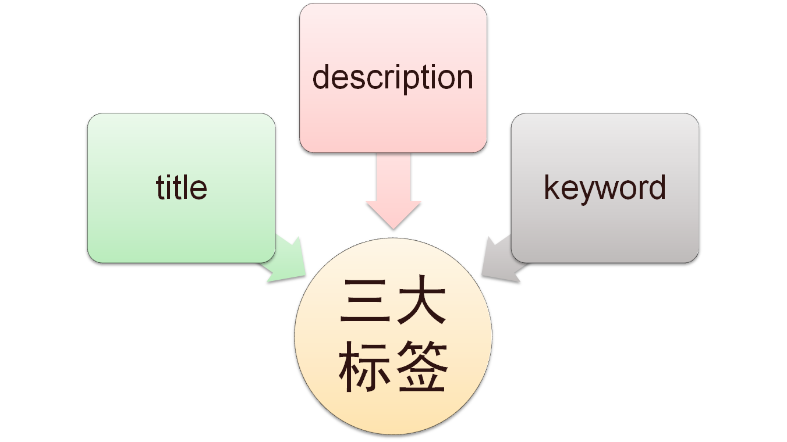

#### 网页title 标题

title具有不可替代性，是我们的内页第一个重要标签，是搜索引擎了解网页的入口，和对网页主题归属的最佳判断点。

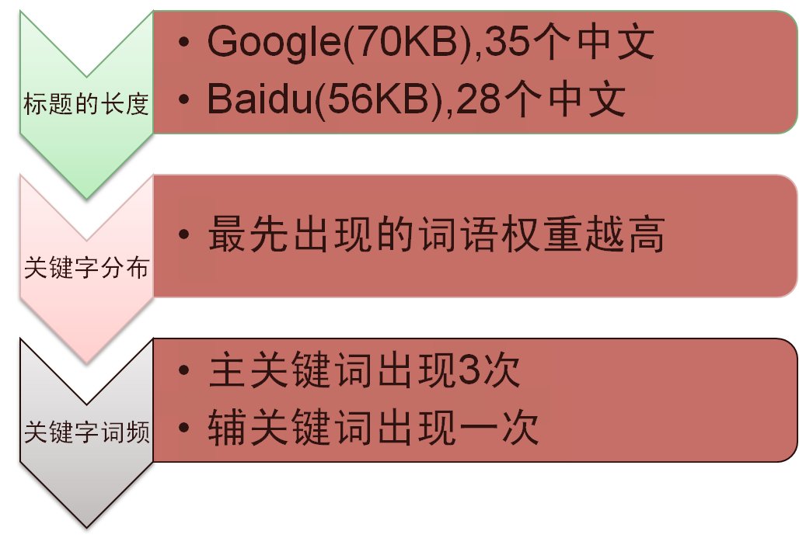

建议：

首页标题：网站名（产品名）- 网站的介绍    

例如：

京东(JD.COM)-综合网购首选-正品低价、品质保障、配送及时、轻松购物！

小米商城 - 小米5s、红米Note 4、小米MIX、小米笔记本官方网站

#### Description  网站说明

对于关键词的作用明显降低，但由于很多搜索引擎，仍然大量采用网页的MATA标签中描述部分作为搜索结果的“内容摘要”。 就是简要说明我们网站的主要做什么的。
我们提倡，Description作为网站的总体业务和主题概括，多采用“我们是…”“我们提供…”“×××网作为…”“电话：010…”之类语句。

京东网：

~~~html
<meta name="description" content="京东JD.COM-专业的综合网上购物商城,销售家电、数码通讯、电脑、家居百货、服装服饰、母婴、图书、食品等数万个品牌优质商品.便捷、诚信的服务，为您提供愉悦的网上购物体验!" />
~~~

注意点：

1. 描述中出现关键词，与正文内容相关，这部分内容是**给人看的**，所以要写的很详细，让人感兴趣， 吸引用户点击。
2. 同样遵循简短原则，字符数含空格在内**不要超过120个汉字**。
3. 补充在 title  和 keywords  中未能充分表述的说明.
4. 用**英文逗号** 关键词1,关键词2

~~~html
<meta name="description" content="小米商城直营小米公司旗下所有产品，囊括小米手机系列小米MIX、小米Note 2，红米手机系列红米Note 4、红米4，智能硬件，配件及小米生活周边，同时提供小米客户服务及售后支持。" />
~~~

#### Keywords 关键字

Keywords是页面关键词，是搜索引擎关注点之一。Keywords应该限制在**6～8个**关键词左右，电商类网站可以多 少许。

京东网：

~~~html
<meta name="Keywords" content="网上购物,网上商城,手机,笔记本,电脑,MP3,CD,VCD,DV,相机,数码,配件,手表,存储卡,京东" />
~~~

小米网：

~~~html
<meta name="keywords" content="小米,小米6,红米Note4,小米MIX,小米商城" />
~~~

## 顶部（快捷菜单）所用知识点

| 知识点                                 | 说明                                                         |
| -------------------------------------- | ------------------------------------------------------------ |
| 通栏的盒子                             | 不用给宽度  默认为 100%  但是加了浮动和定位的盒子需要 添加 100% |
| 盒子居中对齐                           | margin: auto;  注意必须有宽度的块级元素，文字水平居中对齐是 text-align:center; |
| 行高会继承                             | 文字性质的，比如 颜色、文字大小、字体、行高等会继承父级元素  |
| 浮动元素、固定定位，绝对定位会模式转换 | 具有行内块特性，比如一行放多个，有高度和宽度，如果没有指定宽度，则会根据内容多少撑开。 |

> 1.一个盒子，只给高不给宽，背景色黑色，通栏。
>
> 2.建一个版心的盒子，居中对齐。
>
> 3.这个盒子右上方放了一个非常隐藏的小叉号，用超链接来做。

## logo 和搜索 header 区域所用知识点

### 网页布局稳定性

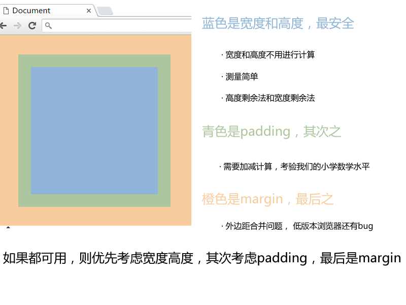

### 宽度剩余法：

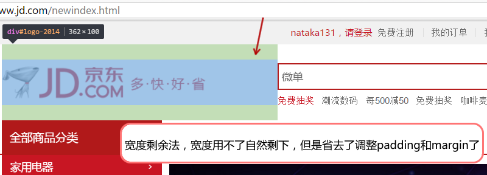

| 知识点       | 说明                                                         |
| ------------ | ------------------------------------------------------------ |
| 浮动元素特性 | 1. 浮动可以让多个元素同一行显示 2. 浮动的元素是顶部对齐      |
| logo优化     | text-indent: -20000px; 隐藏文字， 背景图片                   |
| 清除浮动     | 清除浮动的目的就是为了解决父亲高度为0的问题                  |
| 鼠标样式     | cursor: pointer;           小手      cursor: move;            四角箭头     cursor: text;  插入光标     cursor: default;  小白 |
| 不允许换行   | white-space: nowrap;                                         |

## nav导航栏所用知识点

| 名称         | 说明                                                         |
| ------------ | ------------------------------------------------------------ |
| 边框底侧     | border-bottom: 2px solid #ccc;                               |
| 定位重点     | 绝对定位不占位置  相对定位占有位置                           |
| 标签语义化dl | dl也是块级元素 dt 是 定义标题  dd 是定义描述，dd是围绕这dt来描述的，也就是说，dd算是dt 的解释说明详细分解。 |
| 标题标签h    | 尽量少用h1，可以多用h2和h3等标签                             |

> 做完首部然后做的是底部！！！因为这2个是通用的，最后才做中间的部分。

## 页面底部所用知识点

| 名称                   | 说明                                                         |
| ---------------------- | ------------------------------------------------------------ |
| 绝对定位的盒子居中对齐 | 盒子 left 50%  然后通过 margin 负值自己的宽度一半（固定定位也是如此） |

### 固定定位的盒子靠近版心右侧对齐

跟绝对定位的盒子居中对齐原理差不多。

left 50%   然后 margin-left  版心宽度一半。


## 焦点图部分所用知识点

| 名称     | 说明                                          |
| -------- | --------------------------------------------- |
| 圆角矩形 | border-radius: 左上角 右上角 右下角  左下角。 |

## 背景半透明

1.强烈推荐：  background: rgba(r,g,b,alpha);

​     r,g,b 是红绿蓝的颜色，  alpha 是透明度的意思，取值范围是 0~1 之间。

2.了解ie低版本浏览器 半透明

filter:Alpha(opacity=50) ；   // opacity值为0 到 100

但是 此属性是盒子半透明，不是背景半透明哦，因为里面的内容也一起半透明了

因此，低版本的 ie6.7浏览器，我们不需要透明了，直接采用优雅降级的做法。

background: gary;

background: rgba(0,0,0,.2);

写上两句 背景， 低版本ie只执行gray， 其他浏览器执行 半透明下面这一句。

# 看视频老师说的步骤

1. CSS文件夹里面有3个子文件夹，分别是：

①normalize.css：这个是网上某个大神开发的CSS类库，可以用于初始化CSS，解决浏览器兼容性等问题。

②base.css：页面中很多CSS是相同的，将相同的归位一类，放在一个文件夹里。base 里面只写公共样式(京东网页头部和底部样式都是一样的,无论点击什么超链接，显示的都是相同的头部和底部)。

~~~css
/*设置版心*/
.w{
	/*版心宽度1190px,和实际京东版心宽度一致*/
	width: 1190px;

	/*版心要居中对齐，不居中对齐就没有价值了*/
	margin: auto;
}

/*设置一个类名：右浮动*/
.fr{
	float: right;
}

/*设置一个类名：左浮动*/
.fl{
	float: left;
}
~~~

③index.css:页面中特使格式的CSS归为另一类，放在这个文件夹里。京东首页的css  只写首页的(独有的)。

> CSS文件是很多的，后面还有list.css等等，这个就是模块化。

2. 做网页的思路是一行一行的做。

3. 小叉号要用字体图标做(字体图标三步走法)

4. 首先做最上面的广告。

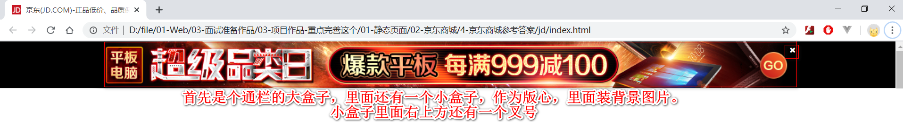

5. 接下来是做导航栏长条，它也是通栏的。

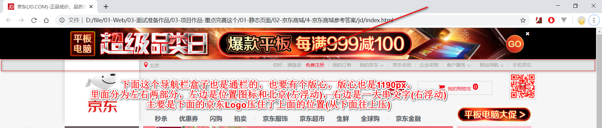

> 高度是30px(另外有个1px的边框)

6. 最左边的盒子因为左浮动，所以和父盒子最左边紧挨着。但是下面白色的京东Logo要往上压住导航栏一部分，所以左盒子要往右边一段距离(因为ul没有宽高，所以用margin,padding移动都行,宽度大概200px)

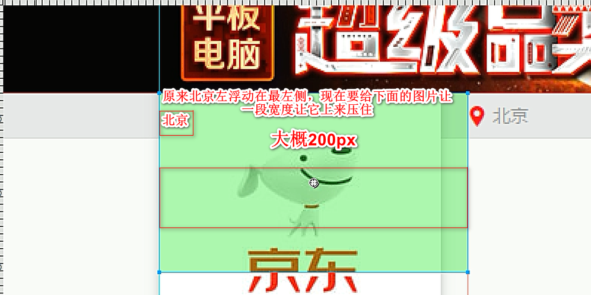

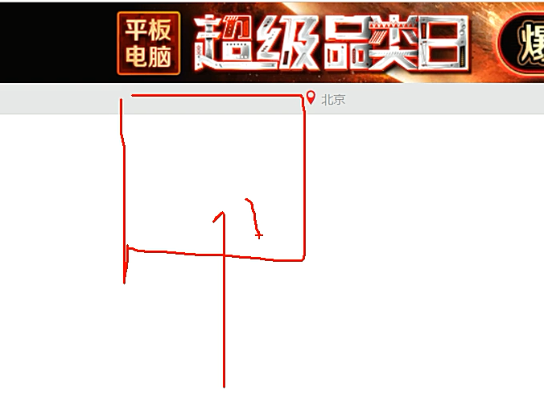

7. 右边正常是一个li里面放一个a,但是第一个li有点特殊，要放2个a。一个a里面放你好，请注册。另一个a里面放免费注册。

8. 右边的小竖线是一个难点，要把小竖线也弄成一个li,然后让竖线左右来个距离就能让右边的字产生距离了。

   > 用其他方法兼容性都不太好，最好的方法就是用li

9. 我的京东，客户服务，网站导航这3个特殊，右边有个下拉按钮。

10. 手机京东下面还有个二维码图片，这张二维码不能影响别的盒子。 

11. 接下来就开始做header部分了。

    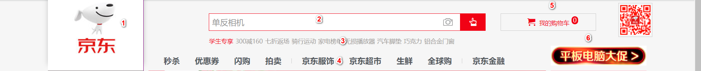

    > 这个是用纯定位来做的，不用划分左中右了。整个大盒子是一个header,里面放版心，一个版心里面放了6个盒子。

12. 接下来开始做页面底部了。页面底部分为3个盒子:

    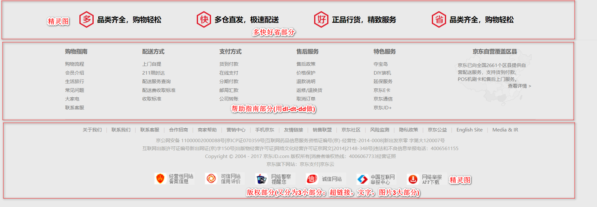

13. 接下来做页面中间部分(首页部分)了，这个时候CSS写在index.css里了，不写在base.css里了

14. 页面中间部分首先写2个小翅膀(广告)

15. 然后把盒子划分为3个小盒子，左中右

    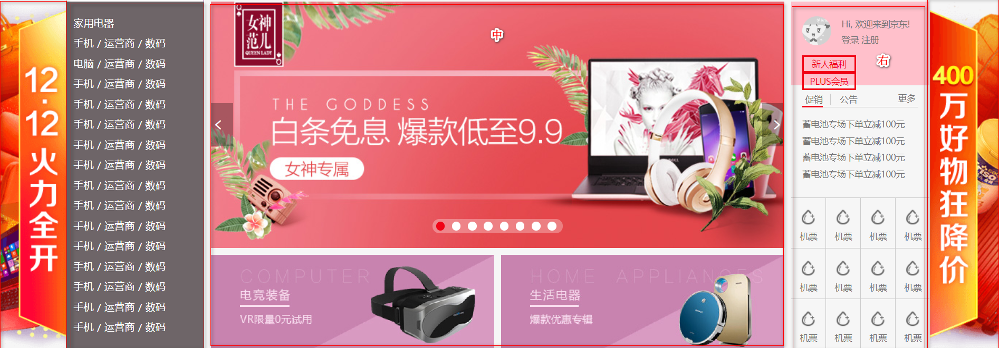

# 自己独立做遇到的问题(后面直接看视频了，没法做)

1. 首页的那个叉号我用字体图标显示不了叉号，引入字体图标有问题。

   > 问题解决：因为@font-face属性路径设置有问题，没有加../。

2. 不能一个li里面放8个a,应该一个li里面放一个a,一共放8个li就可以了。

# 最终代码

## **index.html**

~~~html
<!DOCTYPE html>
<html lang="en">
<head>
	<meta charset="UTF-8">
	<title>京东(JD.COM)-正品低价、品质保障、配送及时、轻松购物！</title>
	<meta name="description" content="京东JD.COM-专业的综合网上购物商城,销售家电、数码通讯、电脑、家居百货、服装服饰、母婴、图书、食品等数万个品牌优质商品.便捷、诚信的服务，为您提供愉悦的网上购物体验!" />
	<meta name="Keywords" content="网上购物,网上商城,手机,笔记本,电脑,MP3,CD,VCD,DV,相机,数码,配件,手表,存储卡,京东" />

	<!-- 在网址末尾再输入/favicon.ico可以得到该网站的图标，图标位置直接放根目录，不放images文件-->
	<!-- type="image/x-icon"可以省略 -->
	<link rel="shortcut icon" href="favicon.ico"  type="image/x-icon"/>

	<!-- normalize 里面css 初始化 针对浏览器-->
	<link rel="stylesheet" href="css/normalize.css" />

	<!-- base 里面只写公共样式 是对京东网页 头部和底部样式(都是一样的) -->
	<!-- 页面中很多CSS是相同的，将相同的归位一类，放在一个文件夹里 -->
	<link rel="stylesheet" href="css/base.css" />

	<!-- 京东首页的css  只写首页的 独有的-->
	<!-- 页面中特使格式的CSS归为另一类，放在另一个文件夹里 -->
	<link rel="stylesheet" href="css/index.css">
</head>
<body>
	<!-- 京东顶部开始了-->
	<div class="J_event">
		<!-- a的类名是w,属性为宽1190px,居中对齐 -->
		<a href="#" class="w">
			<!-- 小叉号要放在a里面，不放在外面，因为要和a对齐(右上角) -->
			<!-- 一点击叉号就关闭以后用JS来做 -->
			<i></i>
		</a>
	</div>
	<!-- 京东顶部结束了-->


	<!-- 快捷导航栏开始了 -->
	<!-- shortcut是快捷导航的意思 -->
	<!-- 第一步先别管太多，先把长条给搞出来，高度30px,不用写宽 -->
	<div class="shortcut">
		<!-- 里面要装一个版心,使用设定好的样式，一次定义，多次使用-->
		<!-- 版心左边装位置图标和北京2个字(可以用ul-li做)，
			右边放你好，请登录等一大堆文字(用ul-li做) -->
		<!-- 左右两个盒子都要垂直居中，所以直接给shortcut加行高即可，行高会继承 -->
		<div class="w">
			<!-- 第一个ul是左浮动 -->
			<!-- 左边的盒子不能顶在左边，要留一段距离让下面的京东图标往上压 -->
			<!-- 因为ul没有宽高，所以用margin,padding移动都行(老师用的margin-left),宽度大概是200px -->
			<ul class="fl">
				<!-- 北京就不给a了，字体大小是12px，颜色是#9d9d9d-->
				<li>
					<!-- 北京前面有个位置字体图标 -->
					<!-- 为了区别不同字体图标，可以加个类名 -->
					<i class="pos"></i>
					北京
				</li>
			</ul>
			<!-- 第2个ul是右浮动 -->
			<!-- 右边各个li之间不仅有距离，还有竖线 -->
			<!-- 我们干脆给竖线左右来个距离，就可以给它们划分开了 -->
			<ul class="fr">
				<!-- 注意：一定要从右往左写，因为是右浮动 -×不对，从左向右写就行了-->
				<!-- 一个li里面只能放一个a,我做的是一个li里面放了8个a,不好-->
				<!-- 链接鼠标移动到该位置会变成红色 -->
				<!-- 因为字最终放在li里面，所以是竖着显示的 -->
				<!-- ul是右浮动，里面的li是左浮动，这个我是真想不到 -->
				<!-- 第一个li里面有2个a -->
				<!-- 中间的小竖线是个难点，把竖线也弄成一个li -->
				<li>
					<!-- 加上2个空格，让页面更好看一些 -->
					<a href="#">你好，请登陆&nbsp;&nbsp;</a>
					<!-- 免费注册默认是京东红颜色 -->
					<a href="#" class="style-red">免费注册</a>
				</li>
				<!-- spacer表示小竖线的意思 -->
				<!-- 小竖线的高度是10px,宽肯定是1px  -->
				<!-- 我的京东，客户服务，网站导航这3个特殊，右边有个下拉按钮  -->
				<!-- 给这3个特殊的添加一个类，专门写个样式 -->
				<li class="spacer"></li>
				<li><a href="#">我的订单</a></li>
				<li class="spacer"></li>
				<li class="dropdown">
					<a href="#">我的京东</a>
					<!-- 小三角也是字体图标 -->
					<i></i>
				</li>
				<li class="spacer"></li>
				<li><a href="#">京东会员</a></li>
				<li class="spacer"></li>
				<li><a href="#">企业采购</a></li>
				<li class="spacer"></li>
				<li class="dropdown">
					<a href="#">客户服务</a>
					<i></i>
				</li>
				<li class="spacer"></li>
				<li class="dropdown">
					<a href="#">网站导航</a>
					<i></i>
				</li>
				<li class="spacer"></li>
				<!-- 子绝父相,层级上升，二维码盒子才不会被压在下面-->
				<li style="position: relative; z-index: 1">
					<a href="#">手机京东</a>
					<div class="erweima"></div>
				</li>
				<!-- 手机京东下面有个二维码图片 -->
				<!-- 因为父盒子高度限定死了30px,所以这个二维码图片不会撑下来的 -->
				<!-- 这个图片还要往下走一走，所以要用定位。 -->
			</ul>
		</div>
	</div>
	<!-- 快捷导航栏结束了 -->
	<!-- <div style="height:200px;background-color: pink"></div> -->


	<!-- header部分开始了 -->
	<!-- 因为用定位做，所以必须要给高，高度为140px -->
	<div class="header">
		<!-- 下一步缺个版心，居中对齐。直接丢个w即可-->
		<!-- header有高，里面的w也要有高，因为所有的东西都写在w里面的 -->
		<!-- 多类名 -->
		<div class="w inner">

			<!-- 第一模块：左边的京东狗logo部分-->
			<div class="logo">
				<!-- 这个是logo普遍性的做法(div-h1-a)，为了网站优化 -->
				<!-- logo里面的字比其他的权重都要高，所以京东这2个字不能删除！！！ -->
				<!-- 隐藏掉就可以了，或者移除Logo图片范围，用overflow:hidden切掉也行 -->
				<!-- 再写个title="京东网"，鼠标放在logo上显示京东网 -->
				<h1><a href="#" title="京东网">京东</a></h1>
			</div>


			<!-- 第二模块：中间的搜索部分-->
			<div class="search">
				<!-- 里面再放我们想要的内容：左边用input放输入框，右边放小按钮 -->
				<!-- 里面的文字默认是微单相机 -->
				<!-- input是行内块元素，行内块与行内块之间有缝隙的，所以搜索框上不来 -->
				<!-- 用浮动可以去掉缝隙 -->
				<!-- input里面不能放其他的标签了 -->
				<input type="text" value="微单相机">
				<button>
					<!-- button是个双标签，双标签是个容器，可以放其他标签 -->
					<i></i>
				</button>
				<!-- em里面放照相机图片，用的是精灵图-->
				<em></em>
				<!-- 下一步再修饰修饰里面的input和button即可 -->
			</div>


			<!-- 第三模块：热点关键词部分 -->
			<div class="hotwords">
				<!-- 默认学生专享是红色 -->
				<a href="#" class="style-red">学生专享</a>
			 	<a href="#">300减160</a>
			 	<a href="#">七折返场</a>
			 	<a href="#">骑行运动</a>
			 	<a href="#">家电榜单</a>
			 	<a href="#">无损播放器</a>
			 	<a href="#">汽车脚垫</a>
			 	<a href="#">巧克力</a>
			 	<a href="#">铝合金门窗</a>
			</div>

			<!-- 第四模块：我的购物车部分 -->
			<div class="myCar">
				<!-- 大体是水平，垂直居中的 -->
				<!-- 左边是字体图标购物车 -->
				<i></i>
				<a href="#">我的购物车</a>
				<!-- 右边是一个小圈，里面还有数字，用定位做 -->
				<!-- 这个小圈继承了myCar行高33px,所以会很大 -->
				<s>0</s>
			</div>

			<!-- 第五模块：平板电脑大促部分 -->
			<!-- 这个东西比较好做 -->
			<div class="computer">
				<!-- 原版使用背景图片做的，我们这里简单点 -->
				<a href="#"></a>
			</div>

			<!-- 第六模块：导航栏信息部分 -->
			<div class="navitems">
				<!-- 里面分成3个部分，用3个ul来做,每个ul以竖线分隔 -->
				<!-- 小竖线上面也有，可以直接拿过来用 -->
				<!-- 秒杀，优惠券，闪购，拍卖是一部分；京东服饰，京东超市，生鲜，全球购是第二部分
				京东金融是第三部分 -->
				<!-- 里面的字数不同，但是间隔一样。京东的做法是给每个li一个margin-left -->
				<ul>
					<li><a href="#">秒杀</a></li>
					<li><a href="#">优惠券</a></li>
					<li><a href="#">闪购</a></li>
					<li><a href="#">拍卖</a></li>
				</ul>
				<!-- ul之间不能直接写竖线，因为都有浮动，所以会跑到边上去 -->
				<!-- 如果一个盒子里面某个孩子浮动了，那么其他盒子也要浮动 -->
				<div class="spacer"></div>
				<ul>
					<li><a href="#">京东服饰</a></li>
					<li><a href="#">京东超市</a></li>
					<li><a href="#">生鲜</a></li>
					<li><a href="#">全球购</a></li>
				</ul>
				<div class="spacer"></div>
				<ul>
					<li><a href="#">京东金融</a></li>
				</ul>
			</div>

		</div>
	</div>
	<!-- header部分结束了 -->
	

	<!-- 京东首页main部分开始了：这个是最后一个做的-->
	<!-- 先来一个通栏的盒子，里面再放一个版心 -->
	<div class="jd">
		<!-- 这个版心是空的，一会要在里面放左中右三大块 -->
		<!-- 第二部分：左中右3个盒子 -->
		<div class="w jd-inner">
			<!-- 左盒子：有这么多文字，用li做比较好 -->
			<div class="jd-col1">
				<ul>
					<li><a href="#">家用电气</a></li>
					<li>
						<a href="#">手机</a>
						<span>/</span>
						<a href="#">运营商</a>
						<span>/</span>
						<a href="#">数码</a>
					</li>
					<li>
						<a href="">电脑</a>
						<span>/</span>
						<a href="">办公</a>
					</li>
					<li>
						<a href="">家居</a>
						<span>/</span>
						<a href="">家具</a>
						<span>/</span>
						<a href="">家装</a>
						<span>/</span>
						<a href="">厨具</a>
					</li>
					<li>
						<a href="">男装</a>
						<span>/</span>
						<a href="">女装</a>
						<span>/</span>
						<a href="">童装</a>
						<span>/</span>
						<a href="">内衣</a>
					</li>
					<li>
						<a href="">美妆个护</a>
						<span>/</span>
						<a href="">宠物</a>
					</li>
					<li>
						<a href="">女鞋</a>
						<span>/</span>
						<a href="">箱包</a>
						<span>/</span>
						<a href="">钟表</a>
						<span>/</span>
						<a href="">珠宝</a>
					</li>
					<li>
						<a href="#">男鞋</a>
						<span>/</span>
						<a href="#">运动</a>
						<span>/</span>
						<a href="#">户外</a>
					</li>
					<li>
						<a href="">汽车</a>
						<span>/</span>
						<a href="">汽车用品</a>
					</li>
					<li>
						<a href="">母婴</a>
						<span>/</span>
						<a href="">玩具乐器</a>
					</li>
					<li>
						<a href="">食品</a>
						<span>/</span>
						<a href="">酒类</a>
						<span>/</span>
						<a href="">生鲜</a>
						<span>/</span>
						<a href="">特产</a>
					</li>
					<li>
						<a href="">礼品鲜花</a>
						<span>/</span>
						<a href="">农资绿植</a>
					</li>
					<li>
						<a href="">医药保健</a>
						<span>/</span>
						<a href="">计生情趣</a>
					</li>
					<li>
						<a href="#">图书</a>
						<span>/</span>
						<a href="#">音像</a>
						<span>/</span>
						<a href="#">电子书</a>
					</li>
					<li>
						<a href="">机票</a>
						<span>/</span>
						<a href="">酒店</a>
						<span>/</span>
						<a href="">旅游</a>
						<span>/</span>
						<a href="">生活</a>
					</li>
					<li>
						<a href="">理财</a>
						<span>/</span>
						<a href="">众筹</a>
						<span>/</span>
						<a href="">白条</a>
						<span>/</span>
						<a href="">保险</a>
					</li>
				</ul>
			</div>
			<!-- 中盒子：分为上下两个盒子。上面盒子做轮播图-->
			<div class="jd-col2">
				<div class="jd-col2-hd">
					<!-- 轮播图布局模版如下 -->
					<!-- 2个箭头，一左一右 -->
					<!-- 可以包一个div，看的更清楚，也可以不包 -->
					<!-- <div class="arrow"> -->
						<a href="#" class="arr-l"></a>
    					<a href="#" class="arr-r"></a>
					<!-- </div> -->

					<!-- 8个小圆点，居中 -->
					<!-- 按道理ol的宽度是可以不用给的，因为用定位，自动变成行内块，
						按照内容可以自动撑开盒子-->
					<ol>
						<li class="current"></li>
						<li></li>
						<li></li>
						<li></li>
						<li></li>
						<li></li>
						<li></li>
						<li></li>
					</ol>
					<!-- 因为轮播图有很多张(8张，所以这样写) -->
					<!-- 一张图片是做不了轮播图的 -->
					<!-- 今后可以用JS来写特效 -->
					<ul>
						<li><a href=""></a></li>
					</ul>
				</div>
				<div class="jd-col2-bd">
					<!-- 中盒子下面是2张图片，比较简单 -->
					<div class="firstPic">
						<!-- 产品直接放图片即可 -->
						<!--图片原规格是780*260,肯定大了，要缩放一下 -->
						
					</div>
					<div>
						
					</div>
				</div>
			</div>
			<!-- 右盒子：又分为上中下3个小盒子 -->
			<div class="jd-col3">
				<div class="user">
					<!-- user再分为上下2个盒子 -->
					<div class="user-info">
						Hi,欢迎来到京东！<br />
						<a href="#">登陆</a>
						<a href="#">注册</a>
						<!-- 这张图片就放在padding-left的那部分位置 -->
						<a href="#" class="info-img">
							
						</a>
					</div>
					<div class="user-profit">
						<a href="#">新人福利</a>
						<a href="#">PLUS会员</a>
					</div>
				</div>
				<div class="news">
					<!-- 中间盒子分为上下2部分 -->
					<!-- 中间盒子属于Tab栏切换，要学会独立手写 -->
					<!-- 为了以后方便操作DOM，2个盒子标签名要一致 -->
					<div class="tab-hd">
						<!-- 头部一共有4个对象 -->
						<!-- 只有促销和公共可以切换，更多不参与切换 -->
						<!-- 切换时，切换的字下面有一条红色的线 -->
						<a href="javascript:;" class="cuxiao">促销</a>
						<a href="javascript:;">公告</a>
						<!-- 更多要贴在右边 -->
						<a href="#" class="more1">更多</a>
						<!-- 这个线要底部对齐 -->
						<div class="line"></div>
					</div>
					<div class="tab-bd">
						<!-- 按道理要有2组，点击促销有1组，点击公告有另外1组 -->
						<!-- 只不过2组同时只能显示1组而已，另1组隐藏 -->
						<ul>
							<li><a href="#">居家好物暖暖季跨店3件7折</a></li>
							<li><a href="#">爱车焕新装满198减100</a></li>
							<li><a href="#">全品类800元大额神券</a></li>
							<li><a href="#">家电1212超值榜单大揭秘</a></li>
						</ul>
						
						<!-- 这一组隐藏 -->
						<!-- <ul>
							<li><a href="#">蓄电池专场下单立减100元</a></li>
							<li><a href="#">缤纷圣诞豪礼钜惠享不停</a></li>
							<li><a href="#">每日享折扣京东品质游</a></li>
							<li><a href="#">517吃货节今日买一送一</a></li>
						</ul> -->
					</div>
				</div>
				<!-- 这一部分用精灵图做 -->
				<div class="jd-service">
					<!-- ul默认的宽度和父亲jd-service一样宽 -->
					<ul>
						<li>
							<a href="#">
								<!-- 上面图标，下面文字 -->
								<!-- 这个i必须有大小 24*24 -->
								<i></i>
								<p>话费</p>
							</a>
						</li>

						<li>
							<a href="#">
								<i></i>
								<p>机票</p>
							</a>
						</li>

						<li>
							<a href="#">
								<i></i>
								<p>酒店</p>
							</a>
						</li>

						<li>
							<a href="#">
								<i></i>
								<p>火车票</p>
							</a>
						</li>

						<li>
							<a href="#">
								<i></i>
								<p>企业购</p>
							</a>
						</li>

						<li>
							<a href="#">
								<i></i>
								<p>加油卡</p>
							</a>
						</li>

						<li>
							<a href="#">
								<i></i>
								<p>电影票</p>
							</a>
						</li>

						<li>
							<a href="#">
								<i></i>
								<p>游戏</p>
							</a>
						</li>

						<li>
							<a href="#">
								<i></i>
								<p>众筹</p>
							</a>
						</li>

						<li>
							<a href="#">
								<i></i>
								<p>理财</p>
							</a>
						</li>

						<li>
							<a href="#">
								<i></i>
								<p>礼品卡</p>
							</a>
						</li>

						<li>
							<a href="#">
								<i></i>
								<p>白条</p>
							</a>
						</li>
						
					</ul>
				</div>
			</div>
		</div>
		<!-- 第一部分：广告 -->
		<!-- 先做2侧的小翅膀广告 -->
		<!-- 专门准备第3个盒子放广告 -->
		<div class="ad">
			<a href="#"></a>
		</div>
	</div>
	<!-- 京东首页main部分结束了 -->


	<!-- 首页做完后接着做底部，中间的部分最后做！！！ -->
	<!-- 页面底部footer部分开始了 -->
	<!-- 底部分为上中下3个盒子，上面一个盒子是通栏的，装一个版心 】
		中和下直接拿个版心往里面装东西就可以了-->
	<div class="footer">
		<!-- 上盒子：多快好省部分 -->
		<div class="footer-service">
			<!-- 来一个版心放在中间 -->
			<!-- 版心宽度为1190px,第一个盒子放4个li"多快好省" -->
			<!-- 平均一个li宽度为297px，高度经过测量为42px -->
			<div class="w footer-service-inner">
				<!-- 当时是没有给ul高的 -->
				<!-- ul清除浮动后，会自动检测孩子的高度，自己会自动撑开 -->
				<!-- ul不清除浮动也行，给ul一个高42px也行 -->
				<ul class="clearfix">
					<li>
						<!-- 在li里面又放了一个div -->
						<!-- 里面这个div高是42px,宽是225px -->
						<div class="service-unit">
							<!-- 里面先装一个h5放图片,后面再放一个p放文字 -->
							<!-- 都是块级元素，要放一行上，所以要浮动 -->
							<!-- 所有的浮动都是顶部对齐(左上角对齐) -->
							<!-- 最好一个左浮动，一个右浮动 -->
							<!-- h5和p这2个盒子不一样大，所以对齐有点麻烦 -->
							<!-- 那不如就用定位做吧  -->
							<!-- 这个多字别删，SEO有用。用text-indent:-999px做 -->
							<h5>多</h5>
							<p>品类齐全，购物轻松</p>
						</div>
					</li>

					<li>
						<div class="service-unit">
							<h5 class="kuai">快</h5>
							<p>多仓直发，极速配送</p>
						</div>
					</li>

					<li>
						<div class="service-unit">
							<h5 class="hao">好</h5>
							<p>正品行货，精致服务</p>
						</div>
					</li>

					<li>
						<div class="service-unit">
							<h5 class="sheng">省</h5>
							<p>品类齐全，购物轻松</p>
						</div>
					</li>
				</ul>
			</div>
		</div>
		<!-- 中盒子:帮助指南部分 -->
		<!-- 中盒子用ul-li做是可以的，京东是用div做的，我们也用div做吧 -->
		<!-- 后来老师改注意了，用dl来做了 -->
		<!-- 中盒子里面的小盒子都要浮动，一浮动就不占高度了，不想清除浮动就给它们一个高 -->
		<div class="w help">
			<dl>
     	  	 	<dt>购物指南</dt>
     	  	 	<dd><a href="#">购物流程</a></dd>
     	  	 	<dd><a href="#">会员介绍</a></dd>
     	  	 	<dd><a href="#">生活旅行</a></dd>
     	  	 	<dd><a href="#">常见问题</a></dd>
     	  	 	<dd><a href="#">大家电</a></dd>
     	  	 	<dd><a href="#">联系客服</a></dd>
     	  	 </dl>

     	  	 <dl>
     	  	 	<dt>配送方式</dt>
     	  	 	<dd><a href="#">上门自提</a></dd>
     	  	 	<dd><a href="#">211限时达</a></dd>
     	  	 	<dd><a href="#">配送服务查询</a></dd>
     	  	 	<dd><a href="#">配送费收取标准</a></dd>
     	  	 	<dd><a href="#">收取标准</a></dd>
     	  	 </dl>

     	  	 <dl>
     	  	 	<dt>支付方式</dt>
     	  	 	<dd><a href="#">货到付款</a></dd>
     	  	 	<dd><a href="#">在线支付</a></dd>
     	  	 	<dd><a href="#">分期付款</a></dd>
     	  	 	<dd><a href="#">邮局汇款</a></dd>
     	  	 	<dd><a href="#">公司转账</a></dd>
     	  	 </dl>

     	  	  <dl>
     	  	 	<dt>售后服务</dt>
     	  	 	<dd><a href="#">售后政策</a></dd>
     	  	 	<dd><a href="#">价格保护</a></dd>
     	  	 	<dd><a href="#">退款说明</a></dd>
     	  	 	<dd><a href="#">返修/退换货</a></dd>
     	  	 	<dd><a href="#">取消订单</a></dd>
     	  	 </dl>

     	  	  <dl>
     	  	 	<dt>特色服务</dt>
     	  	 	<dd><a href="#">夺宝岛</a></dd>
     	  	 	<dd><a href="#">DIY装机</a></dd>
     	  	 	<dd><a href="#">延保服务</a></dd>
     	  	 	<dd><a href="#">京东E卡</a></dd>
     	  	 	<dd><a href="#">京东通信</a></dd>
     	  	 	<dd><a href="#">京东JD+</a></dd>
     	  	 </dl>
			<!-- 最后一个是一张中国地图背景图片，贴在右边对齐 -->
     	  	 <dl class="cover">
     	  	 	<dt>京东自营覆盖区县</dt>
   				<!-- 最后一个只要2个dd就可以了 -->
     	  	 	<dd class="info">京东已向全国2661个区县提供自营配送服务，支持货到付款、POS机刷卡和售后上门服务。
     	  	 	</dd>
     	  	 	<dd class="more"><a href="#">查看详情 ></a></dd>
     	  	 </dl>
		</div>
		
		<!-- 下盒子：版权部分 -->
		<!-- 下盒子分为三行，我们布局是根据相关性的，链接为一行，文字为一行，图片为一行 -->
		<div class=" w copyright">
			<!-- 第一行：链接 -->
			<div class="links">
				<a href="#">关于我们</a>
				<span>|</span>
				<a href="#">联系我们</a>
				<span>|</span>
				<a href="#">联系客服</a>
				<span>|</span>
				<a href="#">合作招商</a>
				<span>|</span>
				<a href="#">商家帮助</a>
				<span>|</span>
				<a href="#">营销中心</a>
				<span>|</span>
				<a href="#">手机京东</a>
				<span>|</span>
				<a href="#">友情链接</a>
				<span>|</span>
				<a href="#">销售联盟</a>
				<span>|</span>
				<a href="#">京东社区</a>
				<span>|</span>
				<a href="#">风险监测</a>
				<span>|</span>
				<a href="#">隐私政策</a>
				<span>|</span>
				<a href="#">京东公益</a>
				<span>|</span>
				<a href="#">English Site</a>
				<span>|</span>
				<a href="#">Media & IR</a>
			</div>

			<!-- 第二行：文字 -->
			<div class="c-info">
				<p>京公网安备 11000002000088号|京ICP证070359号|互联网药品信息服务资格证编号(京)-经营性-2014-0008|新出发京零 字第大120007号</p>
				<p>互联网出版许可证编号新出网证(京)字150号|出版物经营许可证|网络文化经营许可证京网文[2014]2148-348号|违法和不良信息举报电话：4006561155</p>
				<p>Copyright © 2004 - 2017  京东JD.com 版权所有|消费者维权热线：4006067733经营证照</p>
				<p>京东旗下网站：京东支付|京东云</p>
			</div>

			<!-- 第三行：图片(精灵图) -->
			<div class="tupian">
				<a href="#"></a>
				<a href="#" class="kexin"></a>
				<a href="#" class="wangjing"></a>
				<a href="#" class="chengxin"></a>
				<a href="#" class="jubao"></a>
				<a href="#" class="xiazai"></a>
			</div>
		</div>
	</div>
	<!-- 页面底部footer部分结束了 -->
</body>
</html>
~~~

## base.css

~~~css
/*这个CSS写公共样式的CSS--京东头部和尾部*/
/*头和尾是公共样式要在base.css里面写*/

/*设置版心*/
.w{
	/*版心宽度1190px,和实际京东版心宽度一致*/
	width: 1190px;

	/*版心要居中对齐，不居中对齐就没有价值了*/
	/*margin:auto和margin:0 auto没有什么区别，都是块级元素居中*/
	margin: auto;
}

/*设置一个类名：右浮动*/
.fr{
	float: right;
}

/*设置一个类名：左浮动*/
.fl{
	float: left;
}

ul{
	/*把ul的内外边距都给去掉(ul是块级元素)，不然位置会在下面*/
	/*这个margin:0 padding:0是单独写的！！！*/
	/*这个我是真的想不出来*/
	margin: 0;
	padding: 0; 
}
li{
	/*做快捷导航栏的时候用li做的，所以把通用样式写在这里*/
	list-style: none;
}
/*字体图标因为所有CSS文件都要用，所以要放在base.css文件里面*/
@font-face {
  font-family: 'icomoon';
  /*路径要记得修改一下，加个../才能找到fonts文件夹*/
  src:url('../fonts/icomoon.eot?7kkyc2');
  src:url('../fonts/icomoon.eot?7kkyc2#iefix') format('embedded-opentype'),
      url('../fonts/icomoon.ttf?7kkyc2') format('truetype'),
      url('../fonts/icomoon.woff?7kkyc2') format('woff'),
      url('../fonts/icomoon.svg?7kkyc2#icomoon') format('svg');
  font-weight: normal;
  font-style: normal;
}

.style-red{
	/*设置公共样式，京东主色调*/
	/*后面加上!important提高优先级*/
	color: #f10215 !important;
}

body{
	/*京东的北京色*/
	background-color: #f6f6f6;
}

input,button{
	/*去掉它们的内边距*/
	padding: 0;
	/*去掉它们的外边框*/
	border: 0;
}

a{
	text-decoration: none;
}

img{
	/*去除图片底侧缝隙，图片和文字的基线对齐*/
	/*只要是图片底下都会有缝隙*/
	/*这个我真的印象不深，也写不出来*/
	vertical-align: top;
}
/*清除浮动*/
.clearfix:before,.clearfix:after { 
  content:"";
  display: table;  /* 这句话可以出发BFC BFC可以清除浮动,BFC我们后面讲 */
}
.clearfix:after {
 clear:both;
}
.clearfix {
  *zoom:1;
}

/*如果实在不行就写个*号margin:0 padding:0了吧*/
/*h1,h5,p{
	margin: 0;
}*/
*{
	/*京东原版有这个东西，可以这样写*/
	/*到了工作的时候看公司有没有这个要求，允不允许，如果不允许自己再一个一个改*/
	margin: 0;
	padding: 0;
}
/*京东顶部开始了*/
.J_event{
	/*大盒子不用给宽，通栏，给个高度就可以了*/
	/*大盒子高度和top图片(1190*80)高度一致*/

	/*代码优化，孩子a有个高，没有用浮动和定位，
	孩子会撑开父亲，所以父亲不用写高了*/
	/*height: 80px;*/

   /*大盒子背景色是黑色*/
   background-color: #000;

}

.J_event a{
	/*即使给a的类名w,让它宽度为1190px,有居中对齐的属性
	但是a是行内元素，宽高无效，默认宽度就是它本身内容的宽度
	所以要把它转换成块级元素才行。(margin只适用于有宽度的块级元素)*/
	display: block;

	/*给高是因为用背景图片做，不给高的话图片不显示*/
	/*如果高度只给40px则只会显示一半，高度给160px会显示2张图片！*/
	height: 80px;

	/*图片用背景做，不用插入做。注意路径，前面有../*/
	background: url(../images/top.jpg) no-repeat;

	/*因为对齐方式是以a来对齐的，所以相对定位一定要给a加，不要给爷爷J_event加*/
	position: relative;
}

.J_event a i{
	/*给字体图标叉号设置大小20*20,背景色*/
	width: 20px;
	height: 20px;
	/*background-color: pink;*/

	/*给字体图标设置字体样式，这步不能省，注意双引号不要丢*/
	font-family: "icomoon";
	/*小查后有点歪，让它脉动回来*/
	font-style: normal;
	/*给字体图标叉号设置定位，让它跑到右上方去,不要顶在上面，留个空隙5px*/
	/*子绝父相*/
	position: absolute;
	/*设置边偏移*/
	right: 0;
	top: 5px;
	/*水平，垂直居中*/
	text-align: center;
	line-height: 20px;
	/*设置颜色，半透明背景*/
	color: #fff;
	background: rgba(0,0,0,0.3);
}
/*京东顶部结束了*/


/*快捷导航栏开始了*/
.shortcut{
	/*设置高度和背景颜色，宽度不用设置，通栏*/
	height: 30px;
	background-color: #e3e4e5;

	/*细节：有个下边框*/
	border-bottom: 1px solid #DDD;

	/*字体颜色和大小*/
	color: #9d9d9d;
	font-size: 12px;

	/*左右两个盒子都要垂直居中，所以直接给父亲shortcut加行高，行高会继承，
	它的两个儿子行高也是父盒子的高度了*/
	line-height: 30px;
}

.shortcut a{
	/*shortcut里的a要单写一份，我不知道为什么？试了一下不写的话样式不会改*/
	color: #9d9d9d;
	font-size: 12px;
	/*超链接取消下划线*/
	text-decoration: none;
}

.shortcut .fr li{
	/*让快捷导航栏里面的li(左)浮动起来*/
	/*如果写成了右浮动那么字体顺序就变了,不对了*/
	float: left;
}

.pos{
	/*这句话必须要加上*/
	font-family: "icomoon";
	/*不要歪*/
	font-style: normal;
	/*字体图标颜色为#f10215,字体大小为14px*/
	color: #f10215;
	font-size: 14px
}

.shortcut .fl li{
	margin-left: 200px;
	/*后面写header的时候，发现123不在最左边，原来是li的高度是31.2px,
	让123只能在北京后面了，所以手动给li一个高度来排错*/
	height: 30px;
	/*高度如果不行的话还可以overflow:hidden*/
	overflow: hidden;
}

.shortcut a:hover{
	/*右边一大段文件鼠标放上面会改变颜色*/
	color: #c81623;
}

/*给小竖线设置宽(1px)高(10px)背景！！颜色(#ccc)*/
/*li是块级元素呢*/
.spacer{
	width: 1px;
	height: 10px;
	/*color: #ccc;*/
	/*注意，不是color,而是背景色！！！！！*/
	background-color: #ccc;
	/*小竖线离上面还有一段距离，用margin-top,不能用padding,因为padding会撑开盒子*/
	/*上面10px,左右10px,下0*/
	margin: 10px 10px 0;
}

/*我的京东，客户服务，网站导航这3个特殊，右边有个下拉按钮*/
.dropdown{
	/*右边多了一个下拉箭头小三角，宽度为15px，所以宽度要多加15px*/
	/*用padding把这个盒子给挤开，padding一般不允许写内容的，用什么办法把小三角放上来呢*/
	/*用定位！！！！！！！！！！！！！！*/
	/*小三角也是用的字体图标*/
	padding-right: 15px;
	/*子绝父相*/
	position: relative;
}


/*小三角字体图标在dropdown里面的i里*/
.dropdown i{
	font-family: "icomoon";
	/*取消倾斜*/
	font-style: normal;
	/*给字体图标调一下大小*/
	font-size: 16px; 
	/*要用定位，不然因为基线对齐，字会往下掉*/
	/*这个是难点*/
	position: absolute;
	/*设置边偏移*/
	/*right: 0;*/
	/*最后再调整一下*/
	right: -2px;
	/*top: 0;*/
	/*最后再调整一下*/
	top: -2px;

}

.erweima{
	/*给盒子设定规格大小：和二维码图片(60*60)一样*/
	width: 60px;
	height: 60px;
	border: 1px solid #ccc;
	/*使用内边距撑一下，好看一点*/
	padding: 3px;
	/*让图片脱标，不要影响到别人*/
	position: absolute;
	/*设置边偏移:慢慢调*/
	left: -8px;
	top: 35px;
}
/*快捷导航栏结束了*/


/*header部分开始了*/
.header{
	/*header的高度为140px*/
	height: 140px;
}

.inner{
	/*header有高，里面的w也要有高才行*/
	height: 140px;
	/*background-color: pink;*/
	position: relative;
}
/*第一模块：左边的京东狗logo部分*/
.logo{
	/*给Logo来一个图片规格*/
	width: 190px;
	height: 170px;
	position: absolute;
	/*再往上走30px*/
	top: -30px;
	left: 0;
	/*background-color: purple;*/

	/*设置盒子阴影，直接抄网站上面的*/
	box-shadow: 0 -12px 10px rgba(0,0,0,0.2); 

}

.logo a{
	/*因为点击图片的每个角落，都有小手，所以要把a的规格弄成和父盒子一样大才行*/
	/*先转换成块级元素*/
	display: block;
	/*宽高别想太多，直接100%即可----不对*/
	/*宽高是和父亲有关系的，中间因为隔了一个h1,所以还是不能直接写100%*/
	/*因为h1没有大小，写个100%就和h1一样大了*/
	width: 190px;
	height:170px;
	/*logo用背景写*/
	background: url(../images/logo.jpg) no-repeat;
	
	/*字不能删，想办法把字给移出去*/
	/*因为往右首行缩进字会换行，所以还是往左首行缩进比较好*/
	/*写大一点，字就跑出去了，你都看不见了*/
	text-indent: -99999px;
	/*再来一个overflow:hidden确保万无一失*/
	overflow: hidden;
}

.logo h1{
	/*h1因为带有外边距，所以logo会往下走一点，要把这个外边距清除掉才行*/
	margin: 0;
}

/*第二模块：中间的搜索部分*/
.search{
	/*搜索框为550*135*/
	width: 550px;
	height: 35px;
	/*background-color: blue;*/
	/*使用定位把搜索框给放在中间，离最左边是320px,离上面25px*/
	position: absolute;
	/*设置边偏移*/
	top: 25px;
	left: 320px;

}

.search input{
	/*input的宽度为498px,高度为33px(还有2px为边框)，要减去padding-left的5像素！！*/
	/*498-5=493*/
	width: 493px;
	height: 33px;
	border: 1px solid #F10215;
	/*input默认有个内边距，所以边框看上去大一些，我们要把它清除掉*/
	/*因为字数不要离左边那么近，所以paading要离左边一定距离*/
	/*上，右，下，左*/
	padding-left: 5px;
	/*取消蓝色边框*/
	outline: none;
	/*搜索框里的文字颜色*/
	color: #989898;	
	/*用浮动让搜索框上来*/
	float: left;
}

.search button{
	width: 50px;
	height: 35px;
	background-color: #f10215;
	/*按钮会掉下来，要去掉它的边框*/
	/*还是会掉下来，最后用浮动*/
	float: left;
	/*变成小手*/
	cursor:pointer;
	outline: none;
}

.search i{
	font-family: "icomoon";
	color: #fff;
	font-style: normal;
	font-size: 16px;
}

.search em{
	/*精灵图，用定位做*/
	/*父亲是search,父亲是绝对定位，字绝父绝也是可以的*/
	position: absolute; 
	/*top: 0;*/
	/*让它距离上面10px*/
	top: 10px;
	/*right: 0;*/
	/*让它距离右边65px*/
	right: 65px;
	/*加了定位的盒子不用再转换成块级或行内块元素了，它自动转换了*/
	/*放心大胆的给宽高就好了*/
	width: 19px;
	height: 15px;
	/*background-color: green;*/
	/*鼠标放上去是小手*/
	cursor: pointer;
	/*赶巧了正好在左上角，可以不用写坐标了*/
	background: url(../images/sprite-search.png) no-repeat;
}

.search em:hover{
	/*鼠标放上去更换背景图片*/
	background-position: -30px 0;
}

/*第三模块：热点关键词部分*/
.hotwords{
	/*反正都是靠定位来做的*/
	position: absolute;
	/*设追边偏移*/
	top: 70px;
	left: 320px;
}

.hotwords a{
	color: #ccc;
	font-size: 12px;
}

.hotwords a:hover{
	color: #f10215;
}

/*第四模块：我的购物车部分*/
.myCar{
	/*设置盒子的宽和高*/
	width: 188px;
	height: 33px;
	border: 1px solid #ccc;
	/*background-color: orange;*/
	position: absolute;
	/*设置边偏移*/
	top: 25px;
	right: 100px;

	/*水平，垂直居中给父亲即可*/
	text-align: center;
	line-height: 33px;
}

.myCar a{
	font-size: 14px;
	color: #f10215; 
}

.myCar i{
	font-family: "icomoon";
	/*还不如在上面写个通用的i,让它不倾斜呢*/
	font-style: normal;
	color: #f10215;
	/*购物车和右边字有个距离*/
	margin-right: 3px;
}

.myCar s{
	/*小圆圈用定位做最合适了*/
	/*加了绝对定位的盒子和浮动的盒子自动转换为行内块*/
	/*不应该给宽，否则数字太多会超过宽度。行内块元素会自动调整行高的*/
	position: absolute;
	/*设置边偏移，把小圆角的位置给调一下*/
	top: 5px;
	/*不能写右对齐，写左对齐更好*/
	/*如果写右对齐，那么买1000件东西，小圆角会把我的购物车给覆盖掉，不好看*/ 
	/*right: 35px;*/
	left: 140px;
	/*去掉删除线*/
	text-decoration: none;
	background-color: #f10215;
	/*小圈不给宽度，给个高度是可以的，高度为13px*/
	height: 16px;
	/*层叠掉继承的行高33px*/
	line-height: 16px;
	font-size: 12px;
	/*高度还行，左右太紧了，用pading扩充一下*/
	padding: 0 3px;
	/*弄个小圆角,弄成像胶囊一样*/
	border-radius: 6px;
	/*最后再改个字体颜色就可以了*/
	color: #fff;
}

/*第五模块：平板电脑大促部分*/
.computer{
	/*bottom不是0！！！距离底部有10像素*/
	position: absolute;
	right: 0;
	bottom: 10px;
}

/*第六模块：导航栏信息部分*/
.navitems{
	/*绝对定位和内容有关系，只要把内容填充满，自然而然就撑开了。可以不给盒子大小了*/
	position: absolute;
	/*设置边偏移*/
	/*和.shortcut .fl li左边距离一样，也是200px*/
	left: 200px;
	bottom: 0;
}

.navitems ul{
	/*这个用浮动做更好，用定位麻烦*/
	/*ul浮动，浮动不会继承，里面的li还是竖起来的，所以还要给li浮动才行*/
	float: left;
}

.navitems ul li{
	/*不仅ul要浮动，里面的li也要浮动*/
	float: left;
	/*最后再调一下它们之间的距离，给每一个小li一个margin-left，注意给小li,小li是浮动的，不是a*/
	margin-left: 30px;
	/*现在就剩下那条小竖线了，还有鼠标放上去变色*/

	/*把line-height和height的高给li更合适一点，给a也行*/
	/*如果给a的话要加一句话:display:block*/
	/*height: 40px;*/
	/*height: 40px;*/
}

.navitems li a{
	/*给字体设置大小，颜色，加粗*/
	font-size: 16px;
	color: #555A5F;
	font-weight: 700;
	/*给个高度，并且垂直居中*/
	/*如何测量字体的高度呢？先量它的下边距，下边距*2再加上字体本身的高度即可*/
	height: 40px;
	
	/*当初写的是height:40px,找了半天错。。。。*/
	line-height: 40px;
	display: block;
	/*最后再调一下它们之间的距离，给每一个小li一个margin-left，注意给小li,小li是浮动的，不是a*/
}

/*鼠标放上去是红色*/
.navitems li a:hover {
	color: #f10215;
}


.navitems .spacer{
	/*上面的spacer权重是10，我们提权，让下面的竖线浮动，(上面的竖线可以不用浮动)*/
	/*竖线左右距离20px,上面15px,下面不用管*/
	float: left;
	/*水平margin不会出现叠加的情况，只有垂直的才会出现叠加的情况*/
	/*原先li有个margin-left:30px; 又来个20px,会叠加成50px*/
	/*margin: 15px 20px 0;*/
	margin-top: 15px;
	margin-left: 20px;
	/*这个老师解释过，我是真的想不到，不会*/
	margin-right: -10px;
}
/*header部分结束了*/


/*页面底部footer部分开始了*/
.footer{
	/*页面底部是通栏的，高为560px,背景色为#eaeaea*/
	height: 560px;
	background-color: #eaeaea;
}

/*上盒子：多块好省部分*/
.footer-service{
	/*上面一个盒子高度为100px,有个下边框*/
	/*height: 100px;*/
	border-bottom: 1px solid #DEDEDE;
	/*background-color: blue;*/

}

.footer-service-inner{
	/*给孩子版心一个高度，又因为没有浮动，父亲的高度就可以省略掉了*/
	/*height: 100px;*/
	/*老师又说孩子也不用给高了,使用padding,上下30，左右0，大概就可以垂直居中了*/
	/*一个父亲，就给了它上下内边距，它就靠里面内容撑开了*/
	/*而里面的li又浮动，浮动就没有高了，所以父亲总共就30+30=60px高了，里面内容的高度为0*/
	/*所以要清除浮动，给ul(直接父亲)清除浮动就可以了*/
	/*这个我是真的不会写，理解起来都困难*/
	padding: 30px 0;
	/*background-color: pink;*/
}

.footer-service-inner li{
	/*多快好省首先要左浮动*/
	/*li因为浮动了，所以检测不到高度了*/
	float: left;
	/*版心宽度为1190px,1190/4=297.5px*/
	width: 297px;
	height: 42px;
	/*background-color: purple;*/
}

.service-unit{
	width: 225px;
	height: 42px;
	margin: 0 auto;
	position: relative;
}

.service-unit h5{
	/*多快好省图片规格为36*43*/
	width: 36px;
	height: 42px;
	/*background-color: blue;*/
	/*h1,h5,p也有默认的距离，要把它清掉,在上面写*/
	position: absolute;
	top: 0;
	left: 0;
	/*浮动压不住文字，但是定位可以压住文字，因为定位有鲜明的层级关系，有z-index*/
	/*放精灵图*/
	background: url(../images/ico_service.png) no-repeat;
	/*把字给移除屏幕，但不删，便于SEO*/
	text-indent: -999px;
	/*再来一个双保险*/
	overflow: hidden;
}

.service-unit p{
	line-height: 42px;
	/*往左走一走，被压住了*/
	margin-left: 45px;
	/*设置文字大小和加粗*/
	font-size: 18px;
	font-weight: 700;
}

.service-unit .kuai{
	/*这个F12显示被划掉了，是因为层级低了，权重不够，所以.kuai前面要加个类增加权重*/
	background-position: 0 -43px;
}

.service-unit .hao{
	background-position: 0 -86px;
}

.service-unit .sheng{
	background-position: 0 -129px;
}

/*中盒子：帮助指南部分*/
.help{
	/*如果不想清除浮动，就给父盒子一个高度200px即可*/
	/*200-20=180,这样整体盒子高度没变大，文字也下来了*/
	height: 180px;
	/*background-color: pink;*/
	/*上面的字离边框有距离：20px*/
	padding-top: 20px;
}
.help dl{
	float: left;
	/*可以使用宽度剩余法来调整宽度*/
	/*1190/6=198.33,但是最后图片宽度为207px,要给它匀一部分宽度，改为195px*/
	width: 195px;
}
.help dt{
	font-size: 14px;
	font-weight: 700;
	color: #666;
	/*量一下高度*/
	height: 30px;
}

.help dd{
	/*让子体间有间隔*/
	height: 22px;
}
.help dd a{
	color: #727272;
	font-size: 12px;
}

.help dd a:hover{
	color: #f10215;
}

.help .cover{
	/*图片要右对齐*/
	float: right;
	/*背景图片的规格是207*150*/
	/*宽度207就掉下来了，调整为200px*/
	/*把dl从198px调整到195px,给它匀一部分宽度，就不用改了*/
	width: 207px;
	height: 150px;
	/*设定死宽度和高度，就只能出现中国地图图案了，下面的不会显示的*/
	background:url(../images/ico_footer.png) no-repeat;
}

.cover dt{
	/*别的dt都是左对齐，最后一个dt要居中对齐，权重覆盖了*/
	text-align: center;
}

/*再加个.help,提高一下权重*/
.help .info{
	/*最后一个文字单独量一下宽度和高度*/
	width: 175px;
	/*这个高度必须要给才行*/
	height: 50px;
	font-size: 12px;
	/*文字离上面一点距离*/
	margin-top: 5px;
	margin-left: 10px;
	/*再来个字体颜色和行高即可*/
	line-height: 18px;
	color: #727272;
}

.more{
	/*文字右对齐，很少用，终于用了一次了*/
	text-align: right;
	/*more没有宽，直接padding-right:10px,离右边一些距离*/
	padding-right: 10px;
	/*用margin-right也行*/
	/*margin-right: 10px;*/
}
	
/*下盒子：版权部分*/
.copyright{
	/*给一个上边框*/
	border-top: 1px solid #ccc;
	/*京东原版没给高度，我们也不给高度了*/
	/*反正没有高，padding随便给*/
	padding-top: 15px;
}
/*下盒子第一行：链接*/
.links a{
	color: #727272;
	font-size: 12px;
}

.links span{
	/*字符也属于字的范围，也可以加大小的*/
	font-size: 12px;
	color: #D4CDCD;
	/*让竖线左右距离调大一些*/
	/*行内块与行内块之间本来就有缝隙，所以这个距离可以给小点*/
	margin: 0 6px;
}
/*让大盒子里的文字居中对齐*/
.links{
	text-align: center;
}

/*下盒子第二行：文字*/
.c-info {
	font-size: 12px;
	color: #9E9E9B;
	text-align: center; 
	/*来个行高，不要太挤*/
	line-height: 20px;
	/*离上边框一些距离*/
	margin-top: 10px;
}

/*下盒子第三行：图片*/
.tupian a{
	/*图片规格为103*32*/
	width: 103px;
	height: 32px;
	/*它们要放一行，肯定有浮动*/
	/*block用多了，这次换个口味用incline-block*/
	display: inline-block;
	background-color: pink;
	/*写了个0 -151px之后第一个就可以不用写了*/
	background: url(../images/ico_footer.png) no-repeat 0 -151px;
	/*6个a之间有个距离*/
	margin: 0 10px;
}

.tupian{
	/*这样就能让6个a居中对齐了，不要想太复杂了*/
	/*行内块和行内元素可以当文字来看*/
	text-align: center;
	/*图片距离上面一定距离*/
	margin-top: 10px;
}

.tupian .kexin{
	background-position: -104px -151px;
}

.tupian .wangjing{
	background-position: 0 -183px;
}

.tupian .chengxin{
	background-position: -104px -183px;
}

.tupian .jubao{
	background-position: 0 -215px;
}

.tupian .xiazai{
	background-position: -104px -215px;
}

/*页面底部footer部分结束了*/
/*header和footer都写完后，base.css就已经彻底结束了！！！*/
/*中间的部分在index.css里面来写，你已经完成了你的使用，休息吧*/
~~~

## index.css

~~~css
/*除了头和尾以外的其他样式在index.css里面写*/
/*京东首页的CSS*/
 .jd{
 	/*先建一个通栏的盒子*/
 	/*宽不用写，通栏即可*/
 	/*高度为480px*/
 	/*这个高度不能写死了，写死了广告背景图片就看不到了*/
 	/*但是这个高度480px还是要要的，所以要用定位做*/
 	height: 480px;
 	/*background-color: pink;*/
 	/*儿子广告子绝父相*/
 	position: relative;
}

.jd-inner{
 	/*版心宽度是1190px,宽度是480px*/
 	height: 480px;
 	/*background-color: skyblue;*/
 	/*广告用子绝父相后，鼠标在中间也会显示超链接，广告压住了版心，是不可以的*/
 	/*所以版心也来个定位，这样它们就有层级了，设置版心的层级比广告大，这样就不让广告压住了*/
 	position: relative;
 	/*版心层级比广告(默认层级z-index为0)高，这样版心就压住广告了*/
 	/*我们的盒子分了3个等级，最低级是标准流，在最底层，第二级是浮动，压着标准流的，在它上面。
 	第3级是定位，定位永远飘在任何人(标准流和浮动)的上方。*/
 	/*只有定位的盒子才有z-index，所以要把它转成定位(给个相对定位，不要给绝对定位，不好)*/
 	z-index: 1;
}

/*第一部分：广告开始了*/
.ad{
 	/*ad没有给宽，默认和显示器一样宽*/
 	/*有个这个ad之后才能装翅膀*/
 	/*2个小翅膀广告的高度也是480px*/
 	height: 480px;
 	/*2个小翅膀广告用的是背景图片*/
 	/*背景图片你写了以后看不见，是因为它跑到底侧去了*/
 	/*主要原因是给了背景图片高度480px，把它给写死了*/
 	/*遇到那种超大的背景图片，很宽很宽的，一定要加上top center*/
 	background: url(../images/bg.png) no-repeat top center;
 	/*版心要压住广告，版心要在上面，不能广告覆盖住版心，所以用定位*/
 	position: absolute;
 	/*设置边偏移*/
 	top: 0;
 	left: 0;
 	/*加了定位的盒子自动转换为行内块元素，行内块是根据内容来定位宽度*/
 	/*必须要给它加个宽,这个宽的意思是通栏的，和浏览器一样宽！！！！*/
 	/*因为它没有宽，所以就不见了，所以一定要给它加个宽！！！！！*/
 	/*没有宽就只能是隐形的翅膀*/
 	/*强制显示宽度*/
 	/*以后使用定位时第一步就要检查它有没有宽，没有宽肯定是不行的*/
 	width: 100%;
}

.ad a{
 	/*转换成块级元素，这样才可以把整个盒子都撑满*/
 	display: block;
 	/*这个a设置成通栏的*/
 	/*只要给a转换成块级元素，宽肯定是通栏显示的，可以不用写*/
 	/*width: 100%;*/
 	height: 100%;
}

/*第一部分：广告结束了*/

 /*第二部分：左中右3个盒子开始了*/
.jd-col1{
 	/*左边盒子宽度190px,高度肯定不变，默认480px*/
	width: 190px;
	/*高度我们写死,480-15=465*/
	/*或者给ulmargin-top:15px就可以不用减了*/
	/*height: 480px;*/
	height: 465px;
	background-color: #6E6568;
	float: left;
	/*左盒子第一行字离上面有距离15px*/
	padding-top: 15px;
	/*因为鼠标点上去每个li都显示背景色，所以不能在这里写padding-left:10px*/
	/*应该在li里面写padding-left:10px*/
	/*padding-left: 10px;*/
}

/*第二部分之一：左盒子开始了*/
.jd-col1 li{
 	/*为了让以后鼠标放上去整个(190px)li都能显示背景色，所以距离左边有距离这个属性在li里面写好*/
 	padding-left: 10px;
 	/*li是有高度的，28px*/
 	height: 28px;
 	line-height: 28px;
}

.jd-col1 li:hover{
 	background-color: #999395;	
}

.jd-col1 li a{
  	color: #fff;
  	font-size: 14px;
}

.jd-col1 li span{
	color: #fff;
	font-size: 12px;
}

.jd-col1 li a:hover{
  	color: #f10215;
}

/*第二部分之一：左盒子结束了*/


/*第二部分之二：中盒子开始了*/
.jd-col2{
 	/*中间盒子宽度790px,高度肯定不变，默认480px*/
	width: 790px;
	/*高度我们写死*/
	height: 480px;
	/*background-color: purple;*/
	float: left;
	/*中间的盒子和左盒子之间有个距离*/
	margin-left: 10px;
}

.jd-col2-hd{
	/*中盒子上面是轮播图，高度为340px*/
	height: 340px;
	/*background-color: pink;*/
	/*上面轮播图和下面图片距离10px*/
	margin-bottom: 10px;
	position: relative;
}

.jd-col2-bd div{
	/*原始图片是780*260，太大了，要缩放一下*/
	width: 390px;
	height: 130px;
	float: left;
}

/*这个也要加的，我都完全想不到*/
.jd-col2-bd div img{
	/*高千万不要改，等比缩放了*/
	/*让图片的宽度和父亲一样宽*/
	width: 100%;
}

.firstPic{
	/*下面两个小盒子两个间距10px*/
	margin-right: 10px;
}

.arr-l, .arr-r{
	/*左右箭头的规格是30*60*/
	/*左右箭头分别往中间移动了5px,所以宽度为30-5=25px*/
	width: 25px;
	height: 60px;
	position: absolute;
	/*要垂直居中，先走父亲的一半，再走自己的一半*/
	top: 50%;
	margin-top: -30px;
	/*背景黑色半透明*/
	background: rgba(0,0,0,0.3);
	/*没有这句话不行的*/
	font-family: "icomoon";
	color: #fff;
	/*水平居中，垂直居中*/
	text-align: center;
	line-height: 60px;
	font-size: 25px;
}

.arr-l{
	/*设置边偏移*/
	left: 0;
	padding-left: 5px;
}

.arr-r{
	/*设置边偏移*/
	right: 0;
	padding-right: 5px;
}

.jd-col2-hd ol{
	/*毫无疑问要用定位*/
	position: absolute;
	/*按道理ol的宽度是可以不用给的，因为用定位，自动变成行内块，
	按照内容可以自动撑开盒子，但是还是给一下吧*/
	width: 180px;
	height: 20px;
	/*距离底部有个20px的距离*/
	bottom: 20px;
	/*水平居中*/
	left: 50%;
	margin-left: -90px;
	/*背景白色半透明*/
	background:rgba(255,255,255,0.3);
	/*磨平你的棱角,10px是高度20px的一半*/
	border-radius: 10px;
}

.jd-col2-hd ol li{
	/*里面的8个小圆角宽高为12*12*/
	width: 12px;
	height: 12px;
	background-color: #fff;
	/*变成圆*/
	border-radius: 50%;
	/*li的爸爸是定位，li自己是浮动*/
	/*左浮动*/
	float: left;
	/*调整小圆角之间的距离*/
	margin: 4px 5px;
	cursor: pointer;
}

.jd-col2-hd .current{
	/*层级不够，要再增加一个类名*/
	background-color: #f10215;
}
/*第二部分之二：中盒子结束了*/

/*第二部分之三：右盒子开始了*/

.jd-col3{
 	/*中间盒子宽度1190-190-790=210,我们用190,差20px*/
 	/*这20px刚好左中盒子间距10px,中右盒子间距10px*/
	width: 190px;
	/*高度我们写死*/
	height: 480px;
	/*background-color: yellow;*/
	float: right;
}

/*右盒子之上面的小盒子*/
.user{
	/*宽度默认和父亲一样宽*/
	/*高度改为115-20=95px*/
	height: 95px;
	/*background-color: pink;*/
	/*上面的小盒子上面间隔20px,左右间隔15px,下面是0(不用管下)*/
	/*大盒子有个padding-left*/
	padding: 20px 15px 0;
}

.user-info{
	/*user的上盒子的高度*/
	height: 40px;
	/*左边装图片，右边装字*/
	/*这种写法是很简单的，所以视频里采用的是这种写法*/
	/*padding-left值，左边的部分就不允许写内容了*/
	/*虽然不允许写内容，但是定位跟个幽灵一样，无论在哪定位都行*/
	/*把图片就放在左边*/
	/*小盒子也有个padding*/
	padding-left: 54px;
	font-size: 12px;
	color: #747474;
	/*给个行高，产生点距离*/
	line-height: 22px;
	/*小图片的父亲就是它*/
	position: relative;
}

.user-info a{
	font-size: 12px;
	color: #747474;
}

.user-info a:hover{
	color: #f10215;
}

.info-img{
	/*左边小图片规格为40*40*/
	width: 40px;
	height: 40px;
	position: absolute;
	top: 0;
	left: 0;
	/*给a加的圆角，没给图片加圆角*/
	border-radius: 50%;
	/*把其他地方切去，图片就变成圆形了*/
	overflow: hidden;
}

.info-img img{
	/*原始图片为100*100，要将它缩放*/
	width: 100%;
	/*height: 100%;*/
	/*height:auto表名跟随着宽度一起缩放的意思*/
	height: auto;
}

.user-profit a{
	width: 70px;
	height: 20px;
	border: 2px solid #f10215;
	/*因为要一行放2个，所以转换为行内块比较好*/
	display: inline-block;
	font-size: 12px;
	color: #f10215;
	text-align: center;
	line-height: 20px;
	/*一定要记得给右边*/
	margin-right: 3px;
}

.user-profit a:hover{
	background-color: #f10215;
	color: #fff;
}

.user-profit{
	margin-top: 14px;
}

/*右盒子之中间的小盒子*/
.news{
	/*高度为154-5=149px*/
	height: 149px;
	/*background-color: purple;*/
	border-top: 1px solid #ccc;
	border-bottom: 1px solid #ccc;
	padding: 5px 15px 0;
}

.tab-hd{
	/*横线给上盒子加个底边框即可*/
	border-bottom: 1px solid #ccc;
	/*让字和横线之间有个小缝隙*/
	padding: 3px 0;
	position: relative;
}

.tab-hd a{
	font-size: 12px;
	color: #747474;
	/*2个a之间来个距离更好看*/
	margin: 0 4px;
}

.cuxiao{
	border-right: 1px solid #ccc;
	/*这个竖线一定给padding值，不要给margin值*/
	padding-right: 10px;
}

/*前面也有一个类叫more,所以不要搞重了*/
.news .more1{
	position: absolute;
	top: 6px;
	right: 0;
}

/*文字下面的红线，必须要定位(因为一会要左右滑动，动要用left值)*/
.line{
	width: 28px;
	height: 2px;
	background-color: #f10215;
	position: absolute;
	/*top: 0;*/
	left: 0;
	bottom: -1px;
}

.tab-bd a{
	/*视频里老师说这2个样式都有，就全部写在.jd-col3 a里面了*/
	/*我为了看着方便，还是写的详细一点了*/
	font-size: 12px;
	color: #747474;
}

.tab-bd li{
	height: 27px;
	line-height: 27px;
}

.tab-bd{
	margin-top: 10px;
}

/*右盒子之下面的小盒子*/
.jd-service{
	/*jd-service没有给宽度，默认和它的父亲一样宽190px*/
	/*隐含了宽度是190*/
	width: 190px;
	/*3个小盒子的高度加起来为115+154+209=478，总高度为480，差额为2px,正好1个上边框和1个下边框*/
	height: 209px;
	/*background-color: skyblue;*/

	/*不是用爸爸切，用爷爷切*/
	/*切一下，没有右边框了*/
	/*这个我也不太熟，没听懂。。。*/
	overflow: hidden;
}

.jd-service ul{
	/*此时保证jd-service的宽度超过190(儿子比父亲宽) (47+1)*4=192*/
	/*不要小气，就给个195px*/
	width: 195px;
	/*这样就可以一行放4个了*/
	/*这个没听懂。。。。。*/
}
.jd-service li{
	/*这个说多大就多大，不能改的*/
	width: 47px;
	height: 69px;
	/*background-color: purple;*/
	/*所有的li都需要浮动*/
	float: left;
	/*选择右边框和下边框*/
	border-right: 1px solid #ccc;
	border-bottom: 1px solid #ccc;
	/*我必须要1行放4个，但是4个又放不开*/
	/*li的爸爸是ul,孩子可以超过父亲的宽度*/
}

.jd-service li a{
	/*a要和li一样大，这样才能盒子上上下下左左右右都有超链接*/
	width: 100%;
	height: 100%;
	/*height: auto; auto是针对自己的高度和宽度*/
	/*宽，高100%完全是参考父亲来的，而auto是根据自己的宽度自己来调整的*/
	/*图片用auto*/
	display: block;
}

.jd-service i{
	/*i属于行内元素没有大小，要转换*/
	display: block;
	width: 24px;	
	height: 24px;	
	/*块级元素可以用margin: 0 auto，居中*/
	/*margin: 0 auto;*/
	/*升级一下*/
	margin: 15px auto 8px;
	/*background-color: pink;*/
	background: url(../images/sprite_fs@1x.png) no-repeat;
}

.jd-service p{
	text-align: center;
	font-size: 12px;
	color: #747474;
}
 /*第二部分之三：右盒子结束了*/
 /*第二部分：左中右3个盒子结束了*/
~~~

## normalize.css

~~~css
/*! normalize.css v7.0.0 | MIT License | github.com/necolas/normalize.css */

/* Document
   ========================================================================== */

/**
 * 1. Correct the line height in all browsers.
 * 2. Prevent adjustments of font size after orientation changes in
 *    IE on Windows Phone and in iOS.
 */

html {
  line-height: 1.15; /* 1 */
  -ms-text-size-adjust: 100%; /* 2 */
  -webkit-text-size-adjust: 100%; /* 2 */
}

/* Sections
   ========================================================================== */

/**
 * Remove the margin in all browsers (opinionated).
 */

body {
  margin: 0;
}

/**
 * Add the correct display in IE 9-.
 */

article,
aside,
footer,
header,
nav,
section {
  display: block;
}

/**
 * Correct the font size and margin on `h1` elements within `section` and
 * `article` contexts in Chrome, Firefox, and Safari.
 */

h1 {
  font-size: 2em;
  margin: 0.67em 0;
}

/* Grouping content
   ========================================================================== */

/**
 * Add the correct display in IE 9-.
 * 1. Add the correct display in IE.
 */

figcaption,
figure,
main { /* 1 */
  display: block;
}

/**
 * Add the correct margin in IE 8.
 */

figure {
  margin: 1em 40px;
}

/**
 * 1. Add the correct box sizing in Firefox.
 * 2. Show the overflow in Edge and IE.
 */

hr {
  box-sizing: content-box; /* 1 */
  height: 0; /* 1 */
  overflow: visible; /* 2 */
}

/**
 * 1. Correct the inheritance and scaling of font size in all browsers.
 * 2. Correct the odd `em` font sizing in all browsers.
 */

pre {
  font-family: monospace, monospace; /* 1 */
  font-size: 1em; /* 2 */
}

/* Text-level semantics
   ========================================================================== */

/**
 * 1. Remove the gray background on active links in IE 10.
 * 2. Remove gaps in links underline in iOS 8+ and Safari 8+.
 */

a {
  background-color: transparent; /* 1 */
  -webkit-text-decoration-skip: objects; /* 2 */
}

/**
 * 1. Remove the bottom border in Chrome 57- and Firefox 39-.
 * 2. Add the correct text decoration in Chrome, Edge, IE, Opera, and Safari.
 */

abbr[title] {
  border-bottom: none; /* 1 */
  text-decoration: underline; /* 2 */
  text-decoration: underline dotted; /* 2 */
}

/**
 * Prevent the duplicate application of `bolder` by the next rule in Safari 6.
 */

b,
strong {
  font-weight: inherit;
}

/**
 * Add the correct font weight in Chrome, Edge, and Safari.
 */

b,
strong {
  font-weight: bolder;
}

/**
 * 1. Correct the inheritance and scaling of font size in all browsers.
 * 2. Correct the odd `em` font sizing in all browsers.
 */

code,
kbd,
samp {
  font-family: monospace, monospace; /* 1 */
  font-size: 1em; /* 2 */
}

/**
 * Add the correct font style in Android 4.3-.
 */

dfn {
  font-style: italic;
}

/**
 * Add the correct background and color in IE 9-.
 */

mark {
  background-color: #ff0;
  color: #000;
}

/**
 * Add the correct font size in all browsers.
 */

small {
  font-size: 80%;
}

/**
 * Prevent `sub` and `sup` elements from affecting the line height in
 * all browsers.
 */

sub,
sup {
  font-size: 75%;
  line-height: 0;
  position: relative;
  vertical-align: baseline;
}

sub {
  bottom: -0.25em;
}

sup {
  top: -0.5em;
}

/* Embedded content
   ========================================================================== */

/**
 * Add the correct display in IE 9-.
 */

audio,
video {
  display: inline-block;
}

/**
 * Add the correct display in iOS 4-7.
 */

audio:not([controls]) {
  display: none;
  height: 0;
}

/**
 * Remove the border on images inside links in IE 10-.
 */

img {
  border-style: none;
}

/**
 * Hide the overflow in IE.
 */

svg:not(:root) {
  overflow: hidden;
}

/* Forms
   ========================================================================== */

/**
 * 1. Change the font styles in all browsers (opinionated).
 * 2. Remove the margin in Firefox and Safari.
 */

button,
input,
optgroup,
select,
textarea {
  font-family: sans-serif; /* 1 */
  font-size: 100%; /* 1 */
  line-height: 1.15; /* 1 */
  margin: 0; /* 2 */
}

/**
 * Show the overflow in IE.
 * 1. Show the overflow in Edge.
 */

button,
input { /* 1 */
  overflow: visible;
}

/**
 * Remove the inheritance of text transform in Edge, Firefox, and IE.
 * 1. Remove the inheritance of text transform in Firefox.
 */

button,
select { /* 1 */
  text-transform: none;
}

/**
 * 1. Prevent a WebKit bug where (2) destroys native `audio` and `video`
 *    controls in Android 4.
 * 2. Correct the inability to style clickable types in iOS and Safari.
 */

button,
html [type="button"], /* 1 */
[type="reset"],
[type="submit"] {
  -webkit-appearance: button; /* 2 */
}

/**
 * Remove the inner border and padding in Firefox.
 */

button::-moz-focus-inner,
[type="button"]::-moz-focus-inner,
[type="reset"]::-moz-focus-inner,
[type="submit"]::-moz-focus-inner {
  border-style: none;
  padding: 0;
}

/**
 * Restore the focus styles unset by the previous rule.
 */

button:-moz-focusring,
[type="button"]:-moz-focusring,
[type="reset"]:-moz-focusring,
[type="submit"]:-moz-focusring {
  outline: 1px dotted ButtonText;
}

/**
 * Correct the padding in Firefox.
 */

fieldset {
  padding: 0.35em 0.75em 0.625em;
}

/**
 * 1. Correct the text wrapping in Edge and IE.
 * 2. Correct the color inheritance from `fieldset` elements in IE.
 * 3. Remove the padding so developers are not caught out when they zero out
 *    `fieldset` elements in all browsers.
 */

legend {
  box-sizing: border-box; /* 1 */
  color: inherit; /* 2 */
  display: table; /* 1 */
  max-width: 100%; /* 1 */
  padding: 0; /* 3 */
  white-space: normal; /* 1 */
}

/**
 * 1. Add the correct display in IE 9-.
 * 2. Add the correct vertical alignment in Chrome, Firefox, and Opera.
 */

progress {
  display: inline-block; /* 1 */
  vertical-align: baseline; /* 2 */
}

/**
 * Remove the default vertical scrollbar in IE.
 */

textarea {
  overflow: auto;
}

/**
 * 1. Add the correct box sizing in IE 10-.
 * 2. Remove the padding in IE 10-.
 */

[type="checkbox"],
[type="radio"] {
  box-sizing: border-box; /* 1 */
  padding: 0; /* 2 */
}

/**
 * Correct the cursor style of increment and decrement buttons in Chrome.
 */

[type="number"]::-webkit-inner-spin-button,
[type="number"]::-webkit-outer-spin-button {
  height: auto;
}

/**
 * 1. Correct the odd appearance in Chrome and Safari.
 * 2. Correct the outline style in Safari.
 */

[type="search"] {
  -webkit-appearance: textfield; /* 1 */
  outline-offset: -2px; /* 2 */
}

/**
 * Remove the inner padding and cancel buttons in Chrome and Safari on macOS.
 */

[type="search"]::-webkit-search-cancel-button,
[type="search"]::-webkit-search-decoration {
  -webkit-appearance: none;
}

/**
 * 1. Correct the inability to style clickable types in iOS and Safari.
 * 2. Change font properties to `inherit` in Safari.
 */

::-webkit-file-upload-button {
  -webkit-appearance: button; /* 1 */
  font: inherit; /* 2 */
}

/* Interactive
   ========================================================================== */

/*
 * Add the correct display in IE 9-.
 * 1. Add the correct display in Edge, IE, and Firefox.
 */

details, /* 1 */
menu {
  display: block;
}

/*
 * Add the correct display in all browsers.
 */

summary {
  display: list-item;
}

/* Scripting
   ========================================================================== */

/**
 * Add the correct display in IE 9-.
 */

canvas {
  display: inline-block;
}

/**
 * Add the correct display in IE.
 */

template {
  display: none;
}

/* Hidden
   ========================================================================== */

/**
 * Add the correct display in IE 10-.
 */

[hidden] {
  display: none;
}
~~~

