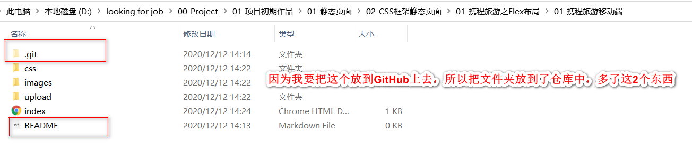
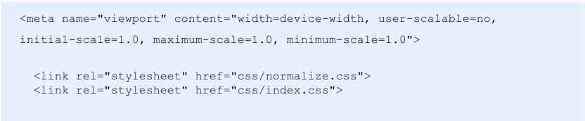
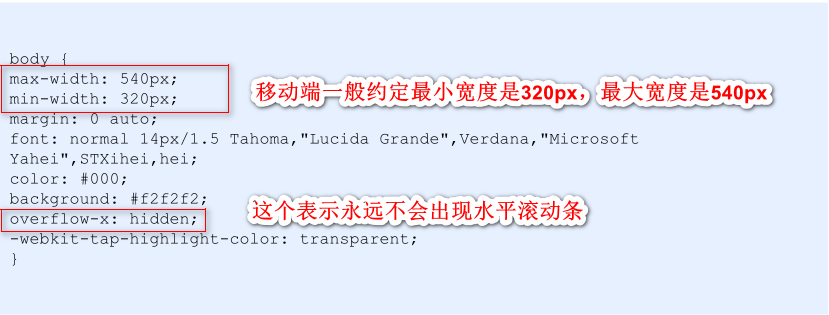
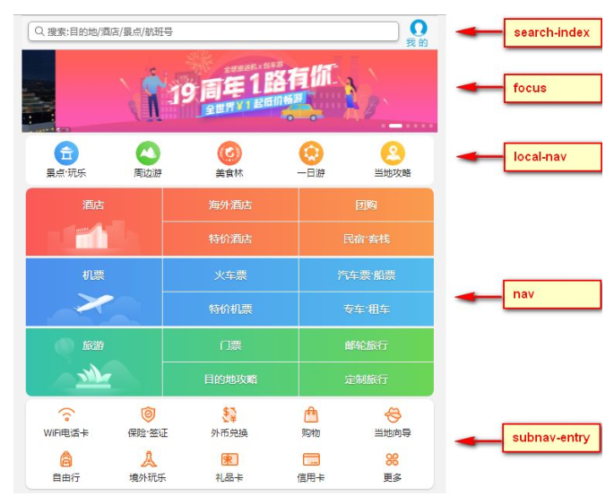
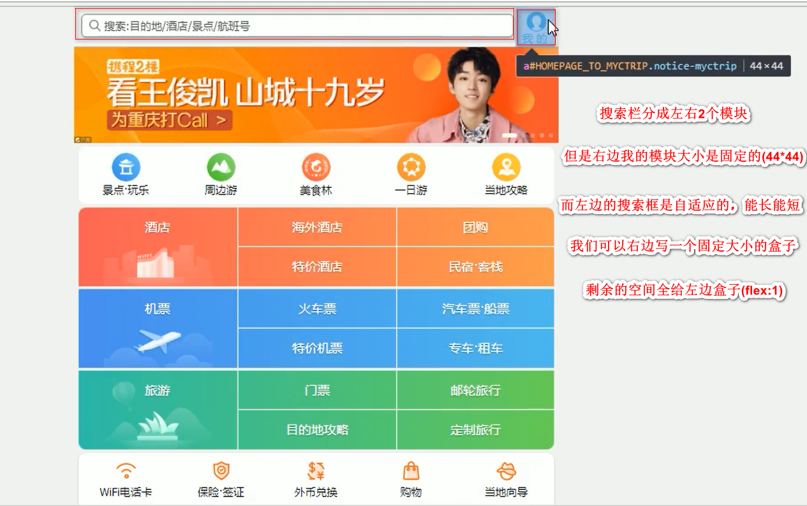
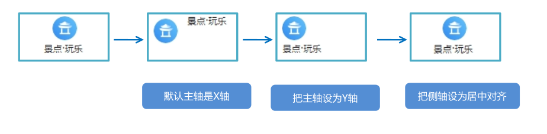

(注1：现在是2020年12月12日，抓紧时间把这个布局的项目实战看完啊，不能拖了。)

(视频地址：[黑马Flex布局](https://www.bilibili.com/video/BV1N54y1i7dG?p=1))

# 携程网首页案例制作

# [访问网址](https://m.ctrip.com/html5/)

## 技术选型

* 方案：我们采取单独制作移动页面方案
* 技术：布局采取Flex布局

## 搭建相关文件夹结构

## 设置视口标签以及引入初始化样式

## 常用初始化样式

[overflow-x](https://developer.mozilla.org/zh-CN/docs/Web/CSS/overflow-x)

## 常见模块命名

> 页面的宽度可以在不同的设备中进行缩放，但是高度是定死的，不变的。

## 搜索框模块(search-index)

[css里2倍精灵图的使用方法](https://blog.csdn.net/weixin_39295546/article/details/104709129)

* 我们先看右边的盒子，又分为上面一个盒子放图片，下面一个盒子放文字。
* 但是右边再放盒子挺麻烦的，我们用伪元素来写更简单。
* "我的"上面图片的大小是24*26,而且还是精灵图，于是我搜了一下2020年都快过去了，除了PS外有哪些方便的切图工具可以用了。我暂且下载了一个蓝湖的切图软件，下载了发现好像不行，我还是老老实实的先用PS或者Adobe Fireworks吧。

* 背景精灵图是2倍图，要分为3大步：
  * 第一步是缩放为原来一半
  * 第二步是测量出来图片坐标
  * 第三部是再放大2倍

* 量一下搜索框的高度为26px，并且设置div的盒子模型为`div{box-sizing: border-box;}`
* 左边的放大镜可以作为div的`::before`来做。

## 焦点图模块(focus)

* 给一个父盒子，把图片丢进去，把图片的宽度一定修改为和父亲一样宽即可。
* 这个其实是轮播图，但是老师就先只放了一张图片就算完成了。
* 老师说说以后讲PC端的时候再补上。

## 局部导航栏模块(local-nav)

* 一个大盒子里面装着5个小盒子，而且这5个小盒子大小宽度一样。
* 小盒子上面是图片，下面是文字，并且可以点击，采用`ul-li`的形式。
* 大盒子总体长度比焦点图模块要端一些。
* 先把大盒子设置好之后再去管小盒子。

### 常见Flex布局思路

> Flex默认主轴是X轴，所以会让所有元素一行显示。但是我们想让它们上下显示，于是我们把主轴设为Y轴即可。

## 主导航栏(nav)

* 大盒子里面包含3行，每行高度88px。
* 每一行又分成了3列，后面2列又分成上下2行。