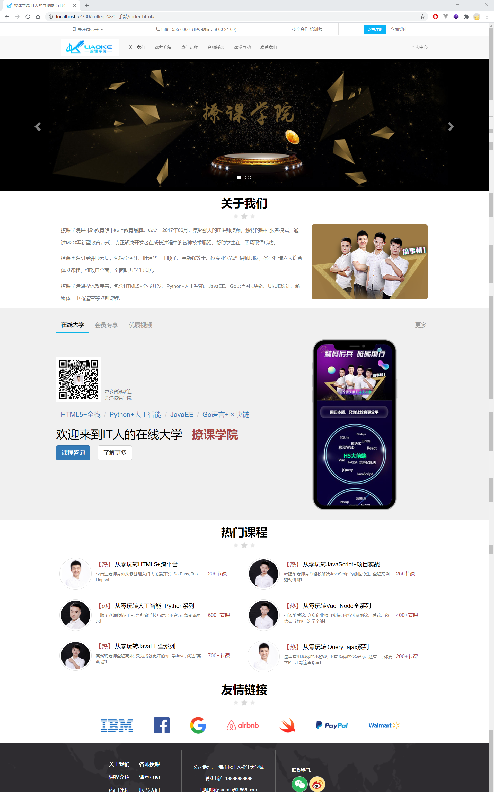

(注1：这个视频主要是老师通过做一个具体的网页讲述Bootstrap的知识的，主要时间都在写代码，所以笔记就比较少了。到时候会把里面的所有代码都写到笔记里面)

(注2：学了几天，发现Bootstrap是真的方便啊，很好用的CSS框架)

(注3：看的是撩课网的视频)

(注4：现在是2020年8月19日凌晨00：54，没想到拖拖拉拉弄了14天，2个星期才把Bootstrap看完。总共也就才46个视频，我也不知道自己是怎么看的这么慢的。搞到现在AJAX也还没看完，大概明天就可以看完了吧。)

(注5：主要是看视频利用Bootstrap技术做一个官网，所以笔记记的东西很少。)

# 认识Bootstrap

* Bootstrap是当下非常经典且流行的**前端框架**（界面工具集）；很多公司的**前后端项目**都有集成Boostrap！
* Bootstrap的特点：灵活简介、代码优雅、美观大方；用一句话概括简洁、直观、强悍的前端开发框架，让web开发更迅速、简单。
* GitHub：<https://github.com/twbs/bootstrap>
* 官网
  * http://www.bootcss.com/（中文网）
  * https://getbootstrap.com/（英文网）

Twitter公司的两名前端工程师Mark Otto和Jacob Thornton在2011年发起的一个内部开源项目，并利用业余时间完成了第一个版本的开发。

# 为什么要使用Bootstrap

* Bootstrap提供了一整套前后端（包括移动端需要的界面工具集合，能够让开发者快速搭建出美观的，可适配的前端界面！
* 生态圈火，不断地更新迭代；并且基于bootstrap衍生出来了很多其它的前端框架，比如：各种什么U（你懂得，老祖宗在这！）
* 提供一套美观大方地界面组件
* 提供一套优雅的HTML+CSS编码规范

> 注意：使用Bootstrap并不代表不用写CSS样式，Js代码，而是不用写所有通用的代码！

# 开始使用Bootstrap

* 下载安装Bootstrap

  * 方式一：`npm install bootstrap--save`

  ~~~
  （通过npm进行安装，适合工程化开发，比如集成到react或者Node项目中）
  ~~~

  * 方式二：[GitHub](<https://getbootstrap.com/#>)直接下载
    （适合起步，全面学习）

* Bootstrap初始化模版

~~~javascript
<!DOCTYPE html>
<html lang="en">

<head>
  <meta charset="UTF-8">
  <meta name="viewport" content="width=device-width, initial-scale=1.0">
  <title>页面标题</title>
  <!-- 引入Bootstrap核心样式文件(必须) -->
  <link rel="stylesheet" href="css/bootstrap.min.css">
  <!-- 引入Bootstrap默认主题样式(可选) -->
  <link rel="stylesheet" href="css/bootstrap.theme.min.css">
  <!-- 你自己的样式或其他文件 -->
  <link rel="stylesheet" href="example.css">
</head>

<body>
  <!-- 你的HTML结构 -->
  <!-- 以下代码，如果不适用JS插件则不需要 -->
  <!-- 由于Bootstrap的JS插件依赖jQuery，所以要引入jQuery -->
  
  <!-- 引入所有的Bootstrap的JS插件 -->
  
  <!--你自己的脚本文件-->
  
</body>

</html>
~~~

# 前端界面常用组件

（无数可复用的组件，包括字体图标、下拉菜单、导航、警告框、弹出框等更多功能）

* 按钮

~~~javascript
<button class="btn btn-danger">百度一下</button>
<button class="btn btn-warning">谷歌一下</button>
<button class="btn btn-success test">搜狗一下</button>
~~~

* 进度条

~~~javascript

    

        45% Complete
    

~~~

* 徽章

~~~javascript
<a href="#">Inbox 42</a>
~~~

* 面板

~~~javascript
 

     
面板的头部

     
面板的内容

     
面板的尾部

~~~

# 最终网页效果

# HTML代码

~~~javascript
<!DOCTYPE html>
<html lang="en">

<head>
    <meta charset="UTF-8">
    <meta http-equiv="X-UA-Compatible" content="IE=edge">
    <meta name="viewport" content="width=device-width, initial-scale=1.0">
    <title>撩课学院-IT人的自我成长社区</title>
    <!-- 引入Bootstrap核心样式文件(必须) -->
    <link rel="stylesheet" href="lib/bootstrap/css/bootstrap.min.css">
    <!-- 你自己的样式或其他文件 -->
    <link rel="stylesheet" href="css/index.css">
    <!-- 站点图标 -->
    <link rel="shortcut icon" href="imgs/lk_favicon.ico" type="image/x-icon">
</head>

<body>
    <!-- 头部开始了 -->
    <header id="lk_header">
        <!-- 上部分 -->
        

            

                

                    

                        <a href="" class="text-muted">
                            <i class="icon-phone"></i>
                            关注微信号
                            
                            
                        </a>
                    

                    

                        <i class="icon-tel"></i>
                        8888-555-6666（服务时间：9:00-21:00）
                    

                    

                        <a href="" class="text-muted">校企合作</a>
                        <a href="" class="text-muted">培训师</a>
                    

                    

                        <a class="btn btn-default text-muted btn-sm btn-register" href="#" role="button">免费注册</a>
                        <a href="#" role="button" class="text-muted" style="margin-left:10px;" data-toggle="modal"
                            data-target="#lk_login">立即登陆</a>
                    

                

            

        

        <!-- 下部分 -->
        <nav class="navbar navbar-default navbar-static-top navbar-lk">
            

                

                    <!-- 这个是页面变窄的时候显示的按钮 -->
                    <button type="button" class="navbar-toggle collapsed" data-toggle="collapse" data-target="#lk_nav"
                        aria-expanded="false">
                        Toggle navigation
                        
                        
                        
                    </button>
                    
                

                

                    <ul class="nav navbar-nav">
                        <li class="active"><a href="javascript:;">关于我们</a></li>
                        <li><a href="javaScript:;">课程介绍</a></li>
                        <li><a href="javaScript:;">热门课程</a></li>
                        <li><a href="javaScript:;">名师授课</a></li>
                        <li><a href="javaScript:;">课堂互动</a></li>
                        <li><a href="javaScript:;">联系我们</a></li>
                    </ul>

                    <ul class="nav navbar-nav navbar-right hidden-sm hidden-xs">
                        <li><a href="#">个人中心</a></li>
                    </ul>
                

            

        </nav>
    </header>
    <!-- 头部结束了 -->

    <!-- 轮播图开始了 -->
    <section id="lk_carousel" class="carousel slide" data-ride="carousel">
        <!-- 指示器 -->
        <ol class="carousel-indicators">
            <li data-target="#lk_carousel" data-slide-to="0" class="active"></li>
            <li data-target="#lk_carousel" data-slide-to="1"></li>
            <li data-target="#lk_carousel" data-slide-to="2"></li>
        </ol>

        <!-- 中间滚动的内容 -->
        

            

            

            

            

            

            

        

        <!-- 左右控制 -->
        <a class="left carousel-control" href="#lk_carousel" role="button" data-slide="prev">
            
            Previous
        </a>
        <a class="right carousel-control" href="#lk_carousel" role="button" data-slide="next">
            
            Next
        </a>
    </section>
    <!-- 轮播图结束了 -->

    <!-- 关于我们开始了 -->
    <section id="lk_about" class="hidden-xs hidden-sm">
        <!-- 标题 -->
        

            <h1><strong>关于我们</strong></h1>
            
        

        <!-- 主要内容 -->
        

            

                

                    

                        撩课学院是秣码教育旗下线上教育品牌。成立于2017年06月，集聚强大的IT讲师资源，独特的课程服务模式，通过M2O等新型教育方式，真正解决开发者在成长过程中的各种技术瓶颈，帮助学生在IT职场取得成功。
                    

                    
撩课学院明星讲师云集，包括李南江、叶建华、王顺子、高新强等十几位专业实战型讲师团队，悉心打造六大综合体系课程，细致且全面，全面助力学生成长。

                    
撩课学院课程体系完善，包含HTML5+全栈开发、Python+人工智能、JavaEE、Go语言+区块链、UI/UE设计、新媒体、电商运营等系列课程。

                

                

                    
                

            

        

    </section>
    <!-- 关于我们结束了 -->

    <!-- 产品特色开始了 -->
    <section id="lk_product">
        

            

                <!-- 头部选项 -->
                <ul class="nav nav-tabs" role="tablist">
                    <li role="presentation" class="active"><a href="#product1" aria-controls="home" role="tab"
                            data-toggle="tab">在线大学</a>
                    </li>
                    <li role="presentation"><a href="#product2" aria-controls="profile" role="tab"
                            data-toggle="tab">会员专享</a></li>
                    <li role="presentation"><a href="#product3" aria-controls="messages" role="tab"
                            data-toggle="tab">优质视频</a></li>
                    <li class="pull-right hidden-sm hidden-xs"><a href="#" aria-controls="settings" role="tab"
                            data-toggle="tab">更多</a></li>
                </ul>

                <!-- 展示的内容 -->
                

                    

                        

                            

                                

                                    <!-- 第一部分 -->
                                    

                                        

                                            <a href="#">
                                                
                                            </a>
                                        

                                        

                                            <h5 class="media-heading">更多资讯欢迎</h5>
                                            <h5 class="media-heading">关注撩课学院</h5>

                                        

                                    

                                    <!-- 第二部分 -->
                                    <ol id='pd_one_2' class="breadcrumb lead">
                                        <li><a href="#">HTML5+全栈</a></li>
                                        <li><a href="#">Python+人工智能</a></li>
                                        <li><a href="#">JavaEE</a></li>
                                        <li><a href="#">Go语言+区块链</a></li>
                                    </ol>
                                    <!-- 第三部分 -->
                                    <h1 id="pd_one_3">
                                        欢迎来到IT人的在线大学&nbsp;&nbsp;
                                        <strong class="text-danger">撩课学院</strong>
                                    </h1>
                                    <!-- 第四部分 -->
                                    

                                        <button class="btn btn-primary btn-lg" type="submit"
                                            style="margin-right: 20px;">课程咨询</button>
                                        <button class="btn btn-default btn-lg" type="submit">了解更多</button>
                                    

                                

                                

                                    
                                

                            

                        

                    

                    

                        

                            

                                

                                    
                                

                                

                                    <h1 class="text-warning">撩课学院会员</h1>
                                    
汇聚名师, 为你呈现前端、后端、移动端、大数据、人工智能等从零基础到项目实战连载课程内容。专属的会员社群和私人订制服务,
                                        1年365天持续更新课程全部免费学习!

                                

                            

                        

                    

                    

                        

                            

                                

                                    <h1><strong class="text-danger">案例驱动·体系贯穿·全面系统</strong></h1>
                                    <h3>
                                        10-15分钟的视频
                                        知识点拆分讲解
                                    </h3>
                                    <h4 class="text-muted" style="margin: 15px 0;">玩转HTML5+全栈系列, 玩转Python+人工智能系列,
                                        玩转JavaEE系列, 玩转Go+区块链系列</h4>
                                    

                                        已更新3000+视频 | 100000+人订阅
                                    

                                

                                

                                    
                                

                            

                        

                    

                

            

        

    </section>
    <!-- 产品特色结束了 -->

    <!-- 热门课程开始了 -->
    <section id="lk_hot">
        <!-- 标题 -->
        

            <h1><strong>热门课程</strong></h1>
            
        

        <!-- 内容 -->
        

            

                

                    

                        

                            
                        

                        

                            <h4 class="media-heading">
                                
                                    【热】
                                从零玩转HTML5+跨平台
                            </h4>
                            

                                李南江老师带你从零基础入门大前端开发, So Easy, Too Happy!
                            

                        

                        

                            206节课
                        

                    

                

                

                    

                        

                            
                        

                        

                            <h4 class="media-heading">
                                【热】
                                从零玩转JavaScript+项目实战
                            </h4>
                            

                                叶建华老师带你轻松解读JavaScript的前世今生, 全程案例驱动讲解!
                            

                        

                        

                            256节课
                        

                    

                

                

                    

                        

                            
                        

                        

                            <h4 class="media-heading">
                                【热】
                                从零玩转人工智能+Python系列
                            </h4>
                            

                                王顺子老师倾情打造, 各种奇淫技巧层出不穷, 赶紧到碗里来!
                            

                        

                        

                            600+节课
                        

                    

                

                

                    

                        

                            
                        

                        

                            <h4 class="media-heading">
                                【热】
                                从零玩转Vue+Node全系列
                            </h4>
                            

                                打通前后端, 真实企业项目实操, 内容涉及前端、后端、微信端, 让你一次学个够!
                            

                        

                        

                            400+节课
                        

                    

                

                

                    

                        

                            
                        

                        

                            <h4 class="media-heading">
                                【热】
                                从零玩转JavaEE全系列
                            </h4>
                            

                                高新强老师全程高能, 只为成就更好的你! 学Java, 就选"高薪墙"!
                            

                        

                        

                            700+节课
                        

                    

                

                

                    

                        

                            
                        

                        

                            <h4 class="media-heading">
                                【热】
                                从零玩转jQuery+ajax系列
                            </h4>
                            

                                这里有用JQ做的小游戏, 也有JQ做的QQ音乐, 还有...., 你要学的, 江哥这里都有!
                            

                        

                        

                            200+节课
                        

                    

                

            

        

    </section>
    <!-- 热门课程结束了 -->

    <!-- 友情链接开始了 -->
    <section id="lk_link">
        <!-- 标题 -->
        

            <h1><strong>友情链接</strong></h1>
            
        

        <ul class="logos">
            <li></li>
            <li></li>
            <li></li>
            <li></li>
            <li></li>
            <li></li>
            <li></li>
        </ul>
    </section>
    <!-- 友情链接结束了 -->

    <!-- 尾部开始了 -->
    <footer id="lk_footer">
        

            

                

                    

                        <ul class="col-md-6">
                            <li><a href="">关于我们</a></li>
                            <li><a href="">课程介绍</a></li>
                            <li><a href="">热门课程</a></li>
                        </ul>
                        <ul class="col-md-6">
                            <li><a href="">名师授课</a></li>
                            <li><a href="">课堂互动</a></li>
                            <li><a href="">联系我们</a></li>
                        </ul>
                    

                

                

                    <h5>公司地址: 上海市松江区松江大学城</h5>
                    <h5>联系电话: 18888888888</h5>
                    <h5>地址邮箱: admin@it666.com</h5>
                

                

                    <h5>联系我们:</h5>
                    <a href="">
                        
                        
                    </a>
                

            

        

    </footer>
    <!-- 尾部结束了 -->

    <!-- 登陆模态框开始了 -->
    

        

            

                

                    <button type="button" class="close" data-dismiss="modal" aria-label="Close">&times;</button>
                    <h4 class="modal-title" id="myModalLabel">登陆</h4>
                

                

                    <input type="text" placeholder="请输入手机号码">
                    <input type="password" placeholder="请输入密码">
                

                

                    <button type="button" class="btn btn-default" data-dismiss="modal">关闭</button>
                    <button type="button" class="btn btn-primary">登陆</button>
                

            

        

    

    <!-- 登陆模态框结束了 -->

    <!-- 以下代码，如果不适用JS插件则不需要 -->
    <!-- 由于Bootstrap的JS插件依赖jQuery，所以要引入jQuery -->
    
    <!-- 引入所有的Bootstrap的JS插件 -->
    
    <!--你自己的脚本文件-->
    
</body>

</html>
~~~

# CSS代码

~~~css
/************************************通用的样式************************************************/

body {
  font-size: 13px;
  font-family: "Helvetica Neue", Helvetica, Arial, sans-serif;
  color: #000;
}

/* 以下这么一大段是从http://blog.koalite.com/这个网站里生成的代码，作用是更改免费注册按钮的背景色 */
.btn-register {
  color: #ffffff;
  background-color: #0ab4f7;
  border-color: #f4f7f7;
}

.btn-register:hover,
.btn-register:focus,
.btn-register:active,
.btn-register.active,
.open .dropdown-toggle.btn-register {
  color: #ffffff;
  background-color: #086df2;
  border-color: #f4f7f7;
}

.btn-register:active,
.btn-register.active,
.open .dropdown-toggle.btn-register {
  background-image: none;
}

.btn-register.disabled,
.btn-register[disabled],
fieldset[disabled] .btn-register,
.btn-register.disabled:hover,
.btn-register[disabled]:hover,
fieldset[disabled] .btn-register:hover,
.btn-register.disabled:focus,
.btn-register[disabled]:focus,
fieldset[disabled] .btn-register:focus,
.btn-register.disabled:active,
.btn-register[disabled]:active,
fieldset[disabled] .btn-register:active,
.btn-register.disabled.active,
.btn-register[disabled].active,
fieldset[disabled] .btn-register.active {
  background-color: #0ab4f7;
  border-color: #f4f7f7;
}

.btn-register .badge {
  color: #0ab4f7;
  background-color: #ffffff;
}

/* 引入字体图标 */
@font-face {
  font-family: "icomoon";
  src: url("../fonts/lk.eot") format("embedded-opentype"),
    url("../fonts/lk.svg") format("svg"),
    url("../fonts/lk.ttf") format("truetype"),
    url("../fonts/lk.woff") format("woff");
}

/* 利用类似正则的东西来匹配类名：凡是以icon开头的我们都能用到里面的字体 */
/* ^=和*=是选择器的使用方式 */
[class^="icon-"],
[class*=" icon-"] {
  font-family: icomoon;
  font-style: normal;
}

#lk_about,
#lk_hot,
#lk_link {
  paddding: 20px 0;
}

#lk_about .title,
#lk_hot .title,
#lk_link .title {
  display: flex;
  flex-direction: column;
  justify-content: center;
  align-items: center;
  padding-bottom: 15px;
}
/************************************通用的样式************************************************/

/************************************头部的样式************************************************/

/* .top-bar {
  background-color: red;
} */

#lk_header {
}

#lk_header .top-bar {
  /* 网页上一般头部高度都是40，手机端是44 */
  height: 40px;
  border-bottom: 1px solid #5a4646;
  /* 因为有1像素撑掉了，39+1刚好是40 */
  line-height: 39px;
}

#lk_header .top-bar .container .row > div + div {
  border-left: 1px solid #e0e0e0;
}

#lk_header .top-bar .container .row .top-bar-1 a {
  position: relative;
}

#lk_header .top-bar .container .row .top-bar-1 a img {
  position: absolute;
  left: 50%;
  /* 图片宽度是130px */
  margin-left: -65px;
  display: none;
  margin-top: -10px;
  z-index: 9999;
}

#lk_header .top-bar .container .row .top-bar-1 a:hover img {
  display: block;
}
/* #lk_header .top-bar-1 {
  background-color: red;
}

#lk_header .top-bar-2 {
  background-color: blue;
}

#lk_header .top-bar-3 {
  background-color: yellow;
}

#lk_header .top-bar-4 {
  background-color: pink;
} */

/* 像这种有标识性的东西都放在伪元素里面 */
.icon-phone::before {
  content: "\e958";
  font-size: 13px;
}

.icon-tel::before {
  content: "\e942";
  font-size: 13px;
}

#lk_header .navbar-lk {
  border-bottom-color: #fff;
  margin-bottom: 0;
}

#lk_header .navbar-lk .navbar-brand {
  height: 70px;
  padding: 10px 15px;
}

#lk_header .navbar-lk .navbar-nav a {
  height: 70px;
  line-height: 40px;
}

#lk_header .navbar-lk .navbar-nav li.active a,
#lk_header .navbar-lk .navbar-nav li.active a:hover {
  background-color: transparent;
  border-bottom: 2px solid #0ab4e7;
}

#lk_header .navbar-lk .navbar-toggle {
  margin-top: 18px;
}
/************************************头部的样式************************************************/
/************************************焦点图的样式************************************************/
#lk_carousel {
}

#lk_carousel .item {
  background: no-repeat center center;

  -webkit-background-size: cover;
  background-size: cover;
}

@media screen and (min-width: 800px) {
  #lk_carousel .item {
    height: 410px;
  }
}
/************************************焦点图的样式************************************************/

/************************************关于我们的样式************************************************/

#lk_about .row p {
  line-height: 39px;
  font-size: 15px;
}
/************************************关于我们的样式************************************************/

/************************************产品特色的样式************************************************/
#lk_product {
  background-color: #f0f0f0;
  padding: 30px 0;
}

#lk_product .nav {
  font-size: 18px;
}

#lk_product .nav a {
  color: #999;
}

#lk_product .nav li.active a {
  border: none;
  background-color: transparent;
  border-bottom: 2px solid #0ab4e7;
  color: #000;
}

#lk_product .tab-content {
  padding-top: 20px;
}

#lk_product .pd-left {
  padding: 40px 0;
}

#pd_one_1 {
  margin: 15px 0;
}

#pd_one_2 {
  background-color: transparent;
}

#pd_one_4 {
  margin: 15px 0;
}

#lk_product #pd_two_1 {
  padding: 100px 0;
}

#lk_product #pd_two_1 h1 {
  margin-bottom: 15px;
}
/************************************产品特色的样式************************************************/

/************************************热门课程的样式************************************************/
#lk_hot .lesson {
  padding: 15px 10px;
}

#lk_hot .lesson .media-left {
  width: 20%;
}

#lk_hot .lesson .media-body {
  width: 60%;
  vertical-align: middle;
}

#lk_hot .lesson .media-right {
  width: 20%;
  text-align: left;
  font-size: 16px;
  vertical-align: middle;
}
/************************************热门课程的样式************************************************/

/************************************友情链接的样式************************************************/
#lk_link .logos {
  list-style: none;
  text-align: center;
}

#lk_link .logos li {
  display: inline-block;
  padding: 20px 30px;
}
/************************************友情链接的样式************************************************/

/************************************尾部的样式************************************************/
#lk_footer {
  width: 100%;
  height: 200px;
  background: url("../imgs/ft_bg.png") no-repeat center;
  -webkit-background-size: cover;
  background-size: cover;
  color: #fff;
  font-size: 16px;
}

#lk_footer ul {
  list-style: none;
}

#lk_footer .one,
#lk_footer .two {
  padding: 10px;
  border-right: 1px solid #666;
  height: 180px;
  display: flex;
  flex-direction: column;
  justify-content: center;
  align-items: center;
}

#lk_footer .three {
  padding: 10px 50px;
  height: 180px;
  display: flex;
  flex-direction: column;
  justify-content: center;
  align-items: flex-start;
}

#lk_footer .three a {
  margin-right: 15px;
  text-decoration: none;
}

#lk_footer .one li {
  line-height: 40px;
}

#lk_footer .one li a {
  color: #fff;
}
~~~

# JS代码

~~~javascript
$(function () {
  $(window).on("resize", function () {
    // 1.1 获取窗口的宽度
    let clientW = $(window).width();
    // console.log(clientW);

    // 1.2 设置临界值
    let isShowBigImage = clientW >= 800;

    // 1.3 获取所有的item
    let $allItems = $("#lk_carousel .item");
    // console.log($allItems);

    // 1.4 遍历
    $allItems.each(function (index, item) {
      // 1.4.1 取出图片的路径
      let src = isShowBigImage
        ? $(item).data("lg-img")
        : $(item).data("sm-img");
      let imgUrl = 'url("' + src + '")';

      // 1.4.2 设置背景
      $(item).css({
        backgroundImage: imgUrl,
      });

      // 1.4.3 设置img标签
      if (!isShowBigImage) {
        let $img = "";
        $(item).empty().append($img);
      } else {
        $(item).empty();
      }
    });
  });

  $(window).trigger("resize");

  // 2. 工具提示
  $('[data-toggle="tooltip"]').tooltip();

  // 3. 动态处理宽度
  $(window).on("resize", function () {
    let $ul = $("#lk_product .nav");
    let $allLis = $("[role='presentation']", $ul);
    // console.log($allLis);

    // 3.1 遍历
    let totalW = 0;
    $allLis.each(function (index, item) {
      totalW += $(item).width();
    });

    // console.log(totalW);

    let parentW = $ul.parent().width();

    // 3.2 设置宽度
    if (totalW > parentW) {
      $ul.css({
        width: totalW + "px",
      });
    } else {
      $ul.removeAttr("style");
    }
  });

  // 4. 导航处理
  let allLis = $("#lk_nav li");

  $(allLis[2]).on("click", function () {
    $("html,body").animate({ scrollTop: $("#lk_hot").offset().top }, 1000);
  });

  $(window).trigger("resize");
});
~~~

