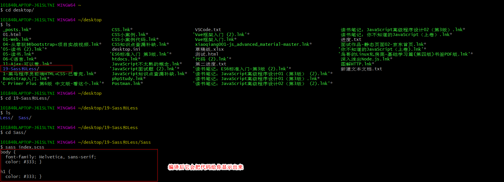
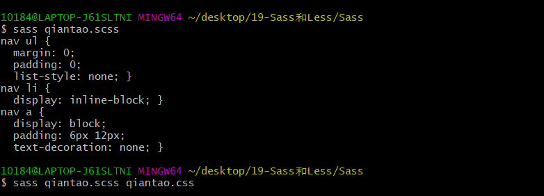
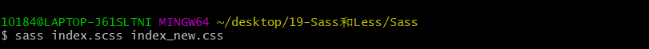
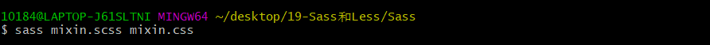
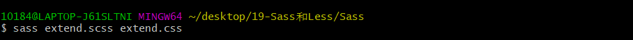
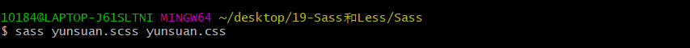
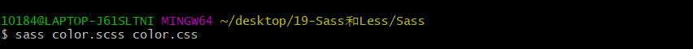

(注1：视频来自于[极客学院](<https://www.bilibili.com/video/BV15J411G7cM?from=search&seid=8175932445089464459>)和[麦子学院](<https://www.bilibili.com/video/av498821340?p=1>)，我两个视频都看了。除了这2个视频外，笔记的主要部分主要来自于官网。)

(注2：之前看视频的时候好像听哪个老师说过，Sass,Less这些很简单，就是CSS预处理器,你会CSS，也就会Sass,Less，没有什么学习成本的，所以我就打算快速的过一遍)

(Sass和Less属于预处理器，也叫前置处理器，有前置就有后置。[CSS预处理器和后处理器](https://www.cnblogs.com/cyn941105/p/5590239.html))

# CSS预处理器

CSS预处理器(CSS Preprocessor)，是一种构架于CSS之上的高级语言，可以通过脚本编译生成CSS代码，其目的是为了让CSS开发者的工作更简单有趣，当前已经进入了较为成熟的阶段，基本上新的web开发项目大都已普遍使用。

现在最主要的选择有：

* [SASS](https://baike.baidu.com/item/SASS) 2007年诞生，最早也是最成熟的CSS预处理器，拥有ruby社区的支持和compass这一最强大的css框架，目前受LESS影响，已经进化到了全面兼容CSS的SCSS，著名的Twitter Bootstrap就是采用SASS做底层语言的。(基于Ruby语言开发)
* [LESS](https://baike.baidu.com/item/LESS) 2009年出现，受SASS的影响较大，但又使用CSS的语法，让大部分开发者和设计师更容易上手，在ruby社区之外支持者远超过SASS，其缺点是比起SASS来，可编程功能不够，不过优点是简单和兼容CSS，反过来也影响了SASS演变到了SCSS的时代。(基于JavaScript语言开发)
* [Stylus](https://baike.baidu.com/item/Stylus)，2010年产生，来自Node.js社区，主要用来给Node项目进行CSS预处理支持，在此社区之内有一定支持者，在广泛的意义上人气还完全不如SASS和LESS。

# Sass介绍

[Sass官网](<https://sass.bootcss.com/>)

Sass 是世界上最成熟、稳定、强大的专业级 CSS 扩展语言。(官网原话)

# Sass的安装

## 安装Sass和Compass

`sass`基于`Ruby`语言开发而成，因此安装`sass`前需要[安装Ruby](http://rubyinstaller.org/downloads)。（注:mac下自带Ruby无需在安装Ruby!）

window下安装SASS首先需要安装`Ruby`，先从官网[下载Ruby](http://rubyinstaller.org/downloads)并安装。安装过程中请注意勾选`Add Ruby executables to your PATH`添加到系统环境变量。

> 国内网络下载很慢，基本下载不了，为了下载这个我特意花了5块钱买了一个月的VPN来下载。

# Sass十分钟入门

[sass十分钟入门](<http://cdn1.w3cplus.com/sassguide/#simple_intro>)

## 变量

sass中可以定义变量，方便统一修改和维护。

### CSS模式

~~~css
body {
  font-family: Helvetica, sans-serif;
  color: #333;
}
~~~

### 等价Sass模式

~~~scss
// 定义了2个变量：字体和颜色
$fontStack: Helvetica, sans-serif;
$primaryColor: #333;

//下面直接引用上面定义的2个变量就可以了
body {
  font-family: $fontStack;
  color: $primaryColor;
}

h1 {
  color: $primaryColor;
}
~~~

### .scss文件编译

## 嵌套

sass可以进行选择器的嵌套，表示层级关系，看起来很优雅整齐。

### CSS模式

~~~css
nav ul {
  margin: 0;
  padding: 0;
  list-style: none;
}

nav li {
  display: inline-block;
}

nav a {
  display: block;
  padding: 6px 12px;
  text-decoration: none;
}
~~~

### 等价Sass模式

~~~scss
nav {
  ul {
    margin: 0;
    padding: 0;
    list-style: none;
  }

  li { display: inline-block; }

  a {
    display: block;
    padding: 6px 12px;
    text-decoration: none;
  }
}
~~~

### .scss文件编译

## 导入

sass中如导入其他sass文件，最后编译为一个css文件，优于纯css的`@import`

### 被导入的.scss文件——叛徒投敌

~~~scss
// _reset.scss文件
html,
body,
ul,
ol {
   margin: 0;
   padding: 0;
}
~~~
### 接受导入的.scss文件——接受你投敌

~~~css
/* 导入_reset.scss,导入时reset前不需要写"_"的 */
@import "reset";

/* 这是index.scss文件 */
$fontStack: Helvetica, sans-serif;
$primaryColor: #333;

body {
  font-family: Helvetica, sans-serif;
  color: #333;
}

h1 {
  color: #333;
}
~~~

### .scss文件编译

index_new.css文件如下：

~~~css
html,
body,
ul,
ol {
  margin: 0;
  padding: 0; }

body {
  font-family: Helvetica, sans-serif;
  color: #333; }

h1 {
  color: #333; }

/*# sourceMappingURL=index_new.css.map */
~~~

## mixin

sass中可用mixin定义一些代码片段，且可传参数，方便日后根据需求调用。从此处理css3的前缀兼容轻松便捷。

### CSS模式

~~~css
.box-border {
  border: 1px solid #ccc;
  -webkit-box-sizing: border-box;
  -moz-box-sizing: border-box;
  box-sizing: border-box;
}
~~~

### 等价Sass模式

~~~scss
@mixin box-sizing ($sizing) {
    -webkit-box-sizing:$sizing;     
       -moz-box-sizing:$sizing;
            box-sizing:$sizing;
}
.box-border{
    border:1px solid #ccc;
    @include box-sizing(border-box);
}
~~~

### .scss文件编译

mixin.css文件如下：

~~~css
.box-border {
  border: 1px solid #ccc;
  -webkit-box-sizing: border-box;
  -moz-box-sizing: border-box;
  box-sizing: border-box;
}
~~~

## 扩展/继承

sass可通过`@extend`来实现代码组合声明，使代码更加优越简洁。

### CSS模式

~~~css
.message, .success, .error, .warning {
  border: 1px solid #cccccc;
  padding: 10px;
  color: #333;
}

.success {
  border-color: green;
}

.error {
  border-color: red;
}

.warning {
  border-color: yellow;
}
~~~

### 等价Sass模式

~~~scss
.message {
  border: 1px solid #ccc;
  padding: 10px;
  color: #333;
}

.success {
  @extend .message;
  border-color: green;
}

.error {
  @extend .message;
  border-color: red;
}

.warning {
  @extend .message;
  border-color: yellow;
}
~~~

### .scss文件编译

extend.css文件如下：

~~~css
.message, .success, .error, .warning {
  border: 1px solid #ccc;
  padding: 10px;
  color: #333; }

.success {
  border-color: green; }

.error {
  border-color: red; }

.warning {
  border-color: yellow; }

/*# sourceMappingURL=extend.css.map */
~~~

## 运算

sass可进行简单的加减乘除运算等。

### CSS模式

~~~css
.container {
  width: 100%;
}

article[role="main"] {
  float: left;
  width: 62.5%;
}

aside[role="complimentary"] {
  float: right;
  width: 31.25%;
}
~~~

### Sass模式

~~~scss
.container { width: 100%; }

article[role="main"] {
  float: left;
  width: 600px / 960px * 100%;
}

aside[role="complimentary"] {
  float: right;
  width: 300px / 960px * 100%;
}
~~~

### .scss文件编译

yunsuan.css文件如下：

~~~css
.container {
  width: 100%; }

article[role="main"] {
  float: left;
  width: 62.5%; }

aside[role="complimentary"] {
  float: right;
  width: 31.25%; }

/*# sourceMappingURL=yunsuan.css.map */
~~~

## 颜色

Sass中集成了大量的颜色函数，让变换颜色更加简单。

### CSS模式

~~~css
a {
  text-decoration: none;
  color: #0088cc;
}
a:hover {
  color: #006699;
}
~~~

### Sass模式

~~~scss
$linkColor: #08c;
a {
    text-decoration:none;
    color:$linkColor;
    &:hover{
      //将linkColor加深了10%
      color:darken($linkColor,10%);
    }
}
~~~

.scss文件编译

~~~scss
a {
  text-decoration: none;
  color: #08c; }
  a:hover {
    color: #006699; }

/*# sourceMappingURL=color.css.map */
~~~

## 辅助Sass的样式框架：Compass

[Compass介绍](<https://baike.baidu.com/item/Compass/2884186?fr=aladdin>)

[Compass官网](<http://compass-style.org/>)

Compass由SASS的核心团队成员Chris Eppstein创建，是一个非常丰富的样式框架，包括大量定义好的mixin，函数，以及对SASS的扩展。

# Less介绍

[Less快速入门](<https://less.bootcss.com/#%E6%A6%82%E8%A7%88>)

Less （Leaner Style Sheets 的缩写） 是一门向后兼容的 CSS 扩展语言。这里呈现的是 Less 的官方文档（中文版），包含了 Less 语言以及利用 JavaScript 开发的用于将 Less 样式转换成 CSS 样式的 Less.js 工具。

因为 Less 和 CSS 非常像，因此很容易学习。而且 Less 仅对 CSS 语言增加了少许方便的扩展，这就是 Less 如此易学的原因之一。

# Less十分钟入门

## 变量

变量允许我们单独定义一系列通用的样式，然后在需要的时候去调用。所以在做全局样式调整的时候我们可能只需要修改几行代码就可以了。

~~~less
@width: 10px;
@height: @width + 10px;

#header {
  width: @width;
  height: @height;
}
~~~

编译为：(编译语法是lessc)

~~~css
#header {
  width: 10px;
  height: 20px;
}
~~~

## 混合(Mixins)

混合（Mixin）是一种将一组属性从一个规则集包含（或混入）到另一个规则集的方法。假设我们定义了一个类（class）如下：

~~~css
.bordered {
  border-top: dotted 1px black;
  border-bottom: solid 2px black;
}
~~~

如果我们希望在其它规则集中使用这些属性呢？没问题，我们只需像下面这样输入所需属性的类（class）名称即可，如下所示：

~~~less
#menu a {
  color: #111;
  .bordered();
}

.post a {
  color: red;
  .bordered();
}
~~~

`.bordered` 类所包含的属性就将同时出现在 `#menu a` 和 `.post a` 中了。（注意，你也可以使用 `#ids` 作为 mixin 使用。）

##  嵌套(Nesting)

Less 提供了使用嵌套（nesting）代替层叠或与层叠结合使用的能力。假设我们有以下 CSS 代码：

~~~css
#header {
  color: black;
}
#header .navigation {
  font-size: 12px;
}
#header .logo {
  width: 300px;
}
~~~

用 Less 语言我们可以这样书写代码：

~~~less
#header {
  color: black;
  .navigation {
    font-size: 12px;
  }
  .logo {
    width: 300px;
  }
}
~~~

用 Less 书写的代码更加简洁，并且模仿了 HTML 的组织结构。

你还可以使用此方法将伪选择器（pseudo-selectors）与混合（mixins）一同使用。下面是一个经典的 clearfix 技巧，重写为一个混合（mixin） (`&` 表示当前选择器的父级）：

~~~less
.clearfix {
  display: block;
  zoom: 1;

  &:after {
    content: " ";
    display: block;
    font-size: 0;
    height: 0;
    clear: both;
    visibility: hidden;
  }
}
~~~

###  @规则嵌套和冒泡

@ 规则（例如 `@media` 或 `@supports`）可以与选择器以相同的方式进行嵌套。@ 规则会被放在前面，同一规则集中的其它元素的相对顺序保持不变。这叫做冒泡（bubbling）。

~~~less
.component {
  width: 300px;
  @media (min-width: 768px) {
    width: 600px;
    @media  (min-resolution: 192dpi) {
      background-image: url(/img/retina2x.png);
    }
  }
  @media (min-width: 1280px) {
    width: 800px;
  }
}
~~~

编译为：

~~~css
.component {
  width: 300px;
}
@media (min-width: 768px) {
  .component {
    width: 600px;
  }
}
@media (min-width: 768px) and (min-resolution: 192dpi) {
  .component {
    background-image: url(/img/retina2x.png);
  }
}
@media (min-width: 1280px) {
  .component {
    width: 800px;
  }
}
~~~

##  运算(Operations)

算术运算符 `+`、`-`、`*`、`/` 可以对任何数字、颜色或变量进行运算。如果可能的话，算术运算符在加、减或比较之前会进行单位换算。计算的结果以最左侧操作数的单位类型为准。如果单位换算无效或失去意义，则忽略单位。无效的单位换算例如：px 到 cm 或 rad 到 % 的转换。

~~~less
// 所有操作数被转换成相同的单位
@conversion-1: 5cm + 10mm; // 结果是 6cm
@conversion-2: 2 - 3cm - 5mm; // 结果是 -1.5cm

// conversion is impossible
@incompatible-units: 2 + 5px - 3cm; // 结果是 4px

// example with variables
@base: 5%;
@filler: @base * 2; // 结果是 10%
@other: @base + @filler; // 结果是 15%
~~~

乘法和除法不作转换。因为这两种运算在大多数情况下都没有意义，一个长度乘以一个长度就得到一个区域，而 CSS 是不支持指定区域的。Less 将按数字的原样进行操作，并将为计算结果指定明确的单位类型。

~~~less
@base: 2cm * 3mm; // 结果是 6cm
~~~

你还可以对颜色进行算术运算：

~~~less
@color: #224488 / 2; //结果是 #112244
background-color: #112244 + #111; // 结果是 #223355
~~~

不过，Less 提供的 [色彩函数](https://less.bootcss.com/functions/#color-operations) 更有使用价值。

###  calc() 特例

Released v3.0.0

为了与 CSS 保持兼容，`calc()` 并不对数学表达式进行计算，但是在嵌套函数中会计算变量和数学公式的值。

~~~less
@var: 50vh/2;
width: calc(50% + (@var - 20px));  // 结果是 calc(50% + (25vh - 20px))
~~~

##  转义(Escaping)

转义（Escaping）允许你使用任意字符串作为属性或变量值。任何 `~"anything"` 或 `~'anything'` 形式的内容都将按原样输出，除非 [interpolation](https://less.bootcss.com/features/#variables-feature-variable-interpolation)。

